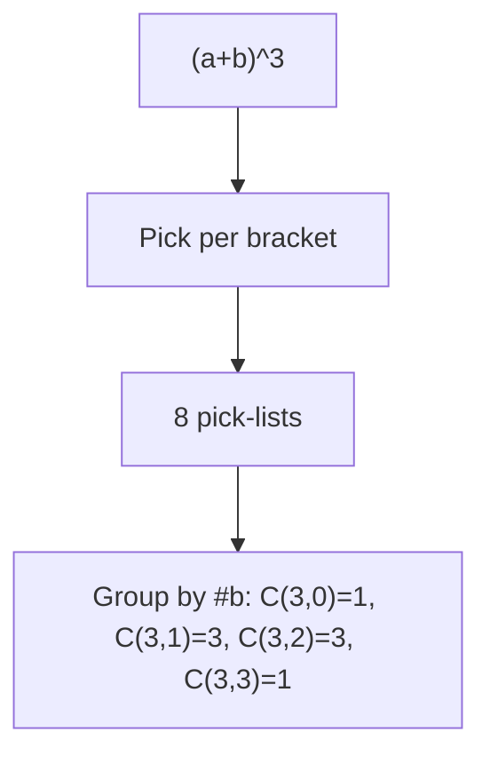
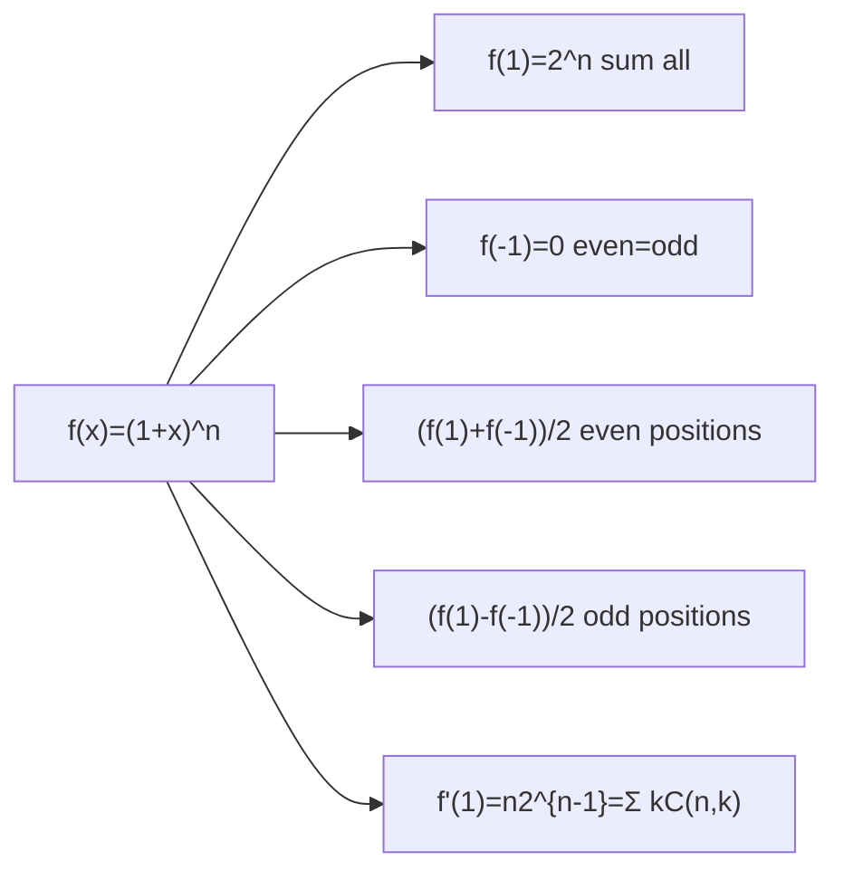
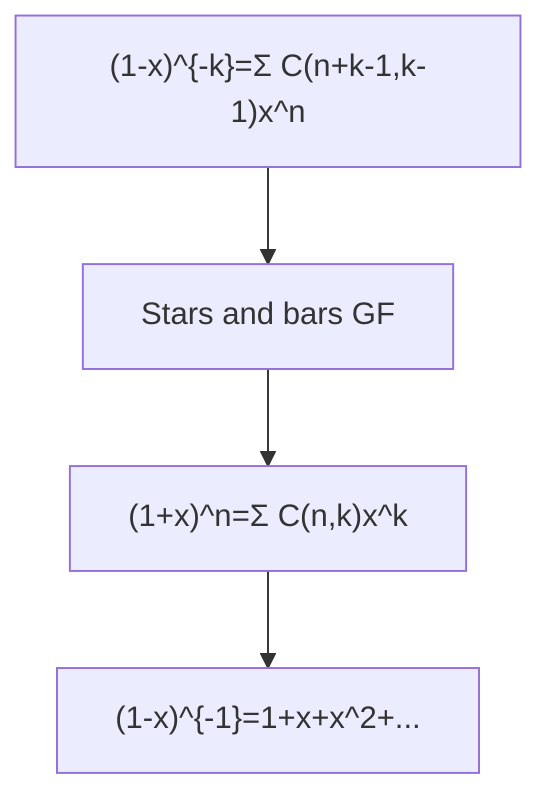

# Binomial Theorem — Well-Ordered Theory from Basics to Olympiad

> **Philosophy**: $(a+b)^n$ is not a formula to memorize — it's a census of pick-lists. Every identity is same set counted two ways.

---

## 1. What $(a+b)^n$ Counts

### 1.1 Expansion as Decision Tree

$n=3$: $(a+b)^3=(a+b)(a+b)(a+b)$ — pick one letter per bracket, multiply picks. $2×2×2=8$ pick-lists: $aaa$, $aab$, $aba$, $baa$, $abb$, $bab$, $bba$, $bbb$. Collect by # $b$'s: $\underbrace{aaa}_{0}$, $\underbrace{aab+aba+baa}_{1}$, $\underbrace{abb+bab+bba}_{2}$, $\underbrace{bbb}_{3}$.

> **⛁ First Principles**: $\binom{n}{k}$ = number of pick-lists with exactly $k$ $b$'s — choose which $k$ brackets contribute $b$, any set gives distinct list. So coefficient of $a^{n-k}b^k$ is $\binom{n}{k}$. No induction, no memorization — binomial theorem is census.

$$(a+b)^n = \sum_{k=0}^n \binom{n}{k} a^{n-k}b^k,\quad \binom{n}{k}=\frac{n!}{k!(n-k)!}$$

Row $n$ of Pascal's triangle *is* census for $(a+b)^n$.

**Two consequences**:

- **Symmetry**: Choosing $k$ brackets for $b$ same as choosing $n-k$ for $a$: $\binom{n}{k}=\binom{n}{n-k}$ — row reads same forwards/backwards.
- **Pascal's rule**: $\binom{n}{k}=\binom{n-1}{k-1}+\binom{n-1}{k}$ — condition on first bracket: if first contributed $b$, remaining $k-1$ from last $n-1$; if $a$, need all $k$ from those. Two disjoint cases, row built from above.

> **⚠ Trap**: Expanding $(2x-5)^7$ term-by-term wastes time, sign errors. Census gives every term directly: $k$-th term $\binom{7}{k}(2x)^{7-k}(-5)^k$, one line each. Always write general term.

### 1.2 Worked Examples

**S1**: Coeff of $x^4$ in $(2+x)^5$: term choosing $k$ $x$'s $\binom{5}{k}2^{5-k}x^k$, $k=4$ → $\binom{5}{4}2=10$. Whole expansion $32+80x+80x^2+40x^3+10x^4+x^5$, raw binomial $1,5,10,10,5,1$ row 5.

**S2**: Split row 8 even/odd positions equal. $f(x)=(1+x)^8=\sum\binom{8}{k}x^k$, $f(1)=2^8=256$ total, $f(-1)=\sum\binom{8}{k}(-1)^k=0$ → even=odd, each $2^7=128$. General $n\ge1$: $\sum_{even}\binom{n}{k}=\sum_{odd}\binom{n}{k}=2^{n-1}$. Row 8: $1,8,28,56,70,56,28,8,1$ evens $1+28+70+28+1=128$ ✓.

### 1.3 $2^n$ Identity, Proved Twice

$a=b=1$: $\sum\binom{n}{k}=2^n$ — sum counts equals total count.

> **💡 Sum of binomial coefficients is always counting story**: $\sum\binom{n}{k}$ counts subsets of $n$-set two ways: grouped by size (left) and element-by-element in/out (right $2^n$). Any binomial identity is same set counted twice.

**Engine 1 — substitution**: If $(px+q)^n=c_0+c_1x+\cdots+c_nx^n$, then $x=1$ → sum all $=(p+q)^n$, $x=0$ → $c_0=q^n$ constant term, $x=-1$ → alternating sum splits even/odd. No expansion — "sum of coefficients of $(2x-1)^7$" 10-sec question: $f(1)=(2-1)^7=1$.

**Engine 2 — bijection**: Map subset $S\subseteq[n]$ to $(|S|,S)$: grouping $2^n$ subsets by size gives row sum $\sum\binom{n}{k}$. Same idea with size mod 2 gives even/odd split via involution toggling element 1.

> **★ Olympiad Extension**: Almost every $\sum(\text{something})\binom{n}{k}=(\text{something else})$ resolved by naming set both sides: LHS counts with statistic, RHS directly. E.g., $\sum k\binom{n}{k}=n2^{n-1}$ counts committee with chair: chair first $n$, each other in/out $2^{n-1}$.

---

## 2. Coefficient Machinery

### 2.1 General Term

$(x+a)^n$: $T_{k+1}=\binom{n}{k}x^{n-k}a^k$, $k=0\dots n$ (careful $T_5$ is $k=4$).

$(px+q)^n$: $T_{k+1}=\binom{n}{k}(px)^{n-k}q^k$.

Middle term(s): $n$ even → $k=n/2$ unique peak; $n$ odd → $k=(n-1)/2,(n+1)/2$ two equal middle.

Numerically greatest term: $\frac{T_{k+1}}{T_k} = \frac{n-k+1}{k}\left|\frac{a}{x}\right|$ etc., increases then decreases.

### 2.2 JEE Advanced

Coeff of $x^m$ in $(1+x+x^2)^n$: write as $(1+x(1+x))^n$ or trinomial $\sum_{i+j+k=n}\frac{n!}{i!j!k!}1^i x^j (x^2)^k$ → $j+2k=m$.

$(1+x)^n(1+1/x)^n$: combine $( (1+x)^2/x)^n$.

Greatest coefficient: middle.

**Worked**: $(1+x)^{18}$, coeff $x^{2r}$ = $x^{r+6}$ equal → $\binom{18}{2r}=\binom{18}{r+6}$ → $2r=r+6$ or $2r+r+6=18$ → $r=6$ or $4$ — $r=6$ trivial same slot, exam loves hiding.

---

## 3. Three Identity Engines

### 3.1 Substitution

Evaluate polynomial at points.

- $f(x)=(1+x)^n$: $f(1)=2^n$ sum, $f(-1)=0$ even=odd, $\frac{f(1)\pm f(-1)}{2}$ even/odd sums.
- $f'(x)=n(1+x)^{n-1}$ → $f'(1)=n2^{n-1}=\sum k\binom{n}{k}$.

### 3.2 Bijection

Subset counting, committee with chair $k\binom{n}{k}=n\binom{n-1}{k-1}$.

$\sum k\binom{n}{k}=n2^{n-1}$ — choose chair first $n$, decide each other member $2^{n-1}$.

### 3.3 Double Counting

Vandermonde: $\sum_k \binom{r}{k}\binom{s}{n-k}=\binom{r+s}{n}$ — choose $n$ from $r+s$ split into $k$ from first $r$, $n-k$ from $s$.

$\sum \binom{n}{k}^2=\binom{2n}{n}$ — $r=s=n$.

---

## 4. Beyond Non-Negative Integer Powers

### 4.1 Negative Binomial

$(1+x)^{-n} = \sum_{k\ge0} (-1)^k\binom{n+k-1}{k}x^k$, $|x|<1$ — stars and bars GF.

$(1-x)^{-k} = \sum_{n\ge0}\binom{n+k-1}{k-1}x^n$.

Proof: $(1-x)^{-1}=1+x+x^2+\cdots$, $(1-x)^{-k}=((1-x)^{-1})^k$ → $k$ independent choices of exponent, stars and bars.

Infinite series, convergence $|x|<1$.

### 4.2 Multinomial

$(a+b+c)^n$: general term $\frac{n!}{i!j!k!}a^i b^j c^k$, $i+j+k=n$.

Number distinct terms after collecting: $\binom{n+2}{2}$ — solutions to $i+j+k=n$, stars and bars.

Raw products before collecting: $3^n$ pick-lists (3 choices per bracket).

**Example**: $(a+b+c)^6$ → $3^6=729$ raw products, $28$ collected terms.

---

## 5. Size, Growth and Extremes

### 5.1 Growth

$\binom{n}{k}$ increases to middle, unimodal: $\frac{\binom{n}{k+1}}{\binom{n}{k}}=\frac{n-k}{k+1}$ >1 iff $k<(n-1)/2$.

Largest coefficient: $k=n/2$ (even) or $(n±1)/2$ (odd, two equal).

$\binom{2n}{n}\sim\frac{4^n}{\sqrt{\pi n}}$ Stirling.

### 5.2 Inequalities

$\binom{n}{k}\le\frac{n^k}{k!}$, $\binom{n}{k}\ge(\frac{n}{k})^k$.

Bounding sums: e.g., $\sum_{k=0}^m\binom{n}{k}\le(\frac{en}{m})^m$ for $m\le n/2$.

### 5.3 JEE Adv

Greatest term in $(1+x)^n$ for given $x$: $T_{k+1}/T_k$ monotonic.

Greatest coefficient independent of $x$: middle.

---

## 6. Divisibility, Parity and Primes

### 6.1 Divisibility

$\binom{p}{k}\equiv0\pmod p$ for prime $p$, $0<k<p$ — numerator $p!$ has factor $p$, denominator $k!(p-k)!$ not.

$(1+x)^p\equiv1+x^p\pmod p$ — Freshman's dream mod p.

### 6.2 Lucas Theorem

$\binom{n}{k}\pmod p$ via base $p$ digits: if $n=n_0+n_1p+\cdots$, $k=k_0+k_1p+\cdots$, then $\binom{n}{k}\equiv\prod\binom{n_i}{k_i}\pmod p$.

So $\binom{n}{k}$ odd iff $k$'s binary digits ≤ $n$'s (no carry when adding $k$ and $n-k$) — $k$ submask of $n$.

### 6.3 Kummer & $v_p$

$v_p(n!)=\sum_{i\ge1}\lfloor n/p^i\rfloor$.

Kummer: $v_p(\binom{n}{k})$ = number of carries when adding $k$ and $n-k$ in base $p$.

$v_2(\binom{2n}{n})$ = number of 1's in binary of $n$ etc.

### 6.4 Olympiad

$\binom{2n}{n}$ not divisible by something, prime factorization, $\sum\binom{n}{k}$ parity, $\binom{2n}{n}$ even for $n>0$ (since middle term $2\binom{2n-1}{n-1}$? Actually $\binom{2n}{n}=2\binom{2n-1}{n-1}$? No, $\binom{2n}{n}= \frac{2n}{n}\binom{2n-1}{n-1}=2\binom{2n-1}{n-1}$? Wait $\binom{2n-1}{n-1}=\frac{n}{2n}\binom{2n}{n}$ → $\binom{2n}{n}=2\binom{2n-1}{n-1}$? Check: $\binom{2n-1}{n-1}=\frac{(2n-1)!}{(n-1)!n!}$, $\binom{2n}{n}=\frac{2n}{n}\frac{(2n-1)!}{n!(n-1)!}=2\binom{2n-1}{n-1}$ yes even for $n>0$).

---

*Well-ordered: pick-lists census → Pascal as table → $2^n$ via bijection → substitution engines $f(1),f(-1)$ → double counting Vandermonde → negative binomial stars and bars GF → growth unimodal → divisibility Lucas/Kummer.*
