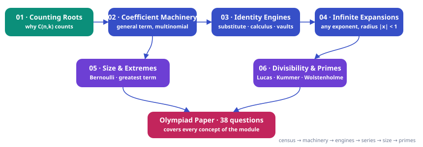

# Binomial-Theorem — Complete Course Notes

*Source: `binomial-theorem-mindmap.html` converted to Markdown with diagrams*

*JEE Advanced → Olympiad Ladder*

# Binomial Theorem

From "expanding a bracket is a census of choices" to Lucas' theorem, Kummer's carries and Wolstenholme's congruence — one idea, six layers deep. Every coefficient you will ever extract, every inequality you will ever prove with it, derived rather than memorised.

`6 chapters · basics → JEE Advanced → Olympiad` `15 worked examples (S1–S15)` `47 practice questions (P1–P47, verified answers)` `38-question Olympiad paper + full solutions`

### ⚡ One file · whole course (mind map)

All pages above combined into a **single recursive mind map** — every chapter → section → subtopic → question → answer expandable in place, one click at a time. Generated by `python3 tools/build-mindmap.py Binomial-Theorem`; never hand-edit it.

[Open binomial-theorem-mindmap.html →](#course-map)

### ★ How to use these notes

**Read in order — do not skip the "why" boxes.** Each chapter is built in layers: *concept → first-principles reasoning → JEE theory → Olympiad extension*.

- **Colored boxes** — First Principles = the actual reasoning; Key Idea = the takeaway technique; Common Trap = the classic mistake; Olympiad Extension = the frontier version.
- **Questions are placed in context** — a solved example right after the technique that solves it, plus practice sets with difficulty tags: [JEE Main] [JEE Adv] [Olympiad]
- **The Olympiad paper at the end** (38 questions) is the exam: attempt it after Chapter 6, without solutions. The [solution key](#solutions) is separate and complete.

### ▣ The roadmap

The logical skeleton of the module. A left-to-right chain of the six chapters with the exam paper at the bottom: counting is the root, the machinery and engines are the trunk, the infinite expansions and estimates are the branches, divisibility is the Olympiad canopy.

**Diagram**

### 1–6 Chapters

[ Chapter 1 · What you can count What $(a+b)^n$ Counts The expansion as a census of bracket choices; Pascal's triangle proved by conditioning; the $2^n$ identity by bijection; substitution for coefficient sums. (P1–P8) ](#chapter-1) [ Chapter 2 · One line per question The Coefficient Machinery General term $T_{k+1}$, constant terms via the exponent equation, middle terms, equal-coefficient branches, multinomial coefficients, peak locations. (P9–P16) ](#chapter-2) [ Chapter 3 · Three engines Three Identity Engines Substitute, differentiate/integrate the master polynomial, and extract the $x^n$ slot: Vandermonde, hockey-stick, weighted sums — derived, never memorised. (P17–P25) ](#chapter-3) [ Chapter 4 · Any exponent Beyond Non-Negative Integer Powers Generalised binomial coefficients, negative and fractional series, validity conditions, series recognition, certified decimal approximations. (P26–P33) ](#chapter-4) [ Chapter 5 · Bounds that prove things Size, Growth and Extremes Truncation as proof: Bernoulli, trapping $e$ in $[2,3)$, greatest terms by the ratio walk, modular sieves, conjugate floors. (P34–P40) ](#chapter-5) [ Chapter 6 · The canopy Divisibility, Parity and Primes The prime-row lemma, Freshman's Dream, Legendre, Kummer's carries, Lucas' theorem, the parity fractal, roots-of-unity filters, Wolstenholme. (P41–P47) ](#chapter-6)

### ∑ Exam paper

[ The Capstone Olympiad-Level Paper — 38 Questions Eight sections (A–H) ramping JEE Main → Advanced → Olympiad: coefficient vaults, identity engines, validity traps, and the Lucas/Kummer frontier. ](#olympiad-paper) [ Attempt first, then open Full Solutions Key Complete step-by-step solutions for all 38 questions — method name first, then the derivation, then a check. Every numeric answer verified by pure-Python computation. ](#solutions) [ One file · whole course Binomial Theorem mind map Generated by `tools/build-mindmap.py` — rebuild after any content change. ](#course-map)

### ! One-page mindset

> **⛁ First Principles — the only rule of the game**
>
> **Every coefficient of $(a+b)^n$ is a number of ways, never a formula to recall.** $\binom nk$ counts the pick-lists; the binomial coefficients of $(px^r + qx^s)^n$ count the same pick-lists weighted; sums of coefficients count weighted objects of *all* sizes; divisibility questions ask how many copies of a prime the counting carries. When stuck, return to the census: name the set being counted, and the identity writes itself. The infinite-binomial chapter is the only exception to the counting story — and there the replacement rule is "a series is only its value inside its radius."

> **⚠ Common Trap — the mistakes this module punishes**
>
> Four recurring own goals: (i) $T_k$ vs $T_{k+1}$ indexing — "5th term" is $k=4$; (ii) forgetting the second branch when solving $\binom nr = \binom ns$ ($r = s$ *or* $r+s = n$); (iii) expanding $(3+2x)^{-2}$ without factoring, or quoting a series outside $|\frac{2x}{3}| \lt 1$; (iv) "vanishes mod $p$" with a composite exponent — the Freshman's Dream is a prime-only licence. Each trap costs full marks on its question; none costs more than one habit to fix.

## Roadmap

- **Chapter 1**: Ch 1 · What (a+b)^n Counts — 5 sections · 10 questions
- **Chapter 2**: Ch 2 · The Coefficient Machinery — 5 sections · 11 questions
- **Chapter 3**: Ch 3 · Three Identity Engines — 4 sections · 12 questions
- **Chapter 4**: Ch 4 · Beyond Non-Negative Integer Powers — 4 sections · 11 questions
- **Chapter 5**: Ch 5 · Size, Growth and Extremes — 3 sections · 8 questions
- **Chapter 6**: Ch 6 · Divisibility, Parity and Primes — 4 sections · 10 questions
- **Olympiad Paper**: Olympiad Paper · 38 questions — 
- **Solutions**: Olympiad Paper · Solutions & marking guide
