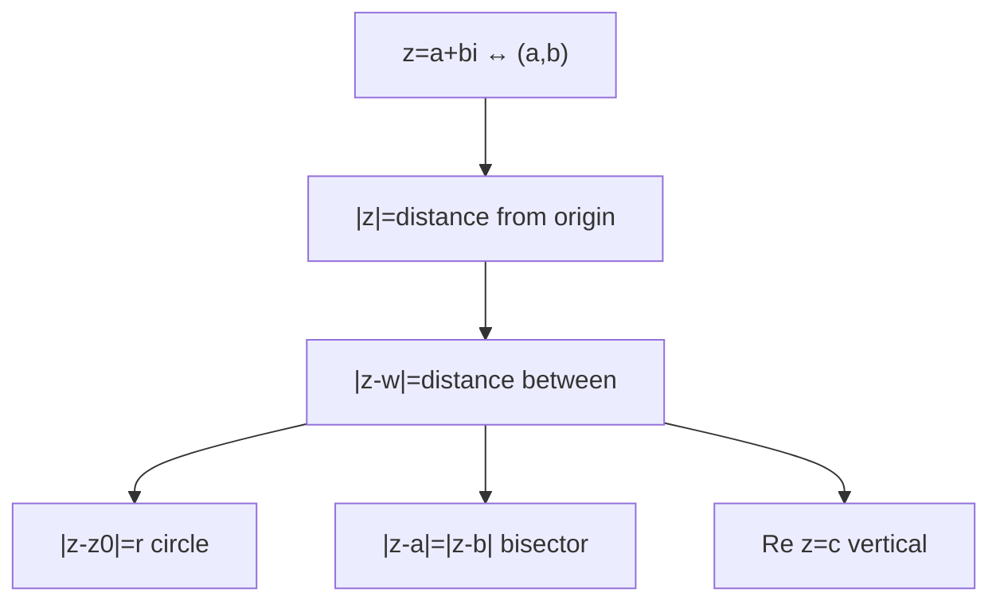
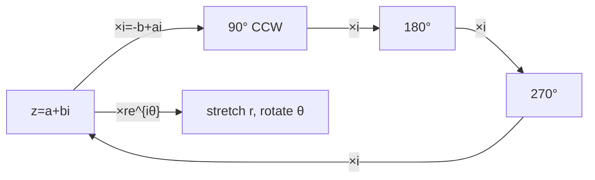
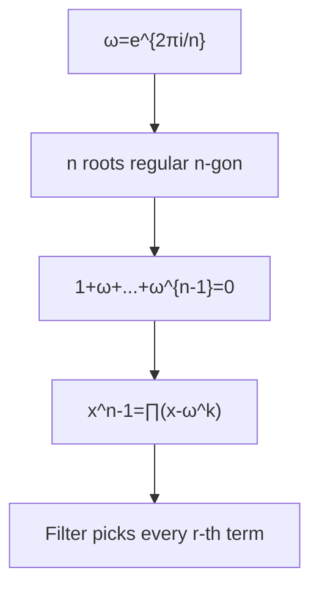

# Complex Numbers — Well-Ordered Theory from Basics to Olympiad

> **Philosophy**: One axiom $i^2=-1$, everything else forced by distributivity. Two languages: algebra $a+bi$ ↔ geometry $(a,b)$.

---

## 1. Foundations — Algebra & Plane

### 1.1 Why $i$ has to exist

$x^2+bx+c=0$ → $x=\frac{-b\pm\sqrt{b^2-4c}}{2}$. Fails when $b^2<4c$, needs $\sqrt{-3}$.

Introduce $i$, $i^2=-1$. Complex number $z=a+bi$, $a=\text{Re}z$, $b=\text{Im}z$ (not $bi$).

**Arithmetic forced**:
$(a+bi)(c+di)=ac+adi+bci+bdi^2=(ac-bd)+(ad+bc)i$ — no freedom.

Equality componentwise: $a+bi=c+di \iff a=c,b=d$.

**History**: Cardano 1545 cubic forced $\sqrt{-1}$, Bombelli 1556 rules, Descartes "imaginary", Euler $i$.

> **💡 Only axiom $i^2=-1$** — re-derive forgotten rules by expanding and reducing $i^2$.

**Worked**: $(3+2i)(5-i)=15-3i+10i-2i^2=17+7i$ — watch $-2i^2=+2$ sign flip, most common slip.

### 1.2 Conjugate, Division, Field

$\bar z = a-bi$ — reflection in real axis.

$z+\bar z=2\text{Re}z$, $z-\bar z=2i\text{Im}z$, $z\bar z=a^2+b^2\ge0$, $=0\iff z=0$.

**Division trick derived**: $w\bar w=c^2+d^2\in\mathbb R_{>0}$ → $\frac{z}{w}=\frac{z\bar w}{|w|^2}$, $\frac{1}{a+bi}=\frac{a-bi}{a^2+b^2}$. Conjugate = denominator-killer.

**Worked**: $\frac{1+2i}{3-i}=\frac{(1+2i)(3+i)}{10}=\frac{1+7i}{10}$.

> **⛁ No zero divisors → field**: $zw=0\Rightarrow z=0$ or $w=0$. Proof: if $w\neq0$, $z(w\bar w)=0\Rightarrow z|w|^2=0\Rightarrow z=0$. So all algebra (factoring, quadratic formula) works in $\mathbb C$.

**Quadratic now always works**: $x^2+bx+c=0$ has two roots $\frac{-b\pm\sqrt{b^2-4c}}{2}$ — needs every complex has square root (proved in Ch2 polar).

**Exam flavor — cycle of $i$**: $i,-1,-i,1$ period 4, $i^n=i^{n\bmod4}$, $(1+i)^2=2i$ → $(1+i)^{40}=(2i)^{20}=2^{20}$.

### 1.3 Complex Plane — Geometry Lives

$z=a+bi\leftrightarrow(a,b)$, addition = vector addition, parallelogram law.

Modulus $|z|=\sqrt{a^2+b^2}$, $|z|^2=z\bar z$, distance $|z-w|=\sqrt{(a-c)^2+(b-d)^2}$.

**Loci table**:
| Condition | Meaning |
|-----------|---------|
| $|z-z_0|=r$ | circle center $z_0$ radius $r$ |
| $|z-z_0|<r$ | interior |
| $|z-a|=|z-b|$ | perp bisector of $ab$ |
| $\text{Re}z=c$ | vertical line $x=c$ |
| $\text{Im}z=d$ | horizontal line $y=d$ |
| $|z-a|+|z-b|=2k$ | ellipse foci $a,b$ |
| $|z-a|=k|z-b|$ $k\neq1$ | Apollonius circle |

> **⛁ Triangle inequality**: $|z+w|\le|z|+|w|$ — three points $0,z,z+w$ form triangle, side ≤ sum other two. Equality when same direction (non-negative real multiple) or one zero. Reverse: $||z|-|w||\le|z-w|$.

> **💡 Parallelogram law**: $|z+w|^2+|z-w|^2=2|z|^2+2|w|^2$ — sum squares diagonals = sum squares sides. Proof: $|z\pm w|^2=(z\pm w)(\bar z\pm\bar w)=|z|^2+|w|^2\pm(z\bar w+\bar zw)$, add cancels cross. JEE Advanced workhorse for minimizing $|z|^2+|z-2|^2$.

Midpoint $\frac{z_1+z_2}{2}$.

**Worked loci**: $|z-3i|=4$ → circle $(0,4)$ radius 4; $|z+1|=|z-2|$ → $\text{Re}z=1/2$ vertical line.

**JEE Adv**: $|z|=1$, min $|z-3-4i|$: closest point on unit circle to $3+4i$ distance 5 from origin → $|z-(3+4i)|\ge|3+4i|-|z|=4$, equality $z=\frac{3+4i}{5}$ same direction. Min 4.

### 1.4 Multiplication Stretches and Rotates

> **⛁ $|zw|=|z||w|$**: $|zw|^2=zw\overline{zw}=z\bar z w\bar w=|z|^2|w|^2$ → sqrt.

Consequences: dividing scales by $1/|w|$, $|\frac{z_1-a}{z_2-a}|=1$ says equidistant from $a$.

**×$i$ = quarter-turn**: $i(a+bi)=-b+ai$, $(a,b)\to(-b,a)$, length preserved $a^2+b^2$, dot product $-ab+ab=0$ → $90°$, $(1,0)\mapsto(0,1)$ CCW. So ×$(-1)$=180°, ×$(-i)$=90° clockwise. General $zw$ = rotation by $\arg w$ + stretch $|w|$ — Ch2 makes angle explicit.

> **💡 Two languages, one object**: Algebraic fast exact, geometric sees structure. Method: translate to language that makes visible, solve, translate back. Later chapters: polar = rotation angle explicit, roots of unity = regular polygons algebraic.

**Solve $iz=\bar z$**: $z=a+bi$, $iz=-b+ai$, $\bar z=a-bi$ → $-b=a$, $a=-b$ same condition → $z=a(1-i)$, $a\in\mathbb R$ line $y=-x$. Geometry: rotate $90°$ gives mirror in real axis → line $-45°$.

**Min $|z+i|$ with $|z|=2$**: reverse triangle $|z+i|\ge||z|-|i||=1$, equality opposite directions $z=-2i$, min 1.

### 1.5 Bridge — Where Course Goes

$x^2+x+1=0$ → $x=\frac{-1\pm i\sqrt3}{2}$, $|x|=1$, product 1 sum -1, conjugates, primitive cube roots $\omega,\omega^2$, $1+\omega+\omega^2=0$.

$x^2+1=(x-i)(x+i)$ — irreducible over reals splits over $\mathbb C$. General picture every polynomial splits → Fundamental Theorem of Algebra (black box).

| Chapter | New translation rule |
|---------|----------------------|
| 2 Polar & De Moivre | $z=r(\cos\theta+i\sin\theta)$: stretch $r$, rotation $\theta$, $(\cos\theta+i\sin\theta)^n=\cos n\theta+i\sin n\theta$, $n$ $n$-th roots regular polygon |
| 3 Roots of unity | $\omega$, $1+\omega+\cdots+\omega^{n-1}=0$, $x^n-a$, filter $\frac{1}{n}\sum\zeta^{-rj}$ for every $r$-th term binomial sums |
| 4 JEE Adv core | Exam taxonomy: equations in $z$, $\arg z$, $|z-a|=k|z-b|$ circles, locus machinery, optimization via triangle inequality |
| 5 Geometry via complex | Points as complex, Ptolemy, van Aubel, cyclicity, regular polygons one-line algebra — Olympiad weapon |
| 6 Synthesis & paper | 30+ Q paper covering all, with solutions |

> **⚠ Mistake checklist**: $-2i^2=+2$ sign, $\text{Im}(3+4i)=4$ not $4i$, $\frac{z_1}{z_2}=1$ means $z_1=z_2$ but $|\frac{z_1}{z_2}|=1$ only equal lengths, $|z-a|=r$ center at $a$ (minus points to center), $\bar{\bar z}=z$, $\overline{z_1z_2}=\bar z_1\bar z_2$, $\overline{z_1+z_2}=\bar z_1+\bar z_2$ — conjugation respects $+$ and $\cdot$, may conjugate entire equations.

---

## 2. Polar Form & De Moivre

### 2.1 Polar

$z=r(\cos\theta+i\sin\theta)$, $r=|z|$, $\theta=\arg z$, $-\pi<\theta\le\pi$ principal.

Multiplication: $r_1r_2(\cos(\theta_1+\theta_2)+i\sin(\theta_1+\theta_2))$ — stretch multiply, angles add.

Division: $\frac{r_1}{r_2}(\cos(\theta_1-\theta_2)+i\sin(\theta_1-\theta_2))$.

### 2.2 De Moivre

$(\cos\theta+i\sin\theta)^n=\cos n\theta+i\sin n\theta$ — induction via multiplication rule.

Powers: $(r(\cos\theta+i\sin\theta))^n=r^n(\cos n\theta+i\sin n\theta)$.

$n$-th roots of $a=Re^{i\Phi}$: $r=R^{1/n}$, $\theta=(\Phi+2k\pi)/n$, $k=0,\dots,n-1$ → regular $n$-gon on circle radius $r$.

**Example**: Cube roots of $1$: $1$, $\frac{-1\pm i\sqrt3}{2}$.

---

## 3. Roots of Unity

### 3.1 Structure

$\omega=e^{2\pi i/n}$, $\omega^n=1$, $n$ distinct roots.

$1+\omega+\cdots+\omega^{n-1}=0$ — geometric series or sum of vertices of regular polygon = 0 (center of mass).

Primitive: $\omega^k$ primitive iff $\gcd(k,n)=1$, $\varphi(n)$ primitives.

### 3.2 Factorizations

$x^n-1=\prod_{k=0}^{n-1}(x-\omega^k)$.

$x^n-a$: roots $a^{1/n}\omega^k$.

$x^2+x+1=0$ → $\omega,\omega^2$ primitive cube, $1+\omega+\omega^2=0$, $\omega^3=1$, $\bar\omega=\omega^2$.

### 3.3 Filter — Olympiad Weapon

$\frac{1}{n}\sum_{j=0}^{n-1}\zeta^{-rj}\zeta^{jk} = 1$ if $k\equiv r\pmod n$ else $0$, where $\zeta=e^{2\pi i/n}$.

So sum every $r$-th binomial coefficient: $\sum_{k\equiv r\pmod n}\binom{n}{k} = \frac{1}{n}\sum_{j=0}^{n-1}\zeta^{-rj}(1+\zeta^j)^n$.

**Example**: Sum of $\binom{n}{k}$ with $k\equiv0\pmod3$.

---

## 4. JEE Advanced Core

### 4.1 Equations in $z$

$z$, $\bar z$, $|z|$, $\text{Re}z$, $\text{Im}z$ — write $z=x+iy$, solve system, or use $\bar z$ elimination.

**Purely imaginary**: $\text{Re}=0$ → $z+\bar z=0$.

### 4.2 $\arg$ Conditions

$\arg\frac{z-a}{z-b}=\theta$ → arc of circle (locus of points seeing segment $ab$ under angle $\theta$), excluding $a,b$.

$\arg(z-a)=\theta$ → ray from $a$ angle $\theta$.

### 4.3 Apollonius Circle

$|z-a|=k|z-b|$, $k\neq1$ → circle (Apollonius). $k=1$ → perpendicular bisector.

Proof: $|z-a|^2=k^2|z-b|^2$ → $(1-k^2)|z|^2 + \cdots$ → circle.

### 4.4 Optimization via Triangle Inequality

- Min $|z-a|$ subject to $|z|=r$: $||a|-r|$ via $||z|-|a||\le|z-a|$ and $|z-a|\ge||a|-|z||$.
- Min $|z-a|+|z-b|$: ellipse, min $=|a-b|$ if $z$ on segment.
- Parallelogram law for $|z|^2+|z-a|^2$ etc.

---

## 5. Geometry via Complex Numbers

### 5.1 Encoding

Points $z_1,z_2,z_3$, collinearity $\frac{z_1-z_2}{z_1-z_3}\in\mathbb R$, perpendicular $\in i\mathbb R$, concyclicity cross-ratio real, rotation $e^{i\theta}(z-a)+a$.

Section formula: $\frac{mz_2+nz_1}{m+n}$.

### 5.2 Theorems One-Line

- **Ptolemy**: For cyclic quadrilateral $ABCD$, $AC·BD = AB·CD + AD·BC$ — via complex $a,b,c,d$ on unit circle, $(a-c)(b-d) = (a-b)(c-d)+(a-d)(b-c)$ up to modulus.
- **van Aubel**: Squares on sides, segments joining centers...
- **Regular $n$-gon**: $1+\omega+\cdots+\omega^{n-1}=0$.

### 5.3 Complex Bash — Olympiad Weapon

Encode figure as complex numbers on unit circle, use $z\bar z=|z|^2$ to eliminate $\bar z$ (since $|z|=1$ → $\bar z=1/z$), compute intersections via formula, prove concyclicity via cross-ratio real.

**Method**: Choose convenient origin, set circumcircle as unit circle, let $a,b,c$ with $|a|=|b|=|c|=1$, express other points.

---

## 6. Synthesis & Paper

38 questions A–H, from $i$ cycle $(1+i)^{40}$ to geometry via complex, with full solutions.

Attempt 4–5 hours without solutions.

---

*Well-ordered: $i^2=-1$ → arithmetic forced → conjugate kills denominator → plane distance → multiplication = rotation → polar → De Moivre → roots of unity regular polygon → filter → JEE loci → geometry bash.*
