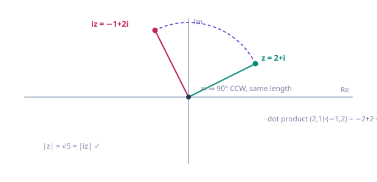

# Chapter 1 — Ch 1 · Foundations — Algebra & the Plane

*5 sections · 8 questions*

*Chapter 1 · Foundations*

# Complex Numbers: Algebra & the Plane

From the equation $x^2 = -1$ that has no answer, to a two-dimensional algebra where *multiplication is rotation*. Nothing is a convention to memorize: every rule is forced by one choice, $i^2 = -1$, and everything geometric follows from the arithmetic (and vice versa).

`definition & arithmetic` `conjugate` `modulus` `complex plane` `distance & loci` `triangle inequality` `multiplication = rotation`

### 1.1 Why $i$ has to exist — the dead end, and its fix

Solving $x^2 + bx + c = 0$ ends with the quadratic formula: 
$$ x = \frac{-b \pm \sqrt{b^2 - 4ac}}{2}. $$
 The formula works *until the discriminant is negative*. Try $x^2 + x + 1 = 0$: $\Delta = 1 - 4 = -3$, and the formula stops mid-sentence, asking for $\sqrt{-3}$. This is not a defect of this one equation — **every** $x^2 + bx + c$ with $b^2 &lt; 4c$ hits the wall. The quadratic, the most basic polynomial, has equations that the real numbers refuse to solve.

> **⛁ First Principles — the definition, and why the arithmetic is forced**
>
> Introduce one new symbol $i$ with exactly one property: 
> $$ i^2 = -1. $$
>  A **complex number** is a real linear expression in $i$: 
> $$ z = a + bi \qquad (a, b \in \mathbb R), $$
>  read "a plus b i". Here $a$ is the **real part** ($\operatorname{Re} z$) and $b$ the **imaginary part** ($\operatorname{Im} z$) — note the imaginary part is $b$, *not* $bi$.
>
>
> Why does the arithmetic "just work"? Because there is no freedom left. Addition is componentwise. For multiplication, take two complex numbers, expand with the distributive law, and use $i^2 = -1$: 
> $$ (a + bi)(c + di) = ac + adi + bci + bdi^2 = (ac - bd) + (ad + bc)i. $$
>  **That formula is not a rule you chose — it is forced** by distributivity plus $i^2 = -1$. The whole algebra of complex numbers is the closure of the real numbers under "keep expanding and reducing $i^2$ to $-1$." Once you internalize that, there are no arithmetic conventions to remember at all.

**Equality is componentwise.** $a + bi = c + di \iff a = c$ and $b = d$ (a complex number *is* the ordered pair $(a,b)$ with that multiplication). In particular $a + bi = 0 \iff a = 0$ and $b = 0$ — the two parts are independent, and this fact will quietly settle many "solve for $z$" problems.

**History in one line.** Cardano's 1545 formula for cubics forced computations with $\sqrt{-1}$ even when the final answer was real; Bombelli worked out the rules (1556) and they produced correct answers; Descartes derisively named them "imaginary"; Euler settled on the notation $i$ (for *imaginarius*) in the late 1700s. The name never caught up with the reality: complex numbers are as concrete as any algebraic object — they are the reals with one extra element adjoined.

> **💡 Key Idea — the only axiom is $i^2 = -1$**
>
> Everything in this chapter — the product rule, the conjugate trick, the modulus, the geometry — is a *consequence* of (a) distributivity and (b) $i^2 = -1$. When you forget a rule, re-derive it by expanding and reducing $i^2$.

**Worked — the first computation.** Multiply $(3+2i)(5-i)$: 
$$ (3+2i)(5-i) = 15 - 3i + 10i - 2i^2 = 15 + 7i + 2 = 17 + 7i. $$
 Watch the last step: $-2i^2 = -2(-1) = +2$. That sign flip is the single most common slip in complex arithmetic.

#### **P1**[JEE Main][practice][arithmetic]Simplify [formula] .

Simplify $(1+2i)^2 + \dfrac{3-i}{i}$.

Answer + Reasoning

$(1+2i)^2 = 1 + 4i + 4i^2 = -3 + 4i$. For the fraction, note $\frac{1}{i} = -i$ (since $i \cdot (-i) = -i^2 = 1$): $\frac{3-i}{i} = (3-i)(-i) = -3i + i^2 = -1 - 3i$.

Sum: $(-3 + 4i) + (-1 - 3i) = \mathbf{-4 + i}$.

### 1.2 The conjugate, division, and why $\mathbb C$ is a field

Complex numbers add, subtract and multiply cleanly. The one operation that would be awkward — **division** — is fixed by one elegant device: the **conjugate**.

**Definition.** The conjugate of $z = a + bi$ is 
$$ \bar z = a - bi. $$
 Geometric meaning (proved in 1.3): conjugation is *reflection in the real axis*. First, the identities that make $\bar z$ indispensable — each is a one-line multiplication:

$$z + \bar z = 2\operatorname{Re} z \qquad z - \bar z = 2i\,\operatorname{Im} z$$ $$z\,\bar z = a^2 + b^2 \ge 0,\ \text{ with equality iff } z = 0$$

**The division trick, derived (not recited).** You want $\frac{z}{w}$ with $w = c + di \ne 0$. The obstruction: the denominator is not real. Notice what the conjugate does to it: 
$$ w\,\bar w = (c+di)(c-di) = c^2 + d^2 \in \mathbb R,\quad &gt; 0. $$
 Multiplying top and bottom by $\bar w$ is therefore *the* move — it converts a complex denominator into a positive real one: 
$$ \frac{z}{w} = \frac{z\,\bar w}{w\,\bar w} = \frac{z\,\bar w}{|w|^2}.
    \qquad\text{In particular } \frac{1}{a+bi} = \frac{a-bi}{a^2+b^2}. $$
 **This is why the conjugate exists in the first place**: it is the denominator-killer.

**Worked — a full division.** 
$$ \frac{1+2i}{3-i} = \frac{(1+2i)(3+i)}{(3-i)(3+i)} = \frac{3 + i + 6i + 2i^2}{9 + 1}
    = \frac{1 + 7i}{10} = \frac{1}{10} + \frac{7}{10}i. $$
 The denominator came out $c^2 + d^2 = 10$ — real, positive, done.

> **⛁ First Principles — no zero divisors, hence a field**
>
> **Claim:** $zw = 0 \implies z = 0$ or $w = 0$.
>
>
> **Proof.** Suppose $w \ne 0$. Multiply the equation by $\bar w$: 
> $$ z(w\bar w) = 0 \cdot \bar w = 0 \implies z\,|w|^2 = 0. $$
>  But $|w|^2 = w\bar w &gt; 0$ is an ordinary real number, so dividing by it gives $z = 0$. $\square$
>
>
> With no zero divisors and every nonzero element invertible (the formula above), $\mathbb C$ is a **field**: the four operations behave exactly like they do for reals, so all of algebra — factoring, completing the square, the quadratic formula — runs inside $\mathbb C$ without exception. That is the structural payoff of adjoining $i$.

> **📌 Note — the quadratic formula now always works**
>
> Over $\mathbb C$, $x^2 + bx + c = 0$ always has two roots: $x = \frac{-b \pm \sqrt{b^2-4c}}{2}$. The only thing this claims is that every complex number has a square root — the statement that needs proof. Chapter 2 (polar form) proves it geometrically in one picture, and then "every quadratic splits" becomes automatic. (The full force — every *polynomial* splits — is the Fundamental Theorem of Algebra, used as a black box in later chapters.)

> **🏛 Exam flavor — the cycle of $i$**
>
> Powers of $i$ cycle with period 4: $i, -1, -i, 1, i, \dots$. So $i^n = i^{\,n \bmod 4}$. A JEE favorite pattern: $(1+i)^2 = 2i$, hence 
> $$ (1+i)^{40} = \big((1+i)^2\big)^{20} = (2i)^{20} = 2^{20}\, i^{20}
>       = 2^{20}(i^4)^5 = 2^{20} = 1{,}048{,}576. $$
>  The trick is always: **reduce the base first, then the exponent mod 4**.

#### **P2**[JEE Main][practice][conjugate · division]Compute [formula] .

Compute $\left(\dfrac{1+i}{1-i}\right)^3$.

Answer + Reasoning

Conjugate the denominator: $\frac{1+i}{1-i} = \frac{(1+i)^2}{(1-i)(1+i)}
        = \frac{1 + 2i + i^2}{1 - i^2} = \frac{2i}{2} = i$. Hence the cube is $i^3 = \mathbf{-i}$.

#### **P3**[JEE Adv][practice][real/imaginary parts]Find all [formula] for which [formula] is purely imaginary.

Find all $z \in \mathbb C$ for which $2\bar z - 3z$ is purely imaginary.

Answer + Reasoning

Write $z = a + bi$: $\bar z = a - bi$. Then $2\bar z - 3z = 2(a-bi) - 3(a+bi) = -a - 5bi$.

Purely imaginary $\iff$ real part $0$ $\iff a = 0$. So $z$ must be **purely imaginary** (including $z = 0$): the whole imaginary axis.

### 1.3 The complex plane — where geometry lives

Plot $z = a + bi$ as the point $(a, b)$ — real part on the horizontal axis, imaginary part on the vertical. This is not a decorative choice: **addition of complex numbers is exactly vector addition**, componentwise: 
$$ (a+bi) + (c+di) = (a+c) + (b+d)i. $$
 The picture is the parallelogram law you already know from vectors, and everything below is the consequence: the modulus is a *distance*, and "distance language" solves entire families of problems.

**Modulus.** 
$$ |z| = \sqrt{a^2 + b^2} $$
 is the distance from the origin to the point $z$. It ties the two languages together in one identity, proved in 1.2: 
$$ |z|^2 = z\,\bar z. $$
 From now on, $z\bar z$ and $|z|^2$ are the same object written twice.

**Distance between two points.** If $z = a+bi$ and $w = c+di$, then 
$$ |z - w| = \sqrt{(a-c)^2 + (b-d)^2} $$
 — the ordinary distance between their points, since $z - w = (a-c) + (b-d)i$. This one formula is the engine of every locus problem in the subject:

| Condition | Geometric meaning |
| --- | --- |
| $\|z - z_0\| = r$ | circle, center $z_0$, radius $r$ |
| $\|z - z_0\| &lt; r$ | interior of that circle |
| $\|z - a\| = \|z - b\|$ | perpendicular bisector of segment $ab$ |
| $\operatorname{Re} z = c$ | vertical line $x = c$ |
| $\operatorname{Im} z = d$ | horizontal line $y = d$ |
| $\|z - a\| + \|z - b\| = 2k \ (k &gt; \|a-b\|/2)$ | ellipse with foci $a, b$ |
| $\|z - a\| = k\|z - b\|\ (k \ne 1)$ | circle (Apollonius circle) |

**Diagram**

> **⛁ First Principles — the triangle inequality, proved geometrically**
>
> **Theorem.** 
> $$ |z + w| \le |z| + |w| \qquad \text{for all } z, w \in \mathbb C. $$
>  **Proof.** The three points $0$, $z$, $z+w$ form a (possibly degenerate) triangle: the side from $0$ to $z+w$ is the vector $z+w$, the other two sides are the vectors $z$ and $w = (z+w) - z$. A side of a triangle is never longer than the sum of the other two: $|z+w| \le |z| + |w|$. Equality holds exactly when the triangle degenerates with $z$ and $w$ pointing the *same way* (one a non-negative real multiple of the other), or when one is $0$. $\square$
>
>
> **The reverse form.** From $|z| = |(z-w) + w| \le |z-w| + |w|$ and the symmetric argument: 
> $$ |\,|z| - |w|\,| \le |z - w|. $$
>  Geometric meaning: the difference of two distances between two fixed points is bounded by the distance between them. Both forms will do the work in optimization problems (minimizing $|z - a|$ subject to $|z| = r$, and friends).

> **💡 Key Idea — the parallelogram law (a two-line JEE workhorse)**
>
> **Claim.** 
> $$ |z + w|^2 + |z - w|^2 = 2|z|^2 + 2|w|^2. $$
>  **Algebraic proof.** Using $|u|^2 = u\bar u$: 
> $$ |z \pm w|^2 = (z \pm w)(\bar z \pm \bar w) = |z|^2 + |w|^2 \pm (z\bar w + \bar z w), $$
>  and adding the two, the cross terms $z\bar w + \bar z w$ cancel. $\square$
>
>
> **Geometry.** In the parallelogram spanned by $z, w$, $z+w$ and $z-w$ are the diagonals: *sum of squares of the diagonals = sum of squares of the four sides*. JEE Advanced loves to hide this law inside a "minimize $|z|^2 + |z-2|^2$…" style problem — recognize the diagonals and stop computing.

**Midpoint.** Componentwise, $\frac{z_1 + z_2}{2}$ is the midpoint of the segment $z_1z_2$ — another reason the "vector" intuition is the right one.

**Worked — reading loci off the page.**

- $|z - 3i| = 4$: distance from $3i$ (the point $(0,4)$) is $4$ → a circle centered at $(0,4)$ with radius $4$.
- $|z + 1| = |z - 2|$: distance from $-1$ equals distance from $2$ → the perpendicular bisector of the segment from $-1$ to $2$ → the vertical line $\operatorname{Re} z = \frac12$.

#### **P4**[JEE Adv][practice][triangle inequality · geometry]If [formula] , find the minimum of [formula] . At which [formula] is it attain…

If $|z| = 1$, find the minimum of $|z - 3 - 4i|$. At which $z$ is it attained?

Answer + Reasoning

Geometrically: $z$ ranges over the unit circle; we want the closest point on it to $3+4i$, which sits at distance $|3+4i| = 5$ from the origin. The closest point is the one on the segment from the origin to $3+4i$: 
$$ |z - (3+4i)| \ge |3+4i| - |z| = 5 - 1 = 4, $$
 with equality when $z$ points the same way as $3+4i$: $z = \frac{3+4i}{5}$.

**Minimum $= 4$**, attained at $z = \frac35 + \frac45 i$.

#### **P5**[JEE Main][practice][parallelogram law]For [formula] and [formula] , compute both sides of [formula] and verify the i…

For $z = 3+4i$ and $w = 1-2i$, compute both sides of $|z+w|^2 + |z-w|^2 = 2|z|^2 + 2|w|^2$ and verify the identity numerically.

Answer + Reasoning

$|z|^2 = 25$, $|w|^2 = 5$, so RHS $= 2(25) + 2(5) = 60$.

$z+w = 4+2i \Rightarrow |z+w|^2 = 16 + 4 = 20$; $\ z-w = 2+6i \Rightarrow
        |z-w|^2 = 4 + 36 = 40$. LHS $= 20 + 40 = 60$. ✓ — and notice you never needed to "know" the formula: both sides are just sums of $a^2+b^2$.

#### **P6**[warm-up][practice][real/imaginary parts]Solve for [formula] : [formula] and [formula] .

Solve for $z$: $\ \ z + \bar z = 4$ and $\ z - \bar z = 6i$.

Answer + Reasoning

Add the equations: $2z = 4 + 6i$, so $z = 2 + 3i$. (Check: $z+\bar z = 4$ ✓, $z - \bar z = 6i$ ✓.) This is the whole method: $z + \bar z = 2\operatorname{Re}z$, $z - \bar z = 2i\operatorname{Im}z$ — two linear equations in the two parts.

### 1.4 Multiplication stretches and rotates — the subject in one picture

The most important fact in the entire subject, and the first thing worth proving:

> **⛁ First Principles — $|zw| = |z|\,|w|$**
>
> **Proof.** 
> $$ |zw|^2 = (zw)\,\overline{(zw)} = zw\,\bar z\,\bar w
>       = (z\bar z)(w\bar w) = |z|^2\,|w|^2, $$
>  since multiplication is commutative. Taking (non-negative) square roots: $|zw| = |z|\,|w|$. $\square$
>
>
> Consequences: dividing by $w$ scales distances by $\frac{1}{|w|}$; and $\left|\frac{z_1 - a}{z_2 - a}\right| = 1$ says $z_1$ and $z_2$ are equidistant from $a$. That last one — a ratio of distances being $1$ — is how perpendicular bisectors appear in "algebraic" problems.

**Multiplication by $i$ is a quarter-turn.** Compute: 
$$ i(a + bi) = -b + ai, $$
 so the point $(a, b)$ goes to $(-b, a)$. Verify the geometry directly: **Length preserved:** $(-b)^2 + a^2 = a^2 + b^2$ (or: $|iz| = |i||z| = |z|$). **Angle $90^\circ$:** the dot product $(a, b)\cdot(-b, a) = -ab + ab = 0$. **Orientation:** $(1,0) \mapsto (0,1)$, so the turn is *counterclockwise*. Hence $\times i$ = rotate $90^\circ$ CCW about the origin; $\times(-1)$ = $180^\circ$; $\times(-i)$ = $90^\circ$ clockwise. A general product $zw$ is then a rotation by (some angle) plus a stretch by $|w|$ — in Chapter 2 the "some angle" becomes $\arg w$ and this sentence turns into a formula.

**Diagram**

> **💡 Key Idea — two languages, one object**
>
> **Algebraic** ($a+bi$, $\bar z$, $|z|$): fast, exact, no drawing. **Geometric** (points, distances, rotations): sees structure, solves loci and optimization instantly. The working method for JEE Advanced and Olympiad problems: *translate the problem into the language that makes it visible*, solve there, translate back. Every later chapter is a new translation rule (polar form = the rotation angle made explicit; roots of unity = regular polygons made algebraic).

#### **P7**[JEE Adv][practice][algebra ↔ geometry]Solve [formula] in [formula] . Describe the solution set geometrically.

Solve $iz = \bar z$ in $\mathbb C$. Describe the solution set geometrically.

Answer + Reasoning

Algebra: write $z = a + bi$. Then $iz = -b + ai$ and $\bar z = a - bi$. Equality forces $-b = a$ and $a = -b$ — the same condition. So $z = a - ai = a(1 - i)$ for arbitrary $a \in \mathbb R$ (including $a = 0$).

Geometry: the solutions are exactly the points on the line $y = -x$ through the origin. Notice the symmetry: $iz = \bar z$ says "rotating $z$ by $90^\circ$ gives its mirror in the real axis" — that is exactly the line at $-45^\circ$.

#### **P8**[Olympiad][practice][reverse triangle inequality]If [formula] , find the minimum of [formula] .

If $|z| = 2$, find the minimum of $|z + i|$.

Answer + Reasoning

Reverse triangle inequality: $|z + i| \ge \big||z| - |i|\big| = |2 - 1| = 1$.

Equality holds when $z$ and $i$ point in *opposite* directions (the degenerate-triangle case with opposite orientation): $z = -2i$. Indeed $|-2i + i| = |-i| = 1$. **Minimum $= 1$**, attained at $z = -2i$.

Same shape as P4 with the roles of the circle and the point swapped — the inequality $|u+v| \ge ||u|-|v||$ is the tool that closes both.

### 1.5 The bridge — where this course is going

Solve the equation that opened this chapter: 
$$ x^2 + x + 1 = 0 \implies x = \frac{-1 \pm \sqrt{-3}}{2} = \frac{-1 \pm i\sqrt3}{2}. $$
 Two facts to notice, both of which become theorems in Chapter 3:

- **They sit on the unit circle:** $\left|\frac{-1 \pm i\sqrt3}{2}\right| = \frac{\sqrt{1+3}}{2} = 1$.
- **Their product is $1$ and their sum is $-1$** (Vieta), so the two roots are conjugates, and each is the cube of the other's inverse — they are the two *primitive cube roots of unity*, usually named $\omega$ and $\omega^2$, with the all-purpose identity $1 + \omega + \omega^2 = 0$.

Meanwhile $x^2 + 1 = (x - i)(x + i)$: a "quadratic irreducible over the reals" splits completely once $i$ is present. The general picture — **every polynomial splits over $\mathbb C$** — is the Fundamental Theorem of Algebra, and it is what makes complex numbers the natural home of polynomial equations. The chapters ahead:

| Chapter | The new translation rule |
| --- | --- |
| 2 · Polar form & De Moivre | $z = r(\cos\theta + i\sin\theta)$: the stretch $r$ and the rotation angle $\theta$ separated; $(\cos\theta + i\sin\theta)^n = \cos n\theta + i\sin n\theta$; every $z$ has exactly $n$ n-th roots, a regular polygon. |
| 3 · Roots of unity | $\omega$ and its siblings: the regular-$n$-gon structure, $1+\omega+\cdots+\omega^{n-1}=0$, factorizations of $x^n - a$, and the filter $\frac{1}{n}\sum_j \zeta^{-rj}$ for "every r-th term" binomial sums. |
| 4 · JEE Advanced core | the exam's problem taxonomy: equations in $z$, $\arg z$ conditions, $\|z-a\| = k\|z-b\|$ circles, locus machinery, and optimization via the triangle inequality. |
| 5 · Geometry via complex numbers | encode points of a figure as complex numbers; Ptolemy, van Aubel, cyclicity and regular polygons become one-line algebra — the standard Olympiad weapon. |
| 6 · Synthesis & paper | a 30+ question paper covering all of the above, with full solutions. |

> **⚠ Mistake checklist (read before every problem)**
>
> - $i^2 = -1$, so **$-2i^2 = +2$** — the sign that silently breaks most arithmetic.
> - The imaginary part of $3 + 4i$ is $4$, *not* $4i$.
> - $\frac{z_1}{z_2} = 1$ means $z_1 = z_2$; $\left|\frac{z_1}{z_2}\right| = 1$ means only *equal lengths*. Don't drop the modulus accidentally.
> - $|z - a| = r$ has center at $a$ — the *minus* inside the modulus points to the center, not to a reflection.
> - $\bar{\bar z} = z$, but $\overline{z_1 z_2} = \bar z_1\,\bar z_2$ and $\overline{z_1 + z_2} = \bar z_1 + \bar z_2$ — conjugation respects $+$ and $\cdot$, so you may conjugate entire equations.

---

