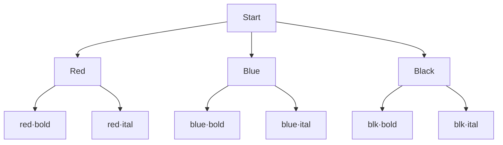
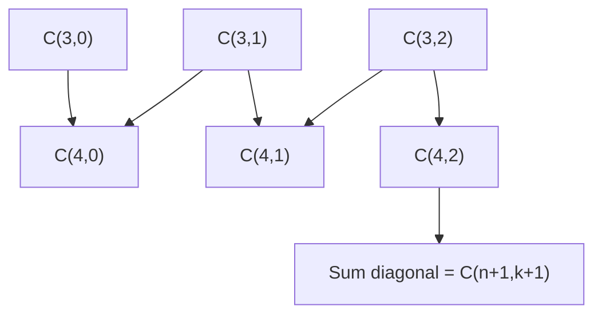
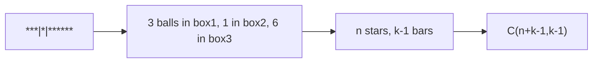
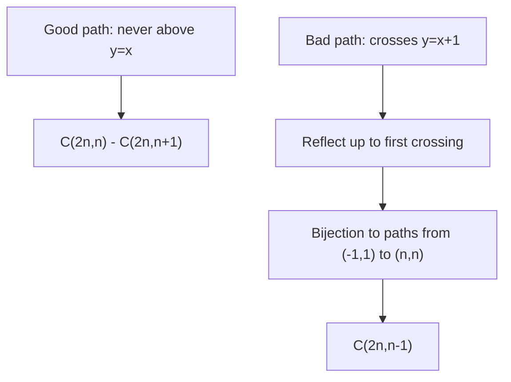
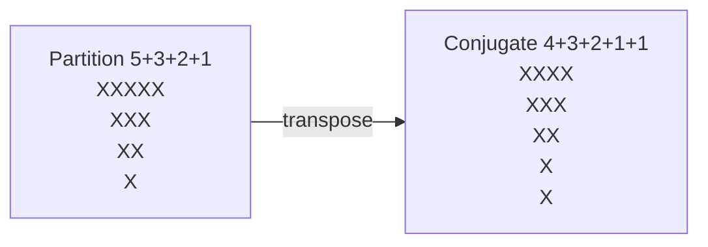
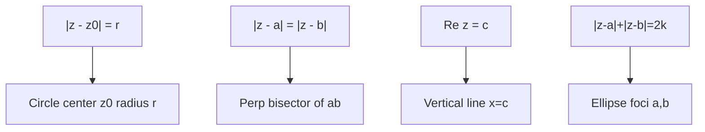
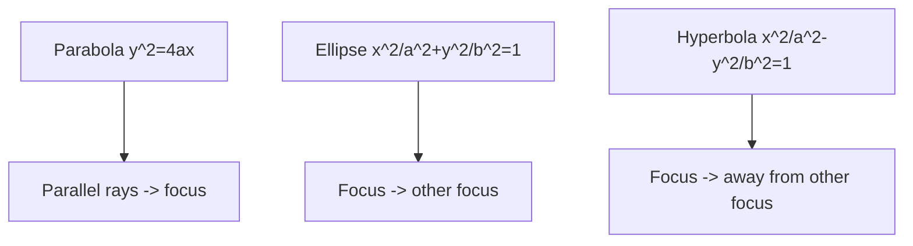
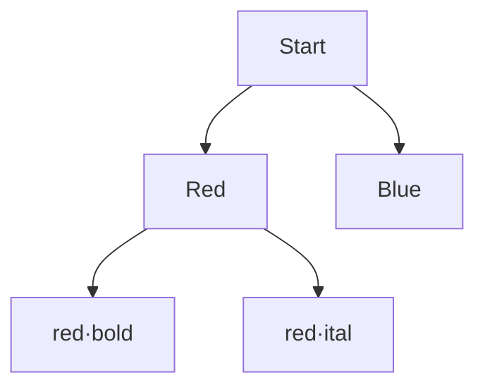

# Formatting Guide — Markdown Notes

This document explains how the HTML mindmaps were converted to Markdown with proper formatting and diagrams.

## Conversion Pipeline

```
HTML (standalone mindmap, MathJax)
  ↓ tools/convert_to_md.py
Markdown (GitHub-flavored, $...$ math, SVG + Mermaid diagrams)
```

### Tool: `tools/convert_to_md.py`

- **Input**: `PnC/pnc-mindmap.html`, `Complex Numbers/cn-mindmap.html`, `Binomial-Theorem/binomial-theorem-mindmap.html`, `Conic-Sections/conic-sections-mindmap.html`
- **Output**: `Markdown/<Module>/01-ch-1-·-...md` ... `06-ch-6-...md`, `olympiad-paper.md`, `olympiad-paper-solutions.md`, `<module>-complete.md`, `README.md`
- **Assets**: Extracts inline SVG → `assets/fig-XX.svg`, preserves original captions

### Math Handling

- **Inline**: `<span class="math">\(...\)</span>` → `$...$`
- **Display**: `<div class="math">\[...\]</div>` or `$$...$$` → `$$...$$`
- **Balance**: Verified via `tools/verify-math.py` — every `$` and `$$` must be paired, no bad delimiters
- **Example**:
  ```md
  The binomial coefficient is $\binom{n}{k} = \frac{n!}{k!(n-k)!}$

  $$\sum_{k=0}^n \binom{n}{k} = 2^n$$
  ```

### Structure Mapping

| HTML | Markdown |
|------|----------|
| `mm-ch` (chapter) | `# Chapter N — Title` |
| `mm-sec` (section) | `### 1.2 Section Title` |
| `mm-sub` (subtopic) | `#### Subtopic Title` |
| `mm-node box-first` | `> **⛁ First Principles — ...**` (blockquote) |
| `mm-node box-idea` | `> **💡 Key Idea — ...**` |
| `mm-node box-warn` | `> **⚠ Common Trap — ...**` |
| `mm-node box-note` | `> **📌 Note — ...**` |
| `mm-node box-olympiad` | `> **★ Olympiad Extension — ...**` |
| `mm-node box-exam` | `> **🏛 Exam flavor — ...**` |
| `q` (question) | `#### **S1**[JEE Main][solved]...` + `<details><summary>Answer + Reasoning</summary>` |
| `figure` | `` |
| `table` | GFM table |
| `formula` | `$$...$$` block |

### Diagram Handling

#### 1. SVG Preservation

Every `<figure>` with inline SVG is extracted:

```python
svg_content = extract_svg(figure_html)
save to assets/fig-02.svg
markdown: 
```

- IDs are namespaced to avoid collisions
- Original captions preserved
- Works offline (no external deps)

#### 2. Mermaid Augmentation

For key concepts, Mermaid flowcharts are **added** alongside SVG for GitHub rendering:

**Product Rule — Decision Tree**:


**Circular Permutations**:
```mermaid
flowchart LR
    A[ABC] -- rotate --> B[BCA]
    B -- rotate --> C[CAB]
    A -- n rotations --> Same{Same necklace}
    Same --> Count[(n-1)!]
```

**Pascal's Triangle & Hockey-Stick**:


**Stars and Bars**:


**Reflection Principle (Catalan)**:


**Young Diagram Conjugation**:


**Complex Plane Loci**:


**Conic Reflection**:


### Question Format

**JEE Main / Advanced / Olympiad tags preserved**:

```md
#### **S1**[JEE Main][solved][product + cases]How many 4-digit numbers...

<details>
<summary>Answer + Reasoning</summary>

Solution & reasoning...

**Answer: 112** ✓

</details>
```

- `S` = solved example (in chapter)
- `P` = practice (end of section)
- `A`–`H` = Olympiad paper (40 questions)
- Tags: `[JEE Main]`, `[JEE Adv]`, `[Olympiad]`, `[solved]`, `[practice]`, topic tags

### Ordering Principles

1. **Topological**: Foundations → tools → applications → frontier
2. **Difficulty**: Board-level → JEE Main (1-step) → JEE Adv (2-step, casework) → Olympiad (bijection, double counting, generating functions)
3. **First Principles First**: Every chapter starts with *why* before *what*
4. **Small-Case Habit**: Every counting claim verified at $n=3,4$ (explicit listing)
5. **Two Languages**: Algebra ↔ Geometry translation emphasized (complex numbers, conics)

### File Organization

```
Markdown/
├── README.md                     # Index with coverage matrix
├── ROADMAP.md                    # Well-ordered theory roadmap (this file's companion)
├── FORMATTING-GUIDE.md           # This file
├── DIAGRAMS.md                   # All Mermaid diagrams catalog
├── JEE-ADVANCED-OLYMPIAD-COVERAGE.md
├── PnC/
│   ├── README.md                 # Module index
│   ├── 01-ch-1-·-counting-basics.md
│   ├── 02-ch-2-·-permutations.md
│   ├── 03-ch-3-·-combinations.md
│   ├── 04-ch-4-·-binomial-coefficients-&-identities.md
│   ├── 05-ch-5-·-advanced-methods.md
│   ├── 06-ch-6-·-olympiad-theory.md
│   ├── olympiad-paper.md         # 40 Q paper
│   ├── olympiad-paper-solutions.md
│   ├── pnc-complete.md           # All chapters concatenated
│   └── assets/
│       ├── fig-02.svg            # Product rule tree
│       ├── fig-03.svg            # Circular permutations
│       └── ...
├── Complex Numbers/
│   ├── 01-ch-1-·-foundations-—-algebra-&-the-plane.md
│   ├── ...
│   └── assets/
├── Binomial-Theorem/
└── Conic-Sections/
```

### Quality Gates

```bash
# HTML still valid
python3 tools/verify-math.py
python3 tools/verify-mindmap.py all

# Markdown regeneration
python3 tools/convert_to_md.py all
# or single module
python3 tools/convert_to_md.py PnC
```

### GitHub Rendering

- Math: GitHub natively renders `$...$` and `$$...$$` via MathJax
- Mermaid: GitHub natively renders ```mermaid blocks
- SVG: GitHub renders `` inline
- Details: `<details><summary>` collapsible for solutions (keeps notes clean)

### Example Polished Section

```md
### 1.2 The Product (Multiplication) Rule

**Statement.** If a task is carried out in $k$ successive steps, and step $i$ offers $n_i$ choices *regardless of earlier choices*, then total ways = $n_1 n_2 \cdots n_k$.

> **⛁ First Principles — why the rule is true**
> Count choice-sequences $(c_1,\dots,c_k)$. Fix $c_1$: remaining $k-1$ steps in $n_2\cdots n_k$ ways (induction). $n_1$ choices for $c_1$, disjoint families → total $n_1(n_2\cdots n_k)$. The rule is partitioning by first coordinate.

**Fig 1.1 — Product rule as counting leaves**




> **⚠ Common Trap — 3 choices then 3 choices ≠ 9 always**
> Fails when different paths land on same object (overcounting). Fix: canonical order or divide by symmetry, check exact symmetry.

> **💡 Key Idea — rule of roles**
> Labeled roles make paths distinct. Unordered → impose canonical order or divide by symmetry size.
```

---

*All markdown files preserve the original HTML's First Principles derivation style, mistake checklists, and small-case verification habit — the core of JEE Advanced & Olympiad preparation.*
