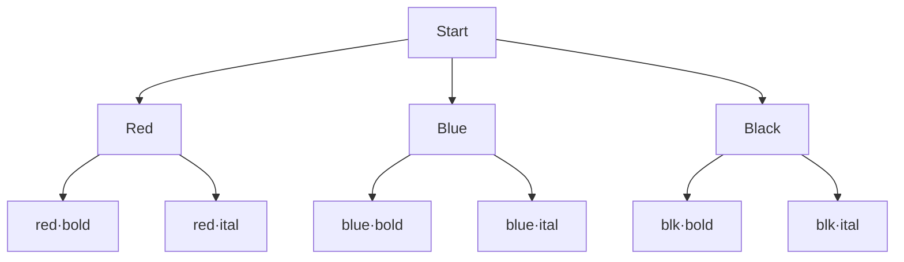
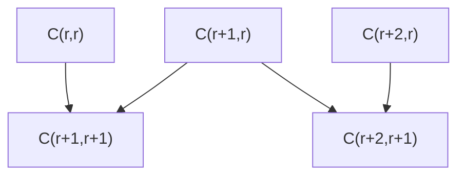
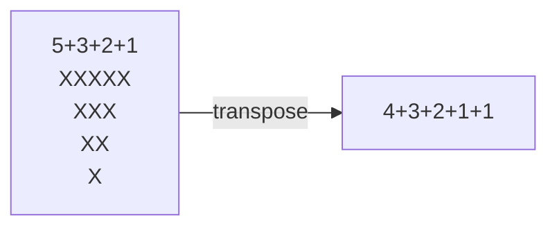
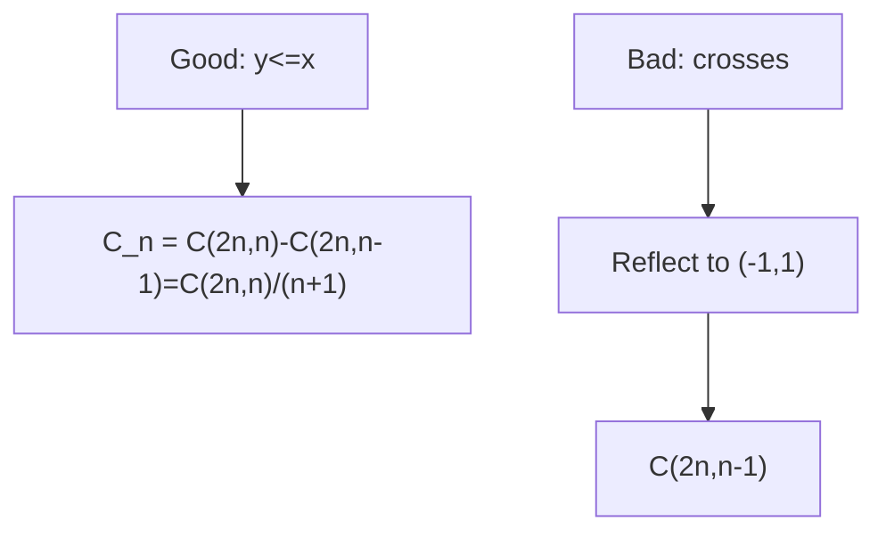
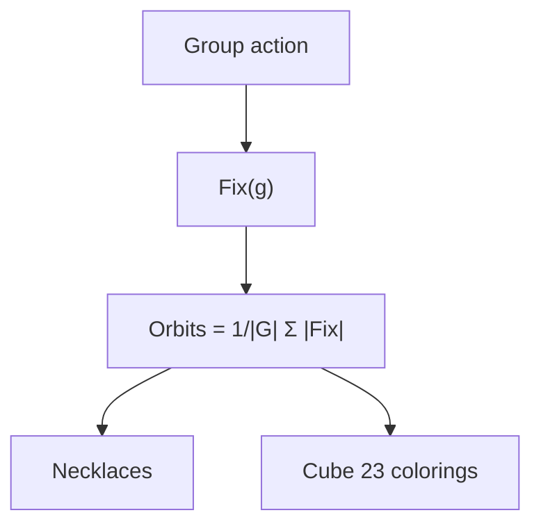

# PnC — Well-Ordered Theory from Basics to Olympiad

> **Philosophy**: Everything is `construct` (product), `split` (sum), or `match up` (bijection). Every formula derived, never memorized.

---

## 1. Counting Basics

### 1.1 What does counting mean?

Finite set $S$, $|S|$ = number of elements. Counting = finding $|S|$ without listing all.

**Small-case habit**: For $n=3$, list all $2^3=8$ subsets explicitly, verify.

### 1.2 Product Rule

**Statement**: $k$ successive steps, step $i$ has $n_i$ choices regardless of earlier choices → total $n_1\cdots n_k$.

**Proof** (induction): Fix first choice $c_1$, remaining $k-1$ steps $n_2\cdots n_k$ ways. $n_1$ disjoint families → total $n_1(n_2\cdots n_k)$. Partition by first coordinate.

**Diagram**:

*Leaves = $3×2=6$ — product rule is counting leaves in choice tree. Works iff each branch at level $i$ has same $n_i$ children.*


> **⚠ Trap**: "3 choices then 3 choices" ≠ 9 if different paths land on same object (overcounting). Example: choosing 2 people from 5: $5×4=20$ counts ordered pairs, not unordered. Fix: canonical order (smaller first) or divide by symmetry $2!$.

> **💡 Rule of roles**: Labeled roles make paths distinct. Unordered → impose canonical order or divide by symmetry, check exact symmetry.

**JEE Main Example**: 4-digit numbers with distinct digits divisible by 5.

- Last digit $0$ or $5$. Casework:
  - Ends with $0$: first digit $9$ choices (1-9), middle $8×7$ → $9×8×7×1=504$
  - Ends with $5$: first digit $8$ choices (1-9 except 5), middle $8×7$ → $8×8×7=448$
- Total $504+448=952$.

### 1.3 Sum Rule

**Statement**: If $S = A_1 \sqcup \cdots \sqcup A_k$ disjoint exhaustive, $|S| = \sum |A_i|$.

**Check**: Exhaustive? Disjoint? Verify small-case.

**JEE Main**: Committee 5 from 12 men 8 women with at least 2 women: $\sum_{w=2}^5 \binom{8}{w}\binom{12}{5-w}$.

### 1.4 Complement Principle

$|\bar A| = |U|-|A|$. "At least one" → $1$ minus "none".

**JEE Adv**: Strings length 4 over alphabet size 26 containing at least one vowel (5 vowels): total $26^4$ minus no vowel $21^4$.

### 1.5 Bijections & Involutions — Olympiad Weapon

**Bijection**: $|A|=|B|$ if $\exists$ bijection $f:A\to B$.

**Involution**: $f(f(x))=x$, pairs up elements, proves even/odd equal.

**Worked**: Half subsets have even size.

- Toggle element $1$: $S \mapsto S \Delta \{1\}$ (symmetric difference). Pairs even ↔ odd, involution without fixed points → equal halves $2^{n-1}$.

**Worked**: Even and odd permutations equally many.

- Multiply by transposition $(12)$: bijection between even and odd.

**JEE Adv**: Functions $f:[n]\to[n]$ with $f(f(x))=x$ (involutions): count.

### 1.6 Double Counting — Proof Machine

Count same set two ways.

**Sum of integers**: $\sum_{k=1}^n k = \binom{n+1}{2}$ — pairs $(i,j)$ with $i<j$.

**$\sum k\binom{n}{k}=n2^{n-1}$**: Committee with chair: choose chair first $n$, other members $2^{n-1}$ (in/out) vs group by size $k$.

### 1.7 Mistake Checklist

- Labeled vs unlabeled (order matters?)
- Independence (does $n_i$ depend on earlier choices?)
- Exhaustive & disjoint (sum rule)
- Symmetry exact? No fixed points?
- Small-case verification $n=3,4$

---

## 2. Permutations — Order Matters

### 2.1 $^nP_r$, Factorial

$^nP_r = n(n-1)\cdots(n-r+1) = \frac{n!}{(n-r)!}$.

$0! = 1$ — empty product, empty bijection.

### 2.2 Identical Objects

$\frac{n!}{n_1!n_2!\cdots}$ — overcounting argument: $n!$ permutations of distinct, divide by $n_1!$ rearrangements of identical type 1, etc.

**Example**: MISSISSIPPI: $11!/(4!4!2!)$.

### 2.3 Circular Permutations

```mermaid
flowchart LR
    A[ABC] -- rotate --> B[BCA]
    B -- rotate --> C[CAB]
    A -.-> D[(n-1)! circular]
```
Linear $n!$, $n$ rotations same necklace → $(n-1)!$. Bracelet (flip allowed) → $(n-1)!/2$.


### 2.4 Bundle & Gap Methods

**Together**: Bundle as block, $(n-k+1)!k!$ (block + internal).

**No two adjacent**: Arrange others, gaps. $n$ people, $r$ cannot be adjacent: $(n-r+1)P_r \times (n-r)!$ or $\binom{n-r+1}{r}r!(n-r)!$.

**Fixed relative order**: $\frac{n!}{k!}$ — $k!$ orders equally likely, one desired.

### 2.5 Derangements — Olympiad

$D_n$ = permutations with no fixed point.

**IE**: $D_n = n!\sum_{k=0}^n (-1)^k/k!$.

**Recurrence**: $D_n = (n-1)(D_{n-1}+D_{n-2})$, $D_1=0,D_2=1$.

**Nearest integer**: $D_n = \left\lfloor \frac{n!}{e} + \frac12 \right\rfloor$.

**Rencontres**: Exactly $k$ fixed points: $\binom{n}{k}D_{n-k}$.

---

## 3. Combinations — Order Irrelevant

### 3.1 $\binom{n}{r}$

$\binom{n}{r} = \frac{n!}{r!(n-r)!}$ — choose $r$ from $n$.

**Symmetry**: $\binom{n}{r}=\binom{n}{n-r}$ via complementation bijection.

**Pascal**: $\binom{n}{r}=\binom{n-1}{r}+\binom{n-1}{r-1}$ — condition on membership of element $n$.

### 3.2 Restricted Selections

Must include: $\binom{n-1}{r-1}$, must exclude: $\binom{n-1}{r}$.

### 3.3 Hockey-Stick


$\sum_{i=r}^n \binom{i}{r} = \binom{n+1}{r+1}$ — telescope Pascal.

### 3.4 Stars and Bars


- Non-negative: $\binom{n+k-1}{k-1}$
- Positive: $\binom{n-1}{k-1}$
- Compositions of $n$: $2^{n-1}$ (bars in/out)
- Multisets: $\binom{n+k-1}{k}$

### 3.5 Multinomial

$\frac{n!}{n_1!\cdots n_k!}$ — distribute $n$ distinct balls into $k$ distinct boxes with $n_i$ each.

$(a+b+c)^n$ distinct terms after collecting: $\binom{n+2}{2}$.

### 3.6 Partitions — Olympiad

$p(n)$ = partitions of $n$, no closed form.

GF: $\prod_{k\ge1}\frac{1}{1-x^k} = \sum p(n)x^n$.

Euler: distinct parts = odd parts (bijection via binary).

Young diagram conjugation involution:



---

## 4. Binomial Coefficients & Identities

### 4.1 Binomial Theorem via Counting

$(x+y)^n = \sum_{k=0}^n \binom{n}{k}x^{n-k}y^k$ — pick $k$ brackets for $y$.

$(1+1)^n=2^n$, $(1-1)^n=0$ → even/odd split $2^{n-1}$.

### 4.2 Double Counting Toolkit

- $k\binom{n}{k}=n\binom{n-1}{k-1}$ — committee with chair
- $\sum k\binom{n}{k}=n2^{n-1}$
- Vandermonde: $\sum \binom{r}{k}\binom{s}{n-k}=\binom{r+s}{n}$ — choose $n$ from $r+s$ split
- $\sum \binom{n}{k}^2 = \binom{2n}{n}$

### 4.3 Negative Binomial

$(1-x)^{-k} = \sum_{n\ge0}\binom{n+k-1}{k-1}x^n$ — stars and bars GF.

$(1+x)^{-n} = \sum (-1)^k\binom{n+k-1}{k}x^k$.

### 4.4 Bounded Extraction

Coefficient with upper bounds via IE: e.g., solutions to $x_1+x_2+x_3=10$, $0\le x_i\le4$ → $\binom{12}{2} - \binom{3}{1}\binom{7}{2} + \cdots$.

---

## 5. Advanced Methods

### 5.1 Inclusion-Exclusion

$|\cup A_i| = \sum|A_i| - \sum|A_i\cap A_j| + \cdots + (-1)^{n+1}|A_1\cap\cdots\cap A_n|$.

**Derangements**: $D_n = n! - \binom{n}{1}(n-1)! + \binom{n}{2}(n-2)! - \cdots$.

**Rook**: Board with forbidden positions.

### 5.2 Pigeonhole

Dirichlet: $n$ items into $k$ boxes → some box $\ge \lceil n/k \rceil$.

- $W(2,3)=9$ van der Waerden, $R(3,3)=6$ Ramsey, Erdős–Szekeres $(r-1)(s-1)+1$ monotone subsequence.

### 5.3 Recurrence Counting

Tilings: $2×n$ domino tilings = Fibonacci $F_{n+1}$.

Fibonacci in Pascal: sum of shallow diagonals.

### 5.4 Probabilistic Method (Intro)

$\mathbb{E}[X] < 1 \Rightarrow \exists$ outcome with $X=0$ — existence proof without construction.

---

## 6. Olympiad Theory — Frontier

### 6.1 Generating Functions

OGF $A(x)=\sum a_n x^n$.

- $A(x)B(x)$ = independent stages convolution
- $\frac{1}{1-B(x)}$ = sequence of $B$-structures
- Catalog: $(1-x)^{-k}$, $(1+x)^n$, Fibonacci $\frac{x}{1-x-x^2}$

### 6.2 Lattice Paths & Catalan

Monotone paths $(0,0)\to(a,b)$: $\binom{a+b}{b}$.

**Reflection principle**: Bad paths crossing $y=x+1$ biject to paths from $(-1,1)$ → count $\binom{2n}{n-1}$.




Catalan: Dyck paths, triangulations, non-crossing partitions, binary trees, etc. $C_n = \frac{1}{n+1}\binom{2n}{n}$.

Ballot: $\frac{p-q}{p+q}\binom{p+q}{q}$ — A always ahead.

### 6.3 Burnside & Pólya

Group $G$ acts on colorings, orbits = distinct up to symmetry.

Burnside: $\text{Orbits} = \frac{1}{|G|}\sum_{g\in G} |\text{Fix}(g)|$.

- Necklaces: $N(n,k)=\frac{1}{n}\sum_{d|n}\varphi(d)k^{n/d}$
- Bracelets: include reflections
- Cube: 24 rotations, 2 colors → 23 colorings (10 with 3 colors? etc.)



### 6.4 Partitions & Euler

GF $\prod \frac{1}{1-x^k} = \sum p(n)x^n$.

Pentagonal: $\prod (1-x^k)=\sum_{j\in\mathbb Z} (-1)^j x^{j(3j-1)/2}$.

Recurrence: $p(n)=p(n-1)+p(n-2)-p(n-5)-p(n-7)+p(n-12)+\cdots$.

### 6.5 Stirling & Bell

$S(n,k)$ = partitions of $n$ distinct objects into $k$ non-empty unlabeled subsets.

- Recurrence: $S(n,k)=kS(n-1,k)+S(n-1,k-1)$, $S(n,0)=0$, $S(n,n)=1$
- IE: $S(n,k)=\frac{1}{k!}\sum_{j=0}^k (-1)^j\binom{k}{j}(k-j)^n$
- Onto: $k!S(n,k)$ onto functions
- Bell: $B_n=\sum_k S(n,k)$

### 6.6 Olympiad Lemmas

- **Cycle lemma** (Dvoretzky–Motzkin): $k$ cyclic shifts, $k$ have property
- **Sperner via LYM**: Random chain, $\sum \binom{n}{|A|}^{-1} \le 1$, max antichain $\binom{n}{\lfloor n/2\rfloor}$
- **Erdős–Szekeres**: $(r-1)(s-1)+1$ sequence has increasing length $r$ or decreasing $s$
- **Probabilistic method**: $\mathbb{E}<1$ → existence

---

## Paper — 40 Questions A–G + Stretch

Attempt after Chapter 6, 4–5 hours, without solutions. Full solutions in `olympiad-paper-solutions.md`.

---

*Well-ordered from first principles, every formula derived, every answer verified at $n=3,4$ — the core of JEE Advanced & Olympiad preparation.*
