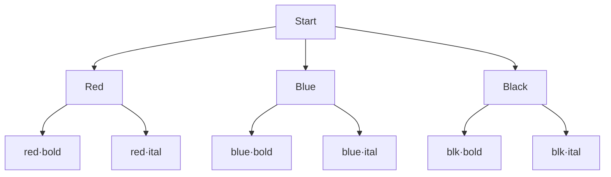

# Chapter 1 — Ch 1 · Counting Basics

*7 sections · 11 questions*

*Chapter 1 · Foundations*

# Counting Basics

Before any formula: what counting actually *is*. The three primitive moves — construct, split, match up — and the habit of proof-by-small-cases that will carry you through Olympiad level.

`product rule` `sum rule` `complement` `bijection` `double counting (intro)`

### 1.1 What does "to count" even mean?

You have seen the answer "there are $nPr$ ways" in a formula sheet. But a formula is only a *receipt* — the *argument* is the money. In this chapter we define the game in its rawest form and see that everything else is a consequence of one definition.

**The objects of the game are finite sets.** When a problem says "in how many ways…?", it defines a (usually implicit) set $X$ of objects — arrangements, selections, functions, paths, colorings — and asks for $|X|$, the number of elements of $X$.

> **⛁ First Principles — the definition of "same size"**
>
> Two finite sets $X, Y$ have the **same size** if and only if there exists a **bijection** $f: X \to Y$ — a one-to-one correspondence, where every element of $X$ is matched to exactly one of $Y$, and vice versa. That is the whole definition. No measuring, no formulas: *matching objects is the same thing as counting them.*
>
>
> This is not philosophy — it is the workhorse of Olympiad combinatorics. Whenever counting $X$ looks hard, search for a set $Y$ whose size you know and an explicit rule matching each element of $X$ to exactly one of $Y$.

#### Example — the very first counting theorem, proved properly

**Claim:** the set $\{1,2,\dots,n\}$ has exactly $2^n$ subsets.

Most textbooks say "each element is either in or out, so $2\cdot 2\cdots 2 = 2^n$." That phrasing is a shortcut hiding the real structure. Here is the honest version:

There is a **bijection** between subsets of $[n]=\{1,\dots,n\}$ and binary strings of length $n$: the subset $S$ maps to the string $(b_1,\dots,b_n)$ where $b_i = 1 \iff i\in S$. Going backwards is unique. Hence 
$$ \#\{\text{subsets of } [n]\} \;=\; \#\{\text{binary strings of length } n\} \;=\; 2^n. $$
 The "2 choices per position" reasoning is just a statement about the second set, which is easier to see because its objects are *sequences* — and sequences are what the product rule (below) counts.

> **💡 Key Idea — two ways of counting**
>
> **(A) Construct:** describe how to *build* an object as a sequence of choices → multiply. **(B) Match up:** find a bijection with a known set → inherit its size. Every problem in this course is (A), (B), or a mixture.

### 1.2 The Product (Multiplication) Rule

**Statement.** If a task is carried out in $k$ successive steps, and step $i$ offers $n_i$ choices *regardless of the earlier choices*, then the total number of ways to carry out the task is

$$n_1 \cdot n_2 \cdots n_k$$

> **⛁ First Principles — why the rule is true**
>
> Count the set of *choice-sequences* $(c_1,\dots,c_k)$. Fix a particular first choice $c_1$: the remaining $k-1$ steps can be completed in $n_2\cdots n_k$ ways (induction on $k$). There are $n_1$ possible first choices, and different $c_1$ give disjoint families of sequences. So the total is $n_1(n_2\cdots n_k)$. The rule is just **partitioning by the first coordinate**, repeatedly — the same move you will meet inside Pascal's identity, recurrences and generating functions.

**Fig 1.1 — The product rule is a counting of leaves in a choice tree. The rule works exactly when every branch at level $i$ has the same number $n_i$ of children.**

> **⚠ Common Trap — "3 choices, then 3 choices" is not always 9**
>
> The rule multiplies only when the number of options at each step is **fixed** for that step. Watch these classic failures:
>
>
> - **Choosing 2 people from 5.** "Choose the first (5 ways), then the second (4 ways)" gives 20 — but $\{A,B\}$ was built twice ($A$ then $B$, and $B$ then $A$). You counted *ordered* pairs, not unordered pairs. Fix: either divide by the symmetry ($2!/2=2$), or build the object in a canonical order (pick the *smaller*-named person first). The lesson: **if different choice paths can land on the same object, you are overcounting.**
> - **Digits of a number.** "5 choices for the first digit, 10 for the next…" fails for the first digit of a number (no leading zero). The count *does* stay fixed per step — 9, then 10, 10… — but you must verify each $n_i$ separately.

> **💡 Key Idea — the rule of roles**
>
> Product-rule constructions work best when each choice fills a **labeled role**: "chairman, then secretary, then treasurer", "units digit, then tens, then hundreds". Labeled roles make different paths automatically different outcomes. If your objects are *unordered*, you must either impose a canonical order or divide by the size of the symmetry — and *check that the symmetry is exact* (i.e. that no object is fixed by a non-identity symmetry; more on this in the Burnside chapter).

#### **S1**[JEE Main][solved][product + cases]How many 4-digit numbers with distinct digits are divisible by 5?

How many **4-digit numbers** with **distinct digits** are divisible by 5?

Answer + Reasoning

Solution & reasoning

Divisibility by 5 pins the *units digit* to 0 or 5. The digits of a 4-digit number are labeled roles (thousands, hundreds, tens, units), so we multiply — but the thousands digit cannot be 0, which depends on the units choice. **Split into cases on the units digit**:

- **Case 1: units = 0.** Thousands: any of the 9 non-zero digits; hundreds: any of the remaining 8; tens: any of the remaining 7. → $9\cdot 8\cdot 7 = 504$.
- **Case 2: units = 5.** Thousands: non-zero and not 5 → 8 choices; hundreds: 8 remaining; tens: 7 remaining. → $8\cdot 8\cdot 7 = 448$.

Cases are disjoint and exhaustive, so total $= 504 + 448 =$ **Answer: 952**

**Small-case sanity check:** for 2-digit distinct-digit multiples of 5 the same method gives $9 + 8 = 17$: {10,20,…,90} (9) and {15,25,…,95} (8). ✓

### 1.3 The Sum (Addition) Rule

**Statement.** If $X$ is partitioned into mutually disjoint non-empty pieces $X_1,\dots,X_k$, then

$$|X| = |X_1| + |X_2| + \cdots + |X_k|$$

> **⛁ First Principles — why the rule is true**
>
> Disjointness means no object lies in two pieces (so nothing is double-counted), and "partition" means every object lies in some piece (so nothing is missed). That is the whole proof — the sum of the sizes of the pieces *is* the size of the whole, by definition of partition. In practice the entire discipline of "solving by cases" is just this: **find a property of your objects that splits them into pieces you can each count**, then add.

> **⚠ Common Trap — cases must be exhaustive AND disjoint**
>
> Mantra: **every case counted once, every object in some case.** Typical failures: "with A and with B" (overlap if both can happen → use $|A\cup B| = |A|+|B|-|A\cap B|$, which is exactly what Chapter 5 systematizes), and "exactly 1, exactly 2, at least 3…" (not exhaustive — "at least 3" hides 3, 4, 5…; either split further or count the tail directly).

#### **S2**[JEE Main][solved][sum rule + cases]From a group of 12 men and 8 women, a 5-member committee is to be formed with …

From a group of 12 men and 8 women, a **5-member committee** is to be formed with **at least one woman**. How many committees?

Answer + Reasoning

Solution & reasoning

Two routes, and comparing them is the point:

**Route 1 (direct cases).** Split by the number of women: $1,2,3,4,5$. Sum $\sum_{w=1}^{5} \binom{8}{w}\binom{12}{5-w}$ — five terms, tedious and error-prone.

**Route 2 (complement — next section).** Total committees $\binom{20}{5} = 15504$. All-male committees $\binom{12}{5} = 792$. Answer $= 15504 - 792 =$ **Answer: 14712**

Note how Route 2 used the sum rule implicitly: committees are partitioned into "has a woman" and "all male", disjoint and exhaustive.

### 1.4 The Subtraction (Complement) Principle

If you want to count the objects in $X$ that **do not** have property $P$, and the objects *with* $P$ are easy, then

$$\#\{x \in X : \text{not } P\} \;=\; |X| \;-\; \#\{x \in X : P\}$$

> **⛁ First Principles — why you should always look for the complement**
>
> Negation has a hidden superpower: **negatives are rigid, positives are flexible.** "At least one woman" allows many configurations; "no women at all" forces a single rigid configuration (all seats male), which is usually trivial to count. The same pattern repeats everywhere: "no two adjacent" → count the total, subtract "at least one adjacent pair" (via inclusion–exclusion, Chapter 5); "not all boxes empty" → total minus all-empty; derangements → all permutations minus "at least one fixed point". Whenever a problem says *at least, no, not all, avoid* — flip it.

#### **S3**[JEE Adv][solved][complement + product]How many strings of length 4 over the alphabet [formula] contain at least one …

How many strings of length 4 over the alphabet $\{0,1,2,3,4\}$ contain **at least one 0**?

Answer + Reasoning

Solution & reasoning

Direct case-splitting by "first 0 at position $k$" is doable but ugly. The complement is a *one-line* product rule: strings with *no* 0 have 4 choices per position → $4^4 = 256$. Total strings: $5^4 = 625$. Answer $= 625 - 256 =$ **Answer: 369**

This "total minus forbidden" pattern is the seed of inclusion–exclusion (Ch. 5). When the forbidden condition is "at least one of several events", complements alone are not enough — that is exactly the gap IE fills.

### 1.5 Bijections and Involutions — the Olympiad Weapon

We saw bijections in §1.1. Now make them a **proof technique**. The central question at Olympiad level is rarely "count this hard set $X$" but "prove $|X| = |Y|$" — and that is answered by exhibiting a bijection, ideally a simple rule that both directions obey.

#### Worked proof — half the subsets have even size

**Claim:** for $n \ge 1$, exactly $2^{n-1}$ subsets of $[n]$ have even size, and $2^{n-1}$ have odd size.

**Proof.** Define $f$ on the family of subsets by *toggling* the element 1: $f(S) = S \cup \{1\}$ if $1 \notin S$, and $f(S) = S \setminus \{1\}$ if $1 \in S$. Then $f$ is a bijection (applying it twice gives back $S$) and every subset changes its size parity (the size changes by exactly 1). So $f$ is a bijection between even-sized and odd-sized subsets. Hence the two families are equal in size, and each is $\tfrac{1}{2}\cdot 2^n = 2^{n-1}$. $\square$

> **💡 Key Idea — the involution principle**
>
> An **involution** is a map $f$ with $f \circ f = \text{id}$. If an involution on a set $X$ has *no fixed points* and maps the "good" objects onto the "bad" ones, then good and bad are equal in number. Even more often: an involution with *only one kind* of fixed point proves a parity or near-equality statement. Look for involutions whenever a problem is about *even vs odd, more vs less, first vs last*.

#### Worked proof — even and odd permutations are equally many

**Claim:** for $n \ge 2$, exactly $n!/2$ of the permutations of $[n]$ are even (decompose into an even number of transpositions) and $n!/2$ are odd.

**Proof.** Left-compose every permutation with the transposition $(1\ 2)$. A transposition is odd, and composing an even permutation with an odd one gives an odd permutation (parity adds), so this is a bijection from even permutations to odd permutations. It is its own inverse, hence a bijection in both directions. Each side is therefore $\tfrac{n!}{2}$. $\square$

Remark for later: composing with $(1\ 2)$ is also a bijection on the set of permutations *with a given number of cycles modulo 2* — it flips the cycle count by ±1. You will meet this exact involution again in the Olympiad paper (it counts permutations by the parity of their number of cycles).

#### **S4**[JEE Adv][solved][bijection]How many functions [formula] satisfy [formula] ?

How many functions $f:\{1,2,3\}\to\{1,2,3,4,5\}$ satisfy $f(1) &lt; f(2) &lt; f(3)$?

Answer + Reasoning

Solution & reasoning

Naïvely "5 choices, then fewer…" breaks independence. **Bijection:** any such $f$ is the same data as the 3-element subset $\{f(1), f(2), f(3)\}$ of $\{1,\dots,5\}$ — and every 3-element subset has *exactly one* increasing ordering. So the answer is $\binom{5}{3} =$ **Answer: 10**

The general lesson: **an ordered structure with a monotonicity condition is the same thing as an unordered selection.** "Increasing functions $[r]\to[n]$ in bijection with $r$-subsets of $[n]$" is one of the most repeatedly used facts in combinatorics.

### 1.6 Double Counting — Your First Proof Machine

> **⛁ First Principles — the method**
>
> Let $\Omega$ be a set of **pairs** (or triples, or flags on figures…) that you can describe in two different ways. Count $|\Omega|$ by "grouping by the first coordinate" and again by "grouping by the second coordinate". Two different sums, one number — set them equal. The identity that falls out is a theorem; the choice of $\Omega$ is the art. Double counting is the proof technique behind *almost every* binomial identity, and a standard route for Olympiad proofs of divisibility and existence.

#### Worked — the sum of the integers, and its cousin

**Claim:** $\sum_{i=1}^{n} i = \binom{n+1}{2}$.

**Proof.** Let $\Omega = \{(a,b) : 1 \le a &lt; b \le n+1\}$ — 2-element subsets of $[n+1]$. Group by the **larger** element $b$: for fixed $b$, the smaller element $a$ has $b-1$ options. So $|\Omega| = \sum_{b=2}^{n+1}(b-1) = 1+2+\cdots+n$. But also $|\Omega| = \binom{n+1}{2}$ by definition. Done. $\square$

You have proved the "gaussian sum" without calculus — and you now understand *why* the sum is a binomial coefficient: it *is* a count of 2-subsets.

#### Worked — $\sum k\binom{n}{k} = n\,2^{n-1}$

**Proof.** Let $\Omega = \{(i, S) : S \subseteq [n],\ i \in S\}$ — pairs (chosen element, subset containing it). **Count by $i$:** $i$ can be any of the $n$ elements, and $S$ then any of the $2^{n-1}$ subsets of the remaining $n-1$ elements → $n\cdot 2^{n-1}$. **Count by $S$:** a subset of size $k$ contributes $k$ pairs → $\sum_k k\binom{n}{k}$. Equal. $\square$

> **🏛 Olympiad Extension — how to spot a double-counting proof**
>
> Red flags that double counting will work: the statement involves a **sum of $\binom{\cdot}{\cdot}$ terms** (each term "chooses something inside something"), or a product $n\cdot 2^{n-1}$ ("a distinguished element plus a subset"), or an identity between two symmetric-looking binomial expressions (often a "committee from two groups" story). Chapter 4 turns this into a full toolkit.

### 1.7 The Mistake Checklist (read this before every problem)

| Ask yourself | Typical symptom if you get it wrong |
| --- | --- |
| Are the objects **labeled or unlabeled**? | Counting arrangements of "3 prizes" as if the prizes were distinct when they are identical (or vice versa). |
| Does **order** matter? | Off by a factor of $r!$ — the exact boundary between $nP_r$ and $nC_r$ (Ch. 2–3). |
| Are the steps really **independent**? | Products that silently assume "10 choices" when a previous choice ate one of them. |
| Are the cases **exhaustive and disjoint**? | Missing "the other case", or double-counting the overlap of two cases. |
| Can one object be built by **two different paths**? | Overcounting — the disease of naive product rules on unordered objects. |
| Did I **check a tiny case by brute force**? | Everything else combined. For any answer, list all objects when $n$ is small and count by hand. |
| Is the answer the right **order of magnitude**? | An answer larger than the total pool of objects, or negative from a subtractive formula. |

> **📌 Practice Set 1 — all concepts above**
>
> Solve all; peek at the small answers only after a real attempt.

#### **P1**[JEE Main][practice][product rule]A license plate has 3 letters followed by 4 digits . The first letter cannot b…

A license plate has **3 letters** followed by **4 digits**. The first letter cannot be O, and the last digit cannot be 0. Repetition is allowed. How many plates?

Answer + Reasoning

Roles: L1 L2 L3 d1 d2 d3 d4. Counts per position: $25, 26, 26, 10, 10, 10, 9$ — all fixed, so multiply: $25\cdot 26^2 \cdot 10^3 \cdot 9 = 16900 \cdot 9000 =$ **152,100,000**.

#### **P2**[JEE Adv][practice][complement + product]How many odd 5-digit numbers have distinct digits?

How many **odd 5-digit numbers** have **distinct** digits?

Answer + Reasoning

Units digit odd: 5 choices. The first digit is non-zero and different from the units digit, so it has 8 choices. The hundreds and tens digits then have 8 and 7 choices respectively; the units digit is already fixed. $5 \cdot 8 \cdot 8 \cdot 7 =$ **2,240**.

#### **P3**[JEE Adv][practice][bijection]How many pairs [formula] of subsets of [formula] satisfy [formula] ?

How many pairs $(A,B)$ of subsets of $[n]$ satisfy $A \subseteq B$?

Answer + Reasoning

For each element $i\in[n]$, exactly one of three states: $i\notin B$; $i \in B\setminus A$; $i\in A$ (hence also in $B$). Independent per element → **$3^n$**. (This is the "each element makes one of 3 choices" pattern — a product rule disguised as a bijection to 3-colorings of $[n]$.)

#### **P4**[JEE Main][practice][complement]A chess player plays 8 games, winning some and losing the rest (no draws). In …

A chess player plays 8 games, winning some and losing the rest (no draws). In how many outcome sequences does the player win **at least one game**?

Answer + Reasoning

Each game is W or L → $2^8 = 256$ sequences. Complement: lose all 8 → 1. Answer **255**.

#### **P5**[Olympiad][practice][involution]Let [formula] . Show that the number of even-sized subsets of [formula] contai…

Let $n\ge 2$. Show that the number of *even-sized* subsets of $[n]$ containing 1 equals the number of *odd-sized* subsets of $[n]$ containing 1… or find what is actually true, and prove it with an involution.

Answer + Reasoning

The stated equality is *not* true in general — good, now count: subsets containing 1 of even size ↔ subsets of $[n]\setminus\{1\}$ of *odd* size = $2^{n-2}$ (by the §1.5 result on $[n-1]$); odd-size subsets containing 1 ↔ even-size subsets of the rest = $2^{n-2}$. So the correct statement is: **subsets containing 1 split evenly between even and odd size, $2^{n-2}$ each** (for $n\ge 2$), and the proof is the toggle involution on element $2$, which preserves "contains 1" and flips total parity.

#### **P6**[JEE Adv][practice][product + cases]A man climbs a 6-step staircase, taking 1, 2 or 3 steps at a time. In how many…

A man climbs a 6-step staircase, taking 1, 2 or 3 steps at a time. In how many ways can he climb?

Answer + Reasoning

Let $a_n$ = ways to climb $n$ steps; $a_n = a_{n-1}+a_{n-2}+a_{n-3}$ (first jump is 1, 2 or 3). With $a_0=1, a_1=1, a_2=2$: $a_3=4, a_4=7, a_5=13, a_6=$ **24**. (First taste of the recurrence method — Chapter 5 generalizes this completely.)

#### **P7**[Olympiad][practice][double counting]Prove: [formula] .

Prove: $\displaystyle\sum_{k=1}^{n} k\binom{n}{k}^2 = n\binom{2n-1}{n-1}$.

Answer + Reasoning

**Verify first (the Olympiad habit):** $n=2$: LHS $= 1\cdot\binom21^{\,2} + 2\cdot\binom22^{\,2}
        = 4 + 2 = 6$; RHS $= 2\binom31 = 6$. ✓ (A common slip is writing $\binom21^2 = 1$ — recompute arithmetic digit by digit before trusting any "mismatch".)

**Algebraic proof.** Use $k\binom{n}{k} = n\binom{n-1}{k-1}$ (choose the $k$-set, then its distinguished element = choose the distinguished element first, then the other $k-1$ members). Then, with $j = k-1$, 
$$ \sum_{k=1}^{n} k\binom{n}{k}^2
        = n\sum_{k=1}^{n}\binom{n-1}{k-1}\binom{n}{k}
        = n\sum_{j=0}^{n-1}\binom{n-1}{j}\binom{n}{n-1-j}
        = n\binom{2n-1}{n-1}, $$
 where the last step is Vandermonde's identity (Chapter 4).

**Counting flavor.** The LHS counts triples $(A,B,b)$: $A\subseteq X$, $B\subseteq Y$ with $X, Y$ two labeled $n$-sets, $|A| = |B|$, $b \in B$ distinguished — counted by $|B| = k$. The step $k\binom{n}{k} = n\binom{n-1}{k-1}$ says the same object is counted by choosing $b$ first and then $B\setminus\{b\}$; the remaining sum is the "committee from two groups" count of $(n-1)$-subsets of a $(2n-1)$-set (Vandermonde). Double counting and algebra are the same proof wearing different clothes.

---

