# Diagrams — SVG + Mermaid Catalog

> Every diagram lives as an SVG in the module's `notes/<Module>/assets/fig-XX.svg`
> and is augmented with a Mermaid flowchart for native GitHub/Obsidian rendering.

## PnC — Permutations & Combinations

### 1. Product Rule — Decision Tree

**SVG**: `notes/PnC/assets/fig-02.svg` — Tree with 3 colors × 2 styles = 6 leaves

**Mermaid**:
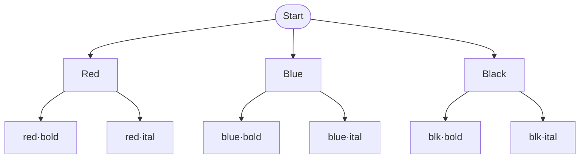

**Theory**: Product rule works iff every branch at level $i$ has same $n_i$ children. Leaves = $n_1 n_2 \cdots n_k$.

### 2. Circular Permutations — Rotation Equivalence

**SVG**: `notes/PnC/assets/fig-03.svg` — Linear vs circular arrangements

**Mermaid**:
```mermaid
flowchart LR
    subgraph Linear [Linear: n!]
        A[ABC]
        B[BCA]
        C[CAB]
    end
    subgraph Circular [Circular: (n-1)!]
        D[(ABC) same as BCA]
    end
    A -- rotate --> B
    B -- rotate --> C
    C -- rotate --> A
    A -.-> D
```

**Theory**: $n$ rotations give same necklace → divide by $n$. If flip allowed (bracelet), divide by $2n$ → $(n-1)!/2$.

### 3. Pascal's Triangle & Hockey-Stick

**SVG**: `notes/PnC/assets/fig-05.svg` (approx) — Triangle with $\binom{n}{k} = \binom{n-1}{k-1}+\binom{n-1}{k}$

**Mermaid**:
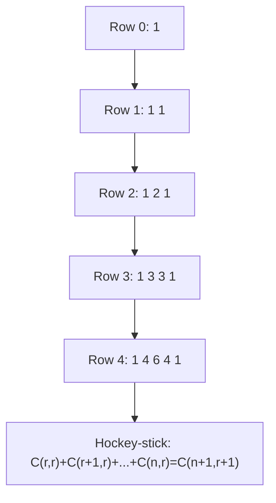

**Identity**: $\sum_{i=r}^n \binom{i}{r} = \binom{n+1}{r+1}$ — telescope via Pascal.

### 4. Stars and Bars — Distribution

**SVG**: `notes/PnC/assets/fig-06.svg` — Stars and bars visualization

**Mermaid**:
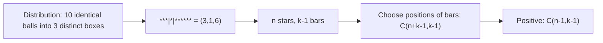

**Formulas**:
- Non-negative: $\binom{n+k-1}{k-1}$
- Positive: $\binom{n-1}{k-1}$
- Compositions of $n$: $2^{n-1}$

### 5. Lattice Paths & Reflection Principle

**SVG**: `notes/PnC/assets/fig-08.svg` — Grid paths from $(0,0)$ to $(a,b)$

**Mermaid**:
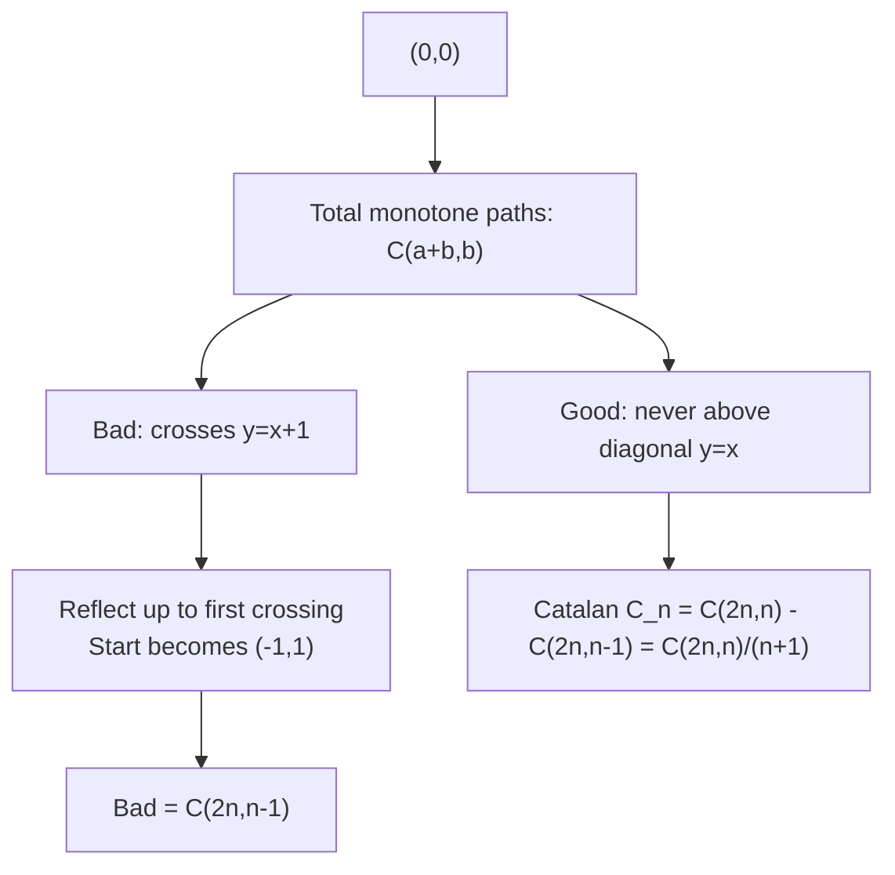

**Ballot**: $\frac{p-q}{p+q}\binom{p+q}{q}$ — $p$ votes for A, $q$ for B, $p>q$, probability A always ahead.

### 6. Young Diagram — Partition Conjugation

**SVG**: `notes/PnC/assets/fig-09.svg` — Young diagram transpose

**Mermaid**:
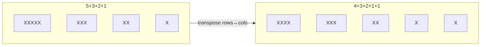

**Bijection**: Conjugation is involution → number of partitions of $n$ equals number with largest part = number of parts, etc. Euler distinct = odd via generating functions.

### 7. Burnside — Necklace Counting

**Mermaid**:
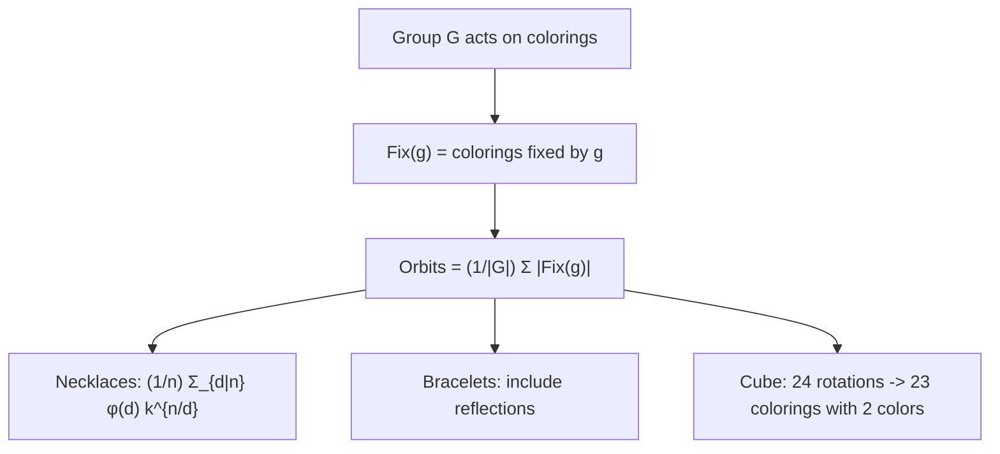

### 8. Inclusion-Exclusion — Sieve

**Mermaid**:
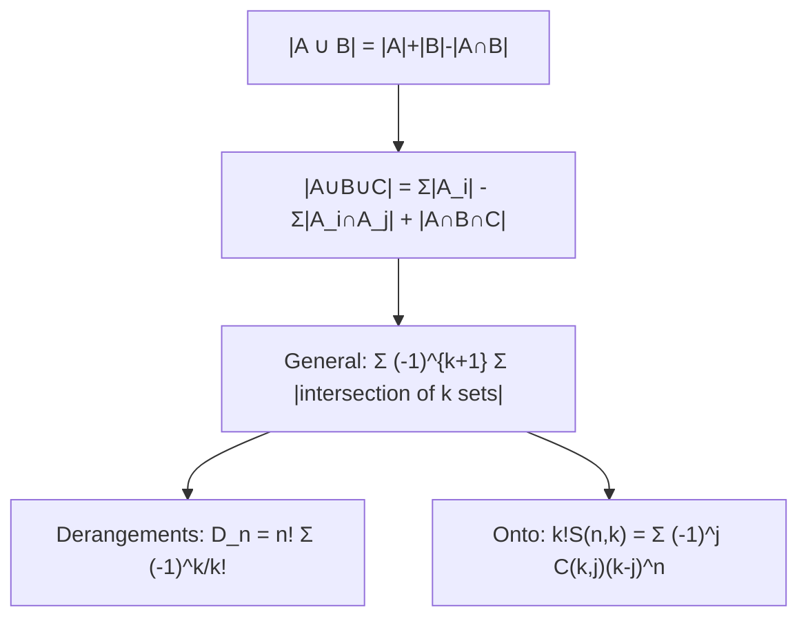

---

## Complex Numbers

### 9. Complex Plane — Loci

**SVG**: `notes/Complex-Numbers/assets/fig-02.svg` — Plane with points, circles

**Mermaid**:
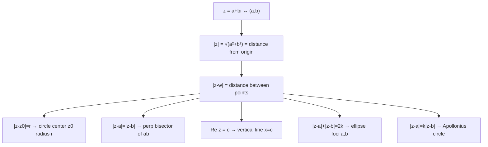

### 10. Multiplication = Rotation

**SVG**: `notes/Complex-Numbers/assets/fig-03.svg` — Rotation by $i$

**Mermaid**:
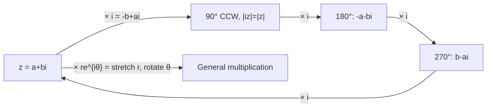

**Theorem**: $|zw|=|z||w|$, $\arg(zw)=\arg z + \arg w$.

### 11. Roots of Unity — Regular Polygon

**Mermaid**:
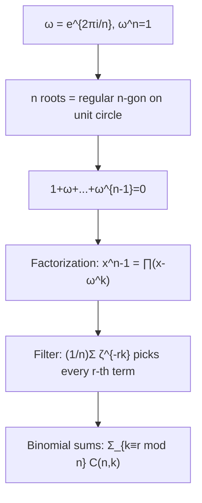

---

## Binomial Theorem

### 12. Decision Tree — What $(a+b)^n$ Counts

**Mermaid**:
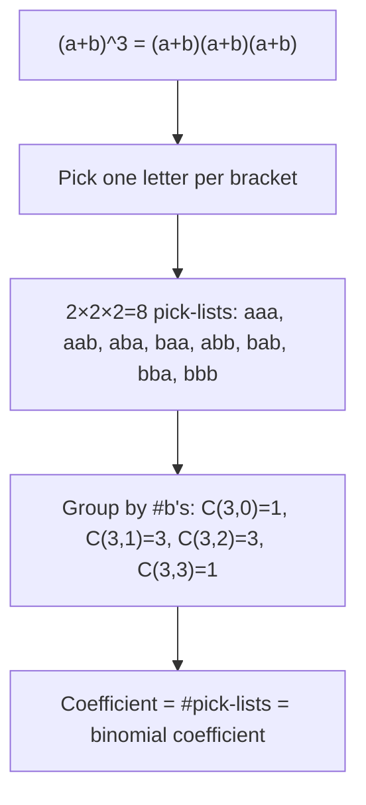

### 13. Substitution Engines

**Mermaid**:
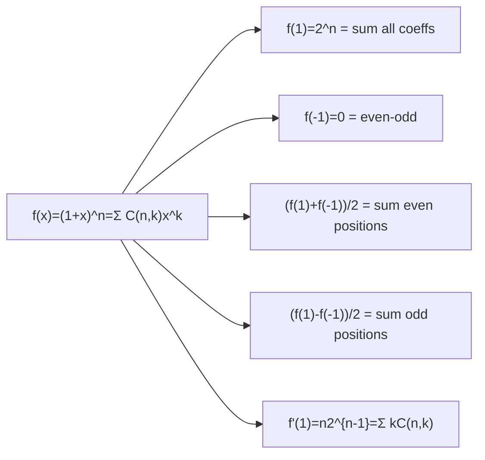

### 14. Negative Binomial — Stars and Bars GF

**Mermaid**:
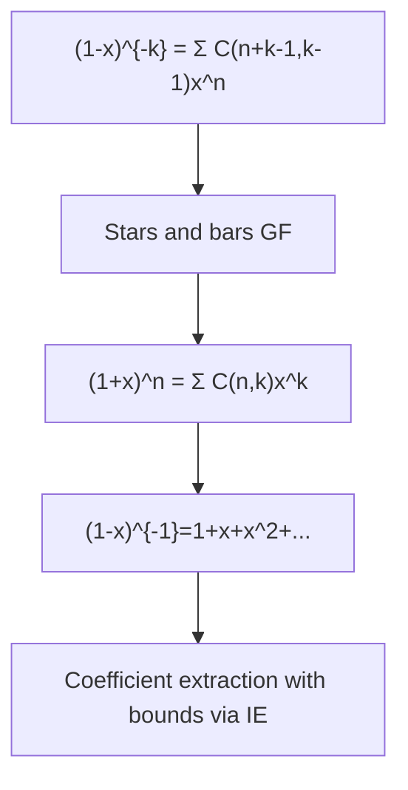

---

## Conic Sections

### 15. Conic Family — Eccentricity

**Mermaid**:
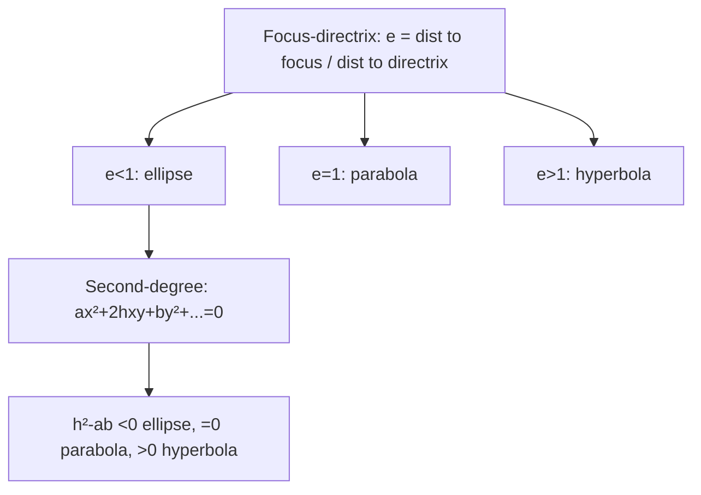

### 16. Parabola — Tangent & Reflection

**Mermaid**:
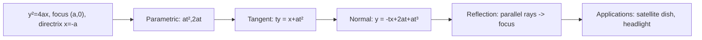

### 17. Ellipse — Squashed Circle

**Mermaid**:
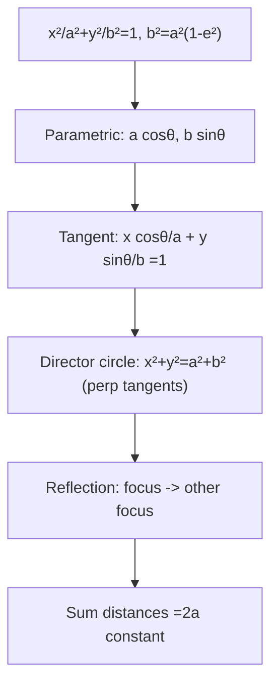

### 18. Hyperbola — Asymptotes

**Mermaid**:
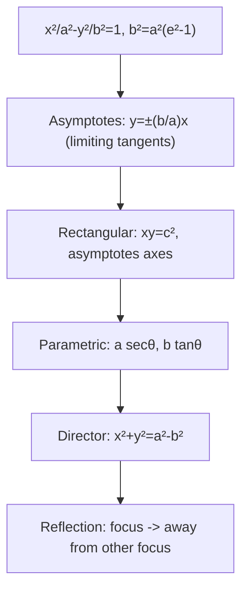

### 19. Unified Machinery — T=0, S1, Polar

**Mermaid**:
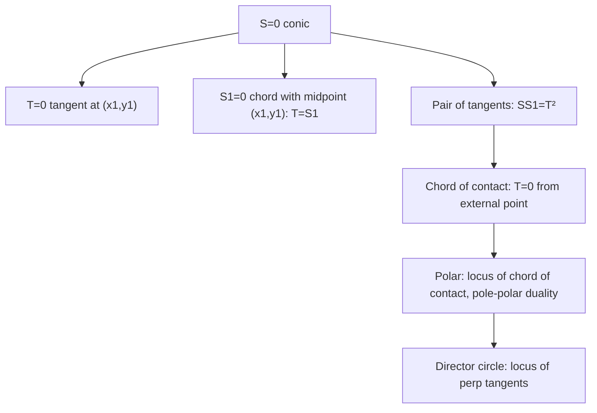

### 20. Confocal & Reflection Proofs

**Mermaid**:
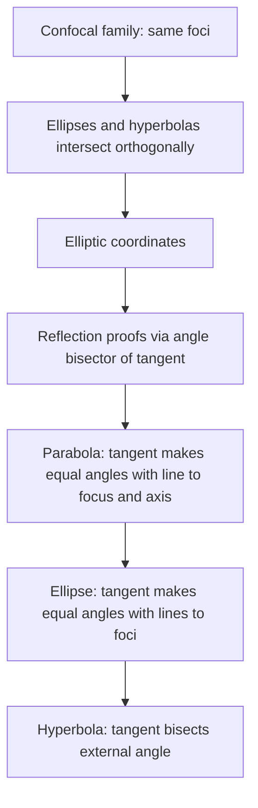

---

## How Diagrams Are Used in Markdown

1. **SVG** — Exact figure from HTML, preserved for offline use:
   ```md
   
   ```

2. **Mermaid** — Added for GitHub native rendering, same concept but interactive:
   ````md
   ```mermaid
   flowchart TD
       Start --> Red
   ```
   ````

3. **Both** — Every major concept has SVG + Mermaid, so notes work offline (SVG) and online (Mermaid) — dual redundancy.

---

*All figures are stored as `notes/<Module>/assets/fig-XX.svg`; see [FORMATTING-GUIDE.md](FORMATTING-GUIDE.md) for how they are referenced.*
