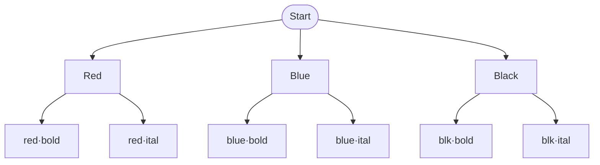
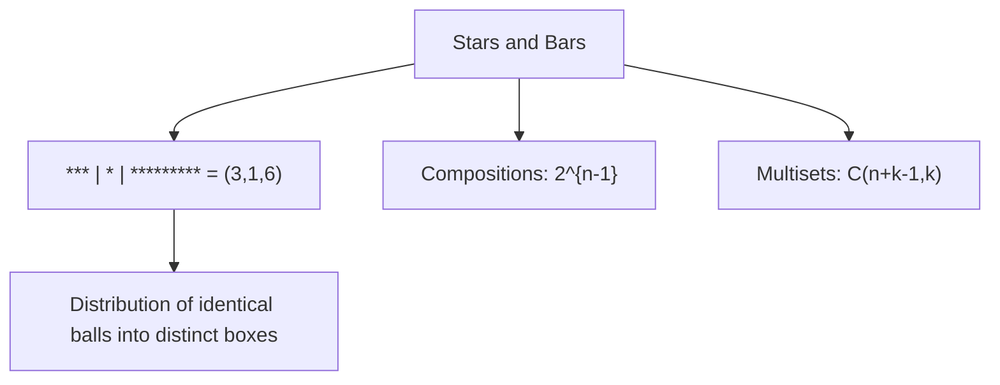
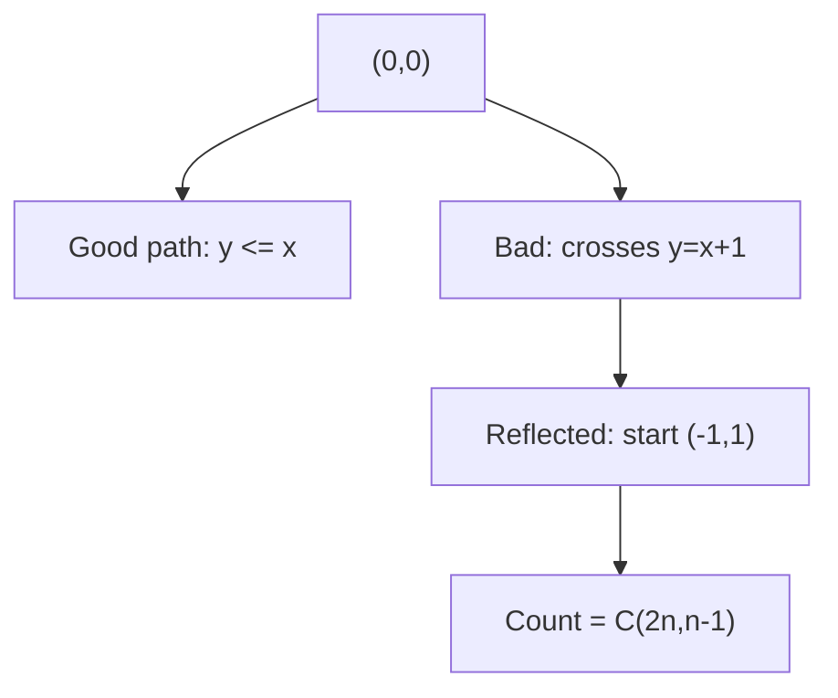
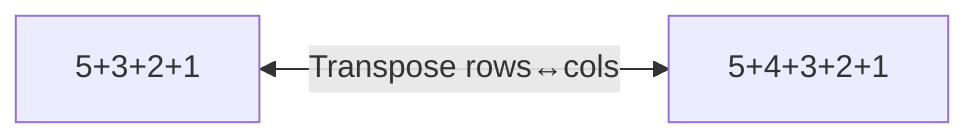
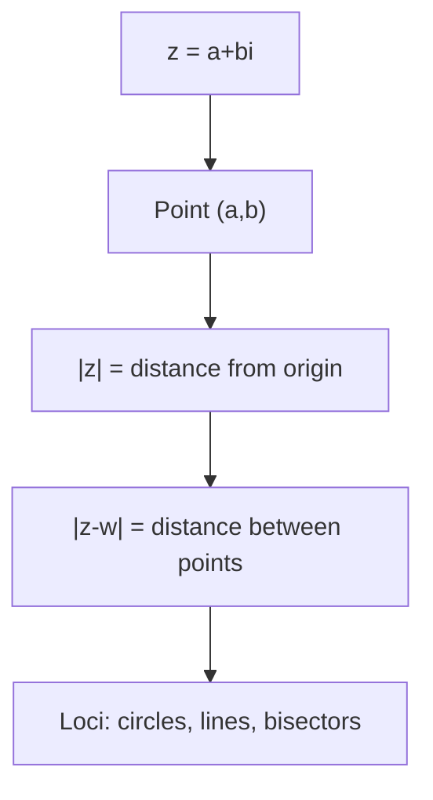
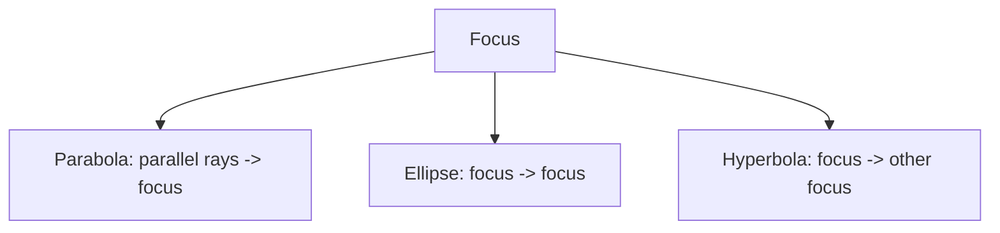

# JEE Advanced + Olympiad — Complete Theory Roadmap

> **Well-ordered from board-level basics → JEE Main → JEE Advanced → Olympiad frontier**

This roadmap shows how each module builds from first principles to Olympiad-level mathematics. Every formula is **derived from reasoning**, never memorized.

## 📊 Progress — how many chapters remain

Each module is **6 chapters**. The target syllabus is the **15-module JEE
roadmap** below (90 chapters). **Conic Sections** is done from that list; the 3
extras already built (PnC, Complex Numbers, Binomial Theorem) sit *beyond* the
roadmap.

```dataview
LIST
FROM "notes"
WHERE type = "notes"
SORT file.name ASC
```

**➡ 8 of the 15 roadmap modules remain → 48 chapters still to write** from
basics to Olympiad level.

| # | Module | Folder | Status |
|---|---|---|---|
| 1 | Quadratic Equations | `notes/Quadratic-Equations/` | ⬜ to do |
| 2 | Inequalities | `notes/Inequalities/` | ⬜ to do |
| 3 | Trigonometry | `notes/Trigonometry/` | ⬜ to do |
| 4 | Sequences & Series | `notes/Sequences-and-Series/` | ⬜ to do |
| 5 | Limits & Continuity | `notes/Limits-and-Continuity/` | ✅ done |
| 6 | Differentiation & Methods | `notes/Differentiation-and-Methods/` | ✅ done |
| 7 | Applications of Derivatives | `notes/Applications-of-Derivatives/` | ✅ done |
| 8 | Integration | `notes/Integration/` | ✅ done |
| 9 | Differential Equations | `notes/Differential-Equations/` | ✅ done |
| 10 | Coordinate Geometry — Lines & Circles | `notes/Coordinate-Geometry-Lines-and-Circles/` | ✅ done |
| 11 | Conic Sections | `notes/Conic-Sections/` | ✅ done |
| 12 | 3D Geometry | `notes/3D-Geometry/` | ⬜ to do |
| 13 | Vectors | `notes/Vectors/` | ⬜ to do |
| 14 | Matrices & Determinants | `notes/Matrices-and-Determinants/` | ⬜ to do |
| 15 | Probability | `notes/Probability/` | ⬜ to do |
| — | PnC · Permutations & Combinations *(bonus)* | `notes/PnC/` | ✅ done |
| — | Complex Numbers *(bonus)* | `notes/Complex-Numbers/` | ✅ done |
| — | Binomial Theorem *(bonus)* | `notes/Binomial-Theorem/` | ✅ done |

---


## 1. Permutations & Combinations (PnC)

**Philosophy**: Everything is `construct` (product rule), `split` (sum rule), or `match up` (bijection).

### Chapter 1 — Counting Basics (Foundations)
- **JEE Main**: What counting means, finite sets, product rule, sum rule, complement principle
- **JEE Adv**: Bijection as proof technique, involution principle (toggle element 1)
- **Olympiad**: Double counting proof machine, mistake checklist (labeled vs unlabeled, order, independence, exhaustive/disjoint, small-case verification)

**Diagrams**:


### Chapter 2 — Permutations (Order Matters)
- **JEE Main**: $^nP_r = n!/(n-r)!$, factorial, $0! = 1$ (empty bijection)
- **JEE Adv**: Identical objects $\frac{n!}{n_1!n_2!\cdots}$, circular $(n-1)!$, bundle method (together), gap method (no two adjacent), fixed relative order $\frac{n!}{k!}$
- **Olympiad**: Derangements $D_n = n!\sum_{k=0}^n (-1)^k/k!$, recurrence $D_n = (n-1)(D_{n-1}+D_{n-2})$, nearest integer to $n!/e$, rencontres numbers $\binom{n}{k}D_{n-k}$

```mermaid
flowchart LR
    A[Linear: n!] -- divide by n --> B[Circular: (n-1)!]
    B -- flip allowed --> C[Necklace: (n-1)!/2]
    A -- divide by k! --> D[Relative order: n!/k!]
```

### Chapter 3 — Combinations (Order Irrelevant)
- **JEE Main**: $\binom{n}{r} = \frac{n!}{r!(n-r)!}$, mirror symmetry via complementation, Pascal's identity $\binom{n}{r} = \binom{n-1}{r} + \binom{n-1}{r-1}$
- **JEE Adv**: Restricted selections, hockey-stick $\sum_{i=r}^n \binom{i}{r} = \binom{n+1}{r+1}$, stars and bars $\binom{n+k-1}{k-1}$ (non-negative) and $\binom{n-1}{k-1}$ (positive), compositions $2^{n-1}$, multinomial $\frac{n!}{n_1!\cdots n_k!}$
- **Olympiad**: Partitions $p(n)$ (no closed form), generating function $\prod_{k\ge1} \frac{1}{1-x^k}$, Euler distinct = odd



### Chapter 4 — Binomial Coefficients & Identities
- **JEE Main**: Binomial theorem $(x+y)^n = \sum \binom{n}{k}x^{n-k}y^k$ proved by counting, specializations $(1+1)^n=2^n$, $(1-1)^n=0$
- **JEE Adv**: Double counting toolkit, Vandermonde $\sum \binom{r}{k}\binom{s}{n-k} = \binom{r+s}{n}$, negative binomial $(1-x)^{-k} = \sum \binom{n+k-1}{k-1}x^n$, coefficient extraction with bounds (bounded IE)
- **Olympiad**: Generating function proofs, combinatorial interpretations

### Chapter 5 — Advanced Methods (JEE Advanced Weapons)
- **JEE Main**: Inclusion-Exclusion principle $| \cup A_i | = \sum |A_i| - \sum |A_i\cap A_j| + \cdots$
- **JEE Adv**: Rook polynomials, pigeonhole principles (Dirichlet), recurrence counting (tilings, Fibonacci in Pascal)
- **Olympiad**: van der Waerden $W(2,3)=9$, Ramsey $R(3,3)=6$, Erdős–Szekeres via pigeonhole

### Chapter 6 — Olympiad Theory (The Frontier)
- **Generating Functions**: OGF $A(x)=\sum a_n x^n$, operations: $A(x)B(x)$ = independent stages, $\frac{1}{1-B(x)}$ = sequence, catalog $(1-x)^{-k}$, $(1+x)^n$, Fibonacci GF
- **Lattice Paths & Catalan**: Monotone paths $\binom{a+b}{b}$, reflection principle (first crossing + reflect), Catalan $C_n = \frac{1}{n+1}\binom{2n}{n} = \binom{2n}{n} - \binom{2n}{n+1}$, ballot theorem $\frac{p-q}{p+q}\binom{p+q}{q}$, $\frac{a-b+1}{a+1}\binom{a+b}{b}$



- **Burnside & Pólya**: Group action, orbits = $\frac{1}{|G|}\sum |\text{Fix}(g)|$, necklaces $N(n,k)=\frac{1}{n}\sum_{d|n}\varphi(d)k^{n/d}$, dihedral bracelet, cube rotations (24 elements) = 23 colorings
- **Partitions**: GF $\prod \frac{1}{1-x^k}$, pentagonal theorem $\prod(1-x^k)=\sum (-1)^j x^{j(3j-1)/2}$, recurrence $p(n)=p(n-1)+p(n-2)-p(n-5)-\cdots$, conjugation Young diagram bijection



- **Stirling & Bell**: $S(n,k)=kS(n-1,k)+S(n-1,k-1)$, closed form via IE $S(n,k)=\frac{1}{k!}\sum (-1)^j\binom{k}{j}(k-j)^n$, onto functions $k!S(n,k)$, Bell $B_n=\sum_k S(n,k)$
- **Olympiad Lemmas**: Cycle lemma (Dvoretzky–Motzkin), Sperner via LYM random chain, Erdős–Szekeres $(r-1)(s-1)+1$, probabilistic method $\mathbb{E}<1 \Rightarrow \exists$

---

## 2. Complex Numbers

### Chapter 1 — Foundations: Algebra & Plane
- **Basics**: $i^2=-1$, $z=a+bi$, $\text{Re}z$, $\text{Im}z$, equality componentwise, $0!$-like $0=0+0i$
- **Arithmetic**: Forced by distributivity: $(a+bi)(c+di)=(ac-bd)+(ad+bc)i$, no zero divisors → field
- **Conjugate & Division**: $\bar z = a-bi$, $z\bar z = a^2+b^2 = |z|^2$, division $\frac{z}{w} = \frac{z\bar w}{|w|^2}$, $\frac{1}{i}=-i$
- **Plane**: $z \leftrightarrow (a,b)$, addition = vector addition, modulus $|z|=\sqrt{a^2+b^2}$, distance $|z-w|$, loci: $|z-z_0|=r$ circle, $|z-a|=|z-b|$ perpendicular bisector, $\text{Re}z=c$ vertical line
- **Inequalities**: Triangle $|z+w|\le|z|+|w|$, reverse $||z|-|w||\le|z-w|$, parallelogram law $|z+w|^2+|z-w|^2=2|z|^2+2|w|^2$



### Chapter 2 — Polar Form & De Moivre
- **Polar**: $z = r(\cos\theta + i\sin\theta)$, $r=|z|$, $\theta=\arg z$, multiplication = stretch + rotate, $|zw|=|z||w|$, $\arg(zw)=\arg z + \arg w$, $\times i$ = $90^\circ$ CCW
- **De Moivre**: $(\cos\theta + i\sin\theta)^n = \cos n\theta + i\sin n\theta$, powers, $n$-th roots = regular $n$-gon, $z^n = a$ has $n$ solutions

### Chapter 3 — Roots of Unity
- **Structure**: $\omega = e^{2\pi i/n}$, $\omega^n=1$, $1+\omega+\cdots+\omega^{n-1}=0$, primitive roots, factorization $x^n-1 = \prod (x-\omega^k)$, $x^n-a$, filter $\frac{1}{n}\sum \zeta^{-rk}$ for every $r$-th term
- **Olympiad**: Regular polygons algebraic, cyclotomic polynomials, $1+\omega+\omega^2=0$ for cube roots

### Chapter 4 — JEE Advanced Core
- **Equations**: $z$, $\bar z$, $|z|$, $\arg z$ conditions, $|z-a|=k|z-b|$ Apollonius circle, $\arg\frac{z-a}{z-b} = \theta$ arc
- **Optimization**: Minimize $|z-a|$ subject to $|z|=r$ via triangle inequality, reverse triangle
- **Taxonomy**: Real/imaginary parts, purely imaginary, $iz=\bar z$ line $y=-x$

### Chapter 5 — Geometry via Complex Numbers
- **Encoding**: Points as complex numbers, collinearity, concyclicity, rotation $e^{i\theta}$, section formula
- **Theorems**: Ptolemy, van Aubel, regular polygons one-line algebra, $|z_1-z_2|^2 = (z_1-z_2)(\bar z_1-\bar z_2)$
- **Olympiad Weapon**: Complex bash for geometry, $z\bar z = |z|^2$ to eliminate $\bar z$

### Chapter 6 — Synthesis & Olympiad Paper
- 38 questions A–H, from $i$ cycle to geometry, with full solutions

---

## 3. Binomial Theorem

### Chapter 1 — What $(a+b)^n$ Counts
- **First Principles**: $(a+b)^n$ = $n$ brackets, choose $b$ from $k$ brackets → $\binom{n}{k}$ = number of pick-lists, Pascal's triangle as census, $2^n$ identity via bijection
- **JEE Main**: General term $T_{k+1} = \binom{n}{k}a^{n-k}b^k$, symmetry $\binom{n}{k}=\binom{n}{n-k}$, Pascal rule via conditioning on first bracket
- **Substitution Engines**: Sum of coefficients $f(1)$, constant term $f(0)$, even/odd split $\frac{f(1)\pm f(-1)}{2}$

### Chapter 2 — Coefficient Machinery
- **General Term**: $(x+a)^n$, $(px+q)^n$, middle term(s), numerically greatest term, $T_{k+1} = \binom{n}{k}p^{n-k}q^k x^{?}$
- **JEE Adv**: Coefficient of $x^m$ in $(1+x+x^2)^n$, $(1+x)^n(1+1/x)^n$, greatest coefficient

### Chapter 3 — Three Identity Engines
- **Substitution**: Evaluate at $1, -1, \frac12$, etc.
- **Bijection**: Subset counting, committee with chair $k\binom{n}{k}=n\binom{n-1}{k-1}$, $\sum k\binom{n}{k}=n2^{n-1}$
- **Double Counting**: Vandermonde, $\sum \binom{n}{k}^2 = \binom{2n}{n}$, committee from two groups

### Chapter 4 — Beyond Non-Negative Integer Powers
- **Negative Binomial**: $(1+x)^{-n} = \sum (-1)^k\binom{n+k-1}{k}x^k$, $(1-x)^{-k} = \sum \binom{n+k-1}{k-1}x^n$ (stars and bars), infinite series, convergence $|x|<1$
- **Multinomial**: $(a+b+c)^n$, general term $\frac{n!}{i!j!k!}a^i b^j c^k$, number of distinct terms $\binom{n+2}{2}$

### Chapter 5 — Size, Growth and Extremes
- **Growth**: $\binom{n}{k}$ increases to middle, unimodal, largest coefficient, $\binom{2n}{n} \sim \frac{4^n}{\sqrt{\pi n}}$
- **Inequalities**: $\binom{n}{k} \le \frac{n^k}{k!}$, $\binom{n}{k} \ge (\frac{n}{k})^k$, bounding sums
- **JEE Adv**: Greatest term, greatest coefficient, monotonicity

### Chapter 6 — Divisibility, Parity and Primes
- **Divisibility**: $\binom{p}{k} \equiv 0 \pmod p$ for prime $p$, $0<k<p$, Lucas theorem, $\binom{n}{k}$ even/odd via binary (Kummer), $v_p(n!)$
- **Olympiad**: $\binom{2n}{n}$ not divisible by something, prime factorization, $\sum \binom{n}{k}$ parity

---

## 4. Conic Sections

### Chapter 1 — Conic Family from First Principles
- **Definition**: Locus with focus-directrix $e = \frac{\text{distance to focus}}{\text{distance to directrix}}$, $e<1$ ellipse, $e=1$ parabola, $e>1$ hyperbola, second-degree general equation $ax^2+2hxy+by^2+2gx+2fy+c=0$, discriminant $h^2-ab$
- **First Principles**: Why $e$ determines shape, why general second-degree is conic under rotation

### Chapter 2 — Parabola: Anatomy and Machinery
- **Standard**: $y^2=4ax$, focus $(a,0)$, directrix $x=-a$, latus rectum $4a$, parametric $at^2,2at$, $t$ as slope
- **JEE Adv**: Chord $ty = x+at^2$, tangent $ty = x+at^2$, normal $y = -tx+2at+at^3$, chord of contact, director circle
- **Reflection**: Parabola reflects parallel rays to focus, $y^2=4ax$ property

### Chapter 3 — Ellipse: Geometry of Squashed Circle
- **Standard**: $\frac{x^2}{a^2}+\frac{y^2}{b^2}=1$, foci $(\pm ae,0)$, $b^2=a^2(1-e^2)$, major/minor axes, latus rectum $2b^2/a$, parametric $a\cos\theta,b\sin\theta$
- **JEE Adv**: Tangent $\frac{x\cos\theta}{a}+\frac{y\sin\theta}{b}=1$, director circle $x^2+y^2=a^2+b^2$, auxiliary circle, chord, normal, reflection property (sum of distances constant)

### Chapter 4 — Hyperbola and Its Asymptotes
- **Standard**: $\frac{x^2}{a^2}-\frac{y^2}{b^2}=1$, $b^2=a^2(e^2-1)$, foci $(\pm ae,0)$, asymptotes $y=\pm\frac{b}{a}x$, rectangular hyperbola $xy=c^2$, parametric $a\sec\theta,b\tan\theta$
- **JEE Adv**: Tangent, normal, asymptotes as limiting tangents, director circle $x^2+y^2=a^2-b^2$, conjugate hyperbola

### Chapter 5 — Tangents, Normals, Chords and Polars
- **Unified Machinery**: $T=0$ tangent, $S_1=0$ chord with midpoint, $T=S_1$ chord of contact, polar, pole, director circle locus of perpendicular tangents
- **JEE Adv**: Pair of tangents $S S_1 = T^2$, chord of contact, family of conics, coaxal system
- **Olympiad**: Pole-polar duality, harmonic bundles, confocal conics

### Chapter 6 — Olympiad Frontier: Reflection, Confocal, and Synthesis
- **Reflection Properties**: Parabola parallel → focus, ellipse focus → focus, hyperbola focus → other focus, proofs via tangent angle bisector
- **Confocal**: Family of conics with same foci, orthogonal intersection, elliptic coordinates
- **Olympiad**: $S=0$ as locus, second-degree homogeneous, rotation removing $xy$ term, classification via eigenvalues

---

## Coverage Matrix

| Level | PnC | Complex Numbers | Binomial Theorem | Conic Sections |
|-------|-----|-----------------|------------------|----------------|
| **JEE Main** | product/sum rule, $^nP_r$, $^nC_r$, factorial | $i^2=-1$, $a+bi$, modulus, conjugate, $|z-w|$ | $(a+b)^n$, $\binom{n}{k}$, general term, sum of coeffs | $y^2=4ax$, $\frac{x^2}{a^2}+\frac{y^2}{b^2}=1$, $\frac{x^2}{a^2}-\frac{y^2}{b^2}=1$, focus-directrix |
| **JEE Adv** | gap method, circular, derangements, stars & bars with bounds, IE, rook | polar form, De Moivre, $n$-th roots, Apollonius circle, $\arg$, optimization via triangle inequality | Vandermonde, negative binomial, multinomial, greatest term, coefficient extraction | $T=0$, $S_1$, chord, normal, director circle, pair of tangents, asymptotes, parametric |
| **Olympiad** | bijections, involutions, double counting, Catalan & reflection, Burnside–Pólya, partitions & Euler, Stirling/Bell, Sperner, Erdős–Szekeres, probabilistic method, cycle lemma | roots of unity filter, regular $n$-gon, Ptolemy via complex, geometry bash, $\omega$ | Lucas, Kummer, $v_p$, parity, divisibility of $\binom{n}{k}$, generating functions | pole-polar, confocal orthogonal, reflection proofs, classification of second-degree, harmonic |

---

## How to Use

1. **Read in order** — each chapter's First Principles box is load-bearing
2. **Boxes**:
   - ⛁ First Principles = derivation, not fact
   - 💡 Key Idea = takeaway technique
   - ⚠ Common Trap = classic mistake
   - ★ Olympiad Extension = frontier
3. **Small-case habit**: For any counting answer, list all cases for $n=3,4$ and verify
4. **Paper**: Attempt Olympiad paper after Chapter 6, without solutions, 4–5 hours

---

## Diagrams

All SVG diagrams from HTML are saved in `notes/<Module>/assets/fig-XX.svg` and referenced in markdown. Mermaid flowcharts are added for:

- Decision tree (product rule)
- Circular permutations (rotation equivalence)
- Pascal's triangle (hockey-stick)
- Stars and bars (distribution)
- Lattice paths & reflection principle
- Young diagram conjugation
- Complex plane loci
- Conic reflection properties

Example:



---

*Roadmap for the Obsidian vault. Diagrams live in `notes/<Module>/assets/fig-XX.svg`; see `docs/DIAGRAMS.md` for the full catalog and `docs/JEE-ADVANCED-OLYMPIAD-COVERAGE.md` for the per-topic proof.*
