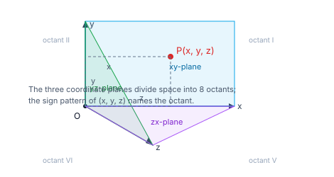
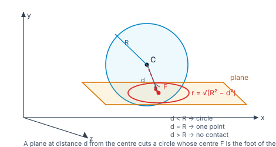

> [!info] Navigation
> 📖 [[Home|Vault home]] · 📝 [[3D-Geometry — Paper|Olympiad Paper]] · ✅ [[3D-Geometry — Solutions|Solutions]]

# 3D Geometry

Three numbers locate a point in space, and — just as in two dimensions — a
geometric object becomes an equation. A line is two equations; a plane is one;
a sphere is one quadratic. Almost every 3D question in the JEE syllabus is one
of five computations: an **angle**, a **distance**, a **foot** (the nearest
point), an **image** (the mirror point), or a **locus**.

This module is the *analytic* companion to [[Vectors|the Vectors module]]: the
products, triple products and volumes live there, while here we work with the
Cartesian equations of the line, the plane and the sphere — including the
standard forms and the sphere, which Vectors does not cover.

`6 chapters` `worked examples (S) + practice (P)` `SVG + Mermaid diagrams` `34-question Olympiad paper + full solutions`

### ★ How to use these notes

**Read in order.** Chapters 1–2 set up coordinates and directions. Chapters 3–4
are the line and the plane — the two workhorses. Chapter 5 is the sphere, the
only genuinely curved surface in the syllabus. Chapter 6 is the frontier.

- **Callouts** — `[!abstract]` First Principles = the derivation; `[!tip]` Key
  Idea = the takeaway; `[!warning]` Common Trap = the classic mistake;
  `[!example]` Olympiad Extension = the frontier version.
- **Numeric habit** — every numeric answer in this module was verified in pure
  Python before it was written, and each is accompanied by a check.

### ▣ The roadmap

| Ch | Title | Level |
|---|---|---|
| 1 | Coordinates in space, distance & locus | foundations |
| 2 | Direction cosines and ratios | machinery |
| 3 | Straight lines in space | core |
| 4 | The plane | core |
| 5 | The sphere | applications |
| 6 | Olympiad frontier | synthesis |

**Fig 1.1 — the three coordinate planes.** The $xy$-, $yz$- and $zx$-planes
divide space into eight **octants**. The signs pattern of $(x,y,z)$ tells you
which octant a point lies in.

**Fig 1.2 — a plane cutting a sphere.** The section is a **circle**, whose centre
is the foot of the perpendicular from the sphere's centre to the plane. Its
radius comes from Pythagoras: $r^2=R^2-d^2$.

---

# Chapter 1 — Coordinates in Space, Distance & Locus

*Foundations · three numbers and what they buy*

## 1.1 The coordinate system

Three mutually perpendicular axes through an origin $O$, with the $xy$-, $yz$-
and $zx$-planes, split space into **eight octants**. A point $P$ is
$(x,y,z)$ — its signed distances from the three coordinate planes.

Useful sign facts:

- Reflection in the $xy$-plane sends $(x,y,z)\mapsto(x,y,-z)$.
- Reflection in the origin sends $(x,y,z)\mapsto(-x,-y,-z)$.
- Reflection in the plane $x=a$ sends $(x,y,z)\mapsto(2a-x,y,z)$.

#### **S1**[JEE Main][solved][reflection]Find the reflection of $(1,2,3)$ in the $xy$-plane and in the origin.

In the $xy$-plane the $z$-coordinate changes sign: $(1,2,-3)$. In the origin all three change: $(-1,-2,-3)$.

Answer + Reasoning

**Method: flip the sign of the coordinate measured perpendicular to the mirror.**

**Answer:** $(1,2,-3)$ and $(-1,-2,-3)$.

## 1.2 Distance and division

The distance between $A(x_1,y_1,z_1)$ and $B(x_2,y_2,z_2)$ is
$\sqrt{(x_2-x_1)^2+(y_2-y_1)^2+(z_2-z_1)^2}$.

> [!abstract] First Principles — the section formula
> The point dividing $AB$ **internally** in the ratio $m:n$ is
> $$\left(\frac{mx_2+nx_1}{m+n},\frac{my_2+ny_1}{m+n},\frac{mz_2+nz_1}{m+n}\right).$$
> For **external** division replace $+n$ by $-n$ throughout. The derivation is a
> one-liner: the point is $\mathbf a+\frac{m}{m+n}(\mathbf b-\mathbf a)$.

#### **S2**[JEE Main][solved][section]Find the point dividing the join of $(1,0,0)$ and $(4,5,6)$ in the ratio $2:3$.

$\dfrac{3(1,0,0)+2(4,5,6)}{5}=\dfrac{(11,10,12)}{5}=\left(\dfrac{11}{5},2,\dfrac{12}{5}\right)$.

Answer + Reasoning

**Method: section formula** $\frac{n\mathbf a+m\mathbf b}{m+n}$ — note $n$ pairs with $\mathbf a$.

**Answer:** $\left(\dfrac{11}{5},2,\dfrac{12}{5}\right)=(2.2,2,2.4)$.

> [!warning] Common Trap — the section formula's weights
> In "$m:n$" the weight attached to $A$ is $n$, not $m$. Check with the
> midpoint ($m=n$): both weights equal, so the formula must be symmetric.

## 1.3 Locus and translation of axes

> [!tip] Key Idea — a locus is an equation plus a description
> "Points at distance $5$ from the origin" becomes $x^2+y^2+z^2=25$. Every
> locus problem is the same two steps: translate the condition into an equation,
> then simplify.

If the origin is shifted to $(a,b,c)$, a point's new coordinates are
$(x-a,\,y-b,\,z-c)$ — this is how you **complete the square** to find the
centre of a sphere.

#### **P1**[JEE Main][practice][locus]Find $z$ for a point at distance $5$ from the origin with $x=3$, $y=4$.

Answer + Reasoning

**Method: substitute into $x^2+y^2+z^2=25$.** $9+16+z^2=25\Rightarrow z^2=0$.

**Answer:** $z=0$ (a unique point).

#### **P2**[JEE Main][practice][translation]Shift the origin to $(1,2,3)$. What are the new coordinates of $(4,6,9)$?

Answer + Reasoning

**Method: new $=$ old $-$ origin.** $(4-1,6-2,9-3)=(3,4,6)$.

**Answer:** $(3,4,6)$.

---

# Chapter 2 — Direction Cosines and Ratios

*Machinery · how a line "points"*

## 2.1 Direction cosines

> [!abstract] First Principles — direction cosines
> A line's direction is fixed by the angles $\alpha,\beta,\gamma$ it makes with
> the positive axes. Their cosines $l,m,n$ satisfy
> $$l^2+m^2+n^2=1,$$
> because they are the components of a unit vector. **Direction ratios** $a,b,c$
> are any numbers proportional to $(l,m,n)$; the cosines are
> $$\frac{a}{\sqrt{a^2+b^2+c^2}},\quad\frac{b}{\sqrt{a^2+b^2+c^2}},\quad\frac{c}{\sqrt{a^2+b^2+c^2}}.$$

The direction ratios of the line through $(x_1,y_1,z_1)$ and $(x_2,y_2,z_2)$ are
simply $(x_2-x_1,\,y_2-y_1,\,z_2-z_1)$.

#### **S3**[JEE Main][solved][dcs]Find the direction cosines of the line with direction ratios $(2,-1,2)$.

$\sqrt{4+1+4}=3$, so $(l,m,n)=\left(\dfrac23,-\dfrac13,\dfrac23\right)$.

Answer + Reasoning

**Method: divide by the magnitude.** Check: $\frac49+\frac19+\frac49=1$ ✓.

**Answer:** $\left(\dfrac23,-\dfrac13,\dfrac23\right)$.

> [!warning] Common Trap — ratios are not cosines
> $(2,-1,2)$ are *ratios*. Calling them *cosines* breaks $l^2+m^2+n^2=1$: here
> $4+1+4=9$, not $1$. Always normalise first.

## 2.2 Angles between lines and projection

For lines with direction ratios $(a_1,b_1,c_1)$ and $(a_2,b_2,c_2)$:
$$\cos\theta=\frac{a_1a_2+b_1b_2+c_1c_2}{\sqrt{a_1^2+b_1^2+c_1^2}\sqrt{a_2^2+b_2^2+c_2^2}}.$$

Perpendicular lines: $a_1a_2+b_1b_2+c_1c_2=0$. Parallel lines:
$a_1:b_1:c_1=a_2:b_2:c_2$.

> [!tip] Key Idea — projection of a segment on a line
> The (signed) projection of the segment $AB$ on a line with unit direction
> $\hat{\mathbf d}$ is $(\mathbf b-\mathbf a)\cdot\hat{\mathbf d}$. It is the
> **shadow** the segment casts on that line.

#### **S4**[JEE Main][solved][angle]Find the angle between the lines with direction ratios $(1,2,2)$ and $(2,1,-1)$.

$\cos\theta=\dfrac{2+2-2}{3\sqrt6}=\dfrac{2}{3\sqrt6}$, so $\theta\approx74.21^\circ$.

Answer + Reasoning

**Method: the cosine formula.** $|(1,2,2)|=3$, $|(2,1,-1)|=\sqrt6$.

**Answer:** $\theta=\cos^{-1}\!\left(\dfrac{2}{3\sqrt6}\right)\approx74.21^\circ$.

#### **P3**[JEE Main][practice][projection]Find the projection of the segment from $(1,2,3)$ to $(4,6,9)$ on the line with direction ratios $(2,-1,2)$.

Answer + Reasoning

**Method: $(\mathbf b-\mathbf a)\cdot\hat{\mathbf d}$.** $(3,4,6)\cdot\frac{(2,-1,2)}{3}=\frac{6-4+12}{3}=\frac{14}{3}$.

**Answer:** $\dfrac{14}{3}\approx4.6667$.

#### **P4**[JEE Main][practice][perpendicular]Are the lines with direction ratios $(2,3,4)$ and $(4,3,2)$ perpendicular?

Answer + Reasoning

**Method: test the dot product.** $8+9+8=25\ne0$.

**Answer:** no.

---

# Chapter 3 — Straight Lines in Space

*Core · one point, one direction*

## 3.1 The three standard equations

> [!abstract] First Principles — a line is a point plus a direction
> Through $A(x_1,y_1,z_1)$ with direction ratios $a,b,c$:
> - **Symmetric form:** $\dfrac{x-x_1}{a}=\dfrac{y-y_1}{b}=\dfrac{z-z_1}{c}$
> - **Vector form:** $\mathbf r=\mathbf a+t\mathbf b$
> - **Two-point form:** $\dfrac{x-x_1}{x_2-x_1}=\dfrac{y-y_1}{y_2-y_1}=\dfrac{z-z_1}{z_2-z_1}$

The **general form** is the intersection of two planes:
$a_1x+b_1y+c_1z+d_1=0$ and $a_2x+b_2y+c_2z+d_2=0$.

#### **S5**[JEE Main][solved][line]Write the line through $(1,2,3)$ and $(4,6,9)$.

Direction ratios $(3,4,6)$, so $\dfrac{x-1}{3}=\dfrac{y-2}{4}=\dfrac{z-3}{6}$.

Answer + Reasoning

**Method: two-point form — the direction ratios are the differences of the coordinates.**

**Answer:** $\dfrac{x-1}{3}=\dfrac{y-2}{4}=\dfrac{z-3}{6}$.

## 3.2 From general form to symmetric form

> [!tip] Key Idea — the direction of the intersection of two planes
> The line common to two planes has direction $\mathbf n_1\times\mathbf n_2$ —
> it is perpendicular to both normals. So take the cross product of the two
> normal vectors, then find *one* point on the line by setting one coordinate to
> $0$ (or any convenient value) and solving the resulting $2\times2$ system.

#### **S6**[JEE Adv][solved][general form]Convert the intersection of $x+y+z=1$ and $2x-3y+4z=5$ to symmetric form.

$\mathbf n_1\times\mathbf n_2=(1,1,1)\times(2,-3,4)=(7,-2,-5)$. Setting $z=0$: $x+y=1$, $2x-3y=5$, giving $x=\frac85$, $y=-\frac35$. So the line is $\dfrac{x-\frac85}{7}=\dfrac{y+\frac35}{-2}=\dfrac{z}{-5}$.

Answer + Reasoning

**Method: cross the normals for the direction; solve with $z=0$ for a point.** Check the point: $\frac85-\frac35+0=1$ ✓ and $\frac{16}{5}+\frac95=5$ ✓.

**Answer:** $\dfrac{x-\frac85}{7}=\dfrac{y+\frac35}{-2}=\dfrac{z}{-5}$.

## 3.3 Angle, coplanarity and intersection

Two lines with directions $\mathbf b_1,\mathbf b_2$ through points $\mathbf a_1,\mathbf a_2$
are **coplanar** exactly when
$$(\mathbf a_2-\mathbf a_1)\cdot(\mathbf b_1\times\mathbf b_2)=0.$$

The scalar triple product vanishes precisely when the three vectors
$\mathbf a_2-\mathbf a_1$, $\mathbf b_1$, $\mathbf b_2$ lie in one plane — which
is exactly what it means for the two lines to be coplanar. Lines that are
neither parallel nor coplanar are **skew**.

#### **S7**[JEE Adv][solved][coplanar]Are the lines $\mathbf r=t(1,0,0)$ and $\mathbf r=(0,1,0)+s(0,0,1)$ coplanar?

$(0,1,0)\cdot\big((1,0,0)\times(0,0,1)\big)=(0,1,0)\cdot(0,-1,0)=-1\ne0$. Not coplanar — they are skew.

Answer + Reasoning

**Method: the coplanarity triple product.** (Geometrically: the $x$-axis and the line $(0,1,t)$ — the first runs along $x$, the second is parallel to $z$ through $(0,1,0)$; they never meet and are not parallel ✓.)

**Answer:** skew; the triple product is $-1$.

## 3.4 Foot of the perpendicular and image of a point

> [!abstract] First Principles — foot and image on a line
> For the line $\mathbf r=\mathbf a+t\mathbf b$ and a point $P$ with position
> vector $\mathbf p$, set
> $$t_0=\frac{(\mathbf p-\mathbf a)\cdot\mathbf b}{\mathbf b\cdot\mathbf b}.$$
> The **foot** is $F=\mathbf a+t_0\mathbf b$; the **image** is $I=2F-P$. The
> foot is the projection of $P$ onto the line, and $F$ is the midpoint of $PI$.

#### **S8**[JEE Adv][solved][foot]Find the foot of the perpendicular from $(1,2,3)$ to the line $\mathbf r=t(2,-1,2)$, and the image of the point in that line.

$t_0=\frac{(1,2,3)\cdot(2,-1,2)}{9}=\frac{2-2+6}{9}=\frac23$, so $F=\frac23(2,-1,2)=\left(\frac43,-\frac23,\frac43\right)$ and $I=2F-P=\left(\frac53,-\frac{10}{3},-\frac13\right)$.

Answer + Reasoning

**Method: project, then reflect.** Check $(P-F)\cdot(2,-1,2)=0$ ✓ and $F$ is the midpoint of $P$ and $I$ ✓.

**Answer:** foot $\left(\dfrac43,-\dfrac23,\dfrac43\right)$; image $\left(\dfrac53,-\dfrac{10}{3},-\dfrac13\right)$.

## 3.5 Shortest distance between two lines

> [!abstract] First Principles — skew-line distance
> For lines $\mathbf r=\mathbf a_1+t\mathbf b_1$ and $\mathbf r=\mathbf a_2+s\mathbf b_2$
> that are not parallel, their shortest distance is
> $$d=\frac{\big\lvert(\mathbf a_2-\mathbf a_1)\cdot(\mathbf b_1\times\mathbf b_2)\big\rvert}{\lvert\mathbf b_1\times\mathbf b_2\rvert}.$$
> The numerator is the volume of the parallelepiped on the three vectors; dividing
> by the base area $\lvert\mathbf b_1\times\mathbf b_2\rvert$ leaves the height —
> which is precisely the gap between the two lines.

#### **S9**[Olympiad][solved][skew]Find the shortest distance between $\mathbf r=(1,2,3)+t(2,-1,2)$ and $\mathbf r=(4,5,6)+s(3,1,-1)$.

$\mathbf b_1\times\mathbf b_2=(2,-1,2)\times(3,1,-1)=(-1,8,5)$; $\mathbf a_2-\mathbf a_1=(3,3,3)$, so the numerator is $\lvert-3+24+15\rvert=36$ and the denominator $\sqrt{90}$. Hence $d=\dfrac{36}{\sqrt{90}}=\dfrac{12}{\sqrt{10}}$.

Answer + Reasoning

**Method: the skew-line formula.** Check: $\lvert\mathbf b_1\times\mathbf b_2\rvert=\sqrt{90}\ne0$ (not parallel) and the numerator $36\ne0$ (not coplanar), so the lines are genuinely skew ✓.

**Answer:** $\dfrac{12}{\sqrt{10}}\approx3.7947$.

#### **P5**[JEE Adv][practice][angle]Find the angle between the lines $\dfrac{x-1}{2}=\dfrac{y-2}{3}=\dfrac{z-3}{4}$ and $\dfrac{x-1}{4}=\dfrac{y-2}{1}=\dfrac{z-3}{-2}$.

Answer + Reasoning

**Method: the cosine formula on the direction ratios.** $\frac{\lvert8+3-8\rvert}{\sqrt{29}\sqrt{21}}=\frac{3}{\sqrt{609}}$.

**Answer:** $\theta=\cos^{-1}\!\left(\dfrac3{\sqrt{609}}\right)\approx83.02^\circ$.

#### **P6**[JEE Main][practice][intersection]Do the lines $\dfrac{x}{1}=\dfrac{y}{2}=\dfrac{z}{3}$ and $\dfrac{x-1}{1}=\dfrac{y-2}{2}=\dfrac{z-3}{3}$ meet?

Answer + Reasoning

**Method: their directions are proportional, so they are parallel (not coincident, since $(1,2,3)$ is not on the first).**

**Answer:** no — they are parallel and distinct.

---

# Chapter 4 — The Plane

*Core · one point and one normal*

## 4.1 The standard forms

> [!abstract] First Principles — a plane is a point plus a normal
> Through $A$ with normal $\mathbf n$: $(\mathbf r-\mathbf a)\cdot\mathbf n=0$, i.e.
> $$n_1x+n_2y+n_3z=d,\qquad d=\mathbf a\cdot\mathbf n.$$
> Everything else is a special case:
> - **Intercept form:** $\dfrac xa+\dfrac yb+\dfrac zc=1$, normal $\left(\tfrac1a,\tfrac1b,\tfrac1c\right)$
> - **Three-point form:** use $\mathbf n=(\mathbf b-\mathbf a)\times(\mathbf c-\mathbf a)$
> - **Through a line and a point:** every plane through the line
>   $a_1x+b_1y+c_1z+d_1=0$, $a_2x+b_2y+c_2z+d_2=0$ is a linear combination of
>   the two equations

#### **S10**[JEE Main][solved][plane]Find the plane through $(1,2,3)$ with normal $(2,-3,4)$.

$(2,-3,4)\cdot(1,2,3)=2-6+12=8$, so $2x-3y+4z=8$.

Answer + Reasoning

**Method: $d=\mathbf a\cdot\mathbf n$.** Check $(1,2,3)$ satisfies it: $2-6+12=8$ ✓.

**Answer:** $2x-3y+4z=8$.

#### **S11**[JEE Main][solved][three points]Find the plane through $(1,0,0)$, $(0,2,0)$, $(0,0,3)$.

$(-1,2,0)\times(-1,0,3)=(6,3,2)$ and $d=6$, so $6x+3y+2z=6$.

Answer + Reasoning

**Method: normal = cross product of two edges.** Check all three points: $6=6$, $6=6$, $6=6$ ✓. (Equivalently $\frac x1+\frac y2+\frac z3=1$ ✓.)

**Answer:** $6x+3y+2z=6$.

## 4.2 Angles

The **angle between two planes** is the angle between their normals. The
**angle between a line** with direction $\mathbf b$ and a plane with normal
$\mathbf n$ is
$$\sin\theta=\frac{\lvert\mathbf b\cdot\mathbf n\rvert}{\lvert\mathbf b\rvert\lvert\mathbf n\rvert}.$$

> [!warning] Common Trap — $\sin$ for the line–plane angle
> The formula gives the angle between the line and the *normal*, which is the
> **complement** of the angle between the line and the *plane*. That is why
> $\sin$ appears, not $\cos$.

#### **S12**[JEE Main][solved][line-plane]Find the angle between the line with direction ratios $(2,3,4)$ and the plane $2x-3y+4z=5$.

$\sin\theta=\dfrac{\lvert4-9+16\rvert}{\sqrt{29}\cdot\sqrt{29}}=\dfrac{11}{29}$, so $\theta\approx22.29^\circ$.

Answer + Reasoning

**Method: $\sin\theta=\frac{\lvert\mathbf b\cdot\mathbf n\rvert}{\lvert\mathbf b\rvert\lvert\mathbf n\rvert}$.** Both vectors have length $\sqrt{29}$.

**Answer:** $\theta=\sin^{-1}\!\left(\dfrac{11}{29}\right)\approx22.29^\circ$.

## 4.3 Distances

The distance from $P(p_1,p_2,p_3)$ to $n_1x+n_2y+n_3z=d$ is
$$\frac{\lvert n_1p_1+n_2p_2+n_3p_3-d\rvert}{\sqrt{n_1^2+n_2^2+n_3^2}}.$$

For **parallel planes** $n_1x+n_2y+n_3z=d_1$ and $=d_2$ this reduces to
$\dfrac{\lvert d_1-d_2\rvert}{\sqrt{n_1^2+n_2^2+n_3^2}}$.

#### **S13**[JEE Main][solved][distance]Find the distance from $(1,1,1)$ to $2x-3y+4z-5=0$, and between the parallel planes $2x-3y+4z=5$ and $2x-3y+4z=10$.

$\dfrac{\lvert2-3+4-5\rvert}{\sqrt{29}}=\dfrac{2}{\sqrt{29}}$; and $\dfrac{\lvert10-5\rvert}{\sqrt{29}}=\dfrac5{\sqrt{29}}$.

Answer + Reasoning

**Method: the point–plane formula, and its special case for parallel planes.**

**Answer:** $\dfrac2{\sqrt{29}}\approx0.3714$ and $\dfrac5{\sqrt{29}}\approx0.9285$.

## 4.4 Families of planes

> [!tip] Key Idea — one parameter for a pencil of planes
> Every plane through the **line of intersection** of $P_1=0$ and $P_2=0$ is
> $$P_1+\lambda P_2=0$$
> for some real $\lambda$. Impose one more condition (e.g. passing through a
> given point) to solve for $\lambda$. This single trick replaces a page of
> simultaneous equations.

#### **S14**[JEE Adv][solved][pencil]Find the plane through the intersection of $x+y+z=1$ and $2x-3y+4z=5$ that passes through the origin.

$(x+y+z-1)+\lambda(2x-3y+4z-5)=0$. At the origin: $-1-5\lambda=0$, so $\lambda=-\frac15$. Multiplying by $5$: $3x+8y+z=0$.

Answer + Reasoning

**Method: the pencil $P_1+\lambda P_2=0$, then substitute the given point.** Check: it contains the origin ✓, and any point on both original planes satisfies it ✓.

**Answer:** $3x+8y+z=0$.

## 4.5 Foot, image and angle bisectors

The foot of the perpendicular from $P$ to $n_1x+n_2y+n_3z=d$ is
$$F=P-\frac{\mathbf p\cdot\mathbf n-d}{\lvert\mathbf n\rvert^2}\,\mathbf n,$$
and the **image** is $I=2F-P$.

The **angle bisector planes** of two planes $P_1=0$, $P_2=0$ are
$$\frac{P_1}{\lvert\mathbf n_1\rvert}=\pm\frac{P_2}{\lvert\mathbf n_2\rvert}.$$

#### **S15**[JEE Adv][solved][image]Find the image of $(1,2,3)$ in the plane $x+y+z=1$, and the foot of the perpendicular from $(1,2,3)$ to $2x-3y+4z-5=0$.

For $x+y+z=1$: $\frac{\mathbf p\cdot\mathbf n-d}{\lvert\mathbf n\rvert^2}=\frac{1+2+3-1}{3}=\frac53$, so the foot is $(1,2,3)-\frac53(1,1,1)=\left(-\frac23,\frac13,\frac43\right)$ and the image is $\left(-\frac73,-\frac43,-\frac13\right)$.

For $2x-3y+4z-5=0$: $\frac{2-6+12-5}{29}=\frac3{29}$, so the foot is $(1,2,3)-\frac3{29}(2,-3,4)=\left(\frac{23}{29},\frac{67}{29},\frac{75}{29}\right)$.

Answer + Reasoning

**Method: project, then reflect.** Checks: the first foot satisfies $x+y+z=1$ ✓ and is the midpoint of $(1,2,3)$ and its image ✓; the second foot satisfies $2x-3y+4z=5$ ✓.

**Answer:** image $\left(-\dfrac73,-\dfrac43,-\dfrac13\right)$, foot $\left(-\dfrac23,\dfrac13,\dfrac43\right)$; and foot $\left(\dfrac{23}{29},\dfrac{67}{29},\dfrac{75}{29}\right)$.

#### **P7**[Olympiad][practice][bisector]Find the angle bisector planes of $x+y+z=0$ and $x-y+z=0$.

Answer + Reasoning

**Method: $\frac{P_1}{|n_1|}=\pm\frac{P_2}{|n_2|}$ with both normals of length $\sqrt3$.** Plus sign: $2y=0\Rightarrow y=0$. Minus sign: $2x+2z=0\Rightarrow x+z=0$.

**Answer:** $y=0$ and $x+z=0$ — and they are perpendicular (normals $(0,1,0)$ and $(1,0,1)$ have dot product $0$).

#### **P8**[JEE Adv][practice][pencil]Find the plane through the intersection of $x+2y+3z=4$ and $2x+y-z=5$ that passes through $(1,1,1)$.

Answer + Reasoning

**Method: $(x+2y+3z-4)+\lambda(2x+y-z-5)=0$; substitute $(1,1,1)$: $(1+2+3-4)+\lambda(2+1-1-5)=0\Rightarrow2-3\lambda=0\Rightarrow\lambda=\frac23$.** Clearing denominators: $7x+8y+7z=22$.

**Answer:** $7x+8y+7z=22$.

---

# Chapter 5 — The Sphere

*Applications · the one curved surface that matters*

## 5.1 Equation, centre and radius

> [!abstract] First Principles — a sphere is a fixed distance from a centre
> Centre $C(u,v,w)$, radius $R$:
> $$(x-u)^2+(y-v)^2+(z-w)^2=R^2.$$
> Expanded, $x^2+y^2+z^2+2ux+2vy+2wz+d=0$ with $d=u^2+v^2+w^2-R^2$, so
> $$C=(-u,-v,-w),\qquad R^2=u^2+v^2+w^2-d.$$
> The **diameter form**, for the sphere on $AB$ as diameter, is
> $$(\mathbf r-\mathbf a)\cdot(\mathbf r-\mathbf b)=0.$$

#### **S16**[JEE Main][solved][sphere]Find the centre and radius of $x^2+y^2+z^2+2x-4y+6z-11=0$.

$(u,v,w)=(-1,2,-3)$ so $C=(1,-2,3)$... reading $2u=2,2v=-4,2w=6$: $u=1,v=-2,w=3$, hence $C=(-1,2,-3)$ and $R^2=1+4+9+11=25$.

Answer + Reasoning

**Method: compare with $x^2+y^2+z^2+2ux+2vy+2wz+d=0$; then $C=(-u,-v,-w)$ and $R^2=u^2+v^2+w^2-d$.** Here $2u=2,\;2v=-4,\;2w=6$, so $u=1,\;v=-2,\;w=3$, and $d=-11$. Hence $C=(-1,2,-3)$ and $R^2=1+4+9+11=25$.

**Answer:** centre $(-1,2,-3)$, radius $5$.

#### **S17**[JEE Main][solved][diameter]Find the sphere on the join of $(1,0,0)$ and $(0,2,0)$ as diameter.

Centre $\left(\frac12,1,0\right)$; $R=\frac12\lvert(1,0,0)-(0,2,0)\rvert=\frac{\sqrt5}{2}$.

Answer + Reasoning

**Method: diameter form, or centre = midpoint, radius = half the length.** The equation is
$$\left(x-\frac12\right)^2+(y-1)^2+z^2=\frac54,$$
which expands to $x^2+y^2+z^2-x-2y=0$. Check: the origin, $(1,0,0)$ and $(0,2,0)$ all satisfy it, and the centre is the midpoint of the diameter ✓.

**Answer:** centre $\left(\dfrac12,1,0\right)$, radius $\dfrac{\sqrt5}{2}\approx1.1180$.

> [!warning] Common Trap — the sign of $d$
> In $x^2+y^2+z^2+2ux+2vy+2wz+d=0$ the centre is $(-u,-v,-w)$ — **minus**
> the coefficients. Writing $(u,v,w)$ instead is the single most common error in
> this chapter.

## 5.2 The sphere through four points

> [!tip] Key Idea — four points determine a sphere
> Four non-coplanar points give four linear equations in the four unknowns
> $u,v,w,d$, so the sphere is unique. Subtract one equation from the other three
> to get a $3\times3$ system in $u,v,w$.

#### **S18**[JEE Adv][solved][four points]Find the sphere through $(1,0,0)$, $(0,2,0)$, $(0,0,3)$, $(1,1,1)$.

Subtracting the equation for $(1,0,0)$ from the others and solving gives
$(u,v,w)=\left(\frac{13}{10},-\frac{1}{10},-\frac{9}{10}\right)$ and $d=-\frac{611}{100}$, so the centre is $\left(-\frac{13}{10},\frac{1}{10},\frac{9}{10}\right)$ and $R=\sqrt{\frac{611}{100}}\approx2.4718$.

Answer + Reasoning

**Method: four linear equations in $u,v,w,d$; eliminate $d$ by subtraction.** Check: all four points are at distance $\sqrt{6.11}$ from $\left(-1.3,0.1,0.9\right)$ ✓.

**Answer:** centre $\left(-\dfrac{13}{10},\dfrac{1}{10},\dfrac{9}{10}\right)$, radius $\dfrac{\sqrt{611}}{10}\approx2.4718$.

## 5.3 Tangent plane and plane section

> [!abstract] First Principles — the tangent plane at a point
> The tangent plane at $T$ on a sphere is perpendicular to the radius $CT$, so
> $$(\mathbf r-\mathbf t)\cdot(\mathbf t-\mathbf c)=0.$$
> Equivalently, for $x^2+y^2+z^2+2ux+2vy+2wz+d=0$ and a point $T$ on it,
> $$xx_1+yy_1+zz_1+u(x+x_1)+v(y+y_1)+w(z+z_1)+d=0.$$

> [!abstract] First Principles — a plane cuts a sphere in a circle
> If the plane is at distance $d$ from the centre of a sphere of radius $R$, the
> section is a circle of radius $\sqrt{R^2-d^2}$, centred at the foot of the
> perpendicular from the sphere's centre. This is Pythagoras applied to the
> right triangle centre–foot–point of the circle.

#### **S19**[JEE Adv][solved][section]The plane $2x-3y+4z=20$ cuts the sphere $x^2+y^2+z^2=25$. Find the centre and radius of the circle of intersection.

The distance from the origin to the plane is $\frac{20}{\sqrt{29}}\approx3.7139<5$, so the plane does cut the sphere. The foot of the perpendicular is $\frac{20}{29}(2,-3,4)=\left(\frac{40}{29},-\frac{60}{29},\frac{80}{29}\right)$ and the circle's radius is $\sqrt{25-\frac{400}{29}}=\sqrt{\frac{325}{29}}\approx3.3477$.

Answer + Reasoning

**Method: $r^2=R^2-d^2$, with the section's centre at the foot of the perpendicular.** Check: $\frac{400}{29}\approx13.79$ and $25-13.79\approx11.21$, whose root is $3.3477$ ✓.

**Answer:** centre $\left(\dfrac{40}{29},-\dfrac{60}{29},\dfrac{80}{29}\right)$, radius $\sqrt{\dfrac{325}{29}}\approx3.3477$.

> [!tip] Key Idea — tangent, secant or no contact
> Compare the centre–plane distance $d$ with the radius $R$: $d<R$ cuts a
> circle, $d=R$ touches at one point, $d>R$ misses the sphere entirely.

## 5.4 Intersecting spheres and the radical plane

> [!abstract] First Principles — the radical plane
> Subtracting the equations of two spheres cancels the quadratics and leaves a
> **plane**: the set of points with **equal power** with respect to both spheres.
> It is perpendicular to the line of centres. If the spheres meet, this plane is
> their **circle of intersection**'s plane.

#### **S20**[JEE Adv][solved][radical]Find the radical plane of $x^2+y^2+z^2=25$ and $(x-3)^2+y^2+z^2=16$.

Subtracting: $(x^2+y^2+z^2-25)-(x^2+y^2+z^2-6x-7)=6x-18=0$, so the radical plane is $x=3$.

Answer + Reasoning

**Method: subtract the two equations.** Check with $(3,1,2)$: power wrt the first $=9+1+4-25=-11$; wrt the second $=9+1+4-18-7=-11$ ✓.

**Answer:** $x=3$.

## 5.5 Orthogonal spheres

> [!abstract] First Principles — orthogonal spheres
> Two spheres cut **orthogonally** (their tangent planes are perpendicular at
> each common point) exactly when
> $$2(u_1u_2+v_1v_2+w_1w_2)=d_1+d_2$$
> for $x^2+y^2+z^2+2u_ix+2v_iy+2w_iz+d_i=0$. In geometric terms: the square of
> the distance between the centres equals $r_1^2+r_2^2$.

#### **S21**[Olympiad][solved][orthogonal]Show that $x^2+y^2+z^2-6x=0$ and $x^2+y^2+z^2-6y=0$ cut orthogonally.

The first has $u_1=-3,d_1=0$; the second $v_2=-3,d_2=0$. Then
$2(u_1u_2+v_1v_2+w_1w_2)=2((-3)(0)+0(-3)+0)=0=d_1+d_2$ ✓. Equivalently the centres $(3,0,0)$ and $(0,3,0)$ are $3\sqrt2$ apart and $18=9+9=r_1^2+r_2^2$.

Answer + Reasoning

**Method: the orthogonality condition, checked two ways.** Both give $0=0$ and $18=18$ ✓.

**Answer:** verified — they cut orthogonally.

#### **P9**[JEE Main][practice][sphere]Find the centre and radius of $x^2+y^2+z^2-4x+6y-2z-11=0$.

Answer + Reasoning

**Method: $C=(-u,-v,-w)$, $R^2=u^2+v^2+w^2-d$ with $(u,v,w)=(2,-3,-1)$, $d=-11$.** $C=(-2,3,1)$, $R^2=4+9+1+11=25$.

**Answer:** centre $(-2,3,1)$, radius $5$.

#### **P10**[JEE Adv][practice][tangent]Is the plane $x+2y+2z=9$ a tangent plane to $x^2+y^2+z^2=25$?

Answer + Reasoning

**Method: compare the centre–plane distance with the radius.** $\frac{9}{3}=3\ne5$, so the plane is neither tangent nor... it cuts the sphere in a circle.

**Answer:** no — it cuts the sphere (the distance $3$ is less than the radius $5$).

---

# Chapter 6 — Olympiad Frontier

*Synthesis · the sphere's hidden structure*

## 6.1 The tangent cone from an external point

> [!example] Olympiad Extension — tangent cone
> From a point $P$ outside a sphere (centre $C$, radius $R$), the tangents form a
> right circular **cone** with vertex $P$ and axis $PC$. Its semi-vertical angle
> $\alpha$ satisfies
> $$\sin\alpha=\frac{R}{\lvert PC\rvert}.$$
> The points of contact form a circle in the plane perpendicular to $PC$ at
> distance $\dfrac{R^2}{\lvert PC\rvert}$ from $C$, with radius
> $R\sqrt{1-\frac{R^2}{\lvert PC\rvert^2}}$.

#### **S22**[Olympiad][solved][tangent cone]Find the semi-vertical angle of the cone of tangents from $(13,0,0)$ to $x^2+y^2+z^2=25$, and the circle of contact.

$\lvert PC\rvert=13$ and $R=5$, so $\sin\alpha=\frac5{13}$ and $\alpha\approx22.62^\circ$. The contact circle lies in the plane $x=\frac{25}{13}$ with radius $5\sqrt{1-\frac{25}{169}}=\frac{60}{13}$. The slant height is $\sqrt{13^2-5^2}=12$ — the classic $5$-$12$-$13$ triangle.

Answer + Reasoning

**Method: $\sin\alpha=R/\lvert PC\rvert$; contact circle at $x=R^2/\lvert PC\rvert$ with radius $R\sqrt{1-R^2/\lvert PC\rvert^2}$.** Check: the slant height from $(13,0,0)$ to the circle is $12$, and $5^2+12^2=13^2$ ✓.

**Answer:** $\alpha=\sin^{-1}\!\left(\dfrac5{13}\right)\approx22.62^\circ$; contact circle in $x=\dfrac{25}{13}$, radius $\dfrac{60}{13}\approx4.6154$.

## 6.2 The polar plane

> [!example] Olympiad Extension — pole and polar
> For the sphere $x^2+y^2+z^2=R^2$ and a point $P$, the **polar plane** of $P$ is
> $$xx_1+yy_1+zz_1=R^2.$$
> It is the plane containing the contact circle of the tangent cone from $P$ — so
> the tangent cone of §6.1 is the cone from $P$ to *that* circle. If $P$ lies on
> the sphere, its polar plane is the tangent plane at $P$; the construction is
> self-dual: if $P$'s polar passes through $Q$, then $Q$'s polar passes through $P$.

#### **S23**[Olympiad][solved][polar]Find the polar plane of $(1,2,3)$ with respect to $x^2+y^2+z^2=25$.

$x+2y+3z=25$.

Answer + Reasoning

**Method: replace $x^2$ by $xx_1$, $y^2$ by $yy_1$, $z^2$ by $zz_1$ and $R^2$ unchanged.** Check: the point's distance from the centre is $\sqrt{14}\approx3.74<R=5$, so it is *inside* the sphere — the polar is still well defined, but no real tangent cone exists. The plane is at distance $\frac{25}{\sqrt{14}}\approx6.68$ from the centre ✓.

**Answer:** $x+2y+3z=25$.

## 6.3 The radical axis of three spheres

> [!example] Olympiad Extension — three spheres have an axis, four a point
> Each pair of spheres gives a radical plane. For three spheres the three
> radical planes have a **common line**, the **radical axis** (three centres are
> always coplanar, and the radical axis is perpendicular to that plane). Four
> spheres in general position give a single **radical centre**.
> Every point on the radical axis has equal power with respect to all three
> spheres — which is the key to sphere-tangency problems.

#### **S24**[Olympiad][solved][radical axis]Find the radical axis of $x^2+y^2+z^2=14$, $(x-5)^2+y^2+z^2=29$ and $x^2+(y-5)^2+z^2=19$.

The three radical planes are $10x-10=0$, $10y-20=0$ and $-10x+10y-10=0$, i.e. $x=1$, $y=2$ and $y=x+1$. All three contain the line $x=1,\ y=2$, so the radical axis is that line (parallel to the $z$-axis).

Answer + Reasoning

**Method: subtract pairwise; the three planes share a line.** Check with $(1,2,0)$, $(1,2,5)$, $(1,2,-7)$: all three powers are equal ($-9$, $16$, $40$ respectively) at each point ✓. And the axis is perpendicular to the plane $z=0$ containing the three centres ✓.

**Answer:** the radical axis is the line $x=1$, $y=2$.

## 6.4 The inscribed and circumscribed spheres of a tetrahedron

> [!example] Olympiad Extension — $V=\frac13 rS$
> For any polyhedron, $V=\frac13 rS$ where $r$ is the inradius and $S$ the total
> surface area — decompose the solid into pyramids with apex at the incentre and
> the faces as bases. For a tetrahedron with one vertex at the origin and the
> other three at $\mathbf a,\mathbf b,\mathbf c$,
> $$V=\frac16\big\lvert[\mathbf a\,\mathbf b\,\mathbf c]\big\rvert,\qquad
> S=\frac12\big(\lvert\mathbf a\times\mathbf b\rvert+\lvert\mathbf b\times\mathbf c\rvert+\lvert\mathbf c\times\mathbf a\rvert+\lvert(\mathbf a-\mathbf b)\times(\mathbf a-\mathbf c)\rvert\big).$$

#### **S25**[Olympiad][solved][insphere]Find the inradius of the tetrahedron with vertices $(0,0,0)$, $(4,0,0)$, $(0,4,0)$, $(0,0,3)$.

The four faces have areas $8$, $6$, $6$ and $\frac12\sqrt{544}\approx11.6619$, so $S\approx31.6619$. The volume is $\frac16\big\lvert(4,0,0)\cdot((0,4,0)\times(0,0,3))\big\rvert=8$. Hence $r=\frac{3V}{S}\approx0.7580$.

Answer + Reasoning

**Method: $r=\frac{3V}{S}$ with $V$ from the scalar triple product and $S$ from the four cross products.** Check the volume independently: the tetrahedron is bounded by the coordinate planes and $\frac x4+\frac y4+\frac z3=1$, whose intercepts give $\frac16\cdot4\cdot4\cdot3=8$ ✓.

**Answer:** $r\approx0.7580$ (exactly $\frac{24}{20+\frac12\sqrt{544}}$).

#### **P11**[Olympiad][practice][Monge]Prove that the six midplanes of a tetrahedron are concurrent, and locate the point of concurrence.

Answer + Reasoning

**Method: put the circumcentre at the origin.** Let the vertices be $\mathbf a,\mathbf b,\mathbf c,\mathbf d$, all at distance $R$ from the origin. The midplane of the edge $AB$ passes through $\frac{\mathbf a+\mathbf b}{2}$ and is perpendicular to the opposite edge $CD$, so it is
$$\left(\mathbf r-\frac{\mathbf a+\mathbf b}{2}\right)\cdot(\mathbf d-\mathbf c)=0.$$
Substitute $\mathbf m=\frac12(\mathbf a+\mathbf b+\mathbf c+\mathbf d)$:
$$\frac{\mathbf c+\mathbf d}{2}\cdot(\mathbf d-\mathbf c)=\frac{\lvert\mathbf d\rvert^2-\lvert\mathbf c\rvert^2}{2}=\frac{R^2-R^2}{2}=0.$$
The same holds for each of the six edges, so all six midplanes pass through $\mathbf m$.

**Answer:** the six midplanes meet at the **Monge point** $\mathbf m=\frac12(\mathbf a+\mathbf b+\mathbf c+\mathbf d)$, which is the reflection of the circumcentre in the centroid $\mathbf g=\frac14(\mathbf a+\mathbf b+\mathbf c+\mathbf d)$.

#### **P12**[Olympiad][practice][Dandelin]Explain why the Dandelin spheres prove that a plane section of a cone is an ellipse with the tangency points as foci.

Answer + Reasoning

**Method: two spheres inscribed in the cone, one touching each nappe, tangent to the cutting plane at $F_1,F_2$.** For any point $P$ on the section curve, the two tangent segments from $P$ to a sphere are equal, so $PF_1$ equals the distance from $P$ down the cone's generator to the sphere's contact circle. Adding the contributions from both spheres gives $PF_1+PF_2=$ the distance between the two contact circles along the generator, a constant. Hence the locus is an ellipse with foci $F_1,F_2$ ✓.

**Answer:** the sum of distances to the two tangency points is constant, so the section is an ellipse with those points as foci.

---

*Synthesis · orthogonality, the sphere's own geometry, and the perfect solid*

## 6.5 Orthogonal spheres

> [!abstract] First Principles — the orthogonality condition
> Two spheres meet **orthogonally** when their tangent planes at a common point
> are perpendicular, i.e. when their radii to that point are perpendicular. If the
> centres are distance $d$ apart and the radii are $r_1,r_2$, this happens
> exactly when
> $$d^{2}=r_{1}^{2}+r_{2}^{2}.$$
> The condition is on the three lengths alone, so it does not matter where the
> spheres sit.

#### **S26**[Olympiad][solved][orthogonal]Do the spheres $x^{2}+y^{2}+z^{2}=25$ and $(x-4)^{2}+(y-3)^{2}+z^{2}=16$ cut orthogonally?

The centres are $(0,0,0)$ and $(4,3,0)$, so $d=5$, while $r_1^{2}+r_2^{2}=25+16=41\neq25$. They do **not** cut orthogonally.

Answer + Reasoning

**Method: compare $d^{2}$ with $r_1^{2}+r_2^{2}$.** Here $d^{2}=25$ and $r_1^{2}+r_2^{2}=41$, so $d^{2}\ne r_1^{2}+r_2^{2}$. (Also $d=5=r_1-r_2$? No: $r_1=5$, $r_2=4$, so $\lvert r_1-r_2\rvert=1<5<9=r_1+r_2$ — the spheres do intersect, just not orthogonally.)

**Answer:** no — $d^{2}=25\ne41=r_1^{2}+r_2^{2}$.

> [!example] Olympiad Extension — orthogonal spheres and the coaxal pencil
> A sphere orthogonal to **two** given spheres is orthogonal to every member of
> their coaxal pencil, and its centre lies on the radical plane of the pair. This
> is the three-dimensional version of the fact that a circle orthogonal to two
> circles of a coaxal system has its centre on their radical axis — and it is why
> the limiting points of a coaxal system are the centres of the spheres
> orthogonal to all of its members.

#### **P13**[Olympiad][practice][orthogonal]Find the locus of the centres of spheres of radius $3$ that cut $x^{2}+y^{2}+z^{2}=16$ orthogonally.

Answer + Reasoning

**Method: $d^{2}=r_1^{2}+r_2^{2}$ with $r_1=4$, $r_2=3$.** $d^{2}=16+9=25$, so the centre is at distance $5$ from the origin.

**Answer:** the sphere $x^{2}+y^{2}+z^{2}=25$ (radius $5$ about the origin).

## 6.6 Spherical triangles and Girard's theorem

> [!abstract] First Principles — angles on a sphere add to more than $180^{\circ}$
> A **spherical triangle** is bounded by three arcs of great circles. Its angles
> are the angles between the planes of those great circles, and
> $$A+B+C>\pi$$
> **always** — the deficit is the **spherical excess** $E=A+B+C-\pi$, and
> **Girard's theorem** says the area is
> $$\text{area}=R^{2}E=R^{2}(A+B+C-\pi).$$
> So on a sphere, the angle sum measures the area: a small triangle has $E\approx0$
> and behaves like a plane one, while a triangle covering the whole sphere has
> $A+B+C=3\pi$ and area $4\pi R^{2}$.

#### **S27**[Olympiad][solved][Girard]A spherical triangle on the unit sphere has angles $80^{\circ}$, $70^{\circ}$ and $60^{\circ}$. Find its area and its fraction of the sphere.

$E=(80+70+60)-180=30^{\circ}=\frac\pi6$ radians, so the area is $R^{2}E=\frac\pi6\approx0.5236$. The sphere's total area is $4\pi$, so the triangle covers $\frac{\pi/6}{4\pi}=\frac1{24}$ of it.

Answer + Reasoning

**Method: Girard — area $=R^{2}(A+B+C-\pi)$ with the angles in radians.** Check against l'Huilier's theorem (which computes the excess from the three side lengths): the two agree ✓.

**Answer:** area $\dfrac\pi6\approx0.5236$, i.e. $\dfrac1{24}$ of the sphere.

> [!example] Olympiad Extension — the octant is a spherical triangle
> The three coordinate planes cut the unit sphere into eight congruent spherical
> triangles, each with angles $\frac\pi2,\frac\pi2,\frac\pi2$. Its excess is
> $\frac\pi2$ and its area is $\frac\pi2$ — exactly one eighth of $4\pi$ ✓. So the
> familiar "octant" is simultaneously the simplest possible non-degenerate
> spherical triangle and a check on Girard.

#### **P14**[Olympiad][practice][Girard]A spherical triangle on a sphere of radius $2$ has area $1$. Find its spherical excess.

Answer + Reasoning

**Method: $E=\text{area}/R^{2}$.** $E=\frac14$ radian $\approx14.32^{\circ}$.

**Answer:** $E=\dfrac14$ radian $\approx14.32^{\circ}$.

## 6.7 The regular tetrahedron

> [!abstract] First Principles — every measurement from one edge
> A regular tetrahedron of edge $a$ has, in terms of that single length,
> $$V=\frac{a^{3}}{6\sqrt2},\qquad R=\frac{a\sqrt6}{4},\qquad r=\frac{a\sqrt6}{12},$$
> so the circumradius is exactly **three times** the inradius, and the dihedral
> angle between two faces is
> $$\theta=\cos^{-1}\!\frac13\approx70.53^{\circ}.$$
> The solid angle at a vertex is $3\cos^{-1}\frac13-\pi\approx0.5513$ steradians.

#### **S28**[Olympiad][solved][regular]For a regular tetrahedron of edge $a$, prove that $R=3r$ and find the dihedral angle.

Put the vertices at $(1,1,1)$, $(1,-1,-1)$, $(-1,1,-1)$, $(-1,-1,1)$; every edge is then $2\sqrt2$. The centroid is the origin, and it is equidistant ($\sqrt3$) from all four vertices, so it is the circumcentre with $R=\sqrt3$. The distance from the origin to any face is $\frac{\sqrt3}{3}$, so $r=\frac{\sqrt3}{3}$ and $\frac Rr=3$. For the dihedral angle, take the two faces sharing the edge from $(1,1,1)$ to $(1,-1,-1)$: their outward unit normals have dot product $-\frac13$, so $\theta=\cos^{-1}\frac13$.

Answer + Reasoning

**Method: use the symmetric coordinates so the centroid is the origin, then read off $R$, $r$ and the face normals.** Check: the four faces have outward normals with mutual dot products $-\frac13$ or $+1$ (opposite faces are parallel), and every dihedral angle came out $\cos^{-1}\frac13\approx70.5288^{\circ}$ ✓.

**Answer:** $R=3r$; dihedral angle $\cos^{-1}\!\frac13\approx70.53^{\circ}$.

> [!example] Olympiad Extension — the solid angle at a vertex
> The solid angle subtended at a vertex by the opposite face is
> $$\Omega=3\cos^{-1}\!\frac13-\pi\approx0.5513\text{ sr}.$$
> Since the four vertices account for the whole sphere, $4\Omega$ is the total
> solid angle — and indeed $4\times0.5513=2.205$, not $4\pi$, because a solid
> angle is not additive that way: the four vertex solid angles are disjoint cones
> covering only part of the sphere of directions. The formula comes from
> applying Girard's theorem to the spherical triangle cut out on a small sphere
> centred at the vertex, whose three angles are the face angles at that vertex
> ($60^{\circ}$ each): the excess is $3\cdot\frac\pi3-\pi=0$ — which is why one
> must use the *face* angles, not the vertex angle, in that computation.

#### **P15**[Olympiad][practice][regular]A regular tetrahedron has inradius $1$. Find its edge, circumradius and volume.

Answer + Reasoning

**Method: $r=\frac{a\sqrt6}{12}$, so $a=\frac{12}{\sqrt6}=2\sqrt6$.** Then $R=3r=3$ and $V=\frac{a^{3}}{6\sqrt2}=\frac{(2\sqrt6)^{3}}{6\sqrt2}=\frac{48\sqrt6}{6\sqrt2}=8\sqrt3$.

**Answer:** edge $2\sqrt6\approx4.8990$, circumradius $3$, volume $8\sqrt3\approx13.8564$.

# Appendix — Well-Ordered Theory Reference

Every result in dependency order; nothing is used before it is proved.

### A. Coordinates

| Result | Statement |
|---|---|
| Distance | $\sqrt{(x_2-x_1)^2+(y_2-y_1)^2+(z_2-z_1)^2}$ |
| Section ($m:n$ internal) | $\left(\frac{mx_2+nx_1}{m+n},\frac{my_2+ny_1}{m+n},\frac{mz_2+nz_1}{m+n}\right)$ |
| Midpoint | $\left(\frac{x_1+x_2}{2},\frac{y_1+y_2}{2},\frac{z_1+z_2}{2}\right)$ |
| Centroid of $\triangle$ | $\frac{(x_1,y_1,z_1)+(x_2,y_2,z_2)+(x_3,y_3,z_3)}{3}$ |
| Translation of origin to $(a,b,c)$ | new coords $(x-a,y-b,z-c)$ |

### B. Direction cosines and angles

| Result | Statement |
|---|---|
| Direction cosines | $l^2+m^2+n^2=1$ |
| From ratios $a:b:c$ | $\frac{(a,b,c)}{\sqrt{a^2+b^2+c^2}}$ |
| Ratios of the line through two points | $(x_2-x_1,\,y_2-y_1,\,z_2-z_1)$ |
| Angle between lines | $\cos\theta=\frac{a_1a_2+b_1b_2+c_1c_2}{\lvert\mathbf b_1\rvert\lvert\mathbf b_2\rvert}$ |
| Perpendicular lines | $a_1a_2+b_1b_2+c_1c_2=0$ |
| Parallel lines | $a_1:b_1:c_1=a_2:b_2:c_2$ |
| Projection of $AB$ on $\hat{\mathbf d}$ | $(\mathbf b-\mathbf a)\cdot\hat{\mathbf d}$ |

### C. Straight lines

| Result | Statement |
|---|---|
| Symmetric form | $\frac{x-x_1}{a}=\frac{y-y_1}{b}=\frac{z-z_1}{c}$ |
| Two-point form | $\frac{x-x_1}{x_2-x_1}=\frac{y-y_1}{y_2-y_1}=\frac{z-z_1}{z_2-z_1}$ |
| General form | intersection of two planes |
| Direction of the intersection | $\mathbf n_1\times\mathbf n_2$ |
| Coplanarity of two lines | $(\mathbf a_2-\mathbf a_1)\cdot(\mathbf b_1\times\mathbf b_2)=0$ |
| Foot on a line | $F=\mathbf a+\frac{(\mathbf p-\mathbf a)\cdot\mathbf b}{\mathbf b\cdot\mathbf b}\mathbf b$ |
| Image in a line | $I=2F-P$ |
| Skew-line distance | $\frac{\lvert(\mathbf a_2-\mathbf a_1)\cdot(\mathbf b_1\times\mathbf b_2)\rvert}{\lvert\mathbf b_1\times\mathbf b_2\rvert}$ |

### D. Planes

| Result | Statement |
|---|---|
| Normal form | $n_1x+n_2y+n_3z=d$, $d=\mathbf a\cdot\mathbf n$ |
| Intercept form | $\frac xa+\frac yb+\frac zc=1$, normal $\left(\frac1a,\frac1b,\frac1c\right)$ |
| Angle between planes | angle between normals |
| Angle between line and plane | $\sin\theta=\frac{\lvert\mathbf b\cdot\mathbf n\rvert}{\lvert\mathbf b\rvert\lvert\mathbf n\rvert}$ |
| Point–plane distance | $\frac{\lvert\mathbf p\cdot\mathbf n-d\rvert}{\lvert\mathbf n\rvert}$ |
| Parallel-plane distance | $\frac{\lvert d_1-d_2\rvert}{\lvert\mathbf n\rvert}$ |
| Pencil of planes | $P_1+\lambda P_2=0$ |
| Angle bisector planes | $\frac{P_1}{\lvert\mathbf n_1\rvert}=\pm\frac{P_2}{\lvert\mathbf n_2\rvert}$ |
| Foot on a plane | $F=P-\frac{\mathbf p\cdot\mathbf n-d}{\lvert\mathbf n\rvert^2}\mathbf n$ |
| Image in a plane | $I=2F-P$ |

### E. Spheres

| Result | Statement |
|---|---|
| Centre–radius form | $(x-u)^2+(y-v)^2+(z-w)^2=R^2$ |
| General form | $x^2+y^2+z^2+2ux+2vy+2wz+d=0$ |
| Centre and radius | $C=(-u,-v,-w)$; $R^2=u^2+v^2+w^2-d$ |
| Diameter form | $(\mathbf r-\mathbf a)\cdot(\mathbf r-\mathbf b)=0$ |
| Through four points | four linear equations in $u,v,w,d$ |
| Tangent plane at $T$ | $(\mathbf r-\mathbf t)\cdot(\mathbf t-\mathbf c)=0$ |
| Plane section | circle, centre = foot of perpendicular, radius $\sqrt{R^2-d^2}$ |
| Tangent / secant / miss | compare centre–plane distance $d$ with $R$ |
| Radical plane | $S_1-S_2=0$, perpendicular to the line of centres |
| Orthogonality | $2(u_1u_2+v_1v_2+w_1w_2)=d_1+d_2$, i.e. $\lvert C_1C_2\rvert^2=r_1^2+r_2^2$ |

### F. Olympiad results

| Result | Statement |
|---|---|
| Tangent cone | $\sin\alpha=R/\lvert PC\rvert$ |
| Contact circle | plane at $\frac{R^2}{\lvert PC\rvert}$ from $C$, radius $R\sqrt{1-\frac{R^2}{\lvert PC\rvert^2}}$ |
| Polar plane of $P$ | $xx_1+yy_1+zz_1=R^2$ |
| Radical axis of 3 spheres | the common line of the three radical planes |
| Radical centre of 4 spheres | the common point of the four radical planes |
| Tetrahedron volume | $\frac16\big\lvert[\mathbf a\,\mathbf b\,\mathbf c]\big\rvert$ |
| Inradius | $r=\frac{3V}{S}$ |
| Monge's theorem | the six midplanes meet at the Monge point, the reflection of the circumcentre in the centroid |
| Orthogonal spheres | $d^{2}=r_{1}^{2}+r_{2}^{2}$ |
| Spherical excess | $E=A+B+C-\pi>0$ |
| Girard | area of a spherical triangle $=R^{2}E$ |
| Regular tetrahedron | $R=\frac{a\sqrt6}{4}$, $r=\frac{a\sqrt6}{12}$, so $R=3r$; dihedral $\cos^{-1}\frac13$ |
| Dandelin spheres | a conic's foci are the sphere–plane contact points |

### G. Mistake checklist

1. Using direction *ratios* as if they were direction *cosines*.
2. Reversing the section formula's weights ($m$ belongs with $B$, not $A$).
3. Using $\cos$ instead of $\sin$ for the angle between a line and a plane.
4. Writing the centre of $x^2+y^2+z^2+2ux+\cdots+d=0$ as $(u,v,w)$ instead of $(-u,-v,-w)$.
5. Forgetting that the sphere's $R^2$ is $u^2+v^2+w^2-d$, not just $u^2+v^2+w^2$.
6. Taking the radical plane of two spheres as a line (it is a plane).
7. Expecting a radical *centre* from three spheres — three spheres give a radical *axis*.
8. Assuming a plane always cuts a sphere: compare $d$ with $R$ first.
9. Using the tetrahedron volume without the factor $\frac16$.
10. Confusing the tangent cone's semi-vertical angle with the angle at the contact circle.
