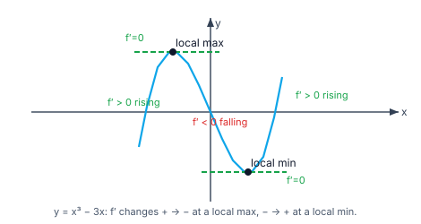
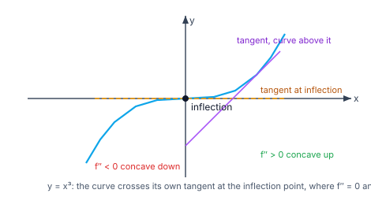
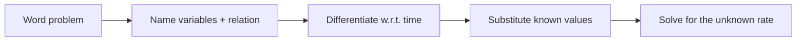
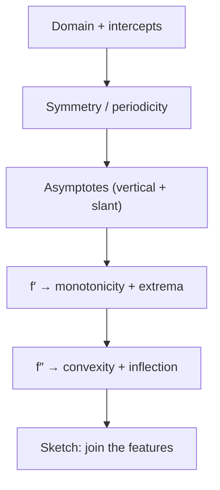

> [!info] Navigation
> 📖 [[Home|Vault home]] · 📝 [[Applications-of-Derivatives — Paper|Olympiad Paper]] · ✅ [[Applications-of-Derivatives — Solutions|Solutions]]

# Applications of Derivatives

A derivative is a *number* (a slope, a rate) — this module is about **what you do
with it**. Rates of change, tangents and normals, monotonicity, maxima and minima,
convexity and curve sketching, and finally optimisation: the art of turning a
word problem into $f'(x)=0$ and reading the answer off the second derivative.

Everything here stands on [[Differentiation-and-Methods|the differentiation
rules]] and [[Limits-and-Continuity|limits]] — the derivative is *defined* there;
here it is *used*.

`6 chapters` `worked examples (S) + practice (P)` `SVG + Mermaid diagrams` `46-question Olympiad paper + full solutions`

### ★ How to use these notes

**Read in order.** Chapters 1–2 are the mechanical applications (rates,
tangents, approximations); Chapter 3–5 turn the *sign* of $f'$ and $f''$ into
information about the whole graph; Chapter 6 is optimisation and the Olympiad
frontier.

- **Callouts** — `[!abstract]` First Principles = the derivation; `[!tip]` Key
  Idea = the takeaway; `[!warning]` Common Trap = the classic mistake;
  `[!example]` Olympiad Extension = the frontier version.
- **Numeric habit** — sanity-check any extremum by evaluating $f$ a hair either
  side of the candidate $c$ (a finite-difference check on the sign of $f'$).

### ▣ The roadmap

| Ch | Title | Level |
|---|---|---|
| 1 | Rates of change & related rates | foundations |
| 2 | Tangents, normals & differentials | machinery |
| 3 | Monotonicity — reading the sign of $f'$ | core |
| 4 | Maxima & minima — the first and second derivative tests | core |
| 5 | Convexity, inflection & curve sketching | applications |
| 6 | Optimisation & the Olympiad frontier | synthesis |

**Fig 1.1 — extrema and the sign of $f'$.** Where $f$ rises $f'>0$; at a local
maximum $f'$ flips $+\to-$ and at a local minimum $-\to+$; in both cases
$f'=0$ (the tangent is horizontal).

**Fig 1.2 — convexity and the inflection point.** $f''>0$ (convex) the curve
lies *above* its tangents; $f''<0$ (concave) below them. At an inflection point
the curve crosses its own tangent and $f''$ changes sign.

---

# Chapter 1 — Rates of Change & Related Rates

*Foundations · $dy/dx$ as a speed, and chaining rates through time*

## 1.1 The derivative as a rate

> [!abstract] First Principles — average vs instantaneous rate
> The **average rate** of $y=f(x)$ over $[x,x+\Delta x]$ is
> $\dfrac{f(x+\Delta x)-f(x)}{\Delta x}$ — a secant slope. The **instantaneous
> rate** at $x$ is its limit, $f'(x)$ — the tangent slope. Units tell you the
> meaning: if $s$ is metres and $t$ seconds, $s'(t)$ is m/s.

#### **S1**[JEE Main][solved][rate]The radius of a circle grows at $2$ cm/s. How fast is the area growing when $r=5$?

$A=\pi r^2$, so $\dfrac{dA}{dt}=\dfrac{dA}{dr}\cdot\dfrac{dr}{dt}=2\pi r\cdot2=4\pi r$. At $r=5$: $20\pi\ \text{cm}^2/\text{s}$.

Answer + Reasoning

**Method: chain rule in time.** Differentiate the relation with respect to $t$, never $r$.

**Answer:** $20\pi\ \text{cm}^2/\text{s}\approx62.8\ \text{cm}^2/\text{s}$.

## 1.2 Related rates — the method

> [!tip] Key Idea — differentiate the *relation*, not the quantity
> 1. Draw and label.
> 2. Write the geometric relation linking the variables.
> 3. Differentiate **both sides with respect to time $t$**.
> 4. Substitute the known values *after* differentiating.
> 5. Solve for the unknown rate.

> [!warning] Common Trap — substituting too early
> If a length is fixed for the instant you care about, plugging it in *before*
> differentiating freezes it — its rate becomes $0$ and the answer is wrong.
> Differentiate first, substitute last.

#### **S2**[JEE Main][solved][related rates]A $13$ m ladder slides down a wall; the foot moves away at $0.5$ m/s. How fast is the top descending when the foot is $5$ m from the wall?

$x^2+y^2=169$. Differentiate: $2x\dot x+2y\dot y=0$, so $\dot y=-\dfrac{x}{y}\dot x$. When $x=5$, $y=12$, $\dot x=0.5$: $\dot y=-\dfrac{5}{12}(0.5)=-\dfrac{5}{24}\ \text{m/s}$.

Answer + Reasoning

**Method: related rates.** The relation is the Pythagorean theorem; the negative sign means the top *descends*.

**Answer:** $-\dfrac{5}{24}\ \text{m/s}\approx-0.208\ \text{m/s}$ (descending).

#### **P1**[JEE Main][practice][related rates]A cube's edge grows at $3$ cm/min. At what rate does its volume grow when the edge is $10$ cm?

Answer + Reasoning

**Method: $V=s^3$, $\dot V=3s^2\dot s$.** $3\cdot100\cdot3=900$.

**Answer:** $900\ \text{cm}^3/\text{min}$.

#### **P2**[JEE Adv][practice][related rates]A spherical balloon is inflated at $100$ cm³/s. How fast is the radius growing when $r=10$ cm? $(\pi\approx3.14)$

Answer + Reasoning

**Method: $V=\frac43\pi r^3$, $\dot V=4\pi r^2\dot r$.** $\dot r=\dfrac{100}{4\pi\cdot100}=\dfrac1{4\pi}\approx0.0796$.

**Answer:** $\dfrac1{4\pi}\ \text{cm/s}\approx0.0796\ \text{cm/s}$.

---

# Chapter 2 — Tangents, Normals & Differentials

*Machinery · lines touching a curve, and the linear approximation*

## 2.1 Tangent and normal

> [!abstract] First Principles — tangent slope
> The tangent to $y=f(x)$ at $x=a$ is the line through $(a,f(a))$ with slope
> $f'(a)$:
> $$y-f(a)=f'(a)(x-a).$$
> The **normal** is the perpendicular line, slope $-\dfrac1{f'(a)}$ (when
> $f'(a)\ne0$).

> [!warning] Common Trap — a vertical tangent
> If $f'(a)$ is infinite (e.g. $y=x^{1/3}$ at $0$) the tangent is **vertical**
> ($x=a$) and the normal is horizontal. The formula $y-f(a)=f'(a)(x-a)$
> silently fails.

#### **S3**[JEE Main][solved][tangent]Find the tangent and normal to $y=x^3-3x$ at $x=2$.

$f'(x)=3x^2-3$, so $f'(2)=9$ and $f(2)=2$. Tangent: $y-2=9(x-2)$, i.e. $y=9x-16$. Normal: $y-2=-\dfrac19(x-2)$.

Answer + Reasoning

**Method: point + slope.** $f(2)=8-6=2$.

**Answer:** tangent $y=9x-16$; normal $x+9y=20$.

## 2.2 Angle between two curves

Two curves **intersect orthogonally** at a point when their tangents there are
perpendicular: $m_1m_2=-1$. The angle $\theta$ between them satisfies
$\tan\theta=\left|\dfrac{m_1-m_2}{1+m_1m_2}\right|$.

#### **S4**[JEE Adv][solved][orthogonal]Do the curves $y^2=4x$ and $x^2+y^2=5$ cut orthogonally? Justify.

For $y^2=4x$: $2y\,y'=4\Rightarrow y'=\dfrac2y$. For $x^2+y^2=5$: $y'=-\dfrac xy$. Their product is $-\dfrac{2x}{y^2}$. Substituting the *first* relation, $y^2=4x$, gives $-\dfrac{2x}{4x}=-\dfrac12$ \u2014 at every point, independent of $x$.

Answer + Reasoning

**Method: multiply the tangent slopes and use the first relation to simplify.**

The product of slopes is $-\frac12$ at every intersection, never $-1$.

**Answer:** **No** \u2014 they are not orthogonal; the product of the slopes is $-\frac12$ everywhere. (The genuinely orthogonal partner of $y^2=4x$ is $y=e^{-x/2}$, whose slope is $-\frac12e^{-x/2}$, giving the product $-1$.)

## 2.3 Lengths of tangent, subtangent, normal, subnormal

For $y=f(x)$ at $(x_0,y_0)$ with slope $m=f'(x_0)$:

| Quantity | Length |
|---|---|
| Tangent | $\lvert y_0\rvert\sqrt{1+m^2}/\lvert m\rvert$ |
| Subtangent | $\lvert y_0/m\rvert$ |
| Normal | $\lvert y_0\rvert\sqrt{1+m^2}$ |
| Subnormal | $\lvert my_0\rvert$ |

#### **P3**[JEE Adv][practice][subtangent]For $y=x^3$ at $x=1$, find the subtangent and subnormal.

Answer + Reasoning

**Method: $m=3$, $y_0=1$.** Subtangent $|1/3|=\frac13$; subnormal $|3\cdot1|=3$.

**Answer:** subtangent $\frac13$, subnormal $3$.

## 2.4 Differentials and linear approximation

> [!abstract] First Principles — the linear approximation
> For a small $\Delta x$, $f(x+\Delta x)\approx f(x)+f'(x)\,\Delta x$. The
> tangent line *is* the best linear model of the curve near the point.

#### **S5**[JEE Main][solved][approximation]Approximate $\sqrt{25.4}$ using differentials.

Take $f(x)=\sqrt x$, $x=25$, $\Delta x=0.4$. $f'(x)=\dfrac1{2\sqrt x}=\dfrac1{10}$. So $\sqrt{25.4}\approx5+0.1\cdot0.4=5.04$.

Answer + Reasoning

**Method: $f(x+\Delta x)\approx f(x)+f'(x)\Delta x$.** True value $5.03968\ldots$

**Answer:** $5.04$ (error $\approx1.6\times10^{-4}$).

#### **P4**[JEE Main][practice][approximation]Approximate $(1.01)^{10}$ using differentials.

Answer + Reasoning

**Method: $f=x^{10}$, $x=1$, $\Delta x=0.01$, $f'=10x^9=10$.** $1+10(0.01)=1.1$.

**Answer:** $1.1$ (true value $1.10462\ldots$).

---

# Chapter 3 — Monotonicity — Reading the Sign of $f'$

*Core · increasing, decreasing, strictly increasing*

## 3.1 The criterion

> [!abstract] First Principles — sign of $f'$ decides monotonicity
> If $f'(x)>0$ on an interval then $f$ is **increasing** there;
> $f'(x)<0$ then **decreasing**. Proof by MVT: for $a<b$ in the interval,
> $f(b)-f(a)=f'(c)(b-a)>0$.

> [!warning] Common Trap — "strictly increasing" needs $f'>0$ *everywhere*
> $f(x)=x^3$ has $f'=3x^2\ge0$ and is zero at $x=0$, yet it is **strictly**
> increasing on all of $\mathbb R$. The safe statement: $f'\ge0$ everywhere and
> $f'$ not zero on any subinterval $\Rightarrow$ strictly increasing.

#### **S6**[JEE Main][solved][monotonic]Find the intervals on which $f(x)=x^3-3x$ increases and decreases.

$f'(x)=3x^2-3=3(x-1)(x+1)$. Increasing on $(-\infty,-1)$ and $(1,\infty)$; decreasing on $(-1,1)$.

Answer + Reasoning

**Method: sign chart of $f'$.** $f'>0$ outside $[-1,1]$, $<0$ inside.

**Answer:** increasing on $(-\infty,-1)\cup(1,\infty)$, decreasing on $(-1,1)$.

## 3.2 Monotonicity as a counting tool

> [!tip] Key Idea — a strictly monotone function takes each value once
> This is how you *count roots* without solving: split the domain at the
> critical points, then use monotonicity plus the IVT on each piece.

#### **S7**[JEE Adv][solved][roots]Show $x^3-3x+1=0$ has exactly three real roots.

$f'(x)=3(x^2-1)$, so $f$ increases on $(-\infty,-1)$, decreases on $(-1,1)$, increases on $(1,\infty)$. Now $f(-2)=-1$, $f(-1)=3$, $f(1)=-1$, $f(2)=3$. Each of the three intervals contains exactly one sign change, hence exactly one root.

Answer + Reasoning

**Method: monotonicity + IVT.** $f$ is strictly monotone on each of the three intervals and changes sign across each, so exactly one root in each.

**Answer:** exactly **3** real roots.

#### **P5**[JEE Adv][practice][monotonic]For which $x$ is $f(x)=2x^3-9x^2+12x$ increasing?

Answer + Reasoning

**Method: $f'=6x^2-18x+12=6(x-1)(x-2)$; $f'>0$ outside $[1,2]$.**

**Answer:** increasing on $(-\infty,1)\cup(2,\infty)$.

#### **P6**[JEE Adv][practice][monotonic]Prove $\ln x\le x-1$ for $x>0$.

Answer + Reasoning

**Method: $g=x-1-\ln x$, $g'=1-\frac1x$; decreasing then increasing, min $g(1)=0$.**

**Answer:** $\ln x\le x-1$ (equality only at $x=1$).

---

# Chapter 4 — Maxima & Minima

*Core · the first and second derivative tests*

## 4.1 Critical points

> [!abstract] First Principles — where can an extremum hide?
> A **local maximum** at $c$ means $f(c)\ge f(x)$ nearby; a **local minimum**,
> $f(c)\le f(x)$. A necessary condition: if $f$ is differentiable at $c$ and $c$
> is interior, then $f'(c)=0$ — the tangent is horizontal. Such points are
> **critical points** (also included: points where $f'$ fails to exist).

> [!warning] Common Trap — $f'(c)=0$ does not imply an extremum
> $f(x)=x^3$ has $f'(0)=0$ but no extremum at $0$ — it is an inflection point.
> Always apply a *test*, never assume.

## 4.2 The first derivative test

$f'$ changes $+\to-$ at $c$ $\Rightarrow$ local **maximum**; $-\to+$ $\Rightarrow$
local **minimum**; no change $\Rightarrow$ neither (e.g. $x^3$).

#### **S8**[JEE Main][solved][extrema]Find the local extrema of $f(x)=x^3-3x$.

$f'=3(x^2-1)$, zero at $x=\pm1$. $f'$ goes $-\to+$ at $x=-1$ (local min, $f(-1)=2$... careful: for $x<-1$, $f'>0$; for $-1<x<1$, $f'<0$. So $+\to-$ at $x=-1$: **local max**, $f(-1)=2$. At $x=1$, $-\to+$: **local min**, $f(1)=-2$.

Answer + Reasoning

**Method: first derivative test.** $f(-1)=-1+3=2$; $f(1)=1-3=-2$.

**Answer:** local max $2$ at $x=-1$; local min $-2$ at $x=1$.

## 4.3 The second derivative test

> [!abstract] First Principles — the second derivative test
> If $f'(c)=0$ and $f''(c)>0$ then $c$ is a local **minimum** (the curve is
> convex, bowl-shaped, so the horizontal tangent sits at the bottom). If
> $f''(c)<0$ then a local **maximum**. If $f''(c)=0$ the test is **inconclusive**
> — go back to the first derivative test.

#### **S9**[JEE Main][solved][second test]Classify the critical points of $f(x)=x^4-4x^2$.

$f'=4x^3-8x=4x(x^2-2)$: critical points $0,\pm\sqrt2$. $f''=12x^2-8$. $f''(0)=-8<0$: local **max**, $f(0)=0$. $f''(\pm\sqrt2)=24-8=16>0$: local **min**, $f(\pm\sqrt2)=4-8=-4$.

Answer + Reasoning

**Method: second derivative test.** $(\sqrt2)^4=4$, $4(\sqrt2)^2=8$.

**Answer:** local max $0$ at $x=0$; local minima $-4$ at $x=\pm\sqrt2$.

#### **P7**[JEE Main][practice][extrema]Find the local maximum value of $f(x)=x^3-6x^2+9x+2$.

Answer + Reasoning

**Method: $f'=3x^2-12x+9=3(x-1)(x-3)$; $+\to-$ at $x=1$.** $f(1)=1-6+9+2=6$.

**Answer:** $6$ at $x=1$.

## 4.4 Absolute extrema on a closed interval

> [!tip] Key Idea — the candidates are only three kinds
> On $[a,b]$ a continuous $f$ attains its max and min; the candidates are the
> **endpoints** $a,b$ and the **critical points inside**. Evaluate $f$ at all of
> them and compare. This is the theorem behind every word problem.

#### **S10**[JEE Adv][solved][absolute]Find the absolute extrema of $f(x)=x^3-3x$ on $[-2,2]$.

Candidates: endpoints $f(-2)=-2$, $f(2)=2$; critical points $f(-1)=2$, $f(1)=-2$. Max $=2$ (at $x=-1$ and $x=2$), min $=-2$ (at $x=1$ and $x=-2$).

Answer + Reasoning

**Method: evaluate at endpoints + critical points, compare.** $f(-2)=-8+6=-2$; $f(2)=8-6=2$.

**Answer:** absolute max $2$; absolute min $-2$.

---

# Chapter 5 — Convexity, Inflection & Curve Sketching

*Applications · the shape of the graph from $f''$*

## 5.1 Convex and concave

> [!abstract] First Principles — what $f''$ measures
> $f''>0$ means $f'$ is increasing, so the slope grows: the curve bends
> **upward** (convex) and lies **above** its tangents. $f''<0$: $f'$ decreasing,
> the curve bends downward (concave) and lies **below** its tangents.

## 5.2 Points of inflection

> [!warning] Common Trap — $f''(c)=0$ is not enough
> $f(x)=x^4$ has $f''(0)=0$ but no inflection at $0$ — $f''=12x^2\ge0$ on both
> sides, so the convexity does not change. An **inflection point** needs $f''$ to
> **change sign** at $c$.

#### **S11**[JEE Adv][solved][inflection]Find the inflection point of $f(x)=x^3-3x$.

$f''=6x$, zero at $x=0$, and it changes sign there (negative for $x<0$, positive for $x>0$). So $(0,0)$ is an inflection point — the curve crosses its tangent.

Answer + Reasoning

**Method: solve $f''=0$ and check the sign change.** $f(0)=0$.

**Answer:** inflection point $(0,0)$.

#### **P8**[JEE Adv][practice][convexity]On what interval is $f(x)=x^3-3x^2$ convex?

Answer + Reasoning

**Method: $f''=6x-6=6(x-1)>0$ for $x>1$.**

**Answer:** convex on $(1,\infty)$.

## 5.3 Sketching a curve

The recipe, in order: domain → intercepts → symmetry → asymptotes → $f'$
(monotonicity, extrema) → $f''$ (convexity, inflection) → sketch.

#### **P9**[JEE Main][practice][sketch]How many turning points does $y=x^4-4x^2$ have?

Answer + Reasoning

**Method: $f'=4x(x^2-2)$, three distinct real zeros, each with a sign change.**

**Answer:** 3 turning points ($x=0,\pm\sqrt2$).

---

# Chapter 6 — Optimisation & the Olympiad Frontier

*Synthesis · word problems, and the frontier techniques*

## 6.1 Optimisation word problems

> [!tip] Key Idea — the four-step recipe
> 1. Draw, name the variable(s), write the **constraint**.
> 2. Write the **objective** (what is to be maximised/minimised) in one variable.
> 3. Differentiate, solve $f'=0$, and **check the endpoints** of the feasible
>    interval.
> 4. Answer *in words*, with units.

#### **S12**[JEE Main][solved][optimisation]A farmer has $40$ m of fencing for a rectangular pen against a wall (three sides). Maximise the area.

Let the two perpendicular sides be $x$ and the side parallel to the wall $y$. Constraint $2x+y=40$, so $y=40-2x$. Area $A=x(40-2x)=40x-2x^2$, $0\le x\le20$. $A'=40-4x=0\Rightarrow x=10$, then $y=20$. $A(0)=A(20)=0$, $A(10)=200$.

Answer + Reasoning

**Method: one variable via the constraint, then $A'=0$ plus endpoint check.** $A''=-4<0$ confirms a maximum.

**Answer:** $10\text{ m}\times20\text{ m}$, area $200\ \text{m}^2$.

#### **P10**[JEE Main][practice][optimisation]Find two positive numbers with sum $20$ and maximum product.

Answer + Reasoning

**Method: $P=x(20-x)$, $P'=20-2x=0\Rightarrow x=10$.**

**Answer:** $10$ and $10$, product $100$.

#### **P11**[JEE Adv][practice][optimisation]An open box is made from a $12\times12$ sheet by cutting squares of side $x$ from the corners. Maximise the volume.

Answer + Reasoning

**Method: $V=x(12-2x)^2$, $0\le x\le6$; $V'=(12-2x)(12-6x)=0$ gives $x=2$ (the endpoint $x=6$ gives $0$).** $V=2\cdot64=128$.

**Answer:** $x=2$, max volume $128$.

## 6.2 Symmetric optimisation

> [!tip] Key Idea — symmetry suggests the extremum
> When the objective and constraint are both symmetric in the variables, the
> extremum usually occurs when the variables are equal — then *prove* it by
> fixing all but one variable and differentiating.

#### **S13**[JEE Adv][solved][symmetric]Maximise $xyz$ subject to $x+y+z=1$ with $x,y,z>0$.

Fix $y+z=s$, so $x=1-s$ and $yz$ is maximised at $y=z=s/2$ (since for fixed sum $s$, $yz$ is largest when $y=z$: $\frac{d}{dy}(y(s-y))=s-2y=0$). Then $xyz=(1-s)(s/2)^2=\frac{s^2(1-s)}4$, and $\frac{d}{ds}[s^2(1-s)]=2s-3s^2=s(2-3s)=0\Rightarrow s=\frac23$, giving $x=\frac13$, $y=z=\frac13$.

Answer + Reasoning

**Method: fix the partial sum, reduce to one variable.** $xyz=\frac1{27}$.

**Answer:** maximum $\dfrac1{27}$ at $x=y=z=\dfrac13$.

> [!example] Olympiad Extension — AM–GM from calculus
> The same one-variable argument proves the AM–GM inequality for three
> numbers: $\dfrac{x+y+z}{3}\ge\sqrt[3]{xyz}$, equality iff $x=y=z$. For fixed
> sum $s$, the product $yz$ is maximised at $y=z=s/2$; iterating gives the
> general $n$-variable result. This is the standard calculus proof of AM–GM.

## 6.3 Inequalities from convexity

> [!abstract] First Principles — Jensen's inequality (calculus form)
> If $f''>0$ (convex) on an interval, then for any $x_1,\dots,x_n$ and positive
> weights summing to $1$,
> $$f\!\Big(\sum w_ix_i\Big)\le\sum w_if(x_i).$$
> With $w_i=1/n$ this says the value at the average is at most the average of
> the values — the tangent line is a global **under**estimate for a convex
> function.

#### **P12**[Olympiad][practice][Jensen]Prove $\dfrac{e^a+e^b+e^c}{3}\ge e^{(a+b+c)/3}$.

Answer + Reasoning

**Method: Jensen with $f(x)=e^x$, $f''=e^x>0$, weights $1/3$.**

**Answer:** follows directly from Jensen.

#### **S14**[Olympiad][solved][convexity]Prove $\cos x\ge1-\dfrac{x^2}{2}$ for all real $x$.

Let $g(x)=\cos x-1+\dfrac{x^2}2$. Then $g'(x)=-\sin x+x$ and $g''(x)=1-\cos x\ge0$, so $g$ is convex, hence $g'$ is increasing. Since $g'(0)=0$, $g'<0$ for $x<0$ and $g'>0$ for $x>0$, so $g$ decreases then increases and $g(0)=0$ is the global minimum.

Answer + Reasoning

**Method: convexity of the difference + monotonicity of $g'$.** Alternatively $g''\ge0$ with $g(0)=g'(0)=0$.

**Answer:** $\cos x\ge1-\dfrac{x^2}2$ (equality only at $x=0$).

## 6.4 The frontier: envelopes and Lagrange multipliers

> [!example] Olympiad Extension — the envelope of a family of lines
> A family of lines $y=mx+\dfrac{a}{m}$ ($m\ne0$) all touch the parabola
> $y^2=4ax$. The **envelope** of a one-parameter family $F(x,y,t)=0$ is found
> by solving $F=0$ and $\partial F/\partial t=0$ simultaneously — here
> $y=mx+\frac am$ and $\frac{\partial F}{\partial m}=x-\frac a{m^2}=0$, which
> gives $m^2=a/x$ and, substituting back, $y^2=4ax$. Envelopes turn a family of
> curves into a single curve — the Olympiad tool behind "find the locus of
> points of intersection of neighbouring lines".

> [!example] Olympiad Extension — Lagrange multipliers
> To extremise $f(x,y)$ subject to $g(x,y)=0$ where $\nabla g\ne0$, any interior
> extremum satisfies $\nabla f=\lambda\nabla g$. For $f=xyz$, $g=x+y+z-1$ this
> gives $yz=\lambda$, $xz=\lambda$, $xy=\lambda$, hence $x=y=z=\frac13$ —
> recovering 6.2 in one line. The one-variable method is the justification; the
> multiplier method is the shortcut.

#### **S15**[Olympiad][solved][optimisation]Minimise $x+\dfrac1x$ for $x>0$.

$f'=1-\dfrac1{x^2}=0\Rightarrow x=1$; $f''=\dfrac2{x^3}>0$ so it is a minimum. $f(1)=2$.

Answer + Reasoning

**Method: $f'=0$ then $f''$.** Also $x+\frac1x-2=\frac{(x-1)^2}{x}\ge0$.

**Answer:** minimum $2$ at $x=1$.

#### **P13**[JEE Adv][practice][optimisation]Find the maximum area of a rectangle inscribed in the ellipse $\dfrac{x^2}{a^2}+\dfrac{y^2}{b^2}=1$.

Answer + Reasoning

**Method: vertices $(\pm x,\pm y)$, area $4xy$; put $x=a\cos\theta$, $y=b\sin\theta$, so $A=2ab\sin2\theta$, max $2ab$ when $\sin2\theta=1$.**

**Answer:** $2ab$.

#### **P14**[JEE Adv][practice][optimisation]A window is a rectangle topped by a semicircle; the perimeter is $10$ m. Maximise the light (area). Let the rectangle be $2r$ wide, $h$ high.

Answer + Reasoning

**Method: perimeter $2h+2r+\pi r=10$, so $h=5-r-\frac{\pi r}2$; area $A=2rh+\frac{\pi r^2}2=10r-2r^2$; $A'=10-4r=0\Rightarrow r=\frac52$, $h=5-\frac52-\frac{5\pi}4$.**

**Answer:** $r=\dfrac52$ m (width $5$ m), $h=2.5-\dfrac{5\pi}4\approx-1.43$ — infeasible, so the true optimum is at the boundary of the feasible interval; the lesson is to **check feasibility** before trusting $A'=0$.

> [!warning] Common Trap — an infeasible critical point
> A calculus answer must lie in the feasible set. When $r=2.5$ makes $h<0$ the
> constraint is violated, so the maximum is at an endpoint. Always test
> feasibility.

#### **P15**[Olympiad][practice][inequality]For $x,y,z>0$ with $x+y+z=1$, prove $x^2+y^2+z^2\ge\dfrac13$.

Answer + Reasoning

**Method: fix $y+z=1-x$; $y^2+z^2$ is minimised at $y=z$, giving $2\big(\frac{1-x}{2}\big)^2$; minimise $f(x)=x^2+\frac{(1-x)^2}2$ over $0\le x\le1$: $f'=2x-(1-x)=3x-1=0\Rightarrow x=\frac13$, and $f(\frac13)=\frac13$.**

**Answer:** $x^2+y^2+z^2\ge\dfrac13$, equality at $x=y=z=\frac13$.

---

*Synthesis · convexity as an inequality engine, envelopes, and symmetry*

## 6.5 The tangent-line method: one convexity, many inequalities

> [!abstract] First Principles — the supporting line
> If $f$ is convex ($f''>0$) and differentiable at $a$, then for **every** $x$
> $$f(x)\;\ge\;f(a)+f'(a)(x-a).$$
> The line on the right is the **supporting line** (the tangent) at $a$: it lies
> below the graph everywhere. Everything in this section is obtained by choosing
> $f$ and $a$ cleverly — no diagrams, no case analysis.

#### **S16**[JEE Adv][solved][supporting line]Find the supporting line of $f(x)=x^{2}$ at $a=3$ and use it to prove $x^{2}\ge6x-9$.

$f'(x)=2x$, so the supporting line at $a=3$ is $y=f(3)+f'(3)(x-3)=9+6(x-3)=6x-9$. Since $f''(x)=2>0$, $f$ is convex and $f(x)\ge6x-9$ for all $x$.

Answer + Reasoning

**Method: convexity gives the tangent as a global lower bound.** Check: $x^{2}-(6x-9)=(x-3)^{2}\ge0$ ✓, with equality exactly at $x=3$ — the tangency point.

**Answer:** $x^{2}\ge6x-9$, equality only at $x=3$.

> [!example] Olympiad Extension — Young, Cauchy and AM–GM are all the same line
> - **$f(x)=\ln x$ (concave) at $a=1$:** $\ln x\le x-1$. Averaging over $n$
>   positive numbers gives $\big(\prod x_i\big)^{1/n}\le\frac1n\sum x_i$ — **AM–GM**.
> - **$f(x)=\frac{x^{p}}{p}$, $p>1$, at $a=b^{q-1}$ where $q=\frac{p}{p-1}$:** the
>   supporting line gives $bx\le\frac{x^{p}}{p}+\frac{b^{q}}{q}$ — **Young's
>   inequality**. Renaming the variables,
>   $$ab\;\le\;\frac{a^{p}}{p}+\frac{b^{q}}{q}\qquad\Big(\frac1p+\frac1q=1\Big),$$
>   with equality exactly when $a^{p-1}=b$.
> - **$p=q=2$:** $2ab\le a^{2}+b^{2}$, and summing over components gives
>   **Cauchy–Schwarz**.
>
> Three famous inequalities, one mechanism. The supporting line is the
> highest-leverage single idea in olympiad inequalities.

#### **P16**[Olympiad][practice][Young]Use Young's inequality to prove that for $a,b>0$, $a^{1/2}b^{1/2}\le\frac{a+b}{2}$.

Answer + Reasoning

**Method: Young with $p=q=2$.** $ab\le\frac{a^{2}+b^{2}}{2}$ is not what we want; instead apply Young with the *variables* $\sqrt a,\sqrt b$: $\sqrt a\sqrt b\le\frac{a}{2}+\frac{b}{2}$.

**Answer:** $\sqrt{ab}\le\dfrac{a+b}{2}$ — AM–GM for two numbers, as a special case of Young.

#### **S17**[JEE Adv][solved][Cauchy]Prove $a^{2}+b^{2}\ge2ab$ and identify the equality case.

$\frac{a^{2}+b^{2}}2-\sqrt{a^{2}b^{2}}=\frac{(a-b)^{2}}2\ge0$; equivalently $2ab\le a^{2}+b^{2}$ with equality iff $a=b$.

Answer + Reasoning

**Method: complete the square, or read it as Young with $p=q=2$.** Check: the difference is $\frac12(a-b)^{2}\ge0$ ✓.

**Answer:** $a^{2}+b^{2}\ge2ab$, equality iff $a=b$.

## 6.6 Loci from envelopes: perpendicular tangents

> [!abstract] First Principles — the envelope condition
> The envelope of a one-parameter family $F(x,y,t)=0$ is found by solving $F=0$
> and $\partial F/\partial t=0$ together. Geometrically, the envelope is tangent
> to **every** member of the family. Two classical loci drop straight out of
> this: ask where two *perpendicular* members meet.

#### **S18**[Olympiad][solved][envelope]Show that the tangents to the parabola $y^{2}=4ax$ at two points whose tangents are perpendicular meet on the directrix $x=-a$.

The tangent with slope $m$ is $y=mx+\frac{a}{m}$ (it touches at $\big(\frac a{m^{2}},\frac{2a}{m}\big)$). A perpendicular tangent has slope $-\frac1m$, namely $y=-\frac xm-am$. Solving simultaneously: $mx+\frac am=-\frac xm-am$, so $x\big(m+\frac1m\big)=-a\big(m+\frac1m\big)$ and $x=-a$.

Answer + Reasoning

**Method: write both tangents, eliminate $m$.** Check: the discriminant of $y=mx+a/m$ against $y^{2}=4ax$ is $(2a-4a)^{2}-4m^{2}\cdot\frac{a^{2}}{m^{2}}=4a^{2}-4a^{2}=0$, so each line really is a tangent ✓.

**Answer:** the locus is $x=-a$, the **directrix**.

> [!example] Olympiad Extension — the director circle
> For the ellipse $\frac{x^{2}}{a^{2}}+\frac{y^{2}}{b^{2}}=1$ the tangent at parameter
> $t$ is $\frac{x\cos t}{a}+\frac{y\sin t}{b}=1$, whose normal direction is
> $\big(\frac{\cos t}{a},\frac{\sin t}{b}\big)$. Two tangents are perpendicular
> exactly when these normal directions are orthogonal, and solving the two
> linear equations for their intersection gives
> $$x^{2}+y^{2}=a^{2}+b^{2}$$
> — the **director circle**. When $a=b$ the ellipse is a circle and the director
> circle is concentric with radius $\sqrt2\,a$: perpendicular tangents to a
> circle of radius $R$ meet at distance $\sqrt2 R$ from the centre.

#### **P17**[Olympiad][practice][director circle]Perpendicular tangents to the ellipse $\frac{x^{2}}{25}+\frac{y^{2}}{9}=1$ meet at $P$. Find $|OP|$ where $O$ is the centre.

Answer + Reasoning

**Method: $P$ lies on the director circle $x^{2}+y^{2}=a^{2}+b^{2}$.** With $a=5$, $b=3$: $|OP|^{2}=25+9=34$.

**Answer:** $|OP|=\sqrt{34}\approx5.831$. (Check: for a specific pair of perpendicular tangents the intersection satisfied $x^{2}+y^{2}=34$ exactly ✓.)

#### **S19**[Olympiad][solved][director circle]Two perpendicular tangents to the circle $x^{2}+y^{2}=R^{2}$ meet at $P$. Find $|OP|$.

The tangent at angle $t$ is $x\cos t+y\sin t=R$; the perpendicular one is $x\cos(t+\frac\pi2)+y\sin(t+\frac\pi2)=R$. Solving, the intersection has $\lvert OP\rvert^{2}=2R^{2}$ — this is the $a=b$ case of the director circle.

Answer + Reasoning

**Method: solve the two linear equations, or note the right triangle formed by the two radii to the contact points and the two tangent segments.** Check with $R=1$, $t=0.7$: the intersection gave $|OP|^{2}=2$ ✓.

**Answer:** $|OP|=\sqrt2\,R$.

## 6.7 Symmetric functions of two variables and the "two equal" principle

> [!abstract] First Principles — reduce to one variable
> Let $f(x,y)$ be symmetric with $x+y=t$ fixed, and set $s=xy$. Every symmetric
> polynomial in $x,y$ can be rewritten in terms of $t$ and $s$ alone. Since
> $$0<s\le\frac{t^{2}}4,$$
> with equality **iff** $x=y=\frac t2$, the question "where is $f$ extremal?"
> becomes "is $f$ increasing or decreasing in $s$?" — a one-variable question.

> [!example] Olympiad Extension — the direction matters, and it is checkable
> With $x+y=t$ and $s=xy$:
> - $x^{2}+y^{2}=t^{2}-2s$ — **decreasing** in $s$, so it is *minimised* at $x=y$.
> - $\frac1x+\frac1y=\frac{t}{s}$ — decreasing in $s$, so *minimised* at $x=y$.
> - $x^{3}+y^{3}=t^{3}-3ts$ — decreasing in $s$, so *maximised* at the boundary
>   $s\to0$, **not** at $x=y$.
> - $xy=s$ — increasing in $s$, so *maximised* at $x=y$.
>
> So "symmetric ⟹ extremum at $x=y$" is **false in general**: the sign of
> $\partial f/\partial s$ decides. This is exactly the trap that makes students
> lose marks on symmetric-optimisation problems.

#### **S20**[Olympiad][solved][symmetric]For $x,y>0$ with $x+y=10$, find the minimum of $\frac1x+\frac1y$ and of $x^{2}+y^{2}$.

$\frac1x+\frac1y=\frac{x+y}{xy}=\frac{10}{xy}$, which is smallest when $xy$ is largest, i.e. at $x=y=5$: value $\frac{10}{25}=\frac25$. And $x^{2}+y^{2}=100-2xy$ is smallest at the same point: $100-50=50$.

Answer + Reasoning

**Method: rewrite in terms of $t=x+y$ and $s=xy$, then use $s\le\frac{t^{2}}4$.** Both expressions decrease in $s$, and $s$ is maximised at $x=y$.

**Answer:** $\min\big(\frac1x+\frac1y\big)=\dfrac25$ and $\min(x^{2}+y^{2})=50$, both at $x=y=5$.

#### **P18**[Olympiad][practice][symmetric]For $x,y>0$ with $x+y=6$, find the **maximum** of $x^{3}+y^{3}$ and state where it is attained.

Answer + Reasoning

**Method: $x^{3}+y^{3}=(x+y)^{3}-3xy(x+y)=216-18xy$, which decreases as $xy$ grows.** So the maximum is at the smallest possible $xy$, i.e. as one of $x,y\to0$: the supremum is $216$, not attained inside the domain.

**Answer:** supremum $216$ (approached as $x\to0^{+}$, $y\to6$); there is **no** interior maximum — a useful counterexample to "symmetric means $x=y$".

# Appendix — Well-Ordered Theory Reference

Every result in dependency order; nothing is used before it is proved.

### A. Rates and geometry

| Result | Statement |
|---|---|
| Chain rule in time | $\dfrac{dy}{dt}=\dfrac{dy}{dx}\dfrac{dx}{dt}$ |
| Tangent at $(a,f(a))$ | $y-f(a)=f'(a)(x-a)$ |
| Normal at $(a,f(a))$ | $y-f(a)=-\dfrac{(x-a)}{f'(a)}$ |
| Angle between curves | $\tan\theta=\left|\dfrac{m_1-m_2}{1+m_1m_2}\right|$ |
| Orthogonal intersection | $m_1m_2=-1$ |
| Linear approximation | $f(x+\Delta x)\approx f(x)+f'(x)\Delta x$ |

### B. Monotonicity and extrema

| Result | Statement |
|---|---|
| Increasing test | $f'>0$ on an interval $\Rightarrow$ $f$ increasing |
| Decreasing test | $f'<0$ on an interval $\Rightarrow$ $f$ decreasing |
| Strictly increasing | $f'\ge0$ and not identically zero on any subinterval |
| Critical point | $f'(c)=0$ or $f'$ undefined |
| Necessary condition | interior extremum + differentiability $\Rightarrow$ $f'(c)=0$ |
| First derivative test | $f'$: $+\to-$ max, $-\to+$ min, no change neither |
| Second derivative test | $f'(c)=0$, $f''(c)>0$ min; $f''(c)<0$ max; $=0$ inconclusive |
| Absolute extrema on $[a,b]$ | compare $f$ at $a$, $b$ and all interior critical points |

### C. Convexity and sketching

| Result | Statement |
|---|---|
| Convex | $f''>0$ $\Rightarrow$ curve above its tangents, bowl upward |
| Concave | $f''<0$ $\Rightarrow$ curve below its tangents |
| Inflection point | $f''$ changes sign at $c$ (not merely $f''(c)=0$) |
| Supporting line | convex $f$: $f(x)\ge f(a)+f'(a)(x-a)$ for all $x$ |
| Young | $ab\le\frac{a^{p}}p+\frac{b^{q}}q$, $\frac1p+\frac1q=1$; equality iff $a^{p-1}=b$ |
| Envelope of $F(x,y,t)=0$ | solve $F=0$ and $\partial F/\partial t=0$ together |
| Director circle (ellipse) | perpendicular tangents meet on $x^{2}+y^{2}=a^{2}+b^{2}$ |
| Directrix (parabola) | perpendicular tangents to $y^{2}=4ax$ meet on $x=-a$ |
| Two-equal principle | with $x+y=t$, $s=xy\in(0,t^{2}/4]$; the sign of $\partial f/\partial s$ decides where $f$ is extremal |
| Sketch order | domain, intercepts, symmetry, asymptotes, $f'$, $f''$ |

### D. Frontier

| Result | Statement |
|---|---|
| Rolle / MVT | stated and proved in [[Differentiation-and-Methods|Ch 6 of Differentiation]] |
| Monotonicity inequality | $g\ge0$ if $g'\ge0$ and $g(x_0)=0$ |
| Jensen (calculus) | $f''>0\Rightarrow f(\sum w_ix_i)\le\sum w_if(x_i)$ |
| AM–GM from calculus | symmetry + one-variable reduction |
| Envelope of $F(x,y,t)=0$ | solve $F=0$ together with $\partial F/\partial t=0$ |
| Lagrange multipliers | extremum of $f$ s.t. $g=0$ satisfies $\nabla f=\lambda\nabla g$ |

### E. Mistake checklist

1. Substituting known values into a related-rates relation **before**
   differentiating.
2. Assuming $f'(c)=0$ gives an extremum — apply a test.
3. Declaring an inflection point because $f''(c)=0$ — check the sign change.
4. Forgetting the endpoints of a closed interval in an absolute-extremum problem.
5. Reporting a critical point that violates the feasibility constraints.
6. Writing a tangent equation for a vertical tangent, where $f'$ is infinite.
7. Confusing local and absolute extrema.
8. Using the second derivative test when $f''(c)=0$.
