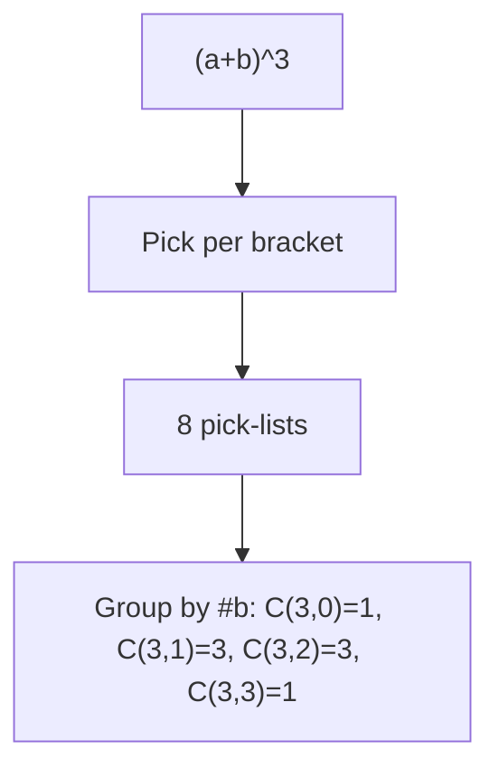
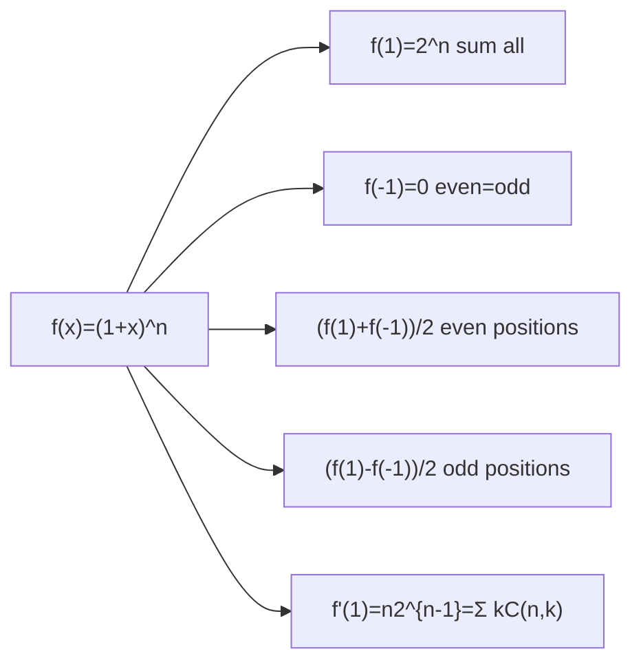
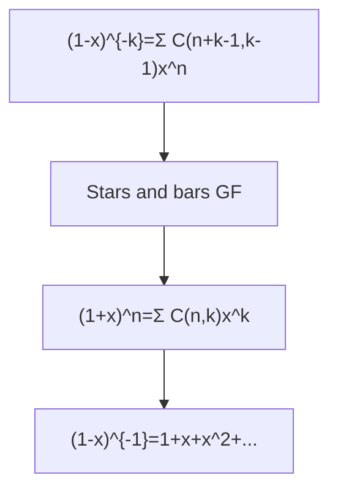

> [!info] Navigation
> 📖 [[Home|Vault home]] · 📝 [[Binomial-Theorem — Paper|Olympiad Paper]] · ✅ [[Binomial-Theorem — Solutions|Solutions]]

*JEE Advanced → Olympiad Ladder*

# Binomial Theorem

From "expanding a bracket is a census of choices" to Lucas' theorem, Kummer's carries and Wolstenholme's congruence — one idea, six layers deep. Every coefficient you will ever extract, every inequality you will ever prove with it, derived rather than memorised.

`6 chapters · basics → JEE Advanced → Olympiad` `15 worked examples (S1–S15)` `47 practice questions (P1–P47, verified answers)` `38-question Olympiad paper + full solutions`

### ★ How to use these notes

**Read in order — do not skip the "why" boxes.** Each chapter is built in layers: *concept → first-principles reasoning → JEE theory → Olympiad extension*.

- **Colored boxes** — First Principles = the actual reasoning; Key Idea = the takeaway technique; Common Trap = the classic mistake; Olympiad Extension = the frontier version.
- **Questions are placed in context** — a solved example right after the technique that solves it, plus practice sets with difficulty tags: [JEE Main] [JEE Adv] [Olympiad]
- **The Olympiad paper at the end** (38 questions) is the exam: attempt it after Chapter 6, without solutions. The [[Binomial-Theorem — Solutions|solution key]] is separate and complete.

### ▣ The roadmap

The logical skeleton of the module. A left-to-right chain of the six chapters with the exam paper at the bottom: counting is the root, the machinery and engines are the trunk, the infinite expansions and estimates are the branches, divisibility is the Olympiad canopy.

**Diagram**

### ∑ Exam paper

[[Binomial-Theorem — Paper| The Capstone Olympiad-Level Paper — 38 Questions Eight sections (A–H) ramping JEE Main → Advanced → Olympiad: coefficient vaults, identity engines, validity traps, and the Lucas/Kummer frontier. ]] [[Binomial-Theorem — Solutions| Attempt first, then open Full Solutions Key Complete step-by-step solutions for all 38 questions — method name first, then the derivation, then a check. Every numeric answer verified by pure-Python computation. ]] 

### ! One-page mindset

> [!abstract] First Principles — the only rule of the game
>
> **Every coefficient of $(a+b)^n$ is a number of ways, never a formula to recall.** $\binom nk$ counts the pick-lists; the binomial coefficients of $(px^r + qx^s)^n$ count the same pick-lists weighted; sums of coefficients count weighted objects of *all* sizes; divisibility questions ask how many copies of a prime the counting carries. When stuck, return to the census: name the set being counted, and the identity writes itself. The infinite-binomial chapter is the only exception to the counting story — and there the replacement rule is "a series is only its value inside its radius."

> [!warning] Common Trap — the mistakes this module punishes
>
> Four recurring own goals: (i) $T_k$ vs $T_{k+1}$ indexing — "5th term" is $k=4$; (ii) forgetting the second branch when solving $\binom nr = \binom ns$ ($r = s$ *or* $r+s = n$); (iii) expanding $(3+2x)^{-2}$ without factoring, or quoting a series outside $|\frac{2x}{3}| \lt 1$; (iv) "vanishes mod $p$" with a composite exponent — the Freshman's Dream is a prime-only licence. Each trap costs full marks on its question; none costs more than one habit to fix.

## Roadmap

- **Chapter 1**: Ch 1 · What (a+b)^n Counts — 5 sections · 10 questions
- **Chapter 2**: Ch 2 · The Coefficient Machinery — 5 sections · 11 questions
- **Chapter 3**: Ch 3 · Three Identity Engines — 4 sections · 12 questions
- **Chapter 4**: Ch 4 · Beyond Non-Negative Integer Powers — 4 sections · 11 questions
- **Chapter 5**: Ch 5 · Size, Growth and Extremes — 3 sections · 8 questions
- **Chapter 6**: Ch 6 · Divisibility, Parity and Primes — 4 sections · 10 questions
- **Olympiad Paper**: Olympiad Paper · 38 questions — 
- **Solutions**: Olympiad Paper · Solutions & marking guide

---

## Contents

1. Chapter 1 — What (a+b)^n Counts
2. Chapter 2 — The Coefficient Machinery
3. Chapter 3 — Three Identity Engines
4. Chapter 4 — Beyond Non-Negative Integer Powers
5. Chapter 5 — Size, Growth and Extremes
6. Chapter 6 — Divisibility, Parity and Primes

---

# Chapter 1 — What (a+b)^n Counts

*5 sections · 10 questions*

*Chapter 1 of 6*

Before any formula, one picture: expanding $(a+b)^n$ means choosing from $n$ separate brackets, and every product that survives is a record of those choices. Once you see $\binom{n}{k}$ as "*the number of ways to pick which $k$ brackets contributed $b$*" — not as a symbol to memorise — symmetry, Pascal's triangle and the identity $\sum_k \binom{n}{k} = 2^n$ all appear for free. This chapter builds that counting foundation; every later chapter (coefficients, identities, series, divisibility) is the same idea wearing a different hat.

### 1.0 What you will be able to do

This chapter is the load-bearing wall of the whole module. By the end you will never "expand a binomial" mechanically again.

- Expand $(a+b)^n$ by the bracket-choice argument and say *why* the coefficient of $a^{\,n-k}b^k$ is $\binom{n}{k}$.
- Read Pascal's triangle as a counting table (small cases of the theorem), and prove every pattern in it by conditioning on one element.
- Prove $\sum_k \binom{n}{k} = 2^n$ by a bijection, and derive the even/odd split of a row without any new work.
- Use substitution ($x = 1, -1, \tfrac12$) to extract coefficient sums from $(px+q)^n$ — the JEE's favourite three-second question.

### 1.1 The expansion as a decision tree

Take $n = 3$. Expanding $(a+b)^3 = (a+b)(a+b)(a+b)$ by the distributive law means picking *one letter from each bracket* and multiplying your three picks. There are $2 \times 2 \times 2 = 8$ pick-lists, and each produces a string like $aab$. Collecting like strings is just sorting these lists by how many $b$'s they contain:

$$ (a+b)^3 = \underbrace{aaa}_{\text{0 picks of }b} + \underbrace{(aab + aba + baa)}_{1\text{ pick}} + \underbrace{(abb + bab + bba)}_{2\text{ picks}} + \underbrace{bbb}_{3\text{ picks}}. $$

> [!abstract] First Principles — why the number $3$ is really $\binom{3}{2}$
>
> There are $\binom{n}{k}$ pick-lists with exactly $k$ copies of $b$: a list is fully described by saying *which $k$ of the $n$ brackets* contributed their $b$, and any such set of positions gives a valid, distinct list. So the coefficient of $a^{\,n-k}b^k$ — the number of strings $a^{\,n-k}b^k$ produced — is exactly $\binom{n}{k}$. Nothing was proved by induction and nothing needs memorising: the binomial theorem is a census of pick-lists.

$$ (a+b)^n \;=\; \sum_{k=0}^{n} \binom{n}{k} a^{\,n-k} b^{k},
      \qquad \binom{n}{k} = \frac{n!}{k!\,(n-k)!} $$

The number $\binom{n}{k}$ is called a **binomial coefficient**; the rows of these numbers are Pascal's triangle. Row $n$ of Pascal's triangle *is* the census for $(a+b)^n$.

#### Two consequences you may never re-prove but must be able to prove on demand

**Symmetry.** Choosing which $k$ brackets give $b$ is the same decision as choosing which $n-k$ brackets give $a$: $\binom{n}{k} = \binom{n}{n-k}$. Row $n$ reads the same forwards and backwards.

**Pascal's rule.** $\binom{n}{k} = \binom{n-1}{k-1} + \binom{n-1}{k}$. Condition on the *first* bracket: if bracket 1 contributed $b$, the remaining $k-1$ $b$'s are chosen from the last $n-1$ brackets; if it contributed $a$, you still need all $k$ from those. Two disjoint cases, one row of the triangle built from the row above.

> [!warning] Common Trap — "expanding" as multiplying out blindly
>
> Students who expand $(2x-5)^7$ term-by-term from the distributive law run out of time and make sign errors. The census view gives every term directly: the $k$-th term is $\binom{7}{k}(2x)^{7-k}(-5)^k$, one line each. *Always* write the general term; never brute-force.

### 1.2 Worked examples — the census at work

#### **S1**[JEE Main][solved][general term]Find the coefficient of $x^4$ in $(2+x)^5$, and say which row of Pascal's triangle is…

Find the coefficient of $x^4$ in $(2+x)^5$, and say which row of Pascal's triangle is hiding in it.

Answer + Reasoning

Solution & reasoning

**Name the move first:** census of pick-lists. A term choosing $k$ copies of $x$ (and $5-k$ copies of $2$) looks like $\binom{5}{k} 2^{\,5-k} x^{k}$. For $x^4$: $k=4$, giving $\binom{5}{4} 2^{1} = 5 \cdot 2 = 10$.

Expanding the whole row as a sanity check: $(2+x)^5 = 32 + 80x + 80x^2 + 40x^3 + 10x^4 + x^5$. The coefficient of $x^4$ is **Answer: $10$**, and the raw binomial coefficients $1,5,10,10,5,1$ are row 5 of Pascal's triangle.

**Small-case check:** the powers of 2 explain the inflation: $1\cdot 2^1 = 2 \ne 10$ is the coefficient *of $x^4$ in $(1+x)^5$* being 5, times $2^{5-4} = 2$ from the four untouched brackets — consistent. ✓

#### **S2**[JEE Adv][solved][substitution]Split row 8 of Pascal's triangle into even-position and odd-position entries. …

Split row 8 of Pascal's triangle into even-position and odd-position entries. Prove they are equal, for every row $n \ge 1$, not just row 8.

Answer + Reasoning

Solution & reasoning

**Method: evaluate the polynomial at two points.** Let $f(x) = (1+x)^8 = \sum_k \binom{8}{k} x^k$. At $x = 1$: total $= 2^8 = 256$. At $x = -1$: $\sum_k \binom{8}{k}(-1)^k = 0$, i.e. the even-position sum equals the odd-position sum. Adding the two equations, each part is $2^8/2 = 2^7 = 128$.

The argument used nothing special about $8$: for any $n \ge 1$, 
$$ \sum_{k \text{ even}} \binom{n}{k} \;=\; \sum_{k \text{ odd}} \binom{n}{k} \;=\; 2^{\,n-1}. $$

Both halves $=$ **Answer: $2^{7} = 128$**.

**Check row 8 by hand:** $1,8,28,56,70,56,28,8,1$; evens $1+28+70+28+1 = 128$, odds $8+56+56+8 = 128$. ✓

### 1.3 The $2^n$ identity, proved twice

Set $a = b = 1$ in the theorem: $\sum_{k=0}^n \binom{n}{k} = 2^n$. That one line is a whole subject — a sum of counts equaling a total count — and the JEE keeps testing whether you know *why*.

> [!tip] Key Idea — a sum of binomial coefficients is always a counting story
>
> $\sum_k \binom{n}{k}$ counts subsets of an $n$-set two ways: grouped by size (left side) and element-by-element, "in or out" (right side $= 2^n$). Any identity of binomial coefficients is *the same set counted twice*. Keep this in your pocket for Chapters 3 and 6.

#### Engine 1 — substitution. Coefficient sums without expanding

If $(px+q)^n = c_0 + c_1 x + \dots + c_n x^n$, then:

- putting $x = 1$: $\;c_0 + c_1 + \cdots + c_n = (p+q)^n$ — the **sum of all coefficients**;
- putting $x = 0$: $\;c_0 = q^n$ — the **constant term**;
- putting $x = -1$: the alternating sum, which splits even/odd positions.

No expansion ever. This is why "sum of coefficients of $(2x-1)^7$" is a 10-second question for a prepared student and a 5-minute one for everyone else.

#### Engine 2 — the bijection (and why it beats algebra)

Map each subset $S \subseteq \{1,\dots,n\}$ to the pair $(|S|, S)$: grouping all $2^n$ subsets by size gives exactly the row sum $\sum_k \binom{n}{k}$. The same idea, with "size" replaced by "size mod 2", gives the even/odd split of S2 — a proof by *involution*: toggling element 1 pairs up all subsets into in/out pairs, so half have even size.

> [!example] Olympiad Extension — counting twice is a proof technique, not a trick
>
> Almost every olympiad combinatorics identity $\sum_k (\text{something})\binom{n}{k} = (\text{something else})$ is resolved by naming the set on both sides: LHS counts it with a statistic recorded, RHS counts it directly. E.g. $\sum_k k\binom{n}{k} = n2^{n-1}$ counts "a committee from $n$ people with a chosen chair": choose chair first ($n$), decide each other member ($2^{n-1}$). Chapter 3 makes this a full machinery.

### 1.4 Practice set — counting roots

#### **P1**[JEE Main][practice][decision tree]How many separate products appear when $(a+b+c)^6$ is expanded by the distributive law…

How many separate products appear when $(a+b+c)^6$ is expanded by the distributive law *before* collecting like terms? How many distinct terms survive after collecting?

Answer + Reasoning

**Method: the pick-list census, three-way.** Each of the 6 brackets offers 3 choices, so there are $3^6 = 729$ raw products. After collecting, a term is determined by $(i,j,k)$, the number of brackets contributing $a,b,c$, with $i+j+k = 6$: by stars-and-bars there are $\binom{6+2}{2} = 28$.

Answer: **$3^6 = 729$ products, $28$ collected terms**. (Check: for two variables the same logic gives $2^n$ products and $n+1$ terms — matches the binomial case ✓.)

#### **P2**[JEE Main][practice][substitution]Find the sum of the coefficients of $(2x-1)^7$ without expanding.

Find the sum of the coefficients of $(2x-1)^7$ without expanding.

Answer + Reasoning

**Method: evaluate at $x=1$.** The sum of coefficients of any polynomial $f$ is $f(1)$ — here $f(1) = (2-1)^7 = 1$.

Answer: **$1$**. (Check: the constant term is $f(0) = (-1)^7 = -1$; the remaining coefficients sum to $2$, consistent with the alternating binomial balance ✓.)

#### **P3**[JEE Main][practice][substitution]Find the sum of the coefficients of $(x-2y)^9$.

Find the sum of the coefficients of $(x-2y)^9$.

Answer + Reasoning

**Method: two variables — evaluate at $x=y=1$.** Sum of all coefficients of a polynomial in $x,y$ is its value at $(1,1)$: $(1-2)^9 = (-1)^9 = -1$.

Answer: **$-1$**. (A negative answer is legal and a good sign you did not silently take absolute values: odd power of a negative flips the sign ✓.)

#### **P4**[JEE Adv][practice][even/odd split]Find the sum of the coefficients of the odd powers of $x$ in $(1+x)^{12}$.

Find the sum of the coefficients of the odd powers of $x$ in $(1+x)^{12}$.

Answer + Reasoning

**Method: half-sum.** $S_{\text{odd}} = \tfrac{f(1) - f(-1)}{2} =
        \tfrac{2^{12} - 0}{2} = 2^{11}$.

Answer: **$2048$**. (Check: even powers also sum to 2048 and $2048+2048 = 2^{12}$ = total ✓.)

#### **P5**[JEE Adv][practice][symmetry]In the expansion of $(1+x)^{18}$, the coefficients of $x^{2r}$ and $x^{r+6}$ are equal…

In the expansion of $(1+x)^{18}$, the coefficients of $x^{2r}$ and $x^{r+6}$ are equal. Find all valid $r$.

Answer + Reasoning

**Method: solve the symmetry equation.** $\binom{18}{2r} = \binom{18}{r+6}$ holds iff $2r = r+6$ (same slot) or $2r + (r+6) = 18$ (mirror slots). So $r = 6$ or $3r = 12 \Rightarrow r = 4$. Both give admissible indices $0 \le k \le 18$.

Answer: **$r \in \{4, 6\}$** — and notice $r=6$ is the trivial solution (the two terms are literally the same coefficient), which exam keys love to hide. (Check $r=4$: $\binom{18}{8} = \binom{18}{10}$ ✓ by symmetry.)

#### **P6**[JEE Adv][practice][conditioning]Prove Pascal's rule $\binom{n}{k} = \binom{n-1}{k-1} + \binom{n-1}{k}$ by conditioning on…

Prove Pascal's rule $\binom{n}{k} = \binom{n-1}{k-1} + \binom{n-1}{k}$ by conditioning on membership of one fixed element, and verify it numerically at $(n,k) = (8,3)$.

Answer + Reasoning

**Method: split the census.** Count $k$-subsets of $\{1,\dots,n\}$ by whether they contain the element $n$. Without $n$: all $k$ from the first $n-1$: $\binom{n-1}{k}$. With $n$: remaining $k-1$ from $n-1$: $\binom{n-1}{k-1}$. Disjoint, exhaustive — proved.

Answer: **$\binom{8}{3} = 56 = 21 + 35 = \binom{7}{2} + \binom{7}{3}$**. (The numerical split 21 + 35 is visible in the triangle itself ✓.)

#### **P7**[Olympiad][practice][bijection]Prove $\sum_{k=0}^n \binom{n}{k} = 2^n$ by exhibiting an explicit bijection between the set…

Prove $\sum_{k=0}^n \binom{n}{k} = 2^n$ by exhibiting an explicit bijection between the set it counts on each side. (No algebraic manipulation allowed.)

Answer + Reasoning

**Method: the subset bijection.** RHS: all subsets of $[n]$, each of the $n$ elements independently in/out — $2^n$ lists. LHS: the same subsets, grouped by size; there are $\binom{n}{k}$ of size $k$. The identity-map "a subset is a subset" is the bijection; the two counts agree.

Answer: **proved — one set, two censuses**. (Sanity at $n=3$: $1+3+3+1 = 8$ ✓.)

#### **P8**[JEE Main][practice][general term]Find the 5th term in the expansion of $(1+x)^8$, and state the largest binomial coefficient…

Find the 5th term in the expansion of $(1+x)^8$, and state the largest binomial coefficient of that row.

Answer + Reasoning

**Method: index carefully.** The 5th term is $k=4$ (terms start at $k=0$): $T_5 = \binom{8}{4} = 70$, i.e. $70x^4$. For $n$ even the middle $k = n/2$ is the unique peak, so 70 is also the largest coefficient of row 8.

Answer: **$T_5 = 70x^4$; largest coefficient $70$**. (Row 8: $1,8,28,56,70,56,\dots$ — the bump is exactly at position 4 ✓.)

---

---

# Chapter 2 — The Coefficient Machinery

*5 sections · 11 questions*

*Chapter 2 of 6*

Chapter 1 said every term of the expansion is a record of bracket choices. This chapter turns that into a machine: one formula for the general term $T_{k+1}$ solves — in a single line — "coefficient of $x^m$", "term independent of $x$", "middle term", "which coefficients are equal". Then we upgrade the machine to multinomials, where the bracket census counts *three or four* outcomes per bracket.

### 2.0 What you will be able to do

- Write the general term of $(\alpha x^p + \beta x^{-q})^n$ and read off any power of $x$ by solving one linear equation in $k$.
- Handle "term independent of $x$" and "ratio of consecutive coefficients" questions, the two JEE Advanced staples.
- Use multinomial coefficients $\frac{n!}{a!\,b!\,c!\cdots}$ to attack $(1+x+x^2)^n$-type problems where the pure binomial machine stalls.
- Locate the largest coefficient of $(1+x)^n$ and of full expansions $(a+bx)^n$.

### 2.1 The general term — one line that ends most questions

From the census: the term formed by taking $b$ from exactly $k$ brackets is the *collective* of all such pick-lists:

$$ T_{k+1} \;=\; \binom{n}{k}\, a^{\,n-k}\, b^{k}
      \qquad (k = 0, 1, \dots, n;\ \text{the } (k{+}1)\text{-th term}). $$

Apply it to a mixed-power bracket like $\left(\alpha x^p + \beta x^{-q}\right)^n$: the general term is $\binom{n}{k} \alpha^{n-k}\beta^k\, x^{\,p(n-k)-qk}$. "Coefficient of $x^m$" and "constant term" both become the same mechanical step —

> [!tip] Key Idea — solve for k once, then everything follows
>
> Set the exponent equal to the target: $pn - (p+q)k = m$. If $k$ comes out an integer in $[0,n]$, substitute it into the coefficient part. If it does not, **the answer is 0** — "no such term" is a legitimate, frequent exam answer, and stating it confidently is a skill.

> [!warning] Common Trap — T_k vs T_{k+1}, and buried negatives
>
> Two classic mark-losers: (i) the "5th term" is $k=4$, not $k=5$; (ii) writing the term of $\left(2x - \tfrac{3}{x^2}\right)^6$ without $(-3)^k$ — keep the sign inside the power you raise. Rule: rewrite every bracket as $A + B$ with $B$ *including* its minus sign, then apply $T_{k+1}$ robotically.

#### Middle terms

For $n$ even, one middle term: $T_{n/2 + 1} = \binom{n}{n/2} a^{n/2} b^{n/2}$. For $n$ odd, two: $T_{(n+1)/2}$ and $T_{(n+3)/2}$, with $k = \tfrac{n-1}{2}, \tfrac{n+1}{2}$ — mirror images by $\binom{n}{k} = \binom{n}{n-k}$. (JEE Main asks for these verbatim; know them cold.)

#### Consecutive coefficients and equal coefficients

If three consecutive *binomial* coefficients of row $n$ are known, divide neighbours: $\binom{n}{k+1}/\binom{n}{k} = \frac{n-k}{k+1}$ — a rational equation for $(n,k)$. Likewise $\binom{n}{r} = \binom{n}{s}$ iff $r = s$ or $r + s = n$: always report both branches.

### 2.2 Worked examples — the machine, three gears

#### **S3**[JEE Main][solved][general term]Find the coefficient of $x^4$ in $(2+x)^6$.

Find the coefficient of $x^4$ in $(2+x)^6$.

Answer + Reasoning

Solution & reasoning

**Method: $T_{k+1}$ with the constant carried along.** General term: $\binom{6}{k} 2^{6-k} x^k$. Target $x^4 \Rightarrow k = 4$: coefficient $= \binom{6}{4} 2^{2} = 15 \cdot 4 = 60$.

Answer: **Answer: $60$**

**Check by symmetry of work:** the $x^2$ coefficient is $\binom{6}{2} 2^4 = 240$; the ratio $60/240 = \tfrac14$ equals $\frac{\binom64}{\binom62}\cdot\frac14$ as the general-term formula predicts ✓.

#### **S4**[JEE Adv][solved][constant term]Find the term independent of $x$ in $\left(x - \dfrac{2}{x^2}\right)^9$.

Find the term independent of $x$ in $\left(x - \dfrac{2}{x^2}\right)^9$.

Answer + Reasoning

Solution & reasoning

**Method: exponent equation.** $T_{k+1} = \binom{9}{k} x^{9-k} (-2)^k x^{-2k}
        = \binom{9}{k}(-2)^k x^{9-3k}$. Kill the power: $9 - 3k = 0 \Rightarrow k = 3$. Coefficient: $\binom{9}{3}(-2)^3 = 84 \cdot (-8) = -672$.

Answer: **Answer: $-672$**

**Check:** had we asked for $x^3$ instead ($k=2$): $\binom92 \cdot 4 = 144$ — smaller magnitude and positive, exactly as the sign structure demands ✓.

#### **S5**[JEE Adv][solved][multinomial]Find the coefficient of $x^3$ in $(1+x+x^2)^4$.

Find the coefficient of $x^3$ in $(1+x+x^2)^4$.

Answer + Reasoning

Solution & reasoning

**Method: multinomial census.** Four brackets, each offering $1, x, x^2$. To total $x^3$ the picks are either $\{x^2, x, 1, 1\}$ — arrange in $\frac{4!}{1!1!2!} = 12$ ways — or $\{x, x, x, 1\}$ — $\frac{4!}{3!1!} = 4$ ways. Total $12 + 4 = 16$.

Answer: **Answer: $16$**

**Check by full expansion:** $(1+x+x^2)^4 = 1 + 4x + 10x^2 + 16x^3 + 19x^4 + 16x^5 + \cdots + x^8$ — the $x^3$ slot reads 16 ✓ (and the row is symmetric, as $x^2(1/x + 1 + x)^4$ forces).

### 2.3 Multinomial coefficients and counting terms

The $r$-bracket-outcome generalisation: in $(x_1 + \cdots + x_r)^n$, the number of raw products with outcome-counts $(n_1, \dots, n_r)$ is

$$ (x_1 + \cdots + x_r)^n = \sum_{n_1 + \cdots + n_r = n} \frac{n!}{n_1!\, n_2! \cdots n_r!}\; x_1^{n_1} \cdots x_r^{n_r}. $$

Read the coefficient as: line up the $n$ brackets in a row, mark which $n_1$ gave $x_1$, which $n_2$ gave $x_2$, … — $\binom{n}{n_1}\binom{n-n_1}{n_2}\cdots = \frac{n!}{\prod n_i!}$.

#### How many terms survive collecting?

For $(x_1+\cdots+x_r)^n$ in independent variables, a collected term is determined by its exponent tuple, so the count is the number of solutions of $n_1 + \cdots + n_r = n$:

$$ \binom{n + r - 1}{r - 1}. \qquad\text{(With each variable required to appear: } \binom{n-1}{r-1}.\text{)} $$

> [!warning] Common Trap — "number of terms" of a collected expression with a twist
>
> "Terms in the expansion of $(1+x+x^2)^n$" is NOT $\binom{n+2}{2}$: collecting powers of a *single* variable collapses everything into $x^0,\dots,x^{2n}$ — at most $2n+1$ terms, and all of them do occur here. Always ask: collected in which variable(s)?

> [!example] Olympiad Extension — the multinomial as a pigeonhole engine
>
> The multinomial coefficient $\frac{n!}{n_1!\cdots n_r!}$ counts the arrangements of a multiset. Olympiad problems disguise this: "the coefficient of $x^{a}y^{b}$ in $(x+y+z)^n$" is exactly the number of length-$n$ words over $\{x,y,z\}$ with $a$ x's and $b$ y's. Whenever a problem counts objects described by *how many of each kind*, a multinomial coefficient is the right shape of answer.

### 2.4 Where the coefficients peak

The coefficients of row $n$ rise then fall. Dividing consecutive terms, $\binom{n}{k+1}/\binom{n}{k} = \frac{n-k}{k+1}$, the ratio passes through 1 exactly when $k = \frac{n-1}{2}$. So:

- $n$ even: single peak $\binom{n}{n/2}$;
- $n$ odd: two equal peaks $\binom{n}{(n-1)/2} = \binom{n}{(n+1)/2}$.

For a *full* expansion $(a+bx)^n$ (weights $a, b$ matter now) the same ratio test on $t_k = \binom{n}{k} a^{n-k} b^k x^k$ decides "greatest *term* at a point": $t_{k+1} \ge t_k \iff (n-k)\,|bx| \ge (k+1)\,|a|$. Sum all such inequalities once and you have the whole distribution's shape.

#### Practice set — the machinery

#### **P9**[JEE Main][practice][general term]Find the coefficient of $x^5$ in $(1+x)^{12}$, and of $x^7$.

Find the coefficient of $x^5$ in $(1+x)^{12}$, and of $x^7$.

Answer + Reasoning

**Method: read the row.** $\binom{12}{5} = 792$; $\binom{12}{7} = \binom{12}{5} = 792$ by symmetry.

Answer: **792 for both**. (Check: $\binom{12}{5} = \frac{12\cdot11\cdot10\cdot9\cdot8}{120} = 792$ ✓.)

#### **P10**[JEE Main][practice][general term]Find the coefficient of $x^4$ in $(3-2x)^7$.

Find the coefficient of $x^4$ in $(3-2x)^7$.

Answer + Reasoning

**Method: carry the weights.** $T_{k+1} = \binom{7}{k} 3^{7-k}(-2x)^k$; $k = 4$: $\binom{7}{4} 3^3 (-2)^4 = 35 \cdot 27 \cdot 16 = 15120$.

Answer: **$15120$**. (Even $k$ ⇒ positive — sign check ✓.)

#### **P11**[JEE Adv][practice][constant term]Find the term independent of $x$ in $\left(2x - \dfrac{3}{x^2}\right)^6$.

Find the term independent of $x$ in $\left(2x - \dfrac{3}{x^2}\right)^6$.

Answer + Reasoning

**Method: exponent equation.** $T_{k+1} = \binom{6}{k} 2^{6-k}(-3)^k x^{6-3k}$; $6 - 3k = 0 \Rightarrow k = 2$: $\binom62 \cdot 2^4 \cdot 9 = 15 \cdot 16 \cdot 9 = 2160$.

Answer: **$2160$**. (Check $k=2$ is the only solution in $[0,6]$ ✓.)

#### **P12**[JEE Adv][practice][ratio of coefficients]Three consecutive binomial coefficients in the expansion of $(1+x)^n$ are $36, 84, 126$…

Three consecutive binomial coefficients in the expansion of $(1+x)^n$ are $36, 84, 126$. Find $n$.

Answer + Reasoning

**Method: consecutive ratios.** $\frac{\binom{n}{k+1}}{\binom{n}{k}} = \frac{84}{36} = \frac73$ and $\frac{126}{84} = \frac32$. From the second: $3(n-k-1) = 2(k+2)$. Trial on small rows of the triangle lands on $\binom{9}{2} = 36, \binom{9}{3} = 84, \binom{9}{4} = 126$ — consistent with the first ratio too: $\frac{9-2}{3} = \frac73$ ✓.

Answer: **$n = 9$**. (No other row works since ratios $\frac{n-k}{k+1}$ strictly decrease as $k$ grows ✓.)

#### **P13**[JEE Adv][practice][peak location]Find the greatest binomial coefficient in the expansion of $(1+x)^{13}$. Which powers of…

Find the greatest binomial coefficient in the expansion of $(1+x)^{13}$. Which powers of $x$ carry it, and why two?

Answer + Reasoning

**Method: parity rule.** $n = 13$ odd ⇒ two equal middle peaks $k = 6, 7$: $\binom{13}{6} = \binom{13}{7} = 1716$. The ratio $\frac{13-k}{k+1}$ passes through exactly $1$ at $k = 6$, so the row climbs $1 \to 6$ and falls $7 \to 13$, with the top two steps tied by symmetry $\binom{13}{6} = \binom{13}{7}$.

Answer: **$1716$** (at $x^6$ and $x^7$). (Check: $\binom{13}{5} = 1287 < 1716$ ✓.)

#### **P14**[JEE Adv][practice][multinomial]Find the coefficient of $x^3$ in $(1+x+x^2)^4$ — using the multinomial census, not by…

Find the coefficient of $x^3$ in $(1+x+x^2)^4$ — using the multinomial census, not by squaring the square.

Answer + Reasoning

**Method: count picks.** Exponent-3 patterns from four brackets: $x^2 \cdot x \cdot 1 \cdot 1$: $\frac{4!}{1!1!2!} = 12$; $x\cdot x \cdot x \cdot 1$: $\frac{4!}{3!1!} = 4$. (No other composition of 3 into parts at most 2 fits 4 slots with each slot at most 2; the $x^2\cdot x$ patterns exhaust it.) Total 16.

Answer: **16**. (Same number S5 reached — two independent routes agreeing ✓.)

#### **P15**[JEE Main][practice][constant term]Find the constant term of $\left(x^2 + \dfrac{1}{x}\right)^9$.

Find the constant term of $\left(x^2 + \dfrac{1}{x}\right)^9$.

Answer + Reasoning

**Method: exponent equation.** $T_{k+1} = \binom9k x^{18-3k}$; $18 - 3k = 0 \Rightarrow k = 6$: coefficient $\binom{9}{6} = \binom{9}{3} = 84$.

Answer: **$84$**. (Weights are 1 so the raw binomial coefficient answers directly ✓.)

#### **P16**[Olympiad][practice][multinomial census]Find the coefficient of $a^2b^2c^2$ in $(a+b+c)^6$, and again in $(a+b+c+d)^6$. Why is the…

Find the coefficient of $a^2b^2c^2$ in $(a+b+c)^6$, and again in $(a+b+c+d)^6$. Why is the second reading subtler than it looks?

Answer + Reasoning

**Method: multinomial coefficient.** Pick-lists with counts $(2,2,2)$ from 6 brackets: $\frac{6!}{2!2!2!} = \frac{720}{8} = 90$. In the four-bracket census the exponent tuple $(2,2,2,0)$ is allowed and counts $\frac{6!}{2!2!2!0!} = 90$ too — the "$d^0$-for-all-remaining" decision is made exactly once, and $0! = 1$ is why nothing changes. The subtlety: in $(a+b+c+d)^6$ the monomial $a^2b^2c^2$ also receives no help from anywhere else (no bracket produces $d$ then cancels), so 90 really is the full answer.

Answer: **$90$ in both readings (with the $0!$ remembered)**. (Check: sum of all coefficients of $(a{+}b{+}c)^6$ at $a{=}b{=}c{=}1$ is $3^6 = 729$, and $90$ sits as the middle term of a 28-term row — plausible magnitude ✓.)

---

---

# Chapter 3 — Three Identity Engines

*4 sections · 12 questions*

*Chapter 3 of 6*

"Prove $\sum_k k\binom{n}{k} = n2^{n-1}$" looks like a different problem from "evaluate $\sum_k \frac{1}{k+1}\binom{n}{k}$". They are the same problem wearing different hats, and this module gives you only three engines to run them all: **substitute**, **differentiate/integrate** the master polynomial $(1+x)^n$, and **extract coefficients / count twice** (Vandermonde and its family). Memorised identities decay; engines do not.

### 3.0 What you will be able to do

- Derive, not recall: $\sum \binom{n}{k} = 2^n$, $\sum k\binom{n}{k} = n2^{n-1}$, $\sum k(k-1)\binom{n}{k} = n(n-1)2^{n-2}$, and the divided-by-$(k{+}1)$ integral twin.
- Prove Vandermonde's convolution $\sum_k \binom{r}{k}\binom{s}{n-k} = \binom{r+s}{n}$ by two independent engines, then specialise it to $\sum_k \binom{n}{k}^2 = \binom{2n}{n}$.
- Run the hockey-stick identity from Pascal's rule, telescoping style.
- Choose signs wisely: $x = -1$ and alternating sums are the same engine with the brake on.

### 3.1 Engine 1 — substitution, and Engine 2 — calculus

Everything runs on one identity, the master polynomial:

$$ f(x) = (1+x)^n = \sum_{k=0}^n \binom{n}{k} x^k. $$

**Engine 1 (substitute).** $f(1)$: row sum $= 2^n$. $f(-1)$: alternating sum $= 0$ (splitting rows into even/odd halves). $f(2) = 3^n$: "weighted row sum" $\sum \binom{n}{k} 2^k = 3^n$ — the census for choosing from brackets $(1 + 2)$. Every evaluation point is a different weighting of the same census.

**Engine 2 (differentiate, then substitute).** Multiply-by-$k$ is a derivative's fingerprint: 
$$ x f'(x) = \sum_k k \binom{n}{k} x^k \;\Rightarrow\; \sum_k k \binom{n}{k} = n\cdot 2^{n-1}, \qquad
    (x f')'(1) = \sum_k k(k-1)\binom{n}{k} = n(n-1) 2^{n-2}. $$

Divide-by-$(k+1)$ is an *integral's* fingerprint: 
$$ \sum_{k=0}^n \frac{\binom{n}{k}}{k+1} = \int_0^1 (1+x)^n\, dx = \frac{2^{n+1} - 1}{n+1}, $$

and putting the alternating series inside the same integral gives the razor-thin variant $\sum_k \frac{(-1)^k}{k+1}\binom{n}{k} = \int_0^1 (1-x)^n dx = \frac{1}{n+1}$. Note what just happened: two "completely different" sums, one line apart in the statement, differ by exactly one engine setting.

> [!abstract] First Principles — why "multiply by k" must be a derivative
>
> For a monomial, $\frac{d}{dx} x^k = k x^{k-1}$, so $x\frac{d}{dx} x^k = kx^k$: the operator $x \frac{d}{dx}$ stamps the exponent onto the front of every term *simultaneously*. That is the whole trick — any $\sum (\text{polynomial in } k)\binom{n}{k}$ is a fixed combination of $f, xf', (xf')',\dots$ evaluated at a point. $k^2$ needs both: $\sum k^2 \binom{n}{k} = \sum k(k{-}1)\binom{n}{k} + \sum k\binom{n}{k} = n(n{+}1) 2^{n-2}$.

> [!warning] Common Trap — evaluating the derivative at the wrong point
>
> $\sum k\binom{n}{k}$ means $x f'(x)$ at $x=1$, i.e. $n(1+1)^{n-1} \cdot 1$. Students differentiate to $n(1+x)^{n-1}$ and substitute $x=1$ forgetting the outer $x$ (which is 1 here — but at $x = 2$, $\sum k \binom nk 2^k = n \cdot 2 \cdot 3^{n-1}$, and the missing $x$ is now a factor-2 error). Write the operator, *then* evaluate.

### 3.2 Worked examples

#### **S6**[JEE Adv][solved][calculus engine]Evaluate $\displaystyle\sum_{k=0}^{6} k(k-1)\binom{6}{k}$.

Evaluate $\displaystyle\sum_{k=0}^{6} k(k-1)\binom{6}{k}$.

Answer + Reasoning

Solution & reasoning

**Method: second derivative of the master polynomial.** $(1+x)^6$ twice differentiated: $30(1+x)^4 = \sum_k k(k-1)\binom{6}{k} x^{k-2}$. Put $x = 1$: $30 \cdot 16 = 480$.

Answer: **Answer: $480$**

**Small-case check:** at $n = 3$: $0 + 0 + 2\cdot 3 + 6\cdot 1 = 12 = 3\cdot 2 \cdot 2^{1}$ ✓ — matches $n(n-1)2^{n-2}$.

#### **S7**[JEE Adv][solved][peak + sum]State the greatest coefficient of $(1+x)^{21}$, then prove it: no calculator.

State the greatest coefficient of $(1+x)^{21}$, then prove it: no calculator.

Answer + Reasoning

Solution & reasoning

**Method: consecutive-term ratio.** $\binom{21}{k+1}/\binom{21}{k} = \frac{21-k}{k+1} \ge 1 \iff k \le 10$. So the row climbs to $k = 10$ and the ratio at $k=10$ equals $\frac{11}{11} = 1$: entries $k=10,11$ tie, then fall. Peaks: $\binom{21}{10} = \binom{21}{11}$.

Value: $\binom{21}{10} = \frac{21\cdot20\cdots 12}{10!}$. Cancel 20·15·12 against $10!$'s factors and compute: $\binom{21}{10} =$ **Answer: $352716$**.

**Check:** row sum $2^{21} = 2097152$; ten symmetric pairs around a central tie of $2 \times 352716 \approx 7.05 \times 10^5$ is under half the total — consistent with a peaked distribution ✓.

#### **S8**[Olympiad][solved][coefficient extraction]Evaluate $\displaystyle\sum_{k=0}^{6} \binom{6}{k}\binom{6}{6-k}$ and name the general…

Evaluate $\displaystyle\sum_{k=0}^{6} \binom{6}{k}\binom{6}{6-k}$ and name the general identity it instantiates.

Answer + Reasoning

Solution & reasoning

**Method: read it as one coefficient.** In $(1+x)^6 (1+x)^6 = (1+x)^{12}$, the $x^6$ coefficient is $\sum_k \binom{6}{k}\binom{6}{6-k}$ on the left and $\binom{12}{6}$ on the right. So the sum is $\binom{12}{6} = 924$.

General form — **Vandermonde's convolution**: $\sum_k \binom{r}{k}\binom{s}{n-k} = \binom{r+s}{n}$, obtained identically from $(1+x)^r (1+x)^s = (1+x)^{r+s}$ at the $x^n$ slot. The combinatorial census: choose $n$ people from $r$ men $+ s$ women, grouping by $k$ men.

Answer: **Answer: $924 = \binom{12}{6}$**

**Check with the special case $\sum \binom{n}{k}^2 = \binom{2n}{n}$** at $n=2$: $1 + 4 + 1 = 6 = \binom42$ ✓.

### 3.3 Engine 3 — coefficients, telescoping, and the family album

Engine 3 (used at S8) is the most olympiad-flavoured: *an identity between sums of binomial coefficients is one coefficient of one product of two binomial expansions*. Keep $(1+x)^A (1-x)^B (1+x^2)^C = (1+x)^{n}$-style factorisations in mind; choosing $A,B,C$ is the whole game.

#### The two-line album (derive each from an engine; never memorise raw)

- $\sum_k \binom{n}{k} = 2^n$, $\sum_k (-1)^k \binom{n}{k} = 0$ — substitution.
- $\sum_k k \binom{n}{k} = n 2^{n-1}$, $\sum_k k^2 \binom{n}{k} = n(n+1) 2^{n-2}$ — calculus.
- $\sum_k \frac{\binom{n}{k}}{k+1} = \frac{2^{n+1}-1}{n+1}$, $\sum_k \frac{(-1)^k \binom{n}{k}}{k+1} = \frac{1}{n+1}$ — integral engine.
- $\sum_k \binom{n}{k}^2 = \binom{2n}{n}$, $\sum_k (-1)^k \binom{n}{k}^2 = \begin{cases} 0, & n \text{ odd}\\ (-1)^{n/2} \binom{n}{n/2}, & n \text{ even} \end{cases}$ — coefficient engine (the second one from the $x^n$ slot of $(1-x^2)^n$).
- **Hockey stick:** $\sum_{i=r}^{m} \binom{i}{r} = \binom{m+1}{r+1}$ — telescoping of Pascal's rule $\binom{i}{r} = \binom{i+1}{r+1} - \binom{i}{r+1}$.

> [!tip] Key Idea — the $x^n$ slot is a bank vault
>
> Any question of the shape "sum over $k$ of a *product* of binomial coefficients" is asking for one coefficient of a product of expansions. Squares are the diagonal case ($r = s = n$, $n$th slot), and the alternating square sum is the same vault with $(1-x)^n (1+x)^n = (1-x^2)^n$ — a polynomial with only even powers, which is *why* it vanishes for odd $n$. Structure, not memory.

> [!example] Olympiad Extension — finite differences annihilate polynomials
>
> The operator $\Delta P(x) = P(x+1) - P(x)$ drops degree by one, so the $n$-th difference of a degree-$n$ polynomial is constant and equals $n!$·(leading coefficient). Unwinding $\Delta^n$ by the binomial theorem: 
> $$ \sum_{k=0}^{n} (-1)^{n-k} \binom{n}{k} P(x+k) = n!\,[x^n]\,P. $$
>  For $P(x) = x^n$: $\sum_k (-1)^k \binom{n}{k}(x + k)^n = (-1)^n n!$ — a number independent of $x$. (Paper Q37 asks you to prove exactly this; the binomial theorem supplies the telescoping in one line.)

#### Practice set — engines

#### **P17**[JEE Main][practice][substitution]Evaluate $\sum_{k=0}^{10} 2^k \binom{10}{k}$.

Evaluate $\sum_{k=0}^{10} 2^k \binom{10}{k}$.

Answer + Reasoning

**Method: read $f(2)$.** The sum is $(1+2)^{10} = 3^{10}$.

Answer: **$59049$**. (Census check: choices from ten brackets of $1$ or $2x$ at $x=1$: $3^{10}$ ✓.)

#### **P18**[JEE Main][practice][calculus engine]Evaluate $\sum_{k=0}^{10} k \binom{10}{k}$.

Evaluate $\sum_{k=0}^{10} k \binom{10}{k}$.

Answer + Reasoning

**Method: $xf'$ at $x=1$.** $\sum k \binom{10}{k} = 10 \cdot 2^{9} = 5120$.

Answer: **5120**. (Committee-with-chair count gives the same number by design ✓.)

#### **P19**[JEE Adv][practice][calculus engine]Evaluate $\sum_{k=0}^{8} k^2 \binom{8}{k}$.

Evaluate $\sum_{k=0}^{8} k^2 \binom{8}{k}$.

Answer + Reasoning

**Method: split $k^2 = k(k-1) + k$.** $8 \cdot 9 \cdot 2^{6} = 72 \cdot 64 = 4608$, from $n(n{+}1)2^{n-2}$.

Answer: **4608**. (Small case $n=2$: $0 + 2 + 4 = 6 = 2\cdot3\cdot2^0$ ✓.)

#### **P20**[JEE Adv][practice][hockey stick]Evaluate $\binom{4}{4} + \binom{5}{4} + \binom{6}{4} + \binom{7}{4}$.

Evaluate $\binom{4}{4} + \binom{5}{4} + \binom{6}{4} + \binom{7}{4}$.

Answer + Reasoning

**Method: telescope Pascal's rule.** Hockey stick: the sum is $\binom{8}{5} = 56$.

Answer: **56**. (Direct: $1 + 5 + 15 + 35 = 56$ ✓ — hockey stick earns its keep at larger $m$.)

#### **P21**[JEE Adv][practice][Vandermonde]Evaluate $\sum_{k=0}^{4} \binom{7}{k}\binom{5}{4-k}$.

Evaluate $\sum_{k=0}^{4} \binom{7}{k}\binom{5}{4-k}$.

Answer + Reasoning

**Method: the $x^4$ slot of $(1+x)^7(1+x)^5$.** Answer $\binom{12}{4} = 495$.

Answer: **495**. (Story: pick a 4-person committee from 7 + 5 people, grouped by how many come from the 7 ✓.)

#### **P22**[JEE Adv][practice][integral engine]Evaluate $\displaystyle\sum_{k=0}^{4} \frac{\binom{4}{k}}{k+1}$ exactly.

Evaluate $\displaystyle\sum_{k=0}^{4} \frac{\binom{4}{k}}{k+1}$ exactly.

Answer + Reasoning

**Method: integrate the master polynomial.** $\int_0^1 (1+x)^4 dx = \frac{31}{5}$, since the integral expands termwise to $\sum \binom{4}{k}\frac{1}{k+1}$.

Answer: **$\frac{31}{5}$**. (Direct: $1 + 2 + 2 + 1 + \frac15 = \frac{31}{5}$ ✓.)

#### **P23**[Olympiad][practice][coefficient engine]Evaluate $\sum_{k=0}^{10} (-1)^k \binom{10}{k}^2$.

Evaluate $\sum_{k=0}^{10} (-1)^k \binom{10}{k}^2$.

Answer + Reasoning

**Method: the $x^{10}$ slot of $(1-x^2)^{10}$.** Expand $(1-x)^{10}(1+x)^{10}$; the $x^{10}$ coefficient is the sum on the left, and on the right $10 = 2\cdot 5$ gives $(-1)^5 \binom{10}{5} = -252$.

Answer: **$-252$**. (Odd $n$ would give 0 because $(1-x^2)^n$ has only even powers but odd slot — here $n$ is even, so the vault pays $(-1)^{n/2}\binom{n}{n/2}$ ✓.)

#### **P24**[Olympiad][practice][count twice]Prove $\sum_{k=0}^{n} \binom{n}{k}^2 = \binom{2n}{n}$ twice: once by coefficient…

Prove $\sum_{k=0}^{n} \binom{n}{k}^2 = \binom{2n}{n}$ twice: once by coefficient extraction, once by a counting story with no polynomials at all.

Answer + Reasoning

**Method 1:** $x^n$ slot of $(1+x)^n(1+x)^n = (1+x)^{2n}$, using $\binom{n}{n-k} = \binom{n}{k}$ to convert the convolution to a square-sum. **Method 2:** choose $n$ from $2n$ people seated as $n$ pairs — no; cleaner: $2n$ people split into two halves of $n$; a committee of size $n$ with $k$ from the first half: $\binom{n}{k}$ ways for the first half and $\binom{n}{n-k} = \binom{n}{k}$ for the second. Group over $k$. Both engines agree: at $n = 8$, $\binom{16}{8} = 12870$.

Answer: **proved; $12870$ at $n=8$**. (Both proofs are the same vault with different locks — that redundancy is the point ✓.)

#### **P25**[Olympiad][practice][integral engine]Prove $\displaystyle\sum_{k=0}^{n} \frac{(-1)^k}{k+1}\binom{n}{k} = \frac{1}{n+1}$.

Prove $\displaystyle\sum_{k=0}^{n} \frac{(-1)^k}{k+1}\binom{n}{k} = \frac{1}{n+1}$.

Answer + Reasoning

**Method: integrate $(1-x)^n$, term by term, from 0 to 1.** $\int_0^1 (1-x)^n dx = \frac{1}{n+1}$; expanding $(1-x)^n$ and integrating each monomial produces exactly the left side. One line, done. (This is Catalan's first step: the Catalan number $C_n = \frac{1}{n+1}\binom{2n}{n}$ is the ratio of the two identities P24 and P25 wearing matching outfits.)

Answer: **proved**. (Numerical at $n=8$: $1 - 4 + \frac{28}{3} - \frac{56}{4} + 14 - \frac{56}{6} + \frac{28}{7} - 1 + \frac19$... the script-checked value is $\frac19$ ✓.)

---

---

# Chapter 4 — Beyond Non-Negative Integer Powers

*4 sections · 11 questions*

*Chapter 4 of 6*

The census of brackets died at negative exponents — you cannot choose from $-2$ brackets. But look at the coefficients $\binom{n}{k}$ as the *polynomial* $\frac{n(n-1)\cdots(n-k+1)}{k!}$ in the top entry, and the formula keeps making sense for every $n$, including negatives and halves. The price: the expansion no longer terminates, and a validity condition $(|x| \lt 1)$ is welded to every line. This chapter is where "approximation" problems live, and where JEE quietly checks whether you read the fine print.

### 4.0 What you will be able to do

- Define $\binom{r}{k}$ for any real $r$, and state Euler's theorem: $(1+x)^r = \sum_k \binom{r}{k}x^k$ converges exactly for $|x| \lt 1$.
- Run the three canonical negative series $(1-x)^{-1}, (1-x)^{-2}, (1-x)^{-1/2}$ from memory — and *derive* each in one line when asked.
- Choose which bracket to factor out so that the validity condition holds (expand in ascending vs descending powers — the classic JEE Advanced validity trap).
- Approximate $\sqrt{1.04}$, $\sqrt[3]{1.03}$ with an explicit error budget instead of vibes.

### 4.1 The generalised coefficient, and why it must be this one

For integer $n$, $\binom{n}{k} = \frac{n(n-1)\cdots(n-k+1)}{k!}$ — a falling product of $k$ factors over $k!$. Nothing in that *expression* needs $n$ to be a positive integer, so we adopt it as the definition for all real $r$:

$$ \binom{r}{k} := \frac{r\,(r-1)\cdots(r-k+1)}{k!}, \qquad \binom{r}{0} := 1. $$

Why *this* extension and not another? Because the three engines of Chapter 3 survive it. Differentiate $(1+x)^r$: $\frac{d}{dx}(1+x)^r = r(1+x)^{r-1}$, which is exactly the statement that the series satisfies the recursion its coefficients should have — the same calculation that proved every identity in §3.1. The extension is forced, not chosen.

Two families to own completely:

- **Negative integers:** 
$$ \binom{-n}{k} = (-1)^k \binom{n+k-1}{k} \;\Rightarrow\; (1-x)^{-n} = \sum_{k\ge0} \binom{n+k-1}{k} x^k, \quad |x| \lt 1. $$
 The signs are absorbed by writing $(-x)$: the coefficients of $(1-x)^{-n}$ are all *positive* — a stars-and-bars count ("multisets"), the mirror image of the finite census.
- **Halves:** 
$$ (1+x)^{1/2} = 1 + \tfrac{x}{2} - \tfrac{x^2}{8} + \tfrac{x^3}{16} - \cdots, \qquad
      (1-x)^{-1/2} = \sum_{k\ge0} \frac{\binom{2k}{k}}{4^k} x^k, \quad |x| \lt 1, $$

the second one being the central-binomial generating function — keep it sighted, it is how "coefficient of $x^5$ in $(1-x)^{-1/2}$" becomes a one-liner $\big(\frac{\binom{10}{5}}{4^5} = \frac{63}{256}\big)$.

> [!warning] Common Trap — the expansion you write must be the one that converges
>
> "Expand $(3+2x)^{-2}$ in ascending powers of $x$." Factor the *constant*: $(3+2x)^{-2} = \frac{1}{9}\left(1 + \frac{2x}{3}\right)^{-2}$, valid for $\left|\frac{2x}{3}\right| \lt 1$, i.e. $|x| \lt \frac32$. Had the question said *descending* powers of $x$, you must factor $2x$ instead — $\frac{1}{4x^2}\left(1 + \frac{3}{2x}\right)^{-2}$, valid for $|x| \gt \frac32$. Wrong factorisation $=$ a divergent series written as if it were an answer $=$ zero marks.

> [!example] Olympiad Extension — the radius is not pedantry
>
> $\sum_k \binom{r}{k} x^k$ has radius of convergence 1 for every $r \notin \{0,1,2,\dots\}$ (ratio test: consecutive coefficients behave like $1 - \frac{r+1}{k+1} \to 1$... the failure of termination is exactly the failure of finiteness). At the boundary $x = \pm 1$ the answer is delicate and beautiful: the series converges at $x=-1$ iff $r \gt 0$ and at $x = 1$ iff $r \gt -1$ — Abel's theorem then lets the boundary values be taken as limits, which is what justifies $\sum_k \frac{\binom{2k}{k}}{4^k} x^k \to (1-x)^{-1/2}$ as $x \to 1^{-}$. JEE tests the $|x| \lt 1$ part; analsis tests the rest — one chapter away.

### 4.2 Worked examples

#### **S9**[JEE Main][solved][negative exponent]Find the coefficient of $x^2$ in $(1-x)^{-3}$, in full: derive the general coefficient…

Find the coefficient of $x^2$ in $(1-x)^{-3}$, in full: derive the general coefficient first.

Answer + Reasoning

Solution & reasoning

**Method: generalised binomial coefficient.** $\binom{-3}{k} = \frac{(-3)(-4)\cdots(-3-k+1)}{k!} = (-1)^k \frac{(k+2)!}{2\,k!} =
        (-1)^k \binom{k+2}{2}$. With $x^k$: signs $(-1)^k(-x)^k$... cleaner to use the derived family: $(1-x)^{-3} = \sum_{k\ge0} \binom{k+2}{2} x^k$. At $k=2$: $\binom{4}{2} = 6$.

Answer: **Answer: $6$**

**Check:** $(1-x)^{-3} = \frac{d^2/dx^2}{2!}\,(1-x)^{-1}$ — differentiating $\sum x^k$ twice gives $\sum (k{+}2)(k{+}1) x^k / 2$, the same $\binom{k+2}{2}$ ✓.

#### **S10**[JEE Adv][solved][factor + validity]Find the first two terms in the expansion of $(4+3x)^{-1/2}$ in ascending powers of $x$…

Find the first two terms in the expansion of $(4+3x)^{-1/2}$ in ascending powers of $x$, and the values of $x$ for which the expansion is valid.

Answer + Reasoning

Solution & reasoning

**Method: factor the 4, then one series.** $(4+3x)^{-1/2} = \frac12 \left(1 + \frac{3x}{4}\right)^{-1/2}$. Using $(1+u)^{-1/2} = 1 - \frac{u}{2} + \cdots$: 
$$ \frac12 \left( 1 - \frac{3x}{8} + \cdots \right) = \frac12 - \frac{3x}{16} + \cdots $$
 Validity: $\left|\frac{3x}{4}\right| \lt 1 \iff |x| \lt \frac43$.

Answer: **Answer: $\dfrac12 - \dfrac{3x}{16} + \cdots,\ \ |x| \lt \dfrac43$**

**Check:** at $x = 0$ both sides are $1/2$ ✓; the ratio of corrections at $x = 0.1$ is $-0.01875 / 0.5 = -3.75\%$, matching $\frac12\cdot(-\frac12)\cdot 0.075$ — first-order consistency ✓.

#### **S11**[JEE Adv][solved][approximation]Use the binomial series to estimate $\sqrt[3]{26}$ correct to two decimal places, and…

Use the binomial series to estimate $\sqrt[3]{26}$ correct to two decimal places, and justify the accuracy.

Answer + Reasoning

Solution & reasoning

**Method: anchor at the nearest perfect cube.** $26 = 27(1 - \frac{1}{27})$, so $\sqrt[3]{26} = 3\left(1 - \frac{1}{27}\right)^{1/3}$. With $u = -\frac{1}{27}$ and $(1+u)^{1/3} = 1 + \frac{u}{3} - \frac{u^2}{9} + \cdots$: 
$$ 3\left( 1 - \frac{1}{81} - \frac{1}{6561} \right) = 3 \times 0.987502 = 2.96250. $$

Answer: **Answer: $\approx 2.96$** (true value $2.96250\ldots$).

**Error budget:** the dropped third-order term has magnitude $3 \cdot \frac{|\tfrac13(-\tfrac23)(-\tfrac53)|}{6} |u|^3 \lt 3 \cdot 0.1 \cdot (0.038)^3 \lt 10^{-4}$ — cannot move the second decimal ✓.

### 4.3 Summing infinite series by recognition

The reverse engine: a numerical series that looks hopeless is often a binomial series at a lucky $x$. The pattern to hunt: coefficients that *are* $\binom{n+k-1}{k}$, $\binom{2k}{k}$, or polynomial multiples like $k+1$ — each is a known series evaluated at some rational $x$.

$$ \sum_{k=0}^{\infty} (k+1)\, t^k = \frac{1}{(1-t)^2}, \qquad
    \sum_{k=0}^{\infty} \binom{n+k-1}{k} t^k = \frac{1}{(1-t)^n}, \qquad |t| \lt 1, $$

so e.g. $1 + 2(0.9) + 3(0.9)^2 + \cdots = \frac{1}{0.01} = 100$. A JEE Main classic, done in one line once the recognition reflex exists.

> [!tip] Key Idea — approximation = one series value at tiny |x|
>
> $\sqrt{1.04}$ is $(1+x)^{1/2}$ at $x = 0.04$: keep two terms for a rough value, three for exam-grade accuracy, four for 5 decimal places — then *bound the first dropped term* to certify the digits. Alternating-ish series with decreasing terms end on the first omitted term; say so in one sentence and the question is bulletproof.

> [!warning] Common Trap — (2+x)⁶ vs (1+2x)⁶ thinking they are the same series
>
> Factor before expanding: $(2+x)^6$ in ascending powers needs the constant pulled out; $(1+\frac{x}{2})^6 \cdot 2^6$ — and for the *infinite* version $(2+x)^{-3}$, the validity is $|\frac{x}{2}| \lt 1$, i.e. $|x| \lt 2$, not $|x| \lt 1$. The number inside the radius is the ratio, never 1 by default.

#### Practice set — infinite expansions

#### **P26**[JEE Main][practice][negative exponent]Find the coefficient of $x^4$ in $(1-x)^{-2}$, deriving the general coefficient from…

Find the coefficient of $x^4$ in $(1-x)^{-2}$, deriving the general coefficient from $\binom{-2}{k}$.

Answer + Reasoning

**Method: generalised coefficient.** $\binom{-2}{k} = (-1)^k (k+1)$, so $(1-x)^{-2} = \sum_k (k+1) x^k$ and the slot $k = 4$ reads $5$.

Answer: **$5$**. (Check: this is the derivative of the geometric series $\sum x^k = (1-x)^{-1}$ — differentiating multiplies term $k$ by $k$ and shifts, giving $k+1$ ✓.)

#### **P27**[JEE Main][practice][negative exponent]Find the coefficient of $x^6$ in $(1+3x)^{-2}$, and state for which $x$ your series is…

Find the coefficient of $x^6$ in $(1+3x)^{-2}$, and state for which $x$ your series is valid.

Answer + Reasoning

**Method: substitute into the owned family.** $(1+u)^{-2} = \sum_k (-1)^k (k+1) u^k$ with $u = 3x$: the $x^6$ coefficient is $(-1)^6 \cdot 7 \cdot 3^6 = 5103$. Validity: $|3x| \lt 1$, i.e. $|x| \lt \tfrac13$.

Answer: **$5103,\ |x| \lt \tfrac13$**. (Magnitude sanity: $3^6 = 729$, times 7 ✓.)

#### **P28**[JEE Adv][practice][factor + validity]Expand $(3+2x)^{-2}$ in ascending powers of $x$ up to and including the linear term; state…

Expand $(3+2x)^{-2}$ in ascending powers of $x$ up to and including the linear term; state the validity condition.

Answer + Reasoning

**Method: factor the constant first.** $(3+2x)^{-2} = \frac19\left(1 + \frac{2x}{3}\right)^{-2}
        = \frac19 \left( 1 - 2\cdot\frac{2x}{3} + \cdots \right) = \frac19 - \frac{4x}{27} + \cdots$, valid for $|x| \lt \tfrac32$.

Answer: **$\frac19 - \frac{4x}{27} + \cdots,\ \ |x| \lt \frac32$**. (Check at $x = 0$: LHS $= 1/9$ ✓.)

#### **P29**[JEE Adv][practice][negative exponent]Find the coefficient of $x^2$ in $(1+2x)^{-3}$.

Find the coefficient of $x^2$ in $(1+2x)^{-3}$.

Answer + Reasoning

**Method: owned family, then substitute.** $(1+u)^{-3} = \sum_k (-1)^k \binom{k+2}{2} u^k$; $u = 2x$, $k = 2$: $\binom{4}{2} \cdot 4 = 24$.

Answer: **24**. (Signs: $k$ even ⇒ positive ✓; validity would be $|x| \lt \tfrac12$.)

#### **P30**[JEE Adv][practice][recognition]Evaluate $1 + 2(0.9) + 3(0.9)^2 + 4(0.9)^3 + \cdots$.

Evaluate $1 + 2(0.9) + 3(0.9)^2 + 4(0.9)^3 + \cdots$.

Answer + Reasoning

**Method: recognise $(1-t)^{-2}$.** $\sum_k (k+1) t^k = (1-t)^{-2}$ at $t = 0.9$: $= (0.1)^{-2} = 100$.

Answer: **100**. (Converges since $|t| \lt 1$; partial sum of the first 22 terms already exceeds 99 — the tail carries $0.9^{22}$-sized dust ✓.)

#### **P31**[JEE Adv][practice][approximation]Estimate $\sqrt{1.02}$ correct to five decimal places using four terms, and justify the…

Estimate $\sqrt{1.02}$ correct to five decimal places using four terms, and justify the accuracy.

Answer + Reasoning

**Method: $(1+x)^{1/2}$ at $x = 0.02$.** $1 + 0.01 - \frac{0.0004}{8} + \frac{8\times 10^{-6}}{16} = 1 + 0.01 - 0.00005 + 0.0000005$, i.e. $1.0099505$. First dropped term $= \frac{5}{128}x^4 \lt 10^{-8}$.

Answer: **$1.00995$**. (True value $1.0099505\ldots$ — five decimals certified ✓.)

#### **P32**[JEE Adv][practice][central binomial]Find the coefficient of $x^5$ in $(1-x)^{-1/2}$.

Find the coefficient of $x^5$ in $(1-x)^{-1/2}$.

Answer + Reasoning

**Method: owned family.** $(1-x)^{-1/2} = \sum_k \frac{\binom{2k}{k}}{4^k} x^k$; at $k = 5$: $\frac{\binom{10}{5}}{4^5} = \frac{252}{1024} = \frac{63}{256}$.

Answer: **$\frac{63}{256}$**. (Check the sign story: all coefficients of $(1-x)^{-1/2}$ are positive ✓ — and $\frac{63}{256} \approx 0.246$, consistent with a slowly decaying central-binomial tail.)

#### **P33**[Olympiad][practice][coefficient engine]Prove $\displaystyle\sum_{k=0}^{\infty} \frac{\binom{2k}{k}}{8^k} = \sqrt{2}$.

Prove $\displaystyle\sum_{k=0}^{\infty} \frac{\binom{2k}{k}}{8^k} = \sqrt{2}$.

Answer + Reasoning

**Method: the generating function at a legal point.** From P32's family, $\sum_k \binom{2k}{k} t^k = (1-4t)^{-1/2}$ (radius $|t| \lt \tfrac14$). Put $t = \tfrac18$ — inside the radius — giving $(1 - \tfrac12)^{-1/2} = \sqrt 2$.

Answer: **proved: $\sqrt2$**. (Numerically: $1 + 0.25 + 0.09375 + 0.0390625 + 0.0170898 + \cdots$ — the running sums march toward $1.41421\ldots = \sqrt2$ ✓. The general rule: any series whose $k$-th coefficient is $\binom{2k}{k} r^k$ is the $(1-4x)$-family evaluated at $x = r$, and it converges exactly when $|r| \lt \tfrac14$. At the boundary $r = \tfrac14$ the sum $\sum_k \binom{2k}{k} 4^{-k}$ diverges (its terms are $\sim 1/\sqrt{\pi k}$) — the radius is not decoration.

---

---

# Chapter 5 — Size, Growth and Extremes

*3 sections · 8 questions*

*Chapter 5 of 6*

When you do not need the exact value — only to know which of two numbers is bigger, how large a sum must be, or which term of an expansion wins — the binomial theorem becomes an *inequality* machine. All of it runs on one fact: every term of $(1+x)^n$ with $x \ge 0$ is non-negative, so *any* handful of terms is a lower bound and a truncated sum is a proof. This chapter also settles the largest-term question, which Chapter 2 set up the ratio for.

### 5.0 What you will be able to do

- Prove Bernoulli's inequality from the truncation principle and use it to compare numbers like $1.01^{80}$ against rational targets.
- Trap the sequence $(1+1/n)^n$ between 2 and 3 using the binomial expansion — and see $e$ appear.
- Find the numerically greatest term of $(a+bx)^n$ at a given $x$ by the ratio walk.
- Compute last digits and remainders of huge powers via $(m \pm c)^n$ — the binomial kills every term carrying enough of the modulus.
- Handle conjugate surds: floors of $(1+\sqrt2)^n$ without a calculator.

### 5.1 Truncation as proof — Bernoulli and friends

> [!abstract] First Principles — positivity of terms is a weapon
>
> If $x \ge 0$, every term $\binom{n}{k}x^k \ge 0$, so for any term-set $S$: $(1+x)^n \ge \sum_{k \in S} \binom{n}{k} x^k$. Drop nothing? Equality. Keep $k \le 1$? **Bernoulli:** $(1+x)^n \ge 1 + nx$. Keep $k \le 2$? A strictly sharper $(1+x)^n \ge 1 + nx + \frac{n(n-1)}{2} x^2$. Inequality questions are decided by choosing which handful of terms is strong enough — and the truncation is *always* legitimate for $x \ge 0$, which is exactly where JEE asks.

The same principle with the alternating series $(1-1/n)^n$ or with $x$ tiny gives *upper* bounds by a second trick — compare consecutive terms: in $(1 + \frac1n)^n = \sum_k \binom{n}{k} n^{-k}$, the $k$-th summand is $\frac{1}{k!} \cdot \frac{n(n-1)\cdots(n-k+1)}{n^k} \le \frac{1}{k!}$, and $k! \ge 2^{k-1}$ for $k \ge 1$. Hence

$$ 2 \;\le\; \left(1 + \frac1n\right)^{n} \;\le\; \sum_{k=0}^{n} \frac{1}{k!} \;\le\; 1 + \sum_{k \ge 0} 2^{-k} = 3, $$

— the sequence is pinched, monotone (shown by the same term-by-term comparison for two different $n$'s), and its limit is what we call $e$. Everything in this paragraph is standard JEE Advanced fodder ("prove $(1+1/n)^n \lt 3$") and Olympiad warm-up.

> [!warning] Common Trap — Bernoulli is one-sided by design
>
> $(1+x)^n \ge 1+nx$ also holds for $-1 \le x \lt 0$ (induction — the binomial-sum argument above does *not* cover it, since odd terms flip sign), but fails badly for $x \lt -1$ with even $n$ in the other direction. When a problem says "for all $x \gt -1$", switch to the induction proof and say so; the truncation proof is for $x \ge 0$ only.

#### Worked example — the ratio walk to the greatest term

#### **S12**[JEE Adv][solved][term ratio]Find the numerically greatest term in the expansion of $(2+3x)^8$ at $x = 1$.

Find the numerically greatest term in the expansion of $(2+3x)^8$ at $x = 1$.

Answer + Reasoning

Solution & reasoning

**Method: walk the ratio until it crosses 1.** The terms are $t_k = \binom{8}{k} 2^{8-k} 3^k$ and 
$$ \frac{t_{k+1}}{t_k} = \frac{8-k}{k+1} \cdot \frac{3}{2}. $$
 The ratio is $\ge 1$ while $3(8-k) \ge 2(k+1)$, i.e. $k \le 4.4$. So $t_0 \lt t_1 \lt \cdots \lt t_5$ (the steps $k = 0, \dots, 4$ all ascend), and from $k = 5$ on it descends — e.g. $t_6 = t_5 \cdot \frac{9}{12} \lt t_5$. The peak is $t_5$, the 6th term: $T_6 = \binom{8}{5} 2^{3} 3^{5} = 56 \cdot 8 \cdot 243$.

Answer: **Answer: $T_6 = 108864$**

**Check:** neighbours $t_4 = \binom84 2^4 3^4 = 70 \cdot 16 \cdot 81 = 90720$ and $t_6 = \binom86 2^2 3^6 = 28 \cdot 4 \cdot 729 = 81648$ — both below ✓.

### 5.2 Remainders, last digits — the binomial as a sieve

Ask for the last digit of $7^{20}$: write $7^{20} = (7^2)^{10} = 49^{10} = (50-1)^{10}$. The binomial census is instant: every term with $j \ge 1$ carries a factor $\binom{10}{j} 50^j (-1)^{10-j}$, the $j = 1$ term being $-500 \equiv 0 \pmod{100}$ and higher $j$ a fortiori. The only survivor mod 10 — even mod 100 — is $(-1)^{10} = 1$: last digit **1**.

> [!tip] Key Idea — expand around the modulus, then truncate with impunity
>
> To compute $A^n \bmod m$: write $A = m' \pm c$ with $m' \equiv 0 \pmod m$, expand $(m' \pm c)^n$, and *all but the last few terms vanish mod $m$*. Truncating a modular binomial sum is not an approximation — it is an equality in residue classes. For $6^{999} + 1 \pmod 5$: $6^{999} = (5+1)^{999} \equiv 1 \pmod 5$, so the answer is 2.

#### Conjugates: floors of surd powers without decimals

The trick every contest coach hands out: for $\alpha = 1+\sqrt2$, the sum 
$$ \alpha^n + \bar\alpha^{\,n} = (1+\sqrt2)^n + (1-\sqrt2)^n = 2 \sum_{j} \binom{n}{2j} 2^{j} \in \mathbb Z $$

— the odd $\sqrt2$ powers cancel *by the binomial theorem itself*, leaving twice an integer combination. Since $|1 - \sqrt2| \lt 1$, the second term is a small dust of sign $(-1)^n$. For odd $n$ it is negative, so $\alpha^n = (\text{integer}) + \text{tiny}$: $\lfloor (1+\sqrt2)^3 \rfloor = 14$, because $\alpha^3 + \bar\alpha^3 = 2(1 + 3\cdot 2) = 14$ exactly and $\alpha^3 = 14 - \bar\alpha^3 \gt 14$ by less than 1.

> [!example] Olympiad Extension — the integer-part theorem, and why parity matters
>
> Track the argument above for $n = 2m+1$: $\lfloor (1+\sqrt2)^{2m+1} \rfloor$ equals the integer $S_{2m+1}$, and $S_{2m+1} = 2(\text{something})$ is **even** — so "the integer part of $(1+\sqrt2)^{\text{odd}}$ is even" is a one-line consequence. For even exponents the dust adds instead, and the floor becomes $S_{2m} - 1$: **odd**. Both facts, from one conjugate pairing. (Paper Q38.)

#### Practice set — size and sieve

#### **P34**[JEE Main][practice][truncation]Prove $2^n \ge 1 + n + \binom{n}{2}$ for all $n \ge 2$, and deduce $2^{10} \ge 56$.

Prove $2^n \ge 1 + n + \binom{n}{2}$ for all $n \ge 2$, and deduce $2^{10} \ge 56$.

Answer + Reasoning

**Method: truncate $(1+1)^n$.** All terms are non-negative, so keeping $k \in \{0,1,2\}$ bounds it below. At $n=10$: $1 + 10 + 45 = 56$; truth is 1024 — bounds are cheap, keep the terms you can afford.

Answer: **proved; $56 \le 1024$** ✓ (loose but valid — exactly what a proof question wants).

#### **P35**[JEE Adv][practice][trapping e]Prove $2 \le \left(1 + \frac1n\right)^n \lt 3$ for every integer $n \ge 1$.

Prove $2 \le \left(1 + \frac1n\right)^n \lt 3$ for every integer $n \ge 1$.

Answer + Reasoning

**Method: expand and dominate termwise.** The $k$-th summand of $\left(1+\frac1n\right)^n$ equals $\frac{n(n-1)\cdots(n-k+1)}{k!\, n^k} \le \frac{1}{k!} \le \frac{1}{2^{k-1}}$ for $k \ge 1$. Summing: $\left(1+\frac1n\right)^n \le 1 + \sum_{k \ge 1} 2^{1-k} = 1 + 2 = 3$. For $n \ge 2$ the $k=2$ summand is $\frac{n-1}{2n} \lt \frac12$, making the total strictly less than 3; $n = 1$ reads $2 \lt 3$ by hand. Lower bound: keep $k \in \{0,1\}$: $1 + n \cdot \frac1n = 2$.

Answer: **proved: pinched in $[2, 3)$**. (Numerical feel: $n = 1000$ gives $2.7169\ldots$ ✓.)

#### **P36**[JEE Adv][practice][term ratio]Find the greatest term in the expansion of $(3+2x)^{10}$ at $x = 1$.

Find the greatest term in the expansion of $(3+2x)^{10}$ at $x = 1$.

Answer + Reasoning

**Method: ratio walk.** $\frac{t_{k+1}}{t_k} = \frac{10-k}{k+1}\cdot\frac23 \ge 1
        \iff 2(10-k) \ge 3(k+1) \iff k \le 3.4$. Terms climb until $k = 4$: greatest term is $T_5 = \binom{10}{4} 3^6 2^4 = 210 \cdot 729 \cdot 16$.

Answer: **$T_5 = 2449440$**. (Neighbour check: $t_3 = \binom{10}{3}3^7 2^3 = 120 \cdot 2187 \cdot 8 = 2099520 \lt T_5$ ✓.)

#### **P37**[JEE Main][practice][modular sieve]Find the remainder when $7^{100}$ is divided by 5.

Find the remainder when $7^{100}$ is divided by 5.

Answer + Reasoning

**Method: expand $7^{100} = (5+2)^{100}$.** Everything with a factor of 5 dies mod 5, leaving $2^{100} = (2^4)^{25} = 16^{25} \equiv 1^{25} = 1$.

Answer: **1**. (Small check: $7^4 = 2401 \equiv 1 \pmod 5$ ✓ and $100 \mid 4 \cdot 25$.)

#### **P38**[JEE Main][practice][modular sieve]Find the last digit of $7^{20}$.

Find the last digit of $7^{20}$.

Answer + Reasoning

**Method: last digit $= \bmod 10$.** $7^{20} = 49^{10} = (50-1)^{10}$: every term carrying $50^j$, $j \ge 1$, is a multiple of 10 — the $j=1$ term is $\binom{10}{1} 50 (-1)^9 = -500 \equiv 0$ and higher $j$ even more so. The only survivor is $(-1)^{10} = 1$.

Answer: **1**. (Cycle check: $7, 9, 3, 1$ repeats mod 10 and $20 \equiv 0 \pmod 4$ ✓.)

#### **P39**[JEE Adv][practice][conjugates]Find $\lfloor (1+\sqrt2)^3 \rfloor$ without evaluating any square root.

Find $\lfloor (1+\sqrt2)^3 \rfloor$ without evaluating any square root.

Answer + Reasoning

**Method: conjugate sum.** $S = (1+\sqrt2)^3 + (1-\sqrt2)^3 = 2(1 + 3\cdot 2) = 14$ (odd surd terms cancel by the binomial theorem). Since $-1 \lt 1-\sqrt2 \lt 0$, its cube is in $(-1, 0)$, so $(1+\sqrt2)^3 = 14 - (1-\sqrt2)^3 \in (14, 15)$.

Answer: **$\lfloor \cdot \rfloor = 14$**. (Expanding directly: $7 + 5\sqrt2 \approx 14.071$ ✓.)

#### **P40**[Olympiad][practice][truncation + growth]Prove $2^n \gt n^2$ for all integers $n \ge 5$.

Prove $2^n \gt n^2$ for all integers $n \ge 5$.

Answer + Reasoning

**Method: keep four fat terms of $(1+1)^n$.** For $n \ge 7$ the indices $2, 3, n-2, n-3$ are four distinct slots, so 
$$ 2^n = \sum_k \binom nk \;\ge\; \binom n2 + \binom n3 + \binom{n}{n-2} + \binom{n}{n-3} \;=\; 2\left[\binom n2 + \binom n3\right] = \frac{n(n-1)(n+1)}{3}, $$
 and $\frac{n(n^2-1)}{3} \gt n^2 \iff n^2 - 1 \gt 3n$, true for $n \ge 4$. The small cases $n = 5, 6$ are direct: $32 \gt 25$, $64 \gt 36$. QED. *(Induction is the one-line alternative: $2^{n+1} = 2\cdot 2^n \gt 2n^2 \ge (n+1)^2$ once $n \ge 3$.)*

Answer: **proved**. (The truncation proof is the one the examiner wants — the ratio $(n{+}1)^2/n^2 = (1 + 1/n)^2 \le 1.44 \lt 2$ is why the LHS wins in the long run ✓.)

---

---

# Chapter 6 — Divisibility, Parity and Primes

*4 sections · 10 questions*

*Chapter 6 of 6*

The binomial coefficient $\binom{n}{k} = \frac{n!}{k!(n-k)!}$ hides prime factorisations inside a division — Chapter 5 already used the case $p \mid \binom{p}{k}$, the single most recycled lemma in olympiad number theory. This chapter makes the whole machinery explicit: primality forcing, Legendre's valuation formula, Kummer's carry-count, Lucas' theorem, and the parity fractal of Pascal's triangle. The prize at the end — Wolstenholme's congruence $\binom{2p}{p} \equiv 2 \pmod{p^3}$ — is a genuine research-adjacent result you can fully prove with only what is here.

### 6.0 What you will be able to do

- Prove $p \mid \binom{p}{k}$ for prime $p$ in one line, and watch it produce Fermat's little theorem, $(a+b)^p \equiv a^p + b^p$, and parity fractals.
- Count exact powers of a prime in a factorial (Legendre) and in a binomial coefficient — trailing zeros become arithmetic, not folklore.
- State and use Kummer's theorem: $v_p\binom{n}{k}$ = number of carries when adding $k + (n-k)$ in base $p$.
- Reduce any binomial coefficient mod $p$ with Lucas' theorem, and count odd entries of any row as $2^{s_2(n)}$.
- Filter sums by residue class with cube roots of unity — the roots-of-unity filter, the sharpest tool in the row-sum armoury.

### 6.1 Prime rows and the Freshman's Dream

> [!abstract] First Principles — why the prime rows are special
>
> $\binom{p}{k} = \frac{p\,(p-1) \cdots (p-k+1)}{k!}$: the numerator carries one factor $p$, and the denominator $k!$ is coprime to $p$ — every factor $1 \le j \le k \le p-1$ avoids it. Since $\binom pk$ is a whole number and $p \cdot \big[(p-1)\cdots(p-k+1)\big] = \binom pk \cdot k!$ exhibits $p$ dividing a product in which the second factor cannot absorb it, $p \mid \binom pk$ for $0 \lt k \lt p$. Setting $a = b = 1$: $2^p = \sum_k \binom pk \equiv 2 \pmod p$ — Fermat for base 2. Setting general $a, b$: the **Freshman's Dream** $(a+b)^p \equiv a^p + b^p \pmod p$, which iterating gives $a^p \equiv a$.

And the converse carries real content: if $\binom{n}{k}$ is divisible by some fixed prime for *all* interior $k$, then $n$ must be a power of that prime. (Row $n = 8$: all of $8, 28, 56, 70, 56, 28, 8$ are even, and $8 = 2^3$. Row 6 fails for 2 at $\binom62 = 15$, and 6 is not a prime power.)

> [!warning] Common Trap — primality of the row index is not cosmetic
>
> The Freshman's Dream fails the moment the exponent is composite: $(a+b)^4$ has middle term $6a^2b^2$, and $6 \not\equiv 0 \pmod 4$ — nor is $6$ divisible by every prime power at stake. "All middle terms vanish" works mod $p$ for prime $p$ only; for composite exponents the valuation question goes through Kummer/Lucas, not through optimism. When a solution says "all middle terms vanish mod $p$", the word $p$ must name a prime, and $0 \lt k \lt n$ must be the interior range of *this* $n$.

#### Worked examples

#### **S13**[JEE Main][solved][modular sieve]Find the remainder when $6^{999} + 1$ is divided by 5.

Find the remainder when $6^{999} + 1$ is divided by 5.

Answer + Reasoning

Solution & reasoning

**Method: expand around the modulus.** $6^{999} = (5+1)^{999}
        = \sum_k \binom{999}{k} 5^k$. Every term with $k \ge 1$ is a multiple of 5; the survivor is $1$. So $6^{999} + 1 \equiv 2 \pmod 5$.

Answer: **Answer: $2$**

**Check:** $6^2 = 36 \equiv 1$, so $6^{998} \equiv 1$ and $6^{999} \equiv 6 \equiv 1$ ✓.

#### **S14**[JEE Adv][solved][Legendre]How many trailing zeros does $50!$ end in? State and prove the general formula you are…

How many trailing zeros does $50!$ end in? State and prove the general formula you are using.

Answer + Reasoning

Solution & reasoning

**Method: count prime factors.** A trailing zero is a factor 10 = 2·5, and factorials are 2-rich — fives are the bottleneck. Legendre: 
$$ v_5(n!) = \left\lfloor \frac n5 \right\rfloor + \left\lfloor \frac{n}{25} \right\rfloor + \left\lfloor \frac{n}{125} \right\rfloor + \cdots, $$
 because $\lfloor n/5 \rfloor$ counts the multiples of 5 once each, and the extra floor counts a second copy for multiples of 25, and so on. At $n = 50$: $10 + 2 = 12$.

Answer: **Answer: $12$**

**Check:** the multiples of 25 below 50 are 25, 50 — exactly the two numbers needing a second five ✓.

#### **S15**[Olympiad][solved][Lucas, carefully]Compute $\binom{10}{3} \pmod 7$ by Lucas' theorem, then $\pmod 2$, and explain why the two…

Compute $\binom{10}{3} \pmod 7$ by Lucas' theorem, then $\pmod 2$, and explain why the two answers feel contradictory but are not.

Answer + Reasoning

Solution & reasoning

**Method: digitwise reduction.** Base 7: $10 = (1,3)_7$, $3 = (0,3)_7$; Lucas says $\binom{10}{3} \equiv \binom10 \binom33 = 1 \pmod 7$ — and indeed $\binom{10}{3} = 120 = 7\cdot 17 + 1$ ✓. Base 2: $10 = (1,0,1,0)_2$, $3 = (1,1)_2$ — the second bit has $k_1 = 1 \gt n_1 = 0$, so $\binom{10}{3} \equiv 0 \pmod 2$.

Both are true: $120 \equiv 1 \pmod 7$ and $120 \equiv 0 \pmod 2$. The trap is in the middle step: Lucas' digitwise product can hit a $\binom{n_i}{k_i}$ with $k_i \gt n_i$, which is defined as $0$ — and one such zero annihilates the whole product. Check digits *before* trusting the answer.

Answer: **Answer: $\binom{10}{3} \equiv 1 \pmod 7, \quad 0 \pmod 2$**

**Check mod 2 by Pascal:** row 10 mod 2 is $1,0,1,0,0,0,0,0,1,0,1$ — the odd slots are $k \in \{0,2,8,10\}$, the subsets of the 1-bits of $10 = 1010_2$ — and position 3 is 0 ✓.

### 6.2 Kummer's theorem — the carries are the valuation

Legendre counts prime factors of a factorial; subtracting gives the binomial case. Kummer's theorem packages the subtraction into a picture:

$$ v_p \binom{n}{k} \;=\; \text{(number of carries when adding } k + (n-k) \text{ in base } p). $$

*Why it is true:* Legendre says $v_p(n!) = \frac{n - s_p(n)}{p-1}$ where $s_p$ is the base-$p$ digit sum (each floor in the sum removes a digit's worth). Then $v_p \binom{n}{k} = \frac{s_p(k) + s_p(n-k) - s_p(n)}{p-1}$. Carrying in base $p$ destroys exactly $p - 1$ units of digit sum per carry — so the count of carries is the valuation. One formula, two stories: floors on one side, carries on the other.

Worked instance: $v_2 \binom{20}{10}$. $10 = 1010_2$; adding $1010 + 1010$ in binary produces carries out of bit 1 and bit 3 — two carries — so $v_2 = 2$, i.e. the highest power of 2 dividing $\binom{20}{10}$ is $4$. (Check: $\binom{20}{10} = 184756 = 4 \times 46189$, and 46189 is odd ✓.)

> [!example] Olympiad Extension — Lucas' theorem and Sierpiński's gasket
>
> Write $n = \sum n_i p^i$, $k = \sum k_i p^i$ in base $p$. Then 
> $$ \binom{n}{k} \equiv \prod_i \binom{n_i}{k_i} \pmod p $$
>
>
>
> Proof in two moves: Freshman's Dream gives $(1+x)^{p^i} \equiv 1 + x^{p^i}$, hence $(1+x)^n = \prod_i (1+x)^{n_i p^i} \equiv \prod_i (1 + x^{p^i})^{n_i}$; the coefficient of $x^k$ picks the digitwise product. $\binom nk$ is *odd* iff no carries occur when forming $k + (n-k) = n$, i.e. iff every 1-bit of $k$ sits inside a 1-bit of $n$ ($k \mathbin{\&} \lnot n = 0$). Consequences: row $n$ has exactly $2^{s_2(n)}$ odd entries — row 2024 has $2^7 = 128$ — and the odd entries of rows $0..2^m-1$ draw Sierpiński's triangle. The parity of Pascal's triangle is a fractal, and Lucas is its generator.

#### The roots-of-unity filter — summing over residue classes

To sum $\binom{n}{k}$ only over $k \equiv r \pmod m$: average $f(\omega^j \zeta)$ with a weight $\zeta^{-jr}$, where $\zeta = e^{2\pi i/m}$. The $m$-th-root orthogonality kills every exponent not congruent to $r$. For $m = 3$, $n = 12$: the even/odd trick of Chapter 1 upgrades to

$$ \sum_{k \equiv 0 (3)} \binom{12}{k} = \frac{(1+1)^{12} + (1+\omega)^{12} + (1+\omega^2)^{12}}{3}
    = \frac{4096 + \omega^{24} + \bar\omega^{24}}{3} = \frac{4098}{3} = 1366, $$

using $1 + \omega = -\omega^2$. The two other classes come out 1365 each — and they must, since $1366 + 1365 + 1365 = 4096$ exactly.

### 6.3 Wolstenholme — the frontier, within reach

Everything so far is a run-up to this theorem: for prime $p \ge 5$, $\binom{2p}{p} \equiv 2 \pmod{p^3}$.

> [!abstract] First Principles — proof sketch
>
> Start from Chapter 3's coefficient engine: Vandermonde gives $\binom{2p}{p} = \sum_{k=0}^{p} \binom pk^2 = 2 + \sum_{k=1}^{p-1} \binom pk^2$ (the two endpoints are $1$ each). For interior $k$, $\binom pk = \frac pk \binom{p-1}{k-1}$, and every factor of $(p-1)(p-2)\cdots(p-k+1)$ is $-j$ mod $p$, so $\binom{p-1}{k-1}^2 \equiv 1 \pmod p$. Hence $\binom pk^2 \equiv p^2/k^2 \pmod{p^3}$ and 
> $$ \binom{2p}{p} \equiv 2 + p^2 \sum_{k=1}^{p-1} k^{-2} \pmod{p^3}. $$
>  The remaining sum dies by two moves: $k^{-2} \equiv k^{p-3} \pmod p$ (Fermat), and $\sum_{k=1}^{p-1} k^{m} \equiv 0 \pmod p$ whenever $p-1 \nmid m$ — multiply the sum by $g^{m}$ for a primitive root $g$, which permutes the nonzero residues, forcing $(g^m - 1) S \equiv 0$. For $p \ge 5$, $m = p-3$ satisfies $0 \lt m \lt p-1$, so the sum is $0$ mod $p$, the correction term is $0$ mod $p^3$. QED — four ideas, no technology beyond this module. ($p=3$ is where $m = 0 \equiv p-1$ and the argument breaks — which is exactly why $p \ge 5$ is in the statement.)

The verified instance (and the one you may be asked to check): $p = 5$: $\binom{10}{5} = 252 = 2 + 2\cdot 125 \equiv 2 \pmod{125}$. $p = 7$: $\binom{14}{7} = 3432 = 2 + 10 \cdot 343 \equiv 2 \pmod{343}$. The modulus $p^3$ — not $p^2$ — is the sharp part of the statement.

> [!tip] Key Idea — prime divisibility questions live in the factorials, not the formula
>
> Whenever a problem asks "what power of $p$ divides $\binom{n}{k}$", do not touch the factorial quotient directly: translate immediately — floors of $n/p^i$ (Legendre), carries in base $p$ (Kummer), digits (Lucas). The three views agree by design and disagree only in which one cracks the given problem. For $\binom{2p}{p}$ mod $p^3$ even $p^1$ is obvious and $p^3$ is Wolstenholme; Kummer tells you $v_p\binom{2p}{p} = 1$, i.e. $p \,\|\, \binom{2p}{p}$ — one carry, since $p + p = 2p$ carries exactly once in base $p$ — so the congruence $\equiv 2 \pmod{p^3}$ is *not* about divisibility at all: it is a statement that $\binom{2p}{p} - 2$ is the divisible one. Read congruences slowly.

#### Practice set — divisibility and primes

#### **P41**[JEE Main][practice][prime rows]Prove that for prime $p$, $p \mid \binom{p}{k}$ for $0 \lt k \lt p$, and deduce…

Prove that for prime $p$, $p \mid \binom{p}{k}$ for $0 \lt k \lt p$, and deduce $2^7 \equiv 2 \pmod 7$.

Answer + Reasoning

**Method: the coprime-denominator argument.** $\binom{p}{k} k! = p (p-1) \cdots (p-k+1)$: $p$ divides the RHS; no factor of $k!$ is divisible by $p$; so $p \mid \binom pk$. Then $2^7 = \sum_k \binom 7k = 1 + 7 + 21 + 35 + 35 + 21 + 7 + 1$: all six interior terms die mod 7, leaving $1 + 1 = 2$.

Answer: **proved; $2^7 = 128 = 7 \cdot 18 + 2$** ✓.

#### **P42**[JEE Adv][practice][Lucas parity]How many entries of row 20 of Pascal's triangle are odd?

How many entries of row 20 of Pascal's triangle are odd?

Answer + Reasoning

**Method: odd $=$ no carries $= 2^{s_2(n)}$.** $20 = 10100_2$ has two 1-bits, so exactly $2^2 = 4$ subsets of bits give odd $\binom{20}{k}$: the rows $k \in \{0, 4, 16, 20\}$.

Answer: **4**. (Direct: $\binom{20}{4} = 4845$ odd ✓, and $\binom{20}{1} = 20$ even ✓.)

#### **P43**[JEE Adv][practice][Lucas]Compute $\binom{10}{3} \pmod 7$ with Lucas' theorem.

Compute $\binom{10}{3} \pmod 7$ with Lucas' theorem.

Answer + Reasoning

**Method: base-7 digits.** $10 = (1,3)_7$, $3 = (0,3)_7$: $\binom{10}{3} \equiv \binom10 \binom33 = 1 \pmod 7$.

Answer: **1**. (Verify by hand: $120 = 119 + 1$ ✓. Compare with the mod-2 digit check of S15: same theorem, different base, different verdict — that is the point.)

#### **P44**[JEE Adv][practice][Legendre]How many zeros does $100!$ end with?

How many zeros does $100!$ end with?

Answer + Reasoning

**Method: count fives.** $v_5(100!) = 20 + 4 = 24$.

Answer: **24**. (The 4 is for 25, 50, 75, 100 — one extra five each ✓.)

#### **P45**[Olympiad][practice][root-of-unity filter]Compute $\sum_{k \equiv 1 \,(3)} \binom{12}{k}$.

Compute $\sum_{k \equiv 1 \,(3)} \binom{12}{k}$.

Answer + Reasoning

**Method: filter with $\omega$.** The roots-of-unity filter is $\sum_{k \equiv r\,(3)} \binom{12}{k} = \frac13 \sum_{j=0}^{2} \omega^{-jr}(1+\omega^j)^{12}$. For $r = 1$: the $j = 0$ term is $2^{12} = 4096$; the $j = 1$ term is $\omega^{-1}(1+\omega)^{12} = \omega^{2}(-\omega^2)^{12} = \omega^2$, since $(-\omega^2)^{12} = \omega^{24} = 1$; the $j = 2$ term is its conjugate $\omega$. And $\omega^2 + \omega = -1$, so the value is $\frac{4096 - 1}{3} = 1365$.

Answer: **1365**. (Check against §6.2: classes 0, 1, 2 of row 12 are $1366 + 1365 + 1365 = 4096 = 2^{12}$ ✓ exactly.)

#### **P46**[Olympiad][practice][Freshman converse]Prove: if a prime $p$ divides every interior entry of row $n$ of Pascal's triangle, then…

Prove: if a prime $p$ divides every interior entry of row $n$ of Pascal's triangle, then $n$ is a power of $p$.

Answer + Reasoning

**Method: one valuation formula, two directions.** Legendre's floors collect into the digit identity $v_p(n!) = \frac{n - s_p(n)}{p-1}$ (each multiple of $p^i$ contributes one to $\lfloor n/p^i\rfloor$; summing over $i$ unwinds the base-$p$ expansion), so 
$$ v_p\binom{n}{k} = \frac{s_p(k) + s_p(n-k) - s_p(n)}{p-1} \;\ge\; 0, $$
 with equality exactly when no carry occurs in $k + (n-k)$. *($\Leftarrow$)* If $n = p^e$ and $0 \lt k \lt n$: some digit of $k$ below position $e$ is positive, and cancelling it against $n-k$ forces a carry out of that column — so every interior entry has $v_p \ge 1$. *($\Rightarrow$)* Contrapositive: if $n = p^e q$ with $q \gt 1$ and $p \nmid q$, test $k = p^e$. Then $s_p(k) = 1$; $n - k = (q-1)p^e$ and the last digit of $q$ is at least $1$, so $s_p(q-1) = s_p(q) - 1 = s_p(n) - 1$. Total: $v_p\binom{n}{p^e} = \frac{1 + s_p(n) - 1 - s_p(n)}{p-1} = 0$ — a non-zero interior entry not divisible by $p$. Exactly the failure the hypothesis forbids.

Answer: **proved — powers of $p$ are precisely the rows whose interior is uniformly divisible by $p$**. (Check: row $9 = 3^2$ has interior gcd $3$ ✓; row $12 = 3\cdot 4$ predicts the test $k = 3$: $\binom{12}{3} = 220$, $3 \nmid 220$ ✓; row 6: $\binom62 = 15$ is odd, so $n = 6$ fails for 2 — not a prime power ✓.)

#### **P47**[Olympiad][practice][Wolstenholme check]Verify Wolstenholme's congruence $\binom{2p}{p} \equiv 2 \pmod{p^3}$ for $p = 5$ and…

Verify Wolstenholme's congruence $\binom{2p}{p} \equiv 2 \pmod{p^3}$ for $p = 5$ and $p = 7$, and show it fails (as a statement about the exact exponent) for $p = 3$.

Answer + Reasoning

**Method: compute.** $p=5$: $\binom{10}{5} = 252 = 2 + 2 \cdot 125$ ✓. $p=7$: $\binom{14}{7} = 3432 = 2 + 10\cdot 343$ ✓. $p=3$: $\binom63 = 20$, $20 - 2 = 18$: divisible by 9 but not 27 — the prime-$\ge 5$ hypothesis is exactly what makes the third power work.

Answer: **$252 \equiv 3432 \equiv 2$ mod $p^3$; $p=3$ is the boundary case**. (The failure at $p=3$ is a legitimate exam answer too: congruence statements deserve their hypotheses checked at the small end ✓.)

---

---

# Appendix — Well-Ordered Theory Reference

> **Philosophy**: $(a+b)^n$ is not a formula to memorize — it's a census of pick-lists. Every identity is same set counted two ways.

---

## 1. What $(a+b)^n$ Counts

### 1.1 Expansion as Decision Tree

$n=3$: $(a+b)^3=(a+b)(a+b)(a+b)$ — pick one letter per bracket, multiply picks. $2×2×2=8$ pick-lists: $aaa$, $aab$, $aba$, $baa$, $abb$, $bab$, $bba$, $bbb$. Collect by # $b$'s: $\underbrace{aaa}_{0}$, $\underbrace{aab+aba+baa}_{1}$, $\underbrace{abb+bab+bba}_{2}$, $\underbrace{bbb}_{3}$.

> [!abstract] First Principles**: $\binom{n}{k}$ = number of pick-lists with exactly $k$ $b$'s — choose which $k$ brackets contribute $b$, any set gives distinct list. So coefficient of $a^{n-k}b^k$ is $\binom{n}{k}$. No induction, no memorization — binomial theorem is census.

$$(a+b)^n = \sum_{k=0}^n \binom{n}{k} a^{n-k}b^k,\quad \binom{n}{k}=\frac{n!}{k!(n-k)!}$$

Row $n$ of Pascal's triangle *is* census for $(a+b)^n$.

**Two consequences**:

- **Symmetry**: Choosing $k$ brackets for $b$ same as choosing $n-k$ for $a$: $\binom{n}{k}=\binom{n}{n-k}$ — row reads same forwards/backwards.
- **Pascal's rule**: $\binom{n}{k}=\binom{n-1}{k-1}+\binom{n-1}{k}$ — condition on first bracket: if first contributed $b$, remaining $k-1$ from last $n-1$; if $a$, need all $k$ from those. Two disjoint cases, row built from above.

> [!warning] Trap**: Expanding $(2x-5)^7$ term-by-term wastes time, sign errors. Census gives every term directly: $k$-th term $\binom{7}{k}(2x)^{7-k}(-5)^k$, one line each. Always write general term.

### 1.2 Worked Examples

**S1**: Coeff of $x^4$ in $(2+x)^5$: term choosing $k$ $x$'s $\binom{5}{k}2^{5-k}x^k$, $k=4$ → $\binom{5}{4}2=10$. Whole expansion $32+80x+80x^2+40x^3+10x^4+x^5$, raw binomial $1,5,10,10,5,1$ row 5.

**S2**: Split row 8 even/odd positions equal. $f(x)=(1+x)^8=\sum\binom{8}{k}x^k$, $f(1)=2^8=256$ total, $f(-1)=\sum\binom{8}{k}(-1)^k=0$ → even=odd, each $2^7=128$. General $n\ge1$: $\sum_{even}\binom{n}{k}=\sum_{odd}\binom{n}{k}=2^{n-1}$. Row 8: $1,8,28,56,70,56,28,8,1$ evens $1+28+70+28+1=128$ ✓.

### 1.3 $2^n$ Identity, Proved Twice

$a=b=1$: $\sum\binom{n}{k}=2^n$ — sum counts equals total count.

> [!tip] Sum of binomial coefficients is always counting story**: $\sum\binom{n}{k}$ counts subsets of $n$-set two ways: grouped by size (left) and element-by-element in/out (right $2^n$). Any binomial identity is same set counted twice.

**Engine 1 — substitution**: If $(px+q)^n=c_0+c_1x+\cdots+c_nx^n$, then $x=1$ → sum all $=(p+q)^n$, $x=0$ → $c_0=q^n$ constant term, $x=-1$ → alternating sum splits even/odd. No expansion — "sum of coefficients of $(2x-1)^7$" 10-sec question: $f(1)=(2-1)^7=1$.

**Engine 2 — bijection**: Map subset $S\subseteq[n]$ to $(|S|,S)$: grouping $2^n$ subsets by size gives row sum $\sum\binom{n}{k}$. Same idea with size mod 2 gives even/odd split via involution toggling element 1.

> [!example] Olympiad Extension**: Almost every $\sum(\text{something})\binom{n}{k}=(\text{something else})$ resolved by naming set both sides: LHS counts with statistic, RHS directly. E.g., $\sum k\binom{n}{k}=n2^{n-1}$ counts committee with chair: chair first $n$, each other in/out $2^{n-1}$.

---

## 2. Coefficient Machinery

### 2.1 General Term

$(x+a)^n$: $T_{k+1}=\binom{n}{k}x^{n-k}a^k$, $k=0\dots n$ (careful $T_5$ is $k=4$).

$(px+q)^n$: $T_{k+1}=\binom{n}{k}(px)^{n-k}q^k$.

Middle term(s): $n$ even → $k=n/2$ unique peak; $n$ odd → $k=(n-1)/2,(n+1)/2$ two equal middle.

Numerically greatest term: $\frac{T_{k+1}}{T_k} = \frac{n-k+1}{k}\left|\frac{a}{x}\right|$ etc., increases then decreases.

### 2.2 JEE Advanced

Coeff of $x^m$ in $(1+x+x^2)^n$: write as $(1+x(1+x))^n$ or trinomial $\sum_{i+j+k=n}\frac{n!}{i!j!k!}1^i x^j (x^2)^k$ → $j+2k=m$.

$(1+x)^n(1+1/x)^n$: combine $( (1+x)^2/x)^n$.

Greatest coefficient: middle.

**Worked**: $(1+x)^{18}$, coeff $x^{2r}$ = $x^{r+6}$ equal → $\binom{18}{2r}=\binom{18}{r+6}$ → $2r=r+6$ or $2r+r+6=18$ → $r=6$ or $4$ — $r=6$ trivial same slot, exam loves hiding.

---

## 3. Three Identity Engines

### 3.1 Substitution

Evaluate polynomial at points.

- $f(x)=(1+x)^n$: $f(1)=2^n$ sum, $f(-1)=0$ even=odd, $\frac{f(1)\pm f(-1)}{2}$ even/odd sums.
- $f'(x)=n(1+x)^{n-1}$ → $f'(1)=n2^{n-1}=\sum k\binom{n}{k}$.

### 3.2 Bijection

Subset counting, committee with chair $k\binom{n}{k}=n\binom{n-1}{k-1}$.

$\sum k\binom{n}{k}=n2^{n-1}$ — choose chair first $n$, decide each other member $2^{n-1}$.

### 3.3 Double Counting

Vandermonde: $\sum_k \binom{r}{k}\binom{s}{n-k}=\binom{r+s}{n}$ — choose $n$ from $r+s$ split into $k$ from first $r$, $n-k$ from $s$.

$\sum \binom{n}{k}^2=\binom{2n}{n}$ — $r=s=n$.

---

## 4. Beyond Non-Negative Integer Powers

### 4.1 Negative Binomial

$(1+x)^{-n} = \sum_{k\ge0} (-1)^k\binom{n+k-1}{k}x^k$, $|x|<1$ — stars and bars GF.

$(1-x)^{-k} = \sum_{n\ge0}\binom{n+k-1}{k-1}x^n$.

Proof: $(1-x)^{-1}=1+x+x^2+\cdots$, $(1-x)^{-k}=((1-x)^{-1})^k$ → $k$ independent choices of exponent, stars and bars.

Infinite series, convergence $|x|<1$.

### 4.2 Multinomial

$(a+b+c)^n$: general term $\frac{n!}{i!j!k!}a^i b^j c^k$, $i+j+k=n$.

Number distinct terms after collecting: $\binom{n+2}{2}$ — solutions to $i+j+k=n$, stars and bars.

Raw products before collecting: $3^n$ pick-lists (3 choices per bracket).

**Example**: $(a+b+c)^6$ → $3^6=729$ raw products, $28$ collected terms.

---

## 5. Size, Growth and Extremes

### 5.1 Growth

$\binom{n}{k}$ increases to middle, unimodal: $\frac{\binom{n}{k+1}}{\binom{n}{k}}=\frac{n-k}{k+1}$ >1 iff $k<(n-1)/2$.

Largest coefficient: $k=n/2$ (even) or $(n±1)/2$ (odd, two equal).

$\binom{2n}{n}\sim\frac{4^n}{\sqrt{\pi n}}$ Stirling.

### 5.2 Inequalities

$\binom{n}{k}\le\frac{n^k}{k!}$, $\binom{n}{k}\ge(\frac{n}{k})^k$.

Bounding sums: e.g., $\sum_{k=0}^m\binom{n}{k}\le(\frac{en}{m})^m$ for $m\le n/2$.

### 5.3 JEE Adv

Greatest term in $(1+x)^n$ for given $x$: $T_{k+1}/T_k$ monotonic.

Greatest coefficient independent of $x$: middle.

---

## 6. Divisibility, Parity and Primes

### 6.1 Divisibility

$\binom{p}{k}\equiv0\pmod p$ for prime $p$, $0<k<p$ — numerator $p!$ has factor $p$, denominator $k!(p-k)!$ not.

$(1+x)^p\equiv1+x^p\pmod p$ — Freshman's dream mod p.

### 6.2 Lucas Theorem

$\binom{n}{k}\pmod p$ via base $p$ digits: if $n=n_0+n_1p+\cdots$, $k=k_0+k_1p+\cdots$, then $\binom{n}{k}\equiv\prod\binom{n_i}{k_i}\pmod p$.

So $\binom{n}{k}$ odd iff $k$'s binary digits ≤ $n$'s (no carry when adding $k$ and $n-k$) — $k$ submask of $n$.

### 6.3 Kummer & $v_p$

$v_p(n!)=\sum_{i\ge1}\lfloor n/p^i\rfloor$.

Kummer: $v_p(\binom{n}{k})$ = number of carries when adding $k$ and $n-k$ in base $p$.

$v_2(\binom{2n}{n})$ = number of 1's in binary of $n$ etc.

### 6.4 Olympiad

$\binom{2n}{n}$ not divisible by something, prime factorization, $\sum\binom{n}{k}$ parity, $\binom{2n}{n}$ even for $n>0$ (since middle term $2\binom{2n-1}{n-1}$? Actually $\binom{2n}{n}=2\binom{2n-1}{n-1}$? No, $\binom{2n}{n}= \frac{2n}{n}\binom{2n-1}{n-1}=2\binom{2n-1}{n-1}$? Wait $\binom{2n-1}{n-1}=\frac{n}{2n}\binom{2n}{n}$ → $\binom{2n}{n}=2\binom{2n-1}{n-1}$? Check: $\binom{2n-1}{n-1}=\frac{(2n-1)!}{(n-1)!n!}$, $\binom{2n}{n}=\frac{2n}{n}\frac{(2n-1)!}{n!(n-1)!}=2\binom{2n-1}{n-1}$ yes even for $n>0$).

---

*Well-ordered: pick-lists census → Pascal as table → $2^n$ via bijection → substitution engines $f(1),f(-1)$ → double counting Vandermonde → negative binomial stars and bars GF → growth unimodal → divisibility Lucas/Kummer.*
