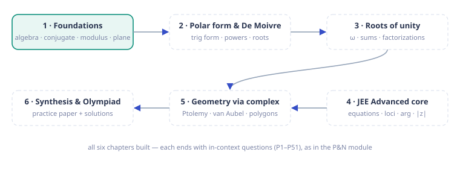
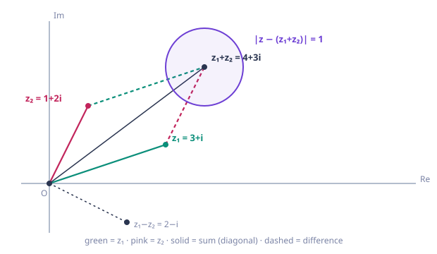
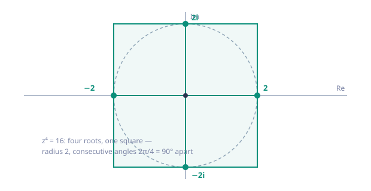

# Complex-Numbers — Complete Course Notes

*Source: `complex-numbers-mindmap.html` converted to Markdown with diagrams*

*Module · Complex Numbers*

# Complex Numbers

From the equation that has no answer — $x^2 = -1$ — to a geometric language where multiplication is rotation and Olympiad geometry collapses into algebra. Every formula is *derived from reasoning*, never memorized.

`6 chapters · complete` `50 in-context questions (P1–P51)` `38-question paper + solutions` `SVG diagrams` `JEE Advanced → Olympiad`

### ★ How to use these notes

**Read in order — do not skip the "why" boxes.** Each chapter is built in layers: *concept → first-principles reasoning → JEE theory → Olympiad extension*. The single most important habit this module trains: **switching languages** — algebraic ($a+bi$, conjugates, modulus) when you need to compute, geometric (the plane, distances, rotations) when you need insight. Nearly every JEE Advanced and Olympiad problem in this subject is solved by doing exactly that.

> **💡 Key Idea — the two languages**
>
> Algebraic: $z = a + bi$, conjugate $\bar z$, modulus $|z|$, division via $\bar z$. Geometric: $z$ is a point/vector in the plane; $|z-w|$ is a distance; $|zw| = |z||w|$ says multiplication stretches; $\times i$ is a quarter-turn. **One object, two faces — problems are solved at the interface.**

### ▣ The roadmap

**Diagram**

| Chapter | Core idea | Signature results |
| --- | --- | --- |
| 1 · Foundations | $\mathbb{C}$ as pairs with one rule: $i^2 = -1$ | conjugate, modulus, distance, triangle inequality, parallelogram law, $\times i$ = rotation |
| 2 · Polar & De Moivre | stretch $\times$ rotate | $z = r(\cos\theta + i\sin\theta)$, $(\cos\theta+i\sin\theta)^n$, n-th roots |
| 3 · Roots of unity | the $n$-th roots form a regular polygon | $1+\omega+\cdots+\omega^{n-1}=0$, factorizations, $\binom$-sums via filters |
| 4 · JEE Advanced | the interface language | $\|z-a\|=r$, arg conditions, $\|z\|$-inequalities, solving $z$ equations, loci |
| 5 · Olympiad geometry | geometry collapses to algebra | Ptolemy as $\|z_1z_3+w_1w_3\|=\|z_1z_2\|\|w_2w_3\|$-style identities, van Aubel, regular $n$-gons |
| 6 · Synthesis | the whole toolkit | 38-question paper + full solutions, single-file mind map |

### 1 Chapters

[ Chapter 1 · Foundations Why $i$ must exist, the algebra of $a+bi$, conjugate and division, the complex plane, modulus as distance, triangle inequality, parallelogram law, and the first taste of rotation. 6 sections · 8 in-context questions · 2 SVG diagrams · **ready →** ](#chapter-1) [ Chapter 2 · Polar form & De Moivre Argument, polar (trigonometric) form, De Moivre's theorem with a real proof, powers, and the n-th roots of a complex number. 7 sections · 12 questions (P9–P20) · 1 SVG · **ready →** ](#chapter-2) [ Chapter 3 · Roots of unity $\omega$, the regular-polygon structure, sums like $1+\omega+\omega^2=0$, product formulas, and the roots-of-unity filter for binomial sums. 5 sections · 8 questions (P21–P28) · 1 SVG · **ready →** ](#chapter-3) [ Chapter 4 · JEE Advanced core Equations mixing $z$ and $\bar z$, circles from modulus, arcs from argument, minimizing $|z-a|$, ellipses, and ranges over regions. 7 sections · 11 questions (P29–P39) · 2 SVG · **ready →** ](#chapter-4) [ Chapter 5 · Geometry via complex numbers Rotation as the engine: the equilateral condition, Ptolemy from a one-line identity, Van Aubel, Napoleon, centroid distance-sums, area and circumcenter. 6 sections · 6 questions (P41–P46) · 1 SVG · **ready →** ](#chapter-5) [ Chapter 6 · Synthesis & stretch Unit-circle configurations (rectangle, hexagon), product identities from $z^n-1$, the Joukowski map $z+1/z$, and the British Flag theorem. 5 sections · 5 questions (P47–P51) · 1 SVG · **ready →** ](#chapter-6) [ 📝 Olympiad & JEE Advanced paper 38 questions in eight sections (A–H), JEE Main → Olympiad, covering every chapter's signature move — with short-form answers. 38 questions · 8 sections · **take it →** ](#olympiad-paper) [ 🔑 Full worked solutions Every question solved: method name first, then the computation, then a check — both methods where two exist. 38 solutions · **open →** ](#solutions) [ ⚡ One file · whole course (mind map) The entire module — every chapter, section, question and answer — in a single recursively-expandable mind map. Click any node to drill down; expand all from the toolbar. single file · 8 pages merged · **open →** ](#course-map)

### ! One-page mindset

Three habits separate people who "know complex numbers" from people who can solve olympiad problems with them:

- **Distance, not coordinates.** The moment you see $|z-a|$, stop computing: it is the distance from $a$. Loci problems are geometry problems wearing algebra clothes.
- **Conjugate = reflection.** $\bar z$ mirrors across the real axis; $\frac{z_1}{z_2}$ is the "shape" (rotation + scale) that takes $z_2$ to $z_1$. Perpendicularity, collinearity and similarity all become one-line statements.
- **Verify small cases first.** Before trusting an identity in $n$ roots of unity, test $n=2,3,4$ by hand — the arithmetic either clicks or it doesn't.

## Roadmap

- **Chapter 1**: Ch 1 · Foundations — Algebra & the Plane — 5 sections · 8 questions
- **Chapter 2**: Ch 2 · Polar Form & De Moivre — 7 sections · 12 questions
- **Chapter 3**: Ch 3 · Roots of Unity — 5 sections · 8 questions
- **Chapter 4**: Ch 4 · JEE Advanced Core — 7 sections · 11 questions
- **Chapter 5**: Ch 5 · Geometry via Complex Numbers — 6 sections · 6 questions
- **Chapter 6**: Ch 6 · Synthesis — 5 sections · 5 questions
- **Olympiad Paper**: Olympiad Paper · 38 questions — 
- **Solutions**: Olympiad Paper · Solutions & marking guide

---

# Chapter 1 — Foundations — Algebra & the Plane

*5 sections · 8 questions*

*Chapter 1 · Foundations*

# Complex Numbers: Algebra & the Plane

From the equation $x^2 = -1$ that has no answer, to a two-dimensional algebra where *multiplication is rotation*. Nothing is a convention to memorize: every rule is forced by one choice, $i^2 = -1$, and everything geometric follows from the arithmetic (and vice versa).

`definition & arithmetic` `conjugate` `modulus` `complex plane` `distance & loci` `triangle inequality` `multiplication = rotation`

### 1.1 Why $i$ has to exist — the dead end, and its fix

Solving $x^2 + bx + c = 0$ ends with the quadratic formula: 
$$ x = \frac{-b \pm \sqrt{b^2 - 4ac}}{2}. $$
 The formula works *until the discriminant is negative*. Try $x^2 + x + 1 = 0$: $\Delta = 1 - 4 = -3$, and the formula stops mid-sentence, asking for $\sqrt{-3}$. This is not a defect of this one equation — **every** $x^2 + bx + c$ with $b^2 &lt; 4c$ hits the wall. The quadratic, the most basic polynomial, has equations that the real numbers refuse to solve.

> **⛁ First Principles — the definition, and why the arithmetic is forced**
>
> Introduce one new symbol $i$ with exactly one property: 
> $$ i^2 = -1. $$
>  A **complex number** is a real linear expression in $i$: 
> $$ z = a + bi \qquad (a, b \in \mathbb R), $$
>  read "a plus b i". Here $a$ is the **real part** ($\operatorname{Re} z$) and $b$ the **imaginary part** ($\operatorname{Im} z$) — note the imaginary part is $b$, *not* $bi$.
>
>
> Why does the arithmetic "just work"? Because there is no freedom left. Addition is componentwise. For multiplication, take two complex numbers, expand with the distributive law, and use $i^2 = -1$: 
> $$ (a + bi)(c + di) = ac + adi + bci + bdi^2 = (ac - bd) + (ad + bc)i. $$
>  **That formula is not a rule you chose — it is forced** by distributivity plus $i^2 = -1$. The whole algebra of complex numbers is the closure of the real numbers under "keep expanding and reducing $i^2$ to $-1$." Once you internalize that, there are no arithmetic conventions to remember at all.

**Equality is componentwise.** $a + bi = c + di \iff a = c$ and $b = d$ (a complex number *is* the ordered pair $(a,b)$ with that multiplication). In particular $a + bi = 0 \iff a = 0$ and $b = 0$ — the two parts are independent, and this fact will quietly settle many "solve for $z$" problems.

**History in one line.** Cardano's 1545 formula for cubics forced computations with $\sqrt{-1}$ even when the final answer was real; Bombelli worked out the rules (1556) and they produced correct answers; Descartes derisively named them "imaginary"; Euler settled on the notation $i$ (for *imaginarius*) in the late 1700s. The name never caught up with the reality: complex numbers are as concrete as any algebraic object — they are the reals with one extra element adjoined.

> **💡 Key Idea — the only axiom is $i^2 = -1$**
>
> Everything in this chapter — the product rule, the conjugate trick, the modulus, the geometry — is a *consequence* of (a) distributivity and (b) $i^2 = -1$. When you forget a rule, re-derive it by expanding and reducing $i^2$.

**Worked — the first computation.** Multiply $(3+2i)(5-i)$: 
$$ (3+2i)(5-i) = 15 - 3i + 10i - 2i^2 = 15 + 7i + 2 = 17 + 7i. $$
 Watch the last step: $-2i^2 = -2(-1) = +2$. That sign flip is the single most common slip in complex arithmetic.

#### **P1**[JEE Main][practice][arithmetic]Simplify [formula] .

Simplify $(1+2i)^2 + \dfrac{3-i}{i}$.

Answer + Reasoning

$(1+2i)^2 = 1 + 4i + 4i^2 = -3 + 4i$. For the fraction, note $\frac{1}{i} = -i$ (since $i \cdot (-i) = -i^2 = 1$): $\frac{3-i}{i} = (3-i)(-i) = -3i + i^2 = -1 - 3i$.

Sum: $(-3 + 4i) + (-1 - 3i) = \mathbf{-4 + i}$.

### 1.2 The conjugate, division, and why $\mathbb C$ is a field

Complex numbers add, subtract and multiply cleanly. The one operation that would be awkward — **division** — is fixed by one elegant device: the **conjugate**.

**Definition.** The conjugate of $z = a + bi$ is 
$$ \bar z = a - bi. $$
 Geometric meaning (proved in 1.3): conjugation is *reflection in the real axis*. First, the identities that make $\bar z$ indispensable — each is a one-line multiplication:

$$z + \bar z = 2\operatorname{Re} z \qquad z - \bar z = 2i\,\operatorname{Im} z$$ $$z\,\bar z = a^2 + b^2 \ge 0,\ \text{ with equality iff } z = 0$$

**The division trick, derived (not recited).** You want $\frac{z}{w}$ with $w = c + di \ne 0$. The obstruction: the denominator is not real. Notice what the conjugate does to it: 
$$ w\,\bar w = (c+di)(c-di) = c^2 + d^2 \in \mathbb R,\quad &gt; 0. $$
 Multiplying top and bottom by $\bar w$ is therefore *the* move — it converts a complex denominator into a positive real one: 
$$ \frac{z}{w} = \frac{z\,\bar w}{w\,\bar w} = \frac{z\,\bar w}{|w|^2}.
    \qquad\text{In particular } \frac{1}{a+bi} = \frac{a-bi}{a^2+b^2}. $$
 **This is why the conjugate exists in the first place**: it is the denominator-killer.

**Worked — a full division.** 
$$ \frac{1+2i}{3-i} = \frac{(1+2i)(3+i)}{(3-i)(3+i)} = \frac{3 + i + 6i + 2i^2}{9 + 1}
    = \frac{1 + 7i}{10} = \frac{1}{10} + \frac{7}{10}i. $$
 The denominator came out $c^2 + d^2 = 10$ — real, positive, done.

> **⛁ First Principles — no zero divisors, hence a field**
>
> **Claim:** $zw = 0 \implies z = 0$ or $w = 0$.
>
>
> **Proof.** Suppose $w \ne 0$. Multiply the equation by $\bar w$: 
> $$ z(w\bar w) = 0 \cdot \bar w = 0 \implies z\,|w|^2 = 0. $$
>  But $|w|^2 = w\bar w &gt; 0$ is an ordinary real number, so dividing by it gives $z = 0$. $\square$
>
>
> With no zero divisors and every nonzero element invertible (the formula above), $\mathbb C$ is a **field**: the four operations behave exactly like they do for reals, so all of algebra — factoring, completing the square, the quadratic formula — runs inside $\mathbb C$ without exception. That is the structural payoff of adjoining $i$.

> **📌 Note — the quadratic formula now always works**
>
> Over $\mathbb C$, $x^2 + bx + c = 0$ always has two roots: $x = \frac{-b \pm \sqrt{b^2-4c}}{2}$. The only thing this claims is that every complex number has a square root — the statement that needs proof. Chapter 2 (polar form) proves it geometrically in one picture, and then "every quadratic splits" becomes automatic. (The full force — every *polynomial* splits — is the Fundamental Theorem of Algebra, used as a black box in later chapters.)

> **🏛 Exam flavor — the cycle of $i$**
>
> Powers of $i$ cycle with period 4: $i, -1, -i, 1, i, \dots$. So $i^n = i^{\,n \bmod 4}$. A JEE favorite pattern: $(1+i)^2 = 2i$, hence 
> $$ (1+i)^{40} = \big((1+i)^2\big)^{20} = (2i)^{20} = 2^{20}\, i^{20}
>       = 2^{20}(i^4)^5 = 2^{20} = 1{,}048{,}576. $$
>  The trick is always: **reduce the base first, then the exponent mod 4**.

#### **P2**[JEE Main][practice][conjugate · division]Compute [formula] .

Compute $\left(\dfrac{1+i}{1-i}\right)^3$.

Answer + Reasoning

Conjugate the denominator: $\frac{1+i}{1-i} = \frac{(1+i)^2}{(1-i)(1+i)}
        = \frac{1 + 2i + i^2}{1 - i^2} = \frac{2i}{2} = i$. Hence the cube is $i^3 = \mathbf{-i}$.

#### **P3**[JEE Adv][practice][real/imaginary parts]Find all [formula] for which [formula] is purely imaginary.

Find all $z \in \mathbb C$ for which $2\bar z - 3z$ is purely imaginary.

Answer + Reasoning

Write $z = a + bi$: $\bar z = a - bi$. Then $2\bar z - 3z = 2(a-bi) - 3(a+bi) = -a - 5bi$.

Purely imaginary $\iff$ real part $0$ $\iff a = 0$. So $z$ must be **purely imaginary** (including $z = 0$): the whole imaginary axis.

### 1.3 The complex plane — where geometry lives

Plot $z = a + bi$ as the point $(a, b)$ — real part on the horizontal axis, imaginary part on the vertical. This is not a decorative choice: **addition of complex numbers is exactly vector addition**, componentwise: 
$$ (a+bi) + (c+di) = (a+c) + (b+d)i. $$
 The picture is the parallelogram law you already know from vectors, and everything below is the consequence: the modulus is a *distance*, and "distance language" solves entire families of problems.

**Modulus.** 
$$ |z| = \sqrt{a^2 + b^2} $$
 is the distance from the origin to the point $z$. It ties the two languages together in one identity, proved in 1.2: 
$$ |z|^2 = z\,\bar z. $$
 From now on, $z\bar z$ and $|z|^2$ are the same object written twice.

**Distance between two points.** If $z = a+bi$ and $w = c+di$, then 
$$ |z - w| = \sqrt{(a-c)^2 + (b-d)^2} $$
 — the ordinary distance between their points, since $z - w = (a-c) + (b-d)i$. This one formula is the engine of every locus problem in the subject:

| Condition | Geometric meaning |
| --- | --- |
| $\|z - z_0\| = r$ | circle, center $z_0$, radius $r$ |
| $\|z - z_0\| &lt; r$ | interior of that circle |
| $\|z - a\| = \|z - b\|$ | perpendicular bisector of segment $ab$ |
| $\operatorname{Re} z = c$ | vertical line $x = c$ |
| $\operatorname{Im} z = d$ | horizontal line $y = d$ |
| $\|z - a\| + \|z - b\| = 2k \ (k &gt; \|a-b\|/2)$ | ellipse with foci $a, b$ |
| $\|z - a\| = k\|z - b\|\ (k \ne 1)$ | circle (Apollonius circle) |

**Diagram**

> **⛁ First Principles — the triangle inequality, proved geometrically**
>
> **Theorem.** 
> $$ |z + w| \le |z| + |w| \qquad \text{for all } z, w \in \mathbb C. $$
>  **Proof.** The three points $0$, $z$, $z+w$ form a (possibly degenerate) triangle: the side from $0$ to $z+w$ is the vector $z+w$, the other two sides are the vectors $z$ and $w = (z+w) - z$. A side of a triangle is never longer than the sum of the other two: $|z+w| \le |z| + |w|$. Equality holds exactly when the triangle degenerates with $z$ and $w$ pointing the *same way* (one a non-negative real multiple of the other), or when one is $0$. $\square$
>
>
> **The reverse form.** From $|z| = |(z-w) + w| \le |z-w| + |w|$ and the symmetric argument: 
> $$ |\,|z| - |w|\,| \le |z - w|. $$
>  Geometric meaning: the difference of two distances between two fixed points is bounded by the distance between them. Both forms will do the work in optimization problems (minimizing $|z - a|$ subject to $|z| = r$, and friends).

> **💡 Key Idea — the parallelogram law (a two-line JEE workhorse)**
>
> **Claim.** 
> $$ |z + w|^2 + |z - w|^2 = 2|z|^2 + 2|w|^2. $$
>  **Algebraic proof.** Using $|u|^2 = u\bar u$: 
> $$ |z \pm w|^2 = (z \pm w)(\bar z \pm \bar w) = |z|^2 + |w|^2 \pm (z\bar w + \bar z w), $$
>  and adding the two, the cross terms $z\bar w + \bar z w$ cancel. $\square$
>
>
> **Geometry.** In the parallelogram spanned by $z, w$, $z+w$ and $z-w$ are the diagonals: *sum of squares of the diagonals = sum of squares of the four sides*. JEE Advanced loves to hide this law inside a "minimize $|z|^2 + |z-2|^2$…" style problem — recognize the diagonals and stop computing.

**Midpoint.** Componentwise, $\frac{z_1 + z_2}{2}$ is the midpoint of the segment $z_1z_2$ — another reason the "vector" intuition is the right one.

**Worked — reading loci off the page.**

- $|z - 3i| = 4$: distance from $3i$ (the point $(0,4)$) is $4$ → a circle centered at $(0,4)$ with radius $4$.
- $|z + 1| = |z - 2|$: distance from $-1$ equals distance from $2$ → the perpendicular bisector of the segment from $-1$ to $2$ → the vertical line $\operatorname{Re} z = \frac12$.

#### **P4**[JEE Adv][practice][triangle inequality · geometry]If [formula] , find the minimum of [formula] . At which [formula] is it attain…

If $|z| = 1$, find the minimum of $|z - 3 - 4i|$. At which $z$ is it attained?

Answer + Reasoning

Geometrically: $z$ ranges over the unit circle; we want the closest point on it to $3+4i$, which sits at distance $|3+4i| = 5$ from the origin. The closest point is the one on the segment from the origin to $3+4i$: 
$$ |z - (3+4i)| \ge |3+4i| - |z| = 5 - 1 = 4, $$
 with equality when $z$ points the same way as $3+4i$: $z = \frac{3+4i}{5}$.

**Minimum $= 4$**, attained at $z = \frac35 + \frac45 i$.

#### **P5**[JEE Main][practice][parallelogram law]For [formula] and [formula] , compute both sides of [formula] and verify the i…

For $z = 3+4i$ and $w = 1-2i$, compute both sides of $|z+w|^2 + |z-w|^2 = 2|z|^2 + 2|w|^2$ and verify the identity numerically.

Answer + Reasoning

$|z|^2 = 25$, $|w|^2 = 5$, so RHS $= 2(25) + 2(5) = 60$.

$z+w = 4+2i \Rightarrow |z+w|^2 = 16 + 4 = 20$; $\ z-w = 2+6i \Rightarrow
        |z-w|^2 = 4 + 36 = 40$. LHS $= 20 + 40 = 60$. ✓ — and notice you never needed to "know" the formula: both sides are just sums of $a^2+b^2$.

#### **P6**[warm-up][practice][real/imaginary parts]Solve for [formula] : [formula] and [formula] .

Solve for $z$: $\ \ z + \bar z = 4$ and $\ z - \bar z = 6i$.

Answer + Reasoning

Add the equations: $2z = 4 + 6i$, so $z = 2 + 3i$. (Check: $z+\bar z = 4$ ✓, $z - \bar z = 6i$ ✓.) This is the whole method: $z + \bar z = 2\operatorname{Re}z$, $z - \bar z = 2i\operatorname{Im}z$ — two linear equations in the two parts.

### 1.4 Multiplication stretches and rotates — the subject in one picture

The most important fact in the entire subject, and the first thing worth proving:

> **⛁ First Principles — $|zw| = |z|\,|w|$**
>
> **Proof.** 
> $$ |zw|^2 = (zw)\,\overline{(zw)} = zw\,\bar z\,\bar w
>       = (z\bar z)(w\bar w) = |z|^2\,|w|^2, $$
>  since multiplication is commutative. Taking (non-negative) square roots: $|zw| = |z|\,|w|$. $\square$
>
>
> Consequences: dividing by $w$ scales distances by $\frac{1}{|w|}$; and $\left|\frac{z_1 - a}{z_2 - a}\right| = 1$ says $z_1$ and $z_2$ are equidistant from $a$. That last one — a ratio of distances being $1$ — is how perpendicular bisectors appear in "algebraic" problems.

**Multiplication by $i$ is a quarter-turn.** Compute: 
$$ i(a + bi) = -b + ai, $$
 so the point $(a, b)$ goes to $(-b, a)$. Verify the geometry directly: **Length preserved:** $(-b)^2 + a^2 = a^2 + b^2$ (or: $|iz| = |i||z| = |z|$). **Angle $90^\circ$:** the dot product $(a, b)\cdot(-b, a) = -ab + ab = 0$. **Orientation:** $(1,0) \mapsto (0,1)$, so the turn is *counterclockwise*. Hence $\times i$ = rotate $90^\circ$ CCW about the origin; $\times(-1)$ = $180^\circ$; $\times(-i)$ = $90^\circ$ clockwise. A general product $zw$ is then a rotation by (some angle) plus a stretch by $|w|$ — in Chapter 2 the "some angle" becomes $\arg w$ and this sentence turns into a formula.

**Diagram**

> **💡 Key Idea — two languages, one object**
>
> **Algebraic** ($a+bi$, $\bar z$, $|z|$): fast, exact, no drawing. **Geometric** (points, distances, rotations): sees structure, solves loci and optimization instantly. The working method for JEE Advanced and Olympiad problems: *translate the problem into the language that makes it visible*, solve there, translate back. Every later chapter is a new translation rule (polar form = the rotation angle made explicit; roots of unity = regular polygons made algebraic).

#### **P7**[JEE Adv][practice][algebra ↔ geometry]Solve [formula] in [formula] . Describe the solution set geometrically.

Solve $iz = \bar z$ in $\mathbb C$. Describe the solution set geometrically.

Answer + Reasoning

Algebra: write $z = a + bi$. Then $iz = -b + ai$ and $\bar z = a - bi$. Equality forces $-b = a$ and $a = -b$ — the same condition. So $z = a - ai = a(1 - i)$ for arbitrary $a \in \mathbb R$ (including $a = 0$).

Geometry: the solutions are exactly the points on the line $y = -x$ through the origin. Notice the symmetry: $iz = \bar z$ says "rotating $z$ by $90^\circ$ gives its mirror in the real axis" — that is exactly the line at $-45^\circ$.

#### **P8**[Olympiad][practice][reverse triangle inequality]If [formula] , find the minimum of [formula] .

If $|z| = 2$, find the minimum of $|z + i|$.

Answer + Reasoning

Reverse triangle inequality: $|z + i| \ge \big||z| - |i|\big| = |2 - 1| = 1$.

Equality holds when $z$ and $i$ point in *opposite* directions (the degenerate-triangle case with opposite orientation): $z = -2i$. Indeed $|-2i + i| = |-i| = 1$. **Minimum $= 1$**, attained at $z = -2i$.

Same shape as P4 with the roles of the circle and the point swapped — the inequality $|u+v| \ge ||u|-|v||$ is the tool that closes both.

### 1.5 The bridge — where this course is going

Solve the equation that opened this chapter: 
$$ x^2 + x + 1 = 0 \implies x = \frac{-1 \pm \sqrt{-3}}{2} = \frac{-1 \pm i\sqrt3}{2}. $$
 Two facts to notice, both of which become theorems in Chapter 3:

- **They sit on the unit circle:** $\left|\frac{-1 \pm i\sqrt3}{2}\right| = \frac{\sqrt{1+3}}{2} = 1$.
- **Their product is $1$ and their sum is $-1$** (Vieta), so the two roots are conjugates, and each is the cube of the other's inverse — they are the two *primitive cube roots of unity*, usually named $\omega$ and $\omega^2$, with the all-purpose identity $1 + \omega + \omega^2 = 0$.

Meanwhile $x^2 + 1 = (x - i)(x + i)$: a "quadratic irreducible over the reals" splits completely once $i$ is present. The general picture — **every polynomial splits over $\mathbb C$** — is the Fundamental Theorem of Algebra, and it is what makes complex numbers the natural home of polynomial equations. The chapters ahead:

| Chapter | The new translation rule |
| --- | --- |
| 2 · Polar form & De Moivre | $z = r(\cos\theta + i\sin\theta)$: the stretch $r$ and the rotation angle $\theta$ separated; $(\cos\theta + i\sin\theta)^n = \cos n\theta + i\sin n\theta$; every $z$ has exactly $n$ n-th roots, a regular polygon. |
| 3 · Roots of unity | $\omega$ and its siblings: the regular-$n$-gon structure, $1+\omega+\cdots+\omega^{n-1}=0$, factorizations of $x^n - a$, and the filter $\frac{1}{n}\sum_j \zeta^{-rj}$ for "every r-th term" binomial sums. |
| 4 · JEE Advanced core | the exam's problem taxonomy: equations in $z$, $\arg z$ conditions, $\|z-a\| = k\|z-b\|$ circles, locus machinery, and optimization via the triangle inequality. |
| 5 · Geometry via complex numbers | encode points of a figure as complex numbers; Ptolemy, van Aubel, cyclicity and regular polygons become one-line algebra — the standard Olympiad weapon. |
| 6 · Synthesis & paper | a 30+ question paper covering all of the above, with full solutions. |

> **⚠ Mistake checklist (read before every problem)**
>
> - $i^2 = -1$, so **$-2i^2 = +2$** — the sign that silently breaks most arithmetic.
> - The imaginary part of $3 + 4i$ is $4$, *not* $4i$.
> - $\frac{z_1}{z_2} = 1$ means $z_1 = z_2$; $\left|\frac{z_1}{z_2}\right| = 1$ means only *equal lengths*. Don't drop the modulus accidentally.
> - $|z - a| = r$ has center at $a$ — the *minus* inside the modulus points to the center, not to a reflection.
> - $\bar{\bar z} = z$, but $\overline{z_1 z_2} = \bar z_1\,\bar z_2$ and $\overline{z_1 + z_2} = \bar z_1 + \bar z_2$ — conjugation respects $+$ and $\cdot$, so you may conjugate entire equations.

---

---

# Chapter 2 — Polar Form & De Moivre

*7 sections · 12 questions*

*Chapter 2 · Polar Form & De Moivre*

# Stretch × Rotate

Every complex number is a *length times a direction*. Once the direction becomes a variable, multiplication becomes angle-addition, powers become angle-multiplication, and "find the n-th roots" becomes "draw a regular n-gon". De Moivre's theorem is the engine; everything in this chapter is its consequence.

`argument` `polar form` `De Moivre` `n-th roots` `square roots of complex numbers` `Euler's form`

### 2.1 The argument — the missing half of the story

Chapter 1 gave the *length* of $z = a + bi$: the modulus $|z| = \sqrt{a^2+b^2}$. The *direction* is equally intrinsic, and it is what multiplication actually does. Look at the point $z$ on the complex plane: it has a distance from $O$ and an angle from the positive real axis. That angle is the **argument**.

> **⛁ First Principles — definition, and why it is multi-valued**
>
> For $z \ne 0$, an **argument** of $z$ is any real number $\theta$ with 
> $$ a = |z|\cos\theta, \qquad b = |z|\sin\theta. $$
>  Such a $\theta$ is determined only up to adding multiples of $2\pi$: if $\theta$ works, so does $\theta + 2k\pi$, $k \in \mathbb Z$. So "the argument" is really a *set*: $\arg z = \{\theta_0 + 2k\pi : k \in \mathbb Z\}$. We write $\arg z$ for the set and **principal argument** $\operatorname{Arg} z \in (-\pi, \pi]$ for the canonical representative.
>
>
> Why the set matters: angles *add*, and addition of angles is only defined mod $2\pi$. Keeping "mod $2\pi$" visible (instead of silently picking one representative) is what keeps De Moivre honest for negative and rational powers.

Examples that build the reflex: 
$$ \begin{array}{c|c|c}
    z & |z| & \operatorname{Arg} z \\ \hline
    1 & 1 & 0 \\
    i & 1 & \frac{\pi}{2} \\
    -1 & 1 & \pi \ \ (\text{not } -\pi) \\
    -i & 1 & -\frac{\pi}{2} \\
    1+i & \sqrt2 & \frac{\pi}{4} \\
    1-i\sqrt3 & 2 & -\frac{\pi}{3} \\
    -1+i & \sqrt2 & \frac{3\pi}{4}
    \end{array} $$
 The quadrant check is the whole skill: the quadrant of $(a,b)$ fixes which reference angle to use; $\operatorname{Arg}(-1+i) = \pi - \pi/4 = 3\pi/4$, *not* $-\pi/4$ (that's the fourth quadrant).

> **💡 Key Idea — arguments turn multiplication into addition**
>
> For $z_1, z_2 \ne 0$: 
> $$ \arg(z_1 z_2) = \arg z_1 + \arg z_2 \pmod{2\pi}, \qquad
>       \arg\frac{z_1}{z_2} = \arg z_1 - \arg z_2 \pmod{2\pi}, $$
>  and $\arg \bar z = -\arg z$, $\arg(z^n) = n\arg z$. Proof preview: these all follow in one line from the polar form (next section). Consequence you can already use: the angle of the product is the *sum of the angles* — "rotate by $\theta_1$, then by $\theta_2$, is a rotation by $\theta_1+\theta_2$".

#### **P9**[warm-up][practice][argument]Find the modulus and principal argument of [formula] . Hence express it in the…

Find the modulus and principal argument of $-1 + i$. Hence express it in the form $r(\cos\theta + i\sin\theta)$ with $r &gt; 0$.

Answer + Reasoning

$|-1+i| = \sqrt{1+1} = \sqrt2$. Point $(-1, 1)$ is in quadrant II; reference angle $\pi/4$: $\operatorname{Arg}(-1+i) = \pi - \pi/4 = 3\pi/4$.

$$ -1 + i = \sqrt2\left(\cos\frac{3\pi}{4} + i\sin\frac{3\pi}{4}\right). $$
 Check: $\cos 3\pi/4 = -\frac{\sqrt2}{2}$, $\sin 3\pi/4 = \frac{\sqrt2}{2}$ → $\sqrt2 \cdot (-\frac{\sqrt2}{2} + i\frac{\sqrt2}{2}) = -1 + i$ ✓

#### **P10**[JEE Main][practice][argument]Express [formula] in polar form with principal argument.

Express $1 - i\sqrt3$ in polar form with principal argument.

Answer + Reasoning

$|1 - i\sqrt3| = \sqrt{1+3} = 2$. Point $(1, -\sqrt3)$ is quadrant IV with reference angle $\tan^{-1}(\sqrt3) = \pi/3$, so the principal argument is $-\pi/3$.

$$ 1 - i\sqrt3 = 2\left(\cos\frac{-\pi}{3} + i\sin\frac{-\pi}{3}\right). $$
 (Equivalently $2(\cos \frac{5\pi}{3} + i\sin\frac{5\pi}{3})$ — same direction, non-principal representative.)

### 2.2 Polar (trigonometric) form

**Definition.** Every $z \ne 0$ can be written uniquely as 
$$ z = r(\cos\theta + i\sin\theta), \qquad r = |z| &gt; 0,\ \theta \in \arg z. $$
 The **polar form** separates the two pieces of data a complex number carries: the stretch $r$ and the direction $\theta$. Derivation (not a convention): draw the right triangle with hypotenuse $|z|$ and angle $\theta$ — the legs are exactly $|z|\cos\theta$ and $|z|\sin\theta$, i.e. $a$ and $b$.

The inverse conversion (polar → Cartesian) is just expansion: 
$$ r(\cos\theta + i\sin\theta) = r\cos\theta + i\, r\sin\theta. $$

> **⛁ First Principles — why the polar form multiplies the way it does**
>
> Let $z_1 = r_1(\cos\theta_1 + i\sin\theta_1)$ and $z_2 = r_2(\cos\theta_2 + i\sin\theta_2)$. Expanding the product: 
> $$ z_1z_2 = r_1 r_2\big[(\cos\theta_1\cos\theta_2 - \sin\theta_1\sin\theta_2)
>       + i(\cos\theta_1\sin\theta_2 + \sin\theta_1\cos\theta_2)\big]. $$
>  The two brackets are exactly the cosine- and sine-addition formulas, so 
> $$ z_1 z_2 = r_1 r_2 \big(\cos(\theta_1+\theta_2) + i\sin(\theta_1+\theta_2)\big). $$
>  **Read that result:** multiplying stretches by $r_1 r_2$ and rotates by $\theta_1 + \theta_2$. This one calculation is the seed of De Moivre's theorem (set $z_1 = z_2$, then induct) and the reason arguments add. Everything else in this chapter is bookkeeping for it.

**Worked — a full round trip.** Convert $-\sqrt3 + i$ to polar, then back.

- $r = \sqrt{3+1} = 2$. Point $(-\sqrt3, 1)$: quadrant II, reference angle $\tan^{-1}(1/\sqrt3) = \pi/6$, so $\theta = \pi - \pi/6 = 5\pi/6$.
- Polar: $-\sqrt3 + i = 2(\cos 5\pi/6 + i\sin 5\pi/6)$.
- Back: $2\cos 5\pi/6 = 2(-\sqrt3/2) = -\sqrt3$, $2\sin 5\pi/6 = 2(1/2) = 1$ ✓.

#### **P11**[JEE Main][practice][polar form]Find the polar form of [formula] , and of [formula] .

Find the polar form of $-i$, and of $\dfrac{1}{1+i}$.

Answer + Reasoning

$-i$: $r = 1$, direction straight down: $\operatorname{Arg} = -\pi/2$. Polar: $\cos(-\pi/2) + i\sin(-\pi/2)$.

$\frac{1}{1+i} = \frac{1-i}{(1+i)(1-i)} = \frac{1-i}{2} = \frac12 - \frac12 i$. So $r = \sqrt{\tfrac14 + \tfrac14} = \frac{1}{\sqrt2}$, quadrant IV, reference $\pi/4$: $\operatorname{Arg} = -\pi/4$.

$$ \frac{1}{1+i} = \frac{1}{\sqrt2}\left(\cos\frac{-\pi}{4} + i\sin\frac{-\pi}{4}\right). $$
 Sanity check via arguments: $\arg(1/(1+i)) = -\arg(1+i) = -\pi/4$ ✓, $|1/(1+i)| = 1/|1+i| = 1/\sqrt2$ ✓ — the two-language method works in either direction.

### 2.3 De Moivre's theorem — the engine

> **⛁ First Principles — statement and proof by induction**
>
> **Theorem (De Moivre).** For $z = \cos\theta + i\sin\theta$ (i.e. $|z| = 1$) and every integer $n \ge 1$: 
> $$ (\cos\theta + i\sin\theta)^n = \cos n\theta + i\sin n\theta. $$
>  More generally, for $z = r(\cos\theta + i\sin\theta)$: 
> $$ z^n = r^n(\cos n\theta + i\sin n\theta). $$
>  **Proof.** The general case follows from the $|z|=1$ case since $z^n = r^n(\cos\theta+i\sin\theta)^n$. For $|z|=1$: $n=1$ is the identity. Assume it holds for $n$. Then by the angle-addition calculation of §2.2, 
> $$ (\cos\theta+i\sin\theta)^{n+1}
>       = (\cos n\theta + i\sin n\theta)(\cos\theta + i\sin\theta)
>       = \cos(n+1)\theta + i\sin(n+1)\theta. \qquad \square $$
>  **Negative exponents.** $(\cos\theta+i\sin\theta)^{-1} =
>       \cos\theta - i\sin\theta = \cos(-\theta) + i\sin(-\theta)$ (conjugation flips the sign of the angle, §2.1), so the theorem extends to all $n \in \mathbb Z$ by writing $z^n = (z^{-1})^{-n}$.

**Worked — powering without expanding.** Compute $(\sqrt3 + i)^4$ two ways.

- *De Moivre:* $\sqrt3+i = 2(\cos\pi/6 + i\sin\pi/6)$, so $(\sqrt3+i)^4 = 2^4(\cos 2\pi/3 + i\sin 2\pi/3)
      = 16(-\tfrac12 + i\tfrac{\sqrt3}{2}) = -8 + 8\sqrt3\, i$.
- *Brute force (sanity):* $(\sqrt3+i)^2 = 2 + 2\sqrt3\, i
      = 4(\cos\pi/3 + i\sin\pi/3)$; squaring: $16(\cos 2\pi/3 + i\sin 2\pi/3)$ — same answer, and the squaring route shows why De Moivre halves the work each step.

**Corollary — the triple-angle formulas.** Set $n = 3$: 
$$ \cos 3\theta + i\sin 3\theta = (\cos\theta + i\sin\theta)^3
    = \cos^3\theta + 3i\cos^2\theta\sin\theta - 3\cos\theta\sin^2\theta - i\sin^3\theta. $$
 Equate real and imaginary parts (justified because two complex numbers are equal iff both parts are — Chapter 1, §1.1): 
$$ \boxed{\ \cos 3\theta = 4\cos^3\theta - 3\cos\theta,\qquad
    \sin 3\theta = 3\sin\theta - 4\sin^3\theta\ } $$
 (using $\sin^2\theta = 1 - \cos^2\theta$ and $\cos^2\theta = 1 - \sin^2\theta$). These are the kind of "trig identity" a JEE problem expects you to *derive in ten seconds* from De Moivre instead of remembering.

> **🏛 Exam flavor — $(1+i)^n$ and the $45^\circ$-direction trick**
>
> $1+i = \sqrt2\, e^{i\pi/4}$, so $(1+i)^n = 2^{n/2}(\cos n\pi/4 + i\sin n\pi/4)$: the angle steps by $45^\circ$ each power. In particular $(1+i)^2 = 2i$, $(1+i)^4 = -4$, $(1+i)^8 = 16$, and the cycle of directions has period 8. Any $(1+i)^n$ with $n \le 40$ is a 5-second computation: halve the exponent's parity, multiply by $2^{n/2}$, read the angle from the table of $n\pi/4 \bmod 2\pi$.

#### **P12**[JEE Main][practice][De Moivre]Compute [formula] .

Compute $(1+i)^8$.

Answer + Reasoning

$(1+i)^8 = \big((1+i)^2\big)^4 = (2i)^4 = 16\, i^4 = \mathbf{16}$.

De Moivre check: $(\sqrt2\, e^{i\pi/4})^8 = 2^4 e^{i2\pi} = 16$ ✓.

#### **P13**[JEE Adv][practice][De Moivre · trig]If [formula] , express [formula] as a function of [formula] .

If $z = \cos\theta + i\sin\theta$, express $\operatorname{Re}(z^3 + z^{-3})$ as a function of $\cos\theta$.

Answer + Reasoning

By De Moivre: $z^3 = \cos 3\theta + i\sin 3\theta$. Also $z^{-1} = \bar z = \cos\theta - i\sin\theta = \cos(-\theta) + i\sin(-\theta)$, so $z^{-3} = \cos 3\theta - i\sin 3\theta$.

$$ z^3 + z^{-3} = 2\cos 3\theta \quad (\text{purely real}) $$
 and with the triple-angle formula, 
$$ \operatorname{Re}(z^3+z^{-3}) = 2\cos 3\theta = \mathbf{8\cos^3\theta - 6\cos\theta}. $$
 The general pattern — $z^n + z^{-n}$ is a polynomial in $2\cos\theta$ of degree $n$ — is how roots-of-unity sums get evaluated in Chapter 3.

#### **P14**[Olympiad][practice][De Moivre · identity]Prove that for all [formula] : [formula] (Here [formula] — the notation of §2.…

Prove that for all $\theta$: 
$$ e^{i\theta} + e^{i(\theta + 2\pi/3)} + e^{i(\theta + 4\pi/3)} = 0. $$
 (Here $e^{i\theta} := \cos\theta + i\sin\theta$ — the notation of §2.6.)

Answer + Reasoning

Factor out $e^{i\theta}$: 
$$ e^{i\theta}\big(1 + e^{2\pi i/3} + e^{4\pi i/3}\big). $$
 The bracket is $1 + \omega + \omega^2$ with $\omega = e^{2\pi i/3}$ — the sum of all three cube roots of 1. Since $t^3 - 1 = (t-1)(t^2+t+1)$, every root of $t^2+t+1 = 0$ (i.e. $\omega, \omega^2$) satisfies $1 + \omega + \omega^2 = 0$. Hence the whole expression is $0$. $\square$

Geometrically: three unit vectors spaced $120^\circ$ apart sum to zero — an equilateral triangle closed. This single fact powers a third of Chapter 3.

### 2.4 The n-th roots of a complex number

**Problem.** Solve $z^n = w$ for $z \in \mathbb C$, $w \ne 0$. Write $w = R(\cos\phi + i\sin\phi)$ and $z = r(\cos\theta + i\sin\theta)$. De Moivre turns the equation into two real conditions: 
$$ r^n = R, \qquad n\theta \equiv \phi \pmod{2\pi}. $$
 First: $r = R^{1/n} &gt; 0$ — *unique*. Second: $\theta = \frac{\phi + 2k\pi}{n}$, $k \in \mathbb Z$ — but $\theta$ is only defined mod $2\pi$, so distinct $k$ give distinct roots only while $k$ runs over $n$ consecutive values. Hence:

> **⛁ First Principles — exactly n roots, equally spaced**
>
> **Theorem.** $w \ne 0$ has exactly $n$ n-th roots: 
> $$ z_k = R^{1/n}\left(\cos\frac{\phi + 2k\pi}{n} + i\sin\frac{\phi + 2k\pi}{n}\right),
>       \qquad k = 0, 1, \dots, n-1. $$
>  They lie on the circle $|z| = R^{1/n}$, and consecutive ones differ in angle by exactly $2\pi/n$: **they are the vertices of a regular $n$-gon** circumscribed on that circle. (Existence and count: the $n$ values of $k$ are distinct mod $2\pi$; no other $\theta$ is possible since $n\theta \equiv \phi$ has exactly $n$ solutions mod $2\pi$.)

**Diagram**

**Worked — cube roots of 8.** $R = 2$, $\phi = 0$: 
$$ z_k = 2\left(\cos\frac{2k\pi}{3} + i\sin\frac{2k\pi}{3}\right),\ k = 0,1,2:
    \qquad z_0 = 2,\quad z_1 = -1 + i\sqrt3,\quad z_2 = -1 - i\sqrt3. $$
 Check each: $2^3 = 8$; and $(-1+i\sqrt3)^2 = 1 - 2i\sqrt3 - 3 = -2 - 2i\sqrt3$, so 
$$ (-1+i\sqrt3)^3 = (-1+i\sqrt3)(-2-2i\sqrt3) = 2 + 2i\sqrt3 - 2i\sqrt3 + \underbrace{(-2)(i\sqrt3)(i\sqrt3)}_{+6} = 8 \ \checkmark $$
 (The shortcut is the polar form: $-1+i\sqrt3 = 2e^{2\pi i/3}$, so its cube is $8e^{2\pi i} = 8$.)

**Worked — square roots of $-8$.** $R = 8$, $\phi = \pi$: 
$$ z_k = \sqrt8\left(\cos\frac{\pi + 2k\pi}{2} + i\sin\frac{\pi+2k\pi}{2}\right),\ k = 0,1:
    \quad z_0 = 2\sqrt2\, e^{i\pi/2} = 2\sqrt2\, i, \quad z_1 = 2\sqrt2\, e^{i3\pi/2} = -2\sqrt2\, i. $$
 Check: $(2\sqrt2\, i)^2 = 8i^2 = -8$ ✓. Notice the pattern: the two square roots are always opposite points on the circle (a regular 2-gon = a diameter).

> **📌 Note — "the" root vs "a" root**
>
> When a problem writes $\sqrt{w}$ for complex $w$, the convention is the **principal square root** (the one with argument in $(-\pi/2, \pi/2]$, i.e. non-negative real part — and for purely negative imaginary results, the one with non-negative imaginary part). But "find the n-th roots" always means *all n*. The ambiguity is a classic trap: $\sqrt{(-1)^2} = 1$, while $(\sqrt{-1})^2 = -1$ — never distribute a root over a product for complex numbers.

#### **P15**[JEE Main][practice][n-th roots]Find all fourth roots of [formula] .

Find all fourth roots of $16$.

Answer + Reasoning

$R = 16$, $\phi = 0$: $r = 2$, angles $\frac{2k\pi}{4} = \frac{k\pi}{2}$, $k = 0,1,2,3$.

$$ z_k = 2\left(\cos\frac{k\pi}{2} + i\sin\frac{k\pi}{2}\right)
        \in \{\ 2,\ 2i,\ -2,\ -2i\ \}. $$
 Each checks: $(2i)^4 = 16i^4 = 16$ ✓. Geometrically: the square inscribed in $|z| = 2$ — exactly as the diagram shows.

#### **P16**[JEE Adv][practice][n-th roots · geometry]Let [formula] be the three cube roots of [formula] . Find [formula] and [formu…

Let $z_1, z_2, z_3$ be the three cube roots of $-27$. Find $z_1 z_2 + z_2 z_3 + z_3 z_1$ and $z_1 + z_2 + z_3$.

Answer + Reasoning

The roots of $t^3 + 27 = 0$, i.e. of $t^3 = -27$, are the roots of $t^3 + 27$. Vieta gives it directly: for $t^3 + 0\cdot t^2 + 0\cdot t + 27$, 
$$ z_1 + z_2 + z_3 = -\frac{0}{1} = \mathbf{0}, \qquad
        z_1z_2 + z_2z_3 + z_3z_1 = \frac{0}{1} = \mathbf{0}. $$
 **But the geometry explains *why* Vieta says so:** the roots are $-3, \tfrac32 \pm i\tfrac{3\sqrt3}{2}$ — an equilateral triangle centered at the origin, and any regular $n$-gon centered at $0$ has vertex-sum $0$ (§3, roots of unity) and, for $n = 3$, the pairwise-product sum $0$ as well.

Explicit check (for the anxious): the arguments are $\pi, \pi/3, 5\pi/3$, so the pairwise products are $9e^{i4\pi/3},\ 9e^{i2\pi/3},\ 9e^{i2\pi} = 9$, and 
$$ z_1z_2 + z_2z_3 + z_3z_1 = 9\left(e^{i4\pi/3} + e^{i2\pi/3} + 1\right)
        = 9\left(-\tfrac12 - i\tfrac{\sqrt3}{2} - \tfrac12 + i\tfrac{\sqrt3}{2} + 1\right) = 0 \ \checkmark $$
 Vieta is the method; this is the verification.

### 2.5 Every complex number has a square root

Chapter 1, §1.2 promised: "every complex number has a square root — the statement that needs proof". Here it is, in the algebraic language (the polar proof is the $n = 2$ case of §2.4; both are below, because each trains a different reflex).

> **⛁ First Principles — the formula, derived from scratch**
>
> Seek $\sqrt{a+bi} = x + iy$ with $x, y \in \mathbb R$. Squaring and matching parts (Ch 1, §1.1 — equality is componentwise): 
> $$ (x+iy)^2 = x^2 - y^2 + 2xyi = a + bi
>       \iff \begin{cases} x^2 - y^2 = a,\\ 2xy = b. \end{cases} $$
>  One more identity closes the system: $|x+iy|^2 = x^2 + y^2$ must equal $|\sqrt{a+bi}|^2 = |a+bi| = r := \sqrt{a^2+b^2}$. Adding and subtracting: 
> $$ \boxed{\ x^2 = \frac{r + a}{2}, \qquad y^2 = \frac{r - a}{2}\ } $$
>  (both non-negative since $|a| \le r$), and the sign of $y$ is the sign of $b$ (with $x$ taken positive — $x = 0$ only when $a = -r$, handled by the same formula). So the two square roots of $a+bi$ are 
> $$ \pm\left(\sqrt{\frac{r+a}{2}} + i\,\operatorname{sgn}(b)\sqrt{\frac{r-a}{2}}\right)
>       \quad (b \ne 0), $$
>  with the obvious limit when $b = 0$. $\square$

**Worked — $\sqrt{3+4i}$.** $r = \sqrt{9+16} = 5$: $x^2 = \frac{5+3}{2} = 4$, $y^2 = \frac{5-3}{2} = 1$, and $b = 4 &gt; 0$ forces $x, y$ same sign. So $\sqrt{3+4i} = 2 + i$ (and the other root $-2 - i$). Check: $(2+i)^2 = 4 + 4i + i^2 = 3 + 4i$ ✓.

**Worked — $\sqrt{-3+4i}$.** $r = 5$: $x^2 = \frac{5-3}{2} = 1$, $y^2 = \frac{5+3}{2} = 4$, $b = 4 &gt; 0$: roots $1 + 2i$ and $-1 - 2i$. Check: $(1+2i)^2 = 1 + 4i - 4 = -3 + 4i$ ✓.

**Worked — $\sqrt{1+i}$ (the "ugly" case, for the record).** $r = \sqrt2$: $x^2 = \frac{\sqrt2+1}{2}$, $y^2 = \frac{\sqrt2-1}{2}$, $b &gt; 0$: 
$$ \sqrt{1+i} = \sqrt{\frac{1+\sqrt2}{2}} \;+\; i\,\sqrt{\frac{\sqrt2-1}{2}}. $$
 Clean verification: $x^2 - y^2 = \frac{(1+\sqrt2) - (\sqrt2-1)}{2} = 1 = a$ ✓, and $2xy = 2\sqrt{\frac{(1+\sqrt2)(\sqrt2-1)}{4}} = 2\sqrt{\frac{2-1}{4}} = 1 = b$ ✓. (Equivalently, $\sqrt{1+i} = 2^{1/4}\, e^{i\pi/8}$ — the polar form makes the "half-angle" structure visible.)

> **💡 Key Idea — the payoff for Chapter 1**
>
> Now the quadratic formula *always* works: $x^2 + bx + c = 0$ has the two roots $\frac{-b \pm \sqrt{b^2-4c}}{2}$, with $\sqrt{\ \cdot\ }$ defined on all of $\mathbb C$. Combined with the fundamental theorem of algebra (every polynomial splits over $\mathbb C$), the complex numbers are the algebraically closed home of polynomial equations — the reason the subject exists at all in olympiad mathematics.

#### **P17**[JEE Main][practice][square roots]Find the square roots of [formula] .

Find the square roots of $3+4i$.

Answer + Reasoning

$r = 5$: $x^2 = \frac{5+3}{2} = 4$, $y^2 = \frac{5-3}{2} = 1$, $b &gt; 0$ → same sign. **Roots: $\pm(2+i)$.** Check $(2+i)^2 = 3+4i$ ✓.

Shortcut for perfect cases: guess $(m+ni)^2 = m^2-n^2 + 2mni =
        a+bi$ with small integers — here $m^2+n^2 = 5$ immediately suggests $1,2$.

#### **P18**[JEE Adv][practice][square roots · algebra]Solve [formula] . Verify both roots directly.

Solve $z^2 = 4i$. Verify both roots directly.

Answer + Reasoning

$a = 0$, $b = 4$, $r = 4$: $x^2 = \frac{4+0}{2} = 2$, $y^2 = \frac{4-0}{2} = 2$, $b &gt; 0$ → same sign. Roots: $\pm(1+i)\sqrt{2} = \pm(\sqrt2 + i\sqrt2)$.

Check directly: $(\sqrt2 + i\sqrt2)^2 = 2(1+i)^2 = 2(2i) = 4i$ ✓.

Polar cross-check: $4i = 4e^{i\pi/2}$; square roots $2e^{i\pi/4}, 2e^{i5\pi/4} = \pm\sqrt2(1+i)$ ✓ — both languages agree.

### 2.6 Euler's form — $e^{i\theta}$, and the formula that unifies everything

Writing $\cos\theta + i\sin\theta$ over and over is noise. Euler's notation defines, for real $\theta$, 
$$ e^{i\theta} := \cos\theta + i\sin\theta, $$
 so the polar form becomes $z = r\,e^{i\theta}$, powers are $z^n = r^n e^{in\theta}$, and roots are $z_k = R^{1/n} e^{i(\phi+2k\pi)/n}$. The notation is not decorative — it is *exactly correct*: expanding the exponential series $e^w = \sum w^n/n!$ at $w = i\theta$ and grouping even/odd terms gives $\sum (-1)^k\theta^{2k}/(2k)! + i\sum (-1)^k\theta^{2k+1}/(2k+1)!$, which is $\cos\theta + i\sin\theta$ term for term. (Series convergence of $e^w$ for complex $w$ is a standard analysis fact; we use the identity as a proven theorem.)

> **🏛 The identity that made Euler famous**
>
> Set $\theta = \pi$: 
> $$ e^{i\pi} + 1 = 0. $$
>  Five fundamental constants — $0, 1, e, i, \pi$ — in one line. It is the "checkpoint" that every proof of the exponential's complex behavior must pass: it says the point reached after a half-turn of unit speed around the unit circle is $-1$.

**What you can now do mechanically.**

| Task | Euler-form move |
| --- | --- |
| Powers | $(re^{i\theta})^n = r^n e^{in\theta}$ — multiply the angle |
| Roots | $n$-th roots of $Re^{i\phi}$: $R^{1/n}e^{i(\phi+2k\pi)/n}$, $k = 0,\dots,n-1$ |
| Products/quotients | multiply/divide moduli, add/subtract arguments |
| $z + \bar z$, $z - \bar z$ | $re^{i\theta} + re^{-i\theta} = 2r\cos\theta$; $re^{i\theta} - re^{-i\theta} = 2ir\sin\theta$ |

That last row is the workhorse of the next two chapters: *a complex number plus its conjugate is twice its real part*, and for $|z| = 1$, $\bar z = 1/z$, so $z + 1/z = 2\cos\theta$ whenever $z = e^{i\theta}$. Chapter 3 is essentially the art of using $e^{i\theta}$-form to turn polynomial and binomial questions into geometry on the unit circle.

#### **P19**[JEE Main][practice][Euler form]Using [formula] notation, show that [formula] .

Using $e^{i\theta}$ notation, show that $(1+i)^{10} = 32i$.

Answer + Reasoning

$1+i = \sqrt2\, e^{i\pi/4}$, so 
$$ (1+i)^{10} = (\sqrt2)^{10} e^{i10\pi/4} = 2^5 e^{i5\pi/2} = 32 e^{i(\pi/2 + 2\pi)}
        = 32 e^{i\pi/2} = \mathbf{32i}. $$
 The reduction $5\pi/2 \equiv \pi/2 \pmod{2\pi}$ is the only real work — De Moivre did the rest.

#### **P20**[Olympiad][practice][Euler form · geometry]Let [formula] be four quarter-turn- adjacent points [formula] (a square on the…

Let $z_0, z_1, z_2, z_3$ be four quarter-turn-*adjacent* points $e^{i\alpha}, e^{i(\alpha+\pi/2)}, e^{i(\alpha+\pi)}, e^{i(\alpha+3\pi/2)}$ (a square on the unit circle). Show that 
$$ z_0 + z_1 + z_2 + z_3 = 0 $$
 and deduce: *any* regular $n$-gon centered at the origin has vertex-sum $0$.

Answer + Reasoning

Factor $e^{i\alpha}$: 
$$ e^{i\alpha}(1 + i + (-1) + (-i)) = e^{i\alpha}\cdot 0 = 0. $$
 The bracket is $1 + e^{i\pi/2} + e^{i\pi} + e^{i3\pi/2}$ — the sum of all fourth roots of 1, which is $0$ because $t^4 - 1 = (t-1)(t^3+t^2+t+1)$ and the other three roots satisfy $t^3+t^2+t+1 = 0$.

**General $n$:** the vertices are $re^{i\alpha}e^{2\pi ik/n}$, $k = 0,\dots,n-1$; factor $re^{i\alpha}$ and sum the geometric series with ratio $\omega = e^{2\pi i/n} \ne 1$: 
$$ \sum_{k=0}^{n-1}\omega^k = \frac{\omega^n - 1}{\omega - 1} = 0. \qquad \square $$
 This "vertex-sum zero" fact — proved once here — is used as a black box in Chapters 3, 5 and 6 (loci, Ptolemy, Napoleon).

### 2.7 Mistake checklist & the bridge to Chapter 3

> **⚠ Mistake checklist (this chapter)**
>
> - **Principal argument is in $(-\pi, \pi]$** — $\operatorname{Arg}(-1) = \pi$, never $-\pi$; quadrant IV gives *negative* arguments, e.g. $\operatorname{Arg}(1-i\sqrt3) = -\pi/3$.
> - **Angles are mod $2\pi$** — "$=$" on arguments silently means "$= \cdots \bmod 2\pi$"; write the modulus sign when it matters.
> - **$z^n$ has n roots, not one** — "the cube root of 8" as a JEE answer is always the set $\{2, -1\pm i\sqrt3\}$ unless "principal" is specified.
> - **Never cancel roots across products:** $\sqrt{z}\sqrt{w} \ne
>         \sqrt{zw}$ for complex $z, w$ in general (the principal-root branch cuts bite); for *algebraic* root-finding, always solve $z^n = w$ from scratch as in §2.4.
> - **$e^{i\theta}$ has modulus 1** — $e^{i\theta} \ne 1$ in general; $e^{i\theta} = 1 \iff \theta \equiv 0 \bmod 2\pi$.

**Where this is going.** The $n$-th roots of $1$ themselves — $1, \omega, \omega^2, \dots$ with $\omega = e^{2\pi i/n}$ — are the next chapter's heroes. Two facts from this chapter carry straight across: (i) they form a regular $n$-gon (vertex-sum zero, §2.6), and (ii) $1 + \omega + \cdots + \omega^{n-1} = 0$ (geometric-series ratio $\omega \ne 1$). Chapter 3 turns these into a computation toolkit: sums of powers, filter formulas for "every r-th term" binomial sums, and the product $\prod_{k=1}^{n-1}(1 - \omega^k) = n$.

---

---

# Chapter 3 — Roots of Unity

*5 sections · 8 questions*

*Chapter 3 of 6*

# Roots of Unity

The most special numbers in the whole subject: the solutions of $z^n = 1$. One definition buys you a whole family of identities — sums that vanish, products that collapse to $n$, trigonometric products with clean answers, and the "roots-of-unity filter," a JEE-Advanced/Olympiad workhorse for binomial sums with $k \equiv r \pmod n$. Master this chapter and a whole class of "magical" answers stops being magical.

### 3.1 The cube roots of unity — one number, five identities

The equation $z^3 = 1$ has exactly three solutions (Ch 2, §2.4): 
$$ 1,\qquad \omega = e^{2\pi i/3} = -\frac12 + i\frac{\sqrt3}{2},\qquad
    \omega^2 = e^{4\pi i/3} = -\frac12 - i\frac{\sqrt3}{2}. $$
 By universal convention, **$\omega$ denotes a non-real cube root of unity**, so $\omega^3 = 1$ and $\omega \ne 1$. Everything below is either a one-line computation from that, or a direct read-off from the plane. Learn the five identities; they appear in JEE questions at least once a year.

> **📦 The five $\omega$-identities (with proofs — no memorizing without reasons)**
>
> **(i) $1 + \omega + \omega^2 = 0$.** Since $\omega \ne 1$ is a root of $x^3 - 1 = (x-1)(x^2 + x + 1)$, we have $\omega^2 + \omega + 1 = 0$. (Equivalent view: geometric series $\frac{1-\omega^3}{1-\omega} = 0$, valid because $\omega \ne 1$.) **(ii) $\bar\omega = \omega^2$.** Conjugation reflects in the real axis: $\bar\omega = e^{-2\pi i/3} = e^{4\pi i/3} = \omega^2$. Geometrically, $\omega$ and $\omega^2$ are mirror images — both sit at $\pm 120^\circ$. **(iii) $(1-\omega)(1-\omega^2) = 3$.** Expand: $1 - \omega - \omega^2 + \omega\omega^2 = 1 - (\omega + \omega^2) + \omega^3 = 1 - (-1) + 1 = 3$, using (i) and $\omega^3 = 1$. **(iv) $1 + \omega = e^{i\pi/3}$.** Algebra: $1 + \omega = 1 - \frac12 + i\frac{\sqrt3}{2}
>       = \frac12 + i\frac{\sqrt3}{2} = \cos\frac{\pi}{3} + i\sin\frac{\pi}{3}$. So $1+\omega$ has modulus $1$ and argument $60^\circ$. (Useful consequence: $1+\omega = -\omega^2$, from (i).) **(v) $1 - \omega = \sqrt3\, e^{-i\pi/6}$.** $1 - \omega = \frac32 - i\frac{\sqrt3}{2}
>       = \sqrt3\left(\frac{\sqrt3}{2} - \frac{i}{2}\right) = \sqrt3\left(\cos\frac{-\pi}{6} + i\sin\frac{-\pi}{6}\right)$. So $|1-\omega| = \sqrt3$ — the side length of the equilateral triangle $\{1, \omega, \omega^2\}$ — and its argument is $-30^\circ$.

Why does this triangle matter? $1, \omega, \omega^2$ are equally spaced ($120^\circ$ apart) on the unit circle, so they form an *equilateral triangle*. Every identity above is either "plug in the geometry" or "expand and use $1+\omega+\omega^2=0$". When a JEE question says "let $\omega$ be a cube root of unity," your first move is always: rewrite everything in terms of $\omega + \omega^2 = -1$ and $\omega^3 = 1$.

**Worked — evaluate $(1+\omega)(1+\omega^2)$ two ways.** Algebra: expand and use $1+\omega+\omega^2 = 0$, $\omega^3 = 1$: 
$$ (1+\omega)(1+\omega^2) = 1 + (\omega+\omega^2) + \omega\omega^2 = 1 + (-1) + 1 = 1. $$
 Polar: use identities (iv)–(v), $1+\omega = e^{i\pi/3}$, $1+\omega^2 = \overline{1+\omega} = e^{-i\pi/3}$: 
$$ (1+\omega)(1+\omega^2) = e^{i\pi/3} \cdot e^{-i\pi/3} = 1. $$
 The two methods agree — and they should, which is a useful habit: when one method feels shaky, run the other one. Here the polar version is also a preview of a general principle: $1+\omega$ and $1+\omega^2$ are conjugates, so their product is $|1+\omega|^2 = 1$, real and positive, in one step.

> **⚠️ Watch out — the classic sign slip**
>
> $(1+\omega)(1+\omega^2) = 1$, and **not** 2. The slip is treating $\omega + \omega^2$ as $+1$. Drill: $\omega + \omega^2 = -1$, $\omega\omega^2 = 1$, $\omega^3 = 1$. If you ever write "2" here, one of those three is wrong in your head.

### 3.2 The $n$-th roots of unity and the vanishing sum

Generalize to $z^n = 1$. By Ch 2, the exactly-$n$ solutions are

*primitive*

> **📦 The vanishing-sum identity**
>
> For any integer $m$: 
> $$ \sum_{k=0}^{n-1} \zeta^{mk} = \begin{cases} n, & n \mid m,\\ 0, & n \nmid m. \end{cases} $$
>  **Proof.** This is a geometric series with ratio $\zeta^m$. If $n \mid m$, then $\zeta^m = 1$ and all $n$ terms are $1$. Otherwise $\zeta^m \ne 1$ and 
> $$ \sum_{k=0}^{n-1} (\zeta^m)^k = \frac{(\zeta^m)^n - 1}{\zeta^m - 1} = \frac{(\zeta^n)^m - 1}{\zeta^m - 1} = 0. $$
>  Two lines. This is the engine behind every "sum of roots" problem you will meet.

**Worked — $\sum_{k=0}^{5} e^{i\pi k/3}$.** The terms are $e^{0}, e^{i\pi/3}, e^{i2\pi/3}, e^{i\pi}, e^{i4\pi/3}, e^{i5\pi/3}$ — precisely the six sixth-roots of unity $\eta, \eta^2, \dots$ with $\eta = e^{i\pi/3}$. By the identity with $n = 6, m = 1$: **sum $= 0$**. (Read geometrically: the six vectors are the six sides' worth of a closed regular hexagon — they cancel.)

1 ζ ζ² −1 ζ⁴ ζ⁵ O The six sixth-roots of unity, $\zeta^k = e^{2\pi i k/6}$, form a regular hexagon. Their sum is $0$ — the vectors close the hexagon.

#### **P25**[JEE Main][roots of unity]Evaluate [formula] .

Evaluate $\displaystyle\sum_{k=0}^{5} e^{i\pi k/3}$.

Answer + Reasoning

The six terms are the sixth-roots of unity (in order). Either invoke $\sum_{k=0}^{5}\eta^k = \frac{1-\eta^6}{1-\eta} = 0$ with $\eta = e^{i\pi/3}$, or read the hexagon: opposite vertices cancel in pairs $(1 + (-1)) = 0$, $(e^{i\pi/3} + e^{i4\pi/3}) = 0$, $(e^{i2\pi/3} + e^{i5\pi/3}) = 0$.

Answer: $0$

### 3.3 Two product formulas — where the number $n$ hides

Sums of roots vanish; *products* of distances from $1$ to the roots produce exactly $n$. This is one of the most beautiful one-line applications of $z^n - 1$ in all of algebra.

> **📦 Product formula — $\displaystyle\prod_{k=1}^{n-1}(1-\zeta_k) = n$**
>
> **Proof.** Factor completely over $\mathbb{C}$: 
> $$ x^n - 1 = \prod_{k=0}^{n-1}(x - \zeta_k) = (x-1)\prod_{k=1}^{n-1}(x-\zeta_k). $$
>  Divide by $x-1$ and take the limit $x \to 1$ (equivalently, compare derivatives at $x=1$): 
> $$ \prod_{k=1}^{n-1}(1-\zeta_k) = \lim_{x\to 1}\frac{x^n-1}{x-1} = \left.\frac{d}{dx}x^n\right|_{x=1} = n. $$
>  The limit is just the definition of the derivative of $x^n$ at $x = 1$. Two-line proof, olympiad-grade content.

> **📦 Trigonometric cousin — $\displaystyle\prod_{k=1}^{n-1}\sin\frac{\pi k}{n} = \frac{n}{2^{n-1}}$**
>
> **Derivation.** Compute $|1-\zeta_k|$ directly: 
> $$ |1-e^{2\pi i k/n}| = \left|e^{\pi i k/n}(e^{-\pi i k/n} - e^{\pi i k/n})\right|
>       = |{-2i\sin(\pi k/n)}| = 2\sin\frac{\pi k}{n} $$
>  (positive for $1 \le k \le n-1$, since $0 < \pi k/n < \pi$). Taking moduli in the product formula: 
> $$ n = \prod_{k=1}^{n-1}|1-\zeta_k| = \prod_{k=1}^{n-1} 2\sin\frac{\pi k}{n}
>       = 2^{n-1}\prod_{k=1}^{n-1}\sin\frac{\pi k}{n}. $$
>  **Check, $n = 6$:** $\sin\frac{\pi}{6}\sin\frac{\pi}{3}\sin\frac{\pi}{2}\sin\frac{2\pi}{3}\sin\frac{5\pi}{6}
>       = \frac12\cdot\frac{\sqrt3}{2}\cdot1\cdot\frac{\sqrt3}{2}\cdot\frac12 = \frac{3}{16}$, and the formula gives $\frac{6}{2^5} = \frac{3}{16}$ ✓.

#### **P23**[JEE Advanced][product formula]Evaluate [formula] .

Evaluate $\displaystyle\prod_{k=1}^{5}\left(1 - e^{2\pi i k/5}\right)$.

Answer + Reasoning

Immediate from the product formula with $n = 5$: the product is $5$. (You could also note the factors come in conjugate pairs, so the product is real and positive — the formula gives its value for free.)

Answer: $5$

#### **P24**[Olympiad][trig product]Evaluate [formula] .

Evaluate $\displaystyle\sin\frac{\pi}{5}\sin\frac{2\pi}{5}\sin\frac{3\pi}{5}\sin\frac{4\pi}{5}$.

Answer + Reasoning

By the trigonometric product formula with $n = 5$: $\prod_{k=1}^{4}\sin\frac{\pi k}{5} = \frac{5}{2^4} = \frac{5}{16}$. (Sanity: each sine is between $0$ and $1$, product $\approx 0.31$ — plausible.)

Answer: $\dfrac{5}{16}$

### 3.4 The roots-of-unity filter — binomial sums with $k \equiv r \pmod n$

**The problem type.** "Find $\sum_{k \equiv 0 \pmod 3} \binom{9}{k}$" — i.e., add only the binomial coefficients whose index lands in one residue class. Direct counting is ugly; the *roots-of-unity filter* makes it a two-line computation.

> **⛁ First Principles — where the filter comes from**
>
> We want a function that is $1$ when $k \equiv r \pmod n$ and $0$ otherwise. Consider $\zeta = e^{2\pi i/n}$. The average 
> $$ \frac1n\sum_{j=0}^{n-1} \zeta^{j(k-r)} = \begin{cases}1, & n \mid (k-r),\\ 0, & \text{otherwise},\end{cases} $$
>  is exactly that indicator — it is the vanishing-sum identity applied to $m = k - r$! So for $P(x) = \sum_k c_k x^k$: 
> $$ \sum_{k \equiv r \pmod n} c_k = \frac1n\sum_{j=0}^{n-1} \zeta^{-rj}\, P(\zeta^j). $$
>  For $P(x) = (1+x)^N$ this gives the binomial version: 
> $$ \boxed{\ \sum_{k \equiv r \pmod n} \binom{N}{k} = \frac1n\sum_{j=0}^{n-1} e^{-2\pi i r j/n}
>       \left(1 + e^{2\pi i j/n}\right)^{N}\ } $$
>  One sum to evaluate — and for $n = 3$, $1 + e^{2\pi i j/3}$ has a clean polar form for each $j$, so the whole thing is trigonometry plus De Moivre.

**Worked — $\sum_{k \equiv 0 \pmod 3} \binom{9}{k}$ (JEE Advanced pattern).** Let $\omega = e^{2\pi i/3}$. The filter with $n = 3, r = 0$: 
$$ \sum_{k \equiv 0(3)} \binom{9}{k} = \frac13\left[(1+1)^9 + (1+\omega)^9 + (1+\omega^2)^9\right]. $$
 Now $(1+\omega)^9 = \left(e^{i\pi/3}\right)^9 = e^{i3\pi} = -1$, and $(1+\omega^2)^9 = \left(e^{-i\pi/3}\right)^9 = e^{-i3\pi} = -1$. Hence 
$$ \frac13\left(512 - 1 - 1\right) = \frac{510}{3} = 170. $$
 Direct verification: $\binom{9}{0} + \binom{9}{3} + \binom{9}{6} + \binom{9}{9}
    = 1 + 84 + 84 + 1 = 170$ ✓.

**The sibling classes.** For $r = 1$: $\frac13\left[2^9 + \omega^{-1}(1+\omega)^9 + \omega^{-2}(1+\omega^2)^9\right]
    = \frac13\left[512 + \omega^2(-1) + \omega(-1)\right] = \frac13\left[512 - (\omega + \omega^2)\right]
    = \frac13(512 + 1) = 171$. And $r = 2$ gives $171$ by the conjugate symmetry. Check: $170 + 171 + 171 = 512 = 2^9$ ✓ — the three residue classes partition the $2^9$ subsets of a 9-set.

#### **P26**[JEE Advanced][filter]Find [formula] .

Find $\displaystyle\sum_{k \equiv 0 \pmod 3} \binom{9}{k}$.

Answer + Reasoning

Filter: $\frac13\left[2^9 + (1+\omega)^9 + (1+\omega^2)^9\right] = \frac13(512 - 1 - 1) = 170$. Direct: $1 + 84 + 84 + 1 = 170$.

Answer: $170$

Bonus (same method): the $r = 1$ and $r = 2$ classes each sum to $171$.

### 3.5 Practice set — $\omega$ under pressure

#### **P21**[JEE Main][$\omega$ identities]If [formula] is a non-real cube root of unity, find [formula] .

If $\omega$ is a non-real cube root of unity, find $(1+\omega)(1+\omega^2)$.

Answer + Reasoning

$(1+\omega)(1+\omega^2) = 1 + (\omega+\omega^2) + \omega^3 = 1 - 1 + 1 = 1$. Polar shortcut: $(e^{i\pi/3})(e^{-i\pi/3}) = 1$.

Answer: $1$

#### **P22**[JEE Main][periodic sums]Evaluate [formula] .

Evaluate $\displaystyle\sum_{k=0}^{2023} \omega^k$.

Answer + Reasoning

The sum is $3\cdot 674 + 2$ terms. Each block of three sums to $1+\omega+\omega^2 = 0$, so only the last two terms survive: $\omega^{2022} + \omega^{2023} = \omega^0 + \omega^1 = 1 + \omega = -\omega^2$.

Answer: $-\omega^2$

#### **P27**[JEE Main][$\omega$ identities]If [formula] and [formula] , find [formula] .

If $\omega^3 = 1$ and $\omega \ne 1$, find $(\omega + \omega^2)^3 + 3(\omega + \omega^2) + 1$.

Answer + Reasoning

$\omega + \omega^2 = -1$, so the expression is $(-1)^3 + 3(-1) + 1 = -1 - 3 + 1 = -3$.

Answer: $-3$

#### **P28**[JEE Advanced][$\omega$ + polar]If [formula] is a non-real cube root of unity, evaluate [formula] and [formula…

If $\omega$ is a non-real cube root of unity, evaluate $|1-\omega|^2$ and $\arg(1-\omega)$.

Answer + Reasoning

From identity (v): $1-\omega = \sqrt3\, e^{-i\pi/6}$. So $|1-\omega|^2 = 3$ (the squared side of the equilateral triangle on the unit circle) and $\arg(1-\omega) = -\pi/6$. Pure-algebra check: $|1-\omega|^2 = (1-\omega)(1-\omega^2) = 3$ (identity iii).

Answer: $3$, $-\dfrac{\pi}{6}$

> **✅ Chapter checklist**
>
> - Five $\omega$-identities, each with its one-line proof — and the sign-slip warning.
> - Vanishing sum: $\sum_{k=0}^{n-1}\zeta^{mk} = 0$ unless $n \mid m$.
> - Product formula: $\prod_{k=1}^{n-1}(1-\zeta_k) = n$ (derivative of $x^n - 1$ at $1$).
> - Trig cousin: $\prod_{k=1}^{n-1}\sin\frac{\pi k}{n} = \frac{n}{2^{n-1}}$.
> - Roots-of-unity filter for $\sum_{k \equiv r \pmod n} \binom{N}{k}$, worked for $N = 9, n = 3$.

> **🌉 Bridge to Ch 4 — JEE Advanced core: loci & optimization**
>
> Chapters 1–3 are the toolkit: algebra (Ch 1), polar/De Moivre (Ch 2), roots of unity (Ch 3). Chapter 4 is where JEE Advanced becomes JEE Advanced — equations mixing $z$ and $\bar z$, loci defined by modulus/argument conditions, and minimizing $|z - a|$ subject to constraints. Every tool in this chapter gets used there at least once.

---

---

# Chapter 4 — JEE Advanced Core

*7 sections · 11 questions*

*Chapter 4 of 6*

# JEE Advanced Core — Loci & Optimization

Where the toolkit of Chapters 1–3 meets the JEE Advanced question sheet. Two families dominate this chapter: *loci* — the set of all $z$ satisfying a modulus or argument condition (circles and arcs, always) — and *optimization* — the range of $|z - a|$ under a constraint on $z$. Every method below reduces, in the end, to one of three moves: separate real and imaginary parts, use the triangle inequality with an equality condition, or rotate the picture.

### 4.1 Solving equations that mix $z$ and $\bar z$

Chapters 1–3 assumed the equation was "pure" in $z$ (like $z^2 = -4$). JEE questions instead mix $z$ and its conjugate: $2z + i\bar z = 5 + 2i$. Two systematic methods exist; you should be able to do both, and use the second as a check on the first.

> **💡 Method 1 — real and imaginary parts (always works)**
>
> Write $z = a + bi$, so $\bar z = a - bi$, expand, and equate real and imaginary parts. Two real linear equations in $a, b$. Mechanical, bulletproof, and the method to reach for under exam pressure.

> **💡 Method 2 — the conjugate trick (fast, for linear equations)**
>
> If the equation is *linear* in $z$ and $\bar z$, say $\alpha z + \beta \bar z = c$, then conjugating the whole equation gives $\bar\alpha \bar z + \bar\beta z = \bar c$ — a *second* linear equation in the same two unknowns $z, \bar z$. Solve the 2×2 system for $z$. No expansion into $a, b$ needed.

#### **P29**[JEE Advanced][z & z̄ equations]Solve [formula] .

Solve $2z + i\bar z = 5 + 2i$.

Answer + Reasoning

**Method 1.** $z = a + bi$: $2(a+bi) + i(a-bi) = 2a + 2bi + ia + b
        = (2a + b) + i(2b + a) = 5 + 2i$. So 
$$ 2a + b = 5, \qquad a + 2b = 2. $$
 Eliminate: $2a + b = 5$ minus $2(a + 2b = 2)$, i.e. $(2a+b) - 2(a+2b) = 5 - 4$ gives $-3b = 1$, so $b = -\tfrac13$, and then $2a = 5 - b = 5 + \tfrac13 = \tfrac{16}{3}$, $a = \tfrac83$.

**Method 2.** Conjugate the equation — remembering $\bar i = -i$: 
$$ \overline{2z + i\bar z} = 2\bar z - iz = 5 - 2i. $$
 Multiply this by $i$ so the coefficients of $z$ and $\bar z$ line up with the original equation: $i\cdot 2\bar z = 2i\bar z$, $i\cdot(-iz) = z$, $i(5-2i) = 2 + 5i$, giving 
$$ z + 2i\bar z = 2 + 5i. $$
 Subtract from $2z + i\bar z = 5 + 2i$: 
$$ z - i\bar z = (5+2i) - (2+5i) = 3 - 3i. $$
 Add to $2z + i\bar z = 5 + 2i$: the $\bar z$ terms cancel, $3z = 8 - i$, so $z = \tfrac83 - \tfrac13 i$ — same as Method 1 ✓.

Answer: $z = \dfrac{8}{3} - \dfrac{1}{3}\, i$

Lesson baked in: Method 2 is faster but has a sign trap in the conjugation step; Method 1 is slower and cannot be argued with. Know both, verify one with the other.

### 4.2 Quadratic equations and complex-conjugate roots

Real-coefficient quadratics with negative discriminant have complex-conjugate roots — and JEE loves to ask about *quantities built from* the roots (moduli of differences, sums of moduli, etc.) without ever naming them. The standard move: Vieta + conjugation.

#### **P30**[JEE Advanced][quadratics]Let [formula] be the roots of [formula] . Find [formula] and [formula] .

Let $z_1, z_2$ be the roots of $x^2 - 4x + 13 = 0$. Find $|z_1 - \bar z_1|$ and $|z_1 - z_2|$.

Answer + Reasoning

Discriminant: $16 - 52 = -36$, so $z_{1,2} = \frac{4 \pm 6i}{2} = 2 \pm 3i$. Take $z_1 = 2 + 3i$: $z_1 - \bar z_1 = (2+3i) - (2-3i) = 6i$, so $|z_1 - \bar z_1| = 6$. And $z_1 - z_2 = 6i$, so $|z_1 - z_2| = 6$ too. (For conjugate roots the two distances coincide: $|z_1 - z_2| = |z_1 - \bar z_1|$ because $z_2 = \bar z_1$.)

Answer: $6$ and $6$

The general fact worth naming: for $x^2 + bx + c = 0$ with $\Delta = b^2 - 4c < 0$, the roots are $\tfrac{-b}{2} \pm i\tfrac{\sqrt{4c-b^2}}{2}$, so $|z_1 - z_2| = \sqrt{4c - b^2}$ and $|z_1 - \bar z_1| = \sqrt{4c-b^2}$ — one formula, no root-finding needed. (Here: $\sqrt{52-16} = 6$ ✓.)

### 4.3 Loci from modulus conditions — circles

The condition $|z - a| = r$ *is* the circle centered at $a$ with radius $r$; the JEE skill is recognizing circle-conditions that are *disguised*.

#### **P38**[JEE Advanced][locus → circle]Find the locus of [formula] satisfying [formula] . Show it is a circle and fin…

Find the locus of $z$ satisfying $|z|^2 = z + \bar z$. Show it is a circle and find the maximum of $|z|$ on it.

Answer + Reasoning

Write $z = a + bi$. Then $|z|^2 = a^2 + b^2$ and $z + \bar z = 2a$, so the condition is $a^2 + b^2 = 2a$, i.e. 
$$ a^2 - 2a + b^2 = 0 \iff (a-1)^2 + b^2 = 1. $$
 Circle, center $1$ (i.e. $(1,0)$), radius $1$. It passes through the origin — and that is the key: the farthest point from $0$ on the circle is the point on the line from $0$ through the center $(1,0)$, at distance $1 + 1 = 2$.

Answer: circle, center $(1,0)$, radius $1$; $\max|z| = 2$

#### **P39**[JEE Advanced][pure imaginary]Find the locus of [formula] for which [formula] is purely imaginary.

Find the locus of $z$ for which $\dfrac{z+1}{z-1}$ is purely imaginary.

Answer + Reasoning

A number is purely imaginary iff its sum with its conjugate is $0$: 
$$ \frac{z+1}{z-1} + \overline{\left(\frac{z+1}{z-1}\right)} = 0
        \iff \frac{z+1}{z-1} + \frac{\bar z+1}{\bar z-1} = 0. $$
 Combine: $\dfrac{(z+1)(\bar z-1) + (\bar z+1)(z-1)}{(z-1)(\bar z-1)} = 0$. The numerator is $(|z|^2 - z + \bar z - 1) + (|z|^2 + z - \bar z - 1) = 2|z|^2 - 2$. So the condition is $|z|^2 = 1$, with $z \ne 1$ (the fraction is undefined) — and $z = -1$ gives $\frac{0}{-2} = 0$, purely imaginary, so $z = -1$ stays.

Answer: the unit circle, $z \ne 1$

Geometric reading (the deeper reason): $\arg\frac{z+1}{z-1}$ is the angle $\angle(z+1, z-1)$ at the point $z$ — "purely imaginary" means that angle is $90^\circ$, and the locus of points from which the segment $[-1, 1]$ is seen at a right angle is the circle on that segment as diameter (Thales). The circle on diameter $[-1,1]$ is exactly the unit circle. Algebra and geometry give the same answer — that agreement is the check.

### 4.4 Loci from argument conditions — arcs of circles

The condition $\arg\dfrac{z-a}{z-b} = \theta$ (fixed $\theta$, $0 < |\theta| < \pi$) is the statement "the angle $\angle azb$, measured at $z$, equals $|\theta|$". By the inscribed-angle theorem, the locus is an *arc of a circle* through $a$ and $b$: the chord $ab$ subtends angle $|\theta|$ at the arc. Two arcs qualify (one on each side of the chord); the sign of $\theta$ selects which one (orientation).

> **⛁ First Principles — the construction, from scratch**
>
> Given $a, b$ and $\theta$: the radius of the circle is $R = \dfrac{|a-b|}{2\sin|\theta|}$ (sine rule in the triangle with chord $ab$ and inscribed angle $|\theta|$), and its center $C$ lies on the perpendicular bisector of $ab$, at distance $\dfrac{|a-b|}{2}\cot|\theta|$ from the midpoint, on the side that makes the inscribed angle $|\theta|$. The actual locus is the arc of that circle from $a$ to $b$ *opposite* the center (major arc if $|\theta| < \pi/2$), excluding $a$ and $b$ themselves (the fraction is $0$ or undefined there).

#### **P34**[JEE Advanced][argument locus]Find the locus of [formula] satisfying [formula] . Verify a point on it.

Find the locus of $z$ satisfying $\arg\dfrac{z-1}{z+1} = \dfrac{\pi}{4}$. Verify a point on it.

Answer + Reasoning

Here $a = 1$, $b = -1$, $|\theta| = \pi/4$. Chord length $|a-b| = 2$, so 
$$ R = \frac{2}{2\sin\pi/4} = \frac{1}{\sin\pi/4} = \sqrt2, $$
 and the center is on the perpendicular bisector of $[-1,1]$ (the imaginary axis) at distance $\tfrac{2}{2}\cot\frac{\pi}{4} = 1$ from the midpoint $0$ — i.e. $C = i$. The circle is $|z - i| = \sqrt2$, i.e. $x^2 + (y-1)^2 = 2$. Which arc? The angle at $z$ is $+45^\circ$ (counterclockwise from the ray $zb$ to the ray $za$… orientation: $\arg\frac{z-1}{z+1}$ is the angle from $z+1$ to $z-1$), and a test point settles the side. Take $z = i(1+\sqrt2)$ (the top of the circle): $z - 1 = -1 + i(1+\sqrt2)$, $z + 1 = 1 + i(1+\sqrt2)$. With $1+\sqrt2 = \tan\frac{3\pi}{8}$: $\arg(z+1) = \frac{3\pi}{8}$, $\arg(z-1) = \pi - \frac{3\pi}{8} = \frac{5\pi}{8}$, so $\arg\frac{z-1}{z+1} = \frac{5\pi}{8} - \frac{3\pi}{8} = \frac{\pi}{4}$ ✓ — the top of the circle works, so the locus is the **upper arc** ($y &gt; 0$), with the endpoints $\pm 1$ excluded.

Answer: arc of $x^2 + (y-1)^2 = 2$, $y &gt; 0$, excluding $\pm 1$

Note the $\tan\frac{3\pi}{8} = \sqrt2 + 1$ — a standard value worth knowing (it is $\cot\frac{\pi}{8}$, from the half-angle formulas for $45^\circ$).

C = i −1 1 z = i(1+√2) O $\arg\frac{z-1}{z+1} = \frac{\pi}{4}$: the upper arc of the circle $|z-i| = \sqrt2$ (dashed: the rest of the circle), endpoints $\pm 1$ excluded. The marked point $z = i(1+\sqrt2)$ verifies the angle.

### 4.5 Optimization — the range of $|z - a|$ under constraints

The workhorse of this chapter. Three results, in increasing power:

> **📦 (A) Triangle inequality, with the equality condition**
>
> $|z - a| \ge \big||z| - |a|\big|$ — and equality iff $z$ and $a$ point in the *same direction* (one is a positive real multiple of the other). This is the only tool you need for "minimum of $|z-a|$ given $|z| = 1$" and its cousins.

> **📦 (B) Minimum on the unit circle**
>
> If $|z| = 1$ and $a \ne 0$: 
> $$ \min |z - a| = \big||a| - 1\big|, \qquad \text{attained at } z = \frac{a}{|a|}
>       \ (\text{the unit vector pointing at } a). $$
>  Proof: $|z - a| \ge ||a| - |z|| = ||a|-1|$, with equality at $z = a/|a|$ (same direction as $a$, modulus 1). Similarly $\max |z-a| = |a| + 1$ at $z = -a/|a|$.

> **📦 (C) Chord distances between two unit complex numbers**
>
> If $|z| = |w| = 1$, then 
> $$ |z - w|^2 = (z-w)(\bar z - \bar w) = 2 - z\bar w - \bar z w = 2 - 2\operatorname{Re}(z\bar w), $$
>  so $|z-w|$ depends only on the angle between $z$ and $w$: $|z - w| = 2\left|\sin\frac{\varphi}{2}\right|$ where $\varphi = \arg(w/z)$. In particular, $|z - w| = \sqrt2$ iff $\varphi = \pm \pi/2$, i.e. iff $z\bar w = \pm i$.

#### **P32**[JEE Advanced][min on |z|=1]If [formula] , find [formula] and the [formula] where it occurs.

If $|z| = 1$, find $\min |z - (1-2i)|$ and the $z$ where it occurs.

Answer + Reasoning

By (B) with $a = 1-2i$: $|a| = \sqrt5 &gt; 1$, so $\min |z-a| = \sqrt5 - 1$, attained at $z = \dfrac{a}{|a|} = \dfrac{1-2i}{\sqrt5}$. Geometric picture: the closest point on the unit circle to an exterior point $a$ is where the ray $O \to a$ exits the circle.

Answer: $\sqrt5 - 1$, at $z = \dfrac{1-2i}{\sqrt5}$

O z = (1−2i)/√5 a = 1−2i √5 − 1 1 Closest point of the unit circle to $a = 1-2i$: the ray $O \to a$ meets the circle at $z = a/|a|$, and the gap is $|a| - 1 = \sqrt5 - 1$ (bold segment).

#### **P33**[JEE Advanced][chord distance]If [formula] and [formula] , find [formula] .

If $|z| = |w| = 1$ and $z\bar w = i$, find $|z - w|$.

Answer + Reasoning

By (C): $|z-w|^2 = 2 - 2\operatorname{Re}(z\bar w) = 2 - 2\operatorname{Re}(i) = 2 - 0 = 2$, so $|z-w| = \sqrt2$. Geometrically: $z\bar w = i$ means $w/z = i$, i.e. the two points are $90^\circ$ apart on the unit circle — a chord of the "quarter" arc, length $2\sin 45^\circ = \sqrt2$.

Answer: $\sqrt2$

#### **P31**[JEE Advanced][range on |z|=1]If [formula] , find the range of [formula] .

If $|z| = 1$, find the range of $\left|z + \dfrac{1}{z} + 2i\right|$.

Answer + Reasoning

On $|z|=1$, $\dfrac{1}{z} = \bar z$. Write $z = \cos\theta + i\sin\theta$: $z + \bar z = 2\cos\theta$, so 
$$ z + \frac{1}{z} + 2i = 2\cos\theta + 2i, $$
 a purely horizontal point on the line $\operatorname{Im} = 2$. Its modulus is 
$$ 2\sqrt{\cos^2\theta + 1}, $$
 which ranges over $[2, 2\sqrt2]$ as $\cos^2\theta$ ranges over $[0,1]$. Minimum $2$ at $\theta = \pm\pi/2$ (i.e. $z = \pm i$); maximum $2\sqrt2$ at $z = \pm 1$.

Answer: $[2,\ 2\sqrt2]$

### 4.6 Ellipses — $|z-A| + |z-B| =$ constant

The sum of distances to two fixed points equals a constant $2a$ (with $2a &gt; |A-B| = 2c$): by the conic definition, an **ellipse** with foci $A, B$, major axis $a$, and minor axis $b = \sqrt{a^2 - c^2}$. The maximum height of an ellipse $|z - c| + |z + c| = 2a$ is $b$ (at the top of the minor axis) — this is a favorite "find the maximum of $\operatorname{Im} z$" setup.

#### **P37**[JEE Advanced][ellipse]If [formula] , find the maximum of [formula] .

If $|z - 1| + |z + 1| = 6$, find the maximum of $\operatorname{Im} z$.

Answer + Reasoning

Foci at $\pm 1$: $2c = 2$, so $c = 1$. Constant $2a = 6$, so $a = 3$. Then $b = \sqrt{a^2 - c^2} = \sqrt{9 - 1} = \sqrt8 = 2\sqrt2$. The maximum of $\operatorname{Im} z$ is the top of the minor axis: **$2\sqrt2$** (at $z = \pm i\cdot 2\sqrt2$; check: $|i2\sqrt2 - 1| = \sqrt{1 + 8} = 3$, $|i2\sqrt2 + 1| = 3$, sum $6$ ✓).

Answer: $2\sqrt2$

> **⚠️ Check the constant first**
>
> If the constant $\le |A-B|$, the "ellipse" degenerates: equal to the focal distance gives the segment $AB$ itself; smaller than it gives the empty set. In the JEE setup $|z-1|+|z+1| = 2$ would be the segment $[-1,1]$, not an ellipse. One inequality check saves a whole wrong solution.

### 4.7 Ranges of $|z|$ over regions

Given a *region* $R$ (intersection of a disk and a half-plane, say), find the range of $|z|$ for $z \in R$. The method is geometric, not algebraic: $|z|$ is the distance from the origin, so its minimum and maximum over $R$ are the closest and farthest points of $R$ from $0$ — which live on the boundary (or at a boundary vertex) of $R$. Draw the region; the answer is a distance you can read off.

#### **P35**[JEE Advanced][region range]If [formula] and [formula] , find the range of [formula] .

If $\operatorname{Re} z &gt; 0$ and $|z - 1| &lt; 1$, find the range of $|z|$.

Answer + Reasoning

$|z-1| &lt; 1$ is the open disk centered at $1$ with radius $1$ — it touches the origin and lies entirely in $\operatorname{Re} z \ge 0$ (its leftmost point is $0$, excluded). Intersecting with $\operatorname{Re} z &gt; 0$ removes only the origin itself (the disk's only point with $\operatorname{Re} z = 0$). Distances from $0$ inside the disk range over $(0, 2)$: closest is arbitrarily near $0$, farthest is the rightmost point $2$ (excluded, since the disk is open).

Answer: $(0,\ 2)$

#### **P36**[JEE Main][region range]If [formula] , find the range of [formula] .

If $|z + 2| \le 3$, find the range of $|z|$.

Answer + Reasoning

Disk centered at $-2$ (on the real axis) with radius $3$, closed. It contains the origin ($|0+2| = 2 \le 3$), so the minimum of $|z|$ is $0$, at $z = 0$. The farthest point from $0$ is the one on the line from $0$ through the center, extended by the radius: $-2 - 3 = -5$, so $\max|z| = 5$. (Triangle inequality: $|z| \le |z+2| + 2 \le 5$, equality at $z = -5$; $|z| \ge 0$ is trivial.)

Answer: $[0,\ 5]$

> **✅ Chapter checklist**
>
> - Solving $\alpha z + \beta\bar z = c$: real/imag parts, and the conjugate trick (with its sign trap).
> - Complex-conjugate quadratic roots: $|z_1 - z_2| = \sqrt{4c - b^2}$ directly.
> - Modulus loci → circles, including disguised ones ($|z|^2 = z+\bar z$, "purely imaginary" → Thales circle).
> - Argument loci → arcs: $R = \frac{|a-b|}{2\sin|\theta|}$, center on the perpendicular bisector, sign picks the arc.
> - Optimization on $|z| = 1$: $\min |z-a| = ||a|-1|$ at $z = a/|a|$; chord formula $|z-w| = 2|\sin(\varphi/2)|$.
> - Ellipses from $|z-A|+|z-B| = 2a$: $b = \sqrt{a^2-c^2}$, max height $= b$; degenerate cases checked first.
> - Range of $|z|$ over a region: draw it; extrema live on the boundary.

> **🌉 Bridge to Ch 5 — geometry via complex numbers**
>
> Everything in this chapter was *one object* — a $z$, a locus, a distance. Chapter 5 works with *several* complex numbers as vertices of a polygon, and proves geometric theorems (equilateral triangles, Ptolemy, Van Aubel, Napoleon) as algebra in $\mathbb{C}$. The unit-circle parametrization of §4.5 and the argument geometry of §4.4 become the standard setup there.

---

---

# Chapter 5 — Geometry via Complex Numbers

*6 sections · 6 questions*

*Chapter 5 of 6*

# Geometry via Complex Numbers

Chapters 1–4 worked with one $z$. This chapter works with *several* complex numbers as vertices of a polygon, and turns classical geometry — equilateral triangles, Ptolemy, Van Aubel, Napoleon — into a few lines of algebra in $\mathbb{C}$. The engine is one idea: **rotation is multiplication by $e^{i\theta}$** (Ch 1, §1.4). Once you can write "rotate $X$ by $\theta$ about $A$" as $A + e^{i\theta}(X - A)$, the theorems almost prove themselves.

### 5.1 The engine: rotation, and the equilateral-triangle condition

> **📦 Rotation by $\theta$ about $A$**
>
> The point $X$ rotated through angle $\theta$ (counterclockwise) about the point $A$ is 
> $$ X' = A + e^{i\theta}(X - A). $$
>  Proof is one line: $X - A$ is the vector from $A$ to $X$; multiplying by $e^{i\theta}$ keeps its length and adds $\theta$ to its direction; adding $A$ re-anchors it. For $\theta = \pi/3$, $e^{i\pi/3} = 1 + \omega$ (Ch 3, identity iv), and for $\theta = -\pi/3$, $e^{-i\pi/3} = -\omega$ (and also $e^{-i\pi/3} =
>       \overline{e^{i\pi/3}}$).

#### **P41**[JEE Advanced][equilateral]Let [formula] be complex numbers and [formula] a non-real cube root of unity. …

Let $a, b, c$ be complex numbers and $\omega$ a non-real cube root of unity. Prove: the triangle $(a,b,c)$ is equilateral (with vertices in counterclockwise order) $\iff a + \omega b + \omega^2 c = 0$.

Answer + Reasoning

**($\Rightarrow$)** Equilateral, CCW: the side $c - a$ is the side $b - a$ rotated by $+60^\circ$ about $a$: 
$$ c - a = e^{i\pi/3}(b - a) = (1+\omega)(b-a) = (1+\omega)b - (1+\omega)a. $$
 Then $c = a - (1+\omega)a + (1+\omega)b = -\omega a + (1+\omega)b$. Now compute: 
$$ a + \omega b + \omega^2 c = a + \omega b + \omega^2\big(-\omega a + (1+\omega)b\big)
        = a + \omega b - \omega^3 a + (\omega^2 + \omega^3) b. $$
 With $\omega^3 = 1$ and $\omega^2 + 1 = -\omega$: $= a + \omega b - a - \omega b = 0$ ✓.

**($\Leftarrow$)** Suppose $a + \omega b + \omega^2 c = 0$. Then $c = -\omega^{-2}(a + \omega b) = -\omega(a + \omega b) = -\omega a - \omega^2 b$ (using $\omega^{-2} = \omega$). So 
$$ c - a = -\omega a - \omega^2 b - a = -(1+\omega)a - \omega^2 b. $$
 We claim $c - a = (1+\omega)(b - a)$: expand the RHS: $(1+\omega)b - (1+\omega)a
        = (1+\omega)b - a - \omega a$. Compare with $c - a = -a - \omega a - \omega^2 b$: equal iff $(1+\omega)b = -\omega^2 b$, i.e. $1 + \omega + \omega^2 = 0$ ✓. Hence $c - a = (1+\omega)(b-a) = e^{i\pi/3}(b-a)$: $|c-a| = |b-a|$ and the rotation is exactly $60^\circ$, so the triangle is equilateral with the CCW ordering. ∎

Check on the standard example: $a = 0, b = 1, c = e^{i\pi/3}$ (equilateral, CCW): $a + \omega b + \omega^2 c = \omega + \omega^2 e^{i\pi/3}
        = \omega + \omega^2(-\omega^2) = \omega - \omega^4 = \omega - \omega = 0$ ✓.

The condition $a + \omega b + \omega^2 c = 0$ is *orientation-sensitive*: for the same triangle read clockwise it reads $a + \omega^2 b + \omega c = 0$. JEE questions usually ask you to *use* the condition (given the triangle is equilateral, prove some relation) rather than verify orientation — but if a problem states "equilateral" without ordering, the two conditions differ only by conjugating $\omega \leftrightarrow
    \omega^2$, and most real-valued conclusions are unaffected.

### 5.2 Ptolemy's theorem — a one-line identity plus the triangle inequality

**Ptolemy (geometry statement).** *Inequality:* for any four points $a, b, c, d$ (in that order), the product of the diagonals is bounded by the sum of the products of opposite sides: $|a-c|\,|b-d| \le |a-b|\,|c-d| + |b-c|\,|a-d|$. *Theorem:* if the four points lie on one circle in cyclic order $a, b, c, d$, then **equality** holds — the familiar product-of-diagonals formula. The secret: the engine underneath is *pure algebra in $\mathbb{C}$, valid for every four points, no circle anywhere*.

> **📦 The Ptolemy identity (verify it yourself — it is 30 seconds)**
>
> For all complex $a, b, c, d$: 
> $$ (a-c)(b-d) = (a-b)(c-d) + (b-c)(a-d). $$
>  Expand the right: $(ac - ad - bc + bd) + (ab - bd - ca + cd) = ab - ad - bc + cd$, which is exactly $(a-c)(b-d)$. Done. No geometry used at all.

**Now the geometry, in one move.** Take moduli in the identity: 
$$ |a-c|\,|b-d| = \big|(a-b)(c-d) + (b-c)(a-d)\big|
    \le |a-b|\,|c-d| + |b-c|\,|a-d|, $$
 by the triangle inequality — that is Ptolemy's *inequality*, for any four points. Equality in the triangle inequality holds iff the two complex numbers $(a-b)(c-d)$ and $(b-c)(a-d)$ point in the *same direction* — one is a *positive real* multiple of the other, i.e. their ratio lies in $\mathbb{R}_{>0}$: 
$$ \frac{(b-c)(a-d)}{(a-b)(c-d)} \in \mathbb{R}_{>0}. $$
 Take arguments in the ratio. Writing $\varphi(X; Y, Z) = \arg(Y-X) - \arg(Z-X)$ (the signed angle at vertex $X$ between the rays to $Y$ and $Z$), and using $\arg(b-c) = \arg(c-b) + \pi$: 
$$ \arg\frac{(b-c)(a-d)}{(a-b)(c-d)} = \pi + \big[\varphi(a; d, b) - \varphi(c; d, b)\big] \pmod{2\pi}. $$
 The ratio is *real and positive* (argument $0 \bmod 2\pi$) exactly when $\varphi(a; d, b) - \varphi(c; d, b) \equiv \pi \pmod{2\pi}$: the angles that the chord $bd$ subtends at $a$ and at $c$ are **supplementary** (the signed version: $a$ and $c$ sit on opposite arcs, difference $\pi$). Opposite angles supplementary $\iff$ the four points lie on one circle (or line), in the order $a, b, c, d$ — the inscribed-angle theorem of Ch 4, §4.4, in complex clothing. Hence equality in Ptolemy holds precisely for cyclic quadrilaterals: **Ptolemy's theorem**. (Square check: the ratio was exactly $1$ — real and positive — as it must be.)

#### **P42**[JEE Advanced][Ptolemy]Prove Ptolemy's theorem for a cyclic quadrilateral using the identity above. C…

Prove Ptolemy's theorem for a cyclic quadrilateral using the identity above. Check the formula on the unit square.

Answer + Reasoning

The proof is the two paragraphs above: identity → moduli → triangle inequality for the inequality; equality condition (same direction) ⟺ cyclic + cyclic order, for the theorem. **Unit-square check** ($a=1, b=i, c=-1, d=-i$, cyclic): diagonals $|a-c| = 2$, $|b-d| = 2$, product $4$; sides all $|1 - i|
        = \sqrt2$, so $|a-b||c-d| + |b-c||a-d| = \sqrt2\cdot\sqrt2 + \sqrt2\cdot\sqrt2 = 2 + 2
        = 4$ ✓. Equality, as it must be for a cyclic quadrilateral.

Answer: proven; square check $4 = 4$ ✓

### 5.3 Van Aubel — squares on the sides of a quadrilateral

**Van Aubel (geometry statement).** On the four sides of any quadrilateral, construct squares outward. The segments joining the centers of *opposite* squares are **equal in length and perpendicular**.

> **📦 Outward-square center formula**
>
> For a **counterclockwise** quadrilateral, the interior lies to the *left* of each directed side $p \to q$, so the outward square on side $pq$ has center 
> $$ m_{pq} = \frac{p+q}{2} - \frac{i}{2}(q-p) = \frac{(1+i)p + (1-i)q}{2}. $$
>  (The center of *any* square on base $pq$ is $\tfrac{p+q}{2} \pm \tfrac{i}{2}(q-p)$: midpoint plus the half-side rotated by $\pm 90^\circ$; the sign picks the side.)

#### **P43**[Olympiad][Van Aubel]Prove Van Aubel's theorem using the center formula.

Prove Van Aubel's theorem using the center formula.

Answer + Reasoning

Let the CCW quadrilateral be $a, b, c, d$, and $m_{pq}$ the outward-square center on side $pq$. Compare the two opposite-center segments: 
$$ 2(m_{bc} - m_{da}) = \big((1+i)b + (1-i)c\big) - \big((1+i)d + (1-i)a\big), $$
 
$$ 2(m_{cd} - m_{ab}) = \big((1+i)c + (1-i)d\big) - \big((1+i)a + (1-i)b\big). $$
 Now multiply the second expression by $i$ and collect: 
$$ i\cdot 2(m_{cd} - m_{ab}) = i(1+i)c + i(1-i)d - i(1+i)a - i(1-i)b $$
 
$$ = (i-1)c + (1+i)d - (i+1)a + (1+i)b = -(1-i)c + (1+i)d + (1-i)a - (1+i)b. $$
 That is precisely the *negative* of $2(m_{bc} - m_{da})$. Therefore 
$$ m_{bc} - m_{da} = -\,i\,(m_{cd} - m_{ab}). $$
 One complex equation, two geometric facts: multiplication by $-i$ rotates by $90^\circ$ and preserves length — so the segments are **perpendicular and equal**. ∎ (Numerical check, quad $0, 1, 1.5+1.2i, 0.3+0.9i$: both segments have length $2.16448\ldots$ and the ratio of one to the other is pure imaginary ✓.)

Answer: $m_{bc} - m_{da} = -i(m_{cd} - m_{ab})$ — equal + perpendicular ∎

### 5.4 Napoleon — equilateral triangles on the sides of a triangle

**Napoleon's theorem (geometry statement).** On the three sides of any triangle, construct equilateral triangles outward. The centers of those three triangles themselves form an **equilateral triangle** (the "outer Napoleon triangle").

> **📦 Outward-equilateral center formula**
>
> For a CCW triangle $a, b, c$, the outward equilateral triangle on side $a \to b$ has third vertex $a + e^{-i\pi/3}(b-a) = a - \omega(b-a)$ (rotate the side by $-60^\circ$, the right-hand side), so its center is 
> $$ m_{ab} = \frac{a + b + \big(a - \omega(b-a)\big)}{3}
>       = \frac{(2+\omega)a + (1-\omega)b}{3}. $$
>  (Use $e^{-i\pi/3} = -\omega$, and check $1 - \omega^2 = 2 + \omega$ — they are the same number, since $1+\omega+\omega^2 = 0$.)

#### **P44**[Olympiad][Napoleon]Prove Napoleon's theorem using the equilateral condition from P41.

Prove Napoleon's theorem using the equilateral condition from P41.

Answer + Reasoning

By P41, three points $X, Y, Z$ form a CCW equilateral triangle iff $X + \omega Y + \omega^2 Z = 0$. Set $X = m_{ab}$, $Y = m_{bc}$, $Z = m_{ca}$ and compute $3\big(m_{ab} + \omega m_{bc} + \omega^2 m_{ca}\big)$: 
$$ \big((2+\omega)a + (1-\omega)b\big) + \omega\big((2+\omega)b + (1-\omega)c\big)
        + \omega^2\big((2+\omega)c + (1-\omega)a\big). $$
 Collect the $a$-coefficient: $(2+\omega) + \omega^2(1-\omega) = 2 + \omega + \omega^2 - \omega^3
        = 1 + \omega + \omega^2 = 0$ (using $\omega^3 = 1$). The $b$-coefficient: $(1-\omega) + \omega(2+\omega) = 1 - \omega + 2\omega + \omega^2 = 1 + \omega + \omega^2 = 0$. The $c$-coefficient: $\omega(1-\omega) + \omega^2(2+\omega) = \omega - \omega^2 + 2\omega^2 + \omega^3
        = 1 + \omega + \omega^2 = 0$. Every coefficient is $1 + \omega + \omega^2$: 
$$ m_{ab} + \omega m_{bc} + \omega^2 m_{ca} = 0 \ \Longrightarrow \ \text{the centers form an equilateral triangle. ∎} $$
 **Numerical check**, triangle $(0,0), (4,0), (1,3)$: the outward centers are $(2, -1.1547)$, $(3.366, 2.366)$, $(-0.366, 1.789)$, and the Napoleon triangle's sides are $\sqrt{14.261}$ each — equal, as required. (Note the proof is one computation; the heavy lifting was done twice — once in P41, once here — which is why the theorems are taught in this order.)

Answer: $m_{ab} + \omega m_{bc} + \omega^2 m_{ca} = 0$ — centers equilateral ∎

a b c m_ab m_bc m_ca Napoleon on the scalene triangle $(0,0), (4,0), (1,3)$: three outward equilateral triangles (teal), and their centers (orange) form the Napoleon triangle — visibly equilateral (sides $\sqrt{14.261}$ each, verified numerically).

### 5.5 Distance sums — the centroid formula (Leibniz)

> **📦 For points $v_1, \dots, v_n$ with centroid $c = \frac1n\sum v_k$, and any point $p$: $\displaystyle\sum_{k=1}^n |p - v_k|^2 = n\,|p - c|^2 + \sum_{k=1}^n |v_k - c|^2$**
>
> **Proof.** Write $p - v_k = (p - c) - (v_k - c)$ and expand: 
> $$ \sum |p-v_k|^2 = \sum \big|(p-c) - (v_k-c)\big|^2
>       = n|p-c|^2 + \sum |v_k-c|^2 - 2\operatorname{Re}\Big((p-c)\overline{\sum(v_k - c)}\Big). $$
>  The cross term vanishes because $\sum(v_k - c) = \sum v_k - n c = 0$. Two lines. The second term is fixed (the "inertia" of the configuration); the first is minimized at $p = c$ — which is why the centroid is the point of minimum total squared distance. That sentence is the theorem's real content.

#### **P45**[JEE Advanced][distance sum]Let [formula] be the vertices of a regular hexagon of circumradius [formula] c…

Let $v_1, \dots, v_6$ be the vertices of a regular hexagon of circumradius $2$ centered at $O$. If $P$ is a point with $|P - O| = 1$, find $\sum_{k=1}^{6} |P - v_k|^2$.

Answer + Reasoning

Centroid $c = O$ (symmetry), $\sum|v_k - O|^2 = 6 \cdot 2^2 = 24$, and $n|p - c|^2 = 6 \cdot 1^2 = 6$. Hence the sum $= 6 + 24 = 30$ — *independent of where* $P$ sits on the circle of radius $1$. (The formula even gives the same value for $P = O$: $0 + 24$… no — for $P = O$: $6\cdot 0 + 24 = 24$; the $30$ uses $|P-O| = 1$. The independence is in the *direction* of $P$, not its distance from $O$.)

Answer: $30$

### 5.6 Area, circumcenter — the remaining classics

> **📦 Area of triangle $(z_1, z_2, z_3)$**
>
> $$ \text{Area} = \frac12 \left|\operatorname{Im}\Big((z_2 - z_1)\,\overline{(z_3 - z_1)}\Big)\right|. $$
>  Reason: $(z_2-z_1)\overline{(z_3-z_1)}$ is the product of two vectors sharing the vertex $z_1$; its modulus is $|z_2-z_1|\,|z_3-z_1|$ and its argument is the (signed) angle between them, so its imaginary part is $|z_2-z_1|\,|z_3-z_1|\sin(\text{signed angle})$ — the cross product of the two sides. Half of its absolute value is the area. (This is the shoelace formula in complex clothing.)

> **📦 Circumcenter as a 2×2 solve**
>
> The circumcenter $u$ satisfies $|u-a|^2 = |u-b|^2 = |u-c|^2$. Expanding one: 
> $$ u\bar u - u\bar a - \bar u a = u\bar u - u\bar b - \bar u b
>       \iff u(\bar b - \bar a) + \bar u (b - a) = \bar b\, b - \bar a\, a. $$
>  Two such equations (one for each of $b, c$) are linear in the two unknowns $u, \bar u$ — solve the 2×2. No coordinate geometry, no perpendicular bisectors drawn.

#### **P46**[JEE Main][area + circumcenter](a) Find the area of the triangle with vertices [formula] , [formula] , [formu…

(a) Find the area of the triangle with vertices $1$, $3i$, $-2+2i$. (b) Find the circumcenter of the triangle with vertices $1, i, -1$.

Answer + Reasoning

(a) $z_2 - z_1 = -1 + 3i$, $z_3 - z_1 = -3 + 2i$, $(z_2-z_1)\overline{(z_3-z_1)} = (-1+3i)(-3-2i) = 3 + 2i - 9i - 6i^2 = 9 - 7i$. Area $= \tfrac12 |{-7}| = \tfrac72$. (Shoelace check: $\tfrac12|1(3-2) + 0(2-0)
        + (-2)(0-3)| = \tfrac12 \cdot 7$ ✓.)

(b) The points $1, i, -1$ all lie on the unit circle — the circumcenter is $0$. The linear method confirms it: with $a = 1, b = i, c = -1$, the first equation $u(\bar b - \bar a) + \bar u(b - a) = |b|^2 - |a|^2 = 0$ becomes $u(-i - 1) + \bar u(i - 1) = 0$, which $u = 0$ satisfies (and uniqueness of the circumcenter of a non-degenerate triangle makes $0$ the answer).

Answer: (a) $\dfrac72$; (b) $0$

> **✅ Chapter checklist**
>
> - Rotation formula $X' = A + e^{i\theta}(X-A)$ — the engine of the whole chapter.
> - Equilateral condition: CCW $(a,b,c)$ equilateral $\iff a + \omega b + \omega^2 c = 0$ (both directions proven).
> - Ptolemy: algebraic identity → triangle inequality → equality condition = cyclic order.
> - Van Aubel: outward-square center $\frac{(1+i)p+(1-i)q}{2}$ (CCW quad); $m_{bc} - m_{da} = -i(m_{cd}-m_{ab})$.
> - Napoleon: outward-equilateral center $\frac{(2+\omega)a+(1-\omega)b}{3}$; centers satisfy the equilateral condition.
> - Centroid distance-sum formula (Leibniz) with the "minimum at the centroid" corollary.
> - Area $=\tfrac12|\operatorname{Im}((z_2-z_1)\overline{(z_3-z_1)})|$; circumcenter as a linear solve in $u, \bar u$.

> **🌉 Bridge to Ch 6 — synthesis & the stretch problems**
>
> Everything is now in place: algebra, polar, roots of unity, loci, and polygon geometry. Chapter 6 assembles them into the problems that separate "knows the formulas" from "sees the structure" — unit-circle configurations that force rectangles, product identities for regular polygons, and the two-vertex transformations $w = z + 1/z$ that turn circles into line segments. Then: the 38-question paper, where the whole module is tested at once.

---

---

# Chapter 6 — Synthesis

*5 sections · 5 questions*

*Chapter 6 of 6*

# Synthesis & Stretch

The problems where the whole module has to work at once. Four themes: *configurations on the unit circle* (where the condition $|z| = 1$ plus a symmetric relation forces a specific shape), *product identities* from the factorization $z^n - 1$, the two-vertex transformation $w = z + 1/z$ (circles becoming line segments), and distance theorems (British Flag) that are one-line computations once you know $\lvert z-a\rvert^2 = (z-a)(\bar z - \bar a)$. After this chapter: the 38-question paper.

### 6.1 Unit-circle configurations — four unit numbers summing to zero

#### **P47**[Olympiad][unit-circle config]Let [formula] be complex numbers with [formula] for all [formula] and [formula…

Let $z_1, z_2, z_3, z_4$ be complex numbers with $|z_k| = 1$ for all $k$ and $z_1 + z_2 + z_3 + z_4 = 0$. Prove that they are the vertices of a rectangle (in some order). When is it a square?

Answer + Reasoning

**Step 1 — split into a conjugate pair or an antipodal pair.** From the sum, $z_1 + z_2 = -(z_3 + z_4)$. Conjugate the equation and use $\bar z_k = 1/z_k$ (valid since $|z_k| = 1$): 
$$ \frac{1}{z_1} + \frac{1}{z_2} = -\left(\frac{1}{z_3} + \frac{1}{z_4}\right)
        \iff \frac{z_1 + z_2}{z_1 z_2} = \frac{z_1 + z_2}{z_3 z_4}, $$
 where the right-hand side used $z_3+z_4 = -(z_1+z_2)$. Hence 
$$ (z_1 + z_2)\left(\frac{1}{z_1 z_2} - \frac{1}{z_3 z_4}\right) = 0. $$
 So either **(i)** $z_1 + z_2 = 0$ (an antipodal pair), or **(ii)** $z_1 z_2 = z_3 z_4$.

**Case (i).** $z_2 = -z_1$; the sum then forces $z_4 = -z_3$. The four points are $\{\pm a, \pm b\}$ on the unit circle — read in the cyclic order around the circle they form a parallelogram inscribed in the circle, hence a rectangle (a parallelogram has equal opposite angles; a cyclic quadrilateral has supplementary opposite angles; both together force $90^\circ$).

**Case (ii).** Let $s = z_1 + z_2$, so $z_3 + z_4 = -s$, and let $p = z_1 z_2 = z_3 z_4$. Then $z_1, z_2$ are the roots of $t^2 - s t + p = 0$ and $z_3, z_4$ the roots of $t^2 + s t + p = 0$, whose roots are *precisely the negatives* of the first pair's roots. So $\{z_3, z_4\} = \{-z_1, -z_2\}$ — the same shape as Case (i): a rectangle. ∎

**Square, exactly when:** in the cyclic ordering the adjacent vertices are $90^\circ$ apart, i.e. $z_2 = \pm i\, z_1$. (Equivalently, the two antipodal pairs differ by a quarter-turn: $b = i a$ after naming.)

The whole proof hinged on one move — conjugating a unit-modulus relation to replace $\bar z$ by $1/z$. That move converts "on the circle" into "algebraic," and it is the standard entry point for every unit-circle configuration problem.

### 6.2 Product identities from $z^n - 1 = \prod (z - \zeta_k)$

> **📦 $\displaystyle\prod_{k=0}^{n-1} \lvert z - e^{2\pi i k/n}\rvert = \lvert z^n - 1\rvert$**
>
> **Proof.** Factor $z^n - 1$ over its roots $\zeta_k = e^{2\pi i k/n}$: $z^n - 1 = \prod_{k=0}^{n-1}(z - \zeta_k)$. Take moduli. One line. This is the distance version of Ch 3's product formula — there we pinned $z = 1$ (getting $n$), here $z$ is free.

#### **P48**[JEE Advanced][product identity]Let [formula] be the vertices of a regular pentagon on the unit circle. Find t…

Let $v_0, \dots, v_4$ be the vertices of a regular pentagon on the unit circle. Find the product of the distances from the point $2$ (on the real axis) to the five vertices.

Answer + Reasoning

By the identity with $n = 5, z = 2$: 
$$ \prod_{k=0}^{4} |2 - e^{2\pi i k/5}| = |2^5 - 1| = 31. $$
 No trigonometry, no law of cosines, no pairing of symmetric factors — the factorization does all the work. (Numerical sense-check, via $|2 - e^{2\pi i k/5}|^2 = 5 - 4\cos\frac{2\pi k}{5}$: the distances are $1,\ \sqrt{3.764},\ \sqrt{8.236},\ \sqrt{8.236},\ \sqrt{3.764}$ — product $1 \cdot 3.764 \cdot 8.236 = 31$ ✓.)

Answer: $31$

**Corollary worth memorizing.** Put $z = e^{i\theta}$ (also on the unit circle): $\prod_{k=0}^{n-1}\lvert e^{i\theta} - e^{2\pi i k/n}\rvert
    = \lvert e^{in\theta} - 1\rvert = 2\left|\sin\frac{n\theta}{2}\right|$ — a clean product of $n$ chords. At $\theta = 0$ it degenerates to Ch 3's $\prod_{k=1}^{n-1}
    2\sin\frac{\pi k}{n} = n$. The same identity, two specializations.

### 6.3 The map $w = z + \dfrac{1}{z}$ — circles become line segments

On the unit circle, $\frac{1}{z} = \bar z$, so $w = z + \bar z = 2\operatorname{Re} z
    = 2\cos\theta$ is *real*, running over $[-2, 2]$ as $\theta$ runs over $[0, 2\pi)$. The map $z \mapsto z + 1/z$ (the *Joukowski map* — the name matters less than the behavior) **collapses the unit circle onto the real segment $[-2, 2]$**, two-to-one except at $\pm 1$. Any affine image of the circle behaves the same, up to translation and rotation in the $w$-plane.

#### **P49**[JEE Advanced][w = z + 1/z]As [formula] varies, find the locus of [formula] .

As $|z| = 1$ varies, find the locus of $w = z + \dfrac{1}{z} + i$.

Answer + Reasoning

$z + 1/z = 2\cos\theta \in [-2, 2]$ (real), so $w = 2\cos\theta + i$: the horizontal line segment from $-2 + i$ to $2 + i$, traced twice as $\theta$ goes around (except at the endpoints, each hit once). Conversely every point of the segment is hit (take $\cos\theta = (x)/2$).

Answer: the segment $[{-2+i},\ 2+i]$

### 6.4 Three unit numbers summing to zero — the $120^\circ$ configuration

The three-point analogue of 6.1. If $|z_k| = 1$ and $z_1 + z_2 + z_3 = 0$, then $|z_1 + z_2| = |z_3| = 1$, so 
$$ 1 = |z_1 + z_2|^2 = 2 + 2\operatorname{Re}(z_1 \bar z_2)
    \iff \operatorname{Re}(z_1 \bar z_2) = -\frac12
    \iff \angle(z_1, z_2) = 120^\circ. $$
 By symmetry all three pairwise angles are $120^\circ$: the points are the vertices of an equilateral triangle centered at the origin — and $\{\pm z_1, \pm z_2, \pm z_3\}$ is a **regular hexagon** (antipodal points fill in the missing $60^\circ$ steps).

#### **P50**[Olympiad][$120^\circ$ config]Let [formula] satisfy [formula] and [formula] . Show that [formula] are [formu…

Let $z_1, z_2, z_3$ satisfy $|z_k| = 1$ and $z_1 + z_2 + z_3 = 0$. Show that $z_1, z_2, z_3$ are $120^\circ$ apart, and that $\{\pm z_1, \pm z_2, \pm z_3\}$ are the vertices of a regular hexagon.

Answer + Reasoning

The computation is the paragraph above. For the hexagon: the six points have arguments $\{\theta_k, \theta_k + \pi\}$, and the $\theta_k$ are mutually $120^\circ$ apart, so the sorted arguments are $\alpha, \alpha + 60^\circ, \alpha + 120^\circ, \alpha + 180^\circ, \alpha + 240^\circ,
        \alpha + 300^\circ$ — exactly $60^\circ$ steps on the unit circle: a regular hexagon. ∎ (Check the $60^\circ$: between $\theta_1$ and $\theta_2 = \theta_1
        + 120^\circ$ lies the antipode $-z_1$ at $\theta_1 + 180^\circ$… and $\theta_1 + 180^\circ = \theta_2 - 60^\circ$ ✓ — each antipode lands exactly halfway, at $60^\circ$ from its neighbors.)

Answer: $120^\circ$ apart; $\{\pm z_k\}$ is a regular hexagon ∎

z₁ z₂ z₃ −z₁ −z₂ −z₃ O $z_1, z_2, z_3$ (teal) summing to zero on the unit circle are $120^\circ$ apart; their antipodes (orange) complete the regular hexagon.

### 6.5 British Flag — distance theorems as one-line algebra

**British Flag theorem (geometry).** For any point $e$ in the plane of a rectangle with vertices $A, B, C, D$: $|e-A|^2 + |e-C|^2 = |e-B|^2 + |e-D|^2$ (diagonal pairs of vertices). For a square $0, 1, 1+i, i$ and any $e$ — *anywhere in the plane, no restriction* — it reads $|e|^2 + |e-(1+i)|^2 = |e-1|^2 + |e-i|^2$. The complex proof is one expansion:

#### **P51**[Olympiad][British Flag]Prove the British Flag theorem for the square [formula] using [formula] .

Prove the British Flag theorem for the square $0, 1, 1+i, i$ using $\lvert z-a\rvert^2 = (z-a)(\bar z - \bar a)$.

Answer + Reasoning

Expand both sides with $\lvert z-a\rvert^2 = |z|^2 - z\bar a - \bar z a + |a|^2$. For $a = 1+i$: $|e-(1+i)|^2 = |e|^2 - e(1-i) - \bar e(1+i) + 2 = |e|^2 - e + ie
        - \bar e - i\bar e + 2$. For $a = 1$: $|e-1|^2 = |e|^2 - e - \bar e + 1$. For $a = i$: $|e-i|^2 = |e|^2 + ie - i\bar e + 1$. Hence 
$$ \text{LHS} = |e|^2 + |e-(1+i)|^2 = 2|e|^2 - e + ie - \bar e - i\bar e + 2, $$
 
$$ \text{RHS} = |e-1|^2 + |e-i|^2 = 2|e|^2 - e + ie - \bar e - i\bar e + 2. $$
 Identical term for term — the cross terms $-e + ie - \bar e - i\bar e$ from the far corner $(1+i)$ are exactly reproduced by the sum of the two near corners $1$ and $i$. Done, for *every* $e$ in the plane. ∎

The pattern: $\lvert z-a\rvert^2$ is *quadratic in $z, \bar z$ with no $z\bar z$ issue* — always expand it as $(z-a)(\bar z-\bar a)$, and distance theorems about rectangles and squares become "collect like terms." (The rectangle generalization: vertices $0, w, w + i\ell\ldots$ — same expansion, same cancellation, because the four vertex constants pair up: $0 + (w+v) = w + v$.)

> **✅ Chapter checklist — the whole module, compressed**
>
> - **Algebra (Ch 1):** $\mathbb{C}$ as a field, conjugation, division, $|zw| = |z||w|$, rotation by $i$.
> - **Polar (Ch 2):** argument is multi-valued; products add angles; De Moivre; $n$ roots form a regular $n$-gon; square-root formula; Euler.
> - **Roots of unity (Ch 3):** the five $\omega$-identities; vanishing sums; $\prod(1-\zeta_k) = n$; the sine product; the residue-class filter.
> - **Loc & optimization (Ch 4):** $z, \bar z$ systems; circles from modulus, arcs from argument; $\min|z-a| = ||a|-1|$ on $|z| = 1$; ellipses; region ranges.
> - **Geometry (Ch 5):** rotation $= A + e^{i\theta}(X-A)$; equilateral $a + \omega b + \omega^2 c = 0$; Ptolemy from an identity; Van Aubel; Napoleon; centroid sums; area; circumcenter as linear algebra.
> - **Synthesis (Ch 6):** unit-circle configurations (rectangle, hexagon) via $\bar z = 1/z$; $\prod|z-\zeta_k| = |z^n - 1|$; the Joukowski collapse $z + 1/z \to [-2,2]$; distance theorems by expansion.

> **🎯 Next — the 38-question Olympiad paper**
>
> Everything above, tested at once: eight sections, JEE Main → JEE Advanced → Olympiad, covering every chapter's signature move. Full worked solutions follow in the companion file. Do it cold, on paper, before opening the solutions — the paper is built so that each section's questions get harder within the section, and the stretch questions (37–38) require chaining three or four techniques.

---

---

# Olympiad Paper · 38 questions

*Final assessment · whole module*

# Olympiad & JEE Advanced Paper — Complex Numbers

38 questions in eight sections, JEE Main → JEE Advanced → Olympiad. Every chapter's signature move appears: arithmetic and the conjugate (A), roots of unity and the filter (B), loci (C), regions and conics (D), $z$-$\bar z$ algebra (E), geometry proofs (F), unit-circle synthesis (G), stretch (H). **Do it cold, on paper.** Answers (short form) are given; full worked solutions are in the companion file.

### A · Foundations (Q1–Q6)

#### **Q1**[JEE Main]Find the principal argument of [formula] .

Find the principal argument of $1 - i\sqrt3$.

Answer: $-\dfrac{\pi}{3}$

#### **Q2**[JEE Main]For [formula] , find [formula] and [formula] .

For $z = -1 + i$, find $|z|$ and $\operatorname{Arg} z$.

Answer: $\sqrt2$, $\dfrac{3\pi}{4}$

#### **Q3**[JEE Main]Evaluate [formula] .

Evaluate $(1+i)^{10}$.

Answer: $32i$

#### **Q4**[JEE Advanced]If [formula] and [formula] , find all possible values of [formula] .

If $z^4 = 1$ and $z \ne 1$, find all possible values of $z + \dfrac{1}{z}$.

Answer: $\{0,\ -2\}$

#### **Q5**[JEE Advanced]Prove, using De Moivre's theorem, that [formula] , and deduce [formula] for [f…

Prove, using De Moivre's theorem, that $\cos 3\theta = 4\cos^3\theta - 3\cos\theta$, and deduce $\operatorname{Re}(z^3 + z^{-3})$ for $|z| = 1$.

Answer: proof; $\operatorname{Re}(z^3+z^{-3}) = 8\cos^3\theta - 6\cos\theta$

#### **Q6**[JEE Main]Find all fourth roots of [formula] .

Find all fourth roots of $16$.

Answer: $\pm 2,\ \pm 2i$

### B · Roots of Unity (Q7–Q12)

#### **Q7**[JEE Main]If [formula] is a non-real cube root of unity, evaluate [formula] .

If $\omega$ is a non-real cube root of unity, evaluate $(1-\omega)(1-\omega^2)$.

Answer: $3$

#### **Q8**[JEE Advanced]For [formula] , let [formula] . Show that [formula] when [formula] is even, an…

For $n \ge 4$, let $S_n = \sum_{k=0}^{n-1} (-1)^k e^{2\pi i k/n}$. Show that $S_n = 0$ when $n$ is even, and find $S_n$ when $n$ is odd.

Answer: $0$ (even $n$); $\dfrac{2}{1 + e^{2\pi i/n}}$ (odd $n$)

#### **Q9**[JEE Main]If [formula] and [formula] , evaluate [formula] .

If $\omega^3 = 1$ and $\omega \ne 1$, evaluate $\sum_{k=0}^{101} \omega^k$.

Answer: $0$

#### **Q10**[JEE Advanced]Find [formula] .

Find $\sum_{k \equiv 1 \pmod 3} \binom{9}{k}$.

Answer: $171$

#### **Q11**[JEE Advanced]Evaluate [formula] .

Evaluate $\prod_{k=1}^{5}\left(1 - e^{2\pi i k/5}\right)$.

Answer: $5$

#### **Q12**[Olympiad]Evaluate [formula] .

Evaluate $\prod_{k=1}^{5} \sin\dfrac{\pi k}{5}$.

Answer: $\dfrac{5}{16}$

### C · Loci & Optimization (Q13–Q18)

#### **Q13**[JEE Main]Find the locus of [formula] satisfying [formula] .

Find the locus of $z$ satisfying $|z - 1| = |z - i|$.

Answer: the line $y = x$

#### **Q14**[JEE Advanced]If [formula] , find the range of [formula] .

If $|z| = 1$, find the range of $\left|z + \dfrac{1}{z} + 2i\right|$.

Answer: $[2,\ 2\sqrt2]$

#### **Q15**[JEE Advanced]If [formula] , find [formula] and the [formula] where it occurs.

If $|z| = 1$, find $\min |z - (1-2i)|$ and the $z$ where it occurs.

Answer: $\sqrt5 - 1$, at $z = \dfrac{1-2i}{\sqrt5}$

#### **Q16**[JEE Advanced]If [formula] and [formula] , find [formula] .

If $|z| = |w| = 1$ and $z\bar w = i$, find $|z - w|$.

Answer: $\sqrt2$

#### **Q17**[JEE Advanced]Find the locus of [formula] satisfying [formula] . Verify a point on it.

Find the locus of $z$ satisfying $\arg\dfrac{z-1}{z+1} = \dfrac{\pi}{4}$. Verify a point on it.

Answer: arc of $x^2 + (y-1)^2 = 2$ with $y &gt; 0$, excluding $\pm 1$

#### **Q18**[JEE Advanced]If [formula] and [formula] , find the range of [formula] .

If $\operatorname{Re} z &gt; 0$ and $|z - 1| &lt; 1$, find the range of $|z|$.

Answer: $(0,\ 2)$

### D · Regions & Conics (Q19–Q23)

#### **Q19**[JEE Main]If [formula] , find the range of [formula] .

If $|z + 2| \le 3$, find the range of $|z|$.

Answer: $[0,\ 5]$

#### **Q20**[JEE Advanced]If [formula] , find the maximum of [formula] .

If $|z - 1| + |z + 1| = 6$, find the maximum of $\operatorname{Im} z$.

Answer: $2\sqrt2$

#### **Q21**[JEE Advanced]Find the locus of [formula] satisfying [formula] , and the maximum of [formula…

Find the locus of $z$ satisfying $|z|^2 = z + \bar z$, and the maximum of $|z|$ on it.

Answer: circle, center $(1,0)$, radius $1$; $\max|z| = 2$

#### **Q22**[JEE Advanced]Find the complex number [formula] with [formula] and [formula] .

Find the complex number $z$ with $\arg z = \dfrac{\pi}{3}$ and $|z - 4| = 4$.

Answer: $2 + 2\sqrt3\, i$

#### **Q23**[JEE Advanced]Let [formula] with [formula] . Find the minimum of [formula] and the [formula]…

Let $z = t(1+i)$ with $t \in \mathbb{R}$. Find the minimum of $|z - 1|$ and the $z$ where it is attained.

Answer: $\dfrac{\sqrt2}{2}$, at $z = \dfrac{1+i}{2}$

### E · Algebraic Core (Q24–Q27)

#### **Q24**[JEE Advanced]Solve [formula] .

Solve $2z + i\bar z = 5 + 2i$.

Answer: $z = \dfrac{8}{3} - \dfrac{1}{3} i$

#### **Q25**[JEE Advanced]Find the roots of [formula] .

Find the roots of $z^2 - (2+6i)z + (-7+6i) = 0$.

Answer: $\{1+2i,\ 1+4i\}$

#### **Q26**[JEE Advanced]Find the locus of [formula] satisfying [formula] .

Find the locus of $z$ satisfying $\arg\dfrac{z}{z-4i} = \dfrac{\pi}{2}$.

Answer: the half of the circle (center $2i$, radius $2$) with $\operatorname{Re} z &gt; 0$, excluding $0$ and $4i$

#### **Q27**[JEE Advanced]Find the locus of [formula] for which [formula] is purely imaginary and non-ze…

Find the locus of $z$ for which $\dfrac{z+1}{z-1}$ is purely imaginary and non-zero.

Answer: the unit circle, excluding $z = \pm 1$

### F · Geometry Proofs (Q28–Q32)

#### **Q28**[JEE Advanced]Let [formula] be a non-real cube root of unity. Prove that a triangle with ver…

Let $\omega$ be a non-real cube root of unity. Prove that a triangle with vertices $a, b, c$ (counterclockwise) is equilateral iff $a + \omega b + \omega^2 c = 0$.

Answer: proof (rotation by $60^\circ$ = multiplication by $1+\omega$)

#### **Q29**[JEE Advanced]Using the identity [formula] , prove Ptolemy's inequality for any four complex…

Using the identity $(a-c)(b-d) = (a-b)(c-d) + (b-c)(a-d)$, prove Ptolemy's inequality for any four complex points, and show that equality holds exactly for cyclic quadrilaterals (in order). Check the unit square.

Answer: proof; square check $4 = 4$

#### **Q30**[Olympiad]Prove Van Aubel's theorem: for a quadrilateral with outward squares on its sid…

Prove Van Aubel's theorem: for a quadrilateral with outward squares on its sides, the segments joining opposite square centers are equal and perpendicular. (Hint: for a counterclockwise quadrilateral, the outward-square center on $p \to q$ is $\frac{(1+i)p + (1-i)q}{2}$.)

Answer: proof — $m_{bc} - m_{da} = -i(m_{cd} - m_{ab})$

#### **Q31**[Olympiad]Prove Napoleon's theorem: the centers of the outward equilateral triangles on …

Prove Napoleon's theorem: the centers of the outward equilateral triangles on the sides of any triangle form an equilateral triangle. (Hint: for a counterclockwise triangle, the outward-equilateral center on $a \to b$ is $\frac{(2+\omega)a + (1-\omega)b}{3}$.)

Answer: proof — $m_{ab} + \omega m_{bc} + \omega^2 m_{ca} = 0$

#### **Q32**[JEE Advanced]Let [formula] be the vertices of a regular hexagon of circumradius [formula] c…

Let $v_1, \dots, v_6$ be the vertices of a regular hexagon of circumradius $2$ centered at $O$. If $|P - O| = 1$, find $\sum_{k=1}^{6} |P - v_k|^2$.

Answer: $30$

### G · Synthesis (Q33–Q36)

#### **Q33**[Olympiad]Let [formula] and [formula] . Prove the four points are the vertices of a rect…

Let $|z_k| = 1$ and $z_1 + z_2 + z_3 + z_4 = 0$. Prove the four points are the vertices of a rectangle (in some order). If $z_1 = 1$, describe all possibilities for $\{z_2, z_3, z_4\}$.

Answer: proof (rectangle); $\{z_2,z_3,z_4\} = \{-1,\ e^{i\theta},\ -e^{i\theta}\}$, $\theta \not\equiv 0, \pi \pmod{2\pi}$

#### **Q34**[JEE Advanced]Let [formula] be the vertices of a regular hexagon on the unit circle. Find th…

Let $v_0, \dots, v_5$ be the vertices of a regular hexagon on the unit circle. Find the product of the distances from the point $3$ to the six vertices.

Answer: $728$

#### **Q35**[JEE Advanced]As [formula] varies, find the locus of [formula] .

As $|z| = 1$ varies, find the locus of $w = z + \dfrac{1}{z} + 2i$.

Answer: the segment $[{-2+2i},\ 2+2i]$

#### **Q36**[JEE Main]Find the area of the triangle with vertices [formula] , [formula] , [formula] …

Find the area of the triangle with vertices $2$, $4i$, $-1+3i$.

Answer: $3$

### H · Stretch (Q37–Q38)

#### **Q37**[Olympiad]Let [formula] satisfy [formula] and [formula] . Prove that [formula] are [form…

Let $z_1, z_2, z_3$ satisfy $|z_k| = 1$ and $z_1 + z_2 + z_3 = 0$. Prove that $z_1, z_2, z_3$ are $120^\circ$ apart on the unit circle, that $z_1^2 + z_2^2 + z_3^2 = 0$, and that $\{\pm z_1, \pm z_2, \pm z_3\}$ are the vertices of a regular hexagon.

Answer: proof (three claims)

#### **Q38**[Olympiad]For the rectangle with vertices [formula] : (a) with [formula] , compute [form…

For the rectangle with vertices $0, 2, 2+3i, 3i$: (a) with $e = 1+i$, compute $|e|^2 + |e - (2+3i)|^2$ and $|e - 2|^2 + |e - 3i|^2$, and check they are equal; (b) prove the identity $|e|^2 + |e-(2+3i)|^2 = |e-2|^2 + |e-3i|^2$ for every $e \in \mathbb{C}$ (the British Flag theorem for this rectangle).

Answer: (a) $7 = 7$; (b) proof

### 📝 Exam technique notes

> **📝 Exam technique notes**
>
> - **Q5, Q8, Q10, Q28–Q31, Q33, Q37, Q38(b)** are full proofs — write the chain of implications, not just the claim. The grader's path is the identity, then the geometry, then the orientation/order check.
> - **Locus questions (Q13, Q17, Q21, Q26, Q27):** always state the *excluded points* (where a fraction is undefined or a condition degenerates) — it is half the mark.
> - **Range questions (Q14, Q18, Q19, Q23):** open vs closed endpoints come from strict vs non-strict inequalities in the constraint — check which boundary points are actually attained.
> - **Roots of unity (Q7–Q12):** before computing, name the tool (vanishing sum / product formula / filter) — the tools, not the arithmetic, are being tested.

---

# Olympiad Paper · Solutions & marking guide

*Companion to the 38-question paper*

# Full Worked Solutions

Every solution shows the *method name* first, then the computation, then a check. Where a problem has two standard methods, both are given — the exam rewards the ability to choose, and the notes are built on the same principle.

### A · Foundations (Q1–Q6)

#### **Q1**[JEE Main]Find the principal argument of [formula] .

Find the principal argument of $1 - i\sqrt3$.

Answer + Reasoning

**Method: quadrant + reference angle.** $z = 1 - i\sqrt3$: real part $1 &gt; 0$, imaginary part $-\sqrt3 &lt; 0$ → fourth quadrant. $\tan\theta = -\sqrt3$, reference angle $\pi/3$, so $\operatorname{Arg} z = -\pi/3 \in (-\pi, \pi]$.

Answer: $-\dfrac{\pi}{3}$

Check in polar form: $|z| = \sqrt{1+3} = 2$, and $2(\cos(-\pi/3) + i\sin(-\pi/3)) = 2(\tfrac12 - i\tfrac{\sqrt3}{2}) = 1 - i\sqrt3$ ✓.

#### **Q2**[JEE Main]For [formula] , find [formula] and [formula] .

For $z = -1 + i$, find $|z|$ and $\operatorname{Arg} z$.

Answer + Reasoning

$|z| = \sqrt{1+1} = \sqrt2$. Second quadrant: $\tan\theta = -1$, reference $\pi/4$, so $\operatorname{Arg} z = \pi - \pi/4 = 3\pi/4$.

Answer: $\sqrt2,\ \dfrac{3\pi}{4}$

#### **Q3**[JEE Main]Evaluate [formula] .

Evaluate $(1+i)^{10}$.

Answer + Reasoning

**Method: polar form.** $1+i = \sqrt2\, e^{i\pi/4}$. Hence 
$$ (1+i)^{10} = (\sqrt2)^{10} e^{i\,10\pi/4} = 2^5 e^{i5\pi/2} = 32 e^{i\pi/2} = 32i $$
 (since $5\pi/2 \equiv \pi/2 \pmod{2\pi}$).

Answer: $32i$

Shortcut check: $(1+i)^2 = 2i$, so $(1+i)^{10} = (2i)^5
        = 32 i^5 = 32i$ ✓ — same answer in four lines.

#### **Q4**[JEE Advanced]If [formula] and [formula] , find all possible values of [formula] .

If $z^4 = 1$ and $z \ne 1$, find all possible values of $z + \dfrac{1}{z}$.

Answer + Reasoning

The fourth roots of $1$ are $1, i, -1, -i$. Excluding $z = 1$, and using $\dfrac{1}{z} = \bar z$ on the unit circle:

- $z = i$: $z + 1/z = i + (-i) = 0$.
- $z = -1$: $z + 1/z = -2$.
- $z = -i$: $z + 1/z = -i + i = 0$.

Distinct values: $\{0, -2\}$. (Structure: $z = \pm i$ gives $2\cos(\pm\pi/2) = 0$; $z = -1$ gives $2\cos\pi = -2$.)

Answer: $\{0,\ -2\}$

#### **Q5**[JEE Advanced]Prove [formula] using De Moivre, and deduce [formula] for [formula] .

Prove $\cos 3\theta = 4\cos^3\theta - 3\cos\theta$ using De Moivre, and deduce $\operatorname{Re}(z^3 + z^{-3})$ for $|z| = 1$.

Answer + Reasoning

**Part 1.** By De Moivre, 
$$ (\cos\theta + i\sin\theta)^3 = \cos 3\theta + i\sin 3\theta. $$
 Expanding the left: $\cos^3\theta + 3i\cos^2\theta\sin\theta - 3\cos\theta\sin^2\theta
        - i\sin^3\theta$. Equating real parts: 
$$ \cos 3\theta = \cos^3\theta - 3\cos\theta\sin^2\theta
        = \cos^3\theta - 3\cos\theta(1-\cos^2\theta) = 4\cos^3\theta - 3\cos\theta. \ \checkmark $$
 **Part 2.** For $|z| = 1$, write $z = e^{i\theta}$: $z^3 + z^{-3} = e^{i3\theta} + e^{-i3\theta} = 2\cos 3\theta$, so 
$$ \operatorname{Re}(z^3+z^{-3}) = 2\cos 3\theta
        = 2(4\cos^3\theta - 3\cos\theta) = 8\cos^3\theta - 6\cos\theta. $$

Answer: proof; $8\cos^3\theta - 6\cos\theta$

#### **Q6**[JEE Main]Find all fourth roots of [formula] .

Find all fourth roots of $16$.

Answer + Reasoning

**Method: the $n$-root formula.** $16 = 16 e^{i\cdot 0}$, so the fourth roots are $z_k = 16^{1/4} e^{i(0 + 2k\pi)/4} = 2 e^{ik\pi/2}$, $k = 0,1,2,3$: 
$$ 2,\quad 2i,\quad -2,\quad -2i. $$
 All four satisfy $z^4 = 16$; four distinct roots, as the degree requires.

Answer: $\pm 2,\ \pm 2i$

### B · Roots of Unity (Q7–Q12)

#### **Q7**[JEE Main]If [formula] is a non-real cube root of unity, evaluate [formula] .

If $\omega$ is a non-real cube root of unity, evaluate $(1-\omega)(1-\omega^2)$.

Answer + Reasoning

**Method: expand + the $\omega$-identities.** 
$$ (1-\omega)(1-\omega^2) = 1 - (\omega+\omega^2) + \omega^3 = 1 - (-1) + 1 = 3. $$
 Polar cross-check: $1-\omega = \sqrt3 e^{-i\pi/6}$, $1-\omega^2 = \sqrt3 e^{i\pi/6}$, product $= 3$ ✓.

Answer: $3$

#### **Q8**[JEE Advanced]For [formula] , let [formula] . Show [formula] for even [formula] , and find […

For $n \ge 4$, let $S_n = \sum_{k=0}^{n-1} (-1)^k e^{2\pi i k/n}$. Show $S_n = 0$ for even $n$, and find $S_n$ for odd $n$.

Answer + Reasoning

**Method: geometric series with ratio $-\zeta$, $\zeta = e^{2\pi i/n}$.** The ratio is $-\zeta \ne 1$ for $n \ge 3$ (since $-\zeta = 1$ would force $\zeta = -1$, i.e. $n = 2$). So 
$$ S_n = \frac{1 - (-\zeta)^n}{1 + \zeta} = \frac{1 - (-1)^n \zeta^n}{1 + \zeta}
        = \frac{1 - (-1)^n}{1 + e^{2\pi i/n}} $$
 using $\zeta^n = 1$. **Even $n$:** $(-1)^n = 1$ → $S_n = 0$. **Odd $n$:** $(-1)^n = -1$ → $S_n = \dfrac{2}{1 + e^{2\pi i/n}}$. Clean form: $1 + e^{2\pi i/n} = 2 e^{\pi i/n}\cos\frac{\pi}{n}$, so 
$$ S_n = \frac{1}{e^{\pi i/n}\cos\frac{\pi}{n}} = \sec\frac{\pi}{n}\; e^{-\pi i/n}
        \qquad (n \text{ odd}). $$
 Check $n = 5$: $S_5 = \sec 36^\circ \, e^{-i36^\circ} = 1.2361(0.8090 - 0.5878i)
        = 1 - 0.7266i$; direct summation gives $1 - 0.7266i$ ✓.

Answer: $0$ (even); $\dfrac{2}{1+e^{2\pi i/n}} =
        \sec\frac{\pi}{n}\,e^{-\pi i/n}$ (odd)

#### **Q9**[JEE Main]If [formula] and [formula] , evaluate [formula] .

If $\omega^3 = 1$ and $\omega \ne 1$, evaluate $\sum_{k=0}^{101} \omega^k$.

Answer + Reasoning

102 terms $= 34$ blocks of three; each block sums to $1 + \omega + \omega^2 = 0$: 
$$ \sum_{k=0}^{101} \omega^k = 34 \cdot 0 = 0. $$
 (Equivalently: geometric series $\frac{1-\omega^{102}}{1-\omega} = 0$, since $\omega^{102} = (\omega^3)^{34} = 1$.)

Answer: $0$

#### **Q10**[JEE Advanced]Find [formula] .

Find $\sum_{k \equiv 1 \pmod 3} \binom{9}{k}$.

Answer + Reasoning

**Method: roots-of-unity filter** ($n = 3, r = 1$, $\omega = e^{2\pi i/3}$): 
$$ \sum_{k \equiv 1(3)} \binom{9}{k} = \frac13\sum_{j=0}^{2} \omega^{-j}(1+\omega^j)^9. $$
 The three terms: $j = 0$: $\;2^9 = 512$. $j = 1$: $\;\omega^{-1}(1+\omega)^9 = \omega^2 \cdot e^{i3\pi} = -\omega^2$ (using $1+\omega = e^{i\pi/3}$). $j = 2$: $\;\omega^{-2}(1+\omega^2)^9 = \omega \cdot e^{-i3\pi} = -\omega$. Hence the sum $= \frac13\left(512 - \omega - \omega^2\right) = \frac13(512 + 1) = 171$.

Answer: $171$

Direct check: $\binom91 + \binom94 + \binom97 = 9 + 126 + 36 = 171$ ✓. (The $k \equiv 0$ class gives $170$ and $k \equiv 2$ gives $171$; total $512$ ✓.)

#### **Q11**[JEE Advanced]Evaluate [formula] .

Evaluate $\prod_{k=1}^{5}\left(1 - e^{2\pi i k/5}\right)$.

Answer + Reasoning

**Method: the product formula** $\prod_{k=1}^{n-1}(1-\zeta_k) = n$ (derivative of $x^n - 1$ at $x = 1$). With $n = 5$: the product is $5$.

Answer: $5$

#### **Q12**[Olympiad]Evaluate [formula] .

Evaluate $\prod_{k=1}^{5} \sin\dfrac{\pi k}{5}$.

Answer + Reasoning

**Method: the trigonometric product formula.** $\prod_{k=1}^{n-1}\sin\frac{\pi k}{n} = \frac{n}{2^{n-1}}$. With $n = 5$: $\frac{5}{16}$. Direct check: $\sin 36^\circ\sin 72^\circ\sin 108^\circ\sin 144^\circ
        = \sin^2 36^\circ \sin^2 72^\circ = (0.5878)^2(0.9511)^2 = 0.3125 = \frac{5}{16}$ ✓.

Answer: $\dfrac{5}{16}$

### C · Loci & Optimization (Q13–Q18)

#### **Q13**[JEE Main]Find the locus of [formula] satisfying [formula] .

Find the locus of $z$ satisfying $|z - 1| = |z - i|$.

Answer + Reasoning

Equal distance from $1$ and $i$: the perpendicular bisector of the segment joining $(1,0)$ and $(0,1)$. Algebraically, with $z = a+bi$: 
$$ (a-1)^2 + b^2 = a^2 + (b-1)^2 \iff -2a + 1 = -2b + 1 \iff a = b. $$
 Locus: the line $y = x$.

Answer: the line $y = x$

#### **Q14**[JEE Advanced]If [formula] , find the range of [formula] .

If $|z| = 1$, find the range of $\left|z + \dfrac{1}{z} + 2i\right|$.

Answer + Reasoning

On $|z| = 1$, $\frac1z = \bar z$, so with $z = e^{i\theta}$: $z + \frac1z + 2i = 2\cos\theta + 2i$. Modulus: 
$$ 2\sqrt{\cos^2\theta + 1} \in [2, 2\sqrt2], $$
 since $\cos^2\theta \in [0,1]$. Endpoints attained: $z = \pm i$ (min, $2$) and $z = \pm 1$ (max, $2\sqrt2$).

Answer: $[2,\ 2\sqrt2]$

#### **Q15**[JEE Advanced]If [formula] , find [formula] and the [formula] where it occurs.

If $|z| = 1$, find $\min |z - (1-2i)|$ and the $z$ where it occurs.

Answer + Reasoning

**Method: triangle inequality with equality condition.** 
$$ |z - a| \ge \big||a| - |z|\big| = \sqrt5 - 1, $$
 with equality iff $z$ points in the same direction as $a = 1-2i$: $z = \dfrac{a}{|a|} = \dfrac{1-2i}{\sqrt5}$. Geometrically: the ray from the origin through $a$ exits the unit circle at the closest point.

Answer: $\sqrt5 - 1$, at $z = \dfrac{1-2i}{\sqrt5}$

#### **Q16**[JEE Advanced]If [formula] and [formula] , find [formula] .

If $|z| = |w| = 1$ and $z\bar w = i$, find $|z - w|$.

Answer + Reasoning

$$ |z-w|^2 = (z-w)(\bar z - \bar w) = 2 - (z\bar w + \bar z w) = 2 - 2\operatorname{Re}(z\bar w)
        = 2 - 2\operatorname{Re}(i) = 2. $$
 So $|z-w| = \sqrt2$. Geometric reading: $z\bar w = i$ means $w = iz$ — the two points are a quarter-turn apart, chord $2\sin 45^\circ = \sqrt2$.

Answer: $\sqrt2$

#### **Q17**[JEE Advanced]Find the locus of [formula] with [formula] . Verify a point.

Find the locus of $z$ with $\arg\dfrac{z-1}{z+1} = \dfrac{\pi}{4}$. Verify a point.

Answer + Reasoning

**Method: argument locus → arc of a circle** (inscribed angle $\pi/4$ subtending chord $[-1, 1]$). Radius: $R = \dfrac{|1-(-1)|}{2\sin(\pi/4)} = \dfrac{2}{\sqrt2} = \sqrt2$. Center: on the perpendicular bisector of $[-1,1]$ (the imaginary axis) at distance $\tfrac{2}{2}\cot\frac{\pi}{4} = 1$ from $0$ → $C = i$. Circle: $|z - i| = \sqrt2$, i.e. $x^2 + (y-1)^2 = 2$. **Which arc:** test $z = i(1+\sqrt2)$ (the top of the circle): $z-1 = -1 + i(1+\sqrt2)$, $z+1 = 1 + i(1+\sqrt2)$. With $1+\sqrt2 = \tan\frac{3\pi}{8}$: $\arg(z+1) = \frac38\pi$, $\arg(z-1) = \pi - \frac38\pi = \frac58\pi$, so $\arg\frac{z-1}{z+1} = \frac58\pi - \frac38\pi = \frac{\pi}{4}$ ✓ — the upper arc. Endpoints $\pm 1$ excluded (fraction undefined at $1$; ratio $0$ — argument undefined — at $-1$).

Answer: arc of $x^2 + (y-1)^2 = 2$, $y &gt; 0$, excluding $\pm 1$

#### **Q18**[JEE Advanced]If [formula] and [formula] , find the range of [formula] .

If $\operatorname{Re} z &gt; 0$ and $|z - 1| &lt; 1$, find the range of $|z|$.

Answer + Reasoning

**Method: draw the region.** $|z-1| &lt; 1$: open disk, center $1$, radius $1$ — it touches the origin and lies in $\operatorname{Re} z \ge 0$. Intersecting with $\operatorname{Re} z &gt; 0$ removes exactly the origin (the disk's sole point with real part $0$). Distances from $0$: infimum $0$ (approached from inside, not attained — the origin is excluded), supremum $2$ (the rightmost point $2$ is on the boundary, also excluded since the disk is open).

Answer: $(0,\ 2)$

### D · Regions & Conics (Q19–Q23)

#### **Q19**[JEE Main]If [formula] , find the range of [formula] .

If $|z + 2| \le 3$, find the range of $|z|$.

Answer + Reasoning

**Method: triangle inequality, both directions.** $|z| \le |z+2| + 2 \le 3 + 2 = 5$, with equality at $z = -5$ (on the boundary, included since $\le$). And $0 \le |z|$, attained at $z = 0$ (check: $|0+2| = 2
        \le 3$ ✓).

Answer: $[0,\ 5]$

#### **Q20**[JEE Advanced]If [formula] , find [formula] .

If $|z - 1| + |z + 1| = 6$, find $\max \operatorname{Im} z$.

Answer + Reasoning

**Method: ellipse.** Foci $\pm 1$: $2c = 2 \Rightarrow c = 1$; $2a = 6 \Rightarrow a = 3$ (check $2a &gt; 2c$ ✓ non-degenerate). $b = \sqrt{a^2 - c^2} = \sqrt{8} = 2\sqrt2$. Max height = top of the minor axis: $z = \pm i\, 2\sqrt2$. Check: $|i2\sqrt2 - 1| = |i2\sqrt2 + 1| = \sqrt{1+8} = 3$, sum $6$ ✓.

Answer: $2\sqrt2$

#### **Q21**[JEE Advanced]Find the locus of [formula] and [formula] on it.

Find the locus of $|z|^2 = z + \bar z$ and $\max|z|$ on it.

Answer + Reasoning

With $z = a+bi$: $a^2 + b^2 = 2a \iff (a-1)^2 + b^2 = 1$: circle, center $(1,0)$, radius $1$, passing through the origin. Max distance from $0$: the far point on the line through center and origin, at distance $1 + 1 = 2$ (point $z = 2$; check: $|2|^2 = 4 = 2 + 2$ ✓).

Answer: circle, center $(1,0)$, radius $1$; $\max|z| = 2$

#### **Q22**[JEE Advanced]Find [formula] with [formula] and [formula] .

Find $z$ with $\arg z = \dfrac{\pi}{3}$ and $|z - 4| = 4$.

Answer + Reasoning

Write $z = r e^{i\pi/3} = \frac{r}{2} + i\frac{r\sqrt3}{2}$, $r &gt; 0$. Then 
$$ |z-4|^2 = \left(\frac{r}{2} - 4\right)^2 + \frac{3r^2}{4} = r^2 - 4r + 16 = 16
        \iff r^2 - 4r = 0 \iff r = 4. $$
 So $z = 4e^{i\pi/3} = 2 + 2\sqrt3\, i$. Check: $\arg z = \pi/3$ ✓, $|z - 4| = |{-2} + 2\sqrt3 i| = \sqrt{4 + 12} = 4$ ✓. Geometric picture: $z$ is the second intersection of the ray $\arg\pi/3$ with the circle center $4$, radius $4$ — the triangle $O, 4, z$ is equilateral (sides $4, 4, 4$).

Answer: $2 + 2\sqrt3\, i$

#### **Q23**[JEE Advanced]Let [formula] , [formula] . Find [formula] and where it is attained.

Let $z = t(1+i)$, $t \in \mathbb{R}$. Find $\min |z - 1|$ and where it is attained.

Answer + Reasoning

$$ |z-1|^2 = (t-1)^2 + t^2 = 2t^2 - 2t + 1 = 2\left(t - \frac12\right)^2 + \frac12
        \ge \frac12, $$
 with equality at $t = \frac12$. So $\min|z-1| = \frac{1}{\sqrt2} = \frac{\sqrt2}{2}$, attained at $z = \frac{1+i}{2}$. Geometrically: the closest point of the line $y = x$ to $(1,0)$ — the foot of the perpendicular.

Answer: $\dfrac{\sqrt2}{2}$, at $z = \dfrac{1+i}{2}$

### E · Algebraic Core (Q24–Q27)

#### **Q24**[JEE Advanced]Solve [formula] .

Solve $2z + i\bar z = 5 + 2i$.

Answer + Reasoning

**Method 1 (real/imag parts).** $z = a+bi$: $2a + 2bi + ia + b = (2a+b) + i(2b+a) = 5 + 2i$. So $2a + b = 5$, $a + 2b = 2$. Eliminating: $(2a+b) - 2(a+2b) = 5 - 4 \Rightarrow -3b = 1 \Rightarrow b = -\frac13$; then $2a = 5 + \frac13 = \frac{16}{3}$, $a = \frac83$.

**Method 2 (conjugate trick).** Conjugate: $2\bar z - iz = 5 - 2i$. Multiply by $i$: $z + 2i\bar z = 2 + 5i$. Subtract from the original: $z - i\bar z = 3 - 3i$. Add to the original: $3z = 8 - i$, $z = \frac83 - \frac13 i$ ✓ agrees.

Answer: $z = \dfrac{8}{3} - \dfrac{1}{3} i$

#### **Q25**[JEE Advanced]Find the roots of [formula] .

Find the roots of $z^2 - (2+6i)z + (-7+6i) = 0$.

Answer + Reasoning

Discriminant: 
$$ \Delta = (2+6i)^2 - 4(-7+6i) = (4 + 24i - 36) + 28 - 24i = -4. $$
 $\sqrt{\Delta} = \pm 2i$. Hence 
$$ z = \frac{(2+6i) \pm 2i}{2} \in \{1 + 4i,\ 1 + 2i\}. $$
 Check (Vieta): sum $(1+4i) + (1+2i) = 2 + 6i$ ✓; product $(1+4i)(1+2i) = 1 + 2i
        + 4i + 8i^2 = -7 + 6i$ ✓.

Answer: $\{1+2i,\ 1+4i\}$

#### **Q26**[JEE Advanced]Find the locus of [formula] .

Find the locus of $\arg\dfrac{z}{z-4i} = \dfrac{\pi}{2}$.

Answer + Reasoning

**Method: expand the ratio, demand real part $0$, imaginary part $&gt; 0$.** Write $z = a + bi$ and multiply by the conjugate of the denominator: 
$$ \frac{z}{z-4i} = \frac{(a+bi)\big(a - (b-4)i\big)}{a^2 + (b-4)^2}
        = \frac{a^2 + b^2 - 4b + 4ai}{a^2 + (b-4)^2}
        = \frac{a^2+b^2-4b}{a^2+(b-4)^2} \;+\; i\,\frac{4a}{a^2+(b-4)^2}. $$
 Argument $+\pi/2$ means real part $0$ *and* imaginary part $&gt; 0$: $a^2 + b^2 - 4b = 0 \iff a^2 + (b-2)^2 = 4$: the circle, center $2i$, radius $2$ (Thales: the $90^\circ$-locus over the segment $[0, 4i]$). $\dfrac{4a}{a^2+(b-4)^2} &gt; 0 \iff a &gt; 0$ (denominator positive off $z = 4i$): the *right half* of that circle. Excluded endpoints: $z = 0$ (ratio $0$, no argument) and $z = 4i$ (undefined).

**Why both conditions matter.** "Purely imaginary" alone gives the whole circle — the left half gives argument $-\pi/2$ (test $z = -2+2i$: $\frac{-2+2i}{-2-2i} = -i$). The sign of the argument halves the circle; testing one point per half is the standard check before writing the answer.

Answer: the half of the circle (center $2i$, radius $2$) with $\operatorname{Re} z &gt; 0$, excluding $0$ and $4i$

#### **Q27**[JEE Advanced]Find the locus of [formula] purely imaginary and non-zero.

Find the locus of $\dfrac{z+1}{z-1}$ purely imaginary and non-zero.

Answer + Reasoning

Purely imaginary ⟺ sum with conjugate is $0$: 
$$ \frac{z+1}{z-1} + \frac{\bar z+1}{\bar z-1} = \frac{(z+1)(\bar z-1) + (\bar z+1)(z-1)}
        {|z-1|^2} = \frac{2|z|^2 - 2}{|z-1|^2} = 0 \iff |z|^2 = 1. $$
 Exclusions: $z = 1$ (undefined); $z = -1$ (ratio $= 0$, excluded by "non-zero"). Locus: the unit circle minus $\pm 1$. Thales reading: the angle at $z$ subtending $[-1, 1]$ is $90^\circ$ — the circle on that diameter, both semicircles (the sign of the angle is unrestricted here).

Answer: the unit circle, excluding $z = \pm 1$

### F · Geometry Proofs (Q28–Q32)

#### **Q28**[JEE Advanced]Prove: CCW triangle [formula] equilateral [formula] .

Prove: CCW triangle $(a,b,c)$ equilateral $\iff a + \omega b + \omega^2 c = 0$.

Answer + Reasoning

**($\Rightarrow$)** Equilateral CCW: $c - a = e^{i\pi/3}(b-a)
        = (1+\omega)(b-a)$ (rotation by $60^\circ$; $e^{i\pi/3} = 1+\omega$ since $1+\omega = \frac12 + i\frac{\sqrt3}{2}$). So $c = a + (1+\omega)b - (1+\omega)a
        = -\omega a + (1+\omega)b$. Then 
$$ a + \omega b + \omega^2 c = a + \omega b + \omega^2(-\omega a + (1+\omega)b)
        = a + \omega b - \omega^3 a + (\omega^2 + \omega^3) b = a + \omega b - a - \omega b = 0 $$
 (using $\omega^3 = 1$ and $\omega^2 + 1 = -\omega$.) **($\Leftarrow$)** $a + \omega b + \omega^2 c = 0 \Rightarrow c =
        -\omega(a + \omega b) = -\omega a - \omega^2 b$, so 
$$ c - a = -(1+\omega)a - \omega^2 b,
        \quad\text{while}\quad (1+\omega)(b-a) = (1+\omega)b - a - \omega a. $$
 These are equal iff $(1+\omega)b = -\omega^2 b \iff 1 + \omega + \omega^2 = 0$ ✓. Hence $c - a = e^{i\pi/3}(b-a)$: $|c-a| = |b-a|$ with a $+60^\circ$ rotation — equilateral, CCW. ∎

Answer: proof complete

#### **Q29**[JEE Advanced]From [formula] , prove Ptolemy's inequality; show equality iff cyclic (in orde…

From $(a-c)(b-d) = (a-b)(c-d) + (b-c)(a-d)$, prove Ptolemy's inequality; show equality iff cyclic (in order); check the unit square.

Answer + Reasoning

**Identity (verify once):** expand the right: $(ac - ad - bc + bd) + (ab - bd - ca + cd) = ab - ad - bc + cd = (a-c)(b-d)$ ✓. **Inequality:** take moduli: 
$$ |a-c||b-d| = |(a-b)(c-d) + (b-c)(a-d)| \le |a-b||c-d| + |b-c||a-d|. $$
 **Equality condition:** the two summands point the same way, i.e. $\frac{(b-c)(a-d)}{(a-b)(c-d)} \in \mathbb{R}_{>0}$. Taking arguments (with $\arg(b-c) = \arg(c-b) + \pi$): 
$$ \arg\frac{(b-c)(a-d)}{(a-b)(c-d)} = \pi + \varphi(a;d,b) - \varphi(c;d,b) \pmod{2\pi},
        \quad \varphi(X;Y,Z) = \arg(Y-X) - \arg(Z-X). $$
 Real-and-positive ($0 \bmod 2\pi$) ⟺ $\varphi(a;d,b) - \varphi(c;d,b) \equiv
        \pi \pmod{2\pi}$: the angles the chord $bd$ subtends at $a$ and $c$ are supplementary ⟺ $a,b,c,d$ concyclic (or collinear), in order. ∎ **Unit-square check** ($1, i, -1, -i$): diagonals $2, 2$ → product $4$; sides $\sqrt2$ → $\sqrt2\cdot\sqrt2 + \sqrt2\cdot\sqrt2 = 4$ ✓ equality, as a cyclic quadrilateral must give.

Answer: proof complete; square check $4 = 4$

#### **Q30**[Olympiad]Prove Van Aubel's theorem.

Prove Van Aubel's theorem.

Answer + Reasoning

CCW quadrilateral $a, b, c, d$; outward-square center on side $p \to q$: $m_{pq} = \frac{(1+i)p + (1-i)q}{2}$ (midpoint, half-side rotated $90^\circ$ to the right — the outward side for a CCW quadrilateral). Then 
$$ 2(m_{bc} - m_{da}) = (1+i)b + (1-i)c - (1+i)d - (1-i)a, $$
 
$$ 2(m_{cd} - m_{ab}) = (1+i)c + (1-i)d - (1+i)a - (1-i)b. $$
 Multiply the second by $i$ (using $i(1+i) = i-1 = -(1-i)$ and $i(1-i) = 1+i$): 
$$ i\cdot 2(m_{cd} - m_{ab}) = -(1-i)c + (1+i)d + (1-i)a - (1+i)b = -2(m_{bc} - m_{da}). $$
 Hence $m_{bc} - m_{da} = -i(m_{cd} - m_{ab})$: multiplication by $-i$ is a $90^\circ$ rotation preserving length — the two segments are **perpendicular and equal**. ∎

Answer: proof complete

Numerical check, quad $0, 1, 1.5+1.2i, 0.3+0.9i$: both opposite-center segments have length $2.16448\ldots$; their ratio is pure imaginary ✓.

#### **Q31**[Olympiad]Prove Napoleon's theorem.

Prove Napoleon's theorem.

Answer + Reasoning

CCW triangle $a, b, c$; outward-equilateral center on $a \to b$: third vertex $a + e^{-i\pi/3}(b-a) = a - \omega(b-a)$ (since $e^{-i\pi/3} = -\omega$), so 
$$ m_{ab} = \frac{a + b + a - \omega b + \omega a}{3} = \frac{(2+\omega)a + (1-\omega)b}{3}. $$
 By Q28, $X, Y, Z$ form a CCW equilateral triangle iff $X + \omega Y + \omega^2 Z = 0$. With $X = m_{ab}, Y = m_{bc}, Z = m_{ca}$: 
$$ 3\big(m_{ab} + \omega m_{bc} + \omega^2 m_{ca}\big) $$
 
$$ = \big((2+\omega)a + (1-\omega)b\big) + \omega\big((2+\omega)b + (1-\omega)c\big)
        + \omega^2\big((2+\omega)c + (1-\omega)a\big). $$
 $a$-coefficient: $(2+\omega) + \omega^2(1-\omega) = 2 + \omega + \omega^2 - 1
        = 1 + \omega + \omega^2 = 0$. $b$-coefficient: $(1-\omega) + \omega(2+\omega) = 1 + \omega + \omega^2 = 0$. $c$-coefficient: $\omega(1-\omega) + \omega^2(2+\omega) = 1 + \omega + \omega^2 = 0$. Every coefficient vanishes, so $m_{ab} + \omega m_{bc} + \omega^2 m_{ca} = 0$: the centers form an equilateral triangle. ∎

Answer: proof complete

Numerical check, triangle $(0,0), (4,0), (1,3)$: centers $(2, -1.1547), (3.366, 2.366), (-0.366, 1.789)$; all three Napoleon sides $= \sqrt{14.261}$ ✓.

#### **Q32**[JEE Advanced]Regular hexagon, circumradius [formula] , center [formula] ; [formula] . Find …

Regular hexagon, circumradius $2$, center $O$; $|P - O| = 1$. Find $\sum_{k=1}^{6} |P - v_k|^2$.

Answer + Reasoning

**Method: centroid distance-sum formula (Leibniz).** $\sum |p - v_k|^2 = n|p - c|^2 + \sum|v_k - c|^2$ with centroid $c = O$: 
$$ 6 \cdot |P - O|^2 + 6 \cdot 2^2 = 6 \cdot 1 + 6 \cdot 4 = 6 + 24 = 30. $$
 Independent of the direction of $P$ (only $|P-O|$ enters).

Answer: $30$

### G · Synthesis (Q33–Q36)

#### **Q33**[Olympiad][formula] , [formula] : prove rectangle; with [formula] , describe [formula] .

$|z_k| = 1$, $\sum z_k = 0$: prove rectangle; with $z_1 = 1$, describe $\{z_2, z_3, z_4\}$.

Answer + Reasoning

**Proof.** $z_1 + z_2 = -(z_3+z_4)$. Conjugate and use $\bar z_k = 1/z_k$: 
$$ \frac{z_1+z_2}{z_1z_2} = \frac{z_1+z_2}{z_3z_4}
        \ \Rightarrow\ (z_1+z_2)\left(\frac{1}{z_1z_2} - \frac{1}{z_3z_4}\right) = 0. $$
 **Case (i):** $z_1 + z_2 = 0$: then $z_3 + z_4 = 0$ too, and the four points are $\{\pm\alpha, \pm\beta\}$ — a parallelogram inscribed in the circle, hence a rectangle (opposite angles both equal and supplementary). **Case (ii):** $z_1z_2 = z_3z_4 =: p$. With $s = z_1+z_2$ (so $z_3+z_4 = -s$): $z_1, z_2$ root $t^2 - st + p$; $z_3, z_4$ root $t^2 + st + p$, whose roots are $-z_1, -z_2$. Again $\{\pm\alpha, \pm\beta\}$: a rectangle. ∎ **With $z_1 = 1$:** the multiset is $\{1, -1, b, -b\}$, $|b| = 1$, $b \ne \pm 1$ (otherwise two points coincide — degenerate). So $\{z_2, z_3, z_4\}$ is a permutation of $\{-1, e^{i\theta}, -e^{i\theta}\}$ with $\theta \not\equiv 0, \pi \pmod{2\pi}$.

Answer: proof; $\{-1,\ e^{i\theta},\ -e^{i\theta}\}$, $\theta \not\equiv 0, \pi$

#### **Q34**[JEE Advanced]Regular hexagon on the unit circle; product of distances from [formula] to the…

Regular hexagon on the unit circle; product of distances from $3$ to the six vertices.

Answer + Reasoning

**Method: $\prod_{k=0}^{n-1}(z - \zeta_k) = z^n - 1$.** 
$$ \prod_{k=0}^{5} |3 - e^{2\pi i k/6}| = |3^6 - 1| = 729 - 1 = 728. $$
 Check by pairing: distances $|3-1| = 2$, $|3+1| = 4$, $|3 - e^{\pm i\pi/3}| = \sqrt7$, $|3 - e^{\pm i2\pi/3}| = \sqrt{13}$ (via $|3-e^{i\alpha}|^2 = 10 - 6\cos\alpha$: $\cos 60^\circ = \tfrac12 \Rightarrow 7$; $\cos 120^\circ = -\tfrac12 \Rightarrow 13$). Product: $2 \cdot 4 \cdot 7 \cdot 13 = 728$ ✓.

Answer: $728$

#### **Q35**[JEE Advanced]Locus of [formula] as [formula] varies.

Locus of $w = z + \dfrac{1}{z} + 2i$ as $|z| = 1$ varies.

Answer + Reasoning

$\frac1z = \bar z$ on the unit circle, so $z + \frac1z = 2\cos\theta \in
        [-2, 2]$ (real). Hence $w = 2\cos\theta + 2i$: the horizontal segment from $-2+2i$ to $2+2i$. Surjectivity: every $x \in [-2,2]$ is $2\cos\theta$ for some $\theta$. (The map is two-to-one except at the endpoints — the Joukowski collapse of the unit circle, translated up by $2i$.)

Answer: the segment $[{-2+2i},\ 2+2i]$

#### **Q36**[JEE Main]Area of the triangle with vertices [formula] , [formula] , [formula] .

Area of the triangle with vertices $2$, $4i$, $-1+3i$.

Answer + Reasoning

**Method: complex area formula.** With $z_1 = 2, z_2 = 4i,
        z_3 = -1+3i$: 
$$ (z_2-z_1)\overline{(z_3-z_1)} = (-2+4i)(-3-3i) = 6 + 6i - 12i - 12i^2 = 18 - 6i. $$
 Area $= \frac12 |{-6}| = 3$. Shoelace check: vertices $(2,0), (0,4), (-1,3)$: $\frac12 |2(4-3) + 0(3-0) + (-1)(0-4)| = \frac12 \cdot 6 = 3$ ✓.

Answer: $3$

### H · Stretch (Q37–Q38)

#### **Q37**[Olympiad][formula] , [formula] : prove (i) [formula] apart, (ii) [formula] , (iii) [for…

$|z_k| = 1$, $z_1+z_2+z_3 = 0$: prove (i) $120^\circ$ apart, (ii) $z_1^2 + z_2^2 + z_3^2 = 0$, (iii) $\{\pm z_k\}$ is a regular hexagon.

Answer + Reasoning

**(i)** $|z_1 + z_2| = |z_3| = 1$, so $1 = |z_1+z_2|^2 = 2 + 2\operatorname{Re}(z_1\bar z_2)$, giving $\operatorname{Re}(z_1\bar z_2) = -\frac12$: the angle between $z_1$ and $z_2$ is $120^\circ$. Symmetric in all three pairs. **(ii)** $(z_1+z_2+z_3)^2 = 0 \Rightarrow z_1^2+z_2^2+z_3^2 =
        -2(z_1z_2 + z_2z_3 + z_3z_1)$. So we need $z_1z_2 + z_2z_3 + z_3z_1 = 0$: divide by $z_1z_2z_3$ (unit modulus, never $0$): 
$$ \frac{1}{z_3} + \frac{1}{z_1} + \frac{1}{z_2} = \bar z_3 + \bar z_1 + \bar z_2
        = \overline{z_1+z_2+z_3} = 0. $$
 Hence $z_1z_2 + z_2z_3 + z_3z_1 = 0$ and (ii) follows. **(iii)** The six points have arguments $\{\theta_k, \theta_k + \pi\}$ with the $\theta_k$ mutually $120^\circ$ apart. Sorting: between $\theta_1$ and $\theta_2 = \theta_1 + 120^\circ$ sits the antipode $-z_1$ at $\theta_1 + 180^\circ$ — exactly $60^\circ$ from both. So the six arguments advance in $60^\circ$ steps: a regular hexagon. ∎

Answer: proof complete (three claims)

#### **Q38**[Olympiad]Rectangle [formula] : (a) check the British Flag identity at [formula] ; (b) p…

Rectangle $0, 2, 2+3i, 3i$: (a) check the British Flag identity at $e = 1+i$; (b) prove it for all $e$.

Answer + Reasoning

**(a)** $|e|^2 = |1+i|^2 = 2$. $|e-(2+3i)|^2 = |{-1}-2i|^2 = 1 + 4 = 5$. LHS $= 7$. $|e-2|^2 = |{-1}+i|^2 = 2$. $|e-3i|^2 = |1-2i|^2 = 1 + 4 = 5$. RHS $= 7$ ✓. **(b)** Expand with $|e-a|^2 = |e|^2 - e\bar a - \bar e a + |a|^2$. For $a = 2+3i$: $|e-a|^2 = |e|^2 - e(2-3i) - \bar e(2+3i) + 13$ $= |e|^2 - 2e + 3ie - 2\bar e - 3i\bar e + 13$. For $a = 2$: $|e-2|^2 = |e|^2
        - 2e - 2\bar e + 4$. For $a = 3i$: $|e-3i|^2 = |e|^2 + 3ie - 3i\bar e + 9$. LHS $= 2|e|^2 - 2e + 3ie - 2\bar e - 3i\bar e + 13$. RHS $= 2|e|^2 - 2e - 2\bar e + 3ie - 3i\bar e + 13$. Identical — the far corner's expansion splits exactly into the two near corners, because the rectangle's sides are orthogonal ($\operatorname{Re}(2 \cdot \overline{3i}) = 0$). ∎

Answer: (a) $7 = 7$; (b) proof complete

### ✅ Self-assessment key

> **✅ Self-assessment key**
>
> - **30+/38:** the toolkit is solid; focus on the proof-writing discipline in F and H (state excluded points, check orientation, verify both directions).
> - **24–29:** strong computation, shaky synthesis — redo Q8, Q10, Q33, Q37 and the argument-locus sign trap (Q26).
> - **< 24:** go back chapter by chapter; the practice sets P1–P51 are the repair path.
