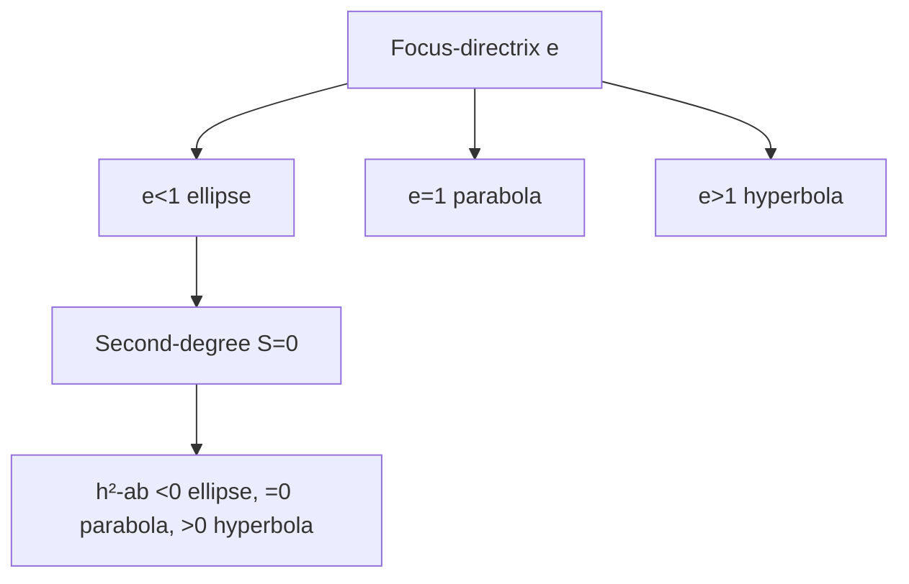
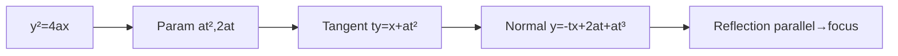
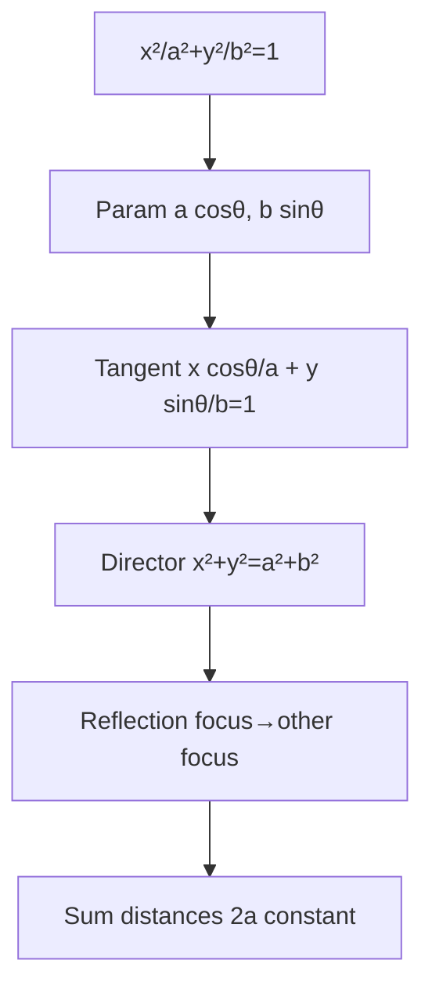
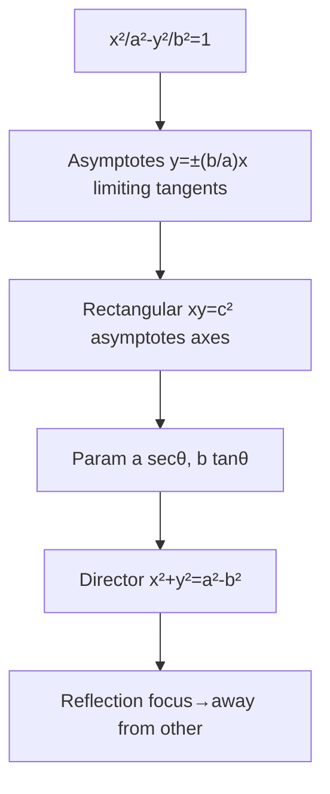
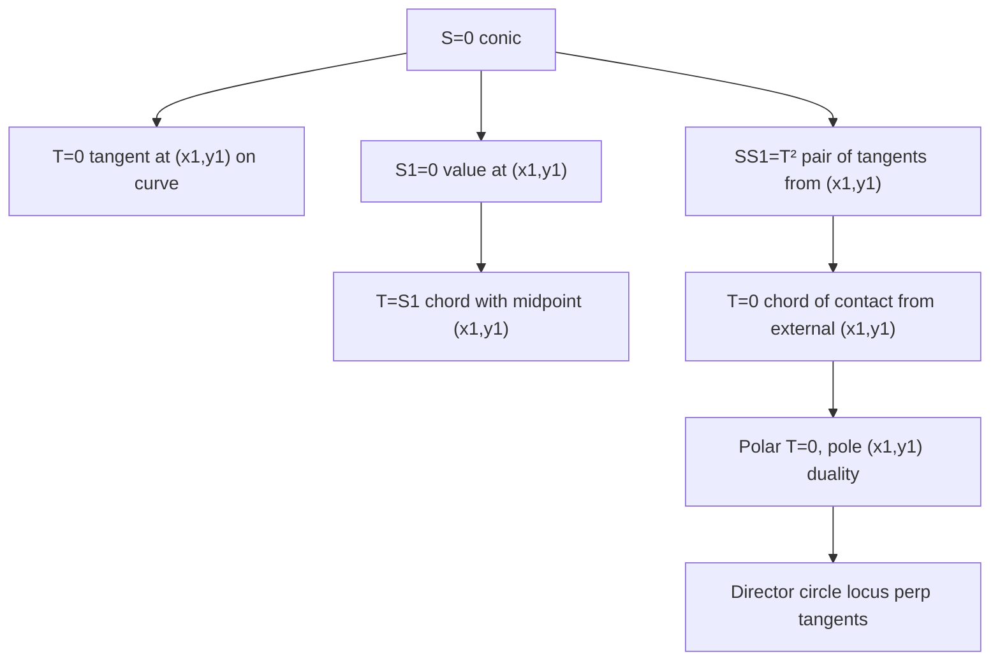
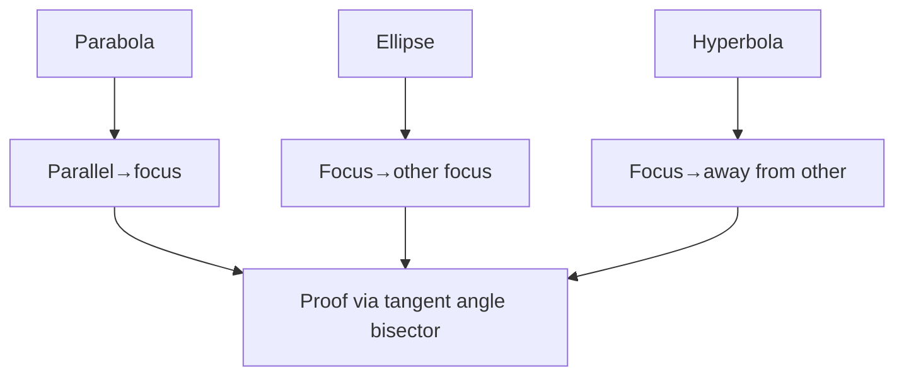

# Conic Sections — Well-Ordered Theory from Basics to Olympiad

> **Philosophy**: One definition $e$ = focus-directrix ratio, everything else (second-degree equation, parametric, $T=0$, reflection) derived.

---

## 1. Conic Family from First Principles

### 1.1 Focus-Directrix Definition

Locus of point $P$ such that $\frac{\text{dist to focus }F}{\text{dist to directrix }l}=e$ constant eccentricity.

- $e<1$ ellipse, $e=1$ parabola, $e>1$ hyperbola.
- $e=0$ circle (focus = center, directrix at infinity).

**Why $e$ determines shape**: Fix $F$ and $l$, vary $e$ → cross-section of cone by plane at different angles.

### 1.2 Second-Degree General Equation

$ax^2+2hxy+by^2+2gx+2fy+c=0$, $S=0$.

Discriminant $h^2-ab$: $<0$ ellipse, $=0$ parabola, $>0$ hyperbola (provided non-degenerate, $\Delta\neq0$).

Rotation removing $xy$ term: rotate axes by $\theta$ where $\tan2\theta=\frac{2h}{a-b}$ → eigenvalues of $\begin{pmatrix}a&h\\h&b\end{pmatrix}$ give $a',b'$.

---

## 2. Parabola — Anatomy and Machinery

### 2.1 Standard $y^2=4ax$

Focus $(a,0)$, directrix $x=-a$, vertex $(0,0)$, axis $y=0$, latus rectum $4a$ (focal chord $\perp$ axis).

**Parametric**: $P(t)=(at^2,2at)$, $t$ is not angle but parameter, slope of tangent? Actually $t$ relates to point.

**Derivation**: Distance to focus $\sqrt{(x-a)^2+y^2}$ = distance to directrix $|x+a|$ → square → $y^2=4ax$.

### 2.2 Chords, Tangents, Normals

- **Chord joining $t_1,t_2$**: $(t_1+t_2)y = 2x + 2at_1t_2$ — the limit $t_1,t_2 \to t$ recovers the tangent $ty = x+at^2$.

- **Tangent at $t$**: $ty = x+at^2$.
- **Normal at $t$**: $y = -tx +2at+at^3$.
- **Chord of contact from $(x_1,y_1)$**: $T=0$ → $yy_1 =2a(x+x_1)$? Wait for parabola $y^2=4ax$, $T$: $yy_1=2a(x+x_1)$.
- **Director circle**: Locus of perpendicular tangents — for parabola, directrix $x=-a$ itself.

### 2.3 Reflection Property

Parabola reflects rays parallel to axis to focus.

**Proof via angle bisector**: Tangent at $P$ makes equal angles with line $PF$ and line through $P$ parallel to axis. Show via $\frac{d}{dx}$ or vector.

**Applications**: Satellite dish, headlight, solar cooker.

---

## 3. Ellipse — Geometry of Squashed Circle

### 3.1 Standard $\frac{x^2}{a^2}+\frac{y^2}{b^2}=1$, $a\ge b$

Foci $(\pm ae,0)$, $b^2=a^2(1-e^2)$, $e=\sqrt{1-b^2/a^2}$, major axis $2a$ along $x$, minor $2b$, latus rectum $2b^2/a$, center $(0,0)$.

**Parametric**: $a\cos\theta,b\sin\theta$, $\theta$ eccentric angle (not polar angle, auxiliary circle).

**Definition sum distances**: $PF_1+PF_2=2a$ constant — Gardener's string.

### 3.2 Tangents, Director, Auxiliary

- **Tangent at $\theta$**: $\frac{x\cos\theta}{a}+\frac{y\sin\theta}{b}=1$.
- **Director circle**: Locus of perpendicular tangents $x^2+y^2=a^2+b^2$ — proof via $m_1m_2=-1$ for $y=mx\pm\sqrt{a^2m^2+b^2}$.
- **Auxiliary circle**: $x^2+y^2=a^2$, foot of perpendicular from focus to tangent lies on auxiliary? Actually for ellipse...
- **Chord with midpoint $(x_1,y_1)$**: $T=S_1$ → $\frac{xx_1}{a^2}+\frac{yy_1}{b^2}=\frac{x_1^2}{a^2}+\frac{y_1^2}{b^2}$.

### 3.3 Reflection Property

Ellipse reflects ray from one focus to other focus.

**Proof**: Tangent bisects external angle between $F_1P$ and $F_2P$, i.e., makes equal angles with lines to foci.

**Applications**: Whispering gallery, lithotripter.

---

## 4. Hyperbola and Its Asymptotes

### 4.1 Standard $\frac{x^2}{a^2}-\frac{y^2}{b^2}=1$

Foci $(\pm ae,0)$, $b^2=a^2(e^2-1)$, $e=\sqrt{1+b^2/a^2}>1$, transverse axis $2a$, conjugate $2b$, latus rectum $2b^2/a$.

Asymptotes $y=\pm\frac{b}{a}x$ — limiting tangents as $P\to\infty$, diagonals of rectangle.

Rectangular hyperbola $xy=c^2$, asymptotes coordinate axes, $e=\sqrt2$.

**Parametric**: $a\sec\theta,b\tan\theta$ or $a\cosh t,b\sinh t$.

### 4.2 Tangents, Director, Conjugate

- **Tangent at $\theta$**: $\frac{x\sec\theta}{a}-\frac{y\tan\theta}{b}=1$.
- **Director**: $x^2+y^2=a^2-b^2$ (real only if $a>b$, i.e., $e<\sqrt2$).
- **Conjugate hyperbola**: $\frac{y^2}{b^2}-\frac{x^2}{a^2}=1$, same asymptotes, roles swapped.

### 4.3 Reflection Property

Hyperbola reflects ray from one focus away from other focus (tangent bisects internal angle? Actually external).

---

## 5. Tangents, Normals, Chords and Polars — Unified Machinery

### 5.1 $T=0$, $S_1$, $T=S_1$, $SS_1=T^2$

For $S=0$ conic:

- **Tangent at $(x_1,y_1)$ on curve**: $T=0$ where $T$ is obtained by replacing $x^2\to xx_1$, $y^2\to yy_1$, $xy\to\frac{xy_1+x_1y}{2}$, $x\to\frac{x+x_1}{2}$, $y\to\frac{y+y_1}{2}$.
- **Chord with midpoint $(x_1,y_1)$**: $T=S_1$ where $S_1=S(x_1,y_1)$.
- **Pair of tangents from $(x_1,y_1)$**: $SS_1=T^2$ — homogeneous second-degree pair of lines.
- **Chord of contact from $(x_1,y_1)$**: $T=0$ (same as tangent formula but $(x_1,y_1)$ outside).
- **Polar of $(x_1,y_1)$**: $T=0$ locus of chord of contact as point moves? Actually polar is $T=0$, pole is $(x_1,y_1)$.
- **Director circle**: Locus of point from which two perpendicular tangents can be drawn.

**JEE Adv**: $y=mx+c$ tangent to $y^2=4ax$ iff $c=a/m$, to $\frac{x^2}{a^2}+\frac{y^2}{b^2}=1$ iff $c^2=a^2m^2+b^2$, to $\frac{x^2}{a^2}-\frac{y^2}{b^2}=1$ iff $c^2=a^2m^2-b^2$.

### 5.2 Pole-Polar Duality

If $P$ lies on polar of $Q$, then $Q$ lies on polar of $P$ — duality.

Harmonic bundles: $(A,B;C,D)=-1$ etc.

---

## 6. Olympiad Frontier — Reflection, Confocal, Synthesis

### 6.1 Reflection Proofs via Angle Bisector

- **Parabola**: Tangent makes equal angles with $PF$ and line parallel to axis → prove via $y^2=4ax$, tangent $ty=x+at^2$, vector.
- **Ellipse**: Tangent makes equal angles with $F_1P$, $F_2P$ → sum distances minimal property.
- **Hyperbola**: Tangent bisects angle between $F_1P$ and $F_2P$ external.

### 6.2 Confocal Family

Conics with same foci: $\frac{x^2}{a^2-\lambda}+\frac{y^2}{b^2-\lambda}=1$ (confocal ellipses/hyperbolas).

Property: Confocal ellipse and hyperbola intersect orthogonally — elliptic coordinates orthogonal system.

**Elliptic coordinates**: $(\lambda,\mu)$ where $\lambda$ = confocal ellipse parameter, $\mu$ = hyperbola.

### 6.3 Second-Degree Homogeneous & Classification

$ax^2+2hxy+by^2=0$ pair of lines through origin, $h^2-ab$ determines real/coincident/imaginary.

General $S=0$ classification via eigenvalues of $\begin{pmatrix}a&h&g\\h&b&f\\g&f&c\end{pmatrix}$ and top-left $2×2$.

Rotation removing $xy$: $\tan2\theta=2h/(a-b)$.

### 6.4 Synthesis

- $S=0$ as locus: e.g., $S_1+\lambda S_2=0$ family through intersection.
- Coaxal system, radical axis.

---

## Paper — 38 Questions A–H + Stretch

Attempt after Chapter 6, 4–5 hours, full solutions in `olympiad-paper-solutions.md`.

Covers focus-directrix, parametric, $T=0$, $S_1$, pair of tangents, director, asymptotes, reflection, confocal orthogonal.

---

*Well-ordered: $e$ definition → second-degree $h^2-ab$ → parabola $y^2=4ax$ $at^2,2at$ $ty=x+at^2$ → ellipse $x^2/a^2+y^2/b^2=1$ $a\cos\theta,b\sin\theta$ → hyperbola $x^2/a^2-y^2/b^2=1$ asymptotes → unified $T=0,S_1,T=S_1,SS_1=T^2$ → pole-polar → reflection proofs → confocal orthogonal → classification.*
