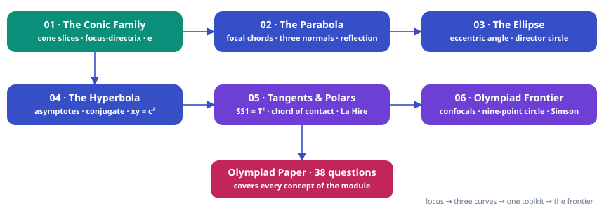

> [!info] Navigation
> 📖 [[Home|Vault home]] · 🧪 [[Conic-Sections — Paper|Olympiad Paper]] · ✅ [[Conic-Sections — Solutions|Solutions]] · 📘 [[Conic-Sections — Theory|Theory Reference]]

# Conic-Sections — Complete Course Notes


*JEE Advanced → Olympiad Ladder*

# Conic Sections

From slicing a double cone to confocal families and the nine-point circle — one locus idea, six layers deep. Every tangent you will ever draw, every focal chord you will ever measure, derived from the focus-directrix definition rather than memorised. The parabola, the ellipse and the hyperbola are one object wearing three eccentricities.

`6 chapters · basics → JEE Advanced → Olympiad` `15 worked examples (S1–S15)` `48 practice questions (P1–P48, verified answers)` `38-question Olympiad paper + full solutions`


### ★ How to use these notes

**Read in order — do not skip the "why" boxes.** Each chapter is built in layers: *concept → first-principles reasoning → JEE theory → Olympiad extension*.

- **Colored boxes** — First Principles = the actual reasoning; Key Idea = the takeaway technique; Common Trap = the classic mistake; Olympiad Extension = the frontier version.
- **Questions are placed in context** — a solved example right after the technique that solves it, plus practice sets with difficulty tags: [JEE Main] [JEE Adv] [Olympiad]
- **The Olympiad paper at the end** (38 questions) is the exam: attempt it after Chapter 6, without solutions. The [[Conic-Sections — Solutions|solution key]] is separate and complete.


### ▣ The roadmap

The logical skeleton of the module. First principles build the three standard curves; each curve gets its own machinery chapter; the toolkit chapter unifies tangents and polars across all three; the frontier chapter harvests the Olympiad theorems.

**Diagram**




### 1–6 Chapters

[[01-the-conic-family-from-first-principles| Chapter 1 · Where conics come from The Conic Family from First Principles Slicing the double cone, Dandelin's spheres, the focus-directrix locus $|PF| = e\,|P\ell|$, and the derivation of all three standard forms from scratch. Eccentricity as the single classification number. (P1–P8) ]] [[02-the-parabola-anatomy-and-machinery| Chapter 2 · One focus, one directrix The Parabola — Anatomy and Machinery The parametric point $(at^2, 2at)$, focal chords and the semi-latus-rectum harmonic property, the normal cubic with three feet, the constant subnormal, reflection. (P9–P16) ]] [[03-the-ellipse-geometry-of-the-squashed-circle| Chapter 3 · The squashed circle The Ellipse — Geometry of the Squashed Circle Sum-of-distances anatomy, the auxiliary circle and eccentric angle, tangent and normal in all forms, the director circle $x^2+y^2=a^2+b^2$, the whispering-gallery reflection. (P17–P24) ]] [[04-the-hyperbola-and-its-asymptotes| Chapter 4 · The stretched curve The Hyperbola and Its Asymptotes Difference-of-distances anatomy, the conjugate hyperbola and $1/e^2 + 1/e'^2 = 1$, asymptotes and the eccentricity-angle identity, the rotated rectangular hyperbola $xy = c^2$. (P25–P32) ]] [[05-tangents-normals-chords-and-polars| Chapter 5 · One toolkit, three curves Tangents, Normals, Chords and Polars The complete tangent dictionary, pair of tangents $SS_1 = T^2$, chord of contact $T=0$, midpoint chords $T=S_1$, poles and polars with La Hire's theorem. (P33–P40) ]] [[06-the-olympiad-frontier-reflection-confocals-and-triangles| Chapter 6 · The canopy The Olympiad Frontier — Reflection, Confocals and Triangles All three reflection properties proved, confocal orthogonality, the rectangular hyperbola through a triangle and its nine-point circle, Simson/Steiner lines and Lambert's theorem, Pascal and Brianchon. (P41–P48) ]]


### ∑ Exam paper

[[Conic-Sections — Paper| The Capstone Olympiad-Level Paper — 38 Questions Eight sections (A–H) ramping JEE Main → Advanced → Olympiad: eccentricity vaults, focal-chord machinery, polars, normals, and the reflection/confocal frontier. ]] [[Conic-Sections — Solutions| Attempt first, then open Full Solutions Key Complete step-by-step solutions for all 38 questions — method name first, then the derivation, then a check. Every numeric answer verified by pure-Python computation. ]] 


### ! One-page mindset

> [!abstract] First Principles — the only rule of the game
>
> **A conic is a locus, never a picture to recall.** The parabola is "distance to a point equals distance to a line"; the ellipse is "a sum of two distances held constant"; the hyperbola is "a difference held constant" — and the focus-directrix form $|PF| = e\,|P\ell|$ generates all three with one number $e$. Every tangent, normal, chord and polar property in this module is a two-line consequence of substituting a line into that locus. When stuck, return to the definition: name the distances, write the equation, and the formula you were about to look up will fall out.

> [!warning] Common Trap — the mistakes this module punishes
>
> Five recurring own goals: (i) in the ellipse $b^2 = a^2 - c^2$ but in the hyperbola $b^2 = c^2 - a^2$ — the minus sign is the classification; (ii) the latus rectum is $2b^2/a$, the *semi*-latus rectum is $b^2/a$ — the harmonic-mean property uses the semi one; (iii) the tangent slope form $y = mx \pm \sqrt{a^2m^2 - b^2}$ for the hyperbola needs $|m| \gt b/a$, or the square root is imaginary; (iv) $S_1$ in $T = S_1$ carries its own $-1$ — dropping it moves the whole line; (v) "distance between directrices" is $2a/e$, not $a/e$. Each trap costs full marks on its question; none costs more than one habit to fix.


## Roadmap

- **Chapter 1**: Ch 1 · The Conic Family from First Principles — 5 sections · 10 questions
- **Chapter 2**: Ch 2 · The Parabola — Anatomy and Machinery — 5 sections · 11 questions
- **Chapter 3**: Ch 3 · The Ellipse — Geometry of the Squashed Circle — 7 sections · 11 questions
- **Chapter 4**: Ch 4 · The Hyperbola and Its Asymptotes — 6 sections · 11 questions
- **Chapter 5**: Ch 5 · Tangents, Normals, Chords and Polars — 6 sections · 10 questions
- **Chapter 6**: Ch 6 · The Olympiad Frontier — Reflection, Confocals and Triangles — 6 sections · 10 questions
- **Olympiad Paper**: Olympiad Paper · 38 questions — 
- **Solutions**: Olympiad Paper · Solutions & marking guide


## Chapters

```dataview
TABLE chapter AS "Ch", level AS "Level"
FROM "notes/Conic-Sections"
WHERE chapter
SORT chapter ASC
```
