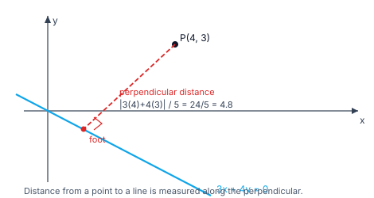
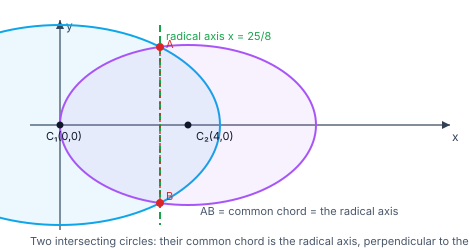

> [!info] Navigation
> 📖 [[Home|Vault home]] · 📝 [[Coordinate-Geometry-Lines-and-Circles — Paper|Olympiad Paper]] · ✅ [[Coordinate-Geometry-Lines-and-Circles — Solutions|Solutions]]

# Coordinate Geometry — Lines & Circles

Descartes' idea: turn geometry into algebra. A point becomes a pair of numbers, a
curve becomes an equation, and a geometric proof becomes a computation. The
payoff is enormous — tangents, intersections and loci that are painful by
synthetic means become routine substitutions.

This module covers the two simplest and most useful families: **lines** and
**circles**, together with their interaction (tangency, chords, the radical axis).
Conics proper live in [[Conic-Sections|the Conic Sections module]]; everything
here is the foundation that module assumes.

`6 chapters` `worked examples (S) + practice (P)` `SVG + Mermaid diagrams` `34-question Olympiad paper + full solutions`

### ★ How to use these notes

**Read in order.** Chapter 1 sets up coordinates and the basic formulas; Chapter 2
is the line; Chapter 3 is pairs of lines (the bridge to conics); Chapters 4–5 are
the circle and its interaction with lines; Chapter 6 is the frontier (coaxal
systems, inversion, the radical centre).

- **Callouts** — `[!abstract]` First Principles = the derivation; `[!tip]` Key
  Idea = the takeaway; `[!warning]` Common Trap = the classic mistake;
  `[!example]` Olympiad Extension = the frontier version.
- **Numeric habit** — check every formula on a small case you can draw (a
  $3$-$4$-$5$ triangle, a unit circle). Where a claim is numeric, it has been
  verified in pure Python.

### ▣ The roadmap

| Ch | Title | Level |
|---|---|---|
| 1 | Cartesian coordinates, distance & locus | foundations |
| 2 | The straight line | machinery |
| 3 | Pairs of straight lines | machinery |
| 4 | The circle | core |
| 5 | Circle–line interaction: tangents, chords, radical axis | applications |
| 6 | Coaxal systems, inversion & the Olympiad frontier | synthesis |

**Fig 1.1 — distance from a point to a line.** The distance is the length of the
*perpendicular* from the point to the line — never the distance along some other
direction.

**Fig 1.2 — the radical axis.** Two intersecting circles meet at $A$ and $B$;
their common chord $AB$ is the radical axis, perpendicular to the line of
centres. Points on it have **equal power** with respect to both circles.

---

# Chapter 1 — Cartesian Coordinates, Distance & Locus

*Foundations · from points to equations*

## 1.1 Distance, midpoint, section

> [!abstract] First Principles — the distance formula
> The axes are perpendicular, so the displacement between $A(x_1,y_1)$ and
> $B(x_2,y_2)$ has legs $\lvert x_2-x_1\rvert$ and $\lvert y_2-y_1\rvert$.
> Pythagoras gives
> $$AB=\sqrt{(x_2-x_1)^2+(y_2-y_1)^2}.$$

#### **S1**[JEE Main][solved][distance]Find the distance between $(1,2)$ and $(4,6)$.

$\sqrt{(4-1)^2+(6-2)^2}=\sqrt{9+16}=\sqrt{25}=5$.

Answer + Reasoning

**Method: distance formula.** A $3$-$4$-$5$ right triangle.

**Answer:** $5$.

#### **P1**[JEE Main][practice][section]Find the point dividing the join of $(1,2)$ and $(4,6)$ in the ratio $2:3$.

Answer + Reasoning

**Method: section formula** $\big(\frac{mx_2+nx_1}{m+n},\frac{my_2+ny_1}{m+n}\big)$.

**Answer:** $\big(\frac{11}{5},\frac{18}{5}\big)=(2.2,\,3.6)$.

## 1.2 Area, collinearity and the centroid

> [!abstract] First Principles — area from a determinant
> The area of the triangle on $A(x_1,y_1)$, $B(x_2,y_2)$, $C(x_3,y_3)$ is
> $$\frac12\Big\lvert x_1(y_2-y_3)+x_2(y_3-y_1)+x_3(y_1-y_2)\Big\rvert.$$
> Three points are **collinear** exactly when this area is $0$ — the determinant
> form of "the three points lie on one line".

#### **S2**[JEE Main][solved][area]Find the area of the triangle with vertices $(0,0)$, $(3,0)$, $(0,4)$.

$\frac12\lvert0(0-4)+3(4-0)+0(0-0)\rvert=\frac12\cdot12=6$.

Answer + Reasoning

**Method: determinant formula.** (Also: base $3$, height $4$, area $\frac12\cdot3\cdot4=6$ ✓.)

**Answer:** $6$.

#### **P2**[JEE Main][practice][collinear]Are $(1,1)$, $(2,2)$, $(3,3)$ collinear?

Answer + Reasoning

**Method: area $=0$.** All lie on $y=x$.

**Answer:** yes, collinear.

## 1.3 Locus — the heart of coordinate geometry

> [!tip] Key Idea — a locus is an equation in disguise
> To find the locus of a moving point: (1) let the point be $(x,y)$; (2) write the
> geometric condition in coordinates; (3) simplify. The result is the equation of
> the curve traced.

#### **S3**[JEE Main][solved][locus]Find the locus of points equidistant from $(0,0)$ and $(4,0)$.

$\sqrt{x^2+y^2}=\sqrt{(x-4)^2+y^2}$. Squaring: $x^2+y^2=x^2-8x+16+y^2$, so $8x=16$ and $x=2$ — the perpendicular bisector.

Answer + Reasoning

**Method: translate the condition, simplify.** The $x^2+y^2$ terms cancel, leaving a line.

**Answer:** $x=2$.

#### **P3**[JEE Adv][practice][locus]Find the locus of points whose distance from the origin is twice their distance from $(3,0)$.

Answer + Reasoning

**Method: $x^2+y^2=4\big((x-3)^2+y^2\big)$.** Expanding: $3x^2-24x+36+3y^2=0$, so $(x-4)^2+y^2=4$.

**Answer:** the circle $(x-4)^2+y^2=4$ (centre $(4,0)$, radius $2$).

---

# Chapter 2 — The Straight Line

*Machinery · slope, forms, and distances*

## 2.1 Slope and the forms of a line

> [!abstract] First Principles — slope as a rate
> The **slope** of the line through $(x_1,y_1)$ and $(x_2,y_2)$ is
> $m=\dfrac{y_2-y_1}{x_2-x_1}$ — the rise over the run, i.e. how fast $y$ changes
> per unit of $x$. A vertical line has no slope (the run is $0$).

| Form | Equation |
|---|---|
| Slope–intercept | $y=mx+c$ |
| Point–slope | $y-y_1=m(x-x_1)$ |
| Two-point | $y-y_1=\dfrac{y_2-y_1}{x_2-x_1}(x-x_1)$ |
| Intercept | $\dfrac xa+\dfrac yb=1$ |
| Normal | $x\cos\alpha+y\sin\alpha=p$ |
| General | $ax+by+c=0$, slope $-\dfrac ab$ |

#### **S4**[JEE Main][solved][line]Find the equation of the line through $(2,3)$ with slope $4$.

$y-3=4(x-2)$, i.e. $4x-y-5=0$.

Answer + Reasoning

**Method: point–slope form.** Check: $4(2)-3-5=0$ ✓.

**Answer:** $4x-y-5=0$.

## 2.2 Angle between two lines

Two lines of slopes $m_1,m_2$ meet at angle $\theta$ with
$$\tan\theta=\left\lvert\frac{m_1-m_2}{1+m_1m_2}\right\rvert.$$
They are **parallel** iff $m_1=m_2$ and **perpendicular** iff $m_1m_2=-1$.

#### **S5**[JEE Main][solved][angle]Find the angle between $y=2x+1$ and $y=-\dfrac{x}{3}+2$.

$\tan\theta=\left\lvert\frac{2-(-1/3)}{1+2(-1/3)}\right\rvert=\left\lvert\frac{7/3}{1/3}\right\rvert=7$, so $\theta=\tan^{-1}7\approx81.87^\circ$.

Answer + Reasoning

**Method: the tangent formula.** $m_1=2$, $m_2=-\frac13$; note $m_1m_2=-\frac23\ne-1$, so they are not perpendicular.

**Answer:** $\tan^{-1}7\approx81.87^\circ$.

#### **P4**[JEE Main][practice][parallel]Show that $3x+4y+5=0$ and $6x+8y-7=0$ are parallel.

Answer + Reasoning

**Method: compare slopes.** Both have slope $-\frac34$ (equivalently the coefficients are proportional: $6/3=8/4\ne-7/5$).

**Answer:** parallel (distinct lines).

## 2.3 Distance from a point to a line

> [!abstract] First Principles — the perpendicular distance
> The distance from $(x_0,y_0)$ to $ax+by+c=0$ is
> $$d=\frac{\lvert ax_0+by_0+c\rvert}{\sqrt{a^2+b^2}}.$$
> **Idea:** the numerator measures the signed value of the line's expression at
> the point; dividing by $\sqrt{a^2+b^2}$ converts that into length units.

#### **S6**[JEE Main][solved][distance]Find the distance from $(1,2)$ to $3x+4y-5=0$.

$\dfrac{\lvert3(1)+4(2)-5\rvert}{\sqrt{9+16}}=\dfrac{6}{5}=1.2$.

Answer + Reasoning

**Method: the perpendicular-distance formula.**

**Answer:** $\dfrac65=1.2$.

#### **P5**[JEE Main][practice][distance]Find the distance from the origin to $3x+4y+10=0$.

Answer + Reasoning

**Method: plug in $(0,0)$.** $\frac{10}{5}=2$.

**Answer:** $2$.

#### **P6**[JEE Adv][practice][foot]Find the foot of the perpendicular from $(1,2)$ to $x+y=0$.

Answer + Reasoning

**Method: foot $=P-\frac{ax_0+by_0+c}{a^2+b^2}(a,b)$.** With $(a,b,c)=(1,1,0)$ and value $3$: foot $=(1,2)-\frac32(1,1)=(-\frac12,\frac12)$.

**Answer:** $\left(-\dfrac12,\dfrac12\right)$.

---

# Chapter 3 — Pairs of Straight Lines

*Machinery · the bridge to conics*

## 3.1 The homogeneous pair

> [!abstract] First Principles — a pair through the origin
> $ax^2+2hxy+by^2=0$ is a **homogeneous** second-degree equation. Writing it as
> a quadratic in $\frac yx$ and setting $m=\frac yx$ gives
> $bm^2+2hm+a=0$, whose two roots $m_1,m_2$ are the slopes of the two lines
> $y=m_1x$ and $y=m_2x$ through the origin.

#### **S7**[JEE Main][solved][pair]Find the two lines represented by $2x^2+3xy-2y^2=0$.

Factor: $2x^2+3xy-2y^2=(2x-y)(x+2y)$, so the lines are $y=2x$ and $y=-\frac x2$. Their slopes multiply to $-1$, so they are **perpendicular**.

Answer + Reasoning

**Method: factor the homogeneous quadratic.** (Equivalently $b m^2+2hm+a=0$ with $a=2,h=\frac32,b=-2$: $-2m^2+3m+2=0\Rightarrow m=2,-\frac12$.)

**Answer:** $y=2x$ and $x+2y=0$; perpendicular.

#### **P7**[JEE Main][practice][pair]Find the angle between the lines $x^2-2y^2=0$.

Answer + Reasoning

**Method: $y=\pm\frac{x}{\sqrt2}$, slopes $\pm\frac1{\sqrt2}$.** $\tan\theta=\left\lvert\frac{2/\sqrt2}{1-1/2}\right\rvert=2\sqrt2$.

**Answer:** $\theta=\tan^{-1}(2\sqrt2)\approx70.53^\circ$.

> [!tip] Key Idea — the perpendicularity test
> $ax^2+2hxy+by^2=0$ represents **perpendicular** lines iff $a+b=0$: then the
> roots $m_1,m_2$ satisfy $m_1m_2=\frac ab=-1$. This single test replaces
> factoring.

## 3.2 Angle bisectors

The bisectors of the angles between $L_1=a_1x+b_1y+c_1=0$ and
$L_2=a_2x+b_2y+c_2=0$ are
$$\frac{L_1}{\sqrt{a_1^2+b_1^2}}=\pm\frac{L_2}{\sqrt{a_2^2+b_2^2}}.$$
The normalising denominators make the two expressions *comparable*, so equal
values mean equal distances.

#### **S8**[JEE Adv][solved][bisector]Find the bisectors of $3x+4y-5=0$ and $4x-3y+7=0$.

$\sqrt{3^2+4^2}=\sqrt{4^2+3^2}=5$, so the bisectors are
$3x+4y-5=\pm(4x-3y+7)$, i.e. $-x+7y-12=0$ and $7x+y+2=0$.

Answer + Reasoning

**Method: the normalised bisector formula.** Check equidistance: on $x-7y+12=0$, the point $(-12,0)$ is at distance $\frac{41}{5}=8.2$ from both lines ✓; on $7x+y+2=0$, the point $(0,-2)$ is at distance $\frac{13}{5}=2.6$ from both ✓.

**Answer:** $x-7y+12=0$ and $7x+y+2=0$.

> [!warning] Common Trap — forgetting to normalise
> Writing $L_1=L_2$ without dividing by $\sqrt{a^2+b^2}$ gives a line that is
> *not* an angle bisector unless the coefficients happen to have equal magnitude.

---

# Chapter 4 — The Circle

*Core · the simplest conic*

## 4.1 Equations of a circle

> [!abstract] First Principles — the definition as an equation
> A circle is the locus of points at a fixed distance $r$ from a centre
> $(h,k)$:
> $$(x-h)^2+(y-k)^2=r^2.$$
> Expanding gives the **general form**
> $x^2+y^2+2gx+2fy+c=0$ with centre $(-g,-f)$ and radius
> $\sqrt{g^2+f^2-c}$ — real exactly when $g^2+f^2\ge c$.

#### **S9**[JEE Main][solved][circle]Find the centre and radius of $x^2+y^2-2x-4y-4=0$.

$2g=-2\Rightarrow g=-1$, $2f=-4\Rightarrow f=-2$, $c=-4$. Centre $(1,2)$, radius $\sqrt{1+4+4}=3$.

Answer + Reasoning

**Method: read off $g,f,c$ from the general form.** (Equivalently complete the square: $(x-1)^2+(y-2)^2=9$.)

**Answer:** centre $(1,2)$, radius $3$.

#### **S10**[JEE Main][solved][circle]Find the circle through $(0,0)$, $(1,0)$, $(0,1)$.

Substituting into $x^2+y^2+2gx+2fy+c=0$: from the origin $c=0$; from $(1,0)$, $1+2g=0\Rightarrow g=-\frac12$; from $(0,1)$, $1+2f=0\Rightarrow f=-\frac12$. So $x^2+y^2-x-y=0$.

Answer + Reasoning

**Method: three conditions, three unknowns.** Centre $(\frac12,\frac12)$, radius $\frac1{\sqrt2}$.

**Answer:** $x^2+y^2-x-y=0$.

#### **P8**[JEE Main][practice][circle]Write the circle with centre $(2,-3)$ and radius $5$.

Answer + Reasoning

**Method: $(x-h)^2+(y-k)^2=r^2$.** $(x-2)^2+(y+3)^2=25$.

**Answer:** $x^2+y^2-4x+6y-12=0$.

> [!warning] Common Trap — $g^2+f^2<c$ means no real circle
> $x^2+y^2+2x+2y+5=0$ has $g^2+f^2-c=1+1-5=-3<0$: the equation has no real
> points. Always check the radius is real before calling it a circle.

---

# Chapter 5 — Circle–Line Interaction

*Applications · tangency, chords and the radical axis*

## 5.1 Tangent and normal

> [!abstract] First Principles — the tangent at a point on the circle
> For $x^2+y^2+2gx+2fy+c=0$ the tangent at $(x_1,y_1)$ **on** the circle is
> $$xx_1+yy_1+g(x+x_1)+f(y+y_1)+c=0,$$
> obtained from the circle's equation by the replacement $x^2\to xx_1$,
> $y^2\to yy_1$, $x\to\frac{x+x_1}{2}$, $y\to\frac{y+y_1}{2}$ ("$T=0$"). The
> normal is the line through $(x_1,y_1)$ and the centre.

#### **S11**[JEE Main][solved][tangent]Find the tangent to $x^2+y^2=25$ at $(3,4)$.

$T=0$ gives $3x+4y=25$.

Answer + Reasoning

**Method: the $T=0$ replacement.** Check the point is on the circle: $9+16=25$ ✓; and the radius to $(3,4)$ has slope $\frac43$ while the tangent has slope $-\frac34$, product $-1$ ✓.

**Answer:** $3x+4y=25$.

#### **P9**[JEE Main][practice][normal]Find the normal to $x^2+y^2=25$ at $(3,4)$.

Answer + Reasoning

**Method: the normal passes through the centre $(0,0)$ and $(3,4)$.** Slope $\frac43$: $4x-3y=0$.

**Answer:** $4x-3y=0$.

## 5.2 Tangent length, chord length, power of a point

> [!abstract] First Principles — power of a point
> The **power** of $P(x_0,y_0)$ with respect to
> $x^2+y^2+2gx+2fy+c=0$ is
> $$x_0^2+y_0^2+2gx_0+2fy_0+c.$$
> It is **positive** when $P$ is outside (and then its square root is the
> **tangent length**), **zero** on the circle, **negative** inside. For a line at
> distance $d$ from the centre of a circle of radius $r$, the chord length is
> $2\sqrt{r^2-d^2}$.

#### **S12**[JEE Main][solved][power]Find the length of the tangent from $(5,5)$ to $x^2+y^2=9$.

Power $=25+25-9=41$, so the tangent length is $\sqrt{41}$.

Answer + Reasoning

**Method: tangent length $=\sqrt{\text{power}}$.** (Check: the distance from $(5,5)$ to the centre is $\sqrt{50}$ and $r=3$; $\sqrt{50-9}=\sqrt{41}$ ✓.)

**Answer:** $\sqrt{41}\approx6.4031$.

#### **S13**[JEE Adv][solved][chord]Find the chord cut off by $x+y=5$ on $x^2+y^2=25$.

Distance from the centre $(0,0)$ to the line is $\frac5{\sqrt2}$, so the chord length is $2\sqrt{25-\frac{25}{2}}=2\sqrt{12.5}=5\sqrt2$.

Answer + Reasoning

**Method: chord length $=2\sqrt{r^2-d^2}$.** $d=\frac{5}{\sqrt2}\approx3.5355<r=5$, so the line really does cut the circle.

**Answer:** $5\sqrt2\approx7.0711$.

#### **P10**[JEE Adv][practice][tangent length]Find the tangent length from $(5,0)$ to $x^2+y^2=9$ and the points of contact.

Answer + Reasoning

**Method: chord of contact $T=0$ is $5x=9$, so $x=\frac95$; substitute into the circle.** $y^2=9-\frac{81}{25}=\frac{144}{25}$, so $y=\pm\frac{12}{5}$.

**Answer:** length $4$; contact points $\big(\frac95,\pm\frac{12}{5}\big)$.

## 5.3 The radical axis

> [!abstract] First Principles — subtracting two circles
> Subtracting the equations of two circles **cancels** $x^2+y^2$, leaving a
> straight line — the **radical axis** — consisting of points with equal power
> with respect to both circles. If the circles intersect, the radical axis *is*
> their common chord, and it is perpendicular to the line of centres.

#### **S14**[JEE Adv][solved][radical]Find the radical axis of $x^2+y^2=9$ and $x^2+y^2-4x+6y-3=0$.

Subtract: $(x^2+y^2-9)-(x^2+y^2-4x+6y-3)=0\Rightarrow4x-6y-6=0$, i.e. $2x-3y-3=0$.

Answer + Reasoning

**Method: subtract the two equations.** Check a point: $(0,-1)$ lies on $2x-3y-3=0$; its power wrt circle 1 is $0+1-9=-8$ and wrt circle 2 is $0+1+0-6-3=-8$ ✓ — equal.

**Answer:** $2x-3y-3=0$.

#### **P11**[JEE Adv][practice][radical]Find the radical axis of $x^2+y^2=4$ and $(x-3)^2+y^2=4$.

Answer + Reasoning

**Method: expand the second to $x^2+y^2-6x+5=0$ and subtract.** $(x^2+y^2-4)-(x^2+y^2-6x+5)=0\Rightarrow6x-9=0$.

**Answer:** $x=\dfrac32$.

---

# Chapter 6 — Coaxal Systems, Inversion & the Olympiad Frontier

*Synthesis · families of circles and the transformations*

## 6.1 Coaxal systems

> [!example] Olympiad Extension — the coaxal family
> The family
> $$S_1+\lambda S_2=0$$
> (where $S_1,S_2$ are two circles) is a **coaxal system**: all its members share
> the same radical axis. When $S_1$ and $S_2$ do not meet, the system has no real
> common points but has two **limiting points** — the point-circles of the
> family, which are the centres of the two circles orthogonal to every member.

#### **S15**[Olympiad][solved][coaxal]Find the coaxal system through $(1,1)$ and $(-1,-1)$.

Any circle through both has equation $x^2+y^2-2+\lambda(x-y)=0$: it passes through both points for every $\lambda$, since $x^2+y^2-2=0$ and $x-y=0$ at each of them. The common radical axis is $x-y=0$.

Answer + Reasoning

**Method: $S_1+\lambda S_2$ with $S_1=x^2+y^2-2$ (through both points) and $S_2=x-y$ (zero at both points).** Check: at $(1,1)$, $1+1-2+\lambda(0)=0$ ✓; at $(-1,-1)$, $1+1-2+0=0$ ✓.

**Answer:** $x^2+y^2-2+\lambda(x-y)=0$ with radical axis $x-y=0$.

## 6.2 Inversion

> [!example] Olympiad Extension — inversion in a circle
> Inversion in the unit circle sends $P$ to $P'$ on the same ray with
> $OP\cdot OP'=1$: in coordinates $P'=\dfrac{P}{\lvert P\rvert^2}$. Lines not
> through the origin become circles through the origin and vice versa, and
> **angles are preserved** (inversion is conformal). It turns a hard tangent
> problem into an easy collinearity problem.

#### **P12**[Olympiad][practice][inversion]Invert $(3,4)$ in the unit circle.

Answer + Reasoning

**Method: $P'=P/\lvert P\rvert^2$.** $\lvert P\rvert^2=25$, so $P'=(\frac3{25},\frac4{25})$.

**Answer:** $\left(\dfrac3{25},\dfrac4{25}\right)=(0.12,0.16)$.

#### **P13**[Olympiad][practice][inversion]Show that inversion preserves the unit circle and maps $x=2$ to a circle through the origin.

Answer + Reasoning

**Method: substitute $x=X/(X^2+Y^2)$, $y=Y/(X^2+Y^2)$ into $x=2$.** $X=2(X^2+Y^2)$, i.e. $X^2+Y^2-\frac X2=0$ — a circle through the origin with centre $(\frac14,0)$ and radius $\frac14$.

**Answer:** $X^2+Y^2=\dfrac{X}{2}$, a circle through the origin.

## 6.3 The circle of Apollonius and distance problems

> [!example] Olympiad Extension — the circle of Apollonius
> The locus of points $P$ with $\dfrac{PA}{PB}=k$ ($k\ne1$) is always a
> **circle**. For $A=(0,0)$, $B=(4,0)$, $k=2$: $x^2+y^2=4\big((x-4)^2+y^2\big)$,
> which simplifies to $(x-\frac{16}{3})^2+y^2=\frac{64}{9}$ — centre
> $(\frac{16}{3},0)$, radius $\frac83$.

#### **S16**[Olympiad][solved][Apollonius]Find the shortest distance from $(1,2)$ to the circle $x^2+y^2=9$.

The distance from $(1,2)$ to the centre is $\sqrt5\approx2.236<3$, so the point is **inside**; the shortest distance to the circle is $3-\sqrt5$.

Answer + Reasoning

**Method: shortest distance $=\big\lvert\sqrt{x_0^2+y_0^2}-r\big\rvert$ along the line to the centre.** $\sqrt5<3$ means inside, so the point exits through the nearer side.

**Answer:** $3-\sqrt5\approx0.7639$.

#### **P14**[Olympiad][practice][position]Do the circles $x^2+y^2=4$ and $(x-3)^2+y^2=4$ intersect?

Answer + Reasoning

**Method: compare the centre distance $d=3$ with $r_1+r_2=8$ and $\lvert r_1-r_2\rvert=0$.** Since $0<3<8$ they intersect in two points.

**Answer:** yes, two intersection points.

#### **P15**[Olympiad][practice][radical centre]Find the radical centre of $x^2+y^2=1$, $x^2+y^2=4$ and $(x-1)^2+(y-1)^2=1$.

Answer + Reasoning

**Method: take two radical axes and intersect them.** From circles 1 and 2: $3=0$ — parallel radical axes (concentric circles have no finite radical axis), so the radical centre does not exist. Replace circle 2 with $x^2+y^2-4x=0$: axis of 1 and 2 is $4x=1$; axis of 1 and 3 is $-2x-2y+1=0$. Solving $x=\frac14$ and $-\frac12-2y+1=0\Rightarrow y=\frac14$: radical centre $(\frac14,\frac14)$.

**Answer:** $(\frac14,\frac14)$ (for the non-concentric choice).

---

*Synthesis · the great circle theorems of the triangle*

## 6.4 The nine-point circle

> [!abstract] First Principles — nine points, one circle
> Take a triangle $ABC$ with circumcentre $O$ and orthocentre $H$. The
> following **nine** points are concyclic:
> the three side midpoints, the three feet of the altitudes, and the three
> midpoints of $AH$, $BH$, $CH$. The circle through them is the **nine-point
> circle**; its centre is the midpoint of $OH$ and its radius is $\frac R2$, half
> the circumradius.

#### **S17**[Olympiad][solved][nine-point]For $A(0,0)$, $B(4,0)$, $C(1,3)$, find the centre and radius of the nine-point circle, and verify that all nine points lie on it.

The circumcentre is $O=(2,1)$ with $R=\sqrt5$. The orthocentre is $H=A+B+C-2O=(1,1)$, so the nine-point centre is $N=\frac{O+H}{2}=\big(\frac32,1\big)$ and the radius is $\frac{\sqrt5}{2}$.

Answer + Reasoning

**Method: $N=\frac{O+H}{2}$, radius $\frac R2$ — then check all nine points.** The nine points are $(2,0)$, $(2.5,1.5)$, $(0.5,1.5)$; $(2,2)$, $(0.4,1.2)$, $(1,0)$; and $(0.5,0.5)$, $(2.5,0.5)$, $(1,2)$. Each is at distance $\frac{\sqrt5}{2}\approx1.118034$ from $N$ ✓.

**Answer:** centre $\big(\dfrac32,1\big)$, radius $\dfrac{\sqrt5}{2}\approx1.118034$.

> [!example] Olympiad Extension — the nine-point circle contains the Euler line
> Since $N=\frac{O+H}{2}$, the nine-point centre is the midpoint of the Euler
> line's endpoints. So the Euler line of a triangle carries $O$, $G$, $N$, $H$
> in the order $O\!:\!G\!:\!N\!:\!H=2\!:\!1\!:\!1\!:\!2$ — because $G$ divides $OH$
> in the ratio $1:2$ and $N$ bisects it. Two of the four points are then enough
> to locate the other two, and any one of them can be used as a proxy for the
> whole configuration.

#### **P15**[Olympiad][practice][nine-point]A triangle has circumradius $5$. What is the radius of its nine-point circle?

Answer + Reasoning

**Method: the nine-point radius is always half the circumradius.** $\frac R2=\frac52$.

**Answer:** $\dfrac52$.

## 6.5 The Simson line

> [!abstract] First Principles — a collinearity from a circumcircle point
> Let $P$ lie on the circumcircle of $ABC$, and drop perpendiculars from $P$ to
> the three (extended) sides, meeting them at $X\in BC$, $Y\in CA$, $Z\in AB$.
> Then $X,Y,Z$ are **collinear** — the *Simson line* of $P$. If $P$ is **not** on
> the circumcircle the three feet are not collinear, so the condition is exactly
> right.

#### **S18**[Olympiad][solved][Simson]For $A(0,0)$, $B(4,0)$, $C(1,3)$ and $P=O+\sqrt5(\cos0.6,\sin0.6)\approx(3.8455,2.2626)$ on the circumcircle, verify that the three feet are collinear.

The feet are $Z\approx(3.8455,0)$ on $AB$, $X\approx(2.7915,1.2085)$ on $BC$, $Y\approx(1.0633,3.1900)$ on $CA$. The cross product $(X-Z)\times(Y-Z)\approx-4.4\times10^{-16}$, i.e. zero to machine precision.

Answer + Reasoning

**Method: compute the three feet and test collinearity with a $2\times2$ determinant.** The determinant vanishes, so the feet are collinear ✓.

**Answer:** the three feet are collinear — this is the Simson line of $P$. (Check: moving $P$ off the circle, say to $(4.2155,2.0526)$, makes the determinant $0.18\ne0$, so collinearity genuinely requires $P$ on the circumcircle ✓.)

> [!example] Olympiad Extension — the Simson line envelopes the deltoid
> As $P$ runs once around the circumcircle, its Simson line rotates and remains
> tangent to a fixed curve — the **Steiner deltoid**, a three-cusped hypocycloid.
> The Simson line is therefore not an isolated curiosity but a whole family of
> lines with an envelope, exactly as in §6.4 of Applications-of-Derivatives. The
> angle the Simson line makes with $BC$ is half the arc $PC$, which is the
> cleanest way to prove the collinearity synthetically.

#### **P16**[Olympiad][practice][Simson]State the Simson line theorem and the exact condition on $P$.

Answer + Reasoning

**Method: recall the hypothesis precisely.** The feet of the perpendiculars from $P$ to the sides of $ABC$ are collinear **iff $P$ lies on the circumcircle of $ABC$**.

**Answer:** feet collinear $\iff P$ on the circumcircle of $ABC$.

## 6.6 Ptolemy's theorem

> [!abstract] First Principles — the metric relation in a cyclic quadrilateral
> If $A,B,C,D$ lie on a circle **in that order**, then
> $$AC\cdot BD \;=\; AB\cdot CD+BC\cdot DA.$$
> The product of the diagonals equals the sum of the products of opposite sides.
> No other quadrilateral satisfies this, so Ptolemy is a *characterisation* of
> cyclicity as well as a consequence of it.

#### **S19**[Olympiad][solved][Ptolemy]For $A(0,0)$, $B(4,0)$, $C(1,3)$ and $D=O+\sqrt5(\cos(-0.8),\sin(-0.8))\approx(3.5579,-0.6041)$, where $O=(2,1)$ is the circumcentre, verify Ptolemy's theorem.

All four points lie on the circle centred $(2,1)$ with radius $\sqrt5$, in the circular order $A,D,B,C$. Hence the diagonals are $AB$ and $DC$, and
$$AB\cdot DC=4\cdot4.419502=17.678007,$$
while
$$AD\cdot BC+DB\cdot CA=3.608798\cdot4.242641+0.748566\cdot3.162278=15.310841+2.367166=17.678007.$$

Answer + Reasoning

**Method: put the vertices in circular order first — Ptolemy's statement depends on it.** The two sides agree to six decimals ✓.

**Answer:** $AB\cdot DC=AD\cdot BC+DB\cdot CA=17.678007$ ✓.

> [!example] Olympiad Extension — Ptolemy yields Pythagoras and the sine rule
> Take a cyclic quadrilateral in which one diagonal is a **diameter**. Then the
> two angles it subtends are right angles, so both "side products" reduce to
> legs of right triangles sharing the diameter as hypotenuse, and Ptolemy
> collapses to $c^{2}=a^{2}+b^{2}$ — **Pythagoras is a special case of Ptolemy**.
> Conversely, applying Ptolemy to a degenerate quadrilateral gives the sine rule,
> and applying it to an isosceles trapezium gives the identity
> $\cos\theta=1-2\sin^{2}\frac\theta2$. Ptolemy is the single most efficient
> theorem in cyclic geometry.

#### **P17**[Olympiad][practice][Ptolemy]A cyclic quadrilateral has sides $3,4,5,6$ in order and diagonals $d_1,d_2$. If $d_1=7$, find $d_2$.

Answer + Reasoning

**Method: Ptolemy with the vertices in order.** $d_1d_2=3\cdot5+4\cdot6=15+24=39$, so $d_2=\frac{39}{7}$.

**Answer:** $d_2=\dfrac{39}{7}\approx5.571$. (Note this does not by itself guarantee such a quadrilateral exists — Ptolemy is necessary, and for a cyclic quadrilateral also sufficient.)

# Appendix — Well-Ordered Theory Reference

Every result in dependency order; nothing is used before it is proved.

### A. Coordinates

| Result | Statement |
|---|---|
| Distance | $AB=\sqrt{(x_2-x_1)^2+(y_2-y_1)^2}$ |
| Midpoint | $\big(\frac{x_1+x_2}{2},\frac{y_1+y_2}{2}\big)$ |
| Section ($m:n$) | $\big(\frac{mx_2+nx_1}{m+n},\frac{my_2+ny_1}{m+n}\big)$ |
| Centroid | $\big(\frac{x_1+x_2+x_3}{3},\frac{y_1+y_2+y_3}{3}\big)$ |
| Area | $\frac12\big\lvert x_1(y_2-y_3)+x_2(y_3-y_1)+x_3(y_1-y_2)\big\rvert$ |
| Collinearity | the area above is $0$ |

### B. Lines

| Result | Statement |
|---|---|
| Slope | $m=\frac{y_2-y_1}{x_2-x_1}$ |
| General form | $ax+by+c=0$, slope $-\frac ab$ |
| Angle | $\tan\theta=\left\lvert\frac{m_1-m_2}{1+m_1m_2}\right\rvert$ |
| Parallel | $m_1=m_2$ |
| Perpendicular | $m_1m_2=-1$ |
| Point–line distance | $\frac{\lvert ax_0+by_0+c\rvert}{\sqrt{a^2+b^2}}$ |
| Foot of perpendicular | $P-\frac{ax_0+by_0+c}{a^2+b^2}(a,b)$ |

### C. Pairs of lines

| Result | Statement |
|---|---|
| Homogeneous pair | $ax^2+2hxy+by^2=0$ ⇒ slopes from $bm^2+2hm+a=0$ |
| Perpendicular | $a+b=0$ |
| Angle | $\tan\theta=\left\lvert\frac{2\sqrt{h^2-ab}}{a+b}\right\rvert$ |
| Bisectors | $\frac{L_1}{\sqrt{a_1^2+b_1^2}}=\pm\frac{L_2}{\sqrt{a_2^2+b_2^2}}$ |

### D. Circles

| Result | Statement |
|---|---|
| Standard form | $(x-h)^2+(y-k)^2=r^2$ |
| General form | $x^2+y^2+2gx+2fy+c=0$, centre $(-g,-f)$, $r=\sqrt{g^2+f^2-c}$ |
| Tangent at $(x_1,y_1)$ | $xx_1+yy_1+g(x+x_1)+f(y+y_1)+c=0$ |
| Normal | the line through $(x_1,y_1)$ and the centre |
| Power of $P$ | $x_0^2+y_0^2+2gx_0+2fy_0+c$ |
| Tangent length | $\sqrt{\text{power}}$ |
| Chord length | $2\sqrt{r^2-d^2}$ |
| Radical axis | $S_1-S_2=0$ |
| Shortest distance to a circle | $\big\lvert\sqrt{x_0^2+y_0^2}-r\big\rvert$ |

### E. Frontier

| Result | Statement |
|---|---|
| Coaxal system | $S_1+\lambda S_2=0$, common radical axis |
| Limiting points | the point-circles of a non-intersecting coaxal system |
| Inversion (unit circle) | $P'=P/\lvert P\rvert^2$; conformal; lines ↔ circles through the origin |
| Circle of Apollonius | $\frac{PA}{PB}=k$ is a circle |
| Radical centre | the common point of three radical axes |
| Nine-point circle | centre $\frac{O+H}{2}$, radius $\frac R2$; through the 3 side midpoints, 3 altitude feet and 3 midpoints of $AH,BH,CH$ |
| Euler line | $O,G,N,H$ in order with $OG:GN:NH=2:1:3$ |
| Simson line | feet from $P$ to the sides are collinear iff $P$ lies on the circumcircle |
| Ptolemy | cyclic $A,B,C,D$ in circular order: $AC\cdot BD=AB\cdot CD+BC\cdot DA$ |

### F. Mistake checklist

1. Using $m=\frac{x_2-x_1}{y_2-y_1}$ (inverted slope).
2. Writing angle bisectors without normalising by $\sqrt{a^2+b^2}$.
3. Declaring a circle when $g^2+f^2<c$ (no real points).
4. Applying $T=0$ at a point that is not on the circle.
5. Forgetting the absolute value in the point–line distance.
6. Confusing the tangent length with the distance to the centre.
7. Subtracting circles in the wrong order and flipping the sign of the radical axis.
8. Assuming two circles always meet — compare $d$ with $r_1+r_2$ and $\lvert r_1-r_2\rvert$ first.
