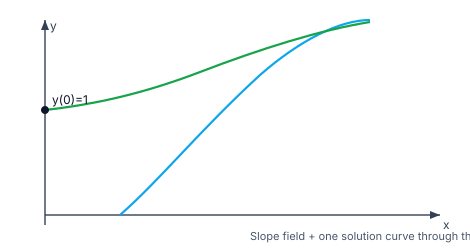
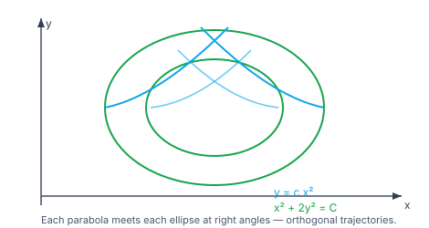
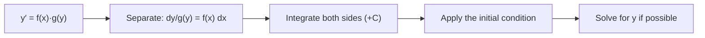

> [!info] Navigation
> 📖 [[Home|Vault home]] · 📝 [[Differential-Equations — Paper|Olympiad Paper]] · ✅ [[Differential-Equations — Solutions|Solutions]]

# Differential Equations

A **differential equation** (DE) relates a function to its derivatives. Newton's
second law, radioactive decay, population growth, cooling, mixing, circuits and
compound interest are all differential equations — the subject is the language of
*change*, and solving one means recovering the function from the rule that
governs how it changes.

The methods form a ladder: **separable** → **homogeneous** → **linear** →
**exact** → **higher-order linear** → the frontier (Clairaut's equation, singular
solutions, orthogonal trajectories). Each rung needs the one below it.

Everything here rests on [[Integration|antiderivatives and the integration
toolkit]] — every solution is obtained by *integrating*, which is why this module
comes after Integration.

`6 chapters` `worked examples (S) + practice (P)` `SVG + Mermaid diagrams` `34-question Olympiad paper + full solutions`

### ★ How to use these notes

**Read in order, and identify the type before you compute.** Chapter 1 fixes the
vocabulary (order, degree, linearity, initial-value problem) — misclassifying the
type is the single biggest source of wasted time. Chapters 2–5 are the method
ladder; Chapter 6 is higher-order and the Olympiad frontier.

- **Callouts** — `[!abstract]` First Principles = the derivation; `[!tip]` Key
  Idea = the takeaway; `[!warning]` Common Trap = the classic mistake;
  `[!example]` Olympiad Extension = the frontier version.
- **Numeric habit** — check any solution by *substituting it back* into the
  equation, and verify the initial condition. A numerical integrator (RK4) on
  $y'=f(x,y)$ gives an independent check.

### ▣ The roadmap

| Ch | Title | Level |
|---|---|---|
| 1 | Formation, order, degree & terminology | foundations |
| 2 | Variables separable | foundations |
| 3 | Homogeneous equations | machinery |
| 4 | Linear first-order & Bernoulli | machinery |
| 5 | Exact equations & orthogonal trajectories | applications |
| 6 | Higher-order linear & the Olympiad frontier | synthesis |

**Fig 1.1 — a slope field and its solution.** Each short segment has slope
$f(x,y)$; the solution through $(0,1)$ is the curve that is *tangent* to the
field everywhere. For $y'=\frac xy$ the field is $x^2-y^2=C$ — a family of
hyperbolas, and the initial condition picks one.

**Fig 1.2 — orthogonal trajectories.** Two families of curves that meet at right
angles everywhere. From $y=cx^2$ (slope $\frac{2y}{x}$) the orthogonal family has
slope $-\frac{x}{2y}$, which integrates to $x^2+2y^2=C$ — a family of ellipses.

---

# Chapter 1 — Formation, Order, Degree & Terminology

*Foundations · naming the thing before solving it*

## 1.1 The vocabulary

> [!abstract] First Principles — order and degree
> The **order** of a DE is the order of the highest derivative appearing in it.
> The **degree** is the power of that highest derivative *after* the equation has
> been made rational and integral in the derivatives.

$$\frac{dy}{dx}+2y=e^x \quad\text{(order 1, degree 1)}$$
$$\frac{d^2y}{dx^2}+3\frac{dy}{dx}+2y=0 \quad\text{(order 2, degree 1)}$$
$$\left(\frac{d^2y}{dx^2}\right)^3+\frac{dy}{dx}=0 \quad\text{(order 2, degree 3)}$$

> [!warning] Common Trap — "degree" is not always defined
> In $\sqrt{\frac{d^2y}{dx^2}}+\frac{dy}{dx}=1$ the equation is not polynomial in
> the derivatives, so the **degree is not defined** until you square it. Report
> the order always; the degree only when it exists.

## 1.2 Solution, general solution, particular solution

A **solution** is a function that satisfies the equation on an interval. The
**general solution** contains as many arbitrary constants as the order; a
**particular solution** fixes them, usually from an **initial-value problem**
(IVP).

#### **S1**[JEE Main][solved][verify]Verify that $y=e^{2x}$ solves $\frac{dy}{dx}-2y=0$.

$\frac{dy}{dx}=2e^{2x}$ and $2y=2e^{2x}$, so the difference is $0$.

Answer + Reasoning

**Method: substitute and check.** $y=Ce^{2x}$ is the general solution; $y=e^{2x}$ is the particular solution with $y(0)=1$.

**Answer:** yes, it is a solution.

#### **P1**[JEE Main][practice][order degree]State the order and degree of $\dfrac{d^3y}{dx^3}+\left(\dfrac{dy}{dx}\right)^4+y=0$.

Answer + Reasoning

**Method: highest derivative is third order; it appears to the first power.**

**Answer:** order $3$, degree $1$.

## 1.3 Forming a DE from a family of curves

> [!tip] Key Idea — differentiate to eliminate the constants
> A family of curves with $n$ parameters yields a DE of order $n$: differentiate
> $n$ times and eliminate the parameters.

#### **S2**[JEE Main][solved][formation]Find the DE of the family $y=cx+c^2$.

$\frac{dy}{dx}=c$, so substituting gives $y=x\frac{dy}{dx}+\left(\frac{dy}{dx}\right)^2$ — a first-order equation.

Answer + Reasoning

**Method: one parameter $\Rightarrow$ one differentiation.** $c$ disappears.

**Answer:** $y=xy'+(y')^2$ (Clairaut's form).

#### **P2**[JEE Main][practice][formation]Find the DE of all circles through the origin with centre on the $x$-axis: $(x-a)^2+y^2=a^2$.

Answer + Reasoning

**Method: one parameter $a$; differentiate once.** Expanding: $x^2+y^2=2ax$, so $a=\frac{x^2+y^2}{2x}$; differentiating and substituting gives $x^2-y^2-2xy\frac{dy}{dx}=0$.

**Answer:** $x^2-y^2=2xy\dfrac{dy}{dx}$.

---

# Chapter 2 — Variables Separable

*Foundations · the first and easiest method*

## 2.1 The method

> [!abstract] First Principles — separation
> If the equation can be written $g(y)\,dy=f(x)\,dx$, integrate both sides:
> $$\int g(y)\,dy=\int f(x)\,dx+C.$$
> This is exactly the substitution rule run backwards — the equation is
> *separable* when $y'$ factors as a function of $x$ times a function of $y$.

#### **S3**[JEE Main][solved][separable]Solve $\dfrac{dy}{dx}=\dfrac xy$ with $y(0)=1$.

$y\,dy=x\,dx\Rightarrow\frac{y^2}{2}=\frac{x^2}{2}+C$. With $y(0)=1$: $C=\frac12$, so $y^2=x^2+1$ and (positive branch) $y=\sqrt{x^2+1}$.

Answer + Reasoning

**Method: separate and integrate.** Check: $\frac{dy}{dx}=\frac{x}{\sqrt{x^2+1}}=\frac xy$ ✓.

**Answer:** $y=\sqrt{x^2+1}$; $y(1)=\sqrt2\approx1.4142$.

#### **S4**[JEE Main][solved][separable]Solve $\dfrac{dy}{dx}=y$ with $y(0)=1$.

$\frac{dy}{y}=dx\Rightarrow\ln\lvert y\rvert=x+C$; $y(0)=1\Rightarrow C=0$, so $y=e^x$.

Answer + Reasoning

**Method: separate.** This is the defining property of the exponential: the function equal to its own rate of change.

**Answer:** $y=e^x$.

#### **P3**[JEE Main][practice][separable]Solve $\dfrac{dy}{dx}=2xy$ with $y(0)=3$.

Answer + Reasoning

**Method: separate.** $\ln\lvert y\rvert=x^2+C$; $y(0)=3\Rightarrow C=\ln3$.

**Answer:** $y=3e^{x^2}$; $y(1)=3e\approx8.1548$.

#### **P4**[JEE Adv][practice][separable]Solve $\dfrac{dy}{dx}=e^{x-y}$ with $y(0)=0$.

Answer + Reasoning

**Method: separate ($e^{x-y}=e^xe^{-y}$).** $e^y\,dy=e^xdx\Rightarrow e^y=e^x+C$; $y(0)=0\Rightarrow1=1+C$, $C=0$.

**Answer:** $e^y=e^x$, i.e. $y=x$.

---

# Chapter 3 — Homogeneous Equations

*Machinery · the substitution $y=vx$*

## 3.1 What homogeneous means

> [!abstract] First Principles — homogeneous function
> $M(x,y)$ is **homogeneous of degree $n$** if
> $M(tx,ty)=t^nM(x,y)$. A DE $\frac{dy}{dx}=\frac{M(x,y)}{N(x,y)}$ with $M,N$
> homogeneous of the *same* degree is a **homogeneous DE**, and the substitution
> $y=vx$ makes it separable.

#### **S5**[JEE Main][solved][homogeneous]Solve $\dfrac{dy}{dx}=\dfrac{x+y}{x}$ with $y(1)=0$.

Put $y=vx$, so $\frac{dy}{dx}=v+x\frac{dv}{dx}$: $v+xv'=1+v\Rightarrow xv'=1\Rightarrow v=\ln x+C$. With $v(1)=0$: $C=0$, so $v=\ln x$ and $y=x\ln x$.

Answer + Reasoning

**Method: $y=vx$ reduces it to a separable equation.** Check: $\frac{dy}{dx}=\ln x+1$ and $\frac{x+y}{x}=\frac{x+x\ln x}{x}=1+\ln x$ ✓.

**Answer:** $y=x\ln x$; $y(e)=e\approx2.7183$.

#### **P5**[JEE Adv][practice][homogeneous]Solve $\dfrac{dy}{dx}=\dfrac yx+\left(\dfrac yx\right)^2$ with $y(1)=1$.

Answer + Reasoning

**Method: $y=vx$.** $v+xv'=v+v^2\Rightarrow\frac{dv}{v^2}=\frac{dx}{x}\Rightarrow-\frac1v=\ln x+C$; $v(1)=1\Rightarrow C=-1$, so $v=\frac1{1-\ln x}$.

**Answer:** $y=\dfrac{x}{1-\ln x}$; $y(2)=\dfrac2{1-\ln2}\approx6.5178$ (blows up as $x\to e$).

---

# Chapter 4 — Linear First-Order & Bernoulli

*Machinery · the integrating factor*

## 4.1 The integrating factor

> [!abstract] First Principles — why the integrating factor works
> A **linear first-order** DE has the form $\frac{dy}{dx}+P(x)y=Q(x)$. Multiply
> by the **integrating factor** $\mu=e^{\int P\,dx}$; then
> $\frac{d}{dx}(\mu y)=\mu Q$, because $\mu'=\mu P$. Integrate:
> $$y=\frac{1}{\mu}\int\mu Q\,dx.$$
> The factor is chosen so the left side becomes an exact derivative.

#### **S6**[JEE Main][solved][linear]Solve $\dfrac{dy}{dx}+y=e^x$ with $y(0)=0$.

$P=1$, so $\mu=e^x$: $\frac{d}{dx}(e^xy)=e^{2x}$, hence $e^xy=\frac12e^{2x}+C$. With $y(0)=0$: $C=-\frac12$, so $y=\frac12(e^x-e^{-x})=\sinh x$.

Answer + Reasoning

**Method: integrating factor.** Check: $y'+y=\frac12(e^x+e^{-x})+\frac12(e^x-e^{-x})=e^x$ ✓.

**Answer:** $y=\sinh x$; $y(1)=\sinh1\approx1.1752$.

#### **S7**[JEE Main][solved][linear]Solve $\dfrac{dy}{dx}+2y=4x$ with $y(0)=1$.

$\mu=e^{2x}$: $\frac{d}{dx}(e^{2x}y)=4xe^{2x}$, so $e^{2x}y=2xe^{2x}-e^{2x}+C$. With $y(0)=1$: $C=2$, so $y=2x-1+2e^{-2x}$.

Answer + Reasoning

**Method: integrating factor + by parts on the right.** Check at $x=0$: $y=0-1+2=1$ ✓; $y'+2y=(2-4e^{-2x})+(4x-2+4e^{-2x})=4x$ ✓.

**Answer:** $y=2x-1+2e^{-2x}$; $y(1)=1+\dfrac2{e^2}\approx1.2707$.

#### **P6**[JEE Adv][practice][linear]Solve $\dfrac{dy}{dx}+\dfrac yx=x$ with $y(1)=0$.

Answer + Reasoning

**Method: $P=\frac1x$, $\mu=e^{\ln x}=x$.** $\frac{d}{dx}(xy)=x^2$, so $xy=\frac{x^3}{3}+C$; $y(1)=0\Rightarrow C=-\frac13$.

**Answer:** $y=\dfrac{x^2}{3}-\dfrac1{3x}$.

## 4.2 Bernoulli's equation

> [!abstract] First Principles — Bernoulli
> $\frac{dy}{dx}+P(x)y=Q(x)y^n$ with $n\ne0,1$. Divide by $y^n$ and substitute
> $u=y^{1-n}$; the result is **linear** in $u$, so the integrating factor applies.

#### **S8**[Olympiad][solved][Bernoulli]Solve $\dfrac{dy}{dx}+y=xy^2$ with $y(0)=1$.

Divide by $y^2$: $y^{-2}y'+y^{-1}=x$. Put $u=y^{-1}$, so $u'=-y^{-2}y'$ and the equation becomes $-u'+u=x$, i.e. $u'-u=-x$. With $\mu=e^{-x}$: $(ue^{-x})'=-xe^{-x}$, so $ue^{-x}=e^{-x}(x+1)+C$, i.e. $u=x+1+Ce^x$. From $u(0)=1$: $C=0$, so $u=x+1$ and $y=\frac1{x+1}$.

Answer + Reasoning

**Method: Bernoulli substitution $u=y^{-1}$.** Check: $y'+y=-1/(x+1)^2+1/(x+1)=x/(x+1)^2=xy^2$ ✓.

**Answer:** $y=\dfrac1{x+1}$; $y(1)=\dfrac12$.

---

# Chapter 5 — Exact Equations & Orthogonal Trajectories

*Applications · potentials, and curves meeting at right angles*

## 5.1 Exact equations

> [!abstract] First Principles — exactness
> $M(x,y)\,dx+N(x,y)\,dy=0$ is **exact** if $\frac{\partial M}{\partial y}=\frac{\partial N}{\partial x}$ — then there is a **potential** $F$ with
> $F_x=M$, $F_y=N$, and the solutions are the level curves $F(x,y)=C$.

#### **S9**[JEE Adv][solved][exact]Solve $(2x+y)\,dx+(x+2y)\,dy=0$ with $y(0)=1$.

$\frac{\partial M}{\partial y}=1=\frac{\partial N}{\partial x}$, so it is exact. Integrate $F_x=2x+y$ in $x$: $F=x^2+xy+\phi(y)$; then $F_y=x+\phi'(y)=x+2y$, so $\phi'=2y$ and $\phi=y^2$. Thus $x^2+xy+y^2=C$; with $y(0)=1$, $C=1$.

Answer + Reasoning

**Method: find the potential by partial integration.** Check: $dF=(2x+y)dx+(x+2y)dy$ ✓.

**Answer:** $x^2+xy+y^2=1$; at $x=1$, $y=0$ or $y=-1$.

#### **P7**[JEE Adv][practice][exact]Solve $(3x^2+2xy)\,dx+(x^2+2y)\,dy=0$ with $y(0)=1$.

Answer + Reasoning

**Method: exactness check $\partial M/\partial y=2x=\partial N/\partial x$, then integrate.** $F=x^3+x^2y+y^2=C$; $y(0)=1\Rightarrow C=1$.

**Answer:** $x^3+x^2y+y^2=1$.

## 5.2 Orthogonal trajectories

> [!tip] Key Idea — negate and invert the slope
> The orthogonal trajectory of a family has slope $-\dfrac1{y'}$ at every point.
> Solve that new first-order DE to get the second family.

#### **S10**[JEE Adv][solved][orthogonal]Find the orthogonal trajectories of $y=cx^2$.

$\frac{dy}{dx}=2cx=\frac{2y}{x}$, so the orthogonal slope is $-\frac{x}{2y}$. Then $2y\,dy=-x\,dx\Rightarrow y^2=-\frac{x^2}{2}+C$, i.e. $x^2+2y^2=C$.

Answer + Reasoning

**Method: replace the slope by its negative reciprocal and separate.** Check the orthogonality: parabola slope $\frac{2y}{x}$, ellipse slope $-\frac{x}{2y}$, product $-1$ ✓.

**Answer:** $x^2+2y^2=C$ (a family of ellipses).

#### **P8**[JEE Adv][practice][orthogonal]Find the orthogonal trajectories of the concentric circles $x^2+y^2=c$.

Answer + Reasoning

**Method: circle slope $-\frac xy$; orthogonal slope $\frac yx$; separate.** $\frac{dy}{y}=\frac{dx}{x}\Rightarrow\ln\lvert y\rvert=\ln\lvert x\rvert+C$.

**Answer:** $y=Cx$ — the straight lines through the origin.

---

# Chapter 6 — Higher-Order Linear & the Olympiad Frontier

*Synthesis · second-order equations and the frontier*

## 6.1 Second-order linear with constant coefficients

> [!abstract] First Principles — the characteristic equation
> For $ay''+by'+cy=0$ try $y=e^{rx}$: substitution gives $ar^2+br+c=0$, the
> **characteristic equation**. Distinct real roots $r_1,r_2\Rightarrow y=Ae^{r_1x}+Be^{r_2x}$; a repeated root $r\Rightarrow y=(A+Bx)e^{rx}$; complex roots
> $\alpha\pm i\beta\Rightarrow y=e^{\alpha x}(A\cos\beta x+B\sin\beta x)$.

#### **S11**[JEE Main][solved][second order]Solve $y''-3y'+2y=0$ with $y(0)=0$, $y'(0)=1$.

$r^2-3r+2=(r-1)(r-2)$, so $y=Ae^x+Be^{2x}$. Then $A+B=0$ and $A+2B=1$, giving $A=-1$, $B=1$: $y=e^{2x}-e^x$.

Answer + Reasoning

**Method: characteristic roots + the two initial conditions.** Check: $y(0)=1-1=0$ ✓; $y'(0)=2-1=1$ ✓.

**Answer:** $y=e^{2x}-e^x$; $y(1)=e^2-e\approx4.6708$.

#### **S12**[JEE Adv][solved][second order]Solve $y''+4y'+4y=0$ with $y(0)=1$, $y'(0)=0$.

$r^2+4r+4=(r+2)^2$, a repeated root: $y=(A+Bx)e^{-2x}$. From $y(0)=1$, $A=1$; $y'=(B-2A-2Bx)e^{-2x}$, so $y'(0)=B-2=0$ and $B=2$: $y=(1+2x)e^{-2x}$.

Answer + Reasoning

**Method: repeated root ⇒ the $xe^{rx}$ companion.** Check: $y(0)=1$ ✓; $y'(0)=0$ ✓.

**Answer:** $y=(1+2x)e^{-2x}$; $y(1)=3e^{-2}\approx0.4060$.

#### **S13**[JEE Adv][solved][Cauchy–Euler]Solve $x^2y''+xy'-y=0$ with $y(1)=0$, $y'(1)=1$.

Try $y=x^r$: $r(r-1)+r-1=r^2-1=0$, so $r=\pm1$ and $y=Ax+\frac Bx$. From $y(1)=0$: $A+B=0$; $y'=A-\frac B{x^2}$, so $y'(1)=A-B=1$. Hence $A=\frac12$, $B=-\frac12$: $y=\frac12\big(x-\frac1x\big)$.

Answer + Reasoning

**Method: Cauchy–Euler (equidimensional) — powers of $x$ replace exponentials.** Check: $y'=\frac12(1+x^{-2})$, $y''=x^{-3}$; $x^2y''+xy'-y=1+\frac x2(1+x^{-2})-\frac12(x-x^{-1})=0$ ✓.

**Answer:** $y=\dfrac12\Big(x-\dfrac1x\Big)$; $y(2)=\dfrac34$.

#### **P9**[JEE Main][practice][second order]Solve $y''+y=0$ with $y(0)=0$, $y'(0)=1$.

Answer + Reasoning

**Method: $r^2+1=0\Rightarrow r=\pm i$, so $y=A\cos x+B\sin x$; $y(0)=0\Rightarrow A=0$, $y'(0)=B=1$.**

**Answer:** $y=\sin x$; $y(\pi/2)=1$.

## 6.2 Applications: growth, decay and cooling

> [!abstract] First Principles — Newton's law of cooling
> $\frac{dT}{dt}=-k(T-T_a)$ where $T_a$ is the ambient temperature. This is
> separable *and* linear: $T-T_a=(T_0-T_a)e^{-kt}$.

#### **S14**[JEE Main][solved][cooling]A body at $100^\circ$C cools in a $20^\circ$C room; after $10$ min it is $60^\circ$C. Find its temperature after $20$ min.

$T-20=80e^{-kt}$. From $T(10)=60$: $40=80e^{-10k}$, so $e^{-10k}=\frac12$ and $k=\frac{\ln2}{10}$. Then $T(20)-20=80e^{-20k}=80\cdot\frac14=20$, giving $T(20)=40$.

Answer + Reasoning

**Method: separable; use the middle reading to find $k$.** Check: $e^{-10k}=1/2$ means $e^{-20k}=1/4$ ✓.

**Answer:** $40^\circ$C.

#### **P10**[JEE Main][practice][growth]A population of $1000$ grows at $10\%$ per year. Find $P(10)$.

Answer + Reasoning

**Method: $\frac{dP}{dt}=0.1P$ separable.** $P=1000e^{0.1t}$.

**Answer:** $P(10)=1000e\approx2718.28$.

## 6.3 The frontier: Clairaut and singular solutions

> [!example] Olympiad Extension — Clairaut's equation
> $y=xp+f(p)$ with $p=\frac{dy}{dx}$ has a **family of straight lines**
> $y=cx+f(c)$ *and* a **singular solution** which is their envelope. Differentiate
> with respect to $x$: $p=p+xp'+f'(p)p'$, so $\big(x+f'(p)\big)p'=0$. The branch
> $p'=0$ (i.e. $p=c$ constant) gives the lines; the branch $x+f'(p)=0$ gives the
> envelope, found by eliminating $p$.

#### **S15**[Olympiad][solved][Clairaut]Solve $y=xy'+(y')^2$, and find its singular solution.

Differentiating: $(x+2y')y''=0$. The branch $y''=0$ gives $y'=c$, so $y=cx+c^2$ — a family of lines. The branch $x+2c=0$ gives $c=-\frac x2$, and substituting into the family: $y=-\frac{x^2}{2}+\frac{x^2}{4}=-\frac{x^2}{4}$.

Answer + Reasoning

**Method: differentiate and split into two branches.** Check the envelope: at $x=2$, $y=-1$, $y'=-1$, and $xy'+(y')^2=2(-1)+1=-1=y$ ✓.

**Answer:** general $y=cx+c^2$; singular solution $y=-\dfrac{x^2}{4}$.

#### **P11**[Olympiad][practice][singular]Find the singular solution of $y=xy'-(y')^2$.

Answer + Reasoning

**Method: as S15.** Differentiating: $(x-2y')y''=0$. Lines $y=cx-c^2$; envelope from $x-2c=0$, $c=\frac x2$: $y=\frac{x^2}{2}-\frac{x^2}{4}=\frac{x^2}{4}$.

**Answer:** $y=\dfrac{x^2}{4}$.

#### **P12**[Olympiad][practice][reduction of order]Solve $x^2y''-2xy'+2y=0$ given $y(1)=1$, $y'(1)=2$.

Answer + Reasoning

**Method: Cauchy–Euler, $y=x^r$.** $r(r-1)-2r+2=r^2-3r+2=0\Rightarrow r=1,2$, so $y=Ax+Bx^2$; $y(1)=A+B=1$, $y'(1)=A+2B=2\Rightarrow B=1$, $A=0$.

**Answer:** $y=x^2$.

---

# Appendix — Well-Ordered Theory Reference

Every result in dependency order; nothing is used before it is proved.

### A. Terminology

| Result | Statement |
|---|---|
| Order | order of the highest derivative present |
| Degree | power of that derivative, when the equation is polynomial in derivatives |
| General solution | contains as many arbitrary constants as the order |
| IVP | a DE plus enough initial conditions to fix the constants |

### B. First-order methods

| Method | Form | Key step |
|---|---|---|
| Separable | $y'=f(x)g(y)$ | $\int\frac{dy}{g(y)}=\int f(x)dx$ |
| Homogeneous | $\frac{M}{N}$, $M,N$ same degree | $y=vx$ ⇒ separable |
| Linear | $y'+P(x)y=Q(x)$ | integrating factor $\mu=e^{\int P\,dx}$ |
| Bernoulli | $y'+Py=Qy^n$ | $u=y^{1-n}$ ⇒ linear |
| Exact | $Mdx+Ndy=0$, $M_y=N_x$ | find $F$ with $F_x=M$, $F_y=N$ |
| Orthogonal trajectories | slope $-\frac1{y'}$ | solve the new first-order DE |

### C. Higher-order linear

| Result | Statement |
|---|---|
| Characteristic equation | $ar^2+br+c=0$ for $ay''+by'+cy=0$ |
| Distinct real roots | $y=Ae^{r_1x}+Be^{r_2x}$ |
| Repeated root | $y=(A+Bx)e^{rx}$ |
| Complex roots $\alpha\pm i\beta$ | $y=e^{\alpha x}(A\cos\beta x+B\sin\beta x)$ |
| Cauchy–Euler | try $y=x^r$ in $ax^2y''+bxy'+cy=0$ |
| Newton's cooling | $T-T_a=(T_0-T_a)e^{-kt}$ |
| Exponential growth | $P=P_0e^{kt}$ |

### D. Frontier

| Result | Statement |
|---|---|
| Clairaut $y=xp+f(p)$ | lines $y=cx+f(c)$ **plus** the singular envelope |
| Envelope | differentiate the family w.r.t. the parameter and eliminate it |
| Singular solution | satisfies the DE but is not a member of the general family |

### E. Mistake checklist

1. Misclassifying the type — check separability, homogeneity, linearity *in that order* before starting.
2. Forgetting the arbitrary constant (or applying the initial condition too early).
3. Sign errors in the integrating factor $\mu=e^{\int P\,dx}$ (the integral, not its negative).
4. Applying the Bernoulli substitution when $n=0$ or $n=1$ — those are already linear.
5. Forgetting that an exact equation needs $M_y=N_x$ checked *before* searching for $F$.
6. Using $\ln y$ instead of $\ln\lvert y\rvert$ when the solution may be negative.
7. Forgetting the $Bxe^{rx}$ companion term for a repeated characteristic root.
8. Reporting only the family of lines from a Clairaut equation and missing the singular solution.
