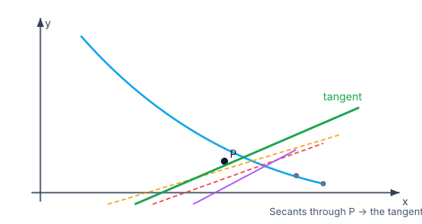

> [!info] Navigation
> 📖 [[Home|Vault home]] · 📝 [[Differentiation-and-Methods — Paper|Olympiad Paper]] · ✅ [[Differentiation-and-Methods — Solutions|Solutions]]

# Differentiation and Method of Differentiation

The derivative is the single most powerful idea in applied mathematics: the
*instantaneous rate of change*, the *slope of the tangent*, the *linear
approximation* of a function. This module builds the derivative from the
difference quotient (a limit — see [[Limits-and-Continuity]]), derives every
differentiation rule from first principles, systematises the **methods**
(chain, implicit, logarithmic, parametric), climbs to the **nth-derivative**
machinery, and reaches the Olympiad frontier: functional equations cracked by
differentiating, Leibniz's rule, and derivative-based inequalities.

`6 chapters` `worked examples (S) + practice (P)` `SVG + Mermaid diagrams` `32-question Olympiad paper + full solutions`

### ★ How to use these notes

**Read in order.** Chapter 1's difference-quotient definition is load-bearing:
the product, quotient and chain rules of Chapters 2–3 are all *proved* from it,
never quoted. Chapter 4 turns the rules into a method toolkit; Chapters 5–6 push
to the Olympiad frontier.

- **Callouts** — `[!abstract]` First Principles = the derivation; `[!tip]` Key
  Idea = the takeaway; `[!warning]` Common Trap = the classic mistake;
  `[!example]` Olympiad Extension = the frontier version.
- **Numeric habit** — sanity-check any derivative by a finite difference
  $\frac{f(x+h)-f(x)}{h}$ at tiny $h$.

### ▣ The roadmap

| Ch | Title | Level |
|---|---|---|
| 1 | The derivative from first principles | foundations |
| 2 | The algebra of derivatives (product, quotient, power) | machinery |
| 3 | Chain rule & standard functions | core |
| 4 | Methods: implicit, logarithmic, parametric, higher-order | applications |
| 5 | Olympiad techniques | frontier |
| 6 | Synthesis — the Olympiad frontier | synthesis |

**Fig 1.1 — the derivative as a limit of secants.** As the second point $Q$
slides toward $P$, the secant through $P,Q$ tilts toward the tangent; its slope
tends to $f'(x_0)$.

---

# Chapter 1 — The Derivative from First Principles

*Foundations · the difference quotient, differentiability vs continuity, one-sided derivatives*

## 1.1 The definition

> [!abstract] First Principles — the derivative
> The **derivative** of $f$ at $x$ is
> $$f'(x) = \lim_{h\to 0}\frac{f(x+h)-f(x)}{h} = \lim_{z\to x}\frac{f(z)-f(x)}{z-x},$$
> provided the limit exists. Geometrically it is the slope of the tangent; the
> quotient $\frac{f(x+h)-f(x)}{h}$ is the slope of the *secant* through
> $(x,f(x))$ and $(x+h,f(x+h))$, and the limit lets that secant become the
> tangent. Physically it is the instantaneous rate of change.

When the limit exists we say $f$ is **differentiable** at $x$.

## 1.2 Differentiable ⟹ continuous (but not conversely)

> [!abstract] First Principles — differentiability forces continuity
> If $f'(a)$ exists then $f$ is continuous at $a$. **Why:**
> $f(x)-f(a) = \dfrac{f(x)-f(a)}{x-a}\cdot(x-a) \to f'(a)\cdot 0 = 0$ as
> $x\to a$, so $f(x)\to f(a)$.

> [!warning] Common Trap — the converse is FALSE
> $f(x)=|x|$ is continuous at $0$ but $\dfrac{|h|-0}{h}=\dfrac{|h|}{h}$ is $+1$
> from the right and $-1$ from the left — the limit fails, so $|x|$ is *not*
> differentiable at $0$. Continuity is necessary, not sufficient.

## 1.3 One-sided derivatives and piecewise functions

The **left derivative** $f'_-(a)=\lim_{h\to0^-}\frac{f(a+h)-f(a)}{h}$ and the
**right derivative** $f'_+(a)=\lim_{h\to0^+}\cdots$. $f$ is differentiable at $a$
iff both exist and are equal. This is how we test differentiability of
piecewise / absolute-value functions at their junctions.

#### **S1**[JEE Main][solved][definition]Differentiate $f(x)=x^2$ from the definition.

$\dfrac{(x+h)^2-x^2}{h}=\dfrac{2xh+h^2}{h}=2x+h\to 2x$, so $f'(x)=2x$.

Answer + Reasoning

**Method: expand, cancel $h$, take the limit.**

**Answer:** $f'(x)=2x$. (Check: finite difference at $x=3$, $h=10^{-6}$ gives $6.000001$ ✓.)

#### **S2**[JEE Adv][solved][piecewise]Test differentiability of $f(x)=x|x|$ at $0$.

For $x>0$, $f=x^2$; for $x<0$, $f=-x^2$. $f'_+(0)=\lim_{h\to0^+}\frac{h^2}{h}=0$ and $f'_-(0)=\lim_{h\to0^-}\frac{-h^2}{h}=0$. Equal ⇒ differentiable at $0$ with $f'(0)=0$.

Answer + Reasoning

**Method: compare one-sided derivatives.**

**Answer:** differentiable at $0$, $f'(0)=0$.

#### **P1**[JEE Main][practice][definition]From the definition, differentiate $f(x)=\dfrac1x$.

Answer + Reasoning

**Method: difference quotient.** $\frac{\frac1{x+h}-\frac1x}{h}=\frac{-h}{xh(x+h)}\cdot\frac1h=\frac{-1}{x(x+h)}\to-\frac1{x^2}$.

**Answer:** $f'(x)=-\dfrac1{x^2}$.

#### **P2**[JEE Main][practice][differentiability]Is $f(x)=|x-2|$ differentiable at $x=2$?

Answer + Reasoning

**Method: one-sided slopes.** Left slope $-1$, right slope $+1$; unequal.

**Answer:** No — a corner at $x=2$.

---

# Chapter 2 — The Algebra of Derivatives

*Machinery · sum, product, quotient and power rules — all derived*

## 2.1 Linearity

$(af+bg)' = af' + bg'$ — immediate from the limit laws (constant factors out, sums split).

## 2.2 The product rule

> [!abstract] First Principles — the product rule
> $(fg)' = f'g + fg'$. **Why:** add and subtract $f(x+h)g(x)$ in the numerator:
> $$\frac{f(x+h)g(x+h)-f(x)g(x)}{h} = \frac{f(x+h)-f(x)}{h}\,g(x) + f(x+h)\frac{g(x+h)-g(x)}{h},$$
> which tends to $f'(x)g(x) + f(x)g'(x)$ using the continuity of $f$ at $x$.

## 2.3 The quotient rule

> [!abstract] First Principles — the quotient rule
> $\Big(\dfrac{f}{g}\Big)' = \dfrac{f'g - fg'}{g^2}$ (where $g\ne0$). **Why:** write
> $f/g = f\cdot g^{-1}$ and apply the product rule together with
> $(g^{-1})' = -g'/g^{2}$ (itself from the chain rule on $u\mapsto u^{-1}$).

## 2.4 The power rule

For positive integers $n$, $(x^n)' = nx^{n-1}$ follows by induction from the
product rule (or the binomial theorem in the difference quotient). It extends to
all real powers via logarithmic differentiation (Chapter 4).

#### **S3**[JEE Main][solved][product rule]Differentiate $f(x)=x^2\sin x$.

$(x^2)'\sin x + x^2(\sin x)' = 2x\sin x + x^2\cos x$.

Answer + Reasoning

**Method: product rule.**

**Answer:** $2x\sin x + x^2\cos x$. (Check at $x=0$: both terms vanish, $f'(0)=0$; finite difference confirms ✓.)

#### **P3**[JEE Adv][practice][quotient rule]Differentiate $f(x)=\dfrac{x}{1+x^2}$.

Answer + Reasoning

**Method: quotient rule.** $\frac{1\cdot(1+x^2)-x\cdot 2x}{(1+x^2)^2}=\frac{1-x^2}{(1+x^2)^2}$.

**Answer:** $\dfrac{1-x^2}{(1+x^2)^2}$.

#### **P4**[JEE Main][practice][power]Differentiate $f(x)=x^5 - 3x^{1/2} + 7$.

Answer + Reasoning

**Method: power rule term-by-term.** $5x^4 - \frac32 x^{-1/2}$.

**Answer:** $5x^{4}-\dfrac{3}{2\sqrt x}$.

---

# Chapter 3 — Chain Rule & Standard Functions

*Core · the chain rule, trig/exp/log derivatives, inverse functions*

## 3.1 The chain rule

> [!abstract] First Principles — the chain rule
> $\dfrac{d}{dx}f(g(x)) = f'(g(x))\,g'(x)$. **Idea:** a small change $dx$ in $x$
> produces a change $g'(x)\,dx$ in $u=g(x)$, which in turn changes $f$ by
> $f'(u)\cdot g'(x)\,dx$. Rates multiply: $\frac{df}{dx}=\frac{df}{du}\cdot\frac{du}{dx}$.

## 3.2 Standard derivatives

$$\frac{d}{dx}\sin x=\cos x,\quad \frac{d}{dx}\cos x=-\sin x,\quad \frac{d}{dx}e^x=e^x,\quad \frac{d}{dx}\ln x=\frac1x .$$

> [!abstract] First Principles — two of them
> $(\sin x)'=\cos x$: expand $\sin(x+h)=\sin x\cos h+\cos x\sin h$ and use
> $\cos h\to1$, $\frac{\sin h}{h}\to1$. $(\ln x)'=\frac1x$: the difference
> quotient is $\frac1h\ln\frac{x+h}{x}=\ln\big(1+\frac{h}{x}\big)^{1/h}$, whose
> limit is $\frac1x$ (the $e$-limit of [[Limits-and-Continuity]]).

## 3.3 Inverse functions and inverse trigonometrics

> [!abstract] First Principles — the inverse-function rule
> If $y=f(x)$ is invertible and $f'(x)\ne0$, then $\dfrac{dx}{dy}=\dfrac1{dy/dx}$,
> i.e. $(f^{-1})'(y)=\dfrac1{f'(f^{-1}(y))}$. Differentiating $x=\sin y$ with
> respect to $x$: $1=\cos y\,\frac{dy}{dx}$, so $\frac{d}{dx}\arcsin x=\frac1{\cos y}=\frac1{\sqrt{1-x^2}}$.

$$\frac{d}{dx}\arcsin x=\frac1{\sqrt{1-x^2}},\quad \frac{d}{dx}\arccos x=-\frac1{\sqrt{1-x^2}},\quad \frac{d}{dx}\arctan x=\frac1{1+x^2}.$$

#### **S4**[JEE Main][solved][chain]Differentiate $f(x)=\sin(3x^2)$.

$f'(x)=\cos(3x^2)\cdot 6x = 6x\cos(3x^2)$.

Answer + Reasoning

**Method: chain rule, outer $\sin$, inner $3x^2$.**

**Answer:** $6x\cos(3x^{2})$. (Check at $x=0$: $f'(0)=0$ ✓.)

#### **S5**[JEE Adv][solved][inverse trig]Differentiate $f(x)=\arctan\!\big(\frac{\sin x}{1+\cos x}\big)$.

Note $\frac{\sin x}{1+\cos x}=\tan(x/2)$, so $f(x)=\arctan(\tan(x/2))=\frac{x}{2}$ on the principal branch, and $f'(x)=\frac12$.

Answer + Reasoning

**Method: simplify first (half-angle), then differentiate.**

**Answer:** $\dfrac12$. (Blind chain rule gives the same after simplification.)

#### **P5**[JEE Main][practice][chain]Differentiate $f(x)=e^{x^2}$.

Answer + Reasoning

**Method: chain rule.** $e^{x^2}\cdot 2x$.

**Answer:** $2x\,e^{x^{2}}$.

#### **P6**[JEE Main][practice][ln]Differentiate $f(x)=\ln(\sin x)$.

Answer + Reasoning

**Method: chain rule.** $\frac1{\sin x}\cdot\cos x=\cot x$.

**Answer:** $\cot x$.

---

# Chapter 4 — Methods of Differentiation

*Applications · implicit, logarithmic, parametric, higher-order derivatives*

## 4.1 Implicit differentiation

When $y$ is defined implicitly by $F(x,y)=0$, differentiate both sides with
respect to $x$ treating $y$ as a function of $x$ (chain rule on every $y$), then
solve for $\frac{dy}{dx}$.

#### **S6**[JEE Main][solved][implicit]Find $\frac{dy}{dx}$ for $x^2+y^2=1$.

$2x + 2y\frac{dy}{dx}=0 \Rightarrow \frac{dy}{dx}=-\frac{x}{y}$.

Answer + Reasoning

**Method: differentiate implicitly, solve.**

**Answer:** $\dfrac{dy}{dx}=-\dfrac{x}{y}$. (At $(3/5,4/5)$ it is $-3/4$.)

## 4.2 Logarithmic differentiation

Take $\ln$ of both sides first, then differentiate — ideal for $u^v$ forms and
long products/quotients, since $\ln$ turns products into sums.

> [!abstract] First Principles — why it works
> If $y = u^v$, then $\ln y = v\ln u$, and $\frac{y'}{y} = v'\ln u + v\frac{u'}{u}$; multiply back by $y$. The chain rule on $\ln y$ supplies the $\frac{y'}y$ factor.

#### **S7**[JEE Main][solved][logarithmic]Differentiate $f(x)=x^x$ ($x>0$).

$\ln f = x\ln x$, so $\frac{f'}{f} = \ln x + 1$, giving $f' = x^x(\ln x + 1)$.

Answer + Reasoning

**Method: logarithmic differentiation.**

**Answer:** $x^{x}(1+\ln x)$. (Check at $x=1$: $f'(1)=1$; finite difference confirms ✓.)

#### **P7**[JEE Adv][practice][logarithmic]Differentiate $f(x)=\dfrac{x^2\sin x}{\sqrt{1+x}}$.

Answer + Reasoning

**Method: logs.** $\frac{f'}f = \frac2x + \cot x - \frac{1}{2(1+x)}$, so $f' = f\Big(\frac2x+\cot x-\frac1{2(1+x)}\Big)$.

**Answer:** $\dfrac{x^{2}\sin x}{\sqrt{1+x}}\Big(\tfrac2x+\cot x-\tfrac{1}{2(1+x)}\Big)$.

## 4.3 Parametric differentiation

If $x=x(t)$, $y=y(t)$, then $\dfrac{dy}{dx}=\dfrac{dy/dt}{dx/dt}$, and
$\dfrac{d^2y}{dx^2}=\dfrac{d}{dx}\Big(\dfrac{dy}{dx}\Big)=\dfrac{\frac{d}{dt}\big(\frac{dy}{dx}\big)}{dx/dt}$.

#### **P8**[JEE Main][practice][parametric]For $x=t^2$, $y=t^3$, find $\frac{dy}{dx}$ at $t=2$.

Answer + Reasoning

**Method: parametric.** $\frac{dy/dt}{dx/dt}=\frac{3t^2}{2t}=\frac{3t}{2}$; at $t=2$, $=3$.

**Answer:** $3$.

## 4.4 Higher-order derivatives

$f''=(f')'$, $f'''=(f'')'$, and so on. They encode curvature, concavity and
acceleration, and feed the nth-derivative machinery of Chapter 5.

#### **P9**[JEE Main][practice][higher-order]If $f(x)=\sin x$, find $f^{(4)}(x)$.

Answer + Reasoning

**Method: differentiate repeatedly.** $\sin\to\cos\to-\sin\to-\cos\to\sin$.

**Answer:** $\sin x$ (period $4$).

---

# Chapter 5 — Olympiad Techniques

*Frontier · nth derivatives, Leibniz's rule, functional equations, derivative-as-limit*

## 5.1 nth derivatives of standard functions

$$\frac{d^n}{dx^n}e^{ax}=a^n e^{ax},\qquad \frac{d^n}{dx^n}\sin x=\sin\!\Big(x+\frac{n\pi}{2}\Big),\qquad \frac{d^n}{dx^n}(ax+b)^m=\frac{m!}{(m-n)!}\,a^n(ax+b)^{m-n}.$$

## 5.2 Leibniz's rule (nth derivative of a product)

> [!abstract] First Principles — Leibniz's rule
> $(fg)^{(n)}=\sum_{k=0}^{n}\binom{n}{k}f^{(n-k)}g^{(k)}$ — the binomial theorem
> applied to derivatives, proved by induction from the product rule exactly as
> the binomial theorem is proved from $(a+b)(c+d)$.

#### **S8**[Olympiad][solved][Leibniz]Find the $n$th derivative of $x^2 e^x$.

Leibniz with $f=x^2$, $g=e^x$: only $k=n,n-1,n-2$ survive (higher derivatives of $x^2$ vanish):
$(x^2e^x)^{(n)}=e^x\Big(x^2+2nx+n(n-1)\Big)$.

Answer + Reasoning

**Method: Leibniz's rule; $x^2$ differentiates to $0$ after three steps.**

**Answer:** $e^{x}\big(x^{2}+2nx+n(n-1)\big)$.

## 5.3 Functional equations by differentiating

A functional equation plus differentiability collapses: differentiate the
relation, set a convenient variable to $0$, and read off an ODE.

#### **S9**[Olympiad][solved][functional]If $f$ is differentiable, $f(x+y)=f(x)f(y)$, and $f'(0)=1$, find $f$.

Differentiate in $y$: $f'(x+y)=f(x)f'(y)$; set $y=0$: $f'(x)=f(x)f'(0)=f(x)$. So $f'=f$ with $f(0)=1$ (from $f(0)=f(0)^2$, $f(0)\ne0$), giving $f(x)=e^x$.

Answer + Reasoning

**Method: differentiate the FE, extract an ODE.**

**Answer:** $f(x)=e^{x}$.

#### **P10**[Olympiad][practice][nth derivative]Find the $n$th derivative of $\dfrac{1}{1-x}$.

Answer + Reasoning

**Method: pattern.** $(1-x)^{-1}\to(1-x)^{-2}\to2(1-x)^{-3}\to\cdots$, so the $n$th is $n!\,(1-x)^{-(n+1)}$.

**Answer:** $\dfrac{n!}{(1-x)^{\,n+1}}$.

#### **P11**[JEE Adv][practice][derivative-as-limit]Evaluate $\displaystyle\lim_{h\to0}\frac{\ln(e+h)-1}{h}$ by recognizing a derivative.

Answer + Reasoning

**Method: identify $f'(a)$.** With $f(x)=\ln x$ and $a=e$, this is $f'(e)=\frac1e$.

**Answer:** $\dfrac1e$.

#### **P12**[Olympiad][practice][Leibniz]Find the $n$th derivative of $x^2\cos x$.

Answer + Reasoning

**Method: Leibniz with $f=x^2$, $g=\cos x$; use $g^{(n)}=\cos(x+n\pi/2)$.** $x^2 g^{(n)} + 2n x\, g^{(n-1)} + n(n-1) g^{(n-2)}$.

**Answer:** $x^{2}\cos\!\big(x+\tfrac{n\pi}{2}\big)+2nx\cos\!\big(x+\tfrac{(n-1)\pi}{2}\big)+n(n-1)\cos\!\big(x+\tfrac{(n-2)\pi}{2}\big)$.

---

# Chapter 6 — Synthesis — the Olympiad Frontier

*Synthesis · Rolle & MVT, derivative-based inequalities, classic problems*

## 6.1 Rolle's theorem and the Mean Value Theorem

> [!abstract] First Principles — MVT
> If $f$ is continuous on $[a,b]$ and differentiable on $(a,b)$, then
> $\exists c\in(a,b)$ with $f'(c)=\dfrac{f(b)-f(a)}{b-a}$. **Idea:** the secant
> slope is attained as a tangent slope somewhere. **Rolle** is the special case
> $f(a)=f(b)$ (then $f'(c)=0$): a smooth function that returns to its height
> must have a horizontal tangent in between (an interior max/min, where the
> derivative vanishes).

## 6.2 Derivative-based inequalities

> [!tip] Key Idea — prove $g\ge0$ by showing $g'\ge0$
> To prove $e^x\ge 1+x$, set $g(x)=e^x-1-x$; $g'(x)=e^x-1>0$ for $x>0$ and
> $g(0)=0$, so $g\ge0$. Monotonicity via the sign of the derivative is the
> workhorse of Olympiad inequalities.

#### **S10**[Olympiad][solved][inequality]Prove $\sin x \le x$ for $x\ge0$.

Let $g(x)=x-\sin x$; $g'(x)=1-\cos x\ge0$ and $g(0)=0$, so $g\ge0$, i.e. $\sin x\le x$.

Answer + Reasoning

**Method: monotonicity from the derivative's sign.**

**Answer:** $\sin x\le x$ for $x\ge0$ (equality only at $0$).

#### **P13**[JEE Adv][practice][MVT]Use MVT to show $|\sin a-\sin b|\le|a-b|$.

Answer + Reasoning

**Method: MVT + bounded derivative.** $\sin a-\sin b=\cos c\,(a-b)$ for some $c$; $|\cos c|\le1$.

**Answer:** $|\sin a-\sin b|\le|a-b|$.

#### **P14**[Olympiad][practice][inequality]Prove $e^x\ge 1+x$ for all real $x$.

Answer + Reasoning

**Method: monotonicity.** $g=e^x-1-x$, $g'=e^x-1$: decreasing for $x<0$, increasing for $x>0$, min at $0$ where $g(0)=0$.

**Answer:** $e^{x}\ge1+x$ (equality only at $0$).

## 6.3 Classic frontier problems

> [!example] Olympiad Extension — differentiating a function defined by a series or limit
> If $f(x)=\sum_{n\ge0}\frac{x^n}{n!}$ we recognise $f'=f$ and $f(0)=1$, so
> $f=e^x$ — differentiation *identifies* the function. Likewise a function
> defined by $f(x)=\lim_{n\to\infty}(1+x/n)^n$ satisfies $f'=f$.

#### **S11**[Olympiad][solved][nth derivative]Find the $n$th derivative of $y=\ln(x^2-1)$.

Write $y=\ln(x-1)+\ln(x+1)$. The $n$th derivative ($n\ge1$) is
$(-1)^{n-1}(n-1)!\Big[(x-1)^{-n}+(x+1)^{-n}\Big]$.

Answer + Reasoning

**Method: split the log, use $\frac{d^n}{dx^n}\ln(x-a)=(-1)^{n-1}(n-1)!(x-a)^{-n}$.**

**Answer:** $(-1)^{n-1}(n-1)!\big[(x-1)^{-n}+(x+1)^{-n}\big]$.

#### **P15**[Olympiad][practice][classic]If $y=\sqrt{1-x^2}$, show $(1-x^2)y''-xy'$ relates to $y$ and find $\frac{d^2y}{dx^2}$ at $x=0$.

Answer + Reasoning

**Method: implicit/second derivative.** $y'=-x/y$, $y''=-\frac{1}{y}-\frac{x^2}{y^3}=-\frac1{(1-x^2)^{3/2}}$; at $x=0$, $y''=-1$.

**Answer:** $y''(0)=-1$.

> [!tip] Next — the 32-question Olympiad paper
> Eight sections (A–H), JEE Main → JEE Advanced → Olympiad, covering the
> difference quotient, the rules, chain/implicit/log/parametric methods, nth
> derivatives, MVT/Rolle and functional equations. Full worked solutions are in
> [[Differentiation-and-Methods — Solutions|the solutions file]].

## 6.4 The Leibniz rule and $n^{\rm th}$ derivatives

> [!abstract] First Principles — Leibniz's rule
> For a product, differentiation distributes over the factors with binomial
> coefficients:
> $$(fg)^{(n)}=\sum_{k=0}^{n}\binom nk f^{(n-k)}g^{(k)}.$$
> The proof is induction using the product rule twice; the coefficients are
> binomial because each of the $n$ derivatives independently chooses which factor
> to hit — exactly the argument that produces Pascal's triangle.

The two shapes worth memorising:

$$\frac{d^n}{dx^n}\big(x^m e^x\big)=e^x\sum_{j=0}^{\min(m,n)}\binom nj\frac{m!}{(m-j)!}x^{m-j},
\qquad
\frac{d^n}{dx^n}\big(e^{ax}\cos bx\big)=(a^2+b^2)^{n/2}e^{ax}\cos(bx+n\theta),$$
where $\theta=\arctan\frac ba$.

#### **S12**[Olympiad][solved][leibniz]Find $\dfrac{d^n}{dx^n}\big(x^2e^x\big)$ and $\dfrac{d^n}{dx^n}\big(e^x\cos x\big)$.

Answer + Reasoning

**Method: Leibniz with $f=x^2$.** Only $f^{(0)}=x^2$, $f^{(1)}=2x$ and
$f^{(2)}=2$ survive, so
$$\frac{d^n}{dx^n}(x^2e^x)=e^x\left[x^2+2nx+n(n-1)\right].$$
**Method for the second: complex exponentials.** $e^x\cos x=\Re\,e^{(1+i)x}$, and
$e^{(1+i)x}$ has $n^{\rm th}$ derivative $(1+i)^ne^x$. Since
$1+i=\sqrt2\,e^{i\pi/4}$, we get $(1+i)^n=2^{n/2}e^{in\pi/4}$, hence
$$\frac{d^n}{dx^n}(e^x\cos x)=2^{n/2}e^x\cos\!\left(x+\frac{n\pi}{4}\right).$$
Check numerically at $x=0.7$: for $n=1$ both give $0.2429$ ✓, $n=2$ gives
$-2.5946$ ✓, $n=3$ gives $-5.6750$ ✓. For $x^2e^x$ at $x=1.3$: $n=1$ gives
$15.7413$ ✓, $n=3$ gives $56.8374$ ✓.

**Answer:** $e^x\big[x^2+2nx+n(n-1)\big]$ and
$2^{n/2}e^x\cos\!\big(x+\frac{n\pi}{4}\big)$.

## 6.5 Functional equations from derivatives

> [!abstract] First Principles — differentiation turns algebra into ODEs
> A functional equation $f(x+y)=f(x)f(y)$ says nothing about calculus. But
> differentiating it with respect to $y$ at $y=0$ *does*:
> $$f'(x)=f(x)f'(0),$$
> which is an ordinary differential equation with the unique solution
> $f(x)=Ce^{f'(0)x}$. The functional equation forces $f(0)=1$ (put $x=y=0$),
> so $C=1$. **The pattern: differentiate a functional equation at the point
> where the two arguments coincide, and read off an ODE.**

| Equation | Differentiate at $y=0$ | Solution |
|---|---|---|
| $f(x+y)=f(x)f(y)$ | $f'(x)=f(x)f'(0)$ | $f(x)=e^{f'(0)x}$ |
| $f(x+y)=f(x)+f(y)$ | $f'(x)=f'(0)$ | $f(x)=f'(0)\,x$ |
| $f(xy)=f(x)+f(y)$ | $\frac{f'(xy)}{f(y)}=f'(x)$ at $y=1$ | $f(x)=a\ln x$ |

> [!warning] Common Trap — regularity is essential
> $f(x+y)=f(x)+f(y)$ has wildly discontinuous solutions if $f$ is not assumed
> continuous or monotone (they need the axiom of choice to construct). Every
> conclusion above uses differentiability, and that hypothesis cannot be dropped.

#### **S13**[Olympiad][solved][functional]$f$ is differentiable, $f(x+y)=f(x)f(y)$ for all real $x,y$, and $f'(0)=2$. Find $f$.

Answer + Reasoning

**Method: differentiate with respect to $y$ at $y=0$.**
$f'(x+y)=f(x)f'(y)$, so at $y=0$: $f'(x)=f(x)f'(0)=2f(x)$. This ODE has
solution $f(x)=Ce^{2x}$, and $f(0)=f(0)^2$ with $f(0)\ne0$ (else $f\equiv0$,
contradicting $f'(0)=2$) gives $f(0)=1$, so $C=1$.
Check: $e^{2(x+y)}=e^{2x}e^{2y}$ ✓ and $(e^{2x})'(0)=2$ ✓.

**Answer:** $f(x)=e^{2x}$.

## 6.6 The Darboux property

> [!abstract] First Principles — derivatives have the intermediate value property
> A derivative need not be continuous, but it *does* take every value between any
> two of its values. If $f'(a)<0<f'(b)$ then $f'(c)=0$ for some $c\in(a,b)$ —
> which is Rolle's theorem in disguise, and the reason the usual "critical point"
> arguments work without assuming $f'$ is continuous.

> [!example] Olympiad Extension — a differentiable function with a discontinuous derivative
> Let $f(x)=x^2\sin\frac1x$ for $x\ne0$ and $f(0)=0$. Then $f$ is differentiable
> everywhere, but
> $$f'(x)=2x\sin\frac1x-\cos\frac1x\quad(x\ne0),\qquad f'(0)=0,$$
> and $f'(x)$ oscillates between roughly $-1$ and $1$ as $x\to0$, so $f'$ has no
> limit at $0$. Check numerically: $f'\big(\frac1{k\pi}\big)=\pm1$ for
> $k=1,2,3,\ldots$ ✓. **Differentiability does not imply continuity of the
> derivative** — a genuinely counter-intuitive fact, and the reason the Darboux
> theorem is stated separately from continuity.

#### **S14**[Olympiad][solved][darboux]Show that $f(x)=x^2\sin\frac1x$ (with $f(0)=0$) is differentiable at $0$ but that $f'$ is not continuous at $0$.

Answer + Reasoning

**Method: the difference quotient, then the explicit formula.**
At $0$: $\frac{f(h)-f(0)}{h}=h\sin\frac1h\to0$ since $\lvert\sin\frac1h\rvert\le1$,
so $f'(0)=0$ ✓. For $x\ne0$ the product and chain rules give
$f'(x)=2x\sin\frac1x-\cos\frac1x$. Now
$f'\big(\frac1{k\pi}\big)=-\cos(k\pi)=(-1)^{k+1}$, which alternates between $1$
and $-1$ as $k\to\infty$ ✓ — so $f'$ has no limit at $0$ and cannot be continuous
there, even though $f$ is differentiable.

**Answer:** $f'(0)=0$ exists, but $f'$ oscillates and is discontinuous at $0$.

---
---

# Appendix — Well-Ordered Theory Reference

> [!abstract] Philosophy
> The derivative is a limit; every rule is that limit repackaged. Differentiate
> from the definition once, then let the rules do the work — but always know
> which rule you are using and why it is true.

## 1. Foundations
- **Definition:** $f'(x)=\lim_{h\to0}\frac{f(x+h)-f(x)}{h}$.
- **Differentiable ⇒ continuous;** converse false ($|x|$ at $0$).
- **One-sided derivatives** must agree for differentiability.

## 2. Rules (all derived)
- $(af+bg)'=af'+bg'$; $(fg)'=f'g+fg'$; $\big(\frac fg\big)'=\frac{f'g-fg'}{g^2}$; $(x^n)'=nx^{n-1}$.
- **Chain:** $\frac{d}{dx}f(g)=f'(g)\,g'$.
- **Standard:** $\sin'=\cos$, $\cos'=-\sin$, $(e^x)'=e^x$, $(\ln x)'=\frac1x$.
- **Inverse trig:** $(\arcsin x)'=\frac1{\sqrt{1-x^2}}$, $(\arctan x)'=\frac1{1+x^2}$.

## 3. Methods
- **Implicit:** differentiate $F(x,y)=0$ in $x$, solve for $y'$.
- **Logarithmic:** for $u^v$ / products, take $\ln$ first; $\frac{y'}y=(\ln y)'$.
- **Parametric:** $\frac{dy}{dx}=\frac{dy/dt}{dx/dt}$; $\frac{d^2y}{dx^2}=\frac{(dy/dx)'_t}{dx/dt}$.
- **Higher-order:** iterate; $(\sin x)^{(n)}=\sin(x+n\pi/2)$; $(e^{ax})^{(n)}=a^ne^{ax}$.

## 4. Olympiad
- **Leibniz:** $(fg)^{(n)}=\sum_k\binom nk f^{(n-k)}g^{(k)}$.
- **MVT:** $f'(c)=\frac{f(b)-f(a)}{b-a}$; **Rolle:** $f(a)=f(b)\Rightarrow f'(c)=0$.
- **Inequalities:** prove $g\ge0$ via $g'\ge0$ (monotonicity).

## Quick formula sheet

| Rule | Statement | Proof idea |
|---|---|---|
| Product | $(fg)'=f'g+fg'$ | add/subtract $f(x+h)g(x)$ in the quotient |
| Quotient | $(\frac fg)'=\frac{f'g-fg'}{g^2}$ | product rule + $(g^{-1})'$ |
| Chain | $(f\circ g)'=f'(g)g'$ | rates multiply |
| Leibniz | $(fg)^{(n)}=\sum\binom nk f^{(n-k)}g^{(k)}$ | induction from product rule |
| MVT | $f'(c)=\frac{f(b)-f(a)}{b-a}$ | interior extremum of $f-$ secant |
