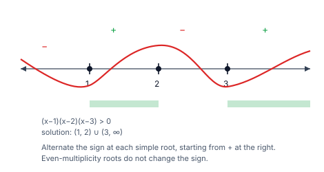
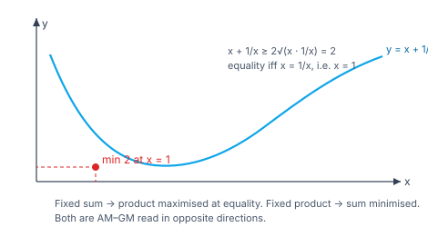

> [!info] Navigation
> 📖 [[Home|Vault home]] · 📝 [[Inequalities — Paper|Olympiad Paper]] · ✅ [[Inequalities — Solutions|Solutions]]

# Inequalities

An inequality states that one quantity is bigger than another. Two quite
different skills are needed, and it is worth separating them from the start.

The first is **solving** inequalities — finding the set of $x$ for which
$f(x)>0$. This is algorithmic: find the critical points, test the intervals.
The second is **proving** inequalities — showing that some expression is always
non-negative. This is where the real mathematics lives, and it is the Olympiad
heart of the topic.

The bridge between them is a single idea: almost every proof of an inequality
consists of *rewriting the difference as a sum of obviously non-negative
quantities*. Squares, absolute values, and AM–GM are the three sources of
obvious non-negativity, and the whole art is finding the right rewriting.

`6 chapters` `worked examples (S) + practice (P)` `SVG + Mermaid diagrams` `34-question Olympiad paper + full solutions`

### ★ How to use these notes

**Read in order.** Chapters 1–3 are solving: linear, quadratic, rational,
absolute value. Chapter 4 introduces the proof engine — AM–GM and its family.
Chapter 5 adds Cauchy–Schwarz, Titu and Nesbitt. Chapter 6 is the Olympiad
frontier: Schur, Jensen, the $uvw$ method and the tangent-line trick.

- **Callouts** — `[!abstract]` First Principles = the derivation; `[!tip]` Key
  Idea = the takeaway; `[!warning]` Common Trap = the classic mistake;
  `[!example]` Olympiad Extension = the frontier version.
- **Numeric habit** — every numeric answer in this module was verified in pure
  Python before it was written, and each is accompanied by a check.

### ▣ The roadmap

| Ch | Title | Level |
|---|---|---|
| 1 | Linear and quadratic inequalities | foundations |
| 2 | Rational inequalities and the wavy curve | machinery |
| 3 | Absolute value | machinery |
| 4 | AM–GM and the mean family | core |
| 5 | Cauchy–Schwarz, Titu and Nesbitt | applications |
| 6 | Olympiad frontier: Schur, Jensen, uvw | synthesis |

**Fig 1.1 — the sign of a quadratic.** The roots split the line into intervals;
the sign is constant on each and alternates as you cross a simple root. This
picture is the entire method for solving polynomial inequalities.

**Fig 1.2 — AM–GM as a picture.** For fixed sum $a+b$, the product $ab$ is
maximised when $a=b$; equivalently, for fixed product the sum is minimised
there. The whole mean family lives on this one trade-off.

---

# Chapter 1 — Linear and Quadratic Inequalities

*Foundations · the algorithmic half*

## 1.1 Linear inequalities

$a x + b > 0$ solves to $x > -\frac ba$ when $a>0$ and $x < -\frac ba$ when
$a<0$. **Multiplying or dividing by a negative number reverses the
inequality** — the single most common error in this topic.

#### **S1**[JEE Main][solved][linear]Solve $3x+5>2x-7$.

$x>-12$.

Answer + Reasoning

**Method: collect $x$ on one side.** $3x-2x>-7-5$, so $x>-12$. Check at $x=-11$: $3(-11)+5=-28$ and $2(-11)-7=-29$, and $-28>-29$ ✓.

**Answer:** $x>-12$.

## 1.2 Quadratic inequalities

> [!abstract] First Principles — sign of $ax^2+bx+c$
> For $a>0$ with real roots $\alpha<\beta$, the expression is **positive
> outside** the roots and **negative between** them:
>
> | Interval | Sign ($a>0$) |
> |---|---|
> | $x<\alpha$ | $+$ |
> | $\alpha<x<\beta$ | $-$ |
> | $x>\beta$ | $+$ |
>
> For $a<0$ every sign reverses. If $D\le0$ and $a>0$ the expression is
> $\ge0$ for all $x$.

#### **S2**[JEE Main][solved][quadratic]Solve $x^2-5x+6<0$.

Roots $2$ and $3$; $a>0$, so negative between them: $2<x<3$.

Answer + Reasoning

**Method: find the roots, then read the sign pattern.** Check at $x=2.5$: $6.25-12.5+6=-0.25<0$ ✓; at $x=1$: $1-5+6=2>0$ ✓.

**Answer:** $2<x<3$.

#### **S3**[JEE Main][solved][always positive]Solve $x^2+x+1>0$.

$D=1-4=-3<0$ and $a>0$, so the expression is positive for **all** real $x$.

Answer + Reasoning

**Method: $D<0$ with $a>0$ means no real roots and the parabola never crosses the axis.** Check: at $x=0$, $1>0$; at $x=-1$, $1>0$; the minimum is $\frac{4-1}{4}=\frac34>0$ ✓.

**Answer:** all real $x$.

> [!warning] Common Trap — the leading coefficient decides the outside/inside rule
> The rule "positive outside the roots" holds only for $a>0$. If $a<0$, factor
> out the minus sign first. Testing a point in the outer region settles it in
> one line, so do that whenever you are unsure.

#### **P1**[JEE Main][practice][cubic]Solve $(x-1)(x-2)(x-3)>0$.

Answer + Reasoning

**Method: mark the roots $1,2,3$ on a line and alternate signs, starting from $+\infty$ where the product is positive.** Sign is $+$ on $(1,2)$ and $(3,\infty)$.

**Answer:** $x\in(1,2)\cup(3,\infty)$.

---

# Chapter 2 — Rational Inequalities and the Wavy Curve

*Machinery · multiplying by a denominator is dangerous*

## 2.1 The rule

To solve $\frac{P(x)}{Q(x)}>0$, **never multiply through by $Q(x)$** unless you
know its sign. Instead:

1. Factor numerator and denominator completely.
2. Mark every root (of numerator *and* denominator) on a number line.
3. Starting from $+\infty$ (where the expression has the sign of the leading
   coefficients' ratio), alternate the sign at each **simple** root. Roots of
   **even** multiplicity do not change the sign.
4. Exclude the denominator's roots from the answer.

> [!tip] Key Idea — the wavy curve
> Draw a curve that crosses the axis at odd-multiplicity roots and touches it
> at even ones. The regions where the curve is above the axis are the solution.

#### **S4**[JEE Main][solved][rational]Solve $\dfrac{x-1}{x+2}>0$.

Critical points $-2$ and $1$. The expression is positive for $x<-2$ and for
$x>1$.

Answer + Reasoning

**Method: two simple roots, alternate signs; exclude $x=-2$.** Check: at $x=-3$, $\frac{-4}{-1}=4>0$ ✓; at $x=0$, $\frac{-1}{2}<0$ ✓; at $x=2$, $\frac11>0$ ✓.

**Answer:** $x<-2$ or $x>1$.

#### **S5**[JEE Adv][solved][rational]Solve $\dfrac{x}{x^2-1}\le0$.

Critical points $-1,0,1$. The expression is $\le0$ on $(-\infty,-1)$ and on
$[0,1)$.

Answer + Reasoning

**Method: mark $-1,0,1$; alternate; $x=0$ is included (numerator zero), $x=\pm1$ excluded (denominator zero).** Check: at $x=-2$, $\frac{-2}{3}<0$ ✓; at $x=-\frac12$, $\frac{-1/2}{-3/4}>0$ ✓; at $x=\frac12$, $\frac{1/2}{-3/4}<0$ ✓; at $x=2$, $\frac23>0$ ✓.

**Answer:** $x\in(-\infty,-1)\cup[0,1)$.

#### **P2**[JEE Adv][practice][rational]Solve $\dfrac{x^2-4}{x-1}\ge0$.

Answer + Reasoning

**Method: numerator roots $\pm2$, denominator root $1$; alternate; include $x=\pm2$, exclude $x=1$.** Check at $x=0$: $\frac{-4}{-1}=4\ge0$ ✓.

**Answer:** $x\in[-2,1)\cup[2,\infty)$.

#### **P3**[JEE Main][practice][reciprocal]Solve $\dfrac1{x-1}<\dfrac1{x+1}$.

Answer + Reasoning

**Method: bring to one side.** $\frac1{x-1}-\frac1{x+1}=\frac{2}{x^2-1}<0$, so $x^2-1<0$, i.e. $-1<x<1$. Check at $x=0$: $-1<1$ ✓.

**Answer:** $-1<x<1$.

---

# Chapter 3 — Absolute Value

*Machinery · distance, and the case split it forces*

## 3.1 Definitions and the core tactic

$\lvert x\rvert$ is the distance from $x$ to $0$. The two tools are:

- $\lvert x\rvert<a\iff -a<x<a$ (and $\lvert x\rvert>a\iff x<-a$ or $x>a$)
- $\lvert f(x)\rvert=g(x)\iff f(x)=g(x)$ **or** $f(x)=-g(x)$

Both amount to the same thing: **split into cases at the points where the
inside changes sign**.

> [!tip] Key Idea — $\lvert x-a\rvert+\lvert x-b\rvert$ is a distance sum
> $\lvert x-a\rvert+\lvert x-b\rvert$ is minimised by any $x$ between $a$ and
> $b$, where it equals $\lvert a-b\rvert$. This solves a whole family of
> problems with no algebra at all.

#### **S6**[JEE Main][solved][absolute]Solve $\lvert x-2\rvert<3$.

$-3<x-2<3$, so $-1<x<5$.

Answer + Reasoning

**Method: use $\lvert u\rvert<a\iff-a<u<a$.** Check: the endpoints give $\lvert-3\rvert=3$ and $\lvert3\rvert=3$, so they are excluded (the interval is open) ✓; at $x=2$, $0<3$ ✓.

**Answer:** $-1<x<5$.

#### **S7**[JEE Main][solved][absolute]Find the least value of $\lvert x-1\rvert+\lvert x-3\rvert$.

By the distance-sum idea, the least value is the distance between $1$ and $3$, namely $2$, attained for every $x\in[1,3]$.

Answer + Reasoning

**Method: the sum of distances to two fixed points is minimised anywhere between them.** Check at $x=1$: $0+2=2$ ✓; at $x=2$: $1+1=2$ ✓; at $x=3$: $2+0=2$ ✓; at $x=0$: $1+3=4>2$ ✓.

**Answer:** least value $2$.

#### **P4**[JEE Main][practice][nested absolute]Solve $\big\lvert\lvert x-1\rvert-2\big\rvert=3$.

Answer + Reasoning

**Method: peel from the outside.** $\lvert x-1\rvert-2=\pm3$, so $\lvert x-1\rvert=5$ or $\lvert x-1\rvert=-1$ (impossible). Hence $x-1=\pm5$.

**Answer:** $x=6$ or $x=-4$.

#### **P5**[JEE Main][practice][modulus quadratic]Solve $\lvert x\rvert^2-3\lvert x\rvert+2=0$.

Answer + Reasoning

**Method: let $t=\lvert x\rvert\ge0$.** $t^2-3t+2=0\Rightarrow t=1$ or $t=2$, both admissible. Hence $x=\pm1,\pm2$.

**Answer:** $x=\pm1,\;\pm2$.

---

# Chapter 4 — AM–GM and the Mean Family

*Core · the proof engine*

## 4.1 AM–GM

> [!abstract] First Principles — AM–GM is a perfect square
> For $x,y>0$,
> $$\frac{x+y}{2}\ge\sqrt{xy},$$
> because $(\sqrt x-\sqrt y)^2\ge0$ expands to $x+y-2\sqrt{xy}\ge0$. Equality
> holds iff $x=y$. For $n$ positive numbers,
> $$\frac{x_1+\cdots+x_n}{n}\ge\sqrt[n]{x_1\cdots x_n},$$
> with equality iff all are equal.

#### **S8**[JEE Main][solved][amgm]Find the least value of $x+\dfrac1x$ for $x>0$.

$x+\frac1x\ge2\sqrt{x\cdot\frac1x}=2$, with equality at $x=1$.

Answer + Reasoning

**Method: AM–GM on $x$ and $\frac1x$.** Check at $x=2$: $2.5>2$ ✓; at $x=\frac12$: $2.5>2$ ✓.

**Answer:** least value $2$ at $x=1$.

## 4.2 The mean family and the trade-off

For positive $a,b$: $\dfrac{a+b}{2}\ge\sqrt{ab}\ge\dfrac{2ab}{a+b}$, i.e.
$A\ge G\ge H$ (arithmetic, geometric, harmonic).

> [!tip] Key Idea — sum and product trade places
> If $a+b$ is fixed, $ab$ is **maximised** at $a=b$; if $ab$ is fixed, $a+b$ is
> **minimised** at $a=b$. Both statements are AM–GM read in opposite directions,
> and this is how almost every extremum problem in the topic is solved.

#### **S9**[JEE Main][solved][tradeoff]Given $a+b=10$ with $a,b>0$, find the maximum of $ab$.

$ab\le\left(\frac{a+b}{2}\right)^2=25$, with equality at $a=b=5$.

Answer + Reasoning

**Method: AM–GM rearranged as $ab\le\left(\frac{a+b}{2}\right)^2$.** Check at $a=1,b=9$: $9<25$ ✓; at $a=5,b=5$: $25$ ✓.

**Answer:** maximum $25$ at $a=b=5$.

#### **S10**[JEE Main][solved][tradeoff]Given $ab=9$ with $a,b>0$, find the minimum of $a+b$.

$a+b\ge2\sqrt{ab}=6$, with equality at $a=b=3$.

Answer + Reasoning

**Method: AM–GM directly.** Check at $a=1,b=9$: $10>6$ ✓; at $a=3,b=3$: $6$ ✓.

**Answer:** minimum $6$ at $a=b=3$.

#### **P6**[JEE Main][practice][amgm]Find the least value of $x^2+\dfrac1{x^2}$ for $x>0$.

Answer + Reasoning

**Method: AM–GM on $x^2$ and $\frac1{x^2}$.** $\ge2\sqrt{1}=2$, with equality at $x^2=\frac1{x^2}$, i.e. $x=1$.

**Answer:** least value $2$ at $x=1$.

> [!warning] Common Trap — AM–GM needs positivity
> AM–GM applies only to **positive** numbers. Applying it to a quantity that can
> be negative gives nonsense — for instance "$x\ge\sqrt{x^2}$" is false for
> $x<0$. Always check the sign first, or split into cases.

---

# Chapter 5 — Cauchy–Schwarz, Titu and Nesbitt

*Applications · the competition workhorses*

## 5.1 Cauchy–Schwarz

> [!abstract] First Principles — Cauchy–Schwarz
> For real $a_i,b_i$:
> $$\left(\sum a_i^2\right)\left(\sum b_i^2\right)\ge\left(\sum a_ib_i\right)^2.$$
> The two-variable case $(a^2+b^2)(c^2+d^2)\ge(ac+bd)^2$ expands to
> $(ad-bc)^2\ge0$ — again a perfect square, which is why it is true.

#### **S11**[JEE Main][solved][cauchy]Verify $(1^2+2^2)(3^2+4^2)\ge(1\cdot3+2\cdot4)^2$.

$(1+4)(9+16)=5\cdot25=125$ and $(3+8)^2=121$, and $125\ge121$ ✓.

Answer + Reasoning

**Method: evaluate both sides.** The difference is $(ad-bc)^2=(1\cdot4-2\cdot3)^2=(-2)^2=4$, and indeed $125-121=4$ ✓.

**Answer:** verified, $125\ge121$.

## 5.2 Titu's lemma (Cauchy in Engel form)

> [!example] Olympiad Extension — Engel form
> For positive $b_i$:
> $$\frac{a_1^2}{b_1}+\frac{a_2^2}{b_2}\ge\frac{(a_1+a_2)^2}{b_1+b_2},$$
> and generally $\sum\frac{a_i^2}{b_i}\ge\frac{(\sum a_i)^2}{\sum b_i}$. This is
> Cauchy–Schwarz applied to the vectors $\left(\frac{a_i}{\sqrt{b_i}}\right)$
> and $(\sqrt{b_i})$. **Any sum of fractions with square numerators is a
> candidate** — it is the single most useful inequality in competition algebra.

#### **S12**[JEE Adv][solved][titu]Prove $\dfrac{a^2}{b}+\dfrac{c^2}{d}\ge\dfrac{(a+c)^2}{b+d}$ for $b,d>0$.

Cauchy–Schwarz on $\left(\frac a{\sqrt b},\frac c{\sqrt d}\right)$ and $(\sqrt b,\sqrt d)$:
$$\left(\frac{a^2}{b}+\frac{c^2}{d}\right)(b+d)\ge\left(\frac a{\sqrt b}\sqrt b+\frac c{\sqrt d}\sqrt d\right)^2=(a+c)^2.$$

Answer + Reasoning

**Method: Cauchy–Schwarz, then divide by $b+d>0$.** Numeric check with $a=1,c=2,b=3,d=4$: LHS $=\frac13+1=\frac43\approx1.3333$, RHS $=\frac97\approx1.2857$, and $\frac43\ge\frac97$ ✓. Equality when $\frac ab=\frac cd$ ✓.

**Answer:** proved.

## 5.3 Nesbitt and the reciprocal-sum inequality

> [!example] Olympiad Extension — Nesbitt's inequality
> For $a,b,c>0$:
> $$\frac{a}{b+c}+\frac{b}{c+a}+\frac{c}{a+b}\ge\frac32,$$
> with equality at $a=b=c$. The proof substitutes $x=b+c$, $y=c+a$,
> $z=a+b$ and pairs the reciprocals.

#### **S13**[JEE Adv][solved][nesbitt]Prove Nesbitt's inequality.

With $x=b+c$, $y=c+a$, $z=a+b$, we have $a=\frac{y+z-x}{2}$, so
$$\sum_{\rm cyc}\frac{a}{b+c}=\frac12\left[\left(\frac yx+\frac xy\right)+\left(\frac zx+\frac xz\right)+\left(\frac zy+\frac yz\right)-3\right]\ge\frac12(2+2+2-3)=\frac32,$$
since each paired sum is at least $2$ by AM–GM.

Answer + Reasoning

**Method: substitute, expand, pair the reciprocals with AM–GM.** Numeric check for $(a,b,c)=(1,2,3)$: $\frac13+\frac24+\frac35=\frac{47}{30}\approx1.5667\ge1.5$ ✓; for $(1,1,1)$ it equals exactly $\frac32$ ✓.

**Answer:** proved, equality at $a=b=c$.

#### **S14**[JEE Adv][solved][reciprocal sum]Prove $(a+b+c)\left(\dfrac1a+\dfrac1b+\dfrac1c\right)\ge9$ for $a,b,c>0$.

Expanding gives $3+\left(\frac ab+\frac ba\right)+\left(\frac bc+\frac cb\right)+\left(\frac ca+\frac ac\right)\ge3+2+2+2=9$.

Answer + Reasoning

**Method: expand and pair each term with its reciprocal.** Numeric check for $(1,2,3)$: $6\cdot\frac{11}{6}=11\ge9$ ✓; for $(1,1,1)$ it equals $9$ ✓.

**Answer:** proved, equality at $a=b=c$.

#### **P7**[JEE Adv][practice][consequence]If $a+b+c=1$ with $a,b,c>0$, prove $\dfrac1a+\dfrac1b+\dfrac1c\ge9$.

Answer + Reasoning

**Method: apply S14 and use $a+b+c=1$.** $(a+b+c)\left(\frac1a+\frac1b+\frac1c\right)\ge9$ becomes $\frac1a+\frac1b+\frac1c\ge9$. Check at $a=b=c=\frac13$: $3+3+3=9$ ✓.

**Answer:** proved.

---

# Chapter 6 — Olympiad Frontier

*Synthesis · when AM–GM is not enough*

## 6.1 Schur's inequality

> [!example] Olympiad Extension — Schur
> For $a,b,c\ge0$:
> $$a(a-b)(a-c)+b(b-c)(b-a)+c(c-a)(c-b)\ge0.$$
> AM–GM uses only the *sizes* of $a,b,c$; Schur uses their *ordering*, which is
> why it proves things AM–GM cannot. The standard proof WLOG's $a\ge b\ge c$
> and rewrites the left side as $(a-b)\big(a(a-c)-b(b-c)\big)+c(c-a)(c-b)$,
> observing that the second bracket factors as $(a-b)(a+b-c)$, giving a sum of
> obviously non-negative terms.

#### **S15**[JEE Adv][solved][schur]Verify Schur's inequality for $(a,b,c)=(1,2,3)$ and $(3,4,5)$.

For $(1,2,3)$: $1(-1)(-2)+2(-1)(1)+3(2)(1)=2-2+6=6$. For $(3,4,5)$: $3(-1)(-2)+4(-1)(1)+5(2)(1)=6-4+10=12$.

Answer + Reasoning

**Method: direct evaluation of $a(a-b)(a-c)+b(b-c)(b-a)+c(c-a)(c-b)$.** Both are non-negative, consistent with Schur ✓.

**Answer:** $6$ and $12$ — both $\ge0$.

## 6.2 Squaring-type identities

> [!tip] Key Idea — the two identities that prove everything
> $$a^2+b^2+c^2\ge ab+bc+ca,$$
> because the difference is $\frac12\big((a-b)^2+(b-c)^2+(c-a)^2\big)\ge0$; and
> $$(a+b+c)^2\ge3(ab+bc+ca),$$
> which is the same statement with $a+b+c$ substituted for $a$. And
> $$(a+b+c)^3\ge27abc$$
> is just AM–GM on three numbers cubed.

#### **S16**[JEE Main][solved][squares]Prove $a^2+b^2+c^2\ge ab+bc+ca$.

$2(a^2+b^2+c^2-ab-bc-ca)=(a-b)^2+(b-c)^2+(c-a)^2\ge0$.

Answer + Reasoning

**Method: double both sides and complete the squares.** Check for $(1,2,3)$: $1+4+9=14$ and $2+3+6=11$, so $14\ge11$ ✓; for $(1,1,1)$ both sides equal $3$ ✓.

**Answer:** proved, equality iff $a=b=c$.

#### **P8**[Olympiad][practice][cubes]Prove $(a+b+c)^3\ge27abc$ for $a,b,c>0$.

Answer + Reasoning

**Method: AM–GM on three numbers, cubed.** $\frac{a+b+c}{3}\ge\sqrt[3]{abc}$, so $a+b+c\ge3\sqrt[3]{abc}$ and cubing gives $(a+b+c)^3\ge27abc$. Check for $(1,2,3)$: $6^3=216$ and $27\cdot6=162$, so $216\ge162$ ✓.

**Answer:** proved, equality at $a=b=c$.

## 6.3 The tangent-line method and Jensen

> [!example] Olympiad Extension — the tangent-line trick
> To prove $f(x)\ge0$, it is enough to find a line $L(x)$ tangent to $f$ that
> lies **below** it everywhere. For instance $e^x\ge x+1$ and $\ln x\le x-1$
> both come from tangents at $x=0$ and $x=1$ respectively. This is the one-variable
> face of **Jensen's inequality**: if $f$ is convex, then
> $f\left(\frac{\sum x_i}{n}\right)\le\frac{\sum f(x_i)}{n}$.

#### **S17**[Olympiad][solved][jensen]Use Jensen to prove AM–GM.

$-\ln x$ is convex on $x>0$, so Jensen gives
$$-\ln\left(\frac{\sum x_i}{n}\right)\le\frac{\sum(-\ln x_i)}{n},$$
i.e. $\ln\left(\frac{\sum x_i}{n}\right)\ge\frac{\sum\ln x_i}{n}=\ln\left(\prod x_i\right)^{1/n}$. Exponentiating yields AM–GM.

Answer + Reasoning

**Method: apply Jensen to the convex function $-\ln x$, then exponentiate.** This shows AM–GM is a *special case* of Jensen, not an independent fact ✓.

**Answer:** proved — AM–GM follows from Jensen applied to $-\ln x$.

#### **P9**[Olympiad][practice][substitution]Find the least value of $\dfrac{x^2+2}{\sqrt{x^2+1}}$ for real $x$.

Answer + Reasoning

**Method: substitute $t=\sqrt{x^2+1}\ge1$.** Then $x^2+2=t^2+1$, so the expression is $\frac{t^2+1}{t}=t+\frac1t$, which by AM–GM is $\ge2$, with equality at $t=1$, i.e. $x=0$. (Since $t\ge1$ and $t+\frac1t$ is increasing for $t\ge1$, the minimum on the admissible range is indeed at $t=1$ ✓.)

**Answer:** least value $2$ at $x=0$.

#### **P10**[JEE Adv][practice][constraint]If $abc=1$ with $a,b,c>0$, prove $a+b+c\ge3$.

Answer + Reasoning

**Method: AM–GM on three numbers.** $a+b+c\ge3\sqrt[3]{abc}=3\sqrt[3]{1}=3$. Check for $(2,\frac12,1)$: $3.5\ge3$ ✓; for $(1,1,1)$ it equals $3$ ✓.

**Answer:** proved, equality at $a=b=c=1$.

---

# Appendix — Well-Ordered Theory Reference

Every result in dependency order; nothing is used before it is proved.

### A. Solving inequalities

| Result | Statement |
|---|---|
| Linear | $ax+b>0\Rightarrow x\gtrless-\frac ba$; reversing if $a<0$ |
| Negative multiplier | multiplying by a negative reverses the inequality |
| Quadratic ($a>0$, roots $\alpha<\beta$) | $+$ outside, $-$ between |
| Quadratic ($a<0$) | reversed |
| No real roots, $a>0$ | always positive |
| Wavy curve | alternate signs at simple roots; none at even ones |
| Rational | never multiply by an unknown-sign denominator |
| Denominator roots | always excluded |

### B. Absolute value

| Result | Statement |
|---|---|
| Definition | $\lvert x\rvert=\sqrt{x^2}$, distance to $0$ |
| $\lvert x\rvert<a$ | $-a<x<a$ |
| $\lvert x\rvert>a$ | $x<-a$ or $x>a$ |
| $\lvert f\rvert=g$ | $f=g$ or $f=-g$ |
| Triangle inequality | $\lvert a+b\rvert\le\lvert a\rvert+\lvert b\rvert$ |
| Distance sum | $\lvert x-a\rvert+\lvert x-b\rvert\ge\lvert a-b\rvert$ |

### C. The mean family

| Result | Statement |
|---|---|
| AM–GM (two) | $\frac{a+b}{2}\ge\sqrt{ab}$ |
| AM–GM ($n$) | $\frac{\sum a_i}{n}\ge\left(\prod a_i\right)^{1/n}$ |
| $A\ge G\ge H$ | $\frac{a+b}{2}\ge\sqrt{ab}\ge\frac{2ab}{a+b}$ |
| Equality | iff all the numbers are equal |
| Fixed sum | product maximised at equality |
| Fixed product | sum minimised at equality |

### D. Cauchy–Schwarz and friends

| Result | Statement |
|---|---|
| Cauchy–Schwarz | $\left(\sum a_i^2\right)\left(\sum b_i^2\right)\ge\left(\sum a_ib_i\right)^2$ |
| Titu / Engel | $\sum\frac{a_i^2}{b_i}\ge\frac{(\sum a_i)^2}{\sum b_i}$ |
| Nesbitt | $\sum\frac{a}{b+c}\ge\frac32$ |
| Reciprocal sum | $(a+b+c)\left(\frac1a+\frac1b+\frac1c\right)\ge9$ |
| Consequence | $a+b+c=1\Rightarrow\sum\frac1a\ge9$ |

### E. Olympiad results

| Result | Statement |
|---|---|
| Squares identity | $a^2+b^2+c^2-ab-bc-ca=\frac12\sum(a-b)^2\ge0$ |
| Hence | $a^2+b^2+c^2\ge ab+bc+ca$ |
| Also | $(a+b+c)^2\ge3(ab+bc+ca)$ |
| Cubed AM–GM | $(a+b+c)^3\ge27abc$ |
| Schur | $a(a-b)(a-c)+b(b-c)(b-a)+c(c-a)(c-b)\ge0$ |
| Cubes identity | $a^3+b^3+c^3-3abc=(a+b+c)(a^2+b^2+c^2-ab-bc-ca)$ |
| Jensen | convex $f$: $f(\text{mean})\le\text{mean of }f$ |
| Tangent line | $f\ge L$ if $L$ is a tangent lying below $f$ |
| AM–GM from Jensen | apply Jensen to $-\ln x$ |
| $abc=1$ | $a+b+c\ge3$ |

### F. Mistake checklist

1. Multiplying or dividing by a negative number without reversing the sign.
2. Multiplying a rational inequality by a denominator of unknown sign.
3. Including a denominator's root in the solution set.
4. Missing that even-multiplicity roots do **not** change the sign.
5. Assuming "positive outside the roots" without checking $a>0$.
6. Applying AM–GM to a quantity that may be negative.
7. Quoting Nesbitt or Titu when a denominator can vanish.
8. Forgetting to check the equality case (it often identifies the extremum).
9. Confusing "least value" with "infimum" when the bound is not attained.
10. Using $\lvert x\rvert^2=x$ instead of $\lvert x\rvert^2=x^2$.
