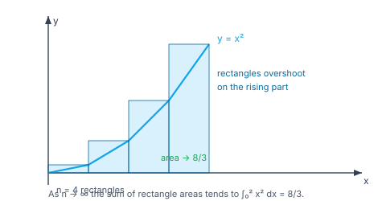
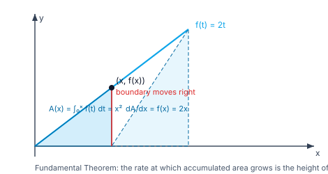

> [!info] Navigation
> 📖 [[Home|Vault home]] · 📝 [[Integration — Paper|Olympiad Paper]] · ✅ [[Integration — Solutions|Solutions]]

# Integration

Differentiation is mechanical; **integration is an art**. There is no product
rule, no chain rule, no quotient rule — instead there is a *toolkit*: substitution,
by parts, partial fractions, and a library of standard forms. Knowing which tool
fits which integrand is the whole skill.

The indefinite integral is the inverse of the derivative (built in
[[Differentiation-and-Methods]]); the definite integral is the *area* under a
curve, defined as a limit of Riemann sums (built in [[Limits-and-Continuity]]).
The **Fundamental Theorem of Calculus** is the bridge between them — the single
most important theorem in the subject.

`6 chapters` `worked examples (S) + practice (P)` `SVG + Mermaid diagrams` `34-question Olympiad paper + full solutions`

### ★ How to use these notes

**Read in order.** Chapter 1 fixes notation and the meaning of $+C$; Chapters 2–4
are the technique toolkit (substitution, by parts, partial fractions); Chapter 5
is the definite integral and the FTC; Chapter 6 is the frontier — the
substitutions and tricks that crack integrals no elementary method touches.

- **Callouts** — `[!abstract]` First Principles = the derivation; `[!tip]` Key
  Idea = the takeaway; `[!warning]` Common Trap = the classic mistake;
  `[!example]` Olympiad Extension = the frontier version.
- **Numeric habit** — check any definite integral by a Riemann sum
  $\sum f(x_i)\Delta x$ with large $n$, or by differentiating your answer.

### ▣ The roadmap

| Ch | Title | Level |
|---|---|---|
| 1 | Antiderivatives & the indefinite integral | foundations |
| 2 | Substitution & standard forms | machinery |
| 3 | Integration by parts | machinery |
| 4 | Partial fractions & rational functions | machinery |
| 5 | Definite integrals & the Fundamental Theorem | core |
| 6 | Olympiad frontier | synthesis |

**Fig 1.1 — a definite integral as a limit of Riemann sums.** The area under
$y=x^2$ on $[0,2]$ is approached by sums of rectangles; as $n\to\infty$ the sum
tends to $\int_0^2 x^2\,dx=\frac83$.

**Fig 1.2 — the Fundamental Theorem.** $A(x)=\int_0^x f(t)\,dt$ accumulates area;
its rate of growth is exactly the height $f(x)$ of the curve, so
$\dfrac{dA}{dx}=f(x)$.

---

# Chapter 1 — Antiderivatives & the Indefinite Integral

*Foundations · running differentiation backwards*

## 1.1 The definition

> [!abstract] First Principles — antiderivative and indefinite integral
> An **antiderivative** of $f$ is a function $F$ with $F'=f$. The **indefinite
> integral** $\int f(x)\,dx$ is the *family* of all such $F$:
> $$\int f(x)\,dx=F(x)+C,\qquad C\in\mathbb R,$$
> because two functions with the same derivative differ by a constant (on an
> interval).

> [!warning] Common Trap — forgetting $+C$
> $\int 2x\,dx=x^2$ is *incomplete*; the answer is a family $x^2+C$. In a
> definite integral the constant cancels, so $+C$ matters only for indefinite
> integrals — and for initial-value problems, where it is the whole point.

#### **S1**[JEE Main][solved][basic]Find $\int x^3\,dx$.

$F=\dfrac{x^4}{4}$ works since $\frac{d}{dx}\frac{x^4}{4}=x^3$.

Answer + Reasoning

**Method: reverse the power rule** $\frac{d}{dx}x^{n+1}=(n+1)x^n$, so divide by $n+1$.

**Answer:** $\dfrac{x^4}{4}+C$.

#### **S2**[JEE Main][solved][basic]Find $\int\sin(2x)\,dx$.

Try $-\cos(2x)$: its derivative is $2\sin(2x)$ — twice too big, so halve it.

Answer + Reasoning

**Method: reverse the chain rule.** $-\frac12\cos(2x)$ has derivative $\frac12\cdot2\sin(2x)=\sin(2x)$.

**Answer:** $-\dfrac12\cos(2x)+C$.

#### **P1**[JEE Main][practice][basic]Find $\int(3x^2+2x)\,dx$.

Answer + Reasoning

**Method: linearity term-by-term.** $x^3+x^2$.

**Answer:** $x^3+x^2+C$.

#### **P2**[JEE Main][practice][basic]Find $\int e^{3x}\,dx$.

Answer + Reasoning

**Method: reverse the chain rule.** $\frac13e^{3x}$.

**Answer:** $\dfrac13e^{3x}+C$.

## 1.2 The standard library

Every integration technique ultimately reduces to these. Memorise them, but know
*where each comes from*.

| Integral | Result |
|---|---|
| $\int x^n\,dx$ | $\dfrac{x^{n+1}}{n+1}+C$ ($n\ne-1$) |
| $\int\dfrac1x\,dx$ | $\ln\lvert x\rvert+C$ |
| $\int e^x\,dx$ | $e^x+C$ |
| $\int\sin x\,dx$ | $-\cos x+C$ |
| $\int\cos x\,dx$ | $\sin x+C$ |
| $\int\sec^2x\,dx$ | $\tan x+C$ |
| $\int\dfrac1{x^2+a^2}\,dx$ | $\dfrac1a\tan^{-1}\!\dfrac xa+C$ |
| $\int\dfrac1{\sqrt{a^2-x^2}}\,dx$ | $\sin^{-1}\!\dfrac xa+C$ |

> [!tip] Key Idea — why $\int\frac1x\,dx=\ln\lvert x\rvert$ is special
> The power rule fails at $n=-1$ (it would divide by zero). The logarithm is not
> a special case to memorise — it is the *only* function whose derivative is
> $\frac1x$, and the absolute value handles both signs of $x$.

---

# Chapter 2 — Substitution & Standard Forms

*Machinery · the chain rule, reversed*

## 2.1 The substitution method

> [!abstract] First Principles — undoing the chain rule
> Since $\frac{d}{dx}F(g(x))=f(g(x))\,g'(x)$, we have
> $$\int f(g(x))\,g'(x)\,dx=\int f(u)\,du\quad\text{with }u=g(x).$$
> In definite form: $\int_a^b f(g(x))g'(x)\,dx=\int_{g(a)}^{g(b)}f(u)\,du$ — the
> limits change with the substitution.

#### **S3**[JEE Main][solved][substitution]Find $\int2x(x^2+1)^5\,dx$.

Set $u=x^2+1$, so $du=2x\,dx$: $\int u^5\,du=\dfrac{u^6}{6}$.

Answer + Reasoning

**Method: spot $g'(x)$ as a factor.** $2x$ is the derivative of $x^2+1$.

**Answer:** $\dfrac{(x^2+1)^6}{6}+C$.

#### **S4**[JEE Main][solved][substitution]Find $\int xe^{x^2}\,dx$.

$u=x^2$, $du=2x\,dx$, so $x\,dx=\frac{du}{2}$: $\frac12\int e^u\,du=\frac12e^u$.

Answer + Reasoning

**Method: substitution.** $\frac{d}{dx}\frac12e^{x^2}=xe^{x^2}$ ✓.

**Answer:** $\dfrac12e^{x^2}+C$.

#### **P3**[JEE Main][practice][substitution]Find $\int\tan x\,dx$.

Answer + Reasoning

**Method: rewrite $\tan x=\frac{\sin x}{\cos x}$ and substitute $u=\cos x$, $du=-\sin x\,dx$.** $-\int\frac{du}{u}=-\ln\lvert u\rvert$.

**Answer:** $-\ln\lvert\cos x\rvert+C=\ln\lvert\sec x\rvert+C$.

#### **P4**[JEE Main][practice][substitution]Evaluate $\int_0^1 2x\,e^{x^2}\,dx$.

Answer + Reasoning

**Method: substitute $u=x^2$; limits $0\to0$ and $1\to1$.** $\int_0^1 e^u\,du=e-1$.

**Answer:** $e-1\approx1.7183$.

## 2.2 The inverse-trigonometric standard forms

> [!abstract] First Principles — completing the square
> $\dfrac1{x^2+a^2}$ and $\dfrac1{\sqrt{a^2-x^2}}$ are recognised by *shape*.
> When the denominator is not in that shape, **complete the square** first.

#### **S5**[JEE Main][solved][standard]Find $\int\dfrac{dx}{x^2+2x+2}$.

$x^2+2x+2=(x+1)^2+1$, so with $u=x+1$: $\int\dfrac{du}{u^2+1}=\tan^{-1}u$.

Answer + Reasoning

**Method: complete the square, then the arctangent standard form.**

**Answer:** $\tan^{-1}(x+1)+C$.

#### **P5**[JEE Adv][practice][standard]Evaluate $\int_0^1\dfrac{dx}{x^2+2x+2}$.

Answer + Reasoning

**Method: as S5, with limits $u=1\to2$.** $\tan^{-1}(2)-\tan^{-1}(1)=1.10715-0.78540$.

**Answer:** $\tan^{-1}(2)-\dfrac{\pi}{4}\approx0.32175$.

---

# Chapter 3 — Integration by Parts

*Machinery · the product rule, reversed*

## 3.1 The formula

> [!abstract] First Principles — integrating the product rule
> $(uv)'=u'v+uv'$, so $uv'=(uv)'-u'v$. Integrating:
> $$\int u\,dv=uv-\int v\,du.$$
> The trick is that the new integral $\int v\,du$ should be *easier* than the
> original.

> [!tip] Key Idea — LIATE: choose $u$ in this order
> **L**ogarithm · **I**nverse trig · **A**lgebraic (polynomials) · **T**rig ·
> **E**xponential. Take the *earlier* type as $u$ (to be differentiated), the
> later as $dv$ (to be integrated).

#### **S6**[JEE Main][solved][parts]Find $\int xe^x\,dx$.

LIATE: $u=x$ (algebraic), $dv=e^xdx$, so $du=dx$, $v=e^x$:
$\int xe^xdx=xe^x-\int e^xdx=xe^x-e^x$.

Answer + Reasoning

**Method: by parts with LIATE.** Check: $\frac{d}{dx}e^x(x-1)=e^x(x-1)+e^x=xe^x$ ✓.

**Answer:** $e^x(x-1)+C$.

#### **S7**[JEE Adv][solved][parts]Find $\int\ln x\,dx$.

Take $u=\ln x$, $dv=dx$: $\int\ln x\,dx=x\ln x-\int x\cdot\frac1x\,dx=x\ln x-x$.

Answer + Reasoning

**Method: by parts, $dv=dx$.** Check: $\frac{d}{dx}(x\ln x-x)=\ln x+1-1=\ln x$ ✓.

**Answer:** $x\ln x-x+C$.

#### **P6**[JEE Adv][practice][parts]Find $\int x^2e^x\,dx$.

Answer + Reasoning

**Method: by parts twice (or tabular).** First: $x^2e^x-2\int xe^xdx$; second: $\int xe^xdx=e^x(x-1)$. Total: $e^x(x^2-2x+2)$.

**Answer:** $e^x(x^2-2x+2)+C$.

#### **P7**[JEE Adv][practice][parts]Find $\int e^x\sin x\,dx$.

Answer + Reasoning

**Method: by parts twice and solve for the integral.** Writing $I=\int e^x\sin x\,dx$, two applications give $I=\frac12e^x(\sin x-\cos x)$.

**Answer:** $\dfrac12e^x(\sin x-\cos x)+C$.

> [!warning] Common Trap — the circular integral
> For $\int e^x\sin x\,dx$ the same integral reappears on both sides. Don't stop
> at "$I=I$" — move it across and divide; the factor $\frac12$ is the answer.

---

# Chapter 4 — Partial Fractions & Rational Functions

*Machinery · splitting a fraction into integrable pieces*

## 4.1 The decomposition

> [!abstract] First Principles — why partial fractions work
> A proper rational function $\frac{P(x)}{Q(x)}$ ($\deg P<\deg Q$) splits into a
> sum of terms whose denominators are the *irreducible factors* of $Q$. Each
> such term is a standard integral: $\int\frac{A}{x-a}dx=A\ln\lvert x-a\rvert$ and
> $\int\frac{Ax+B}{x^2+px+q}dx$ splits into a log and an arctangent.

| Factor of $Q$ | Term in the decomposition |
|---|---|
| $(x-a)$ distinct | $\dfrac{A}{x-a}$ |
| $(x-a)^k$ repeated | $\dfrac{A_1}{x-a}+\dfrac{A_2}{(x-a)^2}+\cdots+\dfrac{A_k}{(x-a)^k}$ |
| $x^2+px+q$ irreducible | $\dfrac{Ax+B}{x^2+px+q}$ |

#### **S8**[JEE Main][solved][partial fractions]Evaluate $\int\dfrac{dx}{(x+1)(x+2)}$.

$\dfrac1{(x+1)(x+2)}=\dfrac1{x+1}-\dfrac1{x+2}$, so the integral is $\ln\lvert x+1\rvert-\ln\lvert x+2\rvert=\ln\left\lvert\dfrac{x+1}{x+2}\right\rvert$.

Answer + Reasoning

**Method: partial fractions with distinct linear factors.**

**Answer:** $\ln\left\lvert\dfrac{x+1}{x+2}\right\rvert+C$.

#### **P8**[JEE Adv][practice][partial fractions]Evaluate $\int\dfrac{x+1}{x^2+2x+2}\,dx$.

Answer + Reasoning

**Method: the numerator is the derivative of the denominator up to a factor.** $\frac12\ln(x^2+2x+2)$ plus a remainder: $x+1=\frac12(2x+2)+\frac12\cdot1$... precisely, $\int\frac{x+1}{x^2+2x+2}dx=\frac12\ln(x^2+2x+2)+\frac12\tan^{-1}(x+1)$.

**Answer:** $\dfrac12\ln(x^2+2x+2)+\dfrac12\tan^{-1}(x+1)+C$.

---

# Chapter 5 — Definite Integrals & the Fundamental Theorem

*Core · where area and antiderivatives meet*

## 5.1 The two parts of the theorem

> [!abstract] First Principles — FTC Part 1 (differentiating an integral)
> Let $A(x)=\int_a^x f(t)\,dt$. Then $A'(x)=f(x)$: *the rate at which accumulated
> area grows is the height of the curve*. Proof: $A(x+h)-A(x)=\int_x^{x+h}f$,
> and for small $h$ the integrand is nearly constant $f(x)$, so the difference
> quotient $\to f(x)$.

> [!abstract] First Principles — FTC Part 2 (evaluating an integral)
> If $F'=f$ then $\int_a^b f(x)\,dx=F(b)-F(a)$. So the *area* is computed by an
> *antiderivative* — this is the theorem that makes integration a practical
> subject rather than a limiting process.

#### **S9**[JEE Main][solved][FTC]Evaluate $\int_0^1 x^2\,dx$.

$F=\frac{x^3}{3}$; $F(1)-F(0)=\frac13$.

Answer + Reasoning

**Method: FTC Part 2.** Check by Riemann sum: $\frac1n\sum_{i=1}^n\frac{i^2}{n^2}=\frac{(n+1)(2n+1)}{6n^2}\to\frac13$ ✓.

**Answer:** $\dfrac13$.

#### **S10**[JEE Main][solved][FTC]Differentiate $A(x)=\int_0^x t^2\,dt$.

Answer + Reasoning

**Method: FTC Part 1.** $A'(x)=x^2$. (Indeed $A(x)=\frac{x^3}{3}$.)

**Answer:** $A'(x)=x^2$.

#### **P9**[JEE Main][practice][FTC]Evaluate $\int_0^{\pi}\sin x\,dx$.

Answer + Reasoning

**Method: FTC Part 2.** $[-\cos x]_0^\pi=1+1=2$.

**Answer:** $2$.

## 5.2 Properties of definite integrals

> [!abstract] First Principles — the five properties you will use daily
> 1. **Additivity:** $\int_a^c=\int_a^b+\int_b^c$.
> 2. **Reversal:** $\int_a^b=-\int_b^a$; $\int_a^a=0$.
> 3. **Linearity:** $\int(\alpha f+\beta g)=\alpha\int f+\beta\int g$.
> 4. **Even/odd:** if $f$ is even, $\int_{-a}^{a}f=2\int_0^a f$; if odd, $\int_{-a}^{a}f=0$.
> 5. **King's property:** $\int_0^{a}f(x)\,dx=\int_0^{a}f(a-x)\,dx$ — the
>    substitution $x\mapsto a-x$ reverses the interval.

#### **S11**[JEE Adv][solved][odd]Evaluate $\int_{-1}^{1}x^3\,dx$.

$x^3$ is odd and the interval is symmetric, so the integral is $0$.

Answer + Reasoning

**Method: odd-function property.** (Direct: $[\frac{x^4}4]_{-1}^1=0$ ✓.)

**Answer:** $0$.

#### **S12**[Olympiad][solved][King]Evaluate $\int_0^{\pi/2}\dfrac{dx}{1+\tan x}$.

By King's property with $a=\frac\pi2$: $I=\int_0^{\pi/2}\dfrac{dx}{1+\tan(\frac\pi2-x)}=\int_0^{\pi/2}\dfrac{dx}{1+\cot x}$. Adding, $2I=\int_0^{\pi/2}\left(\frac1{1+\tan x}+\frac1{1+\cot x}\right)dx$. Since $\frac1{1+\tan x}+\frac1{1+\cot x}=1$, we get $2I=\frac\pi2$.

Answer + Reasoning

**Method: King's property, then add the two forms.** $\frac1{1+u}+\frac1{1+1/u}=\frac1{1+u}+\frac{u}{u+1}=1$.

**Answer:** $\dfrac{\pi}{4}$.

#### **P10**[JEE Adv][practice][property]Evaluate $\int_0^{\pi/2}\sin^2x\,dx$.

Answer + Reasoning

**Method: $\sin^2x+\cos^2x=1$ and King's property.** $I=\int\sin^2x$, and by King's property $I=\int\cos^2x$, so $2I=\int_0^{\pi/2}1\,dx=\frac\pi2$.

**Answer:** $\dfrac{\pi}{4}$.

#### **P11**[JEE Adv][practice][property]Evaluate $\int_{-\pi/2}^{\pi/2}\sin^5x\,dx$.

Answer + Reasoning

**Method: odd function on a symmetric interval.**

**Answer:** $0$.

---

# Chapter 6 — Olympiad Frontier

*Synthesis · the tricks that beat the standard toolkit*

## 6.1 The universal trigonometric substitution

> [!example] Olympiad Extension — $t=\tan\frac x2$
> For a rational function of $\sin x$ and $\cos x$, the substitution
> $t=\tan\frac x2$ converts it to a *rational function of $t$*, which partial
> fractions can always handle:
> $$\sin x=\frac{2t}{1+t^2},\qquad \cos x=\frac{1-t^2}{1+t^2},\qquad dx=\frac{2\,dt}{1+t^2}.$$
> This is the last resort — often a cleverer symmetry (King's property) is
> faster.

#### **S13**[Olympiad][solved][t-substitution]Evaluate $\int_0^{\pi/2}\dfrac{dx}{2+\cos x}$.

$t=\tan\frac x2$: $\cos x=\frac{1-t^2}{1+t^2}$, $dx=\frac{2\,dt}{1+t^2}$, limits $0\to0$ and $\frac\pi2\to1$. The integrand becomes $\dfrac{2}{3+t^2}$, so $I=\int_0^1\dfrac{2}{3+t^2}dt=\dfrac{2}{\sqrt3}\tan^{-1}\!\frac{t}{\sqrt3}\Big|_0^1=\dfrac{2}{\sqrt3}\tan^{-1}\!\frac1{\sqrt3}=\dfrac{2}{\sqrt3}\cdot\dfrac\pi6=\dfrac{\pi}{3\sqrt3}$.

Answer + Reasoning

**Method: universal substitution, then arctangent standard form.** $\frac{2}{3+t^2}=\frac23\cdot\frac1{1+(t/\sqrt3)^2}$.

**Answer:** $\dfrac{\pi}{3\sqrt3}\approx0.6046$.

## 6.2 Differentiation under the integral sign

> [!example] Olympiad Extension — Feynman's trick
> Insert a parameter and differentiate: if $I(a)=\int_a^b f(x,a)\,dx$ and $f$ is
> nice, then $I'(a)=\int_a^b\frac{\partial f}{\partial a}\,dx$. A hard integral
> can become an easy one after differentiating with respect to the parameter.

#### **S14**[Olympiad][solved][Feynman]Evaluate $\int_0^1 x\ln x\,dx$.

Introduce $I(a)=\int_0^1 x^a\,dx=\dfrac1{a+1}$. Then $I'(a)=\int_0^1x^a\ln x\,dx=-\dfrac1{(a+1)^2}$. At $a=1$: $\int_0^1x\ln x\,dx=-\dfrac14$.

Answer + Reasoning

**Method: differentiate $\int_0^1 x^a dx$ with respect to $a$.** Check by parts: $\int x\ln x=\frac{x^2}{2}\ln x-\frac{x^2}4$, giving $-\frac14$ ✓.

**Answer:** $-\dfrac14$.

#### **P12**[Olympiad][practice][improper]Evaluate $\int_0^\infty e^{-x}\,dx$.

Answer + Reasoning

**Method: improper integral as a limit.** $\lim_{R\to\infty}[-e^{-x}]_0^R=1$.

**Answer:** $1$.

#### **P13**[Olympiad][practice][log integral]Evaluate $\int_0^1\ln x\,dx$.

Answer + Reasoning

**Method: by parts, $u=\ln x$, $dv=dx$; handle the limit at $0$.** $[x\ln x-x]_0^1=-1$ since $x\ln x\to0$.

**Answer:** $-1$.

#### **P14**[Olympiad][practice][log integral]Evaluate $\int_0^1(\ln x)^2\,dx$.

Answer + Reasoning

**Method: by parts twice, or differentiate $I(a)=\int_0^1x^a dx$ twice.** $I''(a)=\int_0^1x^a(\ln x)^2dx=\frac2{(a+1)^3}$; at $a=0$: $2$.

**Answer:** $2$.

## 6.3 Reduction formulae and Wallis

> [!example] Olympiad Extension — Wallis's integrals
> Let $I_n=\int_0^{\pi/2}\sin^nx\,dx$. By parts,
> $I_n=\dfrac{n-1}{n}I_{n-2}$, with $I_0=\frac\pi2$ and $I_1=1$. Hence
> $I_{2m}=\dfrac{\pi}{2}\cdot\dfrac{(2m)!}{2^{2m}(m!)^2}$ and $I_{2m+1}=\dfrac{2^{2m}(m!)^2}{(2m+1)!}$.
> Wallis's product for $\pi$ follows by taking $n\to\infty$ in $\frac{I_{2n}}{I_{2n+1}}$.

#### **S15**[Olympiad][solved][Wallis]Find $\int_0^{\pi/2}\sin^6x\,dx$.

$I_6=\frac56\cdot\frac34\cdot\frac12\cdot I_0=\frac{15}{96}\cdot\frac\pi2=\frac{5\pi}{32}$.

Answer + Reasoning

**Method: reduction formula.** $\frac56\cdot\frac34\cdot\frac12=\frac{15}{96}=\frac5{32}$.

**Answer:** $\dfrac{5\pi}{32}\approx0.4909$.

#### **P15**[Olympiad][practice][symmetry]Evaluate $\int_0^\infty\dfrac{\ln x}{1+x^2}\,dx$.

Answer + Reasoning

**Method: substitute $x=1/u$.** The integral maps to its own negative: $dx=-\frac{du}{u^2}$, $\ln x=-\ln u$, so $I=\int_\infty^0\frac{-\ln u}{1+1/u^2}\cdot\frac{-du}{u^2}=\int_0^\infty\frac{-\ln u}{u^2+1}du=-I$, hence $I=0$.

**Answer:** $0$.

---

# Appendix — Well-Ordered Theory Reference

Every result in dependency order; nothing is used before it is proved.

### A. Indefinite integration

| Result | Statement |
|---|---|
| Antiderivative | $F'=f$ |
| Indefinite integral | $\int f\,dx=F+C$ |
| Linearity | $\int(\alpha f+\beta g)=\alpha\int f+\beta\int g$ |
| Power rule | $\int x^n dx=\frac{x^{n+1}}{n+1}$ ($n\ne-1$) |
| Log case | $\int\frac1x dx=\ln\lvert x\rvert$ |

### B. Techniques

| Result | Statement |
|---|---|
| Substitution | $\int f(g)g' dx=\int f(u)du$, $u=g(x)$ |
| By parts | $\int u\,dv=uv-\int v\,du$; LIATE picks $u$ |
| Partial fractions | split on the irreducible factors of $Q$ |
| Universal trig sub | $t=\tan\frac x2$: $\sin x=\frac{2t}{1+t^2}$, $\cos x=\frac{1-t^2}{1+t^2}$, $dx=\frac{2dt}{1+t^2}$ |

### C. Definite integrals

| Result | Statement |
|---|---|
| FTC Part 1 | $\frac{d}{dx}\int_a^x f(t)dt=f(x)$ |
| FTC Part 2 | $\int_a^b f=F(b)-F(a)$ when $F'=f$ |
| Additivity | $\int_a^c=\int_a^b+\int_b^c$ |
| Reversal | $\int_a^b=-\int_b^a$ |
| Even function | $\int_{-a}^{a}f=2\int_0^a f$ |
| Odd function | $\int_{-a}^{a}f=0$ |
| King's property | $\int_0^a f(x)dx=\int_0^a f(a-x)dx$ |
| Riemann sum | $\int_a^b f=\lim_{n\to\infty}\frac{b-a}{n}\sum_{i=1}^n f\big(a+i\frac{b-a}{n}\big)$ |

### D. Frontier

| Result | Statement |
|---|---|
| Feynman's trick | $\frac{d}{da}\int f(x,a)dx=\int\frac{\partial f}{\partial a}dx$ |
| Wallis reduction | $I_n=\frac{n-1}{n}I_{n-2}$, $I_0=\frac\pi2$, $I_1=1$ |
| Improper integrals | $\int_a^\infty f=\lim_{R\to\infty}\int_a^R f$ |
| Dirichlet | $\int_0^\infty\frac{\sin x}{x}dx=\frac\pi2$ |

### E. Mistake checklist

1. Dropping $+C$ from an indefinite integral.
2. Forgetting to **change the limits** after a substitution in a definite integral.
3. Choosing $u$ and $dv$ the wrong way round in by parts (use LIATE).
4. Getting $I=I$ in a circular by-parts problem instead of solving for $I$.
5. Using $\ln x$ instead of $\ln\lvert x\rvert$ for $\int\frac1x dx$ over negative $x$.
6. Claiming an even/odd shortcut when the interval is not symmetric.
7. Treating a divergent improper integral as finite.
8. Reaching for $t=\tan\frac x2$ before checking King's property for a shortcut.
