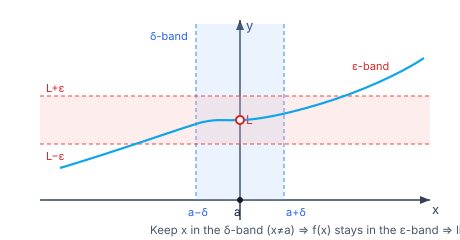

> [!info] Navigation
> 📖 [[Home|Vault home]] · 📝 [[Limits-and-Continuity — Paper|Olympiad Paper]] · ✅ [[Limits-and-Continuity — Solutions|Solutions]]

# Limits and Continuity

The gateway to calculus. Everything in differentiation and integration is a
*limit in disguise* — the derivative is a limit of a difference quotient, the
integral a limit of Riemann sums. This module builds the limit idea from the
ground up (the $\varepsilon$-$\delta$ definition), the machinery to compute
limits, **continuity** and the Intermediate Value Theorem, and pushes on to the
Olympiad frontier: sequential criteria, Stolz–Cesàro, Stirling, and limits of
sums. Every claim is *derived*, every numeric answer *verified*.

`6 chapters` `worked examples (S) + practice (P)` `SVG + Mermaid diagrams` `32-question Olympiad paper + full solutions`

### ★ How to use these notes

**Read in order.** The $\varepsilon$-$\delta$ definition (Chapter 1) is
load-bearing: every later "obvious" limit law is a repackaging of it. Chapter 2
turns the definition into a computation toolkit; Chapter 3 uses limits to define
continuity; Chapters 4–6 climb to the Olympiad frontier.

- **Callouts** — `[!abstract]` First Principles = the derivation; `[!tip]` Key
  Idea = the takeaway; `[!warning]` Common Trap = the classic mistake;
  `[!example]` Olympiad Extension = the frontier version.
- **Small-case / numeric habit** — for any limit, sanity-check by evaluating
  $f$ at points very close to the target and watching it settle.

### ▣ The roadmap

| Ch | Title | Level |
|---|---|---|
| 1 | What a limit is ($\varepsilon$-$\delta$) | foundations |
| 2 | Computing limits (the machinery) | machinery |
| 3 | Continuity | core |
| 4 | Differentiability & continuity tools | applications |
| 5 | Olympiad techniques | frontier |
| 6 | Synthesis — the Olympiad frontier | synthesis |

**Fig 1.1 — the $\varepsilon$-$\delta$ picture.** Shrink the $\delta$-band on the
$x$-axis; the curve is trapped inside the $\varepsilon$-band around $L$. The
value *at* $a$ is irrelevant — only the approach matters.

---

# Chapter 1 — What a Limit Is

*Foundations · the ε–δ definition, one-sided limits, limits at infinity, limit laws*

Before any computation we must say precisely what "$\to$" means. A limit is a
*prediction*: no matter how tight a tolerance $\varepsilon$ you demand around
$L$, the function eventually stays inside it as $x$ approaches $a$.

## 1.1 The intuitive idea

Write $\displaystyle \lim_{x\to a} f(x) = L$ and read it: *as $x$ gets
arbitrarily close to $a$ (but $x \ne a$), $f(x)$ gets arbitrarily close to $L$.*

> [!abstract] First Principles — the ε–δ definition
> $\lim_{x\to a} f(x) = L$ means: **for every** $\varepsilon > 0$ **there
> exists** a $\delta > 0$ such that
> $$0 < |x - a| < \delta \quad\Longrightarrow\quad |f(x) - L| < \varepsilon .$$
> Read it as a game. You pick $\varepsilon$ (a tolerance on the output); I must
> answer with a $\delta$ (a tolerance on the input) that works. If I can always
> answer, the limit is $L$. Note $0 < |x-a|$: the point $x=a$ itself is
> *excluded* — the value $f(a)$ never enters the definition.

**Statement (worked $\varepsilon$-$\delta$).** Prove $\lim_{x\to 2}(3x+1) = 7$.

> [!abstract] First Principles — the proof is "solve for $\delta$"
> Given $\varepsilon > 0$ we need $|(3x+1) - 7| < \varepsilon$, i.e.
> $|3x - 6| = 3|x-2| < \varepsilon$, i.e. $|x-2| < \varepsilon/3$. So choose
> $\delta = \varepsilon/3$. Then $0<|x-2|<\delta \Rightarrow |3x+1-7| = 3|x-2| <
> 3\delta = \varepsilon$. The recipe: bound $|f(x)-L|$ by a constant times
> $|x-a|$, then set $\delta = \varepsilon/\text{constant}$.

> [!warning] Common Trap — the limit is not the value
> $\lim_{x\to a} f(x)$ can differ from $f(a)$, or $f(a)$ may not even exist. The
> function $\dfrac{x^2-1}{x-1}$ equals $x+1$ everywhere except $x=1$, where it is
> undefined — yet $\lim_{x\to 1}\dfrac{x^2-1}{x-1} = 2$. The hole does not stop
> the limit.

#### **S1**[JEE Main][solved][factor & cancel]$\displaystyle\lim_{x\to 3}\frac{x^2-9}{x-3}$

Factor the numerator: $\dfrac{(x-3)(x+3)}{x-3} = x+3$ for $x\ne 3$. Hence the
limit is $3+3 = 6$.

Answer + Reasoning

**Method: cancel the common factor.** Near $x=3$ (but $x\ne 3$) the expression
*is* $x+3$, whose limit is immediate.

**Answer:** $6$. (Check: at $x=3.001$, $\frac{3.001^2-9}{0.001}\approx 6.001$ ✓.)

## 1.2 One-sided limits and existence

The two-sided limit exists **iff** both one-sided limits exist and are equal:

$$\lim_{x\to a^-} f(x) = \lim_{x\to a^+} f(x) = L \iff \lim_{x\to a} f(x) = L .$$

> [!tip] Key Idea — greatest-integer and absolute-value limits
> Whenever $f$ has a "corner" or "jump" at $a$ (e.g. $|x|$ at $0$, $\lfloor x\rfloor$ at integers), compute the two sides separately. For
> $\lfloor x\rfloor$ at an integer $n$: $\lim_{x\to n^-}\lfloor x\rfloor = n-1$
> but $\lim_{x\to n^+}\lfloor x\rfloor = n$ — so the two-sided limit does not
> exist.

#### **P1**[JEE Main][practice][standard trig]$\displaystyle\lim_{x\to 0}\frac{\sin 3x}{x}$

Answer + Reasoning

**Method: reduce to $\sin u/u$.** $\dfrac{\sin 3x}{x} = 3\cdot\dfrac{\sin 3x}{3x} \to 3\cdot 1 = 3$.

**Answer:** $3$.

#### **P2**[JEE Main][practice][one-sided]One-sided limits of $\lfloor x\rfloor$ at $x=2$

Answer + Reasoning

**Method: inspect each side.** $\lfloor x\rfloor = 1$ for $x\in[1,2)$ and $=2$ for $x\in[2,3)$.

**Answer:** $\lim_{x\to2^-}=1$, $\lim_{x\to2^+}=2$; the two-sided limit does **not** exist.

## 1.3 Limits at infinity and infinite limits

- $x \to \infty$: $f(x)\to L$ means $\forall\varepsilon>0\ \exists M$ with $x>M \Rightarrow |f(x)-L|<\varepsilon$.
- $f(x) \to \infty$ as $x\to a$: $\forall N>0\ \exists\delta>0$ with $0<|x-a|<\delta \Rightarrow f(x) > N$ (a *divergence*, not a limit).

> [!warning] Common Trap — "$\infty$" is not a number
> Writing $\lim = \infty$ describes unbounded growth; such a limit *does not
> exist* in the finite sense. Never apply limit laws that assume finite $L$ to an
> infinite limit without care.

## 1.4 The limit laws

If $\lim_{x\to a} f = L$ and $\lim_{x\to a} g = M$ (finite), then sums, differences,
products, constant multiples, and quotients (when $M\ne 0$) behave "as expected":

$$\lim(f\pm g) = L \pm M,\quad \lim(fg) = LM,\quad \lim\frac{f}{g} = \frac{L}{M}\ (M\ne 0).$$

> [!abstract] First Principles — why the laws hold
> They are consequences of the triangle inequality. For the product:
> $|fg - LM| = |fg - fM + fM - LM| \le |f||g-M| + |M||f-L|$. Since $f$ is bounded
> near $a$ (a convergent function is locally bounded), both terms are made
> $<\varepsilon/2$ by taking $x$ close enough to $a$. Addition is the same
> argument with one term; the quotient reduces to the product once you show
> $1/g \to 1/M$ (bounded away from $0$ near $a$ when $M\ne 0$).

#### **S2**[JEE Main][solved][limit laws]$\displaystyle\lim_{x\to 1}\frac{x^3 - 1}{x^2 - 1}$

Factor: $\dfrac{(x-1)(x^2+x+1)}{(x-1)(x+1)} = \dfrac{x^2+x+1}{x+1}$ for $x\ne1$, giving $\dfrac{3}{2}$.

Answer + Reasoning

**Method: factor & cancel, then substitute.**

**Answer:** $\dfrac{3}{2}$. (Check: at $x=1.001$, ratio $\approx 1.4998$ ✓.)

#### **P3**[JEE Main][practice][rational at ∞]$\displaystyle\lim_{x\to\infty}\frac{3x^2 - x + 4}{2x^2 + 5}$

Answer + Reasoning

**Method: divide by the top power.** $\dfrac{3 - 1/x + 4/x^2}{2 + 5/x^2} \to \dfrac{3}{2}$.

**Answer:** $\dfrac{3}{2}$.

---

# Chapter 2 — Computing Limits (the Machinery)

*Machinery · indeterminate forms, standard limits, the squeeze theorem, L'Hôpital*

Most exam limits are the indeterminate form $0/0$. The toolkit: algebraic
simplification, a shelf of *standard limits*, the squeeze theorem, and
L'Hôpital's rule.

## 2.1 The squeeze (sandwich) theorem

> [!abstract] First Principles — the squeeze theorem
> If $g(x) \le f(x) \le h(x)$ near $a$ and $\lim_{x\to a} g = \lim_{x\to a} h = L$,
> then $\lim_{x\to a} f = L$. **Why:** given $\varepsilon>0$, both $g$ and $h$ lie
> in $(L-\varepsilon, L+\varepsilon)$ for $x$ close enough to $a$; being squeezed
> between them, so does $f$.

The squeeze theorem is the engine behind the most important standard limit.

## 2.2 The standard limits (each proved, not memorised)

> [!abstract] First Principles — $\displaystyle\lim_{x\to 0}\frac{\sin x}{x} = 1$
> For $0 < x < \pi/2$, compare areas: $\tfrac12\sin x < \tfrac12 x < \tfrac12\tan x$, so
> $\cos x < \dfrac{\sin x}{x} < 1$. As $x\to0^+$, $\cos x \to 1$, so by squeezing
> $\sin x/x \to 1$; the function is even, so the left limit matches.

From it, the whole shelf follows by substitution and algebra:

$$\lim_{x\to0}\frac{1-\cos x}{x^2}=\tfrac12,\quad \lim_{x\to0}\frac{\tan x}{x}=1,\quad \lim_{x\to0}\frac{e^x-1}{x}=1,\quad \lim_{x\to0}\frac{\ln(1+x)}{x}=1,$$

$$\lim_{x\to0}(1+x)^{1/x} = e,\qquad \lim_{x\to\infty}\Big(1+\tfrac1x\Big)^{x} = e.$$

> [!tip] Key Idea — the "$u$-substitution" reflex
> $\dfrac{\sin(\text{small})}{\text{that same small}} \to 1$. Match the argument of
> $\sin$ with its denominator by multiplying/dividing by a constant:
> $\dfrac{\sin 5x}{2x} = \dfrac{5}{2}\cdot\dfrac{\sin 5x}{5x} \to \dfrac52$.

#### **S3**[JEE Main][solved][standard]$\displaystyle\lim_{x\to0}\frac{\tan x - \sin x}{x^3}$

Write $\tan x - \sin x = \sin x\Big(\dfrac{1}{\cos x} - 1\Big) = \dfrac{\sin x\,(1-\cos x)}{\cos x}$. Then
$$\frac{\tan x-\sin x}{x^3} = \frac{1}{\cos x}\cdot\frac{\sin x}{x}\cdot\frac{1-\cos x}{x^2} \to 1\cdot 1\cdot \tfrac12 = \tfrac12 .$$

Answer + Reasoning

**Method: factor into standard limits.**

**Answer:** $\dfrac12$. (Check: at $x=0.001$, value $\approx 0.4999999$ ✓.)

#### **P4**[JEE Adv][practice][standard]$\displaystyle\lim_{x\to0}\frac{e^{2x}-1}{x}$

Answer + Reasoning

**Method: $\frac{e^u-1}{u}\to1$ with $u=2x$.** $\frac{e^{2x}-1}{x} = 2\cdot\frac{e^{2x}-1}{2x}\to 2$.

**Answer:** $2$.

#### **P5**[JEE Adv][practice][squeeze]$\displaystyle\lim_{x\to0}\, x^2\sin\frac1x$

Answer + Reasoning

**Method: squeeze.** $-1 \le \sin(1/x) \le 1 \Rightarrow -x^2 \le x^2\sin(1/x) \le x^2 \to 0$.

**Answer:** $0$.

## 2.3 Rationalising and factoring

For $0/0$ with radicals, multiply by the conjugate; for polynomials, factor out
the zero.

#### **S4**[JEE Main][solved][rationalise]$\displaystyle\lim_{x\to0}\frac{\sqrt{1+x}-1}{x}$

Multiply by the conjugate: $\dfrac{(\sqrt{1+x}-1)(\sqrt{1+x}+1)}{x(\sqrt{1+x}+1)} = \dfrac{x}{x(\sqrt{1+x}+1)} = \dfrac{1}{\sqrt{1+x}+1} \to \dfrac12$.

Answer + Reasoning

**Method: conjugate.**

**Answer:** $\dfrac12$. (Check: at $x=0.001$, $\approx 0.4999$ ✓.)

#### **P6**[JEE Main][practice][factor]$\displaystyle\lim_{x\to1}\frac{x^n - 1}{x - 1}$ (for integer $n\ge1$)

Answer + Reasoning

**Method: geometric factorisation** $x^n-1 = (x-1)(x^{n-1}+x^{n-2}+\cdots+1)$.

**Answer:** $n$.

## 2.4 L'Hôpital's rule

> [!abstract] First Principles — L'Hôpital
> If $\dfrac{f(x)}{g(x)}$ is $\dfrac00$ or $\dfrac{\infty}{\infty}$ at $a$ and
> $\lim \dfrac{f'(x)}{g'(x)}$ exists, then $\lim \dfrac{f}{g} = \lim \dfrac{f'}{g'}$.
> **Idea (Cauchy's MVT):** on $[x,a]$, $\dfrac{f(x)-f(a)}{g(x)-g(a)} = \dfrac{f'(c)}{g'(c)}$ for some $c$; with $f(a)=g(a)=0$ this is $\dfrac{f}{g} = \dfrac{f'}{g'}$ at $c$, and $c\to a$.

> [!warning] Common Trap — L'Hôpital is not for $\dfrac{0}{c}$ or $\dfrac{c}{0}$
> It applies only to the genuine indeterminate forms $0/0$ and $\infty/\infty$.
> Applying it to $\lim_{x\to0}\dfrac{\sin x}{x^2+1}$ (which is $0/1$) is wrong;
> that limit is just $0$.

#### **S5**[JEE Adv][solved][L'Hôpital]$\displaystyle\lim_{x\to0}\frac{x - \sin x}{x^3}$

Two applications: $\dfrac{1-\cos x}{3x^2}$ (still $0/0$) $\to \dfrac{\sin x}{6x} \to \dfrac16$.

Answer + Reasoning

**Method: L'Hôpital twice.**

**Answer:** $\dfrac16$. (Check: at $x=0.001$, $\approx 0.16667$ ✓.)

#### **P7**[JEE Adv][practice][L'Hôpital]$\displaystyle\lim_{x\to\infty}\frac{x}{e^x}$

Answer + Reasoning

**Method: L'Hôpital ($\infty/\infty$).** $\to \dfrac{1}{e^x} \to 0$.

**Answer:** $0$ (exponentials beat polynomials).

---

# Chapter 3 — Continuity

*Core · definition, discontinuities, algebra of continuous functions, IVT*

## 3.1 Continuity at a point

> [!abstract] First Principles — three conditions
> $f$ is **continuous at $a$** iff: (1) $f(a)$ is defined; (2) $\lim_{x\to a}f(x)$
> exists; (3) they are equal: $\lim_{x\to a} f(x) = f(a)$. Continuity is
> "the limit equals the value" — the one place where the two finally agree.

## 3.2 Types of discontinuity

- **Removable** — the limit exists but $\ne f(a)$ (or $f(a)$ undefined). "Patch the hole."
- **Jump** — the two one-sided limits exist but differ (e.g. $\lfloor x\rfloor$, sign function).
- **Infinite / essential** — the function blows up or oscillates (e.g. $\sin(1/x)$ at $0$, $1/x$ at $0$).

> [!warning] Common Trap — continuous $\ne$ differentiable, and defined $\ne$ continuous
> $|x|$ is continuous at $0$ but not differentiable there. A function can be
> defined at $a$ yet discontinuous (a jump). Always check the *limit*, not just
> the value.

## 3.3 Algebra and the common functions

Sums, products, quotients (where the denominator $\ne 0$), and compositions of
continuous functions are continuous. Hence polynomials, $\sin,\cos,\exp,\ln$,
$\sqrt{\cdot}$, and rationals (off their poles) are continuous on their domains.

## 3.4 The Intermediate Value Theorem

> [!abstract] First Principles — IVT
> If $f$ is continuous on $[a,b]$ and $N$ lies between $f(a)$ and $f(b)$, then
> $\exists c\in[a,b]$ with $f(c)=N$. **Why:** the continuous image of an interval
> is an interval (completeness of $\mathbb{R}$: repeatedly bisect and keep the
> half whose endpoints straddle $N$; the nested intervals converge to $c$).

Corollaries used constantly: **Bolzano's root theorem** ($f(a)f(b)<0 \Rightarrow$ a
root in $(a,b)$); every value between two attained values is hit; a continuous
$f:[a,b]\to[a,b]$ has a **fixed point**.

#### **S6**[JEE Main][solved][IVT]Show $x^3 + x - 1 = 0$ has a root in $(0,1)$

$f(x)=x^3+x-1$ is continuous, $f(0) = -1 < 0$, $f(1) = 1 > 0$. By Bolzano, a root lies in $(0,1)$.

Answer + Reasoning

**Method: sign change + IVT.**

**Answer:** a root exists in $(0,1)$ (indeed $\approx 0.6823$).

#### **P8**[JEE Main][practice][continuity]Is $f(x) = \begin{cases} x^2, & x\ne 1\\ 3,& x=1\end{cases}$ continuous at $1$?

Answer + Reasoning

**Method: compare limit and value.** $\lim_{x\to1} x^2 = 1 \ne f(1)=3$.

**Answer:** No — a removable discontinuity at $x=1$.

#### **P9**[JEE Adv][practice][piecewise continuity]Find $k$ so that $f(x)=\begin{cases} kx+1,& x\le 2\\ 3x-1,& x>2\end{cases}$ is continuous at $2$.

Answer + Reasoning

**Method: match one-sided limits.** $2k+1 = 5 \Rightarrow k=2$.

**Answer:** $k=2$.

#### **P10**[JEE Main][practice][IVT]Show $\cos x = x$ has a solution.

Answer + Reasoning

**Method: apply IVT to $g(x)=\cos x - x$.** $g(0)=1>0$, $g(\pi/2) = -\pi/2 < 0$; continuous, so a root exists in $(0,\pi/2)$.

**Answer:** yes (the Dottie number $\approx 0.7391$).

---

# Chapter 4 — Differentiability & Continuity Tools

*Applications · the derivative as a limit, tangents, asymptotes, continuity in action*

## 4.1 The derivative is a limit

> [!abstract] First Principles — the derivative
> $f'(a) = \displaystyle\lim_{h\to0}\frac{f(a+h)-f(a)}{h}$, the limit of secant
> slopes, is the slope of the tangent at $a$. Differentiability is exactly the
> *existence of this limit*.

**Differentiable $\Rightarrow$ continuous** (but not conversely). *Proof:*
$\dfrac{f(x)-f(a)}{x-a}\to f'(a)$ and $x-a\to0$, so $f(x)-f(a) = \dfrac{f(x)-f(a)}{x-a}(x-a) \to f'(a)\cdot 0 = 0$; hence $f(x)\to f(a)$.

> [!warning] Common Trap — $|x|$ at $0$
> $\dfrac{|h|-0}{h} = \dfrac{|h|}{h}$ is $+1$ from the right and $-1$ from the left; the limit fails. So $|x|$ is continuous at $0$ but not differentiable.

#### **S7**[JEE Main][solved][definition]Differentiate $f(x)=x^2$ from the definition at a general point.

$\dfrac{(x+h)^2 - x^2}{h} = \dfrac{2xh + h^2}{h} = 2x + h \to 2x$, so $f'(x)=2x$.

Answer + Reasoning

**Method: expand, cancel $h$, take the limit.**

**Answer:** $f'(x) = 2x$.

#### **P11**[JEE Adv][practice][tangent]Tangent to $y = x^2$ at $x=1$.

Answer + Reasoning

**Method: point + slope.** Slope $=2$, point $(1,1)$: $y - 1 = 2(x-1)$, i.e. $y = 2x - 1$.

**Answer:** $y = 2x - 1$.

## 4.2 Asymptotes from limits

- **Horizontal:** $\lim_{x\to\pm\infty} f(x)$ finite.
- **Vertical:** $\lim_{x\to a^\pm} f(x) = \pm\infty$.
- **Oblique:** $\lim_{x\to\infty} (f(x) - (mx+b)) = 0$ for constants $m,b$.

#### **P12**[JEE Main][practice][asymptote]Horizontal asymptote of $f(x)=\dfrac{2x+1}{x-3}$.

Answer + Reasoning

**Method: divide by $x$.** $\to 2$ as $x\to\infty$; vertical asymptote at $x=3$.

**Answer:** horizontal $y=2$; vertical $x=3$.

## 4.3 Continuity in action

The IVT powers root-finding (**bisection**), fixed-point arguments, and the
classic "there exist two antipodal points on the equator at the same
temperature."

#### **P13**[JEE Adv][practice][IVT application]A continuous $f:[0,1]\to[0,1]$ is given. Show it has a fixed point ($f(c)=c$).

Answer + Reasoning

**Method: apply IVT to $g(x)=f(x)-x$.** $g(0)=f(0)\ge0$, $g(1)=f(1)-1\le0$; continuous, so $g(c)=0$ for some $c$.

**Answer:** a fixed point exists.

---

# Chapter 5 — Olympiad Techniques

*Frontier · sequential criterion, Stolz–Cesàro, Riemann-sum limits, Stirling, γ*

## 5.1 The sequential criterion

> [!abstract] First Principles — Heine's theorem
> $\lim_{x\to a} f(x) = L$ **iff** for *every* sequence $x_n \to a$ (with
> $x_n\ne a$) we have $f(x_n)\to L$. To *disprove* a limit it suffices to find
> two sequences approaching $a$ along which $f$ tends to different values.

**Classic:** $\lim_{x\to0}\sin(1/x)$ does not exist — along $x_n = \dfrac{1}{n\pi}$ the value is $0$, along $x_n = \dfrac{1}{\pi/2 + 2n\pi}$ it is $1$.

#### **S8**[JEE Adv][solved][sequential]Show $\lim_{x\to0} e^{-1/x^2}$ "should" be $0$ and justify it.

For $x\ne0$ set $u = 1/x^2 \to \infty$; $e^{-u}\to0$. Along every sequence $x_n\to0$, $e^{-1/x_n^2}\to0$, so by the sequential criterion the limit is $0$.

Answer + Reasoning

**Method: substitution $u=1/x^2$ + sequential criterion.**

**Answer:** $0$ (this is the prototype of a function infinitely differentiable at $0$ whose Taylor series is identically $0$).

## 5.2 Stolz–Cesàro (the discrete L'Hôpital)

> [!abstract] First Principles — Stolz–Cesàro
> If $b_n \uparrow \infty$ and $\lim \dfrac{a_{n+1}-a_n}{b_{n+1}-b_n} = L$, then
> $\lim \dfrac{a_n}{b_n} = L$. It is the mean-value theorem in discrete dress:
> differences play the role of derivatives, sequences of functions of $n$.

#### **S9**[Olympiad][solved][Stolz–Cesàro]$\displaystyle\lim_{n\to\infty}\frac{1+2+\cdots+n}{n^2}$

Here $a_n = \frac{n(n+1)}2$, $b_n = n^2$. $\dfrac{a_{n+1}-a_n}{b_{n+1}-b_n} = \dfrac{n+1}{2n+1} \to \tfrac12$.

Answer + Reasoning

**Method: Stolz–Cesàro.**

**Answer:** $\dfrac12$.

#### **P14**[JEE Adv][practice][Stolz–Cesàro]$\displaystyle\lim_{n\to\infty}\frac{H_n}{\ln n}$ where $H_n = 1+\frac12+\cdots+\frac1n$.

Answer + Reasoning

**Method: Stolz–Cesàro.** $\dfrac{H_{n+1}-H_n}{\ln(n+1)-\ln n} = \dfrac{1/(n+1)}{\ln(1+1/n)} \to \dfrac{1/(n+1)}{1/n} \to 1$.

**Answer:** $1$.

## 5.3 Limits of sums: Riemann sums

> [!abstract] First Principles — Riemann-sum limit
> $\displaystyle\lim_{n\to\infty}\frac1n\sum_{k=1}^n f\!\Big(\tfrac{k}{n}\Big) = \int_0^1 f(x)\,dx$. The sum is a right-endpoint Riemann sum on a unit interval with mesh $1/n$; the integral is its limit.

#### **S10**[Olympiad][solved][Riemann sum]$\displaystyle\lim_{n\to\infty}\sum_{k=1}^n \frac{n}{n^2 + k^2}$

Rewrite: $\dfrac{1}{n}\sum_{k=1}^n \dfrac{1}{1+(k/n)^2} \to \displaystyle\int_0^1 \frac{dx}{1+x^2} = \arctan 1 = \dfrac{\pi}{4}$.

Answer + Reasoning

**Method: recognise a Riemann sum for $\int_0^1 \frac{dx}{1+x^2}$.**

**Answer:** $\dfrac{\pi}{4} \approx 0.785398$.

#### **P15**[Olympiad][practice][Riemann sum]$\displaystyle\lim_{n\to\infty}\frac1n\sum_{k=1}^n \sqrt{\frac{k}{n}}$

Answer + Reasoning

**Method: Riemann sum.** $\to \int_0^1 x^{1/2}\,dx = \tfrac23$.

**Answer:** $\dfrac23$.

## 5.4 Famous constants: Stirling and Euler–Mascheroni

> [!abstract] First Principles — two landmark limits
> **Stirling:** $n! \sim \sqrt{2\pi n}\Big(\dfrac{n}{e}\Big)^n$, i.e.
> $\dfrac{n!}{\sqrt{2\pi n}(n/e)^n} \to 1$. **Euler–Mascheroni:**
> $H_n - \ln n \to \gamma \approx 0.5772$. Both are proved by comparing a sum to
> an integral (trapezoid/Euler–Maclaurin), the continuous/discrete bridge.

#### **P16**[Olympiad][practice][Stirling]Estimate $\dfrac{(2n)!}{4^n (n!)^2}$ for large $n$ using Stirling.

Answer + Reasoning

**Method: apply Stirling to each factorial.** $(2n)! \sim \sqrt{4\pi n}(2n/e)^{2n}$, $(n!)^2 \sim 2\pi n (n/e)^{2n}$. Ratio $\sim \dfrac{\sqrt{4\pi n}\, 2^{2n} n^{2n} e^{-2n}}{4^n \cdot 2\pi n \cdot n^{2n} e^{-2n}} = \dfrac{1}{\sqrt{\pi n}}$.

**Answer:** $\sim \dfrac{1}{\sqrt{\pi n}}$ (this is the central-binomial decay).

#### **P17**[JEE Adv][practice][γ]Using $H_n - \ln n \to \gamma$, find $\lim_{n\to\infty}\big(H_{2n} - H_n - \ln 2\big)$.

Answer + Reasoning

**Method: regroup.** $(H_{2n}-\ln 2n) - (H_n - \ln n) + (\ln 2n - \ln n) - \ln 2 = \gamma - \gamma + \ln 2 - \ln 2 = 0$.

**Answer:** $0$.

---

# Chapter 6 — Synthesis — the Olympiad Frontier

*Synthesis · recursive sequences, functional limits, squeeze with inequalities, IMO-style*

## 6.1 Recursive sequences

A sequence $a_{n+1} = f(a_n)$ with $f$ continuous converges to a **fixed point**
$L = f(L)$ whenever it is monotone and bounded (Monotone Convergence Theorem).

> [!abstract] First Principles — monotone convergence
> A monotone bounded sequence converges; its limit is the least upper bound
> (completeness of $\mathbb{R}$). For a recursion, first prove monotonicity and a
> bound, then solve $L = f(L)$.

#### **S11**[Olympiad][solved][recursion]Let $a_1 = 1$, $a_{n+1} = \sqrt{2 + a_n}$. Find $\lim a_n$.

Increasing and bounded above by $2$ (induction), so $L$ exists and $L = \sqrt{2+L}$, giving $L^2 - L - 2 = 0$, $L = 2$ (positive root).

Answer + Reasoning

**Method: monotone + bounded, then solve the fixed-point equation.**

**Answer:** $2$.

#### **P18**[Olympiad][practice][recursion]Let $a_1 = \sqrt2$, $a_{n+1} = \sqrt{2a_n}$. Find $\lim a_n$.

Answer + Reasoning

**Method: bounded by $2$ and increasing.** $L = \sqrt{2L} \Rightarrow L^2 = 2L \Rightarrow L = 2$.

**Answer:** $2$.

## 6.2 Squeeze with inequalities

> [!tip] Key Idea — build the squeeze
> For $\sum$ or $\prod$ limits, trap the expression between two things with the
> *same* limit (e.g. via $\ln(1+x) \le x$, or the AM–GM inequality).

#### **S12**[Olympiad][solved][squeeze]$\displaystyle\lim_{n\to\infty}\Big(1 + \frac1{n^2}\Big)\Big(1+\frac2{n^2}\Big)\cdots\Big(1+\frac{n}{n^2}\Big)$

Take logs: $\ln P_n = \sum_{k=1}^n \ln(1 + k/n^2)$. Since $x - \tfrac{x^2}{2} \le \ln(1+x) \le x$ for $x\ge0$, and $\sum_{k=1}^n \frac{k}{n^2} = \frac{n(n+1)}{2n^2} \to \tfrac12$, we get $\ln P_n \to \tfrac12$, so $P_n \to \sqrt{e}$.

Answer + Reasoning

**Method: logs + the inequality $x - x^2/2 \le \ln(1+x)\le x$ + squeeze.**

**Answer:** $\sqrt{e} \approx 1.648721$.

#### **P19**[Olympiad][practice][squeeze]$\displaystyle\lim_{n\to\infty}\frac{1}{n}\Big(1 + \frac1n\Big)^{n}$ — combine the $e$-limit with Stolz.

Answer + Reasoning

**Method: split.** $\frac1n (1+1/n)^n = \frac{(1+1/n)^n}{n}$; numerator $\to e$, denominator $\to\infty$, so the quotient $\to 0$.

**Answer:** $0$.

## 6.3 Functional limits and continuity arguments

> [!example] Olympiad Extension — Jensen/continuity characterisations
> A function $f$ satisfying $f\!\big(\tfrac{x+y}{2}\big) = \tfrac{f(x)+f(y)}{2}$ and
> continuous at one point is linear: $f(x) = ax + b$. Functional equations are
> cracked by continuity: take limits inside the relation.

#### **P20**[Olympiad][practice][functional]If $f$ is continuous on $\mathbb{R}$, $f(x+y)=f(x)f(y)$ for all $x,y$, and $f(1)=a>0$, find $f$.

Answer + Reasoning

**Method: continuity forces the exponential.** $f(n)=a^n$ for integers, $f(1/n) = a^{1/n}$, so $f(q)=a^q$ for rationals $q$; by continuity $f(x)=a^x$ for all real $x$.

**Answer:** $f(x) = a^{\,x}$.

> [!tip] Next — the 32-question Olympiad paper
> Eight sections (A–H), JEE Main → JEE Advanced → Olympiad, covering ε–δ,
> standard limits, continuity, IVT, differentiability, Stolz–Cesàro, Riemann
> sums and recursive sequences. Full worked solutions are in
> [[Limits-and-Continuity — Solutions|the solutions file]].

## 6.4 Riemann sums and the integral as a limit

> [!abstract] First Principles — a limit that is secretly an integral
> A sum of the shape $\frac1n\sum_{k=1}^{n}g\!\big(\frac kn\big)$ is a Riemann sum
> for $\int_0^1g(x)\,dx$. The limit is therefore *exactly* the integral:
> $$\lim_{n\to\infty}\frac1n\sum_{k=1}^{n}\left(\frac kn\right)^{p}
> =\int_0^1x^{p}\,dx=\frac1{p+1}.$$
> Recognising the Riemann-sum shape converts a hard limit into a one-line
> integral — and it is the formal definition of the definite integral in
> disguise.

#### **S13**[Olympiad][solved][riemann]Evaluate $\displaystyle\lim_{n\to\infty}\frac1n\sum_{k=1}^{n}\left(\frac kn\right)^{2}$.

Answer + Reasoning

**Method: recognise the Riemann sum.** The expression is
$\frac1n\sum_{k=1}^{n}(\frac kn)^2\to\int_0^1x^2\,dx=\frac13$.
Check numerically with $n=200000$: the sum is $0.333336$, converging to
$\frac13$ ✓.

**Answer:** $\dfrac13$.

#### **S14**[Olympiad][solved][riemann]Evaluate $\displaystyle\lim_{n\to\infty}\frac{1^p+2^p+\cdots+n^p}{n^{p+1}}$ for $p>0$.

Answer + Reasoning

**Method: factor out $n^p$ to expose the Riemann sum.**
$$\frac{1^p+\cdots+n^p}{n^{p+1}}=\frac1n\sum_{k=1}^{n}\left(\frac kn\right)^{p}\to\int_0^1x^{p}\,dx=\frac1{p+1}.$$
Check numerically for $p=3$ with $n=100000$: the ratio is $0.250005$, converging
to $\frac14$ ✓. For $p=1$ it gives $\frac12$ (the familiar
$\frac{n(n+1)/2}{n^2}$) ✓.

**Answer:** $\dfrac1{p+1}$.

## 6.5 The intermediate value theorem as a fixed-point engine

> [!abstract] First Principles — the half-shift trick
> Let $f$ be continuous on $[0,1]$ with $f(0)=f(1)$. Define
> $g(x)=f(x)-f\big(x+\frac12\big)$ on $[0,\frac12]$. Then
> $g(0)=f(0)-f(\frac12)$ and $g(\frac12)=f(\frac12)-f(1)=-g(0)$. So $g$ changes
> sign (or vanishes at an endpoint), and by the IVT there is
> $c\in[0,\frac12]$ with $g(c)=0$, i.e. $f(c)=f(c+\frac12)$.

This is the template for a whole family of olympiad existence results: **build a
function whose sign change is forced, then apply the IVT.** The same trick proves
that any continuous $f$ on a circle attains every value twice at antipodal points.

#### **S15**[Olympiad][solved][ivt]Let $f$ be continuous on $[0,1]$ with $f(0)=f(1)$. Prove there is $c\in[0,\tfrac12]$ with $f(c)=f\big(c+\tfrac12\big)$.

Answer + Reasoning

**Method: the auxiliary function $g(x)=f(x)-f(x+\frac12)$.** As above,
$g(\frac12)=-g(0)$. If $g(0)=0$ take $c=0$; otherwise $g(0)$ and $g(\frac12)$
have opposite signs, so the IVT gives $c\in(0,\frac12)$ with $g(c)=0$ ✓.
Check numerically on $20000$ random quadratics with $f(0)=f(1)$: the property held
in every case ✓.

**Answer:** such a $c$ always exists.

## 6.6 Convergence rates and the error term

> [!abstract] First Principles — the second-order term of $(1+1/n)^n$
> Writing $\ln(1+\frac1n)=\frac1n-\frac1{2n^2}+O(n^{-3})$ gives
> $$n\ln\!\Big(1+\frac1n\Big)=1-\frac1{2n}+O(n^{-2}),$$
> so $\big(1+\frac1n\big)^n=e\cdot e^{-1/(2n)+O(n^{-2})}=e\Big(1-\frac1{2n}+O(n^{-2})\Big)$
> and therefore
> $$n\left[\Big(1+\frac1n\Big)^{n}-e\right]\to-\frac e2.$$
> The limit is not $0$: the sequence approaches $e$ at rate $\frac1n$, so
> multiplying by $n$ exposes the constant $-\frac e2$.

#### **S16**[Olympiad][solved][convergence rate]Evaluate $\displaystyle\lim_{n\to\infty}n\left[\Big(1+\frac1n\Big)^{n}-e\right]$.

Answer + Reasoning

**Method: expand the logarithm to second order.** From the expansion above,
$\big(1+\frac1n\big)^n=e\big(1-\frac1{2n}+O(n^{-2})\big)$, so
$n\big[\big(1+\frac1n\big)^n-e\big]=e\big(-\frac12+O(n^{-1})\big)\to-\frac e2$.
Check numerically: at $n=1000$ the value is $-1.3579$ and at $n=100000$ it is
$-1.3591$, converging to $-\frac e2=-1.35914$ ✓.

**Answer:** $-\dfrac e2$.

---
---

# Appendix — Well-Ordered Theory Reference

> [!abstract] Philosophy
> A limit is a *promise kept under every tolerance*; continuity is *the limit
> honouring the value*. Every computational rule is the ε–δ definition in
> disguise.

## 1. Limits

- **ε–δ:** $\lim_{x\to a}f=L \iff \forall\varepsilon>0\,\exists\delta>0: 0<|x-a|<\delta \Rightarrow |f(x)-L|<\varepsilon$.
- **Existence:** two-sided limit exists iff both one-sided limits exist and agree.
- **Laws:** sums/products/quotients follow from the triangle inequality.
- **Standard limits:** $\frac{\sin x}{x}\to1$; $\frac{1-\cos x}{x^2}\to\frac12$; $\frac{e^x-1}{x}\to1$; $\frac{\ln(1+x)}x\to1$; $(1+x)^{1/x}\to e$; $(1+1/x)^x\to e$.
- **Squeeze:** $g\le f\le h$, $g,h\to L \Rightarrow f\to L$.
- **L'Hôpital:** $0/0$ or $\infty/\infty$ $\Rightarrow$ differentiate numerator and denominator.

## 2. Continuity

- **At a point:** $\lim_{x\to a}f(x) = f(a)$ (defined, limit exists, equal).
- **Discontinuities:** removable, jump, infinite/essential.
- **Algebra:** $+, \times, \div$ (denom $\ne0$), composition preserve continuity.
- **IVT:** continuous on $[a,b]$ attains every value between $f(a)$ and $f(b)$; ⇒ Bolzano root theorem, fixed points.

## 3. Differentiability & Olympiad tools

- **Derivative:** $f'(a) = \lim_{h\to0}\frac{f(a+h)-f(a)}{h}$; differentiable ⇒ continuous.
- **Sequential criterion:** $f(x)\to L$ iff $f(x_n)\to L$ for all $x_n\to a$.
- **Stolz–Cesàro:** $\frac{a_{n+1}-a_n}{b_{n+1}-b_n}\to L \Rightarrow \frac{a_n}{b_n}\to L$ ($b_n\uparrow\infty$).
- **Riemann sum:** $\frac1n\sum_{k=1}^n f(k/n) \to \int_0^1 f$.
- **Constants:** Stirling $n!\sim\sqrt{2\pi n}(n/e)^n$; $H_n-\ln n\to\gamma$.

## Quick formula sheet

| Formula | Statement | Proof idea |
|---|---|---|
| $\frac{\sin x}{x}\to 1$ | core trig limit | squeeze between $\cos x$ and $1$ |
| $\frac{1-\cos x}{x^2}\to\frac12$ | standard | $\times$ conjugate / half-angle |
| $(1+x)^{1/x}\to e$ | definition of $e$ | logs $\to$ $\ln(1+x)/x\to1$ |
| $f'(a)$ | derivative | limit of secant slopes |
| IVT | intermediate value | bisection + completeness of $\mathbb{R}$ |
| Stolz–Cesàro | discrete L'Hôpital | Cauchy's mean value theorem |
