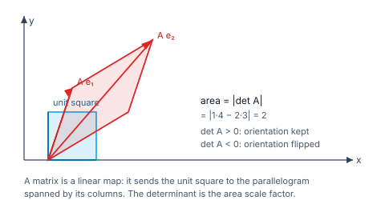
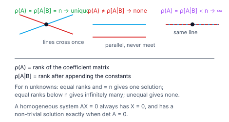

> [!info] Navigation
> 📖 [[Home|Vault home]] · 📝 [[Matrices-and-Determinants — Paper|Olympiad Paper]] · ✅ [[Matrices-and-Determinants — Solutions|Solutions]]

# Matrices & Determinants

A matrix is a rectangular array of numbers, but that description undersells it. A
matrix is best thought of as a **function**: it takes a vector and returns a
vector, linearly. Every property in this module is a statement about that
function — the determinant measures whether it is invertible, the rank measures
how much it compresses, and the trace and determinant together control its
long-run behaviour.

The practical payoff is immediate: a system of $n$ linear equations in $n$
unknowns becomes the single equation $AX=B$, and the question "does this system
have a unique solution?" becomes the question "is $\det A\ne0$?"

`6 chapters` `worked examples (S) + practice (P)` `SVG + Mermaid diagrams` `34-question Olympiad paper + full solutions`

### ★ How to use these notes

**Read in order.** Chapter 1 fixes the algebra of matrices; Chapter 2 is the
determinant and the inverse; Chapter 3 is systems of equations; Chapter 4 is
elementary operations and rank; Chapter 5 collects the special matrices; Chapter
6 is the Olympiad frontier (Cayley–Hamilton, Vandermonde, block determinants).

- **Callouts** — `[!abstract]` First Principles = the derivation; `[!tip]` Key
  Idea = the takeaway; `[!warning]` Common Trap = the classic mistake;
  `[!example]` Olympiad Extension = the frontier version.
- **Numeric habit** — every numeric answer in this module was verified in pure
  Python before it was written, and each is accompanied by a check.

### ▣ The roadmap

| Ch | Title | Level |
|---|---|---|
| 1 | Matrices: definitions and operations | foundations |
| 2 | Determinants, adjoint and inverse | machinery |
| 3 | Systems of linear equations | core |
| 4 | Elementary operations and rank | applications |
| 5 | Special matrices | applications |
| 6 | Olympiad frontier | synthesis |

**Fig 1.1 — a matrix as a linear map.** A matrix takes the unit square to a
parallelogram; the determinant is the **area scale factor**. A negative
determinant means the orientation has been reversed.

**Fig 1.2 — three outcomes for $AX=B$.** A unique solution, no solution, or
infinitely many — decided entirely by the rank of $A$ versus the rank of the
augmented matrix.

---

# Chapter 1 — Matrices: Definitions and Operations

*Foundations · the algebra of arrays*

## 1.1 Definitions

A matrix of order $m\times n$ is a rectangular array with $m$ rows and $n$
columns. Special cases:

| Type | Condition |
|---|---|
| Square | $m=n$ |
| Diagonal | $a_{ij}=0$ for $i\ne j$ |
| Scalar | diagonal with all entries equal |
| Identity | scalar diagonal with the common value $1$ |
| Upper / lower triangular | zero below / above the diagonal |
| Symmetric | $A=A^{\mathsf T}$ |
| Skew-symmetric | $A=-A^{\mathsf T}$ (so $a_{ii}=0$) |

#### **S1**[JEE Main][solved][transpose]Find the transpose of $\begin{pmatrix}1&2&3\\4&5&6\end{pmatrix}$.

$\begin{pmatrix}1&4\\2&5\\3&6\end{pmatrix}$.

Answer + Reasoning

**Method: interchange rows and columns — the order becomes $3\times2$.** ✓

**Answer:** $\begin{pmatrix}1&4\\2&5\\3&6\end{pmatrix}$.

## 1.2 Operations

**Addition** is componentwise and requires equal orders. **Scalar
multiplication** multiplies every entry. **Multiplication** $AB$ requires the
number of columns of $A$ to equal the number of rows of $B$; the $(i,j)$ entry
is the dot product of row $i$ of $A$ with column $j$ of $B$.

> [!warning] Common Trap — matrix multiplication is not commutative
> In general $AB\ne BA$. It *is* associative ($(AB)C=A(BC)$) and distributive,
> but the order of factors matters. A famous example: with
> $A=\begin{pmatrix}1&2\\3&4\end{pmatrix}$ and $B=\begin{pmatrix}5&6\\7&8\end{pmatrix}$,
> $AB=\begin{pmatrix}19&22\\43&50\end{pmatrix}$ but
> $BA=\begin{pmatrix}23&34\\31&46\end{pmatrix}$.

#### **S2**[JEE Main][solved][multiply]Compute $AB$ and $BA$ for $A=\begin{pmatrix}1&2\\3&4\end{pmatrix}$, $B=\begin{pmatrix}5&6\\7&8\end{pmatrix}$.

$AB=\begin{pmatrix}1\cdot5+2\cdot7&1\cdot6+2\cdot8\\3\cdot5+4\cdot7&3\cdot6+4\cdot8\end{pmatrix}=\begin{pmatrix}19&22\\43&50\end{pmatrix}$.

$BA=\begin{pmatrix}5\cdot1+6\cdot3&5\cdot2+6\cdot4\\7\cdot1+8\cdot3&7\cdot2+8\cdot4\end{pmatrix}=\begin{pmatrix}23&34\\31&46\end{pmatrix}$.

Answer + Reasoning

**Method: row-times-column for each entry.** Note $AB\ne BA$ — the $(1,1)$ entries differ ($19$ vs $23$) ✓.

**Answer:** $AB=\begin{pmatrix}19&22\\43&50\end{pmatrix}$, $BA=\begin{pmatrix}23&34\\31&46\end{pmatrix}$.

> [!tip] Key Idea — the trace
> The **trace** $\operatorname{tr}A=\sum_i a_{ii}$ is defined only for square
> matrices, and it is cyclic: $\operatorname{tr}(AB)=\operatorname{tr}(BA)$ even
> though $AB\ne BA$. It is the sum of the diagonal entries, and it reappears as
> the coefficient of $\lambda$ in the characteristic polynomial.

#### **S3**[JEE Main][solved][trace]Find $\operatorname{tr}A$ for $A=\begin{pmatrix}1&2\\3&4\end{pmatrix}$.

$\operatorname{tr}A=1+4=5$.

Answer + Reasoning

**Method: sum the diagonal entries.** ✓

**Answer:** $5$.

#### **P1**[JEE Main][practice][operations]Compute $A+B$ for $A=\begin{pmatrix}1&2\\3&4\end{pmatrix}$, $B=\begin{pmatrix}5&6\\7&8\end{pmatrix}$.

Answer + Reasoning

**Method: componentwise addition.** $\begin{pmatrix}6&8\\10&12\end{pmatrix}$.

**Answer:** $\begin{pmatrix}6&8\\10&12\end{pmatrix}$.

---

# Chapter 2 — Determinants, Adjoint and Inverse

*Machinery · the number that decides invertibility*

## 2.1 Determinants

> [!abstract] First Principles — the determinant
> Determinants are defined only for **square** matrices. For order $2$,
> $\det\begin{pmatrix}a&b\\c&d\end{pmatrix}=ad-bc$. For order $3$, expand along
> any row or column using **minors** and **cofactors**:
> $$\det A=\sum_j(-1)^{i+j}a_{ij}M_{ij},$$
> where $M_{ij}$ is the determinant of the matrix obtained by deleting row $i$
> and column $j$. The value is the same whichever row you expand along.

#### **S4**[JEE Main][solved][det2]Evaluate $\det\begin{pmatrix}3&1\\5&2\end{pmatrix}$.

$3\cdot2-1\cdot5=6-5=1$.

Answer + Reasoning

**Method: the $2\times2$ formula.** ✓

**Answer:** $1$.

#### **S5**[JEE Main][solved][det3]Evaluate $\det\begin{pmatrix}1&2&3\\4&5&6\\7&8&10\end{pmatrix}$.

Expanding along the first row:
$$1(50-48)-2(40-42)+3(32-35)=2+4-9=-3.$$

Answer + Reasoning

**Method: cofactor expansion along the first row.** Check by expanding along the **third column** instead: $3\cdot(-3)+6\cdot6+10\cdot(-3)=-9+36-30=-3$ ✓ — the same value, as it must be.

**Answer:** $-3$.

> [!tip] Key Idea — evaluate determinants smartly
> Before expanding, look for: a row or column of zeros; two proportional rows
> (then $\det=0$); a common factor to pull out; or rows that can be added
> together to create zeros. Expanding along the sparsest row or column saves the
> most work.

#### **P2**[JEE Main][practice][det]Evaluate $\det\begin{pmatrix}2&0&0\\0&3&0\\0&0&4\end{pmatrix}$.

Answer + Reasoning

**Method: a diagonal matrix's determinant is the product of its diagonal entries.** $2\cdot3\cdot4=24$.

**Answer:** $24$.

## 2.2 Properties

> [!abstract] First Principles — the properties that do the work
> 1. $\det A=\det A^{\mathsf T}$.
> 2. $\det(kA)=k^n\det A$ for an $n\times n$ matrix.
> 3. $\det(AB)=\det A\cdot\det B$.
> 4. Swapping two rows multiplies the determinant by $-1$; adding a multiple of
>    one row to another leaves it unchanged.
> 5. $\det A=0$ iff $A$ is **singular** (not invertible).

#### **S6**[JEE Main][solved][properties]Verify $\det(AB)=\det A\det B$ for $A=\begin{pmatrix}1&2\\3&4\end{pmatrix}$, $B=\begin{pmatrix}5&6\\7&8\end{pmatrix}$.

$\det A=-2$, $\det B=-2$, so $\det A\det B=4$. And
$AB=\begin{pmatrix}19&22\\43&50\end{pmatrix}$, whose determinant is $19\cdot50-22\cdot43=950-946=4$ ✓.

Answer + Reasoning

**Method: compute both sides independently.** ✓

**Answer:** verified, both sides $4$.

## 2.3 Adjoint and inverse

> [!abstract] First Principles — the inverse
> For a square $A$ with $\det A\ne0$,
> $$A^{-1}=\frac1{\det A}\operatorname{adj}A,$$
> where $\operatorname{adj}A$ is the **transpose of the cofactor matrix**. Then
> $AA^{-1}=A^{-1}A=I$. If $\det A=0$ no inverse exists.

#### **S7**[JEE Main][solved][inverse]Find $A^{-1}$ for $A=\begin{pmatrix}1&2\\3&4\end{pmatrix}$.

$\det A=-2$ and $\operatorname{adj}A=\begin{pmatrix}4&-2\\-3&1\end{pmatrix}$, so
$$A^{-1}=-\frac12\begin{pmatrix}4&-2\\-3&1\end{pmatrix}=\begin{pmatrix}-2&1\\\frac32&-\frac12\end{pmatrix}.$$

Answer + Reasoning

**Method: $A^{-1}=\frac1{\det A}\operatorname{adj}A$.** Check: $AA^{-1}=\begin{pmatrix}1&0\\0&1\end{pmatrix}$ ✓, and $\det(A^{-1})=\frac1{\det A}=-\frac12$ ✓.

**Answer:** $A^{-1}=\begin{pmatrix}-2&1\\\frac32&-\frac12\end{pmatrix}$.

#### **S8**[JEE Adv][solved][3x3 inverse]Find $A^{-1}$ for $A=\begin{pmatrix}2&-1&0\\-1&2&-1\\0&-1&2\end{pmatrix}$.

$\det A=4$ and $\operatorname{adj}A=\begin{pmatrix}3&2&1\\2&4&2\\1&2&3\end{pmatrix}$, so
$$A^{-1}=\frac14\begin{pmatrix}3&2&1\\2&4&2\\1&2&3\end{pmatrix}.$$

Answer + Reasoning

**Method: cofactors, transpose, divide by the determinant.** Check: $A\cdot\operatorname{adj}A=4I$ ✓, so $A\cdot A^{-1}=I$ ✓.

**Answer:** $A^{-1}=\frac14\begin{pmatrix}3&2&1\\2&4&2\\1&2&3\end{pmatrix}$.

> [!warning] Common Trap — adjoint is the transpose of the cofactor matrix
> The cofactor matrix and the adjoint differ by a transpose. For symmetric
> matrices they coincide, which is exactly why this error survives practice
> problems and then appears on the exam.

---

# Chapter 3 — Systems of Linear Equations

*Core · $AX=B$*

## 3.1 The matrix method and Cramer's rule

> [!abstract] First Principles — two ways to solve $AX=B$
> If $\det A\ne0$, the unique solution is $X=A^{-1}B$. Equivalently,
> **Cramer's rule** gives
> $$x_i=\frac{\det A_i}{\det A},$$
> where $A_i$ is $A$ with its $i^{\rm th}$ column replaced by $B$.

#### **S9**[JEE Main][solved][cramer]Solve $2x+y=5$, $x-y=1$ by Cramer's rule.

$\det A=\det\begin{pmatrix}2&1\\1&-1\end{pmatrix}=-3$;
$\det A_1=\det\begin{pmatrix}5&1\\1&-1\end{pmatrix}=-6$;
$\det A_2=\det\begin{pmatrix}2&5\\1&1\end{pmatrix}=-3$.
So $x=\frac{-6}{-3}=2$ and $y=\frac{-3}{-3}=1$.

Answer + Reasoning

**Method: replace each column in turn by the constant vector.** Check: $2(2)+1=5$ ✓ and $2-1=1$ ✓.

**Answer:** $x=2$, $y=1$.

#### **S10**[JEE Main][solved][matrix method]Solve $3x+2y=12$, $x-y=-1$ by the matrix method.

$A=\begin{pmatrix}3&2\\1&-1\end{pmatrix}$, $\det A=-5$, $A^{-1}=-\frac15\begin{pmatrix}-1&-2\\-1&3\end{pmatrix}$, and $B=\begin{pmatrix}12\\-1\end{pmatrix}$. Then
$$X=A^{-1}B=\begin{pmatrix}2\\3\end{pmatrix}.$$

Answer + Reasoning

**Method: $X=A^{-1}B$.** Check: $3(2)+2(3)=12$ ✓ and $2-3=-1$ ✓.

**Answer:** $x=2$, $y=3$.

## 3.2 Consistency

> [!abstract] First Principles — the rank criterion
> Let $\rho(A)$ be the rank of $A$ and $\rho[A\,|\,B]$ the rank of the augmented
> matrix. For $n$ unknowns:
>
> | Case | Solutions |
> |---|---|
> | $\rho(A)\ne\rho[A\,|\,B]$ | none (inconsistent) |
> | $\rho(A)=\rho[A\,|\,B]=n$ | exactly one |
> | $\rho(A)=\rho[A\,|\,B]<n$ | infinitely many |
>
> A **homogeneous** system $AX=0$ always has the trivial solution, and has a
> **non-trivial** solution iff $\det A=0$.

#### **S11**[JEE Main][solved][consistency]Test the consistency of $x+y=2$, $2x+2y=5$.

$\det A=\det\begin{pmatrix}1&1\\2&2\end{pmatrix}=0$, but $\det\begin{pmatrix}2&1\\5&2\end{pmatrix}=4-5=-1\ne0$. So $\rho(A)=1$ while $\rho[A\,|\,B]=2$: the system is **inconsistent**.

Answer + Reasoning

**Method: compare $\det A$ with the determinant obtained by replacing a column with $B$.** (Geometrically the two lines are parallel and distinct ✓.)

**Answer:** inconsistent — no solution.

#### **P3**[JEE Main][practice][homogeneous]For what value of $\lambda$ does
$\begin{pmatrix}\lambda&1\\1&\lambda\end{pmatrix}X=0$ have a non-trivial solution?

Answer + Reasoning

**Method: a non-trivial solution requires $\det A=0$.** $\lambda^2-1=0\Rightarrow\lambda=\pm1$.

**Answer:** $\lambda=\pm1$.

---

# Chapter 4 — Elementary Operations and Rank

*Applications · row reduction*

## 4.1 Elementary operations

The three permitted operations on rows (or columns) are:

1. interchange two rows;
2. multiply a row by a non-zero scalar;
3. add a multiple of one row to another.

Only the second changes the determinant (by the scalar factor). These
operations are how determinants are evaluated, how inverses are found, and how
rank is computed.

> [!tip] Key Idea — rank is what survives row reduction
> The **rank** of a matrix is the number of non-zero rows in its row-echelon
> form — equivalently the order of the largest non-zero minor. Row reduction
> never changes the rank, so it is the standard way to compute it.

#### **S12**[JEE Main][solved][rank]Find the rank of $\begin{pmatrix}1&2&3\\4&5&6\\7&8&9\end{pmatrix}$.

$R_3\leftarrow R_3-2R_2+R_1$ gives a zero third row, and the first two rows are not proportional, so the rank is $2$.

Answer + Reasoning

**Method: reduce to echelon form and count non-zero rows.** Check: $\det=0$ confirms the rank is below $3$, and a $2\times2$ minor such as $\det\begin{pmatrix}1&2\\4&5\end{pmatrix}=-3\ne0$ confirms it is at least $2$ ✓.

**Answer:** rank $2$.

#### **S13**[JEE Adv][solved][rank]Find the rank of $\begin{pmatrix}1&2&3&4\\2&4&6&8\\1&0&1&0\end{pmatrix}$.

$R_2\leftarrow R_2-2R_1$ gives a zero row, and the remaining two rows are not proportional, so the rank is $2$.

Answer + Reasoning

**Method: eliminate, then count.** The matrix is $3\times4$ so the rank is at most $3$; the dependency found lowers it to $2$, and two independent rows remain ✓.

**Answer:** rank $2$.

#### **P4**[JEE Main][practice][rank]Find the rank of $\begin{pmatrix}1&2\\2&4\end{pmatrix}$.

Answer + Reasoning

**Method: the second row is twice the first, so only one row survives.** Rank $1$.

**Answer:** $1$.

---

# Chapter 5 — Special Matrices

*Applications · the named families*

## 5.1 Orthogonal, idempotent, involutory, nilpotent

> [!abstract] First Principles — four families, four equations
> - **Orthogonal:** $AA^{\mathsf T}=A^{\mathsf T}A=I$, so $A^{-1}=A^{\mathsf T}$.
>   These are the rotations and reflections; $\det A=\pm1$.
> - **Idempotent:** $A^2=A$ (projections).
> - **Involutory:** $A^2=I$, so $A=A^{-1}$.
> - **Nilpotent:** $A^k=0$ for some $k$.

#### **S14**[JEE Main][solved][orthogonal]Verify that $\begin{pmatrix}0&1\\-1&0\end{pmatrix}$ is orthogonal.

$AA^{\mathsf T}=\begin{pmatrix}0&1\\-1&0\end{pmatrix}\begin{pmatrix}0&-1\\1&0\end{pmatrix}=\begin{pmatrix}1&0\\0&1\end{pmatrix}=I$ ✓.

Answer + Reasoning

**Method: check $AA^{\mathsf T}=I$.** (This matrix is rotation through $90^\circ$, so orthogonality is expected ✓; $\det=1$ ✓.)

**Answer:** verified orthogonal.

#### **S15**[JEE Main][solved][idempotent]Verify that $\begin{pmatrix}1&1\\0&0\end{pmatrix}$ is idempotent.

$\begin{pmatrix}1&1\\0&0\end{pmatrix}^2=\begin{pmatrix}1&1\\0&0\end{pmatrix}$ ✓.

Answer + Reasoning

**Method: square it and compare.** ✓

**Answer:** verified idempotent.

#### **S16**[JEE Main][solved][involutory]Verify that $\begin{pmatrix}0&1\\1&0\end{pmatrix}$ is involutory.

$\begin{pmatrix}0&1\\1&0\end{pmatrix}^2=\begin{pmatrix}1&0\\0&1\end{pmatrix}=I$ ✓.

Answer + Reasoning

**Method: square it.** ✓

**Answer:** verified involutory.

## 5.2 The symmetric / skew-symmetric split

> [!abstract] First Principles — every matrix splits in two
> For any square $A$,
> $$A=\underbrace{\frac{A+A^{\mathsf T}}2}_{\text{symmetric}}+\underbrace{\frac{A-A^{\mathsf T}}2}_{\text{skew-symmetric}}.$$
> Both parts are unique, and the sum of a symmetric and a skew-symmetric matrix
> is skew-symmetric only in the trivial case — so this decomposition is the
> canonical one.

#### **S17**[JEE Main][solved][split]Decompose $A=\begin{pmatrix}1&2\\3&4\end{pmatrix}$ into symmetric plus skew-symmetric parts.

$A+A^{\mathsf T}=\begin{pmatrix}2&5\\5&8\end{pmatrix}$ and $A-A^{\mathsf T}=\begin{pmatrix}0&-1\\1&0\end{pmatrix}$, so
$$A=\begin{pmatrix}1&\frac52\\\frac52&4\end{pmatrix}+\begin{pmatrix}0&-\frac12\\\frac12&0\end{pmatrix}.$$

Answer + Reasoning

**Method: halve the sum and the difference with the transpose.** Check: the first part is symmetric ✓, the second is skew-symmetric ✓, and they add back to $A$ ✓.

**Answer:** $\begin{pmatrix}1&\frac52\\\frac52&4\end{pmatrix}+\begin{pmatrix}0&-\frac12\\\frac12&0\end{pmatrix}$.

#### **P5**[JEE Main][practice][orthogonal]Show that $\begin{pmatrix}\cos\theta&-\sin\theta\\\sin\theta&\cos\theta\end{pmatrix}$ is orthogonal for any $\theta$.

Answer + Reasoning

**Method: multiply by the transpose and use $\cos^2\theta+\sin^2\theta=1$.** $AA^{\mathsf T}=\begin{pmatrix}\cos^2\theta+\sin^2\theta&0\\0&\sin^2\theta+\cos^2\theta\end{pmatrix}=I$ ✓.

**Answer:** verified — these are exactly the rotations.

---

# Chapter 6 — Olympiad Frontier

*Synthesis · the deep structure*

## 6.1 Cayley–Hamilton

> [!example] Olympiad Extension — Cayley–Hamilton
> Every square matrix satisfies its own characteristic equation:
> $$p(\lambda)=\det(\lambda I-A)=\lambda^n-(\operatorname{tr}A)\lambda^{n-1}+\cdots+(-1)^n\det A,$$
> and $p(A)=0$. This lets you reduce any high power of $A$ to a linear
> combination of $I,A,\ldots,A^{n-1}$ — the standard tool for computing $A^{100}$
> or $A^{-1}$ without inverting.

#### **S18**[Olympiad][solved][cayley hamilton]Verify Cayley–Hamilton for $A=\begin{pmatrix}1&2\\3&4\end{pmatrix}$.

$\operatorname{tr}A=5$ and $\det A=-2$, so $p(\lambda)=\lambda^2-5\lambda-2$. Now
$A^2=\begin{pmatrix}7&10\\15&22\end{pmatrix}$ and
$$A^2-5A-2I=\begin{pmatrix}7&10\\15&22\end{pmatrix}-\begin{pmatrix}5&10\\15&20\end{pmatrix}-\begin{pmatrix}2&0\\0&2\end{pmatrix}=\begin{pmatrix}0&0\\0&0\end{pmatrix}.$$

Answer + Reasoning

**Method: form $p(A)$ and check it is the zero matrix.** ✓

**Answer:** verified, $A^2-5A-2I=0$.

#### **S19**[Olympiad][solved][power]Use Cayley–Hamilton to express $A^3$ for $A=\begin{pmatrix}1&2\\3&4\end{pmatrix}$ as $\alpha A+\beta I$.

From $A^2=5A+2I$, multiply by $A$: $A^3=5A^2+2A=5(5A+2I)+2A=27A+10I$.

Answer + Reasoning

**Method: reduce using the characteristic equation.** Check directly: $A^3=A^2\cdot A=\begin{pmatrix}7&10\\15&22\end{pmatrix}\begin{pmatrix}1&2\\3&4\end{pmatrix}=\begin{pmatrix}37&54\\81&118\end{pmatrix}$, and $27A+10I=\begin{pmatrix}37&54\\81&118\end{pmatrix}$ ✓.

**Answer:** $A^3=27A+10I$.

## 6.2 Vandermonde and block determinants

> [!example] Olympiad Extension — the Vandermonde determinant
> $$\det\begin{pmatrix}1&1&\cdots&1\\x_1&x_2&\cdots&x_n\\x_1^2&x_2^2&\cdots&x_n^2\\\vdots&&&\vdots\\x_1^{n-1}&\cdots&&x_n^{n-1}\end{pmatrix}=\prod_{i<j}(x_j-x_i).$$
> It is the determinant behind polynomial interpolation: it vanishes exactly when
> two of the $x_i$ coincide, which is precisely when interpolation becomes
> degenerate.

> [!example] Olympiad Extension — block determinants
> If $A$ is invertible, then
> $$\det\begin{pmatrix}A&B\\C&D\end{pmatrix}=\det A\cdot\det(D-CA^{-1}B).$$
> In particular, when $C=0$ or $B=0$ the determinant **factors**. This is the
> tool for large sparse systems.

#### **S20**[Olympiad][solved][vandermonde]Verify the Vandermonde formula for $x_1=2,x_2=5,x_3=9$.

$\det\begin{pmatrix}1&1&1\\2&5&9\\4&25&81\end{pmatrix}=84$ and $(5-2)(9-2)(9-5)=3\cdot7\cdot4=84$ ✓.

Answer + Reasoning

**Method: compute the determinant directly and compare with the product of differences.** ✓

**Answer:** verified, both $84$.

#### **S21**[JEE Adv][solved][block]Evaluate $\det\begin{pmatrix}2&0&0&0\\0&3&0&0\\0&0&4&0\\0&0&0&5\end{pmatrix}$ using block structure.

Splitting into two $2\times2$ blocks: $\det\begin{pmatrix}2&0\\0&3\end{pmatrix}\det\begin{pmatrix}4&0\\0&5\end{pmatrix}=6\cdot20=120$.

Answer + Reasoning

**Method: for a block-diagonal matrix the determinant is the product of the block determinants.** (Directly it is $2\cdot3\cdot4\cdot5=120$ ✓.)

**Answer:** $120$.

#### **P6**[Olympiad][practice][geometry]Explain why $\lvert\det A\rvert$ is the area scale factor of the linear map $x\mapsto Ax$ in two dimensions.

Answer + Reasoning

**Method: the map sends the unit square to the parallelogram spanned by the columns of $A$, whose area is $\lvert a_{11}a_{22}-a_{12}a_{21}\rvert=\lvert\det A\rvert$.** Since the map is linear, every area is scaled by the same factor ✓.

**Answer:** $\lvert\det A\rvert$ — the area of the image of the unit square.

#### **P7**[Olympiad][practice][det properties]Show that $\det(A+kI)$ for $A=\begin{pmatrix}1&2\\3&4\end{pmatrix}$ equals $k^2+5k-2$.

$\det\begin{pmatrix}1+k&2\\3&4+k\end{pmatrix}=(1+k)(4+k)-6=k^2+5k+4-6=k^2+5k-2$. Check at $k=3$: $9+15-2=22$ ✓.

Answer + Reasoning

**Method: expand the determinant directly.** Note this is the characteristic polynomial evaluated at $-k$ ✓.

**Answer:** $k^2+5k-2$.

---

# Appendix — Well-Ordered Theory Reference

Every result in dependency order; nothing is used before it is proved.

### A. Matrix algebra

| Result | Statement |
|---|---|
| Order | $m\times n$: $m$ rows, $n$ columns |
| Addition | componentwise, requires equal orders |
| Multiplication | $(AB)_{ij}=\sum_k a_{ik}b_{kj}$; needs $\text{cols}(A)=\text{rows}(B)$ |
| Associativity | $(AB)C=A(BC)$ |
| Distributivity | $A(B+C)=AB+AC$ |
| Non-commutativity | $AB\ne BA$ in general |
| Transpose | $(A^{\mathsf T})_{ij}=a_{ji}$; $(AB)^{\mathsf T}=B^{\mathsf T}A^{\mathsf T}$ |
| Trace | $\operatorname{tr}A=\sum_i a_{ii}$; $\operatorname{tr}(AB)=\operatorname{tr}(BA)$ |
| Symmetric | $A=A^{\mathsf T}$ |
| Skew-symmetric | $A=-A^{\mathsf T}$, so $a_{ii}=0$ |
| Decomposition | $A=\frac{A+A^{\mathsf T}}2+\frac{A-A^{\mathsf T}}2$ |

### B. Determinants

| Result | Statement |
|---|---|
| Order 2 | $\det\begin{pmatrix}a&b\\c&d\end{pmatrix}=ad-bc$ |
| Cofactor expansion | $\det A=\sum_j(-1)^{i+j}a_{ij}M_{ij}$ |
| Transpose | $\det A=\det A^{\mathsf T}$ |
| Scalar | $\det(kA)=k^n\det A$ |
| Product | $\det(AB)=\det A\det B$ |
| Row swap | multiplies the determinant by $-1$ |
| Row addition | leaves it unchanged |
| Singular | $\det A=0$ |
| Vandermonde | $\prod_{i<j}(x_j-x_i)$ |

### C. Adjoint and inverse

| Result | Statement |
|---|---|
| Cofactor | $C_{ij}=(-1)^{i+j}M_{ij}$ |
| Adjoint | $\operatorname{adj}A=(\text{cofactor matrix})^{\mathsf T}$ |
| Inverse | $A^{-1}=\frac1{\det A}\operatorname{adj}A$ if $\det A\ne0$ |
| Key identity | $A\cdot\operatorname{adj}A=\det A\cdot I$ |
| Determinant of inverse | $\det(A^{-1})=\frac1{\det A}$ |
| $(AB)^{-1}$ | $B^{-1}A^{-1}$ |

### D. Systems and rank

| Result | Statement |
|---|---|
| Matrix form | $AX=B$ |
| Unique solution | $X=A^{-1}B$, requires $\det A\ne0$ |
| Cramer | $x_i=\frac{\det A_i}{\det A}$ |
| Consistency | $\rho(A)$ vs $\rho[A\,|\,B]$ |
| Unique | $\rho(A)=\rho[A\,|\,B]=n$ |
| Infinite | $\rho(A)=\rho[A\,|\,B]<n$ |
| None | $\rho(A)\ne\rho[A\,|\,B]$ |
| Homogeneous | non-trivial solution iff $\det A=0$ |
| Rank | non-zero rows in echelon form |

### E. Special matrices

| Result | Statement |
|---|---|
| Orthogonal | $AA^{\mathsf T}=I$, $A^{-1}=A^{\mathsf T}$, $\det A=\pm1$ |
| Rotations | $\begin{pmatrix}\cos\theta&-\sin\theta\\\sin\theta&\cos\theta\end{pmatrix}$ |
| Idempotent | $A^2=A$ |
| Involutory | $A^2=I$ |
| Nilpotent | $A^k=0$ |
| Hermitian | $A=A^*$ (conjugate transpose) |
| Unitary | $AA^*=I$ |

### F. Olympiad results

| Result | Statement |
|---|---|
| Cayley–Hamilton | $p(A)=0$ for $p(\lambda)=\det(\lambda I-A)$ |
| $2\times2$ char. poly. | $\lambda^2-(\operatorname{tr}A)\lambda+\det A$ |
| Power reduction | $A^2=(\operatorname{tr}A)A-(\det A)I$ for $2\times2$ |
| Block (upper) | $\det\begin{pmatrix}A&B\\0&D\end{pmatrix}=\det A\det D$ |
| Block (general) | $\det\begin{pmatrix}A&B\\C&D\end{pmatrix}=\det A\det(D-CA^{-1}B)$ |
| Geometry | $\lvert\det A\rvert$ is the area scale factor |

### G. Mistake checklist

1. Assuming $AB=BA$ — it does not in general.
2. Multiplying matrices whose inner dimensions disagree.
3. Using the cofactor matrix where the adjoint (its transpose) is required.
4. Computing $\det(kA)$ as $k\det A$ instead of $k^n\det A$.
5. Applying Cramer's rule when $\det A=0$.
6. Confusing $\rho(A)$ with $\rho[A\,|\,B]$ in the consistency test.
7. Forgetting that a homogeneous system always has the trivial solution.
8. Reversing the order in $(AB)^{-1}=B^{-1}A^{-1}$.
9. Writing the characteristic polynomial as $\lambda^2+\operatorname{tr}A\,\lambda+\det A$.
10. Forgetting that only the *transpose* of the cofactor matrix is the adjoint.
