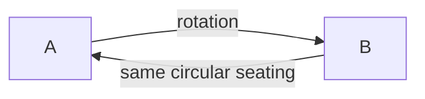

# Chapter 2 — Permutations

*6 sections · 13 questions*

*Chapter 2 · Order Matters*

# Permutations

Arrangements: from the multiplication rule to $nPr$, repeated letters, circular permutations, adjacency and gap methods, fixed relative order, and derangements — including why "no fixed point" counts come out as the nearest integer to $n!/e$.

`$nP_r$` `repetition` `circular` `gaps` `relative order` `derangements`

### 2.1 From the product rule to $nP_r$

**Definition.** A **permutation of $r$ objects chosen from $n$** is an *ordered* arrangement of $r$ distinct objects selected from a pool of $n$. The number is denoted ${}^nP_r$ or $P(n,r)$.

> **⛁ First Principles — derivation, not recitation**
>
> Fill the $r$ labeled positions (role 1, role 2, …, role $r$) one by one: role 1 has $n$ options; whatever it receives, role 2 has $n-1$ options (the pool lost one element — the count is *fixed per step*, which is exactly what the product rule requires); role $j$ has $n-j+1$ options. Hence
>
>
> Equivalently — and this is the deeper view: $P(n,r)$ is the number of **injective functions** $[r]\to[n]$: a function is determined by the images of $1,2,\dots,r$, which must be distinct, giving the same descending product. For $r=n$, permutations of $n$ objects are exactly the **bijections** $[n]\to[n]$, and $n!$ is their count. Holding "permutation = bijection" in mind is what makes later topics (derangements, cycle structure, Burnside) click.

#### The factorial, and why $0! = 1$

By the same "image of 1, image of 2, …" argument: $n! = n\cdot(n-1)\cdots 1$ counts bijections $[n]\to[n]$. For $n=0$ there is exactly **one** bijection $\varnothing\to\varnothing$ (the empty function), so the definition forces $0! = 1$. This is not convention for convenience — it is forced by the counting story, and it is what makes formulas like $\frac{n!}{(n-r)!}$ with $r=n$ and stars-and-bars identities work without exceptions.

#### **S1**[JEE Adv][solved][repeated letters]In how many ways can the letters of the word COMBINATORICS be arranged?

In how many ways can the letters of the word **COMBINATORICS** be arranged?

Answer + Reasoning

Solution & reasoning

13 letters with C ×2, O ×2, I ×2 and seven singletons. The answer is $\dfrac{13!}{2!\,2!\,2!} = \dfrac{6{,}227{,}020{,}800}{8} =$ **Answer: 778,377,600** — the division-by-factorials reasoning is developed rigorously in §2.2 below; in these notes every worked example uses techniques you already saw introduced.

### 2.2 Identical objects — arrangements with repetition

When some of the $n$ objects are identical, naively using $n!$ overcounts. The precise statement: if the multiset has $n_1$ copies of type 1, …, $n_k$ copies of type $k$ (with $n = n_1+\cdots+n_k$), the number of distinct arrangements is

$$\frac{n!}{n_1!\,n_2!\cdots n_k!}$$

> **⛁ First Principles — the labeling argument (the real proof)**
>
> **Step 1.** Temporarily *label* every object: the $n_1$ identical A's become $A_1,\dots,A_{n_1}$, etc. Now all $n$ objects are distinct: $n!$ arrangements. **Step 2.** For any one *unlabeled* arrangement (a word), how many labeled arrangements project to it? Exactly $n_1!\cdot n_2!\cdots n_k!$: within each run of identical letters we may permute the labels freely, and every such relabeling gives a different labeled word, while it all erases to the same unlabeled word. **Step 3.** The set of labeled words is thus partitioned into fibers of equal size $n_1!\cdots n_k!$, one fiber per unlabeled word. Equal-size fibers ⇒ division is exact: $\dfrac{n!}{n_1!\cdots n_k!}$. This "label, count, divide by the symmetry" argument is one of the most reusable ideas in the whole course (it reappears in circular permutations, necklaces, and Burnside's lemma in Chapter 6).

> **⚠ Common Trap — division by symmetry is only legal when the symmetry is exact**
>
> "Divide by $2!$ because A and B can swap" fails if some arrangements are *fixed* by the swap (e.g. with identical objects the swap does nothing to some words). The labeling argument above is safe precisely because every fiber has the *same* size. Whenever you divide, ask: *is every object counted exactly the same number of times?* If not, split into cases (or use Burnside, Chapter 6 — which exists exactly for the non-uniform case).

#### **S2**[JEE Main][solved][repetition + condition]How many distinct words can be formed from the letters of DAAR (D, A, A, R) in…

How many distinct words can be formed from the letters of **DAAR** (D, A, A, R) in which the two A's are adjacent?

Answer + Reasoning

Solution & reasoning

Bundling: treat AA as one super-letter. Now arrange the 3 objects {D, AA, R}: $3! = 6$. The A's are identical so the bundle has only 1 internal order. Answer **Answer: 6** — words: DAAR, AADR, ADAR, ADRA, ARDA, RADA. (Bundle-then-count-objects is the standard move for *must-be-adjacent* conditions.)

### 2.3 Circular permutations

**Statement.** The number of ways to seat $n$ distinct people around a round table (two seatings equal if one is a rotation of the other) is

$$(n-1)!\qquad (n\ge 2)$$

> **⛁ First Principles — why $(n-1)!$, two independent proofs**
>
> **Proof A (anchor).** Seat one distinguished person, say A, anywhere — her seat is only a reference point, so "without loss of generality" fix A at the 12 o'clock position. The remaining $n-1$ people fill the remaining $n-1$ seats in a line going clockwise: $(n-1)!$ ways. Every circular seating has A in exactly one seat, so nothing is over- or under-counted.
>
>
> **Proof B (divide by rotation).** There are $n!$ linear arrangements around $n$ labeled seats. Rotating a seating by one seat gives another linear arrangement representing the same circular seating; each circular seating is represented by exactly $n$ linear arrangements (its $n$ rotations), and every rotation orbit has size $n$ (no non-trivial rotation fixes a seating of *distinct* people — the "exact symmetry" condition of §2.2). Hence $n!/n = (n-1)!$. Notice both proofs are the labeling/fiber idea in disguise.

**Fig 2.1 — A rotation is "the same" circular seating. Clockwise order A→B→C→D is the invariant; the arrow is the rotation that relates the two pictures.**

#### Consequences and variants

- **Two specified people adjacent** (round table): bundle them → $2\cdot(n-2)!$. **Not adjacent**: total minus that, which simplifies nicely: $(n-1)! - 2(n-2)! = (n-2)!\big((n-1) - 2\big) = \boxed{(n-3)(n-2)!}$. Check $n=4$: $(4-3)\cdot 2! = 2$ — with A, B separated, the remaining C, D land one on each side: indeed 2 ✓.
- **Two seats fixed** (e.g. A and B must sit at two specified chairs): fix both as anchors → $(n-2)!$.
- **Necklaces (beads, flip allowed).** If a string of $n$ distinct beads is closed into a ring and two rings are equal when related by rotation *or* reflection (turning the ring over), then for $n \ge 3$ the count is $\dfrac{(n-1)!}{2}$ — each rotation-class is split by the flip into pairs of equal size (no distinct-bead ring equals its own flip). With *identical* beads the flip can fix a ring — the exact-symmetry condition fails, and the right tool is Burnside's lemma (Chapter 6).

#### **S3**[JEE Adv][solved][circular + complement]10 people sit around a round table. In how many arrangements are neither the t…

10 people sit around a round table. In how many arrangements are **neither** the two specific people A and B **adjacent**?

Answer + Reasoning

Solution & reasoning

Total circular seatings: $(10-1)! = 9! = 362{,}880$. A & B adjacent: treat {A,B} as a block → 9 objects around the table → $8!$ circular arrangements, and the block has 2 internal orders: $2\cdot 8! = 80{,}640$. Answer: $362{,}880 - 80{,}640 =$ **Answer: 282,240**

General form: $(n-1)! - 2(n-2)!$. For $n=10$: $9! - 2\cdot 8! = 362880 - 80640$.

### 2.4 Linear permutations with restrictions

#### (a) "Together" — the bundle

If $k$ specified objects must be consecutive, wrap them in a bundle: the bundle is one object with $k!$ internal orders (if the objects are distinct). Arrange the $n-k+1$ objects; multiply by $k!$. Multiple bundles work as long as they don't nest confusingly; "A before B" conditions are *not* bundles (next subsection).

#### (b) "No two adjacent" — the gap method

> **⛁ First Principles — arrange the rest, then choose slots**
>
> Suppose $k$ special objects must not be adjacent, and there are $m$ ordinary objects. Arrange the $m$ ordinary objects: $m!$ ways (if distinct). They create $m+1$ gaps — before, between, and after: $\underline{\ \ \ }\,O\underline{\ \ \ }\,O\underline{\ \ \ }\cdots O\underline{\ \ \ }$. Put each special object into a *different* gap (at most one per gap is what forces non-adjacency): choose $k$ of the $m+1$ gaps, $\binom{m+1}{k}$ ways, and order the special objects inside their gaps, $k!$ ways. Total: $\boxed{m!\,\binom{m+1}{k}\,k!}$. The method's real power is that it converts a *negative* condition ("not next to each other") into a *positive* placement rule.

#### (c) "Fixed relative order" — divide by $k!$

Among the $n!$ arrangements of $n$ distinct objects, look only at the relative order of $k$ specified ones, say $X_1,\dots,X_k$. As we scan all $n!$ arrangements, the induced relative order of $(X_1,\dots,X_k)$ runs through all $k!$ possibilities. By symmetry each relative order occurs the same number of times: why? because the $k!$-element permutation group of $\{X_1,\dots,X_k\}$ acts freely and transitively on the relative-order classes, and each group element sends any arrangement to a valid one (just relabel the positions the $X_i$ occupy). So the number of arrangements with, say, "$X_1$ before $X_2$ before … before $X_k$" is $\boxed{\dfrac{n!}{k!}}$.

In particular, "$X_1$ before $X_2$" alone: $n!/2$. These "divide by the symmetry of a condition" arguments are the linear relatives of the circular-permutation division.

#### **S4**[JEE Adv][solved][bundle + complement]Six people — P, Q, R, S, T, U — sit in a row. P and Q must sit together , and …

Six people — P, Q, R, S, T, U — sit in a row. P and Q must sit **together**, and R must **not** sit at an end. How many arrangements?

Answer + Reasoning

Solution & reasoning

**Step 1 (bundle).** Bundle P,Q: now 5 objects {B, R, S, T, U} with B having 2 internal orders. Total: $2\cdot 5! = 240$.

**Step 2 (complement on R).** Count those with R at an end: R's end choice (2 ways); then arrange the remaining 4 objects (B, S, T, U) in the 4 inner positions: $4!$; internal order of B: 2. So $2\cdot 4! \cdot 2 = 96$.

Answer: $240 - 96 =$ **Answer: 144**

Order of operations matters: bundle first, *then* apply the positional restriction to the shrunken object list — the two restrictions interact only through the objects' positions, which is why composing them is safe here.

### 2.5 Derangements — permutations with no fixed point

**Definition.** A **derangement** of $[n]$ is a permutation $\sigma$ with $\sigma(i) \ne i$ for every $i$. The classic story: $n$ letters, $n$ addressed envelopes — in how many ways can *every* letter go into the *wrong* envelope?

Denote the count by $D_n$. We derive it twice — the first derivation (Chapter 5's machinery, brought forward because it is the flagship inclusion–exclusion application) and the second (a pure recurrence, which reveals the structure).

#### Derivation 1 — inclusion–exclusion

Let $E_i$ = event "$\sigma(i) = i$". We want $N = n! - |\cup_i E_i|$. Inclusion–exclusion (proved in Chapter 5; here is the direct 3-line logic): a permutation with exactly $k$ prescribed fixed points (a chosen set $S\subseteq[n]$ of size $k$) has the remaining $n-k$ points free: $(n-k)!$. IE says to count the complement of $\cup E_i$ by alternating sums over intersections: 
$$ D_n = \sum_{k=0}^{n} (-1)^k \binom{n}{k} (n-k)! = n!\sum_{k=0}^{n}\frac{(-1)^k}{k!}. $$

Intuition for the alternating sum: subtract arrangements with at least one fixed point (overcounts those with two), add back those with at least two (triple-counted ones now negative), etc. The alternation is exactly the bookkeeping of "how many times does a permutation with $m$ fixed points get counted" = $\sum_{k=m}^{n}(-1)^{k-m}\binom{m}{k-m}$… = 0 for $m\ge 1$, 1 for $m=0$. Chapter 5 makes this precise.

#### Derivation 2 — the recurrence (first principles on where 1 goes)

In a derangement of $[n]$, the element 1 goes to some position $i\ne 1$: $n-1$ choices. Now look at where element $i$ goes:

- **Case A: $i$ goes to position 1.** Then 1↔i is a 2-cycle, and the remaining $n-2$ elements must derange among themselves: $D_{n-2}$ ways.
- **Case B: $i$ does not go to position 1.** Then element $i$ is in a "derangement-like" position: rename position 1 as "position $i$" (i.e. merge the forbidden positions of $i$ and 1) — a standard relabeling: the remaining $n-1$ elements must avoid $n-1$ specified forbidden positions, which is exactly $D_{n-1}$ ways.

So $D_n = (n-1)\big(D_{n-1} + D_{n-2}\big)$ with $D_0 = 1, D_1 = 0$.

**Fig 2.2 — First derangement numbers and the astonishing closeness to $n!/e$.**

> **⛁ First Principles — why $D_n \approx n!/e$ (the reasoning, not a fact to memorize)**
>
> We have $D_n = n!\sum_{k=0}^n (-1)^k/k!$. The series $\sum_{k=0}^{\infty} (-1)^k/k! = 1/e$ (the Taylor series of $e^x$ at $x=-1$). The tail $\sum_{k>n} (-1)^k/k!$ has absolute value $&lt; \frac{1}{(n+1)!}$, so $0 \le \left|D_n - \frac{n!}{e}\right| &lt; \frac{n!}{(n+1)!} = \frac{1}{n+1} &lt; \tfrac12$ for $n\ge 1$ — which is exactly the statement $D_n = \left\lfloor \frac{n!}{e} + \tfrac12\right\rfloor$, the **nearest integer to $n!/e$**. A pure counting sequence is integer-rounded $n!/e$ because the events "fixed point at $i$" behave asymptotically independently: $P(\text{no fixed point}) = \sum (-1)^k/k! \to e^{-1}$, the limit of $(1-1/n)^n$. *This is the prototype of the Poisson heuristic that runs through probability and combinatorics.*

#### Partial derangements and the rencontres numbers

"Exactly $k$ of the letters in the right envelope": choose which $k$ are correct ($\binom{n}{k}$), derange the rest: $\binom{n}{k}D_{n-k}$. For $n=5, k=2$: $\binom52 D_3 = 10\cdot 2 = 20$.

#### **S5**[JEE Adv][solved][derangement story]Five letters are put into five correctly addressed envelopes at random. How ma…

Five letters are put into five correctly addressed envelopes at random. How many assignments have **no** letter in its own envelope? How many have **exactly two** correct?

Answer + Reasoning

Solution & reasoning

No correct: $D_5 = 5!(1 - 1 + \tfrac12 - \tfrac16 + \tfrac1{24} - \tfrac1{120})
        = 120\cdot \tfrac{44}{120} =$ **Answer: 44**

Exactly two correct: $\binom{5}{2}D_3 = 10 \cdot 2 =$ **Answer: 20**

Sanity: $44 + 20 + \binom51 D_4 + \binom53 D_2 + \binom54 D_1 + \binom55 D_0
        = 44 + 20 + 5\cdot 9 + 10\cdot 1 + 5\cdot 0 + 1 = 120 = 5!$ — every assignment is accounted for. Always run this "sum over k" check when using $\binom nk D_{n-k}$.

> **🏛 Olympiad Extension — derangements are a special case**
>
> Counting permutations that avoid a *board of forbidden positions* (e.g. "letter i may not go to envelopes i and i+1") is done by **rook polynomials** + inclusion–exclusion — the full theory is Chapter 5. Derangements are the case where the forbidden board is the main diagonal.

### 2.6 Practice set

#### **P1**[JEE Main][practice][alternation]5 men and 5 women sit in a row such that men and women alternate . How many ar…

5 men and 5 women sit in a row such that **men and women alternate**. How many arrangements?

Answer + Reasoning

Two alternating patterns: M-W-M-W-… and W-M-W-M-… . Each: $5!\cdot 5!$. Total $2(5!)^2 = 2\cdot 14{,}400 =$ **28,800**.

#### **P2**[JEE Adv][practice][circular + bundle]4 married couples sit around a round table; every husband next to his wife . H…

4 married couples sit around a round table; **every husband next to his wife**. How many circular arrangements?

Answer + Reasoning

Bundle each couple (2 internal orders each): $2^4$ · circular arrangements of 4 bundles $(4-1)!$. Total $16\cdot 6 =$ **96**.

#### **P3**[JEE Adv][practice][derangement]6 letters, 6 envelopes. How many assignments have no letter in its own envelop…

6 letters, 6 envelopes. How many assignments have **no** letter in its own envelope? Express also as $\lfloor 6!/e + \tfrac12\rfloor$ and verify.

Answer + Reasoning

$D_6 = 720(1 - 1 + \tfrac12 - \tfrac16 + \tfrac1{24} - \tfrac1{120} + \tfrac1{720})
        = 720\cdot\tfrac{265}{720} =$ **265**. Check: $6!/e = 720/2.71828\ldots = 264.87\ldots$, nearest integer 265 ✓.

#### **P4**[JEE Main][practice][product rule]How many distinct words from the letters of EQUATION (8 distinct letters) star…

How many distinct words from the letters of **EQUATION** (8 distinct letters) start with a **vowel** and end with a **consonant**?

Answer + Reasoning

Vowels: E, Q, U, A, T, I, O — careful: Q is a consonant! Vowels = {E, U, A, I, O} (5); consonants = {Q, T, N} (3). First: 5 ways; last: 3; middle 6 letters: $6!$. Total $5\cdot 3\cdot 720 =$ **10,800**.

#### **P5**[JEE Adv][practice][gap method]Six people in a row; A, B, C must be pairwise non-adjacent . Count arrangement…

Six people in a row; A, B, C must be **pairwise non-adjacent**. Count arrangements.

Answer + Reasoning

Arrange the other 3: $3! = 6$. Gaps: 4. Choose 3 gaps: $\binom43 = 4$. Order A, B, C: $3! = 6$. Total $6\cdot 4\cdot 6 =$ **144**.

#### **P6**[JEE Adv][practice][relative order]7 distinct books on a shelf; 3 specific books must appear with A left of B lef…

7 distinct books on a shelf; 3 specific books must appear with A **left of** B **left of** C (not necessarily consecutively). Count arrangements.

Answer + Reasoning

Of the $3! = 6$ relative orders of (A,B,C), exactly one is A-B-C, and all six occur equally often (symmetry of §2.4c). Total $7!/3! = 5040/6 =$ **840**.

#### **P7**[JEE Main][practice][repeated letters]Arrangements of the letters of MATHEMATICS (11 letters: A, M, T each twice).

Arrangements of the letters of **MATHEMATICS** (11 letters: A, M, T each twice).

Answer + Reasoning

$11!/(2!2!2!) = 39{,}916{,}800/8 =$ **4,989,600**.

#### **P8**[Olympiad][practice][circular + IE]8 people around a round table. A and B must be adjacent; C and D must not be a…

8 people around a round table. A and B must be adjacent; C and D must **not** be adjacent. Count arrangements.

Answer + Reasoning

A, B bundled: 6 objects circular → $5!$, ×2 (internal AB) = $2\cdot 120 = 240$. Now C, D non-adjacent within these: from 240 subtract C, D adjacent: bundle C, D too → 5 objects circular → $4!$, ×2 (AB) ×2 (CD) = $2\cdot 2\cdot 24 = 96$. Answer $240 - 96 =$ **144**.

---

