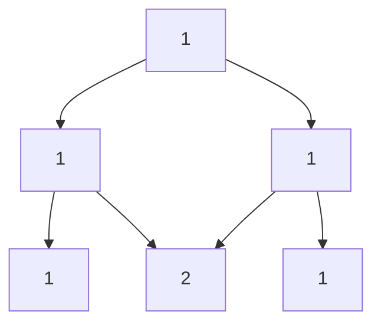

# Chapter 3 — Combinations

*7 sections · 14 questions*

*Chapter 3 · Order Irrelevant*

# Combinations

Selections: why dividing by $r!$ is legitimate, Pascal's triangle from set theory, restricted selections, and the stars-and-bars bijection that turns "identical objects into boxes" into a one-line count. Plus compositions, multinomials, and a first look at partitions.

`$\binom nr$` `Pascal` `stars & bars` `compositions` `multinomial` `partitions (intro)`

### 3.1 From permutations to combinations — why divide by $r!$

**Definition.** A **combination** (an $r$-subset) of a set of $n$ elements is a selection of $r$ elements *without regard to order*. The number is $\binom{n}{r}$.

> **⛁ First Principles — the exact-symmetry division, justified**
>
> Order the $r$ chosen elements: every $r$-subset generates exactly $r!$ permutations (all orderings of its $r$ distinct members), and every such ordering comes from exactly one subset. So the set of all $P(n,r) = \frac{n!}{(n-r)!}$ ordered selections partitions into fibers of size exactly $r!$, one per subset: 
> $$ \binom{n}{r} = \frac{P(n,r)}{r!} = \frac{n!}{r!\,(n-r)!}. $$
>  This division is *exact* (every fiber the same size) — unlike the "divide by symmetry" moves that can fail with identical objects. Notice the definition has now become **computational**: $\binom{n}{r}$ is a ratio of factorials because an $r$-subset is an orbit of the symmetric group $S_r$ acting on ordered selections. (Group actions reappear in full force in the Burnside chapter.)

#### The mirror symmetry

$\binom{n}{r} = \binom{n}{n-r}$. The *reason* is a bijection, not an algebraic trick: **complementation** — $S \mapsto [n]\setminus S$ maps $r$-subsets bijectively to $(n-r)$-subsets. Choosing which $r$ to *keep* is the same information as choosing which $n-r$ to *discard*.

> **💡 Key Idea — the boundary between Ch. 2 and Ch. 3**
>
> Every problem begins with a question: **do the objects I'm building come with labels or positions?** "Arrange, schedule, line up, first/second/third" → permutations. "Choose, select, team, committee, how many subsets" → combinations. Mixed problems ("choose 3 of 10 and arrange them in a row") are compositions of both, in that order.

### 3.2 Pascal's identity and the triangle

**Pascal's identity:** $\binom{n}{r} = \binom{n-1}{r} + \binom{n-1}{r-1}$.

> **⛁ First Principles — the proof is a two-case split on one element**
>
> Count the $r$-subsets of $[n]$. Split by whether the element $n$ is included (**disjoint and exhaustive** — the sum rule):
>
>
> - $n \notin S$: choose an $r$-subset of $[n-1]$: $\binom{n-1}{r}$ ways.
> - $n \in S$: choose the other $r-1$ members from $[n-1]$: $\binom{n-1}{r-1}$ ways.
>
>
> Add: $\binom{n}{r} = \binom{n-1}{r} + \binom{n-1}{r-1}$. **This is the same "split on a distinguished element" move that produced the Fibonacci recurrence, the subsets count, and the Bell recurrence** — one reflex, many theorems.

**Fig 3.1 — Pascal's triangle: each entry is the sum of the two above it (Pascal's identity). The slanted arrows trace the *hockey-stick identity* $\sum_{i=r}^{n}\binom{i}{r} = \binom{n+1}{r+1}$.**

#### The hockey-stick identity

$\displaystyle\sum_{i=r}^{n} \binom{i}{r} = \binom{n+1}{r+1}$.

> **⛁ First Principles — proof by looking at the maximum element**
>
> Count the $(r+1)$-subsets of $[n+1]$. Split by the **largest element** of the subset: if the largest is $i+1$ (so $r \le i \le n$), the other $r$ members are an $r$-subset of $[i]$: $\binom{i}{r}$ ways. Summing over $i$: $\sum_{i=r}^{n}\binom{i}{r}$. But the total is $\binom{n+1}{r+1}$. Done. (Same engine as Pascal's identity: *split by a distinguished element's value*.)

A diagonal of Pascal's triangle is literally the hockey stick: $\binom{1}{1}+\binom{2}{1}+\binom{3}{1}+\binom{4}{1} = 1+2+3+4 = 10 = \binom{5}{2}$ — which, by the way, re-proves the sum $1+2+\cdots+n = \binom{n+1}{2}$ from Chapter 1.

### 3.3 Restricted selections

Real problems never ask for a bare $\binom{n}{r}$. The standard patterns:

| Condition | Tool |
| --- | --- |
| "must include X" / "must exclude X" | fix X (or not), choose the rest: $\binom{n-1}{r-1}$ / $\binom{n-1}{r}$ |
| "at least m from group A" | complement (count < m) or direct case split |
| "exactly a from A and b from B" | product: $\binom{\|A\|}{a}\binom{\|B\|}{b}$ |
| "from groups A, B, C with lower bounds" | sum over valid (a,b,c) triples of products |
| "all of some kind present" (e.g. every suit) | inclusion–exclusion (Chapter 5) |

#### **S1**[JEE Adv][solved][complement]A library has 20 different books, 4 of them are volumes of a specific series. …

A library has 20 different books, 4 of them are volumes of a specific series. In how many ways can you choose 5 books so that **at least one** of the 4 series volumes is included?

Answer + Reasoning

Solution & reasoning

Total: $\binom{20}{5} = 15504$. None of the series: choose all 5 from the other 16: $\binom{16}{5} = 4368$. Answer $= 15504 - 4368 =$ **Answer: 11,136**

"At least one" is the canonical complement trigger (Chapter 1). The direct case split $1 + 2 + 3 + 4$ series volumes works too but is four terms of arithmetic.

#### **S2**[JEE Adv][solved][case split + products]A cricket team of 11 is to be selected from 7 batsmen, 5 bowlers and 3 all-rou…

A cricket team of 11 is to be selected from 7 batsmen, 5 bowlers and 3 all-rounders, with **at least 3 batsmen and at least 2 bowlers**. How many teams?

Answer + Reasoning

Solution & reasoning

Write the team as $(b, w, a)$ with $b+w+a = 11$, $3\le b\le 7$, $2\le w\le 5$, $0\le a\le 3$. All-rounders cap at 3, so enumerate by $a$:

| $a$ | valid $(b,w)$ | count |
| --- | --- | --- |
| 0 | (6,5), (7,4) | $\binom76\binom55 + \binom77\binom54 = 7 + 5 = 12$ |
| 1 | (5,5), (6,4), (7,3) | $21 + 35 + 10 = 66$ |
| 2 | (4,5), (5,4), (6,3), (7,2) | $35 + 105 + 70 + 10 = 220$ |
| 3 | (3,5), (4,4), (5,3), (6,2) | $35 + 175 + 210 + 70 = 490$ |

Total: $12 + 66 + 220 + 490 =$ **Answer: 788**

This is the **multinomial-case-split template**: one free variable (here $a$) plus bounds makes a finite table. JEE Advanced loves this exact shape; the error pattern it catches is missing boundary triples like $(7,3)$ or $(7,2)$ — *always check that the bounds really exclude nothing you need*.

### 3.4 Stars and bars — the master bijection

**Problem A.** In how many ways can $n$ *identical* balls be distributed into $k$ *distinct* boxes, empty boxes allowed?

$$\binom{n+k-1}{k-1}$$

**Problem B (positive).** Same, but every box gets at least one ball: $\binom{n-1}{k-1}$ (put one ball in each box first, then apply Problem A to the remaining $n-k$ balls).

> **⛁ First Principles — why a line of symbols is a distribution**
>
> A distribution is the same data as the $k$-tuple of counts $(x_1, x_2, \dots, x_k)$ with $x_1+\cdots+x_k = n$ (and $x_i \ge 0$ in Problem A). Now the bijection: write $x_1$ stars, a bar, $x_2$ stars, a bar, …, $x_k$ stars: 
> $$ (x_1,\dots,x_k) \;\longleftrightarrow\; \underbrace{*\cdots *}_{x_1}\,\bar{\,}\,
>       \underbrace{*\cdots *}_{x_2}\,\bar{\,}\, \cdots \bar{\,}\, \underbrace{*\cdots *}_{x_k}. $$
>  Every choice of positions for the $k-1$ bars among the $n + k - 1$ symbols gives a valid word — *unlike compositions* (below), no extra restriction is needed, because consecutive bars and empty ends are perfectly legal (they just mean an empty box). Hence the number of words, and the number of distributions, is $\binom{n+k-1}{k-1}$. The "reasoning" is one sentence: **counts-tuples and stars-with-bars words are the same object written two ways.**

**Fig 3.2 — 10 identical balls, 3 distinct boxes: $\binom{10+3-1}{3-1} = \binom{12}{2} = 66$ distributions. The example shows $(3, 1, 6)$.**

| Object | Order? | Repetition? | Example: "4 from {1,2,3,4}" |
| --- | --- | --- | --- |
| **Composition** of $n$ into $k$ parts | ordered | parts are values (repeats ok) | $2+1+1$, $1+2+1$, … are different; count $\binom{n-1}{k-1}$ |
| **Partition** of $n$ into $k$ parts | unordered | repeats ok | $2+1+1$ and $1+2+1$ are the same; count $p_k(n)$ (no closed form!) |
| **Multiset** of size $k$ from $n$ types | unordered | repeats ok | choosing 4 objects where objects come in $n$ kinds; count $\binom{n+k-1}{k}$ |

#### Integer compositions — ordered sums

A **composition** of $n$ into $k$ (positive) parts is an ordered $k$-tuple $(a_1,\dots,a_k)$ of positive integers with sum $n$. Positive stars-and-bars gives $\boxed{\binom{n-1}{k-1}}$: place $k-1$ separators in the $n-1$ gaps between the $n$ unit blocks. (Here the separators *must* go between units — that positivity constraint is exactly what makes compositions use $\binom{n-1}{k-1}$ while box-counts use $\binom{n+k-1}{k-1}$.)

Any number of parts: $\sum_{k=1}^{n}\binom{n-1}{k-1} = 2^{n-1}$ — and there is a one-line bijection: a composition of $n$ ↔ a choice of which of the $n-1$ gaps between $1,1,\dots,1$ ( $n$ ones) get a separator.

#### **S3**[JEE Main][solved][stars & bars]How many non-negative integer solutions does [formula] have? How many positive…

How many **non-negative** integer solutions does $x + y + z = 15$ have? How many **positive** ones?

Answer + Reasoning

Solution & reasoning

Non-negative: $\binom{15+3-1}{3-1} = \binom{17}{2} =$ **Answer: 136**. Positive: $\binom{15-1}{3-1} = \binom{14}{2} =$ **Answer: 91**.

**Complement check (small-case discipline):** solutions of $x+y+z=15$ with at least one zero: exactly one zero: $3\cdot 14 = 42$ (e.g. $x=0$, $y,z\ge 1$, $y+z=15$: 14 pairs); exactly two zeros: 3 (e.g. $x=y=0$, $z=15$); three zeros: 0. Total $45 = 136 - 91$ ✓.

#### **S4**[JEE Adv][solved][multiset / stars & bars]You buy 12 fruits from a stall selling 5 varieties (unlimited stock, only the …

You buy 12 fruits from a stall selling **5 varieties** (unlimited stock, only the counts matter). How many purchase tickets are possible?

Answer + Reasoning

Solution & reasoning

A ticket = $(x_1,\dots,x_5) \ge 0$, $\sum x_i = 12$ = multiset of size 12 from 5 types: $\binom{12+5-1}{5-1} = \binom{16}{4} =$ **Answer: 1,820**

#### **S5**[JEE Adv][solved][compositions + shift]In how many ordered ways can 10 be written as a sum of positive integers, each…

In how many **ordered** ways can 10 be written as a sum of positive integers, **each at least 2**?

Answer + Reasoning

Solution & reasoning

Let the $k$ parts be $a_i \ge 2$. Shift: $b_i = a_i - 1 \ge 1$, $\sum b_i = 10 - k$, a composition of $10-k$ into $k$ parts: $\binom{9-k}{k-1}$ ways (needs $10 - k \ge k$, i.e. $k \le 5$): $k=2: \binom{7}{1} = 7$; $k=3: \binom{6}{2} = 15$; $k=4: \binom{5}{3} = 10$; $k=5: \binom{4}{4} = 1$. Total $=$ **Answer: 33**

Pattern: **constraints on parts → shift the variables → apply the standard form → sum over the (now bounded) number of parts.** The same three-beat sequence solves nearly every composition problem in JEE Advanced.

### 3.5 Multinomial coefficients

Arranging a multiset with $n_1, \dots, n_k$ identical copies of $k$ types (Chapter 2) gives $\dfrac{n!}{n_1!\cdots n_k!}$. This number is the **multinomial coefficient** $\dbinom{n}{n_1, \dots, n_k}$, and it counts something bigger:

> **⛁ First Principles — the two faces of the multinomial**
>
> **Face 1 (arrangements).** Words in an alphabet of $k$ letters with letter $i$ used exactly $n_i$ times — the Ch. 2 count.
>
>
> **Face 2 (partitioning labeled objects).** Dividing $n$ *labeled* people into $k$ groups of sizes $n_1, \dots, n_k$: choose group 1: $\binom{n}{n_1}$; group 2 from the rest: $\binom{n-n_1}{n_2}$; … . The product $\binom{n}{n_1}\binom{n-n_1}{n_2}\cdots = \dfrac{n!}{n_1!\cdots n_k!}$ telescopes to the same number. If the groups themselves are *unlabeled* (and of distinct sizes… beware equal sizes), divide by the appropriate symmetry — the exact-symmetry warning of Ch. 2 applies.
>
>
> **Face 3 (the identity).** $\sum \dbinom{n}{n_1,\dots,n_k} = k^n$ over all compositions of $n$ into $k$ parts (zeros allowed): the multinomial counts colorings of $n$ labeled balls with $k$ colors, grouped by how many got each color. This is the seed of the multinomial theorem — Chapter 4.

#### **S6**[JEE Adv][solved][double counting preview]Prove [formula] .

Prove $\dbinom{2n}{n} = \sum_{k=0}^{n} \binom{n}{k}^2$.

Answer + Reasoning

Solution & reasoning (a double-counting preview)

Let $A, B$ be two labeled sets of size $n$. Count the $n$-subsets of $A \cup B$. **Directly:** $\binom{2n}{n}$. **By the part from $A$:** an $n$-subset uses $k$ elements of $A$ (hence $n-k$ of $B$): $\binom{n}{k}\binom{n}{n-k}$ ways for each $k$; sum over $k$. Since $\binom{n}{n-k} = \binom{n}{k}$, $\binom{2n}{n} = \sum_k \binom{n}{k}^2$. $\square$

This is Vandermonde's identity in the symmetric case — Chapter 4 generalizes the method and collects the whole identity toolkit.

### 3.6 First look: integer partitions

A **partition** of $n$ is a way of writing $n$ as a sum of *positive integers, order ignored*. Denote the count by $p(n)$:

| $n$ | 1 | 2 | 3 | 4 | 5 | 6 | 7 | 8 | 9 | 10 |
| --- | --- | --- | --- | --- | --- | --- | --- | --- | --- | --- |
| $p(n)$ | 1 | 2 | 3 | 5 | 7 | 11 | 15 | 22 | 30 | 42 |

For $n = 4$: $4;\ 3+1;\ 2+2;\ 2+1+1;\ 1+1+1+1$ — 5 partitions, versus $2^{3} = 8$ compositions. Order is everything (and nothing): the same numbers, two different mathematical worlds.

> **⛁ First Principles — why partitions are hard (and interesting)**
>
> Compositions and multisets have bijections to words (stars and bars) — that's why they have closed forms. Partitions have *no such word model*: there is no known simple bijection between partitions of $n$ and any object with a known count. Instead the subject lives on **generating functions**: $p(n)$ is the coefficient of $x^n$ in $\prod_{k=1}^{\infty}\frac{1}{1-x^k}$ (each part-size $k$ can be used any number of times — the geometric series). The deepest theorems (Euler's pentagonal number theorem, partitions-into-distinct = partitions-into-odd) are theorems *about this infinite product*. Chapter 6 develops the machinery and proves Euler's theorem; for now, note the shape: **when no bijection exists, the coefficient of a generating function becomes the count.**

> **🏛 Olympiad Extension — the first surprising partition fact**
>
> Already provable at this level: the number of partitions of $n$ **into distinct parts** equals the number **into odd parts** (Euler, 1748). The proof (Chapter 6) is a single line of generating functions: $\prod (1+x^k) = \prod_{\text{odd } m}\frac{1}{1-x^m}$. Keep it in mind when you meet "distinct" vs "odd" in problems — it is not a coincidence, it is a theorem.

### 3.7 Practice set

#### **P1**[JEE Main][practice][product of choices]From 6 boys and 5 girls, form a 4-member committee with exactly 2 boys and 2 g…

From 6 boys and 5 girls, form a 4-member committee with exactly 2 boys and 2 girls.

Answer + Reasoning

$\binom62\binom52 = 15\cdot 10 =$ **150**.

#### **P2**[Olympiad][practice][IE (Ch. 5)]From a 52-card deck, how many 6-card hands contain all four suits ?

From a 52-card deck, how many 6-card hands contain **all four suits**?

Answer + Reasoning

IE on the missing suits: $\binom{52}{6} - 4\binom{39}{6} + 6\binom{26}{6} - 4\binom{13}{6}
        = 20{,}358{,}520 - 13{,}050{,}492 + 1{,}381{,}380 - 6{,}864 =$ **8,682,544**.

#### **P3**[JEE Adv][practice][stars & bars + bound]Non-negative solutions of [formula] with [formula] .

Non-negative solutions of $x_1 + x_2 + x_3 + x_4 = 20$ with $x_1 \le 5$.

Answer + Reasoning

Total $\binom{23}{3} = 1771$. Bad ($x_1 \ge 6$): shift $x_1' = x_1 - 6 \ge 0$: $x_1' + x_2 + x_3 + x_4 = 14$: $\binom{17}{3} = 680$. Answer $1771 - 680 =$ **1,091**.

#### **P4**[JEE Main][practice][stars & bars + bound]Non-negative solutions of [formula] with [formula] .

Non-negative solutions of $a + b + c = 20$ with $a \le 7$.

Answer + Reasoning

$\binom{22}{2} - \binom{14}{2} = 231 - 91 =$ **140**.

#### **P5**[JEE Adv][practice][multiset arrangement]Arrange in a row: 5 identical red, 4 identical blue, 2 identical green, 2 iden…

Arrange in a row: 5 identical red, 4 identical blue, 2 identical green, 2 identical white balls.

Answer + Reasoning

$\dfrac{13!}{5!\,4!\,2!\,2!} = \dfrac{6{,}227{,}020{,}800}{120\cdot 24 \cdot 4} =$ **540,540**.

#### **P6**[Olympiad][practice][Vandermonde]Prove [formula] .

Prove $\displaystyle\sum_{k} \binom{n}{k}\binom{n}{k+1} = \binom{2n}{n+1}$.

Answer + Reasoning

Vandermonde: $\sum_k \binom{n}{k}\binom{n}{m-k} = \binom{2n}{m}$ with $m = n+1$: $\binom{n}{m-k} = \binom{n}{n+1-k} = \binom{n}{k-1}$, so LHS becomes $\sum_k \binom{n}{k}\binom{n}{k-1} = \binom{2n}{n+1}$ after the index shift $k\mapsto k+1$. ✓ (Committee story: $(n+1)$-subsets of a $(2n)$-set split into two $n$-halves.)

#### **P7**[JEE Main][practice][multiset]Choose 10 objects from 7 types, repetition allowed, order irrelevant.

Choose 10 objects from 7 types, repetition allowed, order irrelevant.

Answer + Reasoning

$\binom{10+7-1}{7-1} = \binom{16}{6} =$ **8,008**.

#### **P8**[Olympiad][practice][compositions + IE]Compositions of 12 into exactly 4 positive parts, each part at most 5 .

Compositions of 12 into exactly 4 positive parts, **each part at most 5**.

Answer + Reasoning

Total positive compositions: $\binom{11}{3} = 165$. A part $\ge 6$: shift it down by 6 (say $x_1 = x_1' + 6$, $x_1' \ge 0$): $x_1' + x_2 + x_3 + x_4 = 6$ with $x_2,x_3,x_4 \ge 1$ → make all non-negative: sum $3$ in 4 variables: $\binom{6}{3} = 20$ per part, $4 \cdot 20 = 80$. Two parts $\ge 6$ would force the other two positive to sum to $-2$: impossible. Answer $165 - 80 =$ **85**.

---

