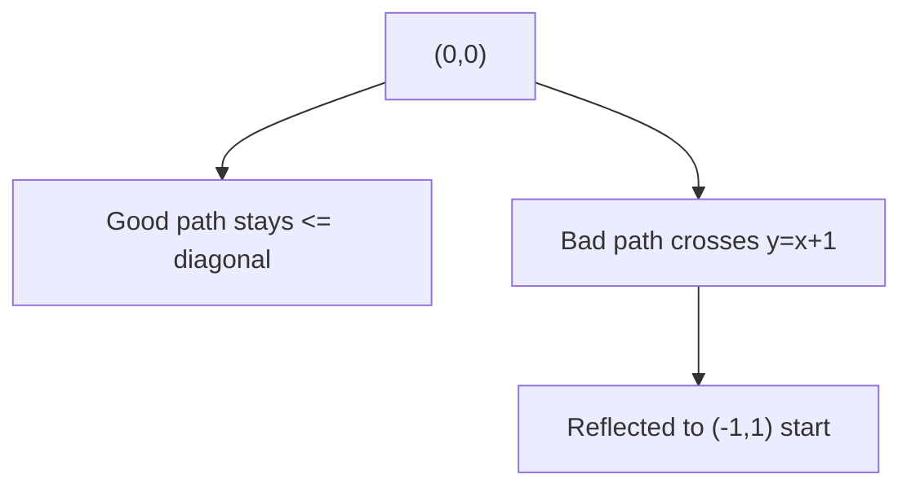
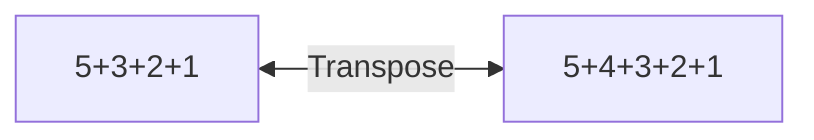

# Chapter 6 — Olympiad Theory

*7 sections · 13 questions*

*Chapter 6 · The Frontier*

# Olympiad Theory

Generating functions as a working tool, lattice paths and the reflection principle, Catalan numbers, Burnside–Pólya enumeration, integer partitions and Euler's theorems, Stirling numbers, and a gallery of the lemmas that carry Olympiad proofs.

`generating functions` `reflection principle` `Catalan` `ballot` `Burnside–Pólya` `partitions & Euler` `Stirling · Bell` `Sperner · cycle lemma`

### 6.1 Generating functions — from trick to tool

> **⛁ First Principles — the definition, in counting language**
>
> Given a counting sequence $a_0, a_1, a_2, \dots$ (number of objects of size 0, 1, 2, …), its **ordinary generating function** is $A(x) = \sum_{n\ge 0} a_n x^n$. The rule of the language: **"the coefficient of $x^n$" means "the number of objects of size $n$"**, and algebra on $A(x)$ translates to combinatorial operations:
>
>
> - $A(x)B(x)$: build an object by **two independent stages**, sizes adding.
> - $\dfrac{1}{1 - B(x)} = 1 + B + B^2 + \cdots$: a **sequence** (possibly empty) of pieces from a family with GF $B$.
> - $1 + B(x)$: a piece **or nothing**.
> - $\dfrac{1}{1 - x^a}$: **any number** of pieces of size $a$.
>
>
> These four moves generate essentially every elementary enumeration in this course. The "proof" that the GF of compositions into parts from $S$ is $\frac{1}{1 - (x^{s_1} + \cdots)}$ is the sequence rule; the "proof" that the GF of non-negative $k$-tuples summing to $n$ is $(1-x)^{-k}$ is the stars-and-bars of Ch. 3. *Nothing new is being assumed — everything is being re-expressed so that addition and multiplication of problems become addition and multiplication of polynomials.*

| GF | Sequence | Meaning |
| --- | --- | --- |
| $\dfrac{1}{1-x} = \sum x^n$ | $1,1,1,\dots$ | any number of size-1 pieces |
| $\dfrac{1}{1-x^a}$ | 1 at multiples of $a$ | any number of size-$a$ pieces |
| $(1-x)^{-k} = \sum \binom{n+k-1}{k-1} x^n$ | $\binom{n+k-1}{k-1}$ | non-negative $k$-tuples (stars & bars, §4.4) |
| $(1+x)^n$ | $\binom{n}{k}$ | choose or skip each of $n$ labeled pieces |
| $\dfrac{1}{1-x-x^2}$ | $F_{n+1}$ | compositions with parts $\{1,2\}$ |
| $\displaystyle\prod_{k\ge 1}\frac{1}{1-x^k}$ | $p(n)$ | integer partitions (Ch. 6.4) |
| $\displaystyle\prod_{k\ge 1}(1+x^k)$ | distinct-part partitions | each part size used 0 or 1 times |

### 6.2 Lattice paths, the reflection principle & Catalan numbers

A **monotone lattice path** from $(0,0)$ to $(a,b)$ uses steps $R = (1,0)$ and $U = (0,1)$. Without restriction: choose where the $b$ up-steps go: $\binom{a+b}{b}$.

**Fig 6.1 — Reflection principle: a path that first crosses the line $y = x+1$ (dashed purple) is bijected to an unrestricted path starting one unit left-down at $(-1,1)$. Count bad paths by counting easier paths from a shifted origin.**

> **⛁ First Principles — why reflection works (the bijective core)**
>
> Take a "bad" path from $(0,0)$ to $(a,b)$ that at some point reaches the line $y = x+1$. Look at the **first** such point. Reflect the portion of the path up to and including that point in the line $y = x+1$ (swap the roles of the two coordinates, shifted by 1). The reflected prefix starts at $(-1, 1)$ and the path continues (unchanged) to $(a,b)$. This is a bijection between "bad paths $(0,0) \to (a,b)$" and "all paths $(-1,1) \to (a,b)$": the inverse is to take any path from $(-1,1)$ to $(a,b)$ — it must cross $y=x+1$ — and reflect its first-crossing prefix back. No choices were made; each bad path corresponds to exactly one shifted path. This "first crossing + reflect" argument is a reusable bijection template (it also proves the cycle lemma, below).

#### The Catalan numbers

Paths from $(0,0)$ to $(n,n)$ that never go strictly above the diagonal $y = x$ ("Dyck paths"): total $\binom{2n}{n}$, minus bad. Bad paths ↔ paths from $(-1,1)$ to $(n,n)$: that's $n+1$ R-steps and $n-1$ U-steps: $\binom{2n}{n-1} = \binom{2n}{n+1}$. Hence

$$C_n = \binom{2n}{n} - \binom{2n}{n+1} = \frac{1}{n+1}\binom{2n}{n}$$

Values: $1, 1, 2, 5, 14, 42, 132, 429, 1430, 4862, 16796$ for $n = 0, 1, \dots, 10$.

#### Why the Catalan number counts so many different things

Every standard Catalan object has the same **decomposition**: *first return to the ground splits the object into an inside and an outside, each a smaller copy of the same type*. Concretely, a Dyck path is $U$ (Dyck path) $D$ (Dyck path): the part between the first up-step and its matching down-step is a Dyck path, and so is the remainder. This gives the convolution recurrence 
$$ C_{n+1} = \sum_{i=0}^{n} C_i C_{n-i}, $$
 which (together with $C_0 = 1$) has the unique solution $C_n = \frac{1}{n+1}\binom{2n}{n}$. The same first-return decomposition appears in: **balanced parentheses** ($\text{expr} = (\text{expr})\,\text{expr}$), **full binary trees** (root's left and right subtrees), **triangulations of a convex $(n+2)$-gon** (the triangle containing side $(1, n+2)$ splits the polygon), **non-crossing perfect matchings** (the arc from 1 splits the circle). One shape, four faces — and recognizing the shape is what solves these problems in seconds at Olympiad level.

#### Ballot theorem (Bertrand) and the (a, b) generalization

$$\#\{\text{paths } (0,0)\to(a,b),\ a\ge b,\ \text{never above } y=x\}
      = \frac{a-b+1}{a+1}\binom{a+b}{b}$$ $$\#\{\text{vote orders, A: }p,\ B:\ q,\ p>q,\ \text{A strictly ahead throughout}\}
      = \frac{p-q}{p+q}\binom{p+q}{q}$$

> **⛁ First Principles — one reflection argument, two corollaries**
>
> **First formula.** Total paths $(0,0)\to(a,b)$: $\binom{a+b}{b}$. "Going above the diagonal" means reaching $y = x+1$; by reflection those are the paths from $(-1,1)$ to $(a,b)$: $a+1$ R-steps, $b-1$ U-steps: $\binom{a+b}{b-1}$. Subtract: $\binom{a+b}{b} - \binom{a+b}{b-1}
>       = \binom{a+b}{b}\left(1 - \frac{b}{a+1}\right)
>       = \frac{a-b+1}{a+1}\binom{a+b}{b}$. Check $a = b = n$: recovers the Catalan number ✓.
>
>
> **Ballot.** "A strictly ahead throughout" = a path from $(0,0)$ to $(p,q)$ (A-vote $=$ R, B-vote $=$ U) whose every prefix has $x > y$. The first step is therefore R, so this is the set of paths $(1,0) \to (p,q)$ that *never touch* $y = x$. Count $=$ total $-$ bad, where bad paths (first touch of $y=x$) reflect into paths $(0,1) \to (p,q)$: 
> $$ \binom{p+q-1}{q} - \binom{p+q-1}{q-1}
>       = \binom{p+q-1}{q}\cdot\frac{p-q}{p}
>       = \frac{p-q}{p+q}\binom{p+q}{q} $$
>  (the two displayed forms are equal since $\binom{p+q}{q} = \frac{p+q}{p}\binom{p+q-1}{q}$; verify: $p=5, q=3$: both give 14). The cycle lemma (§6.6) yields the same count by a *different* bijection (cyclic shifts) — see that section for the contrasting style.

#### **S2**[Olympiad][solved][Catalan · reflection]Count monotone paths from [formula] to [formula] that never go above the diago…

Count monotone paths from $(0,0)$ to $(4,4)$ that never go above the diagonal.

Answer + Reasoning

Solution

$C_4 = \binom{8}{4} - \binom{8}{5} = 70 - 56 =$ **Answer: 14**

Equivalently $\frac{1}{5}\binom{8}{4}$ — the $\frac{1}{n+1}$ factor is the "one out of $n+1$ cyclic positions stays above the diagonal" shadow of the cycle lemma.

#### **S3**[Olympiad][solved][ballot]In an election, A receives 5 votes and B receives 3. In how many counting orde…

In an election, A receives 5 votes and B receives 3. In how many counting orders is A **strictly ahead** throughout the count (after every vote that is cast)?

Answer + Reasoning

Solution

Ballot: $\frac{5-3}{5+3}\binom{8}{3} = \frac{2}{8}\cdot 56 =$ **Answer: 14**

### 6.3 Burnside's lemma & Pólya enumeration

New problem type: count **essentially different** colorings, where "same up to symmetry" (rotation, flip…) is identified. Ch. 2's "divide by $n!$" worked because every orbit had the same size. With identical beads, some colorings are *fixed by* non-trivial symmetries — orbits can have different sizes. Burnside's lemma handles exactly this.

> **⛁ First Principles — the lemma and its two-line proof**
>
> Let a finite group $G$ act on a finite set $X$ of colorings. The **orbits** (symmetry classes) have number 
> $$ \#\text{orbits} \;=\; \frac{1}{|G|} \sum_{g \in G} |\mathrm{Fix}(g)|,
>       \qquad \mathrm{Fix}(g) = \{x \in X : g \cdot x = x\}. $$
>  **Proof (double counting).** Count pairs $(g, x)$ with $g\cdot x = x$. By $g$: $\sum_g |\mathrm{Fix}(g)|$. By $x$: a coloring $x$ is fixed exactly by its stabilizer, of size $|G|/|\text{orbit}(x)|$. So the pair-count $=
>       \sum_x |G|/|\text{orbit}(x)|$. Dividing by $|G|$… this gives $\sum_x \frac{1}{|\text{orbit}(x)|} = \frac{1}{|G|}\sum_g |\mathrm{Fix}(g)|$, and the left side is a sum over orbits of $\frac{|\text{orbit}|}{|\text{orbit}|} = 1$ per orbit — so it equals the number of orbits. $\square$
>
>
> **Why it is true at a deeper level:** averaging the number of fixed points counts each orbit with weight exactly 1, regardless of its size — the orbit of size $|G|/|H|$ contributes $|H|$ to $\sum |\mathrm{Fix}(g)|$ (its $|H|$ stabilizers, each fixing it), which is $|G|$ times its weight $\tfrac{|H|}{|G|}$… the averaging is the unique linear statistic on $\{|\mathrm{Fix}(g)|\}$ that is constant on orbits. (This is the same "weight exactly 1 per object" philosophy as inclusion–exclusion — the two theorems are cousins.)

#### Worked — the full necklace computation

**Problem.** Beads come in $k$ colors. Count distinct **necklaces** (closed rings, rotations identified, flips *not*) of length $n$.

A rotation by $s$ positions has $\gcd(n, s)$ cycles on the $n$ beads, so it fixes $k^{\gcd(n,s)}$ colorings. Grouping rotations by $d = \gcd(n, s)$: there are $\varphi(n/d)$ of them (Euler's totient counts the $s \in \{1,\dots,n\}$ with $\gcd(n,s) = n/d$). Burnside:

$$N(n, k) = \frac{1}{n}\sum_{d \mid n} \varphi(d)\, k^{n/d}$$

**Example: 4 beads, 2 colors.** $N(4,2) = \frac{1}{4}\big(\varphi(1)2^4 + \varphi(2)2^2 + \varphi(4)2^1\big)
    = \frac{1}{4}(16 + 4 + 4) = 6$. List to verify: RRRR, RRRB, RRBB (adjacent pair), RBRB (alternating), RBBB, BBBB — 6 ✓. (This is the rotation-only version of "bead bracelets". Adding the reflections of the square, the full dihedral count is $\frac{1}{8}(24 + 16 + 8) = 6$: the same 6 classes, all flip-stable as classes — but the orbit sizes under the full group are $1, 1, 2, 4, 4, 4$ (they sum to 16): RBRB is flip-symmetric, RRBB is fixed pointwise by a reflection, while RRRB, RBBB form 4-orbits and RRRR, BBBB are fixed by everything. This non-uniformity — some orbits size 1, some size 4 — is exactly what "divide by $|G|$" cannot handle, and what Burnside was built for.)

#### Pólya's enumeration theorem — the cycle index (the general engine)

Burnside with "colors weighted" becomes Pólya. For the rotation group $C_4$ acting on the 4 vertices of a square, the **cycle index** is $Z(C_4) = \frac{1}{4}\left(x_1^4 + x_2^2 + 2x_4\right)$ (identity: four 1-cycles; $180^\circ$: two 2-cycles; $90^\circ, 270^\circ$: one 4-cycle each). The number of $k$-colorings is $Z(k, k, k, k) = \frac{1}{4}(k^4 + k^2 + 2k)$; for $k = 2$: $\frac{16 + 4 + 4}{4} = 6$ ✓ (matches the necklace formula — a square's vertex-coloring class under rotation *is* a length-4 necklace). The power of the cycle index: substitute $k_i \mapsto$ (sum of color weights raised to $i$) to get a **generating function of the colorings by color counts** at once — the full Pólya theorem. For JEE/Olympiad purposes, the necklace/bracelet formulas + Burnside on small groups cover 95% of the needs.

#### **S4**[Olympiad][solved][Burnside]The vertices of a regular hexagon are colored with 2 colors. Count colorings u…

The vertices of a regular hexagon are colored with 2 colors. Count colorings up to the full symmetry group (rotations and reflections, $|G| = 12$).

Answer + Reasoning

Solution

Count $\mathrm{Fix}(g)$ for each $g$ (a coloring is fixed by $g$ iff it is constant on the cycles of $g$: $2^{\#\text{cycles}}$ choices):

| symmetry | count | cycle structure | fixed colorings |
| --- | --- | --- | --- |
| identity | 1 | 1+1+1+1+1+1 | 64 |
| rotation $60^\circ, 300^\circ$ | 2 | one 6-cycle | 2 each |
| rotation $120^\circ, 240^\circ$ | 2 | two 3-cycles | 4 each |
| rotation $180^\circ$ | 1 | three 2-cycles | 8 |
| refl. through opposite vertices | 3 | 2 fixed + two 2-cycles | 16 each |
| refl. through opposite edges | 3 | three 2-cycles | 8 each |

Sum: $64 + 4 + 8 + 8 + 48 + 24 = 156$. Orbits: $156/12 =$ **Answer: 13** (bracelets of 6 beads, 2 colors — verify against the bracelet formula $\frac{1}{2n}\left(\sum_{d|n}\varphi(d)k^{n/d} + \frac{n}{2}(k^{n/2+1} + k^{n/2})\right)
        = \frac{1}{12}(84 + 72) = 13$ ✓ — the rotation sum $\sum_{d|6}\varphi(d)2^{6/d} = 84$.)

### 6.4 Integer partitions — deeper

#### The generating function and its consequences

A partition of $n$ is a multiset of positive integers summing to $n$: choose how many 1's, how many 2's, … — independently, with total weight $n$. Hence (from §6.1's catalog) 
$$ p(n) = [x^n]\prod_{k=1}^{\infty}\frac{1}{1-x^k}. $$
 Values: $p(0)=1, p(1)=1, p(2)=2, p(3)=3, p(4)=5, p(5)=7, p(6)=11, p(7)=15, p(8)=22,$ $p(9)=30, p(10)=42, p(20)=627$.

> **⛁ First Principles — Euler's pentagonal number theorem (statement + consequence)**
>
> **Euler (1737).** 
> $$ \prod_{k=1}^{\infty}(1 - x^k) = \sum_{j=-\infty}^{\infty} (-1)^j x^{j(3j-1)/2}
>       = 1 - x - x^2 + x^5 + x^7 - x^{12} - x^{15} + \cdots $$
>  (the exponents $1, 2, 5, 7, 12, 15, 22, \dots$ are the *generalized pentagonal numbers* $j(3j\pm1)/2$). This is one of the most beautiful identities in mathematics; its product side is the "one of each part size, with a sign" generating function, and the sparse series on the right is the miracle.
>
>
> **Consequence (the pentagonal recurrence).** Multiply $\prod(1-x^k)$ by $\prod(1-x^k)^{-1} = \sum p(n)x^n$; the left side is 1, so 
> $$ p(n) = p(n-1) + p(n-2) - p(n-5) - p(n-7) + p(n-12) - p(n-15) + \cdots $$
>  (terms with negative argument are 0). **Verify on $p(10)$:** $p(10) = p(9) + p(8) - p(5) - p(3) = 30 + 22 - 7 - 3 = 42$ ✓ — a partition number computed without enumerating a single partition. (This is how partitions were computed for centuries: a recurrence with a *fixed* list of step sizes, no closed form in sight.)

#### Euler: distinct parts = odd parts (the clean GF proof)

> **⛁ First Principles — a two-line proof of a 275-year-old theorem**
>
> GF for partitions into **distinct** parts: $\prod_{k\ge 1}(1 + x^k)$ (each part size used 0 or 1 times). GF into **odd** parts: $\prod_{m\ \mathrm{odd}}\frac{1}{1-x^m}$. Now 
> $$ \prod_{k\ge 1}(1+x^k) = \prod_{k\ge 1}\frac{1-x^{2k}}{1-x^k}
>       = \frac{\prod_{k\ge 1}(1-x^{2k})}{\prod_{k\ge 1}(1-x^k)}
>       = \frac{1}{\prod_{k\ge 1}(1-x^k)} \cdot \prod_{k\ge 1}(1-x^{2k})
>       = \frac{1}{\prod_{m\ \mathrm{odd}}(1-x^m)}, $$
>  because $\prod_k (1-x^k) = \prod_{m\ \mathrm{odd}}(1-x^m)\cdot\prod_k(1-x^{2k})$. The two generating functions are identical, so the counts agree for every $n$. For $n = 10$: distinct-part partitions of 10: $10, 9+1, 8+2, 7+3, 7+2+1, 6+4, 6+3+1,
>       5+4+1, 5+3+2, 4+3+2+1$ → **10**; odd-part partitions: $9+1, 7+3, 7+1+1+1, 5+5, 5+3+1+1, 5+1^5, 3+3+3+1, 3+3+1^4,
>       3+1^7, 1^{10}$ → **10** ✓.

#### Conjugation — the Young diagram bijection

**Fig 6.2 — Conjugation: the partition 5+3+2+1 transposes to 5+4+3+2+1. "At most $k$ parts" mirrors "largest part $\le k$" — a pure bijection, no counting.**

**Theorem.** Partitions of $n$ into **at most $k$ parts** are in bijection with partitions of $n$ with **largest part $\le k$** (transpose the Young diagram). In particular, "exactly $k$ parts" ↔ "largest part exactly $k$" — the *duality* halves the number of cases in any restricted count. Don't confuse partitions with compositions here: the number of *ordered* sums of $n$ into exactly $k$ positive parts is $\binom{n-1}{k-1}$, while partitions into exactly $k$ parts have no closed form (a warning you'll feel the moment you try to guess one).

### 6.5 Stirling numbers, Bell numbers, surjections

**Stirling numbers of the second kind** $S(n,k)$: the number of ways to partition an $n$-element set into $k$ nonempty *unlabeled* blocks. "Unlabeled blocks" is the twist that separates them from ordinary selections.

> **⛁ First Principles — the recurrence: "where does n go?"**
>
> Track the element $n$ in a partition of $[n]$ into $k$ blocks:
>
>
> - **$n$ joins an existing block** of a partition of $[n-1]$ into $k$ blocks: $k$ choices of block → $k\,S(n-1, k)$.
> - **$n$ forms a new singleton block**: partition $[n-1]$ into $k-1$ blocks: $S(n-1, k-1)$.
>
>
> Disjoint and exhaustive: $S(n,k) = k\,S(n-1,k) + S(n-1,k-1)$, $S(n,0) = 0\ (n\ge1), S(0,0) = 1, S(n,n) = 1$.

#### The closed form — inclusion–exclusion again

$$S(n,k) = \frac{1}{k!}\sum_{j=0}^{k}(-1)^{j}\binom{k}{j}(k-j)^{n}
      \qquad\text{so}\qquad k!\,S(n,k) = \sum_{j=0}^{k}(-1)^{j}\binom{k}{j}(k-j)^{n}$$

The right side is the number of **onto functions** $[n]\to[k]$ (Ch. 4, S3) — and onto functions are exactly block-partitions with the blocks *labeled* (block $i$ = fiber of $i$). Unlabeling the $k$ blocks divides by $k!$. *Every formula in this chapter has re-derived IE at least once; this is the fourth appearance.*

| $n\backslash k$ | 1 | 2 | 3 | 4 | 5 | 6 |
| --- | --- | --- | --- | --- | --- | --- |
| 1 | 1 |  |  |  |  |  |
| 2 | 1 | 1 |  |  |  |  |
| 3 | 1 | 3 | 1 |  |  |  |
| 4 | 1 | 7 | 6 | 1 |  |  |
| 5 | 1 | 15 | 25 | 10 | 1 |  |
| 6 | 1 | 31 | 90 | 65 | 15 | 1 |

**Bell numbers** $B_n = \sum_k S(n,k)$: partitions of $[n]$ into any number of blocks: $1, 1, 2, 5, 15, 52, 203, \dots$. (Recurrence $B_{n+1} = \sum_k \binom{n}{k} B_k$: split by the block containing 1.)

#### **S5**[Olympiad][solved][Stirling]Compute [formula] two ways, and count the ways to divide 6 people into 3 unlab…

Compute $S(6, 3)$ two ways, and count the ways to divide 6 people into 3 unlabeled pairs.

Answer + Reasoning

Solution

**Recurrence:** $S(6,3) = 3S(5,3) + S(5,2) = 3\cdot 25 + 15 = 90$.

**Closed form:** $\frac{1}{6}(3^6 - 3\cdot 2^6 + 3\cdot 1^6)
        = \frac{729 - 192 + 3}{6} = 90$ ✓.

**Unlabeled pairs:** $\frac{6!}{(2!)^3\, 3!} = \frac{720}{8\cdot 6} =$ **Answer: 15** (Ch. 2's labeling argument: label the pairs to get $6!/(2!)^3$, divide by $3!$ for pair order — exact symmetry since all pairs have size 2 and are distinct objects).

### 6.6 Gallery of Olympiad lemmas

#### The cycle lemma (Dvoretzky–Motzkin, 1959)

**Statement.** Let $a_1, \dots, a_m \in \{+1, -1\}$ with total sum $p - q > 0$ ($p$ plus-ones, $q$ minus-ones). Then exactly $p - q$ of the $m$ cyclic shifts have *all positive partial sums* (every prefix sum $> 0$).

> **⛁ First Principles — full proof of the base case $p - q = 1$**
>
> Set $s_0 = 0$, $s_k = a_1 + \cdots + a_k$, so $s_m = 1$. Call $j \in \{0, \dots, m-1\}$ the **last minimum** index: $s_j \le s_u$ for all $u \in \{0, \dots, m-1\}$, and $s_u > s_j$ for all $u \in \{j+1, \dots, m-1\}$ (ties broken by taking the *last* occurrence).
>
>
> **Claim: the unique good shift starts at position $j+1$.** (*Good ⇒ starts after the last minimum.* Suppose the shift starting after index $i-1$ is good. Its $m$ window positions cover every residue mod $m$ exactly once, with extended sums $s_{v+m} = s_v + 1$. If some $v \in \{0, \dots, m-1\}$ had $s_v &lt; s_{i-1}$, the window value at residue $v$ would be $s_v$ (if $v \ge i$) or $s_v + 1$ (if $v &lt; i$) — in both cases $&lt; s_{i-1} + 1$, i.e. a partial sum $\le 0$, contradicting goodness. So $s_{i-1}$ is a minimum. If some $u \in \{i, \dots, m-1\}$ had $s_u = s_{i-1}$, the window value at $u$ would give a partial sum $0$ — contradiction. Hence $i-1$ is a minimum with no later tie: the last minimum. $i - 1 = j$. *(Uniqueness of the good shift follows.)*
>
>
> *(Starts after the last minimum ⇒ good.)* For the shift after $j$: for $u \in \{j+1, \dots, m\}$, goodness needs $s_u - s_j \ge 1$. For $u \le m-1$: $s_u > s_j$ (last minimum) and the sums are integer, so $s_u \ge s_j + 1$ ✓; for $u = m$: $s_m = 1 \ge s_j + 1$ since $s_j \le 0$ ✓. For the wrapped part ($t > m - j$): the partial sum is $s_m + s_{t-m} - s_j = 1 + s_{t-m} - s_j \ge 1$ since $s_{t-m} \ge s_j$ (global minimum) ✓. All partial sums $\ge 1$. $\square$
>
>
> **The general case $p - q = S$, rigorously.** Extend periodically ($s_{k+m} = s_k + S$); a shift starting after index $i$ is good $\Leftrightarrow
>       s_i &lt; s_{i+1}, \dots, s_{i+m-1}$ (its $m$ window values). Let $\mu = \min\{s_0, \dots, s_{m-1}\}$ (note $\mu \le 0$, and the minimum is attained in $0, \dots, m-1$). For each level $\ell \in \{\mu, \mu+1, \dots, \mu+S-1\}$, let $j(\ell)$ be the **last index in $\{0, \dots, m\}$ with $s = \ell$.** *(i) Each $j(\ell)$ is good.* For $u \in \{j+1, \dots, m\}$: $s_u \ne \ell$ (lastness) and $s_u &lt; \ell$ is impossible — the walk ends at $s_m = S \ge \ell + 1$ (since $\ell \le \mu + S - 1 \le S - 1$) and a $\pm 1$-walk must pass through $\ell$ on the way back up. So $s_u \ge \ell + 1$. For the wrapped window values $s_{v+m} = s_v + S$ with $v &lt; j$: $s_v + S \ge \mu + S \ge \ell + 1$. *(ii) Two good indices never share a level.* If $i_1 &lt; i_2$ are both good with $s_{i_1} = s_{i_2} = \ell$, then $i_2$ sits in $i_1$'s window at the same level — violating "all window values $&gt; s_{i_1}$". *(iii) Every good index lies at one of these levels.* If $s_i \ge \mu + S$, then the last global-minimum index $r$ ($s_r = \mu$) sits in $i$'s window at value $\mu$ (if $r \ge i$) or $\mu + S \le s_i$ (if $r &lt; i$) — either way $\le s_i$, contradicting goodness. Hence $|G| \ge S$ (from (i), $S$ distinct levels) and $|G| \le S$ (from (ii)–(iii)): $\boxed{|G| = S}$. $\square$
>
>
> Consequence for ballot problems: of the $\binom{p+q}{q}$ vote orders (A = +1), cyclic orbits have size $p+q$ and contain exactly $p-q$ good shifts — matching the reflection count $\frac{p-q}{p+q}\binom{p+q}{q}$ of §6.2 by a *different* bijection. (In this course the reflection principle is the workhorse; reach for the cycle lemma when the problem is phrased cyclically — e.g. seating problems around a table with a running-tally condition.)

#### Sperner's theorem (via the LYM inequality)

**Statement.** Let $\mathcal{F}$ be an **antichain** of subsets of $[n]$ (no member contains another). Then $|\mathcal{F}| \le \binom{n}{\lfloor n/2\rfloor}$ — the middle layer alone is the largest antichain.

> **⛁ First Principles — the LYM proof (a 5-line gem)**
>
> Take a **uniformly random permutation** $\pi$ of $[n]$, and look at its initial segments $\emptyset, \pi_1, \pi_1\pi_2, \dots, [n]$ — a random *saturated chain* through the subset lattice. Any antichain $\mathcal{F}$ meets this chain in **at most one** set (chain = totally ordered by inclusion; antichain = no two comparable). The probability the chain passes through a fixed $k$-set $A$ is $\frac{1}{\binom{n}{k}}$ (the chain visits exactly one set of each size $k$, uniformly). So 
> $$ 1 \ \ge\ \Pr[\text{chain hits } \mathcal{F}]
>       \ =\ \sum_{A\in\mathcal{F}} \frac{1}{\binom{n}{|A|}}
>       \ \ge\ \sum_{A\in\mathcal{F}} \frac{1}{\binom{n}{\lfloor n/2\rfloor}}
>       \ =\ \frac{|\mathcal{F}|}{\binom{n}{\lfloor n/2\rfloor}}, $$
>  since the middle binomial is the largest. Rearranged: $|\mathcal{F}| \le \binom{n}{\lfloor n/2\rfloor}$. $\square$ **Technique to steal:** "random maximal chain + at most one hit" — the LYM inequality is the template; it proves the same theorem for any graded poset with the same "chain probability" computation.

#### Erdős–Szekeres (the "up or down" theorem)

**Statement.** Every sequence of $(r-1)(s-1) + 1$ *distinct* real numbers contains an increasing subsequence of length $r$ or a decreasing one of length $s$. (In particular: $n^2 + 1$ distinct reals contain a monotone subsequence of length $n+1$.)

> **⛁ First Principles — the pair labeling + pigeonhole proof**
>
> To each term $a_i$, attach the pair $(I_i, D_i)$ where $I_i$ = length of the longest *increasing* subsequence **starting at $a_i$**, $D_i$ = same for decreasing. **Key claim:** no two terms have the same pair: if $i &lt; j$ and $(I_i, D_i) = (I_j, D_j)$, then $a_i &lt; a_j$ lets the increasing subsequence at $j$ be prefixed by $a_i$ (so $I_i \ge I_j + 1$, contradiction); and $a_i &gt; a_j$ gives the contradiction for $D_i$. So the $(r-1)(s-1)+1$ pairs are distinct. But if every $I_i \le r-1$ and every $D_i \le s-1$, there are at most $(r-1)(s-1)$ possible pairs — a pigeonhole contradiction. Hence some $I_i \ge r$ or some $D_i \ge s$. $\square$
>
>
> The *pattern* is the lesson: **label each object by two "future length" numbers, prove labels are distinct, pigeonhole the label space.** This is the most-copied proof template of Olympiad combinatorics.

> **🏛 Teaser — the probabilistic method (Erdős)**
>
> A *lower bound* can sometimes be proved by showing a random object usually has the desired property. For $R(3,3)$ the lower bound is *explicit*, not probabilistic: color the edges of the 5-cycle red and its diagonals blue (paper Q24) — each color class is a 5-cycle, which contains no triangle, so $R(3,3) > 5$. The probabilistic method (Erdős, 1947) enters for larger parameters: color the edges of $K_n$ red/blue at random. A given $k$-clique is monochromatic with probability $2 \cdot 2^{-\binom{k}{2}}
>       = 2^{1-\binom{k}{2}}$, so the expected number of monochromatic $k$-cliques is $\binom{n}{k}\, 2^{1-\binom{k}{2}}$. If this expectation is $&lt; 1$, *some* coloring has none at all — hence $R(k,k) &gt; n$. For instance, $k = 4, n = 6$: $\binom{6}{4}/2^{5} = 15/32 &lt; 1$, so $R(4,4) \ge 7$ — existence with no construction. (For $k = 3$ the bound only reaches $n = 3$, which is why $R(3,3)$ is better handled explicitly.) Expectation $&lt; 1$ ⇒ existence is the seed of an entire field.

### 6.7 Practice set

#### **P1**[Olympiad][practice][Catalan]In how many ways can 5 factors be fully parenthesized? How many triangulations…

In how many ways can 5 factors be fully parenthesized? How many triangulations of a convex heptagon?

Answer + Reasoning

**Parenthesizing $n+1$ factors $= C_n$** (calibrate: 2 factors $\to$ 1 way $= C_1$; 3 factors $\to$ 2 ways $= C_2$). So 5 factors $\to C_4 = \frac{1}{5}\binom{8}{4}
        =$ **14**.

**Triangulations of a convex $(n+2)$-gon $= C_n$** (first-return decomposition on the triangle containing side $(1, n+2)$, §6.2). A heptagon has $7 = n+2$ sides, so $n = 5$: $C_5 = \frac{1}{6}\binom{10}{5} =$ **42**.

Same sequence, different $n$ — the index convention ($n+1$ vs $n+2$) is the classic trap in Catalan problems.

#### **P2**[Olympiad][practice][ballot]A: 7 votes, B: 3 votes. Orders where A is strictly ahead throughout.

A: 7 votes, B: 3 votes. Orders where A is strictly ahead throughout.

Answer + Reasoning

$\frac{7-3}{7+3}\binom{10}{3} = \frac{4}{10}\cdot 120 =$ **48**.

#### **P3**[Olympiad][practice][Dvoretzky–Motzkin]Monotone paths from [formula] to [formula] that never go above the diagonal [f…

Monotone paths from $(0,0)$ to $(5,3)$ that never go above the diagonal $y = x$.

Answer + Reasoning

$\frac{5-3+1}{5+1}\binom{8}{3} = \frac{3}{6}\cdot 56 =$ **28**.

#### **P4**[Olympiad][practice][Burnside · necklaces]Necklaces of 6 beads from 3 colors, rotations identified.

Necklaces of 6 beads from 3 colors, rotations identified.

Answer + Reasoning

$\frac{1}{6}\left(\varphi(1)3^6 + \varphi(2)3^3 + \varphi(3)3^2 + \varphi(6)3^1\right)
        = \frac{1}{6}(729 + 27 + 2\cdot 9 + 2\cdot 3) = \frac{780}{6} =$ **130**.

#### **P5**[Olympiad][practice][partitions]Compute [formula] by direct enumeration, and verify the pentagonal recurrence …

Compute $p(7)$ by direct enumeration, and verify the pentagonal recurrence $p(7) = p(6) + p(5) - p(2) - p(0)$.

Answer + Reasoning

Partitions of 7: 7; 6+1; 5+2; 5+1+1; 4+3; 4+2+1; 4+1+1+1; 3+3+1; 3+2+2; 3+2+1+1; 3+1+1+1+1; 2+2+2+1; 2+2+1+1+1; 2+1+1+1+1+1; 1⁷ → **15**. Recurrence: $11 + 7 - 2 - 1 = 15$ ✓ (step sizes 1, 2, 5, 7; the 5-term is $-p(2)$, the 7-term is $-p(0)$.)

#### **P6**[Olympiad][practice][Stirling]Compute [formula] by the recurrence and by the closed form.

Compute $S(5, 2)$ by the recurrence and by the closed form.

Answer + Reasoning

Recurrence: $S(5,2) = 2S(4,2) + S(4,1) = 2\cdot 7 + 1 = 15$. Closed form: $\frac{1}{2}(2^5 - 2\cdot 1^5) = \frac{30}{2} = 15$ ✓. (Meaning: 5 people into 2 unlabeled nonempty groups: total splits $2^5 - 2 = 30$, divide by 2! for group order: 15.)

#### **P7**[Olympiad][practice][Sperner]What is the largest number of subsets of [formula] such that no chosen set con…

What is the largest number of subsets of $\{1,\dots,6\}$ such that no chosen set contains another?

Answer + Reasoning

By Sperner (S8 of this chapter): $\binom{6}{3} =$ **20**, achieved by the middle layer (all 3-subsets).

#### **P8**[Olympiad][practice][GF]Show that the number of compositions of [formula] into parts from [formula] sa…

Show that the number of compositions of $n$ into parts from $\{1,2,3\}$ satisfies $a_n = a_{n-1} + a_{n-2} + a_{n-3}$, and find $a_6$.

Answer + Reasoning

GF: $\frac{1}{1 - (x + x^2 + x^3)}$ → $(1 - x - x^2 - x^3)A(x) = 1$ → the stated recurrence with $a_0 = 1$: $a_1 = 1, a_2 = 2, a_3 = 4, a_4 = 7, a_5 = 13,
        a_6 =$ **24**.

---

