> [!info] Navigation
> 📖 [[Home|Vault home]] · 📝 [[PnC — Paper|Olympiad Paper]] · ✅ [[PnC — Solutions|Solutions]]

*JEE Advanced → Olympiad Ladder*

# Permutations & Combinations

A complete conceptual build-up: from the two primitive rules of counting, through every JEE Advanced weapon, to the Olympiad frontier — Burnside, Catalan, partitions and generating functions. Every formula is *derived from reasoning*, never memorized.

`6 chapters` `~90 worked & practice questions` `SVG diagrams` `40-question Olympiad paper + full solutions`

### ★ How to use these notes

**Read in order — do not skip the "why" boxes.** Each chapter is built in layers: *concept → first-principles reasoning → JEE theory → Olympiad extension*. If you can only remember the formula and not the argument behind it, you will lose the moment a problem twists the situation — which is exactly what JEE Advanced and Olympiads do.

- **Colored boxes** — First Principles = the actual reasoning a mathematician uses; Key Idea = the takeaway technique; Common Trap = the classic mistake; Olympiad Extension = the frontier version.
- **Questions are placed in context** — a solved example right after the technique that solves it, plus practice sets with difficulty tags: [JEE Main] [JEE Adv] [Olympiad]
- **The Olympiad paper at the end** (38 questions) is the exam: attempt it after Chapter 6, without solutions. The [[PnC — Solutions|solution key]] is separate and complete.
- **Small-case habit** — the single most repeated advice: whenever you get a counting answer, *list all cases for a tiny instance* and check. It catches 90% of errors.

### ▣ The roadmap

Here is the logical skeleton of the entire chapter. Notice that everything — even the hardest Olympiad theorem — is an application of **one of three moves**: *construct* (product rule), *split* (sum rule / cases), or *match up* (bijection / double counting).

**Diagram**

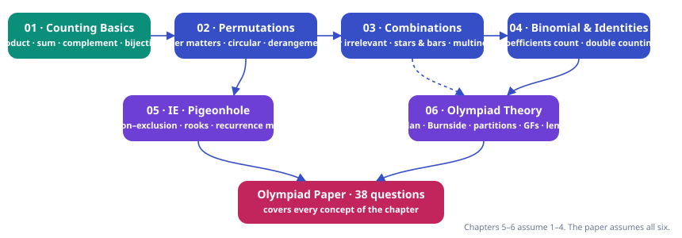

### ∑ Exam paper

[[PnC — Paper| The Capstone Olympiad-Level Paper — 40 Questions Eight sections covering every concept of the chapter: arrangements, stars & bars, identities, inclusion–exclusion, pigeonhole, lattice paths & Catalan, Burnside & partitions, and synthesis (Erdős–Szekeres, IMO classics). Difficulty-tagged. ]] [[PnC — Solutions| Attempt first, then open Full Solutions Key Complete step-by-step solutions for all 38 questions, with the reasoning that motivates each step — not just algebra. ]]

### ! One-page mindset

> [!abstract] First Principles — the only rule of the game
>
> To count a set of objects **never reach for a formula first**. Ask: *Can I put these objects in one-to-one correspondence with something whose size I already know?* Or: *Can I build each object by a sequence of independent choices?* If the answer to either is yes, the count falls out. Every tool in this course — $nC_r$, stars & bars, inclusion–exclusion, Burnside's lemma — is just a packaged version of one of these two moves, discovered to be useful over and over.

> [!warning] Common Trap — the three sins of counting
>
> **1. Overcounting** — the same final object produced by two different choice paths. **2. Undercounting** — cases that are not exhaustive, or objects that "look impossible" but exist. **3. Broken independence** — assuming "3 choices, then 3 choices" when the second count depends on the first in a way you didn't track. The cure for all three: *verify a small case by brute force*.

## Roadmap

- **Chapter 1**: Ch 1 · Counting Basics — 7 sections · 11 questions
- **Chapter 2**: Ch 2 · Permutations — 6 sections · 13 questions
- **Chapter 3**: Ch 3 · Combinations — 7 sections · 14 questions
- **Chapter 4**: Ch 4 · Binomial Coefficients & Identities — 6 sections · 13 questions
- **Chapter 5**: Ch 5 · Advanced Methods — 4 sections · 15 questions
- **Chapter 6**: Ch 6 · Olympiad Theory — 7 sections · 13 questions
- **Olympiad Paper**: Olympiad Paper · 40 questions — 
- **Solutions**: Olympiad Paper · Solutions & marking guide

---

## Contents

1. Chapter 1 — Counting Basics
2. Chapter 2 — Permutations
3. Chapter 3 — Combinations
4. Chapter 4 — Binomial Coefficients & Identities
5. Chapter 5 — Advanced Methods
6. Chapter 6 — Olympiad Theory

---

# Chapter 1 — Counting Basics

*7 sections · 11 questions*

*Chapter 1 · Foundations*

Before any formula: what counting actually *is*. The three primitive moves — construct, split, match up — and the habit of proof-by-small-cases that will carry you through Olympiad level.

`product rule` `sum rule` `complement` `bijection` `double counting (intro)`

### 1.1 What does "to count" even mean?

You have seen the answer "there are $nPr$ ways" in a formula sheet. But a formula is only a *receipt* — the *argument* is the money. In this chapter we define the game in its rawest form and see that everything else is a consequence of one definition.

**The objects of the game are finite sets.** When a problem says "in how many ways…?", it defines a (usually implicit) set $X$ of objects — arrangements, selections, functions, paths, colorings — and asks for $|X|$, the number of elements of $X$.

> [!abstract] First Principles — the definition of "same size"
>
> Two finite sets $X, Y$ have the **same size** if and only if there exists a **bijection** $f: X \to Y$ — a one-to-one correspondence, where every element of $X$ is matched to exactly one of $Y$, and vice versa. That is the whole definition. No measuring, no formulas: *matching objects is the same thing as counting them.*
>
>
> This is not philosophy — it is the workhorse of Olympiad combinatorics. Whenever counting $X$ looks hard, search for a set $Y$ whose size you know and an explicit rule matching each element of $X$ to exactly one of $Y$.

#### Example — the very first counting theorem, proved properly

**Claim:** the set $\{1,2,\dots,n\}$ has exactly $2^n$ subsets.

Most textbooks say "each element is either in or out, so $2\cdot 2\cdots 2 = 2^n$." That phrasing is a shortcut hiding the real structure. Here is the honest version:

There is a **bijection** between subsets of $[n]=\{1,\dots,n\}$ and binary strings of length $n$: the subset $S$ maps to the string $(b_1,\dots,b_n)$ where $b_i = 1 \iff i\in S$. Going backwards is unique. Hence 
$$ \#\{\text{subsets of } [n]\} \;=\; \#\{\text{binary strings of length } n\} \;=\; 2^n. $$
 The "2 choices per position" reasoning is just a statement about the second set, which is easier to see because its objects are *sequences* — and sequences are what the product rule (below) counts.

> [!tip] Key Idea — two ways of counting
>
> **(A) Construct:** describe how to *build* an object as a sequence of choices → multiply. **(B) Match up:** find a bijection with a known set → inherit its size. Every problem in this course is (A), (B), or a mixture.

### 1.2 The Product (Multiplication) Rule

**Statement.** If a task is carried out in $k$ successive steps, and step $i$ offers $n_i$ choices *regardless of the earlier choices*, then the total number of ways to carry out the task is

$$n_1 \cdot n_2 \cdots n_k$$

> [!abstract] First Principles — why the rule is true
>
> Count the set of *choice-sequences* $(c_1,\dots,c_k)$. Fix a particular first choice $c_1$: the remaining $k-1$ steps can be completed in $n_2\cdots n_k$ ways (induction on $k$). There are $n_1$ possible first choices, and different $c_1$ give disjoint families of sequences. So the total is $n_1(n_2\cdots n_k)$. The rule is just **partitioning by the first coordinate**, repeatedly — the same move you will meet inside Pascal's identity, recurrences and generating functions.

**Fig 1.1 — The product rule is a counting of leaves in a choice tree. The rule works exactly when every branch at level $i$ has the same number $n_i$ of children.**

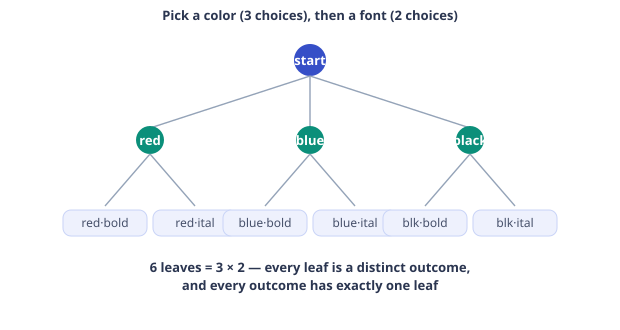

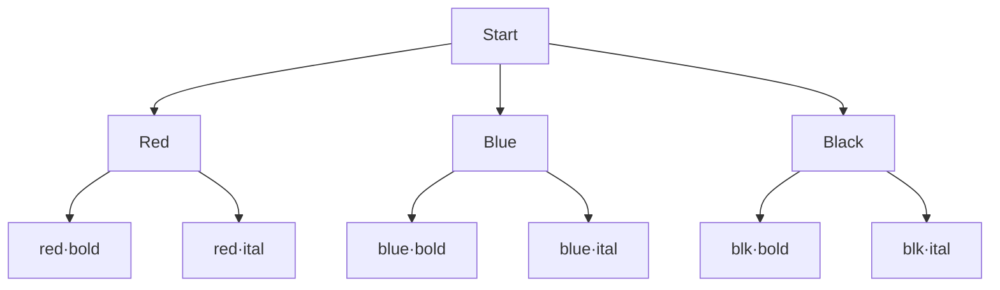

> [!warning] Common Trap — "3 choices, then 3 choices" is not always 9
>
> The rule multiplies only when the number of options at each step is **fixed** for that step. Watch these classic failures:
>
>
> - **Choosing 2 people from 5.** "Choose the first (5 ways), then the second (4 ways)" gives 20 — but $\{A,B\}$ was built twice ($A$ then $B$, and $B$ then $A$). You counted *ordered* pairs, not unordered pairs. Fix: either divide by the symmetry ($2!/2=2$), or build the object in a canonical order (pick the *smaller*-named person first). The lesson: **if different choice paths can land on the same object, you are overcounting.**
> - **Digits of a number.** "5 choices for the first digit, 10 for the next…" fails for the first digit of a number (no leading zero). The count *does* stay fixed per step — 9, then 10, 10… — but you must verify each $n_i$ separately.

> [!tip] Key Idea — the rule of roles
>
> Product-rule constructions work best when each choice fills a **labeled role**: "chairman, then secretary, then treasurer", "units digit, then tens, then hundreds". Labeled roles make different paths automatically different outcomes. If your objects are *unordered*, you must either impose a canonical order or divide by the size of the symmetry — and *check that the symmetry is exact* (i.e. that no object is fixed by a non-identity symmetry; more on this in the Burnside chapter).

#### **S1**[JEE Main][solved][product + cases]How many 4-digit numbers with distinct digits are divisible by 5?

How many **4-digit numbers** with **distinct digits** are divisible by 5?

<details>
<summary>Answer + Reasoning</summary>

Solution & reasoning

Divisibility by 5 pins the *units digit* to 0 or 5. The digits of a 4-digit number are labeled roles (thousands, hundreds, tens, units), so we multiply — but the thousands digit cannot be 0, which depends on the units choice. **Split into cases on the units digit**:

- **Case 1: units = 0.** Thousands: any of the 9 non-zero digits; hundreds: any of the remaining 8; tens: any of the remaining 7. → $9\cdot 8\cdot 7 = 504$.
- **Case 2: units = 5.** Thousands: non-zero and not 5 → 8 choices; hundreds: 8 remaining; tens: 7 remaining. → $8\cdot 8\cdot 7 = 448$.

Cases are disjoint and exhaustive, so total $= 504 + 448 =$ **Answer: 952**

**Small-case sanity check:** for 2-digit distinct-digit multiples of 5 the same method gives $9 + 8 = 17$: {10,20,…,90} (9) and {15,25,…,95} (8). ✓

</details>

### 1.3 The Sum (Addition) Rule

**Statement.** If $X$ is partitioned into mutually disjoint non-empty pieces $X_1,\dots,X_k$, then

$$|X| = |X_1| + |X_2| + \cdots + |X_k|$$

> [!abstract] First Principles — why the rule is true
>
> Disjointness means no object lies in two pieces (so nothing is double-counted), and "partition" means every object lies in some piece (so nothing is missed). That is the whole proof — the sum of the sizes of the pieces *is* the size of the whole, by definition of partition. In practice the entire discipline of "solving by cases" is just this: **find a property of your objects that splits them into pieces you can each count**, then add.

> [!warning] Common Trap — cases must be exhaustive AND disjoint
>
> Mantra: **every case counted once, every object in some case.** Typical failures: "with A and with B" (overlap if both can happen → use $|A\cup B| = |A|+|B|-|A\cap B|$, which is exactly what Chapter 5 systematizes), and "exactly 1, exactly 2, at least 3…" (not exhaustive — "at least 3" hides 3, 4, 5…; either split further or count the tail directly).

#### **S2**[JEE Main][solved][sum rule + cases]From a group of 12 men and 8 women, a 5-member committee is to be formed with …

From a group of 12 men and 8 women, a **5-member committee** is to be formed with **at least one woman**. How many committees?

<details>
<summary>Answer + Reasoning</summary>

Solution & reasoning

Two routes, and comparing them is the point:

**Route 1 (direct cases).** Split by the number of women: $1,2,3,4,5$. Sum $\sum_{w=1}^{5} \binom{8}{w}\binom{12}{5-w}$ — five terms, tedious and error-prone.

**Route 2 (complement — next section).** Total committees $\binom{20}{5} = 15504$. All-male committees $\binom{12}{5} = 792$. Answer $= 15504 - 792 =$ **Answer: 14712**

Note how Route 2 used the sum rule implicitly: committees are partitioned into "has a woman" and "all male", disjoint and exhaustive.

</details>

### 1.4 The Subtraction (Complement) Principle

If you want to count the objects in $X$ that **do not** have property $P$, and the objects *with* $P$ are easy, then

$$\#\{x \in X : \text{not } P\} \;=\; |X| \;-\; \#\{x \in X : P\}$$

> [!abstract] First Principles — why you should always look for the complement
>
> Negation has a hidden superpower: **negatives are rigid, positives are flexible.** "At least one woman" allows many configurations; "no women at all" forces a single rigid configuration (all seats male), which is usually trivial to count. The same pattern repeats everywhere: "no two adjacent" → count the total, subtract "at least one adjacent pair" (via inclusion–exclusion, Chapter 5); "not all boxes empty" → total minus all-empty; derangements → all permutations minus "at least one fixed point". Whenever a problem says *at least, no, not all, avoid* — flip it.

#### **S3**[JEE Adv][solved][complement + product]How many strings of length 4 over the alphabet $\{0,1,2,3,4\}$ contain **at least one 0**?

How many strings of length 4 over the alphabet $\{0,1,2,3,4\}$ contain **at least one 0**?

<details>
<summary>Answer + Reasoning</summary>

Solution & reasoning

Direct case-splitting by "first 0 at position $k$" is doable but ugly. The complement is a *one-line* product rule: strings with *no* 0 have 4 choices per position → $4^4 = 256$. Total strings: $5^4 = 625$. Answer $= 625 - 256 =$ **Answer: 369**

This "total minus forbidden" pattern is the seed of inclusion–exclusion (Ch. 5). When the forbidden condition is "at least one of several events", complements alone are not enough — that is exactly the gap IE fills.

</details>

### 1.5 Bijections and Involutions — the Olympiad Weapon

We saw bijections in §1.1. Now make them a **proof technique**. The central question at Olympiad level is rarely "count this hard set $X$" but "prove $|X| = |Y|$" — and that is answered by exhibiting a bijection, ideally a simple rule that both directions obey.

#### Worked proof — half the subsets have even size

**Claim:** for $n \ge 1$, exactly $2^{n-1}$ subsets of $[n]$ have even size, and $2^{n-1}$ have odd size.

**Proof.** Define $f$ on the family of subsets by *toggling* the element 1: $f(S) = S \cup \{1\}$ if $1 \notin S$, and $f(S) = S \setminus \{1\}$ if $1 \in S$. Then $f$ is a bijection (applying it twice gives back $S$) and every subset changes its size parity (the size changes by exactly 1). So $f$ is a bijection between even-sized and odd-sized subsets. Hence the two families are equal in size, and each is $\tfrac{1}{2}\cdot 2^n = 2^{n-1}$. $\square$

> [!tip] Key Idea — the involution principle
>
> An **involution** is a map $f$ with $f \circ f = \text{id}$. If an involution on a set $X$ has *no fixed points* and maps the "good" objects onto the "bad" ones, then good and bad are equal in number. Even more often: an involution with *only one kind* of fixed point proves a parity or near-equality statement. Look for involutions whenever a problem is about *even vs odd, more vs less, first vs last*.

#### Worked proof — even and odd permutations are equally many

**Claim:** for $n \ge 2$, exactly $n!/2$ of the permutations of $[n]$ are even (decompose into an even number of transpositions) and $n!/2$ are odd.

**Proof.** Left-compose every permutation with the transposition $(1\ 2)$. A transposition is odd, and composing an even permutation with an odd one gives an odd permutation (parity adds), so this is a bijection from even permutations to odd permutations. It is its own inverse, hence a bijection in both directions. Each side is therefore $\tfrac{n!}{2}$. $\square$

Remark for later: composing with $(1\ 2)$ is also a bijection on the set of permutations *with a given number of cycles modulo 2* — it flips the cycle count by ±1. You will meet this exact involution again in the Olympiad paper (it counts permutations by the parity of their number of cycles).

#### **S4**[JEE Adv][solved][bijection]How many functions $f:\{1,2,3\}\to\{1,2,3,4,5\}$ satisfy $f(1) &lt; f(2) &lt; f(3)$?

How many functions $f:\{1,2,3\}\to\{1,2,3,4,5\}$ satisfy $f(1) &lt; f(2) &lt; f(3)$?

<details>
<summary>Answer + Reasoning</summary>

Solution & reasoning

Naïvely "5 choices, then fewer…" breaks independence. **Bijection:** any such $f$ is the same data as the 3-element subset $\{f(1), f(2), f(3)\}$ of $\{1,\dots,5\}$ — and every 3-element subset has *exactly one* increasing ordering. So the answer is $\binom{5}{3} =$ **Answer: 10**

The general lesson: **an ordered structure with a monotonicity condition is the same thing as an unordered selection.** "Increasing functions $[r]\to[n]$ in bijection with $r$-subsets of $[n]$" is one of the most repeatedly used facts in combinatorics.

</details>

### 1.6 Double Counting — Your First Proof Machine

> [!abstract] First Principles — the method
>
> Let $\Omega$ be a set of **pairs** (or triples, or flags on figures…) that you can describe in two different ways. Count $|\Omega|$ by "grouping by the first coordinate" and again by "grouping by the second coordinate". Two different sums, one number — set them equal. The identity that falls out is a theorem; the choice of $\Omega$ is the art. Double counting is the proof technique behind *almost every* binomial identity, and a standard route for Olympiad proofs of divisibility and existence.

#### Worked — the sum of the integers, and its cousin

**Claim:** $\sum_{i=1}^{n} i = \binom{n+1}{2}$.

**Proof.** Let $\Omega = \{(a,b) : 1 \le a &lt; b \le n+1\}$ — 2-element subsets of $[n+1]$. Group by the **larger** element $b$: for fixed $b$, the smaller element $a$ has $b-1$ options. So $|\Omega| = \sum_{b=2}^{n+1}(b-1) = 1+2+\cdots+n$. But also $|\Omega| = \binom{n+1}{2}$ by definition. Done. $\square$

You have proved the "gaussian sum" without calculus — and you now understand *why* the sum is a binomial coefficient: it *is* a count of 2-subsets.

#### Worked — $\sum k\binom{n}{k} = n\,2^{n-1}$

**Proof.** Let $\Omega = \{(i, S) : S \subseteq [n],\ i \in S\}$ — pairs (chosen element, subset containing it). **Count by $i$:** $i$ can be any of the $n$ elements, and $S$ then any of the $2^{n-1}$ subsets of the remaining $n-1$ elements → $n\cdot 2^{n-1}$. **Count by $S$:** a subset of size $k$ contributes $k$ pairs → $\sum_k k\binom{n}{k}$. Equal. $\square$

> [!example] Olympiad Extension — how to spot a double-counting proof
>
> Red flags that double counting will work: the statement involves a **sum of $\binom{\cdot}{\cdot}$ terms** (each term "chooses something inside something"), or a product $n\cdot 2^{n-1}$ ("a distinguished element plus a subset"), or an identity between two symmetric-looking binomial expressions (often a "committee from two groups" story). Chapter 4 turns this into a full toolkit.

### 1.7 The Mistake Checklist (read this before every problem)

| Ask yourself | Typical symptom if you get it wrong |
| --- | --- |
| Are the objects **labeled or unlabeled**? | Counting arrangements of "3 prizes" as if the prizes were distinct when they are identical (or vice versa). |
| Does **order** matter? | Off by a factor of $r!$ — the exact boundary between $nP_r$ and $nC_r$ (Ch. 2–3). |
| Are the steps really **independent**? | Products that silently assume "10 choices" when a previous choice ate one of them. |
| Are the cases **exhaustive and disjoint**? | Missing "the other case", or double-counting the overlap of two cases. |
| Can one object be built by **two different paths**? | Overcounting — the disease of naive product rules on unordered objects. |
| Did I **check a tiny case by brute force**? | Everything else combined. For any answer, list all objects when $n$ is small and count by hand. |
| Is the answer the right **order of magnitude**? | An answer larger than the total pool of objects, or negative from a subtractive formula. |

> [!note] Practice Set 1 — all concepts above
>
> Solve all; peek at the small answers only after a real attempt.

#### **P1**[JEE Main][practice][product rule]A license plate has 3 letters followed by 4 digits . The first letter cannot b…

A license plate has **3 letters** followed by **4 digits**. The first letter cannot be O, and the last digit cannot be 0. Repetition is allowed. How many plates?

<details>
<summary>Answer + Reasoning</summary>

Roles: L1 L2 L3 d1 d2 d3 d4. Counts per position: $25, 26, 26, 10, 10, 10, 9$ — all fixed, so multiply: $25\cdot 26^2 \cdot 10^3 \cdot 9 = 16900 \cdot 9000 =$ **152,100,000**.

</details>

#### **P2**[JEE Adv][practice][complement + product]How many odd 5-digit numbers have distinct digits?

How many **odd 5-digit numbers** have **distinct** digits?

<details>
<summary>Answer + Reasoning</summary>

Units digit odd: 5 choices. The first digit is non-zero and different from the units digit, so it has 8 choices. The hundreds and tens digits then have 8 and 7 choices respectively; the units digit is already fixed. $5 \cdot 8 \cdot 8 \cdot 7 =$ **2,240**.

</details>

#### **P3**[JEE Adv][practice][bijection]How many pairs $(A,B)$ of subsets of $[n]$ satisfy $A \subseteq B$?

How many pairs $(A,B)$ of subsets of $[n]$ satisfy $A \subseteq B$?

<details>
<summary>Answer + Reasoning</summary>

For each element $i\in[n]$, exactly one of three states: $i\notin B$; $i \in B\setminus A$; $i\in A$ (hence also in $B$). Independent per element → **$3^n$**. (This is the "each element makes one of 3 choices" pattern — a product rule disguised as a bijection to 3-colorings of $[n]$.)

</details>

#### **P4**[JEE Main][practice][complement]A chess player plays 8 games, winning some and losing the rest (no draws). In …

A chess player plays 8 games, winning some and losing the rest (no draws). In how many outcome sequences does the player win **at least one game**?

<details>
<summary>Answer + Reasoning</summary>

Each game is W or L → $2^8 = 256$ sequences. Complement: lose all 8 → 1. Answer **255**.

</details>

#### **P5**[Olympiad][practice][involution]Let $n\ge 2$. Show that the number of *even-sized* subsets of $[n]$ containing 1 equals the…

Let $n\ge 2$. Show that the number of *even-sized* subsets of $[n]$ containing 1 equals the number of *odd-sized* subsets of $[n]$ containing 1… or find what is actually true, and prove it with an involution.

<details>
<summary>Answer + Reasoning</summary>

The stated equality is *not* true in general — good, now count: subsets containing 1 of even size ↔ subsets of $[n]\setminus\{1\}$ of *odd* size = $2^{n-2}$ (by the §1.5 result on $[n-1]$); odd-size subsets containing 1 ↔ even-size subsets of the rest = $2^{n-2}$. So the correct statement is: **subsets containing 1 split evenly between even and odd size, $2^{n-2}$ each** (for $n\ge 2$), and the proof is the toggle involution on element $2$, which preserves "contains 1" and flips total parity.

</details>

#### **P6**[JEE Adv][practice][product + cases]A man climbs a 6-step staircase, taking 1, 2 or 3 steps at a time. In how many…

A man climbs a 6-step staircase, taking 1, 2 or 3 steps at a time. In how many ways can he climb?

<details>
<summary>Answer + Reasoning</summary>

Let $a_n$ = ways to climb $n$ steps; $a_n = a_{n-1}+a_{n-2}+a_{n-3}$ (first jump is 1, 2 or 3). With $a_0=1, a_1=1, a_2=2$: $a_3=4, a_4=7, a_5=13, a_6=$ **24**. (First taste of the recurrence method — Chapter 5 generalizes this completely.)

</details>

#### **P7**[Olympiad][practice][double counting]Prove: $\displaystyle\sum_{k=1}^{n} k\binom{n}{k}^2 = n\binom{2n-1}{n-1}$.

Prove: $\displaystyle\sum_{k=1}^{n} k\binom{n}{k}^2 = n\binom{2n-1}{n-1}$.

<details>
<summary>Answer + Reasoning</summary>

**Verify first (the Olympiad habit):** $n=2$: LHS $= 1\cdot\binom21^{\,2} + 2\cdot\binom22^{\,2}
        = 4 + 2 = 6$; RHS $= 2\binom31 = 6$. ✓ (A common slip is writing $\binom21^2 = 1$ — recompute arithmetic digit by digit before trusting any "mismatch".)

**Algebraic proof.** Use $k\binom{n}{k} = n\binom{n-1}{k-1}$ (choose the $k$-set, then its distinguished element = choose the distinguished element first, then the other $k-1$ members). Then, with $j = k-1$, 
$$ \sum_{k=1}^{n} k\binom{n}{k}^2
        = n\sum_{k=1}^{n}\binom{n-1}{k-1}\binom{n}{k}
        = n\sum_{j=0}^{n-1}\binom{n-1}{j}\binom{n}{n-1-j}
        = n\binom{2n-1}{n-1}, $$
 where the last step is Vandermonde's identity (Chapter 4).

**Counting flavor.** The LHS counts triples $(A,B,b)$: $A\subseteq X$, $B\subseteq Y$ with $X, Y$ two labeled $n$-sets, $|A| = |B|$, $b \in B$ distinguished — counted by $|B| = k$. The step $k\binom{n}{k} = n\binom{n-1}{k-1}$ says the same object is counted by choosing $b$ first and then $B\setminus\{b\}$; the remaining sum is the "committee from two groups" count of $(n-1)$-subsets of a $(2n-1)$-set (Vandermonde). Double counting and algebra are the same proof wearing different clothes.

</details>

---

---

# Chapter 2 — Permutations

*6 sections · 13 questions*

*Chapter 2 · Order Matters*

Arrangements: from the multiplication rule to $nPr$, repeated letters, circular permutations, adjacency and gap methods, fixed relative order, and derangements — including why "no fixed point" counts come out as the nearest integer to $n!/e$.

`$nP_r$` `repetition` `circular` `gaps` `relative order` `derangements`

### 2.1 From the product rule to $nP_r$

**Definition.** A **permutation of $r$ objects chosen from $n$** is an *ordered* arrangement of $r$ distinct objects selected from a pool of $n$. The number is denoted ${}^nP_r$ or $P(n,r)$.

> [!abstract] First Principles — derivation, not recitation
>
> Fill the $r$ labeled positions (role 1, role 2, …, role $r$) one by one: role 1 has $n$ options; whatever it receives, role 2 has $n-1$ options (the pool lost one element — the count is *fixed per step*, which is exactly what the product rule requires); role $j$ has $n-j+1$ options. Hence
>
>
> Equivalently — and this is the deeper view: $P(n,r)$ is the number of **injective functions** $[r]\to[n]$: a function is determined by the images of $1,2,\dots,r$, which must be distinct, giving the same descending product. For $r=n$, permutations of $n$ objects are exactly the **bijections** $[n]\to[n]$, and $n!$ is their count. Holding "permutation = bijection" in mind is what makes later topics (derangements, cycle structure, Burnside) click.

#### The factorial, and why $0! = 1$

By the same "image of 1, image of 2, …" argument: $n! = n\cdot(n-1)\cdots 1$ counts bijections $[n]\to[n]$. For $n=0$ there is exactly **one** bijection $\varnothing\to\varnothing$ (the empty function), so the definition forces $0! = 1$. This is not convention for convenience — it is forced by the counting story, and it is what makes formulas like $\frac{n!}{(n-r)!}$ with $r=n$ and stars-and-bars identities work without exceptions.

#### **S1**[JEE Adv][solved][repeated letters]In how many ways can the letters of the word COMBINATORICS be arranged?

In how many ways can the letters of the word **COMBINATORICS** be arranged?

<details>
<summary>Answer + Reasoning</summary>

Solution & reasoning

13 letters with C ×2, O ×2, I ×2 and seven singletons. The answer is $\dfrac{13!}{2!\,2!\,2!} = \dfrac{6{,}227{,}020{,}800}{8} =$ **Answer: 778,377,600** — the division-by-factorials reasoning is developed rigorously in §2.2 below; in these notes every worked example uses techniques you already saw introduced.

</details>

### 2.2 Identical objects — arrangements with repetition

When some of the $n$ objects are identical, naively using $n!$ overcounts. The precise statement: if the multiset has $n_1$ copies of type 1, …, $n_k$ copies of type $k$ (with $n = n_1+\cdots+n_k$), the number of distinct arrangements is

$$\frac{n!}{n_1!\,n_2!\cdots n_k!}$$

> [!abstract] First Principles — the labeling argument (the real proof)
>
> **Step 1.** Temporarily *label* every object: the $n_1$ identical A's become $A_1,\dots,A_{n_1}$, etc. Now all $n$ objects are distinct: $n!$ arrangements. **Step 2.** For any one *unlabeled* arrangement (a word), how many labeled arrangements project to it? Exactly $n_1!\cdot n_2!\cdots n_k!$: within each run of identical letters we may permute the labels freely, and every such relabeling gives a different labeled word, while it all erases to the same unlabeled word. **Step 3.** The set of labeled words is thus partitioned into fibers of equal size $n_1!\cdots n_k!$, one fiber per unlabeled word. Equal-size fibers ⇒ division is exact: $\dfrac{n!}{n_1!\cdots n_k!}$. This "label, count, divide by the symmetry" argument is one of the most reusable ideas in the whole course (it reappears in circular permutations, necklaces, and Burnside's lemma in Chapter 6).

> [!warning] Common Trap — division by symmetry is only legal when the symmetry is exact
>
> "Divide by $2!$ because A and B can swap" fails if some arrangements are *fixed* by the swap (e.g. with identical objects the swap does nothing to some words). The labeling argument above is safe precisely because every fiber has the *same* size. Whenever you divide, ask: *is every object counted exactly the same number of times?* If not, split into cases (or use Burnside, Chapter 6 — which exists exactly for the non-uniform case).

#### **S2**[JEE Main][solved][repetition + condition]How many distinct words can be formed from the letters of DAAR (D, A, A, R) in…

How many distinct words can be formed from the letters of **DAAR** (D, A, A, R) in which the two A's are adjacent?

<details>
<summary>Answer + Reasoning</summary>

Solution & reasoning

Bundling: treat AA as one super-letter. Now arrange the 3 objects {D, AA, R}: $3! = 6$. The A's are identical so the bundle has only 1 internal order. Answer **Answer: 6** — words: DAAR, AADR, ADAR, ADRA, ARDA, RADA. (Bundle-then-count-objects is the standard move for *must-be-adjacent* conditions.)

</details>

### 2.3 Circular permutations

**Statement.** The number of ways to seat $n$ distinct people around a round table (two seatings equal if one is a rotation of the other) is

$$(n-1)!\qquad (n\ge 2)$$

> [!abstract] First Principles — why $(n-1)!$, two independent proofs
>
> **Proof A (anchor).** Seat one distinguished person, say A, anywhere — her seat is only a reference point, so "without loss of generality" fix A at the 12 o'clock position. The remaining $n-1$ people fill the remaining $n-1$ seats in a line going clockwise: $(n-1)!$ ways. Every circular seating has A in exactly one seat, so nothing is over- or under-counted.
>
>
> **Proof B (divide by rotation).** There are $n!$ linear arrangements around $n$ labeled seats. Rotating a seating by one seat gives another linear arrangement representing the same circular seating; each circular seating is represented by exactly $n$ linear arrangements (its $n$ rotations), and every rotation orbit has size $n$ (no non-trivial rotation fixes a seating of *distinct* people — the "exact symmetry" condition of §2.2). Hence $n!/n = (n-1)!$. Notice both proofs are the labeling/fiber idea in disguise.

**Fig 2.1 — A rotation is "the same" circular seating. Clockwise order A→B→C→D is the invariant; the arrow is the rotation that relates the two pictures.**

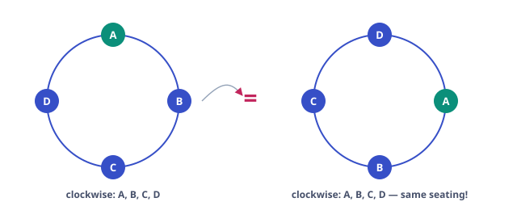

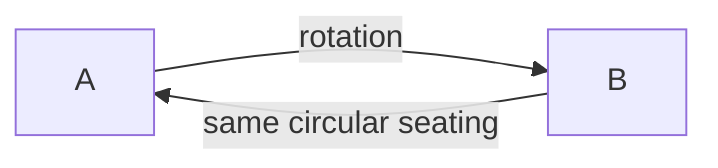

#### Consequences and variants

- **Two specified people adjacent** (round table): bundle them → $2\cdot(n-2)!$. **Not adjacent**: total minus that, which simplifies nicely: $(n-1)! - 2(n-2)! = (n-2)!\big((n-1) - 2\big) = \boxed{(n-3)(n-2)!}$. Check $n=4$: $(4-3)\cdot 2! = 2$ — with A, B separated, the remaining C, D land one on each side: indeed 2 ✓.
- **Two seats fixed** (e.g. A and B must sit at two specified chairs): fix both as anchors → $(n-2)!$.
- **Necklaces (beads, flip allowed).** If a string of $n$ distinct beads is closed into a ring and two rings are equal when related by rotation *or* reflection (turning the ring over), then for $n \ge 3$ the count is $\dfrac{(n-1)!}{2}$ — each rotation-class is split by the flip into pairs of equal size (no distinct-bead ring equals its own flip). With *identical* beads the flip can fix a ring — the exact-symmetry condition fails, and the right tool is Burnside's lemma (Chapter 6).

#### **S3**[JEE Adv][solved][circular + complement]10 people sit around a round table. In how many arrangements are neither the t…

10 people sit around a round table. In how many arrangements are **neither** the two specific people A and B **adjacent**?

<details>
<summary>Answer + Reasoning</summary>

Solution & reasoning

Total circular seatings: $(10-1)! = 9! = 362{,}880$. A & B adjacent: treat {A,B} as a block → 9 objects around the table → $8!$ circular arrangements, and the block has 2 internal orders: $2\cdot 8! = 80{,}640$. Answer: $362{,}880 - 80{,}640 =$ **Answer: 282,240**

General form: $(n-1)! - 2(n-2)!$. For $n=10$: $9! - 2\cdot 8! = 362880 - 80640$.

</details>

### 2.4 Linear permutations with restrictions

#### (a) "Together" — the bundle

If $k$ specified objects must be consecutive, wrap them in a bundle: the bundle is one object with $k!$ internal orders (if the objects are distinct). Arrange the $n-k+1$ objects; multiply by $k!$. Multiple bundles work as long as they don't nest confusingly; "A before B" conditions are *not* bundles (next subsection).

#### (b) "No two adjacent" — the gap method

> [!abstract] First Principles — arrange the rest, then choose slots
>
> Suppose $k$ special objects must not be adjacent, and there are $m$ ordinary objects. Arrange the $m$ ordinary objects: $m!$ ways (if distinct). They create $m+1$ gaps — before, between, and after: $\underline{\ \ \ }\,O\underline{\ \ \ }\,O\underline{\ \ \ }\cdots O\underline{\ \ \ }$. Put each special object into a *different* gap (at most one per gap is what forces non-adjacency): choose $k$ of the $m+1$ gaps, $\binom{m+1}{k}$ ways, and order the special objects inside their gaps, $k!$ ways. Total: $\boxed{m!\,\binom{m+1}{k}\,k!}$. The method's real power is that it converts a *negative* condition ("not next to each other") into a *positive* placement rule.

#### (c) "Fixed relative order" — divide by $k!$

Among the $n!$ arrangements of $n$ distinct objects, look only at the relative order of $k$ specified ones, say $X_1,\dots,X_k$. As we scan all $n!$ arrangements, the induced relative order of $(X_1,\dots,X_k)$ runs through all $k!$ possibilities. By symmetry each relative order occurs the same number of times: why? because the $k!$-element permutation group of $\{X_1,\dots,X_k\}$ acts freely and transitively on the relative-order classes, and each group element sends any arrangement to a valid one (just relabel the positions the $X_i$ occupy). So the number of arrangements with, say, "$X_1$ before $X_2$ before … before $X_k$" is $\boxed{\dfrac{n!}{k!}}$.

In particular, "$X_1$ before $X_2$" alone: $n!/2$. These "divide by the symmetry of a condition" arguments are the linear relatives of the circular-permutation division.

#### **S4**[JEE Adv][solved][bundle + complement]Six people — P, Q, R, S, T, U — sit in a row. P and Q must sit together , and …

Six people — P, Q, R, S, T, U — sit in a row. P and Q must sit **together**, and R must **not** sit at an end. How many arrangements?

<details>
<summary>Answer + Reasoning</summary>

Solution & reasoning

**Step 1 (bundle).** Bundle P,Q: now 5 objects {B, R, S, T, U} with B having 2 internal orders. Total: $2\cdot 5! = 240$.

**Step 2 (complement on R).** Count those with R at an end: R's end choice (2 ways); then arrange the remaining 4 objects (B, S, T, U) in the 4 inner positions: $4!$; internal order of B: 2. So $2\cdot 4! \cdot 2 = 96$.

Answer: $240 - 96 =$ **Answer: 144**

Order of operations matters: bundle first, *then* apply the positional restriction to the shrunken object list — the two restrictions interact only through the objects' positions, which is why composing them is safe here.

</details>

### 2.5 Derangements — permutations with no fixed point

**Definition.** A **derangement** of $[n]$ is a permutation $\sigma$ with $\sigma(i) \ne i$ for every $i$. The classic story: $n$ letters, $n$ addressed envelopes — in how many ways can *every* letter go into the *wrong* envelope?

Denote the count by $D_n$. We derive it twice — the first derivation (Chapter 5's machinery, brought forward because it is the flagship inclusion–exclusion application) and the second (a pure recurrence, which reveals the structure).

#### Derivation 1 — inclusion–exclusion

Let $E_i$ = event "$\sigma(i) = i$". We want $N = n! - |\cup_i E_i|$. Inclusion–exclusion (proved in Chapter 5; here is the direct 3-line logic): a permutation with exactly $k$ prescribed fixed points (a chosen set $S\subseteq[n]$ of size $k$) has the remaining $n-k$ points free: $(n-k)!$. IE says to count the complement of $\cup E_i$ by alternating sums over intersections: 
$$ D_n = \sum_{k=0}^{n} (-1)^k \binom{n}{k} (n-k)! = n!\sum_{k=0}^{n}\frac{(-1)^k}{k!}. $$

Intuition for the alternating sum: subtract arrangements with at least one fixed point (overcounts those with two), add back those with at least two (triple-counted ones now negative), etc. The alternation is exactly the bookkeeping of "how many times does a permutation with $m$ fixed points get counted" = $\sum_{k=m}^{n}(-1)^{k-m}\binom{m}{k-m}$… = 0 for $m\ge 1$, 1 for $m=0$. Chapter 5 makes this precise.

#### Derivation 2 — the recurrence (first principles on where 1 goes)

In a derangement of $[n]$, the element 1 goes to some position $i\ne 1$: $n-1$ choices. Now look at where element $i$ goes:

- **Case A: $i$ goes to position 1.** Then 1↔i is a 2-cycle, and the remaining $n-2$ elements must derange among themselves: $D_{n-2}$ ways.
- **Case B: $i$ does not go to position 1.** Then element $i$ is in a "derangement-like" position: rename position 1 as "position $i$" (i.e. merge the forbidden positions of $i$ and 1) — a standard relabeling: the remaining $n-1$ elements must avoid $n-1$ specified forbidden positions, which is exactly $D_{n-1}$ ways.

So $D_n = (n-1)\big(D_{n-1} + D_{n-2}\big)$ with $D_0 = 1, D_1 = 0$.

**Fig 2.2 — First derangement numbers and the astonishing closeness to $n!/e$.**

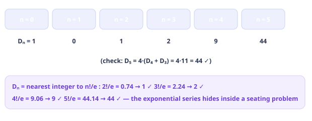

> [!abstract] First Principles — why $D_n \approx n!/e$ (the reasoning, not a fact to memorize)
>
> We have $D_n = n!\sum_{k=0}^n (-1)^k/k!$. The series $\sum_{k=0}^{\infty} (-1)^k/k! = 1/e$ (the Taylor series of $e^x$ at $x=-1$). The tail $\sum_{k>n} (-1)^k/k!$ has absolute value $&lt; \frac{1}{(n+1)!}$, so $0 \le \left|D_n - \frac{n!}{e}\right| &lt; \frac{n!}{(n+1)!} = \frac{1}{n+1} &lt; \tfrac12$ for $n\ge 1$ — which is exactly the statement $D_n = \left\lfloor \frac{n!}{e} + \tfrac12\right\rfloor$, the **nearest integer to $n!/e$**. A pure counting sequence is integer-rounded $n!/e$ because the events "fixed point at $i$" behave asymptotically independently: $P(\text{no fixed point}) = \sum (-1)^k/k! \to e^{-1}$, the limit of $(1-1/n)^n$. *This is the prototype of the Poisson heuristic that runs through probability and combinatorics.*

#### Partial derangements and the rencontres numbers

"Exactly $k$ of the letters in the right envelope": choose which $k$ are correct ($\binom{n}{k}$), derange the rest: $\binom{n}{k}D_{n-k}$. For $n=5, k=2$: $\binom52 D_3 = 10\cdot 2 = 20$.

#### **S5**[JEE Adv][solved][derangement story]Five letters are put into five correctly addressed envelopes at random. How ma…

Five letters are put into five correctly addressed envelopes at random. How many assignments have **no** letter in its own envelope? How many have **exactly two** correct?

<details>
<summary>Answer + Reasoning</summary>

Solution & reasoning

No correct: $D_5 = 5!(1 - 1 + \tfrac12 - \tfrac16 + \tfrac1{24} - \tfrac1{120})
        = 120\cdot \tfrac{44}{120} =$ **Answer: 44**

Exactly two correct: $\binom{5}{2}D_3 = 10 \cdot 2 =$ **Answer: 20**

Sanity: $44 + 20 + \binom51 D_4 + \binom53 D_2 + \binom54 D_1 + \binom55 D_0
        = 44 + 20 + 5\cdot 9 + 10\cdot 1 + 5\cdot 0 + 1 = 120 = 5!$ — every assignment is accounted for. Always run this "sum over k" check when using $\binom nk D_{n-k}$.

</details>

> [!example] Olympiad Extension — derangements are a special case
>
> Counting permutations that avoid a *board of forbidden positions* (e.g. "letter i may not go to envelopes i and i+1") is done by **rook polynomials** + inclusion–exclusion — the full theory is Chapter 5. Derangements are the case where the forbidden board is the main diagonal.

### 2.6 Practice set

#### **P1**[JEE Main][practice][alternation]5 men and 5 women sit in a row such that men and women alternate . How many ar…

5 men and 5 women sit in a row such that **men and women alternate**. How many arrangements?

<details>
<summary>Answer + Reasoning</summary>

Two alternating patterns: M-W-M-W-… and W-M-W-M-… . Each: $5!\cdot 5!$. Total $2(5!)^2 = 2\cdot 14{,}400 =$ **28,800**.

</details>

#### **P2**[JEE Adv][practice][circular + bundle]4 married couples sit around a round table; every husband next to his wife . H…

4 married couples sit around a round table; **every husband next to his wife**. How many circular arrangements?

<details>
<summary>Answer + Reasoning</summary>

Bundle each couple (2 internal orders each): $2^4$ · circular arrangements of 4 bundles $(4-1)!$. Total $16\cdot 6 =$ **96**.

</details>

#### **P3**[JEE Adv][practice][derangement]6 letters, 6 envelopes. How many assignments have no letter in its own envelop…

6 letters, 6 envelopes. How many assignments have **no** letter in its own envelope? Express also as $\lfloor 6!/e + \tfrac12\rfloor$ and verify.

<details>
<summary>Answer + Reasoning</summary>

$D_6 = 720(1 - 1 + \tfrac12 - \tfrac16 + \tfrac1{24} - \tfrac1{120} + \tfrac1{720})
        = 720\cdot\tfrac{265}{720} =$ **265**. Check: $6!/e = 720/2.71828\ldots = 264.87\ldots$, nearest integer 265 ✓.

</details>

#### **P4**[JEE Main][practice][product rule]How many distinct words from the letters of EQUATION (8 distinct letters) star…

How many distinct words from the letters of **EQUATION** (8 distinct letters) start with a **vowel** and end with a **consonant**?

<details>
<summary>Answer + Reasoning</summary>

Vowels: E, Q, U, A, T, I, O — careful: Q is a consonant! Vowels = {E, U, A, I, O} (5); consonants = {Q, T, N} (3). First: 5 ways; last: 3; middle 6 letters: $6!$. Total $5\cdot 3\cdot 720 =$ **10,800**.

</details>

#### **P5**[JEE Adv][practice][gap method]Six people in a row; A, B, C must be pairwise non-adjacent . Count arrangement…

Six people in a row; A, B, C must be **pairwise non-adjacent**. Count arrangements.

<details>
<summary>Answer + Reasoning</summary>

Arrange the other 3: $3! = 6$. Gaps: 4. Choose 3 gaps: $\binom43 = 4$. Order A, B, C: $3! = 6$. Total $6\cdot 4\cdot 6 =$ **144**.

</details>

#### **P6**[JEE Adv][practice][relative order]7 distinct books on a shelf; 3 specific books must appear with A left of B lef…

7 distinct books on a shelf; 3 specific books must appear with A **left of** B **left of** C (not necessarily consecutively). Count arrangements.

<details>
<summary>Answer + Reasoning</summary>

Of the $3! = 6$ relative orders of (A,B,C), exactly one is A-B-C, and all six occur equally often (symmetry of §2.4c). Total $7!/3! = 5040/6 =$ **840**.

</details>

#### **P7**[JEE Main][practice][repeated letters]Arrangements of the letters of MATHEMATICS (11 letters: A, M, T each twice).

Arrangements of the letters of **MATHEMATICS** (11 letters: A, M, T each twice).

<details>
<summary>Answer + Reasoning</summary>

$11!/(2!2!2!) = 39{,}916{,}800/8 =$ **4,989,600**.

</details>

#### **P8**[Olympiad][practice][circular + IE]8 people around a round table. A and B must be adjacent; C and D must not be a…

8 people around a round table. A and B must be adjacent; C and D must **not** be adjacent. Count arrangements.

<details>
<summary>Answer + Reasoning</summary>

A, B bundled: 6 objects circular → $5!$, ×2 (internal AB) = $2\cdot 120 = 240$. Now C, D non-adjacent within these: from 240 subtract C, D adjacent: bundle C, D too → 5 objects circular → $4!$, ×2 (AB) ×2 (CD) = $2\cdot 2\cdot 24 = 96$. Answer $240 - 96 =$ **144**.

</details>

---

---

# Chapter 3 — Combinations

*7 sections · 14 questions*

*Chapter 3 · Order Irrelevant*

Selections: why dividing by $r!$ is legitimate, Pascal's triangle from set theory, restricted selections, and the stars-and-bars bijection that turns "identical objects into boxes" into a one-line count. Plus compositions, multinomials, and a first look at partitions.

`$\binom nr$` `Pascal` `stars & bars` `compositions` `multinomial` `partitions (intro)`

### 3.1 From permutations to combinations — why divide by $r!$

**Definition.** A **combination** (an $r$-subset) of a set of $n$ elements is a selection of $r$ elements *without regard to order*. The number is $\binom{n}{r}$.

> [!abstract] First Principles — the exact-symmetry division, justified
>
> Order the $r$ chosen elements: every $r$-subset generates exactly $r!$ permutations (all orderings of its $r$ distinct members), and every such ordering comes from exactly one subset. So the set of all $P(n,r) = \frac{n!}{(n-r)!}$ ordered selections partitions into fibers of size exactly $r!$, one per subset: 
> $$ \binom{n}{r} = \frac{P(n,r)}{r!} = \frac{n!}{r!\,(n-r)!}. $$
>  This division is *exact* (every fiber the same size) — unlike the "divide by symmetry" moves that can fail with identical objects. Notice the definition has now become **computational**: $\binom{n}{r}$ is a ratio of factorials because an $r$-subset is an orbit of the symmetric group $S_r$ acting on ordered selections. (Group actions reappear in full force in the Burnside chapter.)

#### The mirror symmetry

$\binom{n}{r} = \binom{n}{n-r}$. The *reason* is a bijection, not an algebraic trick: **complementation** — $S \mapsto [n]\setminus S$ maps $r$-subsets bijectively to $(n-r)$-subsets. Choosing which $r$ to *keep* is the same information as choosing which $n-r$ to *discard*.

> [!tip] Key Idea — the boundary between Ch. 2 and Ch. 3
>
> Every problem begins with a question: **do the objects I'm building come with labels or positions?** "Arrange, schedule, line up, first/second/third" → permutations. "Choose, select, team, committee, how many subsets" → combinations. Mixed problems ("choose 3 of 10 and arrange them in a row") are compositions of both, in that order.

### 3.2 Pascal's identity and the triangle

**Pascal's identity:** $\binom{n}{r} = \binom{n-1}{r} + \binom{n-1}{r-1}$.

> [!abstract] First Principles — the proof is a two-case split on one element
>
> Count the $r$-subsets of $[n]$. Split by whether the element $n$ is included (**disjoint and exhaustive** — the sum rule):
>
>
> - $n \notin S$: choose an $r$-subset of $[n-1]$: $\binom{n-1}{r}$ ways.
> - $n \in S$: choose the other $r-1$ members from $[n-1]$: $\binom{n-1}{r-1}$ ways.
>
>
> Add: $\binom{n}{r} = \binom{n-1}{r} + \binom{n-1}{r-1}$. **This is the same "split on a distinguished element" move that produced the Fibonacci recurrence, the subsets count, and the Bell recurrence** — one reflex, many theorems.

**Fig 3.1 — Pascal's triangle: each entry is the sum of the two above it (Pascal's identity). The slanted arrows trace the *hockey-stick identity* $\sum_{i=r}^{n}\binom{i}{r} = \binom{n+1}{r+1}$.**

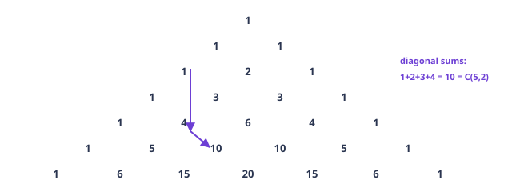

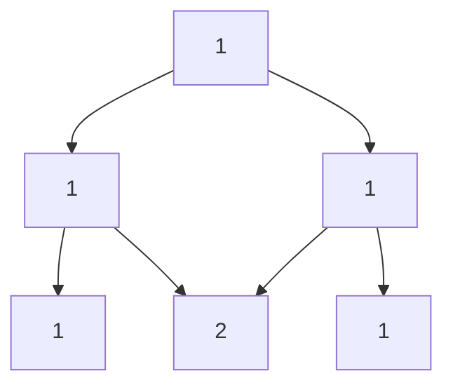

#### The hockey-stick identity

$\displaystyle\sum_{i=r}^{n} \binom{i}{r} = \binom{n+1}{r+1}$.

> [!abstract] First Principles — proof by looking at the maximum element
>
> Count the $(r+1)$-subsets of $[n+1]$. Split by the **largest element** of the subset: if the largest is $i+1$ (so $r \le i \le n$), the other $r$ members are an $r$-subset of $[i]$: $\binom{i}{r}$ ways. Summing over $i$: $\sum_{i=r}^{n}\binom{i}{r}$. But the total is $\binom{n+1}{r+1}$. Done. (Same engine as Pascal's identity: *split by a distinguished element's value*.)

A diagonal of Pascal's triangle is literally the hockey stick: $\binom{1}{1}+\binom{2}{1}+\binom{3}{1}+\binom{4}{1} = 1+2+3+4 = 10 = \binom{5}{2}$ — which, by the way, re-proves the sum $1+2+\cdots+n = \binom{n+1}{2}$ from Chapter 1.

### 3.3 Restricted selections

Real problems never ask for a bare $\binom{n}{r}$. The standard patterns:

| Condition | Tool |
| --- | --- |
| "must include X" / "must exclude X" | fix X (or not), choose the rest: $\binom{n-1}{r-1}$ / $\binom{n-1}{r}$ |
| "at least m from group A" | complement (count < m) or direct case split |
| "exactly a from A and b from B" | product: $\binom{\|A\|}{a}\binom{\|B\|}{b}$ |
| "from groups A, B, C with lower bounds" | sum over valid (a,b,c) triples of products |
| "all of some kind present" (e.g. every suit) | inclusion–exclusion (Chapter 5) |

#### **S1**[JEE Adv][solved][complement]A library has 20 different books, 4 of them are volumes of a specific series. …

A library has 20 different books, 4 of them are volumes of a specific series. In how many ways can you choose 5 books so that **at least one** of the 4 series volumes is included?

<details>
<summary>Answer + Reasoning</summary>

Solution & reasoning

Total: $\binom{20}{5} = 15504$. None of the series: choose all 5 from the other 16: $\binom{16}{5} = 4368$. Answer $= 15504 - 4368 =$ **Answer: 11,136**

"At least one" is the canonical complement trigger (Chapter 1). The direct case split $1 + 2 + 3 + 4$ series volumes works too but is four terms of arithmetic.

</details>

#### **S2**[JEE Adv][solved][case split + products]A cricket team of 11 is to be selected from 7 batsmen, 5 bowlers and 3 all-rou…

A cricket team of 11 is to be selected from 7 batsmen, 5 bowlers and 3 all-rounders, with **at least 3 batsmen and at least 2 bowlers**. How many teams?

<details>
<summary>Answer + Reasoning</summary>

Solution & reasoning

Write the team as $(b, w, a)$ with $b+w+a = 11$, $3\le b\le 7$, $2\le w\le 5$, $0\le a\le 3$. All-rounders cap at 3, so enumerate by $a$:

| $a$ | valid $(b,w)$ | count |
| --- | --- | --- |
| 0 | (6,5), (7,4) | $\binom76\binom55 + \binom77\binom54 = 7 + 5 = 12$ |
| 1 | (5,5), (6,4), (7,3) | $21 + 35 + 10 = 66$ |
| 2 | (4,5), (5,4), (6,3), (7,2) | $35 + 105 + 70 + 10 = 220$ |
| 3 | (3,5), (4,4), (5,3), (6,2) | $35 + 175 + 210 + 70 = 490$ |

Total: $12 + 66 + 220 + 490 =$ **Answer: 788**

This is the **multinomial-case-split template**: one free variable (here $a$) plus bounds makes a finite table. JEE Advanced loves this exact shape; the error pattern it catches is missing boundary triples like $(7,3)$ or $(7,2)$ — *always check that the bounds really exclude nothing you need*.

</details>

### 3.4 Stars and bars — the master bijection

**Problem A.** In how many ways can $n$ *identical* balls be distributed into $k$ *distinct* boxes, empty boxes allowed?

$$\binom{n+k-1}{k-1}$$

**Problem B (positive).** Same, but every box gets at least one ball: $\binom{n-1}{k-1}$ (put one ball in each box first, then apply Problem A to the remaining $n-k$ balls).

> [!abstract] First Principles — why a line of symbols is a distribution
>
> A distribution is the same data as the $k$-tuple of counts $(x_1, x_2, \dots, x_k)$ with $x_1+\cdots+x_k = n$ (and $x_i \ge 0$ in Problem A). Now the bijection: write $x_1$ stars, a bar, $x_2$ stars, a bar, …, $x_k$ stars: 
> $$ (x_1,\dots,x_k) \;\longleftrightarrow\; \underbrace{*\cdots *}_{x_1}\,\bar{\,}\,
>       \underbrace{*\cdots *}_{x_2}\,\bar{\,}\, \cdots \bar{\,}\, \underbrace{*\cdots *}_{x_k}. $$
>  Every choice of positions for the $k-1$ bars among the $n + k - 1$ symbols gives a valid word — *unlike compositions* (below), no extra restriction is needed, because consecutive bars and empty ends are perfectly legal (they just mean an empty box). Hence the number of words, and the number of distributions, is $\binom{n+k-1}{k-1}$. The "reasoning" is one sentence: **counts-tuples and stars-with-bars words are the same object written two ways.**

**Fig 3.2 — 10 identical balls, 3 distinct boxes: $\binom{10+3-1}{3-1} = \binom{12}{2} = 66$ distributions. The example shows $(3, 1, 6)$.**

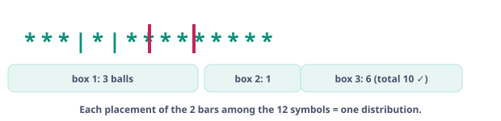

| Object | Order? | Repetition? | Example: "4 from {1,2,3,4}" |
| --- | --- | --- | --- |
| **Composition** of $n$ into $k$ parts | ordered | parts are values (repeats ok) | $2+1+1$, $1+2+1$, … are different; count $\binom{n-1}{k-1}$ |
| **Partition** of $n$ into $k$ parts | unordered | repeats ok | $2+1+1$ and $1+2+1$ are the same; count $p_k(n)$ (no closed form!) |
| **Multiset** of size $k$ from $n$ types | unordered | repeats ok | choosing 4 objects where objects come in $n$ kinds; count $\binom{n+k-1}{k}$ |

#### Integer compositions — ordered sums

A **composition** of $n$ into $k$ (positive) parts is an ordered $k$-tuple $(a_1,\dots,a_k)$ of positive integers with sum $n$. Positive stars-and-bars gives $\boxed{\binom{n-1}{k-1}}$: place $k-1$ separators in the $n-1$ gaps between the $n$ unit blocks. (Here the separators *must* go between units — that positivity constraint is exactly what makes compositions use $\binom{n-1}{k-1}$ while box-counts use $\binom{n+k-1}{k-1}$.)

Any number of parts: $\sum_{k=1}^{n}\binom{n-1}{k-1} = 2^{n-1}$ — and there is a one-line bijection: a composition of $n$ ↔ a choice of which of the $n-1$ gaps between $1,1,\dots,1$ ( $n$ ones) get a separator.

#### **S3**[JEE Main][solved][stars & bars]How many **non-negative** integer solutions does $x + y + z = 15$ have? How many…

How many **non-negative** integer solutions does $x + y + z = 15$ have? How many **positive** ones?

<details>
<summary>Answer + Reasoning</summary>

Solution & reasoning

Non-negative: $\binom{15+3-1}{3-1} = \binom{17}{2} =$ **Answer: 136**. Positive: $\binom{15-1}{3-1} = \binom{14}{2} =$ **Answer: 91**.

**Complement check (small-case discipline):** solutions of $x+y+z=15$ with at least one zero: exactly one zero: $3\cdot 14 = 42$ (e.g. $x=0$, $y,z\ge 1$, $y+z=15$: 14 pairs); exactly two zeros: 3 (e.g. $x=y=0$, $z=15$); three zeros: 0. Total $45 = 136 - 91$ ✓.

</details>

#### **S4**[JEE Adv][solved][multiset / stars & bars]You buy 12 fruits from a stall selling 5 varieties (unlimited stock, only the …

You buy 12 fruits from a stall selling **5 varieties** (unlimited stock, only the counts matter). How many purchase tickets are possible?

<details>
<summary>Answer + Reasoning</summary>

Solution & reasoning

A ticket = $(x_1,\dots,x_5) \ge 0$, $\sum x_i = 12$ = multiset of size 12 from 5 types: $\binom{12+5-1}{5-1} = \binom{16}{4} =$ **Answer: 1,820**

</details>

#### **S5**[JEE Adv][solved][compositions + shift]In how many ordered ways can 10 be written as a sum of positive integers, each…

In how many **ordered** ways can 10 be written as a sum of positive integers, **each at least 2**?

<details>
<summary>Answer + Reasoning</summary>

Solution & reasoning

Let the $k$ parts be $a_i \ge 2$. Shift: $b_i = a_i - 1 \ge 1$, $\sum b_i = 10 - k$, a composition of $10-k$ into $k$ parts: $\binom{9-k}{k-1}$ ways (needs $10 - k \ge k$, i.e. $k \le 5$): $k=2: \binom{7}{1} = 7$; $k=3: \binom{6}{2} = 15$; $k=4: \binom{5}{3} = 10$; $k=5: \binom{4}{4} = 1$. Total $=$ **Answer: 33**

Pattern: **constraints on parts → shift the variables → apply the standard form → sum over the (now bounded) number of parts.** The same three-beat sequence solves nearly every composition problem in JEE Advanced.

</details>

### 3.5 Multinomial coefficients

Arranging a multiset with $n_1, \dots, n_k$ identical copies of $k$ types (Chapter 2) gives $\dfrac{n!}{n_1!\cdots n_k!}$. This number is the **multinomial coefficient** $\dbinom{n}{n_1, \dots, n_k}$, and it counts something bigger:

> [!abstract] First Principles — the two faces of the multinomial
>
> **Face 1 (arrangements).** Words in an alphabet of $k$ letters with letter $i$ used exactly $n_i$ times — the Ch. 2 count.
>
>
> **Face 2 (partitioning labeled objects).** Dividing $n$ *labeled* people into $k$ groups of sizes $n_1, \dots, n_k$: choose group 1: $\binom{n}{n_1}$; group 2 from the rest: $\binom{n-n_1}{n_2}$; … . The product $\binom{n}{n_1}\binom{n-n_1}{n_2}\cdots = \dfrac{n!}{n_1!\cdots n_k!}$ telescopes to the same number. If the groups themselves are *unlabeled* (and of distinct sizes… beware equal sizes), divide by the appropriate symmetry — the exact-symmetry warning of Ch. 2 applies.
>
>
> **Face 3 (the identity).** $\sum \dbinom{n}{n_1,\dots,n_k} = k^n$ over all compositions of $n$ into $k$ parts (zeros allowed): the multinomial counts colorings of $n$ labeled balls with $k$ colors, grouped by how many got each color. This is the seed of the multinomial theorem — Chapter 4.

#### **S6**[JEE Adv][solved][double counting preview]Prove $\dbinom{2n}{n} = \sum_{k=0}^{n} \binom{n}{k}^2$.

Prove $\dbinom{2n}{n} = \sum_{k=0}^{n} \binom{n}{k}^2$.

<details>
<summary>Answer + Reasoning</summary>

Solution & reasoning (a double-counting preview)

Let $A, B$ be two labeled sets of size $n$. Count the $n$-subsets of $A \cup B$. **Directly:** $\binom{2n}{n}$. **By the part from $A$:** an $n$-subset uses $k$ elements of $A$ (hence $n-k$ of $B$): $\binom{n}{k}\binom{n}{n-k}$ ways for each $k$; sum over $k$. Since $\binom{n}{n-k} = \binom{n}{k}$, $\binom{2n}{n} = \sum_k \binom{n}{k}^2$. $\square$

This is Vandermonde's identity in the symmetric case — Chapter 4 generalizes the method and collects the whole identity toolkit.

</details>

### 3.6 First look: integer partitions

A **partition** of $n$ is a way of writing $n$ as a sum of *positive integers, order ignored*. Denote the count by $p(n)$:

| $n$ | 1 | 2 | 3 | 4 | 5 | 6 | 7 | 8 | 9 | 10 |
| --- | --- | --- | --- | --- | --- | --- | --- | --- | --- | --- |
| $p(n)$ | 1 | 2 | 3 | 5 | 7 | 11 | 15 | 22 | 30 | 42 |

For $n = 4$: $4;\ 3+1;\ 2+2;\ 2+1+1;\ 1+1+1+1$ — 5 partitions, versus $2^{3} = 8$ compositions. Order is everything (and nothing): the same numbers, two different mathematical worlds.

> [!abstract] First Principles — why partitions are hard (and interesting)
>
> Compositions and multisets have bijections to words (stars and bars) — that's why they have closed forms. Partitions have *no such word model*: there is no known simple bijection between partitions of $n$ and any object with a known count. Instead the subject lives on **generating functions**: $p(n)$ is the coefficient of $x^n$ in $\prod_{k=1}^{\infty}\frac{1}{1-x^k}$ (each part-size $k$ can be used any number of times — the geometric series). The deepest theorems (Euler's pentagonal number theorem, partitions-into-distinct = partitions-into-odd) are theorems *about this infinite product*. Chapter 6 develops the machinery and proves Euler's theorem; for now, note the shape: **when no bijection exists, the coefficient of a generating function becomes the count.**

> [!example] Olympiad Extension — the first surprising partition fact
>
> Already provable at this level: the number of partitions of $n$ **into distinct parts** equals the number **into odd parts** (Euler, 1748). The proof (Chapter 6) is a single line of generating functions: $\prod (1+x^k) = \prod_{\text{odd } m}\frac{1}{1-x^m}$. Keep it in mind when you meet "distinct" vs "odd" in problems — it is not a coincidence, it is a theorem.

### 3.7 Practice set

#### **P1**[JEE Main][practice][product of choices]From 6 boys and 5 girls, form a 4-member committee with exactly 2 boys and 2 g…

From 6 boys and 5 girls, form a 4-member committee with exactly 2 boys and 2 girls.

<details>
<summary>Answer + Reasoning</summary>

$\binom62\binom52 = 15\cdot 10 =$ **150**.

</details>

#### **P2**[Olympiad][practice][IE (Ch. 5)]From a 52-card deck, how many 6-card hands contain all four suits ?

From a 52-card deck, how many 6-card hands contain **all four suits**?

<details>
<summary>Answer + Reasoning</summary>

IE on the missing suits: $\binom{52}{6} - 4\binom{39}{6} + 6\binom{26}{6} - 4\binom{13}{6}
        = 20{,}358{,}520 - 13{,}050{,}492 + 1{,}381{,}380 - 6{,}864 =$ **8,682,544**.

</details>

#### **P3**[JEE Adv][practice][stars & bars + bound]Non-negative solutions of $x_1 + x_2 + x_3 + x_4 = 20$ with $x_1 \le 5$.

Non-negative solutions of $x_1 + x_2 + x_3 + x_4 = 20$ with $x_1 \le 5$.

<details>
<summary>Answer + Reasoning</summary>

Total $\binom{23}{3} = 1771$. Bad ($x_1 \ge 6$): shift $x_1' = x_1 - 6 \ge 0$: $x_1' + x_2 + x_3 + x_4 = 14$: $\binom{17}{3} = 680$. Answer $1771 - 680 =$ **1,091**.

</details>

#### **P4**[JEE Main][practice][stars & bars + bound]Non-negative solutions of $a + b + c = 20$ with $a \le 7$.

Non-negative solutions of $a + b + c = 20$ with $a \le 7$.

<details>
<summary>Answer + Reasoning</summary>

$\binom{22}{2} - \binom{14}{2} = 231 - 91 =$ **140**.

</details>

#### **P5**[JEE Adv][practice][multiset arrangement]Arrange in a row: 5 identical red, 4 identical blue, 2 identical green, 2 iden…

Arrange in a row: 5 identical red, 4 identical blue, 2 identical green, 2 identical white balls.

<details>
<summary>Answer + Reasoning</summary>

$\dfrac{13!}{5!\,4!\,2!\,2!} = \dfrac{6{,}227{,}020{,}800}{120\cdot 24 \cdot 4} =$ **540,540**.

</details>

#### **P6**[Olympiad][practice][Vandermonde]Prove $\displaystyle\sum_{k} \binom{n}{k}\binom{n}{k+1} = \binom{2n}{n+1}$.

Prove $\displaystyle\sum_{k} \binom{n}{k}\binom{n}{k+1} = \binom{2n}{n+1}$.

<details>
<summary>Answer + Reasoning</summary>

Vandermonde: $\sum_k \binom{n}{k}\binom{n}{m-k} = \binom{2n}{m}$ with $m = n+1$: $\binom{n}{m-k} = \binom{n}{n+1-k} = \binom{n}{k-1}$, so LHS becomes $\sum_k \binom{n}{k}\binom{n}{k-1} = \binom{2n}{n+1}$ after the index shift $k\mapsto k+1$. ✓ (Committee story: $(n+1)$-subsets of a $(2n)$-set split into two $n$-halves.)

</details>

#### **P7**[JEE Main][practice][multiset]Choose 10 objects from 7 types, repetition allowed, order irrelevant.

Choose 10 objects from 7 types, repetition allowed, order irrelevant.

<details>
<summary>Answer + Reasoning</summary>

$\binom{10+7-1}{7-1} = \binom{16}{6} =$ **8,008**.

</details>

#### **P8**[Olympiad][practice][compositions + IE]Compositions of 12 into exactly 4 positive parts, each part at most 5 .

Compositions of 12 into exactly 4 positive parts, **each part at most 5**.

<details>
<summary>Answer + Reasoning</summary>

Total positive compositions: $\binom{11}{3} = 165$. A part $\ge 6$: shift it down by 6 (say $x_1 = x_1' + 6$, $x_1' \ge 0$): $x_1' + x_2 + x_3 + x_4 = 6$ with $x_2,x_3,x_4 \ge 1$ → make all non-negative: sum $3$ in 4 variables: $\binom{6}{3} = 20$ per part, $4 \cdot 20 = 80$. Two parts $\ge 6$ would force the other two positive to sum to $-2$: impossible. Answer $165 - 80 =$ **85**.

</details>

---

---

# Chapter 4 — Binomial Coefficients & Identities

*6 sections · 13 questions*

*Chapter 4 · Coefficients Count*

**Binomial Theorem & Double Counting**

The binomial theorem is a counting statement wearing algebra's clothes. This chapter proves it by counting, turns double counting into a proof machine, builds the complete identity toolkit, and ends with coefficient extraction — the bridge to generating functions.

`theorem by counting` `double counting` `identity toolkit` `negative binomial` `coefficient extraction`

### 4.1 The binomial theorem, proved by counting

**Theorem.** For a non-negative integer $n$,

$$(x + y)^n = \sum_{k=0}^{n} \binom{n}{k} x^{n-k} y^k$$

> [!abstract] First Principles — the proof is one sentence
>
> $(x+y)^n$ is a product of $n$ identical factors. To produce the term $x^{n-k}y^k$ in the expansion, exactly $k$ of the $n$ factors must contribute their $y$, and the other $n-k$ their $x$. The choice of *which $k$ factors* is the whole data: $\binom{n}{k}$ choices, each contributing the same monomial $x^{n-k}y^k$. Coefficients add. That's the proof — no induction needed (induction is just a different bookkeeping of the same split).
>
>
> Notice the deeper statement this proof actually makes: **a binomial coefficient is the number of ways to take a specific term from a specific product.** From now on, "coefficient of $x^m$ in $F(x)$" and "number of objects of size $m$" are interchangeable languages. That is the entire philosophy of generating functions (Chapter 6).

| Substitution | Identity | Counting meaning |
| --- | --- | --- |
| $x = y = 1$ | $\sum_k \binom{n}{k} = 2^n$ | all subsets of $[n]$, by size |
| $x = 1, y = -1$ | $\sum_k (-1)^k \binom{n}{k} = 0$ | even-sized vs odd-sized subsets equal (involution, Ch. 1) |
| $x = y = 1$, differentiate in $x$ | $\sum k\binom{n}{k} = n2^{n-1}$ | (element, subset) pairs |
| $x = 1, y = t$ | $(1+t)^n = \sum \binom{n}{k}t^k$ | the counting engine itself |

### 4.2 Double counting — the method, systematized

From Chapter 1: count a pair-set $\Omega$ two ways. The complete recipe:

- **Invent $\Omega$:** a set of pairs (or triples, or "flags on a figure") whose definition contains the objects of both sides of the target identity.
- **Count by coordinate 1** → one side.
- **Count by coordinate 2** → the other side.
- **Set equal.** No algebra was "used" — the identity is a tautology about one set.

#### Worked — Vandermonde's identity (the flagship)

**Theorem (Vandermonde).** $\displaystyle\sum_{k} \binom{r}{k}\binom{s}{m-k} = \binom{r+s}{m}$, where the sum runs over all $k$ for which the binomials are defined.

> [!abstract] First Principles — the committee story
>
> Let $A, B$ be disjoint sets, $|A| = r$, $|B| = s$. Count the $m$-subsets of $A \cup B$. **Directly:** $\binom{r+s}{m}$. **By the part from $A$:** an $m$-subset contains exactly $k$ elements of $A$ for some $k$: choose those ($\binom{r}{k}$) and the remaining $m-k$ from $B$ ($\binom{s}{m-k}$). The cases are disjoint and exhaustive, so sum over $k$. Identity proved. $\square$
>
>
> Everything downstream is a parameter choice: $r = s = n, m = n$ gives $\sum \binom{n}{k}^2 = \binom{2n}{n}$; $s = 1$ gives Pascal; $r = n, s = n, m = n+1$ gives $\sum \binom{n}{k}\binom{n}{k-1} = \binom{2n}{n+1}$. One proof, a family of identities.

#### Worked — a genuinely new shape: $\sum_k \binom{k}{m}\binom{n-k}{r-m} = \binom{n+1}{r+1}$

**Proof.** Let $U = \{0, 1, \dots, n\}$ (size $n+1$). Count the $(r+1)$-subsets of $U$, and inside each subset look at its $(m+1)$-**smallest** element, call it $k$. Then: $m$ elements are chosen from $\{0, \dots, k-1\}$: $\binom{k}{m}$ ways; $r-m$ elements from $\{k+1, \dots, n\}$: $\binom{n-k}{r-m}$ ways. Sum over possible $k$: $\sum_k \binom{k}{m}\binom{n-k}{r-m}$. But the total is $\binom{n+1}{r+1}$. $\square$

The pattern to steal: **"split by a distinguished element's *position*"** (here: the $(m+1)$-smallest member). It is the same engine as the hockey-stick identity (split by the maximum element) — one idea, two costumes.

#### Worked — $\sum k^2 \binom{n}{k} = n(n+1)2^{n-2}$

**Proof (by pairs of marked elements).** Let $\Omega = \{(i, j, S) : i, j \in S
    \subseteq [n]\}$ — a subset with *two distinguished (ordered) elements*. **By $S$:** a $k$-subset contributes $k^2$ ordered pairs → $\sum k^2\binom{n}{k}$. **By $(i,j)$:** $i = j$: $n$ choices, then $S$ any of the $2^{n-1}$ subsets containing $i$ → $n\cdot 2^{n-1}$; $i \ne j$: $n(n-1)$ ordered pairs, then $S$ any of the $2^{n-2}$ subsets containing both → $n(n-1)2^{n-2}$. Total $n\cdot 2^{n-1} + n(n-1)2^{n-2} = n(n+1)2^{n-2}$. $\square$

Same as differentiating twice (the $k(k-1)$ term plus the $k$ term) — but the counting proof shows *what is being counted*, and that knowledge is what lets you invent the next identity.

### 4.3 The identity toolkit

All proven by the methods above (committees, marking, involution). Memorize the *proof pattern*, not the list.

| Identity | Pattern |
| --- | --- |
| $\displaystyle\sum_k \binom{n}{k} = 2^n$ | subsets by size |
| $\displaystyle\sum_k (-1)^k \binom{n}{k} = 0$ | toggle involution / $x=1, y=-1$ |
| $\displaystyle\sum_{k\ \mathrm{even}} \binom{n}{k} = 2^{n-1}\ (n\ge 1)$ | even/odd sizes equal |
| $\displaystyle\sum k\binom{n}{k} = n2^{n-1}$ | mark one element |
| $\displaystyle\sum k(k-1)\binom{n}{k} = n(n-1)2^{n-2}$ | mark two (ordered) |
| $\displaystyle\sum \binom{n}{k}^2 = \binom{2n}{n}$ | Vandermonde $r=s=n$ |
| $\displaystyle\sum_k \binom{n}{k}\binom{n}{k+1} = \binom{2n}{n+1}$ | Vandermonde $m = n+1$ |
| $\displaystyle\sum_{i=r}^{n}\binom{i}{r} = \binom{n+1}{r+1}$ | split by maximum (hockey stick, Ch. 3) |
| $\displaystyle\sum_k \binom{n}{k}\binom{n+1}{k+1} = \binom{2n+1}{n}$ | Vandermonde $r = n, s = n+1, m = n$ |
| $\displaystyle\sum_k \binom{n}{k}\frac{1}{k+1} = \frac{2^{n+1}-1}{n+1}$ | integration (below) |
| $\displaystyle\binom{n}{r} = \frac{n}{r}\binom{n-1}{r-1}$ | committee + chair: $\binom{n}{r}r = n\binom{n-1}{r-1}$ |

#### The integration trick (for "1/(k+1)" identities)

Since $\int_0^1 (1+x)^n dx = \frac{2^{n+1}-1}{n+1}$ and $\int_0^1 x^k dx = \frac{1}{k+1}$, integrating $\sum \binom{n}{k}x^k = (1+x)^n$ from 0 to 1 gives $\sum_k \binom{n}{k}\dfrac{1}{k+1} = \dfrac{2^{n+1}-1}{n+1}$. Counting meaning: $\binom{n}{k}\frac{1}{k+1} = \frac{1}{k+1}\binom{n+1}{k+1}\cdot\frac{k+1}{n+1}$… the cleanest form: $\dfrac{1}{k+1}\binom{n}{k} = \dfrac{1}{n+1}\binom{n+1}{k+1}$ (catalan-shaped!). So the identity is a scaled even-split of $\sum\binom{n+1}{k+1} = 2^{n+1}-1$.

#### **S1**[JEE Adv][solved][three proofs of one identity]Prove $\displaystyle\sum_{k=0}^{n} k\binom{n}{k} = n\,2^{n-1}$ in three different ways.

Prove $\displaystyle\sum_{k=0}^{n} k\binom{n}{k} = n\,2^{n-1}$ in three different ways.

<details>
<summary>Answer + Reasoning</summary>

Solution

**(i) Double counting.** $\Omega = \{(i,S): i \in S \subseteq [n]\}$: by $i$: $n\cdot 2^{n-1}$; by $S$: $\sum k\binom{n}{k}$. ✓ (Ch. 1/4.2.)

**(ii) Calculus.** $(1+x)^n = \sum \binom{n}{k}x^k$; differentiate: $n(1+x)^{n-1} = \sum k\binom{n}{k}x^{k-1}$; set $x = 1$. ✓

**(iii) Term manipulation.** $k\binom{n}{k} = n\binom{n-1}{k-1}$ (mark the chosen element, then it's "chosen element + subset of the rest" — choose the element first). Sum: $n\sum_{k\ge 1}\binom{n-1}{k-1} = n\sum_{j\ge 0}\binom{n-1}{j} = n2^{n-1}$. ✓

**Why three proofs?** Each proof suggests different generalizations: (i) → pairs of marks; (ii) → higher moments; (iii) → shifting identities. The Olympiad habit is: *never stop at one proof when the problem invites more.*

</details>

#### **S2**[JEE Adv][solved][coefficient extraction]Find the coefficient of $x^8$ in $(1+x)^{10}\left(1+\dfrac{1}{x}\right)^{12}$.

Find the coefficient of $x^8$ in $(1+x)^{10}\left(1+\dfrac{1}{x}\right)^{12}$.

<details>
<summary>Answer + Reasoning</summary>

Solution & reasoning

Rewrite: $\left(1+\frac{1}{x}\right)^{12} = x^{-12}(1+x)^{12}$, so the product is $x^{-12}(1+x)^{22}$. Coefficient of $x^8$ = coefficient of $x^{20}$ in $(1+x)^{22}$ $= \binom{22}{20} =$ **Answer: 231**

The move "pull out $x^{-12}$ and reindex" is used constantly in coefficient problems — always write negative powers as $x^{-m}$ times a polynomial first.

</details>

#### **S3**[Olympiad][solved][onto functions (IE preview)]How many **onto** functions $f: \{1,2,3,4,5\} \to \{1,2,3\}$ are there?

How many **onto** functions $f: \{1,2,3,4,5\} \to \{1,2,3\}$ are there?

<details>
<summary>Answer + Reasoning</summary>

Solution & reasoning

Total functions: $3^5 = 243$. Subtract those missing at least one value, by IE on the three "value $i$ is missing" events: $3^5 - \binom31 2^5 + \binom32 1^5 - \binom33 0^5 = 243 - 96 + 3 =$ **Answer: 150**

In general, onto $[n]\to[k]$ counts are $k!\,S(n,k)$ where $S(n,k)$ (Stirling numbers of the second kind, Chapter 6) partition $[n]$ into $k$ nonempty unlabeled blocks. The IE formula $\sum_{j=0}^k (-1)^j\binom{k}{j}(k-j)^n$ *is* the definition of $k!S(n,k)$ — the two notations are the same number seen from probability vs combinatorics.

</details>

#### **S4**[JEE Adv][solved][numeric application]Compute $\displaystyle\sum_{k=0}^{10} \binom{10}{k}^2$.

Compute $\displaystyle\sum_{k=0}^{10} \binom{10}{k}^2$.

<details>
<summary>Answer + Reasoning</summary>

Solution

Vandermonde with $r = s = n = 10, m = 10$: $\binom{20}{10} =$ **Answer: 184,756**. (JEE pattern: sums of $\binom{n}{k}^2$, $\binom{n}{k}\binom{n}{n-k}$, $\binom{2n}{2k}$ all resolve to a single central binomial coefficient.)

</details>

### 4.4 Beyond positive exponents — the negative binomial

The counting story works for *any* integer (even negative) exponent, if we allow infinite series. For $|x| &lt; 1$:

$$(1 - x)^{-(r+1)} = \sum_{n=0}^{\infty} \binom{n+r}{r} x^n$$

> [!abstract] First Principles — why stars and bars produces this series
>
> Recall (Ch. 3): the number of non-negative solutions of $y_1 + \cdots + y_{r+1} = n$ is $\binom{n+r}{r}$. Now look at the product $(1 + x + x^2 + \cdots)^{r+1}$: the coefficient of $x^n$ counts exactly the ways to choose exponents $e_1, \dots, e_{r+1} \ge 0$ with $e_1 + \cdots + e_{r+1} = n$ — the same solutions! But each factor is $\frac{1}{1-x}$, so 
> $$ \frac{1}{(1-x)^{r+1}} = \sum_{n\ge 0} \binom{n+r}{r} x^n. $$
>  The formal algebra (generalized binomial theorem) and the counting agree — they *must*, because both sides are the same stars-and-bars count. This is the first time a **generating function** has done real counting work; Chapter 6 makes it systematic.

> [!example] Olympiad Extension — the "any number of parts" corollaries
>
> $(1-x)^{-2} = \sum (n+1)x^n$: the coefficient $n+1$ is the number of 2-part compositions of $n$ — check: $\binom{n+1}{1}$ ✓. $(1-x)^{-3} = \sum \binom{n+2}{2}x^n$: 3-part compositions. The pattern: **compositions with parts from a set $S$ have GF $\frac{1}{1 - (x^{s_1} + x^{s_2} + \cdots)}$**. Example: parts from $\{1,2\}$: $\frac{1}{1 - x - x^2} = \sum F_{n+1}x^n$ — *Fibonacci as a counting sequence*, which Chapter 5 proves combinatorially too.

### 4.5 Coefficients under bounds — the dice engine

The most frequent JEE Advanced shape: "how many ways can $k$ dice sum to $n$?", or equivalently "non-negative solutions of $x_1 + \cdots + x_k = m$ with $x_i \le b$". The universal method:

$$[x^m]\,(1 + x + \cdots + x^b)^k
      \;=\; \sum_{j \ge 0} (-1)^j \binom{k}{j}\binom{m - j(b+1) + k - 1}{k - 1}$$

> [!abstract] First Principles — inclusion–exclusion inside a coefficient
>
> $(1 + \cdots + x^b)^k = \left(\frac{1-x^{b+1}}{1-x}\right)^k = (1-x^{b+1})^k (1-x)^{-k}$. Expand $(1-x^{b+1})^k = \sum_j (-1)^j \binom{k}{j} x^{j(b+1)}$. The term with a given $j$ contributes $\binom{k}{j}(-1)^j$ times the coefficient of $x^{m - j(b+1)}$ in $(1-x)^{-k}$, which is $\binom{m - j(b+1) + k - 1}{k-1}$ (negative binomial, §4.4 — or: non-negative solutions of a $(k)$-variable equation). Sum over $j$. The formula is just IE on the events "$x_i \ge b+1$", packaged as a coefficient. **Every bounded-composition problem in JEE Advanced is this one formula with $b$ specialized** (dice: $b = 5$ after shifting, bounded stars-and-bars: arbitrary $b$).

#### **S5**[JEE Adv][solved][dice / bounded]In how many outcomes do 3 dice sum to 10 ?

In how many outcomes do **3 dice** sum to **10**?

<details>
<summary>Answer + Reasoning</summary>

Solution & reasoning

Each die: $1$ to $6$ → shift: $x_i \in \{0,\dots,5\}$, $\sum x_i = 7$. By the engine: $[x^7](1+x+\cdots+x^5)^3 = \binom{9}{2} - 3\binom{3}{2} = 27$; compute term by term: $j = 0$: $\binom{7+3-1}{2} = \binom92 = 36$; $j = 1$: $-3\binom{7-6+2}{2} = -3\binom32 = -9$; $j \ge 2$: $7 - 12 &lt; 0$, no terms. Answer $36 - 9 =$ **Answer: 27**

Sanity check: 3 dice, 216 outcomes, sum 10 has 27 — matches the known dice-distribution table (11: 25, 10: 27, 9: 25). The "small case by table" habit again.

</details>

> [!warning] Common Trap — when the binomial is "negative"
>
> In the engine, a term $\binom{m - j(b+1) + k - 1}{k-1}$ with $m - j(b+1) &lt; 0$ is **zero** (no solutions to a negative-sum equation) — the sum terminates on its own. Never evaluate $\binom{-3}{2}$ algebraically; set the term to 0. This is the #1 arithmetic disaster in bounded-coefficient problems.

### 4.6 Practice set

#### **P1**[JEE Adv][practice][coefficient enumeration]Coefficient of $x^5$ in $(1+x)^3 (1+x^2)^4 (1+x^3)^2$.

Coefficient of $x^5$ in $(1+x)^3 (1+x^2)^4 (1+x^3)^2$.

<details>
<summary>Answer + Reasoning</summary>

Write $x^{a + 2b + 3c}$, $0\le a\le 3, 0\le b\le 4, 0\le c\le 2$, $a+2b+3c = 5$, weight $\binom3a\binom4b\binom2c$. $c=0$: $a+2b = 5$: $(a,b) = (1,2), (3,1)$: $3\cdot 6 + 1\cdot 4 = 22$. $c=1$: $a+2b = 2$: $(0,1), (2,0)$: $2\cdot(4 + 3) = 14$. $c=2$: $a+2b = -1$: none. Total **36**.

</details>

#### **P2**[JEE Adv][practice][proof]Prove $\displaystyle\sum k(k-1)\binom{n}{k} = n(n-1)2^{n-2}$.

Prove $\displaystyle\sum k(k-1)\binom{n}{k} = n(n-1)2^{n-2}$.

<details>
<summary>Answer + Reasoning</summary>

$k(k-1)\binom{n}{k} = n(n-1)\binom{n-2}{k-2}$ (mark two elements, ordered: choose them first). Sum over $k\ge 2$: $n(n-1)\sum_{j\ge 0}\binom{n-2}{j} = n(n-1)2^{n-2}$. ✓ (Or: differentiate twice and set $x = 1$.)

</details>

#### **P3**[Olympiad][practice][bounded engine]Coefficient of $x^{15}$ in $(1 + x + x^2)^{10}$.

Coefficient of $x^{15}$ in $(1 + x + x^2)^{10}$.

<details>
<summary>Answer + Reasoning</summary>

$(1+x+x^2)^{10} = (1-x^3)^{10}(1-x)^{-10}$. Terms $j = 0..4$ (for $j \ge 5$, $15 - 3j &lt; 0$): $j=0: \binom{24}{9} = 1{,}307{,}504$; $j=1: -10\binom{21}{9} = -10\cdot 293{,}930 = -2{,}939{,}300$; $j=2: +45\binom{18}{9} = 45\cdot 48{,}620 = 2{,}187{,}900$; $j=3: -120\binom{15}{9} = -120\cdot 5{,}005 = -600{,}600$; $j=4: +210\binom{12}{9} = 210\cdot 220 = 46{,}200$; $j=5: -252\binom{9}{9} = -252$. Sum: $1{,}307{,}504 - 2{,}939{,}300 + 2{,}187{,}900 - 600{,}600 + 46{,}200 - 252 =$ **1,452**.

</details>

#### **P4**[JEE Main][practice][parity split]Sum of the coefficients of the **odd powers** of $x$ in $(1+x)^{100}$.

Sum of the coefficients of the **odd powers** of $x$ in $(1+x)^{100}$.

<details>
<summary>Answer + Reasoning</summary>

$\frac{(1+1)^{100} - (1-1)^{100}}{2} =$ **$2^{99}$**. (General trick: even/odd splits use $F(1)$ and $F(-1)$.)

</details>

#### **P5**[JEE Adv][practice][coefficient]Coefficient of $x^9$ in $(1+x)^4(1+x^2)^4(1+x^3)^4$.

Coefficient of $x^9$ in $(1+x)^4(1+x^2)^4(1+x^3)^4$.

<details>
<summary>Answer + Reasoning</summary>

Need $[x^9]$ of $\left(\sum_a \binom4a x^a\right)\left(\sum_b \binom4b x^{2b}\right)
        \left(\sum_c \binom4c x^{3c}\right)$: solutions of $a+2b+3c = 9$ with $0\le a,b,c\le 4$, weight $\binom4a\binom4b\binom4c$:

| $c$ | $(a,b)$ valid | contribution |
| --- | --- | --- |
| 0 | $(1,4), (3,3)$ | $4 + 16 = 20$ |
| 1 | $(4,1), (2,2), (0,3)$ | $16 + 144 + 16 = 176$ |
| 2 | $(3,0), (1,1)$ | $24 + 96 = 120$ |
| 3 | $(0,0)$ | $4$ |

Total: $20 + 176 + 120 + 4 =$ **320**.

</details>

#### **P6**[JEE Adv][practice][parity proof]Prove that for $n \ge 1$, $\displaystyle\sum_{k\ \mathrm{even}} \binom{n}{k} = 2^{n-1}$.

Prove that for $n \ge 1$, $\displaystyle\sum_{k\ \mathrm{even}} \binom{n}{k} = 2^{n-1}$.

<details>
<summary>Answer + Reasoning</summary>

$(1+1)^n = 2^n$ (all subsets) and $(1-1)^n = 0$ (even minus odd). Subtract: twice the even sum $= 2^n$ → even sum $= 2^{n-1}$. ✓ (Counting version: the toggle involution of Ch. 1 matches even/odd subsets.)

</details>

#### **P7**[JEE Adv][practice][coefficient]Coefficient of $x^8$ in $(1+x)^6(1+x^2)^6$.

Coefficient of $x^8$ in $(1+x)^6(1+x^2)^6$.

<details>
<summary>Answer + Reasoning</summary>

$\sum_{j} \binom6j\binom6{8-2j}$ over $8 - 2j \in [0,6]$: $j = 1: 6\cdot 1 = 6$; $j = 2: 15\cdot 15 = 225$; $j = 3: 20\cdot 15 = 300$; $j = 4: 15\cdot 1 = 15$. Total $6 + 225 + 300 + 15 =$ **546**.

</details>

#### **P8**[Olympiad][practice][roots-of-unity filter]If $(1+x)^{20} = \sum_{r=0}^{20} \binom{20}{r} x^r$, find…

If $(1+x)^{20} = \sum_{r=0}^{20} \binom{20}{r} x^r$, find $\displaystyle\sum_{4\mid r} \binom{20}{r}$ (sum over $r \equiv 0 \pmod 4$).

<details>
<summary>Answer + Reasoning</summary>

Roots-of-unity filter: $\sum_{4\mid r} \binom{20}{r}
        = \frac14\sum_{j=0}^{3} (1 + i^j)^{20}$, where $i^2 = -1$: $(1+1)^{20} = 2^{20}$; $(1+i^2)^{20} = 0^{20} = 0$; $(1+i)^{20} = (2i)^{10} = 2^{10}i^{10} = -1024$; $(1-i)^{20} = -1024$. Sum: $\frac{1}{4}(1{,}048{,}576 - 2048) =$ **261,632**. (The filter $\frac{1}{m}\sum_{j=0}^{m-1} \zeta^{-rj}$ extracts the $r \equiv 0 \pmod m$ terms — a standard Olympiad tool; here $\zeta = i$.)

</details>

---

---

# Chapter 5 — Advanced Methods

*4 sections · 15 questions*

*Chapter 5 · JEE Advanced Weapons*

**Inclusion–Exclusion, Pigeonhole & Recurrences**

The three engines behind nearly every "at least one", "no two", "must exist" problem. Inclusion–exclusion is bookkeeping for overlaps; the pigeonhole principle is the existence engine; recurrences turn "count size n" into "count smaller sizes".

`inclusion–exclusion` `rook polynomials` `pigeonhole` `van der Waerden (taste)` `recurrence methods` `Fibonacci everywhere`

### 5.1 Inclusion–Exclusion (IE)

#### Two sets — the Venn diagram logic

**Fig 5.1 — Two sets: add, subtract the double-counted intersection.**

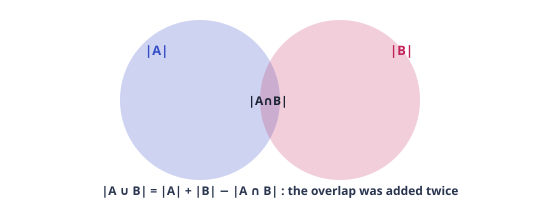

#### The general principle

**Theorem.** For sets $A_1, \dots, A_n$ (inside a universe $X$),

$$\left|\bigcup_{i=1}^{n} A_i\right|
      = \sum_i |A_i| - \sum_{i&lt;j}|A_i\cap A_j|
      + \sum_{i&lt;j&lt;\ell}|A_i\cap A_j\cap A_\ell| - \cdots + (-1)^{n+1}\left|\bigcap_i A_i\right|$$ and therefore $$\left|X \setminus \bigcup_i A_i\right|
      = \sum_{S \subseteq [n]} (-1)^{|S|}\left|\bigcap_{i\in S} A_i\right|,
      \quad \text{with }\bigcap_{i\in\varnothing} A_i = X.$$

> [!abstract] First Principles — the proof counts how many times one element is seen
>
> Track a single element $x \in X$ that lies in exactly $t$ of the sets (say $A_1, \dots, A_t$). How many times does the alternating sum "see" $x$? Once for each non-empty $S \subseteq \{1, \dots, t\}$, with sign $(-1)^{|S|+1}$ on the union side. The number of such sightings is 
> $$ \sum_{j=1}^{t} (-1)^{j+1}\binom{t}{j} \;=\; -\sum_{j=0}^{t}(-1)^j\binom{t}{j} + 1 \;=\; 1, $$
>  using $\sum_{j=0}^{t}(-1)^j\binom{t}{j} = 0$ for $t \ge 1$ (the $x = 1, y = -1$ binomial identity, Ch. 4). So **every element in the union is counted exactly once**, whatever $t\ge 1$; every element outside the union is counted 0 times. The formula is forced. $\square$
>
>
> This proof reveals the whole philosophy: *IE is the unique linear combination of intersection counts that gives each element of the union weight exactly 1.* The same bookkeeping, applied to "avoid all $A_i$", gives the complement formula. Every application below is this one proof with a concrete definition of the events $A_i$.

#### **S1**[JEE Adv][solved][IE · divisibility]How many integers from 1 to 1000 are divisible by 2, 3, or 5 ?

How many integers from 1 to 1000 are divisible by **2, 3, or 5**?

<details>
<summary>Answer + Reasoning</summary>

Solution & reasoning

Events $A_2 =$ divisible by 2, etc. $|A_2| = 500, |A_3| = 333, |A_5| = 200$; $|A_2\cap A_3| = 166, |A_2\cap A_5| = 100, |A_3\cap A_5| = 66$; $|A_2\cap A_3\cap A_5| = 33$. (Each count is $\lfloor 1000/m \rfloor$ for the lcm $m$.) IE: $500 + 333 + 200 - 166 - 100 - 66 + 33 =$ **Answer: 734**

The "why" to internalize: an integer divisible by exactly two of them (say 2 and 3) is added in $|A_2|, |A_3|$ (twice) and removed in $|A_2 \cap A_3|$ (once) → net 1 ✓. Divisible by all three: added 3 times, removed 3 times, added once → net 1 ✓. *Run this trace on every IE answer — it catches sign errors instantly.*

</details>

#### **S2**[JEE Main][solved][IE · derangements]Permutations of $[6]$ with $\sigma(1)\ne 1$, $\sigma(2)\ne 2$, $\sigma(3)\ne 3$ (positions…

Permutations of $[6]$ with $\sigma(1)\ne 1$, $\sigma(2)\ne 2$, $\sigma(3)\ne 3$ (positions 4, 5, 6 unrestricted).

<details>
<summary>Answer + Reasoning</summary>

Solution

IE on the three forbidden events $E_i = \{\sigma(i) = i\}$: $6! - 3\cdot 5! + 3\cdot 4! - 3\cdot 3! = 720 - 360 + 72 - 18 =$ **Answer: 414**

Partial derangements: "fix exactly which positions are forbidden, derange those" generalizes to $\sum_k (-1)^k \binom{n}{k}(n-k)!$ with $n$ replaced by the forbidden count — the same engine as Ch. 2's derangements.

</details>

#### Rook polynomials — IE for "forbidden positions"

Suppose we want permutations of $[n]$ that avoid a set $B$ of forbidden board positions (position $i$ may not send to value $j$ for $(i,j) \in B$). Let $r_k$ = number of ways to place $k$ non-attacking rooks on the forbidden squares $B$ (attacking = sharing a row or column). Then

$$\#\{\sigma : (\sigma(i), i) \notin B\} = \sum_{k=0}^{n} (-1)^k\, r_k\, (n-k)!$$

> [!abstract] First Principles — why this is plain IE in disguise
>
> Event $E_{(i,j)}$ = "rook lands on forbidden square $(i,j)$". The number of permutations containing a *specified* set of $k$ forbidden squares (in distinct rows and columns — otherwise 0) is $(n-k)!$. IE over the forbidden squares groups by "how many of them occur", and the number of $k$-sets of forbidden squares in distinct rows/columns is exactly the rook number $r_k$. Done. Derangements = $B$ is the diagonal: $r_k = \binom{n}{k}$, recovering $D_n = \sum (-1)^k\binom{n}{k}(n-k)!$. The rook formalism matters when $B$ is a *weird board* (L-shapes, staircases) where $r_k$ is easy but the events are not "symmetric".

#### **S3**[Olympiad][solved][rook board]Count the permutations $\sigma$ of $[4]$ with $\sigma(1)\ne 2$, $\sigma(2)\ne 1$…

Count the permutations $\sigma$ of $[4]$ with $\sigma(1)\ne 2$, $\sigma(2)\ne 1$, $\sigma(3)\ne 4$, $\sigma(4)\ne 3$.

<details>
<summary>Answer + Reasoning</summary>

Solution

Forbidden board: 4 squares — two disjoint "anti-diagonal pairs". Rook numbers: $r_0 = 1$; $r_1 = 4$; $r_2 = \binom42 = 6$ (any two of the 4 squares are in distinct rows and columns — check: rows 1,2,3,4 and columns 2,1,4,3, all distinct ✓); $r_3 = 4$; $r_4 = 1$ (all 4 use distinct rows/columns ✓). Answer: $4! - 4\cdot 3! + 6\cdot 2! - 4\cdot 1! + 1\cdot 0! = 24 - 24 + 12 - 4 + 1 =$ **Answer: 9**

</details>

> [!tip] Key Idea — the universal IE recipe
>
> - Define the **bad events** $A_i$ ("property $i$ occurs").
> - Compute $|\bigcap_{i\in S} A_i|$ for a generic $S$ of size $k$ — usually $\binom{n}{k} \times$ (something free).
> - Write $\sum_k (-1)^k \binom{n}{k} \times (\text{something free})$.
>
>
> Everything you've seen so far — derangements, bounded stars-and-bars (Ch. 4), "all suits present" (Ch. 3), "at least one 0" (Ch. 1) — is this recipe with a different $A_i$.

### 5.2 The Pigeonhole Principle

**Fig 5.2 — If $n+1$ objects enter $n$ boxes, one box holds $\ge 2$. The average is $>1$, so some box beats the average.**

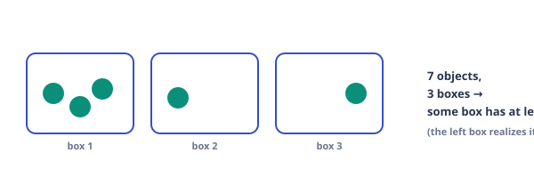

> [!abstract] First Principles — two forms, one averaging argument
>
> **Weak form.** $n+1$ objects, $n$ boxes $\Rightarrow$ some box has $\ge 2$. Proof: if every box had $\le 1$, total $\le n &lt; n+1$. Contradiction.
>
>
> **Strong form.** Objects distributed into boxes with capacities $m_1, \dots, m_n$: if total $> \sum m_i$, some box exceeds its capacity. (Same contradiction: total $\le \sum m_i$.)
>
>
> The *reasoning* behind every application: **build the boxes deliberately**. The theorem is trivial; the art is choosing a function $\text{object} \to \text{box}$ (a "pigeonhole map") such that (a) the number of boxes is smaller than the number of objects, and (b) "two objects in the same box" implies the conclusion you need. Standard box constructions: residues mod $m$; the *odd part* of an integer; months/quarters for dates; grid subsquares for geometry; initial segments for sequences.

#### Classic applications — each teaches one box construction

#### **S4**[JEE Adv][solved][pigeonhole · odd part]Prove: from any $n+1$ integers chosen from $\{1, 2, \dots, 2n\}$, two exist such that **one…

Prove: from any $n+1$ integers chosen from $\{1, 2, \dots, 2n\}$, two exist such that **one divides the other**.

<details>
<summary>Answer + Reasoning</summary>

Proof (the odd-part construction)

Write each chosen integer uniquely as $2^a \cdot m$ with $m$ *odd*. The odd part $m$ lies in $\{1, 3, 5, \dots, 2n-1\}$ — exactly $n$ possible values (the boxes). We chose $n+1$ integers (the pigeons), so two, say $x = 2^a m$ and $y = 2^b m$, share the same odd part. If $a &lt; b$ then $x \mid y$ (indeed $y/x = 2^{b-a}$ is an integer). Done. $\square$

Note the box map: $x \mapsto$ odd part of $x$. "Same box ⇒ one divides the other" is exactly what the odd-part factorization guarantees. *Refinement & sharpness:* the same argument shows any 11 integers from $\{1,\dots,20\}$ contain such a pair (only 10 odd parts $\le 20$ exist) — and 11 is best possible: $\{11,12,\dots,20\}$ is a 10-element subset with *no* dividing pair, since twice any element of it already exceeds 20.

</details>

#### **S5**[Olympiad][solved][pigeonhole · geometry]Given **5 points** in a unit square, prove that two are within distance…

Given **5 points** in a unit square, prove that two are within distance $\le \dfrac{\sqrt2}{2}$.

<details>
<summary>Answer + Reasoning</summary>

Proof

Split the square into 4 equal subsquares of side $1/2$ (the boxes). By the pigeonhole principle (5 points, 4 boxes), some subsquare contains at least 2 points. Two points in a $1/2 \times 1/2$ square are at distance at most its diagonal, $\frac{\sqrt{1/2}}{1} = \frac{\sqrt2}{2}$. Done. $\square$

General shape: $2n+1$ points in a unit square $\Rightarrow$ 2 within distance $\le \sqrt2/2$. And the bound is sharp: the 4 corner points of the subsquares (plus center)… the extremal configuration is the 4 subsquare centers (mutual distance $\sqrt2/2$).

</details>

> [!example] Olympiad Extension — van der Waerden's theorem, first case
>
> **Van der Waerden $W(r, k)$:** the least $N$ such that every $r$-coloring of $\{1, \dots, N\}$ contains a *monochromatic $k$-term arithmetic progression*. $W(2, 3) = 9$: any red/blue coloring of $[9]$ has a monochromatic $\{a, a+d, a+2d\}$. (It is a theorem that $W(r,k)$ is finite for *all* $r, k$ — one of the founding results of Ramsey theory; the proof of finiteness is deep, but the small cases are excellent pigeonhole practice.)
>
>
> **Proof that $W(2,3) \le 9$.** Suppose a coloring avoids a monochromatic 3-AP. WLOG $1 = R$. *(i) If $3 = R$:* then $2 = B$ (else $1,2,3$); $5 = B$ (else $1,3,5$). If $7 = R$: $4 = B$ (from $1,4,7$), $6 = R$ (from $2,4,6$), $9 = B$ (from $3,6,9$), $8 = B$ (from $6,7,8$) — but then $2,5,8$ are all $B$, contradiction. So $7 = B$ — but then $3,5,7$ are all $B$, contradiction. Hence $3 = B$. *(ii) If $5 = B$:* $4 = R$ (from $3,4,5$), $7 = B$ (from $1,4,7$), $9 = R$ (from $5,7,9$), $6 = R$ (from $5,6,7$), $8 = B$ (from $4,6,8$), $2 = B$ (from $2,5,8$) — but then $2,5,8$ are all $B$, contradiction. Hence $5 = R$. *(iii) Now $1 = R, 3 = B, 5 = R$:* $9 = B$ (from $1,5,9$). If $7 = R$: $4 = B$ (from $1,4,7$), $6 = B$ (from $5,6,7$), $2 = R$ (from $2,4,6$), $8 = B$ (from $2,5,8$) — but $4,6,8$ are all $B$, contradiction. If $7 = B$: $8 = R$ (from $7,8,9$), $2 = B$ (from $2,5,8$). If $4 = R$: $6 = B$ (from $4,6,8$) — but $3,6,9$ all $B$, contradiction. If $4 = B$: $6 = R$ (from $2,4,6$) — but $2,3,4$ all $B$, contradiction. All branches die; no such coloring exists. Hence $W(2,3) \le 9$. And $W(2,3) > 8$: the coloring $R, B, B, R, R, B, B, R$ of $[8]$ has no monochromatic 3-AP (check the list $(1,2,3),(2,3,4),\dots,(6,7,8),(1,3,5),\dots,(2,5,8),(1,4,7)$ — none monochromatic). So $W(2,3) = 9$. $\square$
>
>
> This case-split style — "assume the opposite, follow the forced colors until a clash" — is the standard method for small Ramsey-type statements.

### 5.3 Recurrence methods — counting by structure

> [!abstract] First Principles — the last-step decomposition
>
> Many families of objects of "size $n$" decompose **uniquely** by their last building block: a tiling ends with a vertical domino or two horizontal ones; a binary string ends in 0 or in …10; a composition ends with a part of size $1, 2, 3$. If "ending with block $b_i$" leaves a smaller instance of the *same problem* (of size $n - |b_i|$) and the cases are disjoint and exhaustive, then 
> $$ a_n = a_{n - |b_1|} + a_{n - |b_2|} + \cdots, $$
>  with base cases from the smallest sizes. The method is the sum rule applied *recursively*. Its two failure modes: (a) the last-block cases overlap or miss configurations (→ introduce auxiliary "state" sequences, below); (b) the recurrence is right but you can't solve it (→ generating functions, Chapter 6, or just compute the needed $n$).

#### Worked — domino tilings of a $2 \times n$ board

**Fig 5.3 — The last-step decomposition: $2\times n$ domino tilings satisfy $a_n = a_{n-1} + a_{n-2}$, so $a_n = F_{n+1}$. For $n = 10$: $F_{11} = 89$.**

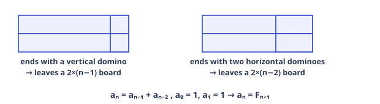

| Object counted by $a_n$ | Last block | Recurrence |
| --- | --- | --- |
| $2\times n$ domino tilings | vertical (1) / two horizontal (2) | $a_n = a_{n-1} + a_{n-2}$, $a_0=1,a_1=1$ → $F_{n+1}$ |
| binary strings of length $n$, no consecutive 1s | ends in 0 / ends in 10 | $a_n = a_{n-1} + a_{n-2}$ → $F_{n+2}$ |
| subsets of $[n]$ with no two consecutive | $n \notin S$ / $n \in S$ (then $n{-}1\notin S$) | $a_n = a_{n-1} + a_{n-2}$ → $F_{n+2}$ |
| compositions of $n$ with parts in $\{1,2,3\}$ | last part 1 / 2 / 3 | $a_n = a_{n-1}+a_{n-2}+a_{n-3}$ (tribonacci) |
| compositions of $n$ into odd parts | GF: $(1-x^2)/(1-x-x^2)$ (§4.4) | $a_n = F_n$ (Ch. 6/§4.4) |
| $3\times n$ domino tilings ($n$ even) | needs auxiliary state | $a_n = 4a_{n-2} - a_{n-4}$ |

#### Fibonacci inside Pascal's triangle — the "same recurrence" proof technique

**Identity:** $\displaystyle\sum_{k\ge 0} \binom{n-k}{k} = F_{n+1}$ (the $k$-th superdiagonal sum).

> [!abstract] First Principles — verify the recurrence, match the initials
>
> Let $D_n = \sum_k \binom{n-k}{k}$. By Pascal's identity on the *top* index, $\binom{n-k}{k} = \binom{n-k-1}{k} + \binom{n-k-1}{k-1}$; shifting the second sum ($k\mapsto k+1$): $D_n = D_{n-1} + D_{n-2}$. The Fibonacci numbers satisfy the same recurrence, and $D_0 = 1 = F_1, D_1 = 1 = F_2$. Same recurrence + same initials ⇒ $D_n = F_{n+1}$. This "match recurrence and base cases" technique is how you prove *any* closed form for a recursively defined sequence — and it connects Pascal's triangle to tiling counts without a bijection (though one exists: tilings of a $1\times n$ board, vertical tile ↔ part 1, horizontal pair ↔ part 2… i.e. compositions into $\{1,2\}$).

#### **S6**[JEE Adv][solved][recurrence]In how many ways can 6 people sit in a row so that no two of A, B, C sit toget…

In how many ways can 6 people sit in a row so that no two of A, B, C sit together? (i.e. A, B, C pairwise non-adjacent — the gap method, Ch. 2, now framed as a decomposition).

<details>
<summary>Answer + Reasoning</summary>

Solution

Gap method: arrange the other 3 people: $3! = 6$; choose 3 of the 4 gaps: $\binom43 = 4$; order A, B, C: $3! = 6$. Total $6 \cdot 4 \cdot 6 =$ **Answer: 144**

</details>

#### **S7**[JEE Main][solved][recurrence]A stair has 10 steps. Each move is 1 or 2 steps. How many ways to climb? (Ch. …

A stair has 10 steps. Each move is 1 or 2 steps. How many ways to climb? (Ch. 1's P6 with a part-3 removed.)

<details>
<summary>Answer + Reasoning</summary>

Solution

$a_n = a_{n-1} + a_{n-2}$, $a_0 = 1, a_1 = 1$: $1,1,2,3,5,8,13,21,34,55,89$. $a_{10} =$ **Answer: 89** (it is $F_{11}$).

</details>

### 5.4 Practice set

#### **P1**[JEE Main][practice][IE]How many integers from 1 to 100 are divisible by 2 or 3?

How many integers from 1 to 100 are divisible by 2 or 3?

<details>
<summary>Answer + Reasoning</summary>

$50 + 33 - 16 =$ **67**.

</details>

#### **P2**[JEE Adv][practice][pigeonhole (generalization)]Prove: from any 101 integers chosen from $\{1, \dots, 200\}$, two exist with one dividing…

Prove: from any 101 integers chosen from $\{1, \dots, 200\}$, two exist with one dividing the other.

<details>
<summary>Answer + Reasoning</summary>

Odd-part construction with $n = 100$: 101 integers, 100 odd parts $\le 200$ → two share an odd part → divisibility. (This is exactly S4 with $n = 100$; stating it as a general $n$ is the lesson: *prove the general form, not the instance.*)

</details>

#### **P3**[JEE Main][practice][complement + IE]How many integers from 1 to 1000 are divisible by none of 2, 3, 5?

How many integers from 1 to 1000 are divisible by **none** of 2, 3, 5?

<details>
<summary>Answer + Reasoning</summary>

$1000 - 734 =$ **266** (from S1).

</details>

#### **P4**[JEE Main][practice][recurrence]Domino tilings of a $2 \times 5$ board.

Domino tilings of a $2 \times 5$ board.

<details>
<summary>Answer + Reasoning</summary>

$F_6 =$ **8**.

</details>

#### **P5**[JEE Adv][practice][recurrence + state]Binary strings of length 6 that start with 1 and have no consecutive 1s.

Binary strings of length 6 that **start with 1** and have no consecutive 1s.

<details>
<summary>Answer + Reasoning</summary>

Start with 1 ⇒ second symbol 0 ⇒ remaining 4 symbols: any no-consecutive-1s string of length 4: $F_6 = 8$. Answer **8**.

</details>

#### **P6**[Olympiad][practice][same-recurrence proof]Prove $\displaystyle\sum_{k\ge 0}\binom{n-k}{k} = F_{n+1}$ (define $F_1 = F_2 = 1$).

Prove $\displaystyle\sum_{k\ge 0}\binom{n-k}{k} = F_{n+1}$ (define $F_1 = F_2 = 1$).

<details>
<summary>Answer + Reasoning</summary>

Shown in §5.3: $D_n = D_{n-1} + D_{n-2}$ by Pascal, $D_0 = D_1 = 1 = F_1, F_2$. Bonus bijection: the summand $\binom{n-k}{k}$ counts tilings of a $1\times n$ board with exactly $k$ horizontal dominoes… (check: a tiling with $k$ horizontals uses $k+2k = 3k$ cells? no — $k$ horizontals cover $2k$ cells, and $n - 2k$ verticals cover $n - 2k$, total $n$ ✓, and the number of such tilings is $\binom{n-k}{k}$ (choose positions of the $k$ horizontals among the $n-k$ tiles). So the sum is "all tilings" $= F_{n+1}$ — the identity has a *direct* tiling reading too.)

</details>

#### **P7**[Olympiad][practice][van der Waerden W(2,3)]Prove: any red/blue coloring of $\{1,\dots,9\}$ contains a monochromatic 3-term arithmetic…

Prove: any red/blue coloring of $\{1,\dots,9\}$ contains a monochromatic 3-term arithmetic progression, and the statement fails for $\{1,\dots,8\}$.

<details>
<summary>Answer + Reasoning</summary>

The upper bound is the full case analysis of §5.2 (follow it line by line — each branch is forced, not guessed). For the lower bound, exhibit the coloring $R\, B\, B\, R\, R\, B\, B\, R$ of $[8]$ and check the 15 three-term progressions of $[8]$: six of gap 1, four of gap 2, three of gap 3, two of gap 4 — none monochromatic (each contains both colors by direct inspection). Hence $W(2,3) = 9$.

</details>

#### **P8**[JEE Adv][practice][IE + bounded]Non-negative solutions of $x + y + z = 20$ with $x \le 7$.

Non-negative solutions of $x + y + z = 20$ with $x \le 7$.

<details>
<summary>Answer + Reasoning</summary>

$\binom{22}{2} - \binom{14}{2} = 231 - 91 =$ **140** (total minus $x \ge 8$, shifted to a non-negative equation of sum 12 in 3 variables).

</details>

---

---

# Chapter 6 — Olympiad Theory

*7 sections · 13 questions*

*Chapter 6 · The Frontier*

Generating functions as a working tool, lattice paths and the reflection principle, Catalan numbers, Burnside–Pólya enumeration, integer partitions and Euler's theorems, Stirling numbers, and a gallery of the lemmas that carry Olympiad proofs.

`generating functions` `reflection principle` `Catalan` `ballot` `Burnside–Pólya` `partitions & Euler` `Stirling · Bell` `Sperner · cycle lemma`

### 6.1 Generating functions — from trick to tool

> [!abstract] First Principles — the definition, in counting language
>
> Given a counting sequence $a_0, a_1, a_2, \dots$ (number of objects of size 0, 1, 2, …), its **ordinary generating function** is $A(x) = \sum_{n\ge 0} a_n x^n$. The rule of the language: **"the coefficient of $x^n$" means "the number of objects of size $n$"**, and algebra on $A(x)$ translates to combinatorial operations:
>
>
> - $A(x)B(x)$: build an object by **two independent stages**, sizes adding.
> - $\dfrac{1}{1 - B(x)} = 1 + B + B^2 + \cdots$: a **sequence** (possibly empty) of pieces from a family with GF $B$.
> - $1 + B(x)$: a piece **or nothing**.
> - $\dfrac{1}{1 - x^a}$: **any number** of pieces of size $a$.
>
>
> These four moves generate essentially every elementary enumeration in this course. The "proof" that the GF of compositions into parts from $S$ is $\frac{1}{1 - (x^{s_1} + \cdots)}$ is the sequence rule; the "proof" that the GF of non-negative $k$-tuples summing to $n$ is $(1-x)^{-k}$ is the stars-and-bars of Ch. 3. *Nothing new is being assumed — everything is being re-expressed so that addition and multiplication of problems become addition and multiplication of polynomials.*

| GF | Sequence | Meaning |
| --- | --- | --- |
| $\dfrac{1}{1-x} = \sum x^n$ | $1,1,1,\dots$ | any number of size-1 pieces |
| $\dfrac{1}{1-x^a}$ | 1 at multiples of $a$ | any number of size-$a$ pieces |
| $(1-x)^{-k} = \sum \binom{n+k-1}{k-1} x^n$ | $\binom{n+k-1}{k-1}$ | non-negative $k$-tuples (stars & bars, §4.4) |
| $(1+x)^n$ | $\binom{n}{k}$ | choose or skip each of $n$ labeled pieces |
| $\dfrac{1}{1-x-x^2}$ | $F_{n+1}$ | compositions with parts $\{1,2\}$ |
| $\displaystyle\prod_{k\ge 1}\frac{1}{1-x^k}$ | $p(n)$ | integer partitions (Ch. 6.4) |
| $\displaystyle\prod_{k\ge 1}(1+x^k)$ | distinct-part partitions | each part size used 0 or 1 times |

### 6.2 Lattice paths, the reflection principle & Catalan numbers

A **monotone lattice path** from $(0,0)$ to $(a,b)$ uses steps $R = (1,0)$ and $U = (0,1)$. Without restriction: choose where the $b$ up-steps go: $\binom{a+b}{b}$.

**Fig 6.1 — Reflection principle: a path that first crosses the line $y = x+1$ (dashed purple) is bijected to an unrestricted path starting one unit left-down at $(-1,1)$. Count bad paths by counting easier paths from a shifted origin.**

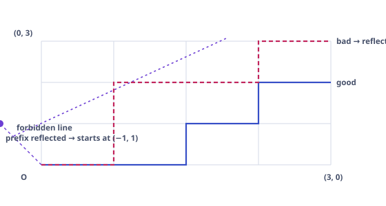

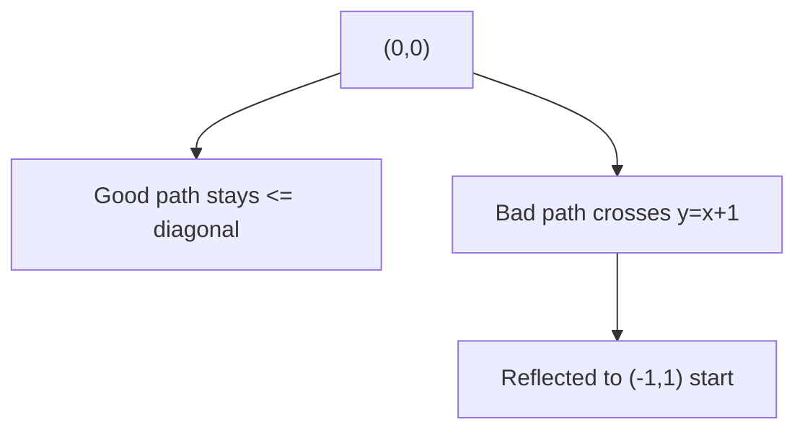

> [!abstract] First Principles — why reflection works (the bijective core)
>
> Take a "bad" path from $(0,0)$ to $(a,b)$ that at some point reaches the line $y = x+1$. Look at the **first** such point. Reflect the portion of the path up to and including that point in the line $y = x+1$ (swap the roles of the two coordinates, shifted by 1). The reflected prefix starts at $(-1, 1)$ and the path continues (unchanged) to $(a,b)$. This is a bijection between "bad paths $(0,0) \to (a,b)$" and "all paths $(-1,1) \to (a,b)$": the inverse is to take any path from $(-1,1)$ to $(a,b)$ — it must cross $y=x+1$ — and reflect its first-crossing prefix back. No choices were made; each bad path corresponds to exactly one shifted path. This "first crossing + reflect" argument is a reusable bijection template (it also proves the cycle lemma, below).

#### The Catalan numbers

Paths from $(0,0)$ to $(n,n)$ that never go strictly above the diagonal $y = x$ ("Dyck paths"): total $\binom{2n}{n}$, minus bad. Bad paths ↔ paths from $(-1,1)$ to $(n,n)$: that's $n+1$ R-steps and $n-1$ U-steps: $\binom{2n}{n-1} = \binom{2n}{n+1}$. Hence

$$C_n = \binom{2n}{n} - \binom{2n}{n+1} = \frac{1}{n+1}\binom{2n}{n}$$

Values: $1, 1, 2, 5, 14, 42, 132, 429, 1430, 4862, 16796$ for $n = 0, 1, \dots, 10$.

#### Why the Catalan number counts so many different things

Every standard Catalan object has the same **decomposition**: *first return to the ground splits the object into an inside and an outside, each a smaller copy of the same type*. Concretely, a Dyck path is $U$ (Dyck path) $D$ (Dyck path): the part between the first up-step and its matching down-step is a Dyck path, and so is the remainder. This gives the convolution recurrence 
$$ C_{n+1} = \sum_{i=0}^{n} C_i C_{n-i}, $$
 which (together with $C_0 = 1$) has the unique solution $C_n = \frac{1}{n+1}\binom{2n}{n}$. The same first-return decomposition appears in: **balanced parentheses** ($\text{expr} = (\text{expr})\,\text{expr}$), **full binary trees** (root's left and right subtrees), **triangulations of a convex $(n+2)$-gon** (the triangle containing side $(1, n+2)$ splits the polygon), **non-crossing perfect matchings** (the arc from 1 splits the circle). One shape, four faces — and recognizing the shape is what solves these problems in seconds at Olympiad level.

#### Ballot theorem (Bertrand) and the (a, b) generalization

$$\#\{\text{paths } (0,0)\to(a,b),\ a\ge b,\ \text{never above } y=x\}
      = \frac{a-b+1}{a+1}\binom{a+b}{b}$$ $$\#\{\text{vote orders, A: }p,\ B:\ q,\ p>q,\ \text{A strictly ahead throughout}\}
      = \frac{p-q}{p+q}\binom{p+q}{q}$$

> [!abstract] First Principles — one reflection argument, two corollaries
>
> **First formula.** Total paths $(0,0)\to(a,b)$: $\binom{a+b}{b}$. "Going above the diagonal" means reaching $y = x+1$; by reflection those are the paths from $(-1,1)$ to $(a,b)$: $a+1$ R-steps, $b-1$ U-steps: $\binom{a+b}{b-1}$. Subtract: $\binom{a+b}{b} - \binom{a+b}{b-1}
>       = \binom{a+b}{b}\left(1 - \frac{b}{a+1}\right)
>       = \frac{a-b+1}{a+1}\binom{a+b}{b}$. Check $a = b = n$: recovers the Catalan number ✓.
>
>
> **Ballot.** "A strictly ahead throughout" = a path from $(0,0)$ to $(p,q)$ (A-vote $=$ R, B-vote $=$ U) whose every prefix has $x > y$. The first step is therefore R, so this is the set of paths $(1,0) \to (p,q)$ that *never touch* $y = x$. Count $=$ total $-$ bad, where bad paths (first touch of $y=x$) reflect into paths $(0,1) \to (p,q)$: 
> $$ \binom{p+q-1}{q} - \binom{p+q-1}{q-1}
>       = \binom{p+q-1}{q}\cdot\frac{p-q}{p}
>       = \frac{p-q}{p+q}\binom{p+q}{q} $$
>  (the two displayed forms are equal since $\binom{p+q}{q} = \frac{p+q}{p}\binom{p+q-1}{q}$; verify: $p=5, q=3$: both give 14). The cycle lemma (§6.6) yields the same count by a *different* bijection (cyclic shifts) — see that section for the contrasting style.

#### **S2**[Olympiad][solved][Catalan · reflection]Count monotone paths from $(0,0)$ to $(4,4)$ that never go above the diagonal.

Count monotone paths from $(0,0)$ to $(4,4)$ that never go above the diagonal.

<details>
<summary>Answer + Reasoning</summary>

Solution

$C_4 = \binom{8}{4} - \binom{8}{5} = 70 - 56 =$ **Answer: 14**

Equivalently $\frac{1}{5}\binom{8}{4}$ — the $\frac{1}{n+1}$ factor is the "one out of $n+1$ cyclic positions stays above the diagonal" shadow of the cycle lemma.

</details>

#### **S3**[Olympiad][solved][ballot]In an election, A receives 5 votes and B receives 3. In how many counting orde…

In an election, A receives 5 votes and B receives 3. In how many counting orders is A **strictly ahead** throughout the count (after every vote that is cast)?

<details>
<summary>Answer + Reasoning</summary>

Solution

Ballot: $\frac{5-3}{5+3}\binom{8}{3} = \frac{2}{8}\cdot 56 =$ **Answer: 14**

</details>

### 6.3 Burnside's lemma & Pólya enumeration

New problem type: count **essentially different** colorings, where "same up to symmetry" (rotation, flip…) is identified. Ch. 2's "divide by $n!$" worked because every orbit had the same size. With identical beads, some colorings are *fixed by* non-trivial symmetries — orbits can have different sizes. Burnside's lemma handles exactly this.

> [!abstract] First Principles — the lemma and its two-line proof
>
> Let a finite group $G$ act on a finite set $X$ of colorings. The **orbits** (symmetry classes) have number 
> $$ \#\text{orbits} \;=\; \frac{1}{|G|} \sum_{g \in G} |\mathrm{Fix}(g)|,
>       \qquad \mathrm{Fix}(g) = \{x \in X : g \cdot x = x\}. $$
>  **Proof (double counting).** Count pairs $(g, x)$ with $g\cdot x = x$. By $g$: $\sum_g |\mathrm{Fix}(g)|$. By $x$: a coloring $x$ is fixed exactly by its stabilizer, of size $|G|/|\text{orbit}(x)|$. So the pair-count $=
>       \sum_x |G|/|\text{orbit}(x)|$. Dividing by $|G|$… this gives $\sum_x \frac{1}{|\text{orbit}(x)|} = \frac{1}{|G|}\sum_g |\mathrm{Fix}(g)|$, and the left side is a sum over orbits of $\frac{|\text{orbit}|}{|\text{orbit}|} = 1$ per orbit — so it equals the number of orbits. $\square$
>
>
> **Why it is true at a deeper level:** averaging the number of fixed points counts each orbit with weight exactly 1, regardless of its size — the orbit of size $|G|/|H|$ contributes $|H|$ to $\sum |\mathrm{Fix}(g)|$ (its $|H|$ stabilizers, each fixing it), which is $|G|$ times its weight $\tfrac{|H|}{|G|}$… the averaging is the unique linear statistic on $\{|\mathrm{Fix}(g)|\}$ that is constant on orbits. (This is the same "weight exactly 1 per object" philosophy as inclusion–exclusion — the two theorems are cousins.)

#### Worked — the full necklace computation

**Problem.** Beads come in $k$ colors. Count distinct **necklaces** (closed rings, rotations identified, flips *not*) of length $n$.

A rotation by $s$ positions has $\gcd(n, s)$ cycles on the $n$ beads, so it fixes $k^{\gcd(n,s)}$ colorings. Grouping rotations by $d = \gcd(n, s)$: there are $\varphi(n/d)$ of them (Euler's totient counts the $s \in \{1,\dots,n\}$ with $\gcd(n,s) = n/d$). Burnside:

$$N(n, k) = \frac{1}{n}\sum_{d \mid n} \varphi(d)\, k^{n/d}$$

**Example: 4 beads, 2 colors.** $N(4,2) = \frac{1}{4}\big(\varphi(1)2^4 + \varphi(2)2^2 + \varphi(4)2^1\big)
    = \frac{1}{4}(16 + 4 + 4) = 6$. List to verify: RRRR, RRRB, RRBB (adjacent pair), RBRB (alternating), RBBB, BBBB — 6 ✓. (This is the rotation-only version of "bead bracelets". Adding the reflections of the square, the full dihedral count is $\frac{1}{8}(24 + 16 + 8) = 6$: the same 6 classes, all flip-stable as classes — but the orbit sizes under the full group are $1, 1, 2, 4, 4, 4$ (they sum to 16): RBRB is flip-symmetric, RRBB is fixed pointwise by a reflection, while RRRB, RBBB form 4-orbits and RRRR, BBBB are fixed by everything. This non-uniformity — some orbits size 1, some size 4 — is exactly what "divide by $|G|$" cannot handle, and what Burnside was built for.)

#### Pólya's enumeration theorem — the cycle index (the general engine)

Burnside with "colors weighted" becomes Pólya. For the rotation group $C_4$ acting on the 4 vertices of a square, the **cycle index** is $Z(C_4) = \frac{1}{4}\left(x_1^4 + x_2^2 + 2x_4\right)$ (identity: four 1-cycles; $180^\circ$: two 2-cycles; $90^\circ, 270^\circ$: one 4-cycle each). The number of $k$-colorings is $Z(k, k, k, k) = \frac{1}{4}(k^4 + k^2 + 2k)$; for $k = 2$: $\frac{16 + 4 + 4}{4} = 6$ ✓ (matches the necklace formula — a square's vertex-coloring class under rotation *is* a length-4 necklace). The power of the cycle index: substitute $k_i \mapsto$ (sum of color weights raised to $i$) to get a **generating function of the colorings by color counts** at once — the full Pólya theorem. For JEE/Olympiad purposes, the necklace/bracelet formulas + Burnside on small groups cover 95% of the needs.

#### **S4**[Olympiad][solved][Burnside]The vertices of a regular hexagon are colored with 2 colors. Count colorings u…

The vertices of a regular hexagon are colored with 2 colors. Count colorings up to the full symmetry group (rotations and reflections, $|G| = 12$).

<details>
<summary>Answer + Reasoning</summary>

Solution

Count $\mathrm{Fix}(g)$ for each $g$ (a coloring is fixed by $g$ iff it is constant on the cycles of $g$: $2^{\#\text{cycles}}$ choices):

| symmetry | count | cycle structure | fixed colorings |
| --- | --- | --- | --- |
| identity | 1 | 1+1+1+1+1+1 | 64 |
| rotation $60^\circ, 300^\circ$ | 2 | one 6-cycle | 2 each |
| rotation $120^\circ, 240^\circ$ | 2 | two 3-cycles | 4 each |
| rotation $180^\circ$ | 1 | three 2-cycles | 8 |
| refl. through opposite vertices | 3 | 2 fixed + two 2-cycles | 16 each |
| refl. through opposite edges | 3 | three 2-cycles | 8 each |

Sum: $64 + 4 + 8 + 8 + 48 + 24 = 156$. Orbits: $156/12 =$ **Answer: 13** (bracelets of 6 beads, 2 colors — verify against the bracelet formula $\frac{1}{2n}\left(\sum_{d|n}\varphi(d)k^{n/d} + \frac{n}{2}(k^{n/2+1} + k^{n/2})\right)
        = \frac{1}{12}(84 + 72) = 13$ ✓ — the rotation sum $\sum_{d|6}\varphi(d)2^{6/d} = 84$.)

</details>

### 6.4 Integer partitions — deeper

#### The generating function and its consequences

A partition of $n$ is a multiset of positive integers summing to $n$: choose how many 1's, how many 2's, … — independently, with total weight $n$. Hence (from §6.1's catalog) 
$$ p(n) = [x^n]\prod_{k=1}^{\infty}\frac{1}{1-x^k}. $$
 Values: $p(0)=1, p(1)=1, p(2)=2, p(3)=3, p(4)=5, p(5)=7, p(6)=11, p(7)=15, p(8)=22,$ $p(9)=30, p(10)=42, p(20)=627$.

> [!abstract] First Principles — Euler's pentagonal number theorem (statement + consequence)
>
> **Euler (1737).** 
> $$ \prod_{k=1}^{\infty}(1 - x^k) = \sum_{j=-\infty}^{\infty} (-1)^j x^{j(3j-1)/2}
>       = 1 - x - x^2 + x^5 + x^7 - x^{12} - x^{15} + \cdots $$
>  (the exponents $1, 2, 5, 7, 12, 15, 22, \dots$ are the *generalized pentagonal numbers* $j(3j\pm1)/2$). This is one of the most beautiful identities in mathematics; its product side is the "one of each part size, with a sign" generating function, and the sparse series on the right is the miracle.
>
>
> **Consequence (the pentagonal recurrence).** Multiply $\prod(1-x^k)$ by $\prod(1-x^k)^{-1} = \sum p(n)x^n$; the left side is 1, so 
> $$ p(n) = p(n-1) + p(n-2) - p(n-5) - p(n-7) + p(n-12) - p(n-15) + \cdots $$
>  (terms with negative argument are 0). **Verify on $p(10)$:** $p(10) = p(9) + p(8) - p(5) - p(3) = 30 + 22 - 7 - 3 = 42$ ✓ — a partition number computed without enumerating a single partition. (This is how partitions were computed for centuries: a recurrence with a *fixed* list of step sizes, no closed form in sight.)

#### Euler: distinct parts = odd parts (the clean GF proof)

> [!abstract] First Principles — a two-line proof of a 275-year-old theorem
>
> GF for partitions into **distinct** parts: $\prod_{k\ge 1}(1 + x^k)$ (each part size used 0 or 1 times). GF into **odd** parts: $\prod_{m\ \mathrm{odd}}\frac{1}{1-x^m}$. Now 
> $$ \prod_{k\ge 1}(1+x^k) = \prod_{k\ge 1}\frac{1-x^{2k}}{1-x^k}
>       = \frac{\prod_{k\ge 1}(1-x^{2k})}{\prod_{k\ge 1}(1-x^k)}
>       = \frac{1}{\prod_{k\ge 1}(1-x^k)} \cdot \prod_{k\ge 1}(1-x^{2k})
>       = \frac{1}{\prod_{m\ \mathrm{odd}}(1-x^m)}, $$
>  because $\prod_k (1-x^k) = \prod_{m\ \mathrm{odd}}(1-x^m)\cdot\prod_k(1-x^{2k})$. The two generating functions are identical, so the counts agree for every $n$. For $n = 10$: distinct-part partitions of 10: $10, 9+1, 8+2, 7+3, 7+2+1, 6+4, 6+3+1,
>       5+4+1, 5+3+2, 4+3+2+1$ → **10**; odd-part partitions: $9+1, 7+3, 7+1+1+1, 5+5, 5+3+1+1, 5+1^5, 3+3+3+1, 3+3+1^4,
>       3+1^7, 1^{10}$ → **10** ✓.

#### Conjugation — the Young diagram bijection

**Fig 6.2 — Conjugation: the partition 5+3+2+1 transposes to 5+4+3+2+1. "At most $k$ parts" mirrors "largest part $\le k$" — a pure bijection, no counting.**

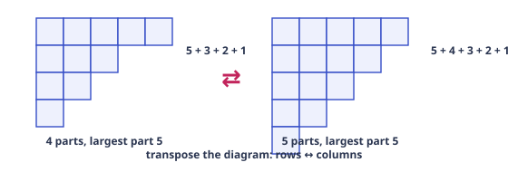

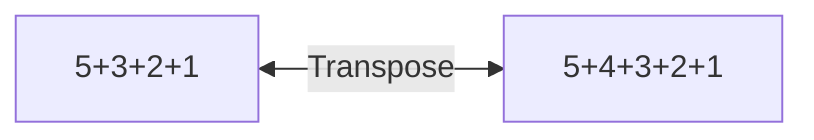

**Theorem.** Partitions of $n$ into **at most $k$ parts** are in bijection with partitions of $n$ with **largest part $\le k$** (transpose the Young diagram). In particular, "exactly $k$ parts" ↔ "largest part exactly $k$" — the *duality* halves the number of cases in any restricted count. Don't confuse partitions with compositions here: the number of *ordered* sums of $n$ into exactly $k$ positive parts is $\binom{n-1}{k-1}$, while partitions into exactly $k$ parts have no closed form (a warning you'll feel the moment you try to guess one).

### 6.5 Stirling numbers, Bell numbers, surjections

**Stirling numbers of the second kind** $S(n,k)$: the number of ways to partition an $n$-element set into $k$ nonempty *unlabeled* blocks. "Unlabeled blocks" is the twist that separates them from ordinary selections.

> [!abstract] First Principles — the recurrence: "where does n go?"
>
> Track the element $n$ in a partition of $[n]$ into $k$ blocks:
>
>
> - **$n$ joins an existing block** of a partition of $[n-1]$ into $k$ blocks: $k$ choices of block → $k\,S(n-1, k)$.
> - **$n$ forms a new singleton block**: partition $[n-1]$ into $k-1$ blocks: $S(n-1, k-1)$.
>
>
> Disjoint and exhaustive: $S(n,k) = k\,S(n-1,k) + S(n-1,k-1)$, $S(n,0) = 0\ (n\ge1), S(0,0) = 1, S(n,n) = 1$.

#### The closed form — inclusion–exclusion again

$$S(n,k) = \frac{1}{k!}\sum_{j=0}^{k}(-1)^{j}\binom{k}{j}(k-j)^{n}
      \qquad\text{so}\qquad k!\,S(n,k) = \sum_{j=0}^{k}(-1)^{j}\binom{k}{j}(k-j)^{n}$$

The right side is the number of **onto functions** $[n]\to[k]$ (Ch. 4, S3) — and onto functions are exactly block-partitions with the blocks *labeled* (block $i$ = fiber of $i$). Unlabeling the $k$ blocks divides by $k!$. *Every formula in this chapter has re-derived IE at least once; this is the fourth appearance.*

| $n\backslash k$ | 1 | 2 | 3 | 4 | 5 | 6 |
| --- | --- | --- | --- | --- | --- | --- |
| 1 | 1 |  |  |  |  |  |
| 2 | 1 | 1 |  |  |  |  |
| 3 | 1 | 3 | 1 |  |  |  |
| 4 | 1 | 7 | 6 | 1 |  |  |
| 5 | 1 | 15 | 25 | 10 | 1 |  |
| 6 | 1 | 31 | 90 | 65 | 15 | 1 |

**Bell numbers** $B_n = \sum_k S(n,k)$: partitions of $[n]$ into any number of blocks: $1, 1, 2, 5, 15, 52, 203, \dots$. (Recurrence $B_{n+1} = \sum_k \binom{n}{k} B_k$: split by the block containing 1.)

#### **S5**[Olympiad][solved][Stirling]Compute $S(6, 3)$ two ways, and count the ways to divide 6 people into 3 unlabeled pairs.

Compute $S(6, 3)$ two ways, and count the ways to divide 6 people into 3 unlabeled pairs.

<details>
<summary>Answer + Reasoning</summary>

Solution

**Recurrence:** $S(6,3) = 3S(5,3) + S(5,2) = 3\cdot 25 + 15 = 90$.

**Closed form:** $\frac{1}{6}(3^6 - 3\cdot 2^6 + 3\cdot 1^6)
        = \frac{729 - 192 + 3}{6} = 90$ ✓.

**Unlabeled pairs:** $\frac{6!}{(2!)^3\, 3!} = \frac{720}{8\cdot 6} =$ **Answer: 15** (Ch. 2's labeling argument: label the pairs to get $6!/(2!)^3$, divide by $3!$ for pair order — exact symmetry since all pairs have size 2 and are distinct objects).

</details>

### 6.6 Gallery of Olympiad lemmas

#### The cycle lemma (Dvoretzky–Motzkin, 1959)

**Statement.** Let $a_1, \dots, a_m \in \{+1, -1\}$ with total sum $p - q > 0$ ($p$ plus-ones, $q$ minus-ones). Then exactly $p - q$ of the $m$ cyclic shifts have *all positive partial sums* (every prefix sum $> 0$).

> [!abstract] First Principles — full proof of the base case $p - q = 1$
>
> Set $s_0 = 0$, $s_k = a_1 + \cdots + a_k$, so $s_m = 1$. Call $j \in \{0, \dots, m-1\}$ the **last minimum** index: $s_j \le s_u$ for all $u \in \{0, \dots, m-1\}$, and $s_u > s_j$ for all $u \in \{j+1, \dots, m-1\}$ (ties broken by taking the *last* occurrence).
>
>
> **Claim: the unique good shift starts at position $j+1$.** (*Good ⇒ starts after the last minimum.* Suppose the shift starting after index $i-1$ is good. Its $m$ window positions cover every residue mod $m$ exactly once, with extended sums $s_{v+m} = s_v + 1$. If some $v \in \{0, \dots, m-1\}$ had $s_v &lt; s_{i-1}$, the window value at residue $v$ would be $s_v$ (if $v \ge i$) or $s_v + 1$ (if $v &lt; i$) — in both cases $&lt; s_{i-1} + 1$, i.e. a partial sum $\le 0$, contradicting goodness. So $s_{i-1}$ is a minimum. If some $u \in \{i, \dots, m-1\}$ had $s_u = s_{i-1}$, the window value at $u$ would give a partial sum $0$ — contradiction. Hence $i-1$ is a minimum with no later tie: the last minimum. $i - 1 = j$. *(Uniqueness of the good shift follows.)*
>
>
> *(Starts after the last minimum ⇒ good.)* For the shift after $j$: for $u \in \{j+1, \dots, m\}$, goodness needs $s_u - s_j \ge 1$. For $u \le m-1$: $s_u > s_j$ (last minimum) and the sums are integer, so $s_u \ge s_j + 1$ ✓; for $u = m$: $s_m = 1 \ge s_j + 1$ since $s_j \le 0$ ✓. For the wrapped part ($t > m - j$): the partial sum is $s_m + s_{t-m} - s_j = 1 + s_{t-m} - s_j \ge 1$ since $s_{t-m} \ge s_j$ (global minimum) ✓. All partial sums $\ge 1$. $\square$
>
>
> **The general case $p - q = S$, rigorously.** Extend periodically ($s_{k+m} = s_k + S$); a shift starting after index $i$ is good $\Leftrightarrow
>       s_i &lt; s_{i+1}, \dots, s_{i+m-1}$ (its $m$ window values). Let $\mu = \min\{s_0, \dots, s_{m-1}\}$ (note $\mu \le 0$, and the minimum is attained in $0, \dots, m-1$). For each level $\ell \in \{\mu, \mu+1, \dots, \mu+S-1\}$, let $j(\ell)$ be the **last index in $\{0, \dots, m\}$ with $s = \ell$.** *(i) Each $j(\ell)$ is good.* For $u \in \{j+1, \dots, m\}$: $s_u \ne \ell$ (lastness) and $s_u &lt; \ell$ is impossible — the walk ends at $s_m = S \ge \ell + 1$ (since $\ell \le \mu + S - 1 \le S - 1$) and a $\pm 1$-walk must pass through $\ell$ on the way back up. So $s_u \ge \ell + 1$. For the wrapped window values $s_{v+m} = s_v + S$ with $v &lt; j$: $s_v + S \ge \mu + S \ge \ell + 1$. *(ii) Two good indices never share a level.* If $i_1 &lt; i_2$ are both good with $s_{i_1} = s_{i_2} = \ell$, then $i_2$ sits in $i_1$'s window at the same level — violating "all window values $&gt; s_{i_1}$". *(iii) Every good index lies at one of these levels.* If $s_i \ge \mu + S$, then the last global-minimum index $r$ ($s_r = \mu$) sits in $i$'s window at value $\mu$ (if $r \ge i$) or $\mu + S \le s_i$ (if $r &lt; i$) — either way $\le s_i$, contradicting goodness. Hence $|G| \ge S$ (from (i), $S$ distinct levels) and $|G| \le S$ (from (ii)–(iii)): $\boxed{|G| = S}$. $\square$
>
>
> Consequence for ballot problems: of the $\binom{p+q}{q}$ vote orders (A = +1), cyclic orbits have size $p+q$ and contain exactly $p-q$ good shifts — matching the reflection count $\frac{p-q}{p+q}\binom{p+q}{q}$ of §6.2 by a *different* bijection. (In this course the reflection principle is the workhorse; reach for the cycle lemma when the problem is phrased cyclically — e.g. seating problems around a table with a running-tally condition.)

#### Sperner's theorem (via the LYM inequality)

**Statement.** Let $\mathcal{F}$ be an **antichain** of subsets of $[n]$ (no member contains another). Then $|\mathcal{F}| \le \binom{n}{\lfloor n/2\rfloor}$ — the middle layer alone is the largest antichain.

> [!abstract] First Principles — the LYM proof (a 5-line gem)
>
> Take a **uniformly random permutation** $\pi$ of $[n]$, and look at its initial segments $\emptyset, \pi_1, \pi_1\pi_2, \dots, [n]$ — a random *saturated chain* through the subset lattice. Any antichain $\mathcal{F}$ meets this chain in **at most one** set (chain = totally ordered by inclusion; antichain = no two comparable). The probability the chain passes through a fixed $k$-set $A$ is $\frac{1}{\binom{n}{k}}$ (the chain visits exactly one set of each size $k$, uniformly). So 
> $$ 1 \ \ge\ \Pr[\text{chain hits } \mathcal{F}]
>       \ =\ \sum_{A\in\mathcal{F}} \frac{1}{\binom{n}{|A|}}
>       \ \ge\ \sum_{A\in\mathcal{F}} \frac{1}{\binom{n}{\lfloor n/2\rfloor}}
>       \ =\ \frac{|\mathcal{F}|}{\binom{n}{\lfloor n/2\rfloor}}, $$
>  since the middle binomial is the largest. Rearranged: $|\mathcal{F}| \le \binom{n}{\lfloor n/2\rfloor}$. $\square$ **Technique to steal:** "random maximal chain + at most one hit" — the LYM inequality is the template; it proves the same theorem for any graded poset with the same "chain probability" computation.

#### Erdős–Szekeres (the "up or down" theorem)

**Statement.** Every sequence of $(r-1)(s-1) + 1$ *distinct* real numbers contains an increasing subsequence of length $r$ or a decreasing one of length $s$. (In particular: $n^2 + 1$ distinct reals contain a monotone subsequence of length $n+1$.)

> [!abstract] First Principles — the pair labeling + pigeonhole proof
>
> To each term $a_i$, attach the pair $(I_i, D_i)$ where $I_i$ = length of the longest *increasing* subsequence **starting at $a_i$**, $D_i$ = same for decreasing. **Key claim:** no two terms have the same pair: if $i &lt; j$ and $(I_i, D_i) = (I_j, D_j)$, then $a_i &lt; a_j$ lets the increasing subsequence at $j$ be prefixed by $a_i$ (so $I_i \ge I_j + 1$, contradiction); and $a_i &gt; a_j$ gives the contradiction for $D_i$. So the $(r-1)(s-1)+1$ pairs are distinct. But if every $I_i \le r-1$ and every $D_i \le s-1$, there are at most $(r-1)(s-1)$ possible pairs — a pigeonhole contradiction. Hence some $I_i \ge r$ or some $D_i \ge s$. $\square$
>
>
> The *pattern* is the lesson: **label each object by two "future length" numbers, prove labels are distinct, pigeonhole the label space.** This is the most-copied proof template of Olympiad combinatorics.

> [!example] Teaser — the probabilistic method (Erdős)
>
> A *lower bound* can sometimes be proved by showing a random object usually has the desired property. For $R(3,3)$ the lower bound is *explicit*, not probabilistic: color the edges of the 5-cycle red and its diagonals blue (paper Q24) — each color class is a 5-cycle, which contains no triangle, so $R(3,3) > 5$. The probabilistic method (Erdős, 1947) enters for larger parameters: color the edges of $K_n$ red/blue at random. A given $k$-clique is monochromatic with probability $2 \cdot 2^{-\binom{k}{2}}
>       = 2^{1-\binom{k}{2}}$, so the expected number of monochromatic $k$-cliques is $\binom{n}{k}\, 2^{1-\binom{k}{2}}$. If this expectation is $&lt; 1$, *some* coloring has none at all — hence $R(k,k) &gt; n$. For instance, $k = 4, n = 6$: $\binom{6}{4}/2^{5} = 15/32 &lt; 1$, so $R(4,4) \ge 7$ — existence with no construction. (For $k = 3$ the bound only reaches $n = 3$, which is why $R(3,3)$ is better handled explicitly.) Expectation $&lt; 1$ ⇒ existence is the seed of an entire field.

### 6.7 Practice set

#### **P1**[Olympiad][practice][Catalan]In how many ways can 5 factors be fully parenthesized? How many triangulations…

In how many ways can 5 factors be fully parenthesized? How many triangulations of a convex heptagon?

<details>
<summary>Answer + Reasoning</summary>

**Parenthesizing $n+1$ factors $= C_n$** (calibrate: 2 factors $\to$ 1 way $= C_1$; 3 factors $\to$ 2 ways $= C_2$). So 5 factors $\to C_4 = \frac{1}{5}\binom{8}{4}
        =$ **14**.

**Triangulations of a convex $(n+2)$-gon $= C_n$** (first-return decomposition on the triangle containing side $(1, n+2)$, §6.2). A heptagon has $7 = n+2$ sides, so $n = 5$: $C_5 = \frac{1}{6}\binom{10}{5} =$ **42**.

Same sequence, different $n$ — the index convention ($n+1$ vs $n+2$) is the classic trap in Catalan problems.

</details>

#### **P2**[Olympiad][practice][ballot]A: 7 votes, B: 3 votes. Orders where A is strictly ahead throughout.

A: 7 votes, B: 3 votes. Orders where A is strictly ahead throughout.

<details>
<summary>Answer + Reasoning</summary>

$\frac{7-3}{7+3}\binom{10}{3} = \frac{4}{10}\cdot 120 =$ **48**.

</details>

#### **P3**[Olympiad][practice][Dvoretzky–Motzkin]Monotone paths from $(0,0)$ to $(5,3)$ that never go above the diagonal $y = x$.

Monotone paths from $(0,0)$ to $(5,3)$ that never go above the diagonal $y = x$.

<details>
<summary>Answer + Reasoning</summary>

$\frac{5-3+1}{5+1}\binom{8}{3} = \frac{3}{6}\cdot 56 =$ **28**.

</details>

#### **P4**[Olympiad][practice][Burnside · necklaces]Necklaces of 6 beads from 3 colors, rotations identified.

Necklaces of 6 beads from 3 colors, rotations identified.

<details>
<summary>Answer + Reasoning</summary>

$\frac{1}{6}\left(\varphi(1)3^6 + \varphi(2)3^3 + \varphi(3)3^2 + \varphi(6)3^1\right)
        = \frac{1}{6}(729 + 27 + 2\cdot 9 + 2\cdot 3) = \frac{780}{6} =$ **130**.

</details>

#### **P5**[Olympiad][practice][partitions]Compute $p(7)$ by direct enumeration, and verify the pentagonal recurrence…

Compute $p(7)$ by direct enumeration, and verify the pentagonal recurrence $p(7) = p(6) + p(5) - p(2) - p(0)$.

<details>
<summary>Answer + Reasoning</summary>

Partitions of 7: 7; 6+1; 5+2; 5+1+1; 4+3; 4+2+1; 4+1+1+1; 3+3+1; 3+2+2; 3+2+1+1; 3+1+1+1+1; 2+2+2+1; 2+2+1+1+1; 2+1+1+1+1+1; 1⁷ → **15**. Recurrence: $11 + 7 - 2 - 1 = 15$ ✓ (step sizes 1, 2, 5, 7; the 5-term is $-p(2)$, the 7-term is $-p(0)$.)

</details>

#### **P6**[Olympiad][practice][Stirling]Compute $S(5, 2)$ by the recurrence and by the closed form.

Compute $S(5, 2)$ by the recurrence and by the closed form.

<details>
<summary>Answer + Reasoning</summary>

Recurrence: $S(5,2) = 2S(4,2) + S(4,1) = 2\cdot 7 + 1 = 15$. Closed form: $\frac{1}{2}(2^5 - 2\cdot 1^5) = \frac{30}{2} = 15$ ✓. (Meaning: 5 people into 2 unlabeled nonempty groups: total splits $2^5 - 2 = 30$, divide by 2! for group order: 15.)

</details>

#### **P7**[Olympiad][practice][Sperner]What is the largest number of subsets of $\{1,\dots,6\}$ such that no chosen set contains…

What is the largest number of subsets of $\{1,\dots,6\}$ such that no chosen set contains another?

<details>
<summary>Answer + Reasoning</summary>

By Sperner (S8 of this chapter): $\binom{6}{3} =$ **20**, achieved by the middle layer (all 3-subsets).

</details>

#### **P8**[Olympiad][practice][GF]Show that the number of compositions of $n$ into parts from $\{1,2,3\}$ satisfies…

Show that the number of compositions of $n$ into parts from $\{1,2,3\}$ satisfies $a_n = a_{n-1} + a_{n-2} + a_{n-3}$, and find $a_6$.

<details>
<summary>Answer + Reasoning</summary>

GF: $\frac{1}{1 - (x + x^2 + x^3)}$ → $(1 - x - x^2 - x^3)A(x) = 1$ → the stated recurrence with $a_0 = 1$: $a_1 = 1, a_2 = 2, a_3 = 4, a_4 = 7, a_5 = 13,
        a_6 =$ **24**.

</details>

---

---

# Appendix — Well-Ordered Theory Reference

> **Philosophy**: Everything is `construct` (product), `split` (sum), or `match up` (bijection). Every formula derived, never memorized.

---

## 1. Counting Basics

### 1.1 What does counting mean?

Finite set $S$, $|S|$ = number of elements. Counting = finding $|S|$ without listing all.

**Small-case habit**: For $n=3$, list all $2^3=8$ subsets explicitly, verify.

### 1.2 Product Rule

**Statement**: $k$ successive steps, step $i$ has $n_i$ choices regardless of earlier choices → total $n_1\cdots n_k$.

**Proof** (induction): Fix first choice $c_1$, remaining $k-1$ steps $n_2\cdots n_k$ ways. $n_1$ disjoint families → total $n_1(n_2\cdots n_k)$. Partition by first coordinate.

**Diagram**:

*Leaves = $3×2=6$ — product rule is counting leaves in choice tree. Works iff each branch at level $i$ has same $n_i$ children.*


> [!warning] Trap**: "3 choices then 3 choices" ≠ 9 if different paths land on same object (overcounting). Example: choosing 2 people from 5: $5×4=20$ counts ordered pairs, not unordered. Fix: canonical order (smaller first) or divide by symmetry $2!$.

> [!tip] Rule of roles**: Labeled roles make paths distinct. Unordered → impose canonical order or divide by symmetry, check exact symmetry.

**JEE Main Example**: 4-digit numbers with distinct digits divisible by 5.

- Last digit $0$ or $5$. Casework:
  - Ends with $0$: first digit $9$ choices (1-9), middle $8×7$ → $9×8×7×1=504$
  - Ends with $5$: first digit $8$ choices (1-9 except 5), middle $8×7$ → $8×8×7=448$
- Total $504+448=952$.

### 1.3 Sum Rule

**Statement**: If $S = A_1 \sqcup \cdots \sqcup A_k$ disjoint exhaustive, $|S| = \sum |A_i|$.

**Check**: Exhaustive? Disjoint? Verify small-case.

**JEE Main**: Committee 5 from 12 men 8 women with at least 2 women: $\sum_{w=2}^5 \binom{8}{w}\binom{12}{5-w}$.

### 1.4 Complement Principle

$|\bar A| = |U|-|A|$. "At least one" → $1$ minus "none".

**JEE Adv**: Strings length 4 over alphabet size 26 containing at least one vowel (5 vowels): total $26^4$ minus no vowel $21^4$.

### 1.5 Bijections & Involutions — Olympiad Weapon

**Bijection**: $|A|=|B|$ if $\exists$ bijection $f:A\to B$.

**Involution**: $f(f(x))=x$, pairs up elements, proves even/odd equal.

**Worked**: Half subsets have even size.

- Toggle element $1$: $S \mapsto S \Delta \{1\}$ (symmetric difference). Pairs even ↔ odd, involution without fixed points → equal halves $2^{n-1}$.

**Worked**: Even and odd permutations equally many.

- Multiply by transposition $(12)$: bijection between even and odd.

**JEE Adv**: Functions $f:[n]\to[n]$ with $f(f(x))=x$ (involutions): count.

### 1.6 Double Counting — Proof Machine

Count same set two ways.

**Sum of integers**: $\sum_{k=1}^n k = \binom{n+1}{2}$ — pairs $(i,j)$ with $i<j$.

**$\sum k\binom{n}{k}=n2^{n-1}$**: Committee with chair: choose chair first $n$, other members $2^{n-1}$ (in/out) vs group by size $k$.

### 1.7 Mistake Checklist

- Labeled vs unlabeled (order matters?)
- Independence (does $n_i$ depend on earlier choices?)
- Exhaustive & disjoint (sum rule)
- Symmetry exact? No fixed points?
- Small-case verification $n=3,4$

---

## 2. Permutations — Order Matters

### 2.1 $^nP_r$, Factorial

$^nP_r = n(n-1)\cdots(n-r+1) = \frac{n!}{(n-r)!}$.

$0! = 1$ — empty product, empty bijection.

### 2.2 Identical Objects

$\frac{n!}{n_1!n_2!\cdots}$ — overcounting argument: $n!$ permutations of distinct, divide by $n_1!$ rearrangements of identical type 1, etc.

**Example**: MISSISSIPPI: $11!/(4!4!2!)$.

### 2.3 Circular Permutations

```mermaid
flowchart LR
    A[ABC] -- rotate --> B[BCA]
    B -- rotate --> C[CAB]
    A -.-> D[(n-1)! circular]
```
Linear $n!$, $n$ rotations same necklace → $(n-1)!$. Bracelet (flip allowed) → $(n-1)!/2$.


### 2.4 Bundle & Gap Methods

**Together**: Bundle as block, $(n-k+1)!k!$ (block + internal).

**No two adjacent**: Arrange others, gaps. $n$ people, $r$ cannot be adjacent: $(n-r+1)P_r \times (n-r)!$ or $\binom{n-r+1}{r}r!(n-r)!$.

**Fixed relative order**: $\frac{n!}{k!}$ — $k!$ orders equally likely, one desired.

### 2.5 Derangements — Olympiad

$D_n$ = permutations with no fixed point.

**IE**: $D_n = n!\sum_{k=0}^n (-1)^k/k!$.

**Recurrence**: $D_n = (n-1)(D_{n-1}+D_{n-2})$, $D_1=0,D_2=1$.

**Nearest integer**: $D_n = \left\lfloor \frac{n!}{e} + \frac12 \right\rfloor$.

**Rencontres**: Exactly $k$ fixed points: $\binom{n}{k}D_{n-k}$.

---

## 3. Combinations — Order Irrelevant

### 3.1 $\binom{n}{r}$

$\binom{n}{r} = \frac{n!}{r!(n-r)!}$ — choose $r$ from $n$.

**Symmetry**: $\binom{n}{r}=\binom{n}{n-r}$ via complementation bijection.

**Pascal**: $\binom{n}{r}=\binom{n-1}{r}+\binom{n-1}{r-1}$ — condition on membership of element $n$.

### 3.2 Restricted Selections

Must include: $\binom{n-1}{r-1}$, must exclude: $\binom{n-1}{r}$.

### 3.3 Hockey-Stick

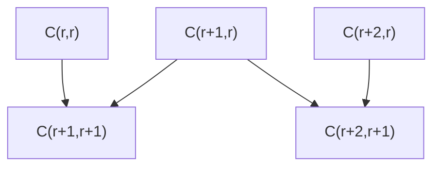
$\sum_{i=r}^n \binom{i}{r} = \binom{n+1}{r+1}$ — telescope Pascal.

### 3.4 Stars and Bars

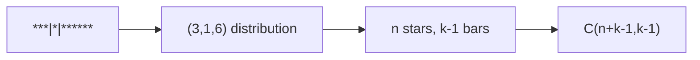

- Non-negative: $\binom{n+k-1}{k-1}$
- Positive: $\binom{n-1}{k-1}$
- Compositions of $n$: $2^{n-1}$ (bars in/out)
- Multisets: $\binom{n+k-1}{k}$

### 3.5 Multinomial

$\frac{n!}{n_1!\cdots n_k!}$ — distribute $n$ distinct balls into $k$ distinct boxes with $n_i$ each.

$(a+b+c)^n$ distinct terms after collecting: $\binom{n+2}{2}$.

### 3.6 Partitions — Olympiad

$p(n)$ = partitions of $n$, no closed form.

GF: $\prod_{k\ge1}\frac{1}{1-x^k} = \sum p(n)x^n$.

Euler: distinct parts = odd parts (bijection via binary).

Young diagram conjugation involution:
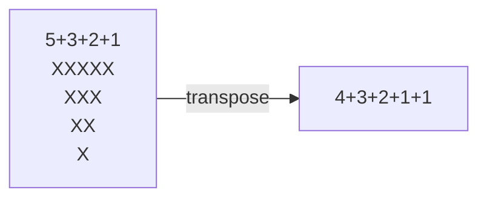


---

## 4. Binomial Coefficients & Identities

### 4.1 Binomial Theorem via Counting

$(x+y)^n = \sum_{k=0}^n \binom{n}{k}x^{n-k}y^k$ — pick $k$ brackets for $y$.

$(1+1)^n=2^n$, $(1-1)^n=0$ → even/odd split $2^{n-1}$.

### 4.2 Double Counting Toolkit

- $k\binom{n}{k}=n\binom{n-1}{k-1}$ — committee with chair
- $\sum k\binom{n}{k}=n2^{n-1}$
- Vandermonde: $\sum \binom{r}{k}\binom{s}{n-k}=\binom{r+s}{n}$ — choose $n$ from $r+s$ split
- $\sum \binom{n}{k}^2 = \binom{2n}{n}$

### 4.3 Negative Binomial

$(1-x)^{-k} = \sum_{n\ge0}\binom{n+k-1}{k-1}x^n$ — stars and bars GF.

$(1+x)^{-n} = \sum (-1)^k\binom{n+k-1}{k}x^k$.

### 4.4 Bounded Extraction

Coefficient with upper bounds via IE: e.g., solutions to $x_1+x_2+x_3=10$, $0\le x_i\le4$ → $\binom{12}{2} - \binom{3}{1}\binom{7}{2} + \cdots$.

---

## 5. Advanced Methods

### 5.1 Inclusion-Exclusion

$|\cup A_i| = \sum|A_i| - \sum|A_i\cap A_j| + \cdots + (-1)^{n+1}|A_1\cap\cdots\cap A_n|$.

**Derangements**: $D_n = n! - \binom{n}{1}(n-1)! + \binom{n}{2}(n-2)! - \cdots$.

**Rook**: Board with forbidden positions.

### 5.2 Pigeonhole

Dirichlet: $n$ items into $k$ boxes → some box $\ge \lceil n/k \rceil$.

- $W(2,3)=9$ van der Waerden, $R(3,3)=6$ Ramsey, Erdős–Szekeres $(r-1)(s-1)+1$ monotone subsequence.

### 5.3 Recurrence Counting

Tilings: $2×n$ domino tilings = Fibonacci $F_{n+1}$.

Fibonacci in Pascal: sum of shallow diagonals.

### 5.4 Probabilistic Method (Intro)

$\mathbb{E}[X] < 1 \Rightarrow \exists$ outcome with $X=0$ — existence proof without construction.

---

## 6. Olympiad Theory — Frontier

### 6.1 Generating Functions

OGF $A(x)=\sum a_n x^n$.

- $A(x)B(x)$ = independent stages convolution
- $\frac{1}{1-B(x)}$ = sequence of $B$-structures
- Catalog: $(1-x)^{-k}$, $(1+x)^n$, Fibonacci $\frac{x}{1-x-x^2}$

### 6.2 Lattice Paths & Catalan

Monotone paths $(0,0)\to(a,b)$: $\binom{a+b}{b}$.

**Reflection principle**: Bad paths crossing $y=x+1$ biject to paths from $(-1,1)$ → count $\binom{2n}{n-1}$.

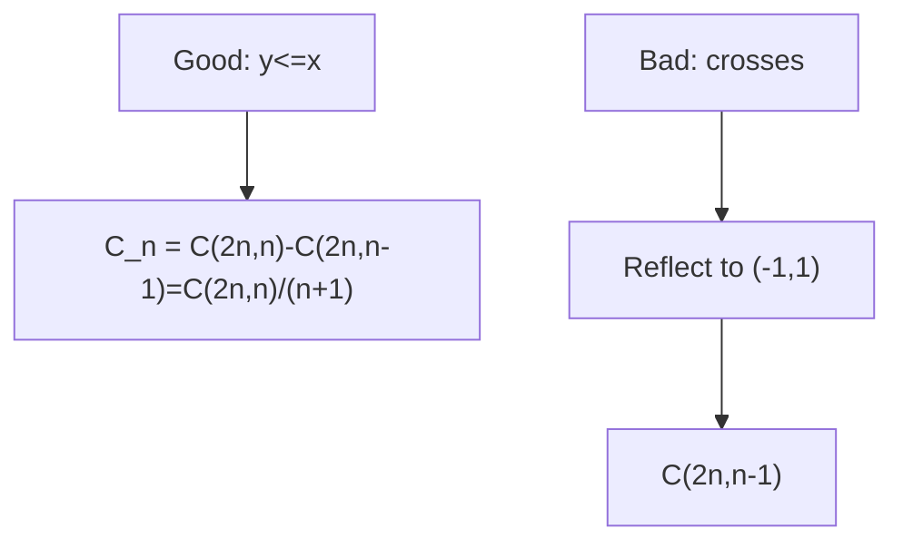


Catalan: Dyck paths, triangulations, non-crossing partitions, binary trees, etc. $C_n = \frac{1}{n+1}\binom{2n}{n}$.

Ballot: $\frac{p-q}{p+q}\binom{p+q}{q}$ — A always ahead.

### 6.3 Burnside & Pólya

Group $G$ acts on colorings, orbits = distinct up to symmetry.

Burnside: $\text{Orbits} = \frac{1}{|G|}\sum_{g\in G} |\text{Fix}(g)|$.

- Necklaces: $N(n,k)=\frac{1}{n}\sum_{d|n}\varphi(d)k^{n/d}$
- Bracelets: include reflections
- Cube: 24 rotations, 2 colors → 23 colorings (10 with 3 colors? etc.)

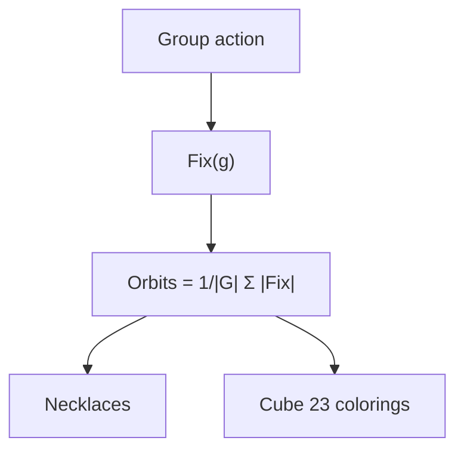

### 6.4 Partitions & Euler

GF $\prod \frac{1}{1-x^k} = \sum p(n)x^n$.

Pentagonal: $\prod (1-x^k)=\sum_{j\in\mathbb Z} (-1)^j x^{j(3j-1)/2}$.

Recurrence: $p(n)=p(n-1)+p(n-2)-p(n-5)-p(n-7)+p(n-12)+\cdots$.

### 6.5 Stirling & Bell

$S(n,k)$ = partitions of $n$ distinct objects into $k$ non-empty unlabeled subsets.

- Recurrence: $S(n,k)=kS(n-1,k)+S(n-1,k-1)$, $S(n,0)=0$, $S(n,n)=1$
- IE: $S(n,k)=\frac{1}{k!}\sum_{j=0}^k (-1)^j\binom{k}{j}(k-j)^n$
- Onto: $k!S(n,k)$ onto functions
- Bell: $B_n=\sum_k S(n,k)$

### 6.6 Olympiad Lemmas

- **Cycle lemma** (Dvoretzky–Motzkin): $k$ cyclic shifts, $k$ have property
- **Sperner via LYM**: Random chain, $\sum \binom{n}{|A|}^{-1} \le 1$, max antichain $\binom{n}{\lfloor n/2\rfloor}$
- **Erdős–Szekeres**: $(r-1)(s-1)+1$ sequence has increasing length $r$ or decreasing $s$
- **Probabilistic method**: $\mathbb{E}<1$ → existence

---

## Paper — 40 Questions A–G + Stretch

Attempt after Chapter 6, 4–5 hours, without solutions. Full solutions in `olympiad-paper-solutions.md`.

---

*Well-ordered from first principles, every formula derived, every answer verified at $n=3,4$ — the core of JEE Advanced & Olympiad preparation.*
