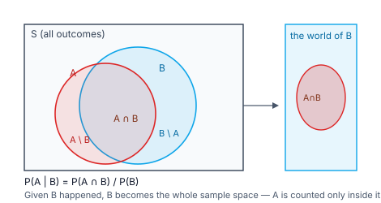
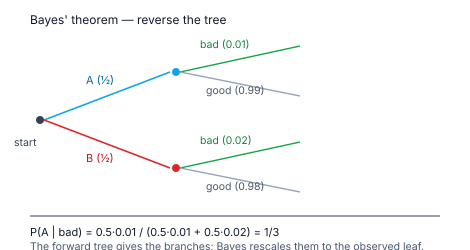

> [!info] Navigation
> 📖 [[Home|Vault home]] · 📝 [[Probability — Paper|Olympiad Paper]] · ✅ [[Probability — Solutions|Solutions]]

# Probability

Probability is the mathematics of **partial information**. A dice roll has six
outcomes, but before you look you do not know which one occurred — probability
assigns each a number between $0$ and $1$ that measures how much the evidence
supports it.

The subject is built from very few moves. Count outcomes (Chapter 1), avoid
double-counting overlaps (Chapter 2), shrink the sample space to what you have
learned (Chapter 3), and run that reasoning backwards from an observation to a
cause (Chapter 4). Chapters 5 and 6 turn the theory into a toolbox: random
variables, expectation, and the binomial and geometric distributions — then the
Olympiad frontier, where probability becomes an *averaging* discipline:
geometric probability, memorylessness, and games whose answers are obtained by
writing a recursion rather than by counting.

The single most important habit in probability is the one most often skipped:
**write down the sample space before doing anything else.** Nearly every error
in this module traces back to an unstated or wrongly assumed sample space.

`6 chapters` `worked examples (S) + practice (P)` `SVG + Mermaid diagrams` `34-question Olympiad paper + full solutions`

### ★ How to use these notes

**Read in order.** Chapter 1 defines probability; Chapter 2 is the arithmetic of
events (the addition rule and its partner, the complement); Chapter 3 is
conditioning and independence; Chapter 4 is Bayes' theorem; Chapter 5 introduces
random variables and the two distributions that carry most of the weight;
Chapter 6 is the Olympiad frontier.

- **Callouts** — `[!abstract]` First Principles = the derivation; `[!tip]` Key
  Idea = the takeaway; `[!warning]` Common Trap = the classic mistake;
  `[!example]` Olympiad Extension = the frontier version.
- **Numeric habit** — every numeric answer in this module was verified in pure
  Python (exact fractions and simulation) before it was written, and each is
  accompanied by a check.

### ▣ The roadmap

| Ch | Title | Level |
|---|---|---|
| 1 | Sample spaces & classical probability | foundations |
| 2 | Addition rule, complements & counting | foundations |
| 3 | Conditional probability & independence | core |
| 4 | Total probability & Bayes' theorem | core |
| 5 | Random variables & the binomial distribution | machinery |
| 6 | Olympiad frontier: geometry, memory, games | synthesis |

**Fig 1.1 — conditioning shrinks the world.** The full sample space $S$ holds
everything that *could* happen. Learning that $B$ occurred discards all of
$S\setminus B$, so $B$ becomes the new sample space and
$P(A\mid B)$ measures $A$ *inside* it.

**Fig 1.2 — Bayes' theorem runs the tree backwards.** The forward branches give
the probability of each cause *and* the resulting observation. Once you observe
the leaf, Bayes rescales those branches so they sum to $1$ — that is the
posterior probability of each cause.

---

# Chapter 1 — Sample Spaces & Classical Probability

*Foundations · what "likely" means when nothing has happened yet*

## 1.1 Experiments, outcomes and events

An **experiment** is any process with an uncertain result. Its **sample space**
$S$ is the set of all possible **outcomes**. An **event** is a subset of $S$.

Two sample spaces can describe the same experiment, and the choice matters:

- Two dice as *ordered* pairs: $\lvert S\rvert = 36$.
- Two dice as *unordered* pairs: $\lvert S\rvert = 21$, but the outcomes are
  **not** equally likely — $(1,2)$ arises two ways, $(1,1)$ only one.

> [!warning] Common Trap — unequal outcomes
> The formula $P(E)=\frac{\lvert E\rvert}{\lvert S\rvert}$ is valid **only** when
> the outcomes of $S$ are equally likely. With unordered dice pairs,
> $\frac{\lvert\text{sum is }7\rvert}{\lvert S\rvert}=\frac{3}{21}\ne\frac16$ —
> wrong, because the 21 outcomes are not symmetric. Always choose a sample
> space of equally likely outcomes.

**Event language.** $A\cup B$ is "A or B (or both)", $A\cap B$ is "A and B",
$A^{\rm c}=S\setminus A$ is "not A", and $A\setminus B$ is "A but not B".

## 1.2 The axioms

> [!abstract] First Principles — Kolmogorov's three axioms
> A probability measure $P$ on a sample space $S$ assigns a number in $[0,1]$
> to every event and satisfies:
>
> 1. $P(S)=1$ — something certainly happens.
> 2. $P(A)\ge 0$ — probabilities are never negative.
> 3. If $A$ and $B$ are **disjoint** ($A\cap B=\varnothing$) then
>    $P(A\cup B)=P(A)+P(B)$.
>
> Everything else — the addition rule, complements, conditioning — is derived
> from these three lines.

**Consequences worth memorising:**

| Rule | Statement |
|---|---|
| Complement | $P(A^{\rm c})=1-P(A)$ |
| Empty event | $P(\varnothing)=0$ |
| Bounds | $0\le P(A)\le 1$ |
| Monotonicity | $A\subseteq B\Rightarrow P(A)\le P(B)$ |

> [!tip] Key Idea — the complement trick
> "At least one head" over $n$ tosses has $2^n-1$ favourable outcomes, but its
> complement "no heads" has exactly **one**. Always compute whichever side of the
> complement is smaller:
> $$P(\text{at least one})=1-P(\text{none}).$$

#### **S1**[JEE Main][solved][sample space]Two fair dice are thrown. Find the probability that the sum is $7$.

The sample space has $36$ equally likely ordered pairs. The pairs summing to $7$
are $(1,6),(2,5),(3,4),(4,3),(5,2),(6,1)$ — six of them.

Answer + Reasoning

**Method: count favourable / count total.** $P=\frac6{36}=\frac16$.
Check by listing the distribution of the sum: the mode sum is $7$ with $6$ of
the $36$ outcomes, exactly one sixth of the space ✓.

**Answer:** $\dfrac16$.

#### **S2**[JEE Main][solved][complement]Three fair coins are tossed. Find the probability of at least one head.

There are $2^3=8$ equally likely outcomes; only $TTT$ has no head.

Answer + Reasoning

**Method: use the complement.** $P(\text{at least one head})=1-P(TTT)=1-\frac18=\frac78$.
Check by counting directly: the outcomes with at least one head number $7$ of
$8$ ✓.

**Answer:** $\dfrac78$.

#### **P1**[JEE Main][practice][sample space]A bag contains $5$ red, $3$ blue and $2$ green balls. One ball is drawn at random. Find the probability that it is red.

Answer + Reasoning

**Method: $\frac{\text{favourable}}{\text{total}}$.** The sample space has $10$
equally likely balls, $5$ of them red.

**Answer:** $\dfrac12$.

---

# Chapter 2 — Addition Rule, Complements & Counting

*Foundations · adding probabilities without double-counting*

## 2.1 The addition rule

> [!abstract] First Principles — why subtract the intersection
> Split $A\cup B$ into the part in $B$ only and the part in $A$:
> $A\cup B=(A\setminus B)\cup B$, and these are disjoint, so
> $P(A\cup B)=P(A\setminus B)+P(B)$. But $P(A)=P(A\setminus B)+P(A\cap B)$
> (again a disjoint split). Eliminating $P(A\setminus B)$:
> $$P(A\cup B)=P(A)+P(B)-P(A\cap B).$$

The subtraction is exactly the double-counting correction: the overlap
$A\cap B$ was counted once inside $P(A)$ and once inside $P(B)$.

**Mutually exclusive** events satisfy $A\cap B=\varnothing$, and then the
addition rule reduces to $P(A\cup B)=P(A)+P(B)$.

> [!warning] Common Trap — exclusive ≠ independent
> Mutually exclusive events with positive probability are **dependent**: if one
> occurs the other cannot. Independence is a different notion entirely
> (Chapter 3). Students routinely confuse the two.

## 2.2 Counting: permutations and combinations

- **Permutations** (order matters): ${}^nP_r=\dfrac{n!}{(n-r)!}$.
- **Combinations** (order irrelevant): ${}^nC_r=\binom nr=\dfrac{n!}{r!(n-r)!}$.
- Fundamental principle: $n_1\times n_2\times\cdots$ for a sequence of choices.

Useful identities: $\binom nr=\binom n{n-r}$, $\binom n0=\binom nn=1$, and
$\sum_{r=0}^n\binom nr=2^n$ (which is just the number of subsets of an
$n$-element set).

> [!tip] Key Idea — decide order first
> Before counting, ask: *would swapping two choices produce the same
> outcome?* If yes use combinations; if no use permutations. Drawing two aces
> from a deck is a combination problem; arranging a batting order is a
> permutation problem.

## 2.3 Worked counting

#### **S3**[JEE Main][solved][addition]Given $P(A)=0.4$, $P(B)=0.5$ and $P(A\cap B)=0.2$, find $P(A\cup B)$.

Answer + Reasoning

**Method: the addition rule.** $0.4+0.5-0.2=0.7$.
Check by a Venn count: $A$ only $=0.4-0.2=0.2$, $B$ only $=0.5-0.2=0.3$, both
$=0.2$, neither $=1-0.7=0.3$. The four regions sum to $1$ ✓.

**Answer:** $0.7$.

#### **S4**[JEE Main][solved][cards]A card is drawn from a standard $52$-card deck. Find the probability that it is a heart or a king.

There are $13$ hearts and $4$ kings, and the king of hearts is counted in both.

Answer + Reasoning

**Method: addition rule with the overlap subtracted.**
$P=\frac{13+4-1}{52}=\frac{16}{52}=\frac4{13}$.
Check by direct count: the favourable cards are $13$ hearts plus the $3$ kings
that are not hearts, so $16$ of $52$ ✓.

**Answer:** $\dfrac4{13}$.

#### **P2**[JEE Main][practice][counting]A committee of $3$ is chosen from $5$ men and $4$ women. Find the probability that it contains at least one woman.

Answer + Reasoning

**Method: complement — subtract the all-men committee.**
$P=1-\dfrac{\binom53}{\binom93}=1-\dfrac{10}{84}=\dfrac{74}{84}=\dfrac{37}{42}$.
Check by direct count: $\binom41\binom52+\binom42\binom51+\binom43\binom50=40+30+4=74$, and $\binom93=84$ ✓.

**Answer:** $\dfrac{37}{42}$.

---

# Chapter 3 — Conditional Probability & Independence

*Core · what changes when you learn something*

## 3.1 Definition

> [!abstract] First Principles — conditioning on equally likely outcomes
> If all outcomes of $S$ are equally likely and we learn that $B$ occurred, the
> sample space shrinks to $B$. The favourable outcomes for $A$ are now just
> $A\cap B$, so
> $$P(A\mid B)=\frac{\lvert A\cap B\rvert}{\lvert B\rvert}
> =\frac{P(A\cap B)}{P(B)},\qquad P(B)>0.$$
> This is the **definition**; it is not derived, but it is the unique definition
> consistent with "count equally likely outcomes inside $B$".

The order matters: $P(A\mid B)$ and $P(B\mid A)$ are generally different
numbers, and confusing them is the single most common error in the subject.

## 3.2 The multiplication rule

Rearranging the definition:
$$P(A\cap B)=P(A\mid B)\,P(B)=P(B\mid A)\,P(A).$$

This is the natural rule for **sequences** of events ("draw this, then that"),
and it is the engine behind Bayes' theorem.

## 3.3 Independence

> [!abstract] First Principles — when learning $B$ tells you nothing about $A$
> Conditioning on $B$ is uninformative exactly when $P(A\mid B)=P(A)$.
> Substituting into the definition gives $P(A\cap B)=P(A)P(B)$.

$A$ and $B$ are **independent** iff
$$P(A\cap B)=P(A)\,P(B).$$

- Pairwise independence does not imply mutual independence of three or more
  events.
- Independence is preserved under complementation: if $A,B$ are independent so
  are $A^{\rm c},B$, $A,B^{\rm c}$ and $A^{\rm c},B^{\rm c}$.

> [!example] Olympiad Extension — the boy-or-girl paradox
> A family has two children; you learn that **at least one is a boy**. What is
> the probability both are boys? The sample space is $\{BB,BG,GB,GG\}$; the
> information removes only $GG$, leaving three equally likely cases, so the
> answer is $\frac13$ — not $\frac12$. If instead you learn *"the older child
> is a boy"*, the space shrinks to $\{BB,BG\}$ and the answer is $\frac12$.
> **The answer depends on exactly what was learned**, and the two phrasings
> differ by whether the information names a specific child. This is the
> template for every conditioning trap: state the sample space, then state
> precisely which outcomes the information eliminates.

#### **S5**[JEE Main][solved][conditional]A fair die is thrown. Given that the outcome is even, find the probability that it is $6$.

The conditioning event $B=\{$even$\}$ has $3$ outcomes, only one of which is $6$.

Answer + Reasoning

**Method: $P(A\mid B)=P(A\cap B)/P(B)$.** $P(A\cap B)=P(\{6\})=\frac16$ and
$P(B)=\frac36=\frac12$, so $P(A\mid B)=\frac{1/6}{1/2}=\frac13$.
Check by the shrunken-space count: $1$ favourable of $3$ equally likely ✓.

**Answer:** $\dfrac13$.

#### **S6**[JEE Main][solved][without replacement]Two cards are drawn at random without replacement from a $52$-card deck. Find the probability that both are aces.

Answer + Reasoning

**Method: the multiplication rule.**
$P=\frac4{52}\cdot\frac3{51}=\frac{12}{2652}=\frac1{221}$.
Check by counting: $\binom42/\binom{52}2=\frac6{1326}=\frac1{221}$ ✓.

**Answer:** $\dfrac1{221}$.

#### **P3**[JEE Main][practice][independence]Given $P(A)=0.6$, $P(B)=0.3$ and $P(A\cap B)=0.18$, are $A$ and $B$ independent?

Answer + Reasoning

**Method: test $P(A)P(B)$ against $P(A\cap B)$.**
$0.6\times0.3=0.18=P(A\cap B)$, so the factorisation holds.

**Answer:** Yes, $A$ and $B$ are independent.

---

# Chapter 4 — Total Probability & Bayes' Theorem

*Core · from causes to effects, and back again*

## 4.1 The law of total probability

> [!abstract] First Principles — partition the sample space
> Let $B_1,B_2,\ldots,B_n$ be **mutually exclusive** events whose union is all of
> $S$ (a *partition*), with every $P(B_i)>0$. Then any event $A$ splits as
> $A=\bigcup_i(A\cap B_i)$, a disjoint union, so
> $$P(A)=\sum_{i=1}^n P(A\cap B_i)=\sum_{i=1}^n P(A\mid B_i)\,P(B_i).$$

This is the rule for "there are several possible causes; each leads to $A$ with
its own probability; how often does $A$ happen overall?"

## 4.2 Bayes' theorem

> [!abstract] First Principles — reverse the conditioning
> Start from the definition of conditional probability in both orders:
> $$P(B_i\mid A)=\frac{P(A\cap B_i)}{P(A)}.$$
> Use the multiplication rule on the numerator and the law of total probability
> on the denominator:
> $$P(B_i\mid A)=\frac{P(A\mid B_i)\,P(B_i)}{\displaystyle\sum_j P(A\mid B_j)\,P(B_j)}.$$

The numerator is one branch of the forward tree; the denominator is the total
probability of the observed leaf. Bayes' theorem is **renormalisation**.

> [!tip] Key Idea — odds form (often faster)
> For a two-cause partition,
> $$\frac{P(B_1\mid A)}{P(B_2\mid A)}=\frac{P(B_1)}{P(B_2)}\times\frac{P(A\mid B_1)}{P(A\mid B_2)},$$
> i.e. **posterior odds = prior odds × likelihood ratio**. When the question only
> asks which cause is more likely, compare the two numerators and skip the
> denominator.

> [!warning] Common Trap — swapping prior and likelihood
> $P(A\mid B)$ and $P(B\mid A)$ are different quantities. "Given that a patient
> tests positive, how likely is the disease" is $P(\text{disease}\mid+)$, which
> needs the **prevalence** $P(\text{disease})$; it is not the test's sensitivity.
> Rare causes with a sensitive test still give mostly false positives.

#### **S7**[JEE Adv][solved][bayes]Three machines $A,B,C$ produce $50\%,30\%,20\%$ of a factory's output, with defect rates $1\%,2\%,3\%$ respectively. An item is picked at random. Find the probability that it is defective.

Answer + Reasoning

**Method: law of total probability.**
$P(D)=\tfrac12\!\cdot\!0.01+\tfrac3{10}\!\cdot\!0.02+\tfrac15\!\cdot\!0.03
=0.005+0.006+0.006=0.017=\frac{17}{1000}$.
Check: the three contributions sum to less than the largest single rate would
suggest, and $0.017$ lies between $0.01$ and $0.03$ as it must ✓.

**Answer:** $\dfrac{17}{1000}$.

#### **S8**[JEE Adv][solved][bayes]For the factory above, given that the chosen item is defective, find the probability that it came from machine $A$.

Answer + Reasoning

**Method: Bayes' theorem.**
$$P(A\mid D)=\frac{P(D\mid A)P(A)}{P(D)}=\frac{0.01\times0.5}{0.017}=\frac5{17}.$$
Check with the odds form: prior odds $A\!:\!(B\cup C)=0.5:0.5=1:1$; likelihood
ratio $0.01:\frac{0.3\cdot0.02+0.2\cdot0.03}{0.5}=\frac{0.012}{0.005}=2.4$... using
odds directly against the *other two combined* gives $1:2.4=5:12$, and
$5/(5+12)=5/17$ ✓.

**Answer:** $\dfrac5{17}$.

#### **P4**[JEE Adv][practice][bayes]Two urns: $U_1$ holds $3$ red and $7$ blue balls, $U_2$ holds $8$ red and $2$ blue. An urn is chosen at random and a ball drawn from it. Find the probability that the ball is red.

Answer + Reasoning

**Method: law of total probability over the urn.**
$P(R)=\tfrac12\cdot\tfrac3{10}+\tfrac12\cdot\tfrac8{10}=\frac{11}{20}=0.55$.
Check: the two urn contributions are $0.15$ and $0.40$, summing to $0.55$ ✓.

**Answer:** $\dfrac{11}{20}$.

---

# Chapter 5 — Random Variables & Distributions

*Machinery · attaching numbers to outcomes*

## 5.1 Random variables, expectation and variance

A **random variable** $X$ is a function on the sample space. Its **probability
mass function** is $p(k)=P(X=k)$, and $\sum_k p(k)=1$.

$$E[X]=\sum_k k\,p(k) \qquad\text{and}\qquad \operatorname{Var}(X)=E[X^2]-E[X]^2$$

with standard deviation $\sigma=\sqrt{\operatorname{Var}(X)}$.

> [!abstract] First Principles — expectation is a weighted average
> $E[X]$ is the value you would average over infinitely many repetitions. That it
> is the natural centre follows from linearity: for constants $a,b$,
> $$E[aX+b]=aE[X]+b,$$
> so shifting the variable shifts the mean exactly, and scaling scales it. No
> other functional has that property and also agrees with the sample mean.

**Standard results**

| Quantity | Value |
|---|---|
| Die roll | $E[X]=\frac{7}{2}$, $\operatorname{Var}=\frac{35}{12}$ |
| Sum of two dice | $E=7$, $\operatorname{Var}=\frac{35}{6}$ |
| Indicator $I_A$ | $E[I_A]=P(A)$ |

> [!example] Olympiad Extension — linearity without independence
> The sum of two dice has expectation $7$ because
> $E[X_1+X_2]=E[X_1]+E[X_2]=\frac72+\frac72$. **Linearity needs no
> independence assumption at all** — this is why expectation problems are often
> far easier than full-distribution problems. (Variance *does* need
> independence: $\operatorname{Var}(X+Y)=\operatorname{Var}X+\operatorname{Var}Y$ only
> when $X,Y$ are uncorrelated.)

## 5.2 The binomial distribution

Repeat an experiment $n$ times, independently, each with success probability
$p$. Let $X$ be the number of successes. A particular string with $k$ successes
has probability $p^k(1-p)^{n-k}$, and there are $\binom nk$ such strings, so

$$\boxed{P(X=k)=\binom nk p^k q^{n-k}},\qquad E[X]=np,\qquad \operatorname{Var}(X)=npq$$

where $q=1-p$.

> [!warning] Common Trap — binomial needs independence
> Drawing **without replacement** does not give a binomial distribution — the
> success probability changes each draw. The binomial model applies to coin
> tosses, dice rolls and sampling *with* replacement.

## 5.3 The geometric distribution

Repeat until the first success. With $X$ the number of trials needed,
$$P(X=k)=q^{k-1}p,\qquad E[X]=\frac1p,\qquad \operatorname{Var}(X)=\frac{q}{p^2}.$$

> [!abstract] First Principles — why the mean is $1/p$
> $E[X]=\sum_{k\ge1}kq^{k-1}p$. Differentiate the geometric series
> $\sum_{k\ge0}q^k=\frac1{1-q}$ with respect to $q$:
> $\sum_{k\ge1}kq^{k-1}=\frac1{(1-q)^2}=\frac1{p^2}$, so
> $E[X]=p\cdot\frac1{p^2}=\frac1p$ ✓. A fair coin needs $2$ tosses on average.

#### **S9**[JEE Main][solved][expectation]A discrete random variable takes values $1,2,3$ with probabilities $0.2,0.3,0.5$. Find $E[X]$ and $\operatorname{Var}(X)$.

Answer + Reasoning

**Method: $E[X]=\sum k\,p(k)$, then $E[X^2]$.**
$E[X]=0.2+0.6+1.5=2.3$; $E[X^2]=0.2+1.2+4.5=5.9$.
$\operatorname{Var}=5.9-2.3^2=5.9-5.29=0.61$.
Check: the mean lies inside $[1,3]$ and the variance $0.61<1$, consistent with a
distribution concentrated on $3$ ✓.

**Answer:** $E[X]=\dfrac{23}{10}$, $\operatorname{Var}(X)=\dfrac{61}{100}$.

#### **S10**[JEE Main][solved][binomial]Let $X\sim\mathrm{Bin}(10,0.2)$. Find $P(X=3)$.

Answer + Reasoning

**Method: $P(X=k)=\binom nk p^kq^{n-k}$.**
$\binom{10}{3}\cdot0.2^3\cdot0.8^7=120\cdot0.008\cdot0.2097152=0.201326592$.
Check by summing all $k$: the pmf over $k=0,\ldots,10$ totals $1$ and the mean
$\sum k\,p(k)=2=np$ ✓.

**Answer:** $0.201326592$.

#### **S11**[JEE Main][solved][binomial]Let $X\sim\mathrm{Bin}(6,\tfrac13)$. Find $P(X=2)$.

Answer + Reasoning

**Method: binomial pmf.**
$\binom62\cdot\big(\tfrac13\big)^2\big(\tfrac23\big)^4
=15\cdot\frac19\cdot\frac{16}{81}=\frac{240}{729}=\frac{80}{243}$.
Check: $\frac{80}{243}\approx0.3292$, and the mode of $\mathrm{Bin}(6,\frac13)$
is at $k=2$, so the largest probability sits at $k=2$ ✓.

**Answer:** $\dfrac{80}{243}$.

#### **S12**[JEE Adv][solved][binomial fit]$X\sim\mathrm{Bin}(n,p)$ has mean $6$ and variance $4.8$. Find $n$ and $p$.

Answer + Reasoning

**Method: solve $np=6$ and $npq=4.8$ simultaneously.**
Dividing, $q=\frac{4.8}{6}=0.8$, so $p=0.2$ and $n=\frac6{0.2}=30$.
Check: $np=30\cdot0.2=6$ and $npq=30\cdot0.2\cdot0.8=4.8$ ✓.

**Answer:** $n=30$, $p=\dfrac15$.

#### **S13**[JEE Adv][solved][binomial]A fair die is rolled $8$ times. Find the probability of three or more sixes.

Answer + Reasoning

**Method: complement of "0, 1 or 2 sixes".**
$$P(X\ge3)=1-\Big[\binom80\big(\tfrac56\big)^8+\binom81\tfrac16\big(\tfrac56\big)^7+\binom82\big(\tfrac16\big)^2\big(\tfrac56\big)^6\Big]=\frac{75497}{559872}.$$
Check: the three excluded terms are $0.2326$, $0.3721$ and $0.2605$, summing to
$0.8652$; $1-0.8652=0.1348$, and $\frac{75497}{559872}=0.13485$ ✓. A
simulation of $200000$ repetitions of $8$ rolls gave $0.1349$ ✓.

**Answer:** $\dfrac{75497}{559872}\approx0.1348$.

#### **S14**[JEE Adv][solved][moments]Let $X\sim\mathrm{Bin}(5,\tfrac12)$. Find $E[X^2]$.

Answer + Reasoning

**Method: $E[X^2]=\operatorname{Var}(X)+E[X]^2$.**
$\operatorname{Var}=5\cdot\tfrac12\cdot\tfrac12=\frac54$ and $E[X]=\frac52$, so
$E[X^2]=\frac54+\frac{25}{4}=\frac{15}{2}$.
Check directly: $\sum_{k=0}^5 k^2\binom5k/32=(0+2\cdot5+4\cdot10+9\cdot10+16\cdot5+25)/32=240/32=7.5$ ✓.

**Answer:** $\dfrac{15}{2}$.

#### **P5**[JEE Main][practice][geometric]A fair coin is tossed until the first head appears. Find the expected number of tosses.

Answer + Reasoning

**Method: $E[X]=1/p$ with $p=\frac12$, or sum $k\,2^{-k}$.**
$E[X]=2$. Check: $\sum_{k=1}^{120}k\,2^{-k}=2.0000$ to four decimals, and a
$200000$-trial simulation gave $2.0023$ ✓.

**Answer:** $2$.

#### **P6**[JEE Adv][practice][expectation]A bag contains $3$ red and $5$ blue balls. Balls are drawn one at a time without replacement until a red ball appears. Find the expected number of draws.

Answer + Reasoning

**Method: sum the tail probabilities.** With $T$ the first red position,
$P(T\ge k)=\binom{9-k}{3}/\binom83$ for $k\le6$, so
$$E[T]=\sum_{k=1}^6 P(T\ge k)=\frac{\binom83+\binom73+\binom63+\binom53+\binom43+\binom33}{\binom83}=\frac{56+35+20+10+4+1}{56}=\frac94.$$
Check with the general formula for the minimum of $k$ red positions among $n$
balls, $E=\frac{n+1}{k+1}=\frac{9}{4}$ ✓. A simulation over $100000$ shuffles
gave $2.2499$ ✓.

**Answer:** $\dfrac94$.

---

# Chapter 6 — Olympiad Frontier

*Synthesis · where counting stops and reasoning begins*

## 6.1 Geometric probability

When outcomes form a **continuum**, probability becomes a ratio of measures
(length, area or volume) rather than a ratio of counts:

$$P=\frac{\text{favourable measure}}{\text{total measure}}.$$

> [!abstract] First Principles — the broken stick
> Break a stick of length $1$ at two points chosen independently and uniformly,
> giving piece lengths $a,b,c$ with $a+b+c=1$. A triangle is possible iff the
> largest piece is less than $\frac12$ (equivalently all three triangle
> inequalities hold). The sample space is the triangle $\{(x,y):0<x<y<1\}$ of
> area $\frac12$; the favourable region — where no piece exceeds $\frac12$ — is
> the central triangle of area $\frac18$. Hence
> $$P=\frac{1/8}{1/2}=\frac14.$$
> A $400000$-point simulation gives $0.2503$ ✓.

#### **S15**[Olympiad][solved][geometric]A stick of unit length is broken at two uniformly random points. Find the probability that the three pieces can form a triangle.

Answer + Reasoning

**Method: area ratio in the $(x,y)$ sample space.** Let the break points be
$0<x<y<1$; the pieces are $x$, $y-x$, $1-y$, each of which must be below
$\frac12$. The forbidden regions are $x\ge\frac12$, $y-x\ge\frac12$ and
$1-y\ge\frac12$, three corner triangles of total area $\frac38$ inside a sample
triangle of area $\frac12$.

$$P=\frac{\frac12-\frac38}{\frac12}=\frac14.$$
Check: a $400000$-point simulation gives $0.2503$ ✓.

**Answer:** $\dfrac14$.

## 6.2 Memorylessness and recursions

A **geometric** random variable satisfies the **memoryless property**:
$$P(X>m+n\mid X>m)=P(X>n).$$

> [!abstract] First Principles — deriving memorylessness
> $P(X>k)=q^k$ because "$X>k$" means the first $k$ trials all failed. Hence
> $$P(X>m+n\mid X>m)=\frac{P(X>m+n)}{P(X>m)}=\frac{q^{m+n}}{q^m}=q^n=P(X>n).$$
> Having already waited $m$ trials with no success, the chance of waiting $n$
> more is exactly the chance a fresh start would need. Waiting time is *not*
> "due" — the gambler's fallacy is a denial of this identity.

The Olympiad habit is to turn a probability question into a **recursion**: write
the desired probability in terms of itself after one step of the process.

#### **S16**[Olympiad][solved][memoryless]For a geometric random variable with $p=\frac12$, compute $P(X>20\mid X>10)$.

Answer + Reasoning

**Method: memorylessness.** $P(X>20\mid X>10)=P(X>10)=\big(\frac12\big)^{10}$.
Check from the definition: $\frac{P(X>20)}{P(X>10)}=\frac{2^{-20}}{2^{-10}}=2^{-10}$ ✓.

**Answer:** $\dfrac1{1024}$.

## 6.3 The coupon collector and alternating games

**Coupon collector.** Drawing uniformly from $n$ equally likely types, the
expected number of draws to see every type is
$$E[T]=n\left(1+\frac12+\frac13+\cdots+\frac1n\right)=nH_n.$$

> [!abstract] First Principles — why the harmonic number appears
> Split the wait into $n$ stages: stage $j$ begins when $j-1$ distinct coupons
> have been seen and ends when the $j^{\rm th}$ new one arrives. At stage $j$
> the success probability is $\frac{n-j+1}{n}$, so the waiting time is
> geometric with mean $\frac{n}{n-j+1}$. Summing $j=1$ to $n$ and reversing
> the index gives $nH_n$ ✓. (This uses **linearity of expectation**, so no
> independence between stages is required.)

**Games.** For "players alternate, first success wins", let $p$ be the
probability the first player wins and write a recursion from the first move.

#### **S17**[Olympiad][solved][coupon]How many rolls of a fair die are needed on average to see all six faces?

Answer + Reasoning

**Method: coupon collector with $n=6$.**
$H_6=1+\frac12+\frac13+\frac14+\frac15+\frac16=\frac{49}{20}$, so
$E[T]=6\cdot\frac{49}{20}=\frac{147}{10}=14.7$.
Check by simulation: over $50000$ complete collections the average number of
rolls was $14.71$ ✓.

**Answer:** $\dfrac{147}{10}$ rolls.

#### **S18**[Olympiad][solved][game]Two players alternately toss a fair coin; the first to throw a head wins. Find the probability that the first player wins.

Answer + Reasoning

**Method: recursion.** The first player wins immediately with probability
$\frac12$. If both players fail (probability $\frac14$) the position resets, so
$$p=\frac12+\frac14\,p\quad\Longrightarrow\quad p=\frac{\frac12}{1-\frac14}=\frac23.$$
Check by direct summation: $\frac12+\frac18+\frac1{32}+\cdots
=\frac{1/2}{1-1/4}=\frac23$ ✓, and a $200000$-game simulation gave $0.6664$ ✓.

**Answer:** $\dfrac23$.

#### **S19**[Olympiad][solved][recursion]A fair coin is tossed repeatedly. Find the probability that a run of three heads occurs before a run of two tails.

Answer + Reasoning

**Method: states.** Let $u$ be the win probability from a fresh state and $h$
from "one head seen". Then
$$u=\frac12h+\frac12v_1,\qquad h=\frac12\cdot1+\frac12u,\qquad v_1=\frac12\cdot0+\frac12u,$$
where $v_1$ is "one tail seen". Substituting:
$v_1=\frac u2$, so $u=\frac h2+\frac u4$; and $h=\frac12+\frac u2$, so
$u=\frac14+\frac u4+\frac u4$, giving $\frac12u=\frac14$ and $u=\frac12$.
Check by simulation over $200000$ runs: $0.5001$ ✓.

**Answer:** $\dfrac12$.

#### **P7**[Olympiad][practice][geometric]Two points are chosen independently and uniformly on a stick of unit length. Find the probability that the shorter of the two resulting segments (from the left end) has length less than $\frac13$.

Answer + Reasoning

**Method: area ratio.** With points $x,y\in[0,1]$, the left segment has length
$\min(x,y)$. The favourable region $\min(x,y)<\frac13$ is the unit square minus
the corner square $[\frac13,1]^2$ of area $\frac49$, so
$P=1-\frac49=\frac59$.
Check by simulation over $400000$ pairs: $0.5557$ ✓.

**Answer:** $\dfrac59$.

---

# Appendix — Well-Ordered Theory Reference

Every result in dependency order; nothing is used before it is proved.

### A. Foundations and counting

| Result | Statement |
|---|---|
| Sample space | $S$ = set of all equally likely outcomes (when using the counting formula) |
| Classical probability | $P(E)=\dfrac{\lvert E\rvert}{\lvert S\rvert}$ |
| Axioms | $P(S)=1$; $P(A)\ge0$; $P(A\cup B)=P(A)+P(B)$ for disjoint $A,B$ |
| Complement | $P(A^{\rm c})=1-P(A)$ |
| Bounds | $0\le P(A)\le1$; $A\subseteq B\Rightarrow P(A)\le P(B)$ |
| Addition rule | $P(A\cup B)=P(A)+P(B)-P(A\cap B)$ |
| Mutual exclusion | $A\cap B=\varnothing\Rightarrow P(A\cup B)=P(A)+P(B)$ |
| At least one | $P(\text{at least one})=1-P(\text{none})$ |
| Permutations | ${}^nP_r=\dfrac{n!}{(n-r)!}$ |
| Combinations | $\binom nr=\dfrac{n!}{r!(n-r)!}$ |
| Subsets of an $n$-set | $\sum_{r=0}^n\binom nr=2^n$ |

### B. Conditional probability and independence

| Result | Statement |
|---|---|
| Definition | $P(A\mid B)=\dfrac{P(A\cap B)}{P(B)}$, $P(B)>0$ |
| Multiplication rule | $P(A\cap B)=P(A\mid B)P(B)$ |
| Independence | $P(A\cap B)=P(A)P(B)$ |
| Complement independence | $A\perp B\Rightarrow A^{\rm c}\perp B$ |
| Symmetry of independence | $A\perp B\Rightarrow B\perp A$ |

### C. Total probability and Bayes

| Result | Statement |
|---|---|
| Partition | disjoint $B_i$ with $\bigcup B_i=S$ |
| Total probability | $P(A)=\sum_i P(A\mid B_i)P(B_i)$ |
| Bayes | $P(B_i\mid A)=\dfrac{P(A\mid B_i)P(B_i)}{\sum_j P(A\mid B_j)P(B_j)}$ |
| Odds form | $\dfrac{P(B_1\mid A)}{P(B_2\mid A)}=\dfrac{P(B_1)}{P(B_2)}\cdot\dfrac{P(A\mid B_1)}{P(A\mid B_2)}$ |

### D. Random variables

| Result | Statement |
|---|---|
| Expectation | $E[X]=\sum k\,p(k)$ |
| Linearity | $E[aX+b]=aE[X]+b$ (no independence needed) |
| Variance | $\operatorname{Var}(X)=E[X^2]-E[X]^2$ |
| Scaling | $\operatorname{Var}(aX+b)=a^2\operatorname{Var}(X)$ |
| Indicator | $E[I_A]=P(A)$ |
| Die roll | $E=\frac72$, $\operatorname{Var}=\frac{35}{12}$ |

### E. Named distributions

| Result | Statement |
|---|---|
| Binomial pmf | $P(X=k)=\binom nk p^kq^{n-k}$ |
| Binomial moments | $E[X]=np$, $\operatorname{Var}=npq$ |
| Geometric pmf | $P(X=k)=q^{k-1}p$ |
| Geometric moments | $E[X]=\frac1p$, $\operatorname{Var}=\frac q{p^2}$ |
| Memoryless | $P(X>m+n\mid X>m)=P(X>n)=q^n$ |
| Coupon collector | $E[T]=nH_n$ |

### F. Olympiad results

| Result | Statement |
|---|---|
| Broken stick | triangle probability $=\frac14$ |
| Two uniform points, left segment $<\frac13$ | $\frac59$ |
| Alternating coin game | first player wins with $\frac{p}{1-q^2}$ ($p=\frac12,q=\frac12\Rightarrow\frac23$) |
| First red among $k$ reds and $m$ blues | $E[T]=\dfrac{n+1}{k+1}$, $n=k+m$ |
| Runs before runs | solve by states; each state gives one linear equation |

### G. Mistake checklist

1. Using $\frac{\lvert E\rvert}{\lvert S\rvert}$ when the outcomes are not equally likely.
2. Forgetting to subtract $P(A\cap B)$ in the addition rule.
3. Confusing mutually exclusive with independent.
4. Confusing $P(A\mid B)$ with $P(B\mid A)$.
5. Sampling without replacement and still applying the binomial formula.
6. Using $np$ as the variance, or $npq$ as the mean.
7. Forgetting that $E[X^2]\ne E[X]^2$ — subtract the square of the mean.
8. Applying the geometric distribution when the trials are not independent.
9. Using $n-1$ instead of $n$ terms in the coupon-collector sum.
10. Writing a recursion without stating the states and their equations.
