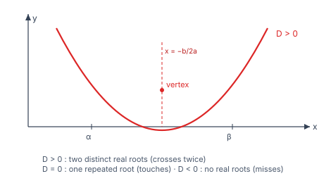
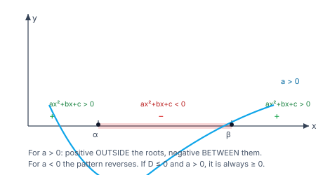

> [!info] Navigation
> 📖 [[Home|Vault home]] · 📝 [[Quadratic-Equations — Paper|Olympiad Paper]] · ✅ [[Quadratic-Equations — Solutions|Solutions]]

# Quadratic Equations

The quadratic equation is the first place where algebra stops being mechanical
and starts being *structural*. Everything about it is controlled by one number —
the discriminant — and by two relations between the roots and the coefficients.
Master those two ideas and the whole subject, including its Olympiad
generalizations, becomes a matter of bookkeeping.

The payoff is that quadratics are the standard *reduction target*: biquadratics,
radical equations, exponential equations and many Olympiad inequalities all
collapse to a quadratic after one well-chosen substitution.

`6 chapters` `worked examples (S) + practice (P)` `SVG + Mermaid diagrams` `34-question Olympiad paper + full solutions`

### ★ How to use these notes

**Read in order.** Chapters 1–2 fix the discriminant and Vieta's relations —
these two carry 80% of the marks. Chapter 3 is the quadratic *expression* (sign,
maxima, minima), Chapter 4 is reduction by substitution, Chapter 5 is common
roots and transformed equations, and Chapter 6 is the Olympiad frontier where
quadratics meet inequalities.

- **Callouts** — `[!abstract]` First Principles = the derivation; `[!tip]` Key
  Idea = the takeaway; `[!warning]` Common Trap = the classic mistake;
  `[!example]` Olympiad Extension = the frontier version.
- **Numeric habit** — every numeric answer in this module was verified in pure
  Python before it was written, and each is accompanied by a check.

### ▣ The roadmap

| Ch | Title | Level |
|---|---|---|
| 1 | Roots and the discriminant | foundations |
| 2 | Vieta's relations and symmetric functions | machinery |
| 3 | The quadratic expression: sign, maxima, minima | core |
| 4 | Equations reducible to quadratics | applications |
| 5 | Common roots, transformed equations, the graph | applications |
| 6 | Olympiad frontier | synthesis |

**Fig 1.1 — the parabola and the discriminant.** $y=ax^2+bx+c$ crosses the
$x$-axis $0$, $1$ or $2$ times according as $D=b^2-4ac$ is negative, zero or
positive. The vertex, where the extremum occurs, sits at $x=-\frac b{2a}$.

**Fig 1.2 — sign analysis of a quadratic.** For $a>0$ the expression is
positive *outside* the roots and negative *between* them; for $a<0$ the pattern
reverses. This single picture answers every "solve $ax^2+bx+c>0$" question.

---

# Chapter 1 — Roots and the Discriminant

*Foundations · the one number that controls everything*

## 1.1 The standard form and the quadratic formula

A **quadratic equation** in $x$ is $ax^2+bx+c=0$ with $a\ne0$. Its roots are
$$x=\frac{-b\pm\sqrt{b^2-4ac}}{2a}.$$

> [!abstract] First Principles — the discriminant
> The quantity $D=b^2-4ac$ is the **discriminant**. It appears because the
> formula requires $\sqrt D$, and it decides the *nature* of the roots:
>
> | $D$ | Roots |
> |---|---|
> | $D>0$ | two distinct real roots |
> | $D=0$ | one repeated real root, $x=-\frac b{2a}$ |
> | $D<0$ | two distinct complex roots, conjugate to each other |
>
> For real coefficients, complex roots always occur as a conjugate pair
> $\alpha\pm i\beta$.

#### **S1**[JEE Main][solved][roots]Solve $x^2-5x+6=0$.

$D=25-24=1>0$, so $x=\frac{5\pm1}{2}$, giving $x=3$ and $x=2$.

Answer + Reasoning

**Method: the quadratic formula.** (Factorising gives the same: $(x-2)(x-3)=0$ ✓.)

**Answer:** $x=2,\;3$.

#### **S2**[JEE Main][solved][discriminant]Find the nature of the roots of $2x^2-3x+5=0$.

$D=9-40=-31<0$, so the roots are non-real: $x=\frac{3\pm i\sqrt{31}}{4}$.

Answer + Reasoning

**Method: compute $D$ and read off the case.** A negative discriminant with real coefficients forces a conjugate pair ✓.

**Answer:** two non-real conjugate roots, $\dfrac{3\pm i\sqrt{31}}{4}$.

> [!warning] Common Trap — $D$ is not $b^2+4ac$
> The discriminant is $b^2-4ac$. Also, a quadratic with $D<0$ has *no real
> roots*, not "no roots" — the complex roots are genuine solutions.

## 1.2 Irrational and complex roots

If $D>0$ but not a perfect square, the roots are **irrational** and conjugate in
the sense $p\pm\sqrt q$. If the coefficients are rational and $D$ is a perfect
square, the roots are rational.

#### **P1**[JEE Main][practice][equal roots]Find $k$ so that $x^2+kx+9=0$ has equal roots.

Answer + Reasoning

**Method: set $D=0$.** $k^2-36=0$, so $k=\pm6$.

**Answer:** $k=6$ or $k=-6$.

---

# Chapter 2 — Vieta's Relations and Symmetric Functions

*Machinery · the two relations that do all the work*

## 2.1 Sum and product of the roots

> [!abstract] First Principles — Vieta's relations
> For $ax^2+bx+c=0$ with roots $\alpha,\beta$:
> $$\alpha+\beta=-\frac ba,\qquad \alpha\beta=\frac ca.$$
> These follow from factorising: $ax^2+bx+c=a(x-\alpha)(x-\beta)$, and comparing
> coefficients gives $-\frac ba=\alpha+\beta$ and $\frac ca=\alpha\beta$.

#### **S3**[JEE Main][solved][vieta]Find the sum and product of the roots of $3x^2-7x+2=0$.

Sum $=\frac73$; product $=\frac23$.

Answer + Reasoning

**Method: Vieta directly, no need to solve.** (Check by solving: $D=49-24=25$, $x=\frac{7\pm5}{6}$, so $2$ and $\frac13$ — sum $\frac73$, product $\frac23$ ✓.)

**Answer:** sum $\dfrac73$, product $\dfrac23$.

## 2.2 Symmetric functions of the roots

> [!tip] Key Idea — express everything through $S=\alpha+\beta$ and $P=\alpha\beta$
> Every symmetric expression in $\alpha,\beta$ reduces to $S$ and $P$:
> $$\alpha^2+\beta^2=S^2-2P,\qquad \alpha^3+\beta^3=S^3-3PS,$$
> $$\alpha^2\beta+\alpha\beta^2=PS,\qquad \frac1\alpha+\frac1\beta=\frac SP,\qquad (\alpha-\beta)^2=S^2-4P.$$
> Also $\lvert\alpha-\beta\rvert=\frac{\sqrt D}{\lvert a\rvert}$.

#### **S4**[JEE Main][solved][symmetric]For $x^2-5x+6=0$ with roots $\alpha,\beta$, find $\alpha^2+\beta^2$, $\alpha^3+\beta^3$, $\frac1\alpha+\frac1\beta$ and $(\alpha-\beta)^2$.

$S=5$, $P=6$. So $\alpha^2+\beta^2=25-12=13$; $\alpha^3+\beta^3=125-3\cdot6\cdot5=125-90=35$; $\frac1\alpha+\frac1\beta=\frac56$; $(\alpha-\beta)^2=25-24=1$.

Answer + Reasoning

**Method: reduce to $S$ and $P$.** Check with the actual roots $2,3$: $4+9=13$ ✓; $8+27=35$ ✓; $\frac12+\frac13=\frac56$ ✓; $(2-3)^2=1$ ✓.

**Answer:** $13$, $35$, $\dfrac56$, $1$.

> [!warning] Common Trap — $(\alpha-\beta)^2$ is $S^2-4P$, not $S^2-2P$
> $S^2-2P=\alpha^2+\beta^2$; the cross term doubles. And $\lvert\alpha-\beta\rvert=\sqrt{S^2-4P}=\frac{\sqrt D}{\lvert a\rvert}$, so it is *not* generally rational even when $S$ and $P$ are.

#### **P2**[JEE Adv][practice][symmetric]For $x^2-5x+6=0$, find $\alpha^2\beta+\alpha\beta^2$ and $\frac{\alpha}{\beta}+\frac{\beta}{\alpha}$.

Answer + Reasoning

**Method: $\alpha^2\beta+\alpha\beta^2=\alpha\beta(\alpha+\beta)=PS=30$; and $\frac{\alpha}{\beta}+\frac{\beta}{\alpha}=\frac{\alpha^2+\beta^2}{\alpha\beta}=\frac{13}{6}$.**

**Answer:** $30$ and $\dfrac{13}{6}$.

---

# Chapter 3 — The Quadratic Expression: Sign, Maxima, Minima

*Core · $ax^2+bx+c$ as a function, not an equation*

## 3.1 Completing the square

$$ax^2+bx+c=a\left(x+\frac b{2a}\right)^2-\frac{D}{4a}.$$

> [!abstract] First Principles — where the extremum is
> If $a>0$ the parabola opens upward, so the expression has a **minimum**
> $-\frac{D}{4a}=\frac{4ac-b^2}{4a}$ at $x=-\frac b{2a}$. If $a<0$ it has a
> **maximum** of the same value. The extremum always occurs at the vertex
> $x=-\frac b{2a}$.

#### **S5**[JEE Main][solved][minimum]Find the minimum of $x^2-6x+11$ and where it occurs.

$x^2-6x+11=(x-3)^2+2$, so the minimum is $2$ at $x=3$.

Answer + Reasoning

**Method: complete the square.** Check: $(3-3)^2+2=2$ ✓, and the formula gives $\frac{44-36}{4}=2$ ✓.

**Answer:** minimum $2$ at $x=3$.

#### **S6**[JEE Main][solved][maximum]Find the maximum of $-x^2+4x-1$.

$-(x-2)^2+3$, so the maximum is $3$ at $x=2$.

Answer + Reasoning

**Method: factor out $-1$ first, then complete the square.** Check: $-(2-2)^2+3=3$ ✓.

**Answer:** maximum $3$ at $x=2$.

## 3.2 Sign analysis

For $a>0$ with real roots $\alpha<\beta$:

| Interval | Sign of $ax^2+bx+c$ |
|---|---|
| $x<\alpha$ | $+$ |
| $\alpha<x<\beta$ | $-$ |
| $x>\beta$ | $+$ |

For $a<0$ the signs reverse. If $D\le0$ and $a>0$, the expression is always
$\ge0$.

> [!tip] Key Idea — the "wavy curve" habit
> Solve $ax^2+bx+c>0$ by (i) finding the roots, (ii) testing the sign in each
> interval. Never test a point "in the middle" without knowing the roots.

#### **P3**[JEE Main][practice][sign]Where is $x^2-5x+6<0$?

Answer + Reasoning

**Method: roots $2$ and $3$; $a>0$ so negative between them.**

**Answer:** $2<x<3$.

## 3.3 The AM–GM preview

> [!example] Olympiad Extension — AM–GM is the quadratic in disguise
> For positive $x,y$, $\frac{x+y}{2}\ge\sqrt{xy}$ is equivalent to
> $(\sqrt x-\sqrt y)^2\ge0$ — a perfect square. This is why so many extremum
> problems reduce to quadratics: the minimum of $x+\frac{k}{x}$ is $2\sqrt k$ at
> $x=\sqrt k$, and the whole family follows from the same identity.

#### **S7**[JEE Adv][solved][amgm]Find the least value of $x+\dfrac4x$ for $x>0$.

By AM–GM, $x+\frac4x\ge2\sqrt{4}=4$, with equality when $x=\frac4x$, i.e. $x=2$.

Answer + Reasoning

**Method: AM–GM on $x$ and $\frac4x$.** Check at $x=2$: $2+2=4$ ✓, and at $x=1$: $1+4=5>4$ ✓.

**Answer:** least value $4$, attained at $x=2$.

#### **P4**[JEE Adv][practice][location]Find the range of $k$ for which both roots of $x^2-2kx+k^2-1=0$ exceed $1$.

Answer + Reasoning

**Method: the roots are $k\pm1$.** Both exceed $1$ iff the smaller one does: $k-1>1$, i.e. $k>2$. (Cross-check with the discriminant conditions: $D=4>0$ always, so the only constraint is on the smaller root ✓.)

**Answer:** $k>2$.

---

# Chapter 4 — Equations Reducible to Quadratics

*Applications · one substitution away*

## 4.1 The standard substitutions

| Equation type | Substitution |
|---|---|
| $ax^4+bx^2+c=0$ | $t=x^2$ |
| $a(x^2+1/x^2)+b(x+1/x)+c=0$ | $t=x+\frac1x$ |
| $(x+a)(x+b)(x+c)(x+d)=k$ | pair the factors |
| $\sqrt{x+a}=\ldots$ | isolate and square, then **check** |
| $a^{2x}+ba^x+c=0$ | $t=a^x$ |

> [!warning] Common Trap — always check after squaring
> Squaring is not reversible. Every root of the squared equation must be
> substituted back into the *original* equation; reject the extraneous ones.

#### **S8**[JEE Main][solved][biquadratic]Solve $x^4-5x^2+4=0$.

Let $t=x^2$: $t^2-5t+4=0$, so $t=1$ or $t=4$. Hence $x=\pm1,\pm2$.

Answer + Reasoning

**Method: substitute $t=x^2$ and keep only $t\ge0$.** Check: $(\pm1)^4-5(\pm1)^2+4=1-5+4=0$ ✓; $(\pm2)^4-5(\pm2)^2+4=16-20+4=0$ ✓.

**Answer:** $x=\pm1,\pm2$.

#### **S9**[JEE Adv][solved][radical]Solve $\sqrt{x+3}=x-3$.

Squaring: $x+3=x^2-6x+9$, i.e. $x^2-7x+6=0$, so $x=1$ or $x=6$. **Check:** for $x=1$, LHS $=\sqrt4=2$ but RHS $=-2$ — reject. For $x=6$, LHS $=\sqrt9=3$ and RHS $=3$ — accept.

Answer + Reasoning

**Method: isolate the radical, square, solve, then verify in the original.** The rejection of $x=1$ is essential: squaring introduced it.

**Answer:** $x=6$ only.

#### **S10**[JEE Main][solved][exponential]Solve $2^{2x}-5\cdot2^x+4=0$.

Let $t=2^x>0$: $t^2-5t+4=0$, so $t=1$ or $t=4$. Hence $x=0$ or $x=2$.

Answer + Reasoning

**Method: substitute $t=2^x$; both values are positive so both are admissible.** Check: $2^0-5\cdot2^0+4=0$ ✓; $2^4-5\cdot2^2+4=16-20+4=0$ ✓.

**Answer:** $x=0,\;2$.

#### **P5**[JEE Adv][practice][reciprocal]Solve $x^2+\dfrac1{x^2}=7$.

Answer + Reasoning

**Method: let $t=x+\frac1x$; then $t^2-2=7$, so $t=\pm3$.** For $t=3$: $x^2-3x+1=0$, giving $x=\frac{3\pm\sqrt5}{2}$. For $t=-3$: $x^2+3x+1=0$, giving $x=\frac{-3\pm\sqrt5}{2}$.

**Answer:** $x=\dfrac{3\pm\sqrt5}{2}$ and $x=\dfrac{-3\pm\sqrt5}{2}$.

#### **P6**[JEE Main][practice][nested]Solve $(x+1)^2=4(x+1)$.

Answer + Reasoning

**Method: let $t=x+1$; then $t^2=4t$, so $t=0$ or $t=4$.** Hence $x=-1$ or $x=3$. (Dividing both sides by $x+1$ first would lose $x=-1$ — the classic error ✓.)

**Answer:** $x=-1,\;3$.

---

# Chapter 5 — Common Roots, Transformed Equations, the Graph

*Applications · putting quadratics together*

## 5.1 A common root

If $ax^2+bx+c=0$ and $a'x^2+b'x+c'=0$ have a common root, **subtracting** the
equations gives a *linear* equation, which yields the common root directly. This
is far quicker than the standard condition $(bc'-b'c)^2=(ab'-a'b)(ac'-a'c)$.

#### **S11**[JEE Main][solved][common]Find the common root of $x^2-5x+6=0$ and $x^2-4x+3=0$.

Subtracting gives $-x+3=0$, so $x=3$.

Answer + Reasoning

**Method: subtract to get a linear equation.** Check: $9-15+6=0$ ✓ and $9-12+3=0$ ✓.

**Answer:** $x=3$ (the other roots are $2$ and $1$).

## 5.2 Equations with transformed roots

> [!tip] Key Idea — build the new equation from the new sum and product
> If the new roots are $\alpha+k,\beta+k$, the new sum is $S+2k$ and the new
> product is $P+kS+k^2$. For reciprocal roots, swap: new sum $\frac SP$, new
> product $\frac1P$. Then write $x^2-(\text{new sum})x+(\text{new product})=0$.

#### **S12**[JEE Main][solved][transformed]Form the equation whose roots are $\alpha+1$ and $\beta+1$, where $\alpha,\beta$ are the roots of $x^2-5x+6=0$.

New sum $=S+2=5+2=7$; new product $=P+S+1=6+5+1=12$. So the equation is $x^2-7x+12=0$.

Answer + Reasoning

**Method: shift the sum and product.** Check with the actual roots: $\alpha+1=3$, $\beta+1=4$; sum $7$, product $12$ ✓.

**Answer:** $x^2-7x+12=0$.

#### **S13**[JEE Main][solved][reciprocal]Form the equation whose roots are $\frac1\alpha,\frac1\beta$ for $x^2-5x+6=0$.

New sum $=\frac{S}{P}=\frac56$; new product $=\frac1P=\frac16$. Multiplying by $6$: $6x^2-5x+1=0$.

Answer + Reasoning

**Method: swap the roles of sum and product, then clear denominators.** Check with the actual roots $\frac12,\frac13$: sum $\frac56$, product $\frac16$ ✓.

**Answer:** $6x^2-5x+1=0$.

## 5.3 The parabola

$y=ax^2+bx+c$ has vertex $\left(-\frac b{2a},\,\frac{4ac-b^2}{4a}\right)$, axis
$x=-\frac b{2a}$, and discriminant $D>0$ iff it meets the $x$-axis twice.

#### **P7**[JEE Main][practice][vertex]Find the vertex and axis of $y=2x^2-8x+5$.

Answer + Reasoning

**Method: $x=-\frac b{2a}=\frac88=2$; $y=\frac{4ac-b^2}{4a}=\frac{40-64}{8}=-3$.**

**Answer:** vertex $(2,-3)$, axis $x=2$.

---

# Chapter 6 — Olympiad Frontier

*Synthesis · where quadratics meet inequalities*

## 6.1 The mean inequalities

> [!example] Olympiad Extension — the full family
> For positive reals, with $A=\frac{a+b}{2}$, $G=\sqrt{ab}$, $H=\frac{2ab}{a+b}$:
> $$A\ge G\ge H,$$
> and for $n$ numbers $A\ge G$ with equality iff all are equal. The quadratic
> proof is $(x-y)^2\ge0$; the $n$-variable proof is by induction or by Jensen.
> These are the workhorses of every Olympiad inequality.

#### **S14**[JEE Adv][solved][nesbitt]Prove Nesbitt's inequality: for $a,b,c>0$,
$$\frac{a}{b+c}+\frac{b}{c+a}+\frac{c}{a+b}\ge\frac32.$$

Set $x=b+c$, $y=c+a$, $z=a+b$, so $a=\frac{y+z-x}{2}$ and the sum becomes
$$\sum_{\rm cyc}\frac{y+z-x}{2x}=\frac12\sum_{\rm cyc}\left(\frac yx+\frac zx-1\right)=\frac12\left(\frac yx+\frac zx+\frac zy+\frac xy+\frac xz+\frac yz\right)- \frac32.$$
Each pair $\frac yx+\frac xy\ge2$ by AM–GM, so the bracket is at least $6$ and the whole is at least $3-\frac32=\frac32$.

Answer + Reasoning

**Method: substitute $x=b+c$ etc., then apply AM–GM to each reciprocal pair.** Check numerically: for $(a,b,c)=(1,2,3)$ the sum is $\frac13+\frac24+\frac35=\frac{47}{30}\approx1.5667\ge1.5$ ✓.

**Answer:** proved, with equality at $a=b=c$.

## 6.2 Titu's lemma and Cauchy–Schwarz

> [!example] Olympiad Extension — Cauchy–Schwarz in Engel form
> For positive $b_i$:
> $$\frac{a_1^2}{b_1}+\frac{a_2^2}{b_2}\ge\frac{(a_1+a_2)^2}{b_1+b_2},$$
> and in general $\sum\frac{a_i^2}{b_i}\ge\frac{(\sum a_i)^2}{\sum b_i}$. This is
> the single most useful inequality in competition algebra: any sum of fractions
> with square numerators is a candidate.

#### **S15**[Olympiad][solved][titu]Verify and use Titu's lemma: show $\frac{a^2}{b}+\frac{c^2}{d}\ge\frac{(a+c)^2}{b+d}$ for $b,d>0$.

Cauchy–Schwarz on the vectors $(\frac a{\sqrt b},\frac c{\sqrt d})$ and $(\sqrt b,\sqrt d)$ gives
$$\left(\frac{a^2}{b}+\frac{c^2}{d}\right)(b+d)\ge(a+c)^2,$$
which is the claim. For $a=1,c=2,b=3,d=4$: LHS $=\frac13+1=\frac43\approx1.3333$, RHS $=\frac97\approx1.2857$, and indeed $\frac43\ge\frac97$ ✓.

Answer + Reasoning

**Method: apply Cauchy–Schwarz to the two vectors.** Equality holds when $\frac{a}{b}=\frac{c}{d}$ ✓.

**Answer:** verified; $\frac43\ge\frac97$ in the example.

#### **S16**[JEE Adv][solved][sum-recip]Prove $(a+b+c)\left(\frac1a+\frac1b+\frac1c\right)\ge9$ for $a,b,c>0$.

Expanding gives $3+\left(\frac ab+\frac ba\right)+\left(\frac bc+\frac cb\right)+\left(\frac ca+\frac ac\right)\ge3+2+2+2=9$, since each pair is at least $2$ by AM–GM.

Answer + Reasoning

**Method: expand and pair the reciprocals.** Check: for $(1,2,3)$ the product is $6\cdot\frac{11}{6}=11\ge9$ ✓.

**Answer:** proved, with equality at $a=b=c$.

## 6.3 Schur and the $a+b+c=0$ identity

> [!example] Olympiad Extension — Schur's inequality
> For $a,b,c\ge0$ and $r>0$:
> $$a^r(a-b)(a-c)+b^r(b-c)(b-a)+c^r(c-a)(c-b)\ge0.$$
> The case $r=1$ is the standard one. Schur is the usual tool when AM–GM is too
> weak — it exploits *ordering*, not just size.

> [!example] Olympiad Extension — the $a+b+c=0$ identity
> If $a+b+c=0$ then $a^3+b^3+c^3=3abc$. Proof: substitute $c=-a-b$ and expand;
> everything cancels. This identity turns many cubic factorisations into one
> line.

#### **S17**[JEE Adv][solved][identity]Verify that $a^3+b^3+c^3=3abc$ whenever $a+b+c=0$, and use it to factor $a^3+b^3+c^3-3abc$.

The identity is verified by substitution: with $c=-a-b$, $a^3+b^3-(a+b)^3=-3a^2b-3ab^2=-3ab(a+b)=3abc$ ✓. The factorisation is
$$a^3+b^3+c^3-3abc=(a+b+c)(a^2+b^2+c^2-ab-bc-ca).$$

Answer + Reasoning

**Method: expand $(a+b+c)(a^2+b^2+c^2-ab-bc-ca)$ and confirm it equals $a^3+b^3+c^3-3abc$.** Check numerically: for $(1,1,-2)$, $a^3+b^3+c^3=-6$ and $3abc=-6$ ✓.

**Answer:** the factorisation is $(a+b+c)(a^2+b^2+c^2-ab-bc-ca)$.

#### **P8**[JEE Adv][practice][resolvable cubic]Solve $x^3-6x^2+11x-6=0$ by finding a rational root, then reduce.

Answer + Reasoning

**Method: the rational-root theorem gives candidates $\pm1,\pm2,\pm3,\pm6$; testing $x=1$ gives $0$.** Dividing by $(x-1)$ leaves $x^2-5x+6$, which factors as $(x-2)(x-3)$. (Equivalently the roots are in AP with sum $6$ and product $6$ ✓.)

**Answer:** $x=1,2,3$.

#### **P9**[Olympiad][practice][schur]Verify Schur's inequality $a(a-b)(a-c)+b(b-c)(b-a)+c(c-a)(c-b)\ge0$ for $(a,b,c)=(1,2,3)$ and $(3,4,5)$.

Answer + Reasoning

**Method: direct evaluation.** For $(1,2,3)$: $1(-1)(-2)+2(-1)(1)+3(2)(1)=2-2+6=6$. For $(3,4,5)$: $3(-1)(-2)+4(-1)(1)+5(2)(1)=6-4+10=12$.

**Answer:** $6$ and $12$ — both non-negative ✓.

---

# Appendix — Well-Ordered Theory Reference

Every result in dependency order; nothing is used before it is proved.

### A. The quadratic and its roots

| Result | Statement |
|---|---|
| Standard form | $ax^2+bx+c=0$, $a\ne0$ |
| Quadratic formula | $x=\frac{-b\pm\sqrt{b^2-4ac}}{2a}$ |
| Discriminant | $D=b^2-4ac$ |
| $D>0$ | two distinct real roots |
| $D=0$ | one repeated real root $x=-\frac b{2a}$ |
| $D<0$ | two non-real conjugate roots |
| Completed square | $ax^2+bx+c=a\left(x+\frac b{2a}\right)^2-\frac{D}{4a}$ |

### B. Vieta and symmetric functions

| Result | Statement |
|---|---|
| Sum of roots | $\alpha+\beta=-\frac ba$ |
| Product of roots | $\alpha\beta=\frac ca$ |
| $\alpha^2+\beta^2$ | $S^2-2P$ |
| $\alpha^3+\beta^3$ | $S^3-3PS$ |
| $\alpha^2\beta+\alpha\beta^2$ | $PS$ |
| $\frac1\alpha+\frac1\beta$ | $\frac SP$ |
| $(\alpha-\beta)^2$ | $S^2-4P=\frac{D}{a^2}$ |
| $\lvert\alpha-\beta\rvert$ | $\frac{\sqrt D}{\lvert a\rvert}$ |

### C. The quadratic expression

| Result | Statement |
|---|---|
| Vertex | $\left(-\frac b{2a},\frac{4ac-b^2}{4a}\right)$ |
| Extremum ($a>0$, min) | $\frac{4ac-b^2}{4a}$ |
| Extremum ($a<0$, max) | $\frac{4ac-b^2}{4a}$ |
| Sign ($a>0$, roots $\alpha<\beta$) | $+$ outside, $-$ between |
| Sign ($a<0$) | reversed |
| Always $\ge0$ | $a>0$ and $D\le0$ |
| Min of $x+\frac kx$ ($x>0$) | $2\sqrt k$ at $x=\sqrt k$ |

### D. Reducible equations

| Type | Substitution |
|---|---|
| $ax^4+bx^2+c=0$ | $t=x^2$ |
| $a(x^2+x^{-2})+b(x+x^{-1})+c=0$ | $t=x+\frac1x$ |
| Radical | isolate, square, **check** |
| Exponential | $t=a^x$, require $t>0$ |
| $(x+a)(x+b)(x+c)(x+d)=k$ | pair to make a product of quadratics |

### E. Common roots and transformations

| Result | Statement |
|---|---|
| Common root | subtract to get a linear equation |
| Common-root condition | $(bc'-b'c)^2=(ab'-a'b)(ac'-a'c)$ |
| Roots $\alpha+k,\beta+k$ | sum $S+2k$, product $P+kS+k^2$ |
| Reciprocal roots | sum $\frac SP$, product $\frac1P$ |
| Roots $k\alpha,k\beta$ | sum $kS$, product $k^2P$ |

### F. Olympiad inequalities

| Result | Statement |
|---|---|
| AM–GM (two) | $\frac{a+b}{2}\ge\sqrt{ab}$ |
| AM–GM ($n$) | $\frac{\sum a_i}{n}\ge\left(\prod a_i\right)^{1/n}$ |
| $A\ge G\ge H$ | $\frac{a+b}{2}\ge\sqrt{ab}\ge\frac{2ab}{a+b}$ |
| Titu / Engel | $\sum\frac{a_i^2}{b_i}\ge\frac{(\sum a_i)^2}{\sum b_i}$ |
| Nesbitt | $\sum\frac{a}{b+c}\ge\frac32$ |
| Schur | $\sum a(a-b)(a-c)\ge0$ for $a,b,c\ge0$ |
| Cubes identity | $a^3+b^3+c^3-3abc=(a+b+c)(a^2+b^2+c^2-ab-bc-ca)$ |
| Consequence | $a+b+c=0\Rightarrow a^3+b^3+c^3=3abc$ |
| Equality cases | AM–GM: all equal; Titu: $\frac{a_i}{b_i}$ constant |

### G. Mistake checklist

1. Sign errors in the discriminant ($b^2-4ac$, not $b^2+4ac$).
2. Forgetting that $D<0$ still gives (complex) roots.
3. Using $S^2-2P$ for $(\alpha-\beta)^2$ — it is $S^2-4P$.
4. Not checking for extraneous roots after squaring.
5. Dividing by an expression that can vanish (losing a root).
6. Forgetting $t=x^2\ge0$ or $t=a^x>0$ admissibility.
7. Using the maximum formula when $a>0$ (it is a minimum).
8. Reading the sign pattern of $ax^2+bx+c$ without accounting for the sign of $a$.
9. Applying AM–GM to numbers that are not positive.
10. Quoting Nesbitt or Titu without checking positivity of the denominators.
