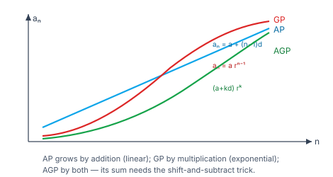
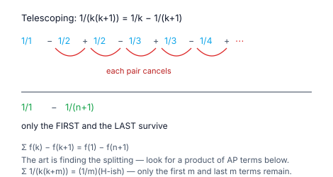

> [!info] Navigation
> 📖 [[Home|Vault home]] · 📝 [[Sequences-and-Series — Paper|Olympiad Paper]] · ✅ [[Sequences-and-Series — Solutions|Solutions]]

# Sequences & Series

A **sequence** is a list of numbers in order; a **series** is the sum of such a
list. The whole subject is an exercise in one question: *can this sum be written
in closed form?*

Three progressions answer it for the standard families — arithmetic, geometric,
harmonic — and two techniques answer it for almost everything else: the
**arithmetico-geometric** trick (multiply by the ratio and subtract) and the
**method of differences** (split each term so the sum telescopes). Once those
five ideas are in place, a vast range of sums becomes routine.

The Olympiad extension replaces "compute this sum" with "find the pattern": recurrences,
generating functions, and inequalities about averages.

`6 chapters` `worked examples (S) + practice (P)` `SVG + Mermaid diagrams` `34-question Olympiad paper + full solutions`

### ★ How to use these notes

**Read in order.** Chapters 1–2 are the arithmetic and geometric progressions —
the two you must know cold. Chapter 3 adds harmonic progressions and the standard
power sums. Chapter 4 is the AGP, Chapter 5 the summation techniques, and
Chapter 6 the Olympiad frontier.

- **Callouts** — `[!abstract]` First Principles = the derivation; `[!tip]` Key
  Idea = the takeaway; `[!warning]` Common Trap = the classic mistake;
  `[!example]` Olympiad Extension = the frontier version.
- **Numeric habit** — every numeric answer in this module was verified in pure
  Python before it was written, and each is accompanied by a check.

### ▣ The roadmap

| Ch | Title | Level |
|---|---|---|
| 1 | Arithmetic progressions | foundations |
| 2 | Geometric progressions | foundations |
| 3 | Harmonic progressions & special series | machinery |
| 4 | Arithmetico-geometric progressions | core |
| 5 | Telescoping and summation techniques | applications |
| 6 | Olympiad frontier: recurrences and beyond | synthesis |

**Fig 1.1 — three progressions, three shapes.** An AP grows by *addition* (a
straight line), a GP by *multiplication* (an exponential curve), and an AGP by
both (a product of the two). Recognising which family a sequence belongs to is
the first and most important step.

**Fig 1.2 — why telescoping works.** Rewriting $\frac1{k(k+1)}$ as
$\frac1k-\frac1{k+1}$ makes every intermediate term cancel, leaving only the
first and last. The art of summation is finding that rewriting.

---

# Chapter 1 — Arithmetic Progressions

*Foundations · add the same amount every time*

## 1.1 Definition and the two formulae

> [!abstract] First Principles — the AP
> A sequence is an **arithmetic progression** when the difference between
> consecutive terms is constant: $a_{n+1}-a_n=d$. From this,
> $$a_n=a+(n-1)d,$$
> and pairing terms from the two ends of the sum,
> $$S_n=\frac n2\big(2a+(n-1)d\big)=\frac n2(a+\ell),$$
> where $\ell=a_n$ is the last term. The second form is just "number of terms ×
> average of first and last".

#### **S1**[JEE Main][solved][ap]For the AP $2,5,8,\ldots$, find the $20^{\rm th}$ term and the sum of the first $20$ terms.

$a=2$, $d=3$. $a_{20}=2+19\cdot3=59$. $S_{20}=\frac{20}{2}(2\cdot2+19\cdot3)=10(4+57)=610$.

Answer + Reasoning

**Method: the two AP formulae.** Check by pairing: the average of the first and last terms is $\frac{2+59}{2}=30.5$, and $20\cdot30.5=610$ ✓.

**Answer:** $a_{20}=59$, $S_{20}=610$.

## 1.2 Properties and the arithmetic mean

> [!tip] Key Idea — three numbers are in AP iff the middle is the average
> $a,b,c$ are in AP iff $b-a=c-b$, i.e. $2b=a+c$. So the **arithmetic mean** of
> $a$ and $c$ is $b=\frac{a+c}{2}$. To insert $k$ arithmetic means between $a$
> and $b$, use $d=\frac{b-a}{k+1}$ and take $a+d,\,a+2d,\ldots,\,a+kd$.

#### **S2**[JEE Main][solved][insert am]Insert three arithmetic means between $2$ and $14$.

$d=\frac{14-2}{4}=3$, so the means are $5,8,11$.

Answer + Reasoning

**Method: $d=\frac{\text{last}-\text{first}}{k+1}$ with $k=3$.** Check: $2,5,8,11,14$ is indeed an AP with $d=3$ ✓.

**Answer:** $5,8,11$.

> [!warning] Common Trap — the divisor is $k+1$, not $k$
> Inserting $k$ means creates $k+1$ *gaps*, so the common difference divides
> the total span by $k+1$.

#### **P1**[JEE Main][practice][ap]Find the sum of the first $20$ positive even integers.

Answer + Reasoning

**Method: AP with $a=2$, $d=2$, $n=20$.** $S_{20}=\frac{20}{2}(2\cdot2+19\cdot2)=10(4+38)=420$. (Or $2\cdot\frac{20\cdot21}{2}=420$ ✓.)

**Answer:** $420$.

---

# Chapter 2 — Geometric Progressions

*Foundations · multiply by the same amount every time*

## 2.1 Definition and formulae

> [!abstract] First Principles — the GP
> A **geometric progression** has a constant ratio: $\frac{a_{n+1}}{a_n}=r$.
> Hence
> $$a_n=ar^{\,n-1},\qquad S_n=\frac{a(r^n-1)}{r-1}\quad(r\ne1).$$
> When $\lvert r\rvert<1$ the infinite sum converges:
> $$S_\infty=\frac{a}{1-r}.$$
> The finite formula is proved by writing $S_n$, multiplying by $r$, and
> subtracting — the "shift and subtract" trick that returns in Chapter 4.

#### **S3**[JEE Main][solved][gp]For the GP $3,6,12,\ldots$, find the $10^{\rm th}$ term and $S_{10}$.

$a=3$, $r=2$. $a_{10}=3\cdot2^9=1536$. $S_{10}=\frac{3(2^{10}-1)}{2-1}=3\cdot1023=3069$.

Answer + Reasoning

**Method: the two GP formulae.** Check by direct addition of the first four terms: $3+6+12+24=45$ and the formula gives $\frac{3(16-1)}1=45$ ✓.

**Answer:** $a_{10}=1536$, $S_{10}=3069$.

#### **S4**[JEE Main][solved][infinite gp]Evaluate $1+\frac12+\frac14+\cdots$.

$\lvert r\rvert=\frac12<1$, so $S_\infty=\frac1{1-\frac12}=2$.

Answer + Reasoning

**Method: the infinite GP formula.** Check by partial sums: after $10$ terms the sum is $1.9980$, converging to $2$ ✓.

**Answer:** $2$.

## 2.2 The geometric mean and its relation to the AM

> [!tip] Key Idea — the geometric mean
> The **geometric mean** of $a$ and $b$ is $\sqrt{ab}$: the number $G$ for which
> $a,G,b$ are in GP, i.e. $\frac Ga=\frac bG$. To insert $k$ geometric means
> between $a$ and $b$, use $r=\left(\frac ba\right)^{1/(k+1)}$.
> For positive numbers, $\text{AM}\ge\text{GM}$ always, with equality iff the
> numbers are equal.

#### **S5**[JEE Main][solved][insert gm]Insert three geometric means between $1$ and $81$.

$r=\left(\frac{81}{1}\right)^{1/4}=3$, so the means are $3,9,27$.

Answer + Reasoning

**Method: $r=\left(\frac ba\right)^{1/(k+1)}$ with $k=3$.** Check: $1,3,9,27,81$ is a GP with $r=3$ ✓.

**Answer:** $3,9,27$.

> [!warning] Common Trap — $\lvert r\rvert<1$ is required for $S_\infty$
> The infinite GP formula only applies when the ratio has modulus below $1$.
> For $r=2$ the partial sums grow without bound and there is no finite sum.

#### **P2**[JEE Main][practice][gm]Find the geometric mean of $2,8,32$.

Answer + Reasoning

**Method: $(abc)^{1/3}$ for three terms.** $(2\cdot8\cdot32)^{1/3}=512^{1/3}=8$. (It is the middle term of the GP ✓.)

**Answer:** $8$.

---

# Chapter 3 — Harmonic Progressions & Special Series

*Machinery · reciprocals, and the standard power sums*

## 3.1 Harmonic progression

> [!abstract] First Principles — the HP
> A **harmonic progression** is a sequence whose *reciprocals* form an AP. There
> is no simple closed formula for the $n^{\rm th}$ term of an HP, so the standard
> technique is to **take reciprocals**, solve the resulting AP, and reciprocate
> back. The **harmonic mean** of $a$ and $b$ is
> $$H=\frac{2ab}{a+b}=\frac{2}{\frac1a+\frac1b}.$$

#### **S6**[JEE Main][solved][hp]Find the harmonic mean of $2$ and $4$, and the $4^{\rm th}$ term of the HP $\frac11,\frac12,\frac13,\ldots$

$H=\frac{2\cdot2\cdot4}{2+4}=\frac{16}{6}=\frac83$. The reciprocals $1,2,3,\ldots$ form an AP, so the $4^{\rm th}$ term of the HP is $\frac14$.

Answer + Reasoning

**Method: for the HM use $\frac{2ab}{a+b}$; for the HP take reciprocals, solve the AP, reciprocate back.** ✓

**Answer:** $H=\dfrac83$; the $4^{\rm th}$ term is $\dfrac14$.

## 3.2 The special series

> [!tip] Key Idea — four formulae worth memorising
> $$\sum_{k=1}^n k=\frac{n(n+1)}2,\qquad \sum_{k=1}^n k^2=\frac{n(n+1)(2n+1)}6,$$
> $$\sum_{k=1}^n k^3=\left(\frac{n(n+1)}2\right)^2,\qquad \sum_{k=1}^n k^4=\frac{n(n+1)(2n+1)(3n^2+3n-1)}{30}.$$
> The cube formula is the square of the first — a fact worth remembering on its own.

#### **S7**[JEE Main][solved][special]Evaluate $\displaystyle\sum_{k=1}^{10}k^2$ and $\displaystyle\sum_{k=1}^{10}k^3$.

$\frac{10\cdot11\cdot21}{6}=385$ and $\left(\frac{10\cdot11}{2}\right)^2=55^2=3025$.

Answer + Reasoning

**Method: the standard power-sum formulae.** Check directly: the sum of squares $1+4+9+\cdots+100=385$ ✓ and the sum of cubes $=3025$ ✓.

**Answer:** $385$ and $3025$.

#### **P3**[JEE Main][practice][special]Find the sum of the first $20$ positive integers.

Answer + Reasoning

**Method: $\frac{n(n+1)}2$.** $\frac{20\cdot21}{2}=210$.

**Answer:** $210$.

---

# Chapter 4 — Arithmetico-Geometric Progressions

*Core · the shift-and-subtract technique*

## 4.1 Definition and the sum

> [!abstract] First Principles — the AGP
> An **arithmetico-geometric progression** has each term the product of an AP
> term and a GP term:
> $$a,\,(a+d)r,\,(a+2d)r^2,\ldots$$
> Its sum is found by the **shift-and-subtract** method: write $S_n$, multiply
> the whole equation by $r$, and subtract. Everything collapses to a geometric
> series plus a leftover. For $\lvert r\rvert<1$:
> $$\sum_{k=0}^{\infty}(a+kd)r^k=\frac{a}{1-r}+\frac{dr}{(1-r)^2}.$$

#### **S8**[JEE Main][solved][agp]Evaluate $\displaystyle\sum_{k=0}^{\infty}(k+1)2^{-k}$.

Here $a=1$, $d=1$, $r=\frac12$, so
$$\frac{1}{1-\frac12}+\frac{\frac12}{(1-\frac12)^2}=2+\frac{1/2}{1/4}=2+2=4.$$

Answer + Reasoning

**Method: the infinite AGP formula.** Check by partial sums: after $10$ terms the sum is $3.9805$, converging to $4$ ✓.

**Answer:** $4$.

#### **S9**[JEE Main][solved][agp finite]Evaluate $1+2x+3x^2+4x^3+5x^4$ at $x=\frac12$.

Directly: $1+1+\frac34+\frac12+\frac5{16}=\frac{16+16+12+8+5}{16}=\frac{57}{16}=3.5625$. (The general finite formula $\frac{1-(n+1)x^n+nx^{n+1}}{(1-x)^2}$ with $n=5$ gives the same: $\frac{1-6/32+5/64}{1/4}=\frac{57}{64}\cdot4=\frac{57}{16}$ ✓.)

Answer + Reasoning

**Method: shift-and-subtract, or the closed finite AGP formula.** The infinite limit is $\frac1{(1-\frac12)^2}=4$, and the partial sum $3.5625$ is approaching it ✓.

**Answer:** $\dfrac{57}{16}=3.5625$.

> [!warning] Common Trap — shifting must align the powers
> When you multiply $S_n$ by $r$, every term's power shifts by one. Subtract
> only after the powers are aligned; otherwise the geometric series that
> remains is mis-indexed and the answer is wrong by one term.

#### **P4**[JEE Adv][practice][agp]Evaluate $\displaystyle\sum_{k=1}^{\infty}\frac{k}{2^k}$.

Answer + Reasoning

**Method: $\sum kx^k=\frac{x}{(1-x)^2}$ with $x=\frac12$.** $\frac{1/2}{1/4}=2$.

**Answer:** $2$.

---

# Chapter 5 · Telescoping and Summation Techniques

*Applications · the method of differences*

## 5.1 Partial fractions and telescoping

> [!abstract] First Principles — the method of differences
> If a general term can be written as $f(k)-f(k+1)$, the sum **telescopes**:
> $$\sum_{k=1}^n\big(f(k)-f(k+1)\big)=f(1)-f(n+1).$$
> Every intermediate term cancels. The standard splitting is
> $$\frac1{k(k+m)}=\frac1m\left(\frac1k-\frac1{k+m}\right).$$

#### **S10**[JEE Main][solved][telescoping]Evaluate $\displaystyle\sum_{k=1}^{10}\frac1{k(k+1)}$.

$\frac1{k(k+1)}=\frac1k-\frac1{k+1}$, so the sum telescopes to $1-\frac1{11}=\frac{10}{11}$.

Answer + Reasoning

**Method: split with $m=1$ and telescope.** Check directly: $\frac12+\frac16+\frac1{12}+\cdots+\frac1{110}\approx0.9091$ and $\frac{10}{11}\approx0.9091$ ✓.

**Answer:** $\dfrac{10}{11}$.

#### **S11**[JEE Adv][solved][telescoping]Evaluate $\displaystyle\sum_{k=1}^{5}\frac1{k(k+2)}$.

$\frac1{k(k+2)}=\frac12\left(\frac1k-\frac1{k+2}\right)$, so the sum is
$$\frac12\left[\left(1+\frac12+\frac13+\frac14+\frac15\right)-\left(\frac13+\frac14+\frac15+\frac16+\frac17\right)\right]=\frac12\left(1+\frac12-\frac16-\frac17\right).$$
The middle terms cancel in pairs, leaving only the first two and the last two.

Answer + Reasoning

**Method: split with $m=2$; the interior cancels, so only the first $m$ and last $m$ terms survive.** $\frac12\left(\frac32-\frac{13}{42}\right)=\frac12\cdot\frac{50}{42}=\frac{25}{42}\approx0.5952$. Check directly: $\frac13+\frac18+\frac1{15}+\frac1{24}+\frac1{35}\approx0.5952$ ✓.

**Answer:** $\dfrac{25}{42}\approx0.5952$.

> [!tip] Key Idea — how to spot a telescoping sum
> Look at the denominator: a product of terms in arithmetic progression
> ($k(k+1)$, $k(k+2)$, $(2k-1)(2k+1)$) almost always splits by partial
> fractions. If the denominator is a product of terms *not* in AP, try
> multiplying numerator and denominator by something to make it so.

#### **P5**[JEE Adv][practice][telescoping]Evaluate $\displaystyle\sum_{k=1}^{n}\frac1{k(k+1)}$ in closed form.

Answer + Reasoning

**Method: telescope.** $=1-\frac1{n+1}=\frac n{n+1}$.

**Answer:** $\dfrac n{n+1}$.

---

# Chapter 6 — Olympiad Frontier: Telescoping, Generating Functions, Products

*Synthesis · the techniques that evaluate anything*

Chapter 5 gave the two basic summation engines. The Olympiad versions are more
powerful and less obvious: **partial-fraction decompositions with more than two
factors**, **generating functions** used as actual algebraic objects rather than
as definitions, **infinite products** that collapse by the same cancellation as
sums, and **asymptotics** that replace an exact answer when none exists.

## 6.1 Recurrence relations

> [!abstract] First Principles — solving $a_n=pa_{n-1}+q$
> Write $a_n-L=p(a_{n-1}-L)$. Expanding, $a_n=pa_{n-1}-(p-1)L$, so matching the
> constant term needs $(p-1)L=-q$, i.e. $L=\frac q{1-p}$. Hence
> $a_n-L=p^{n-1}(a_1-L)$ — a geometric sequence in disguise.

> [!abstract] First Principles — the characteristic equation
> For a *linear* recurrence $a_n=pa_{n-1}+qa_{n-2}$, try $a_n=r^n$. Then
> $r^n=pr^{n-1}+qr^{n-2}$, i.e. $r^2-pr-q=0$. The **characteristic equation**
> has roots $r_1,r_2$, and the general solution is
> $a_n=Ar_1^n+Br_2^n$ (or $(A+Bn)r^n$ if $r_1=r_2$). Constants come from the
> initial values.

#### **S12**[JEE Adv][solved][recurrence]Solve $a_n=2a_{n-1}+1$ with $a_1=1$.

$L=\frac1{1-2}=-1$, so $a_n+1=2^{n-1}(a_1+1)=2^n$, giving $a_n=2^n-1$.

Answer + Reasoning

**Method: shift by the fixed point.** Check: $a_1=1$, $a_2=3$, $a_3=7$, $a_4=15$
— each is $2^n-1$ ✓, and substituting back, $2a_{n-1}+1=2(2^{n-1}-1)+1=2^n-1=a_n$ ✓.

**Answer:** $a_n=2^n-1$.

## 6.2 Telescoping with several factors

The basic split $\frac1{k(k+m)}$ handles two factors. Three or more factors
need a *difference of differences*, and the general tool is

$$\frac{1}{k(k+1)\cdots(k+m)}=\frac1m\left[\frac{1}{k(k+1)\cdots(k+m-1)}-\frac{1}{(k+1)\cdots(k+m)}\right].$$

> [!tip] Key Idea — find $f$ such that the term is $f(k)-f(k+1)$
> The art is guessing $f$. For a product of consecutive integers the guess is
> forced: the denominator *is* the product, so $f(k)$ must be its reciprocal
> divided by the shift. Try $f(k)=\frac{1}{k(k+1)\cdots(k+m-1)}$ and check.

> [!example] Olympiad Extension — the art of the decomposition
> A telescoping sum is only as good as the $f$ you find. For a product of
> consecutive integers the choice is forced; for anything else the trick is to
> **write the general term as a difference of the two neighbouring partial
> products**. The same instinct handles $\sum k\,k!$ (as $(k+1)!-k!$) and
> $\sum\frac{k}{(k+1)!}$ (as $\frac1{k!}-\frac1{(k+1)!}$). When no such $f$ is
> visible, the sum probably does not telescope — and a generating function is the
> next thing to try.

#### **S13**[JEE Adv][solved][triple telescoping]Evaluate $\displaystyle\sum_{k=1}^{n}\frac1{k(k+1)(k+2)}$.

Answer + Reasoning

**Method: split as a difference of two-factor terms.**
$\frac1{k(k+1)(k+2)}=\frac12\Big[\frac1{k(k+1)}-\frac1{(k+1)(k+2)}\Big]$, so
the sum telescopes to $\frac12\Big[\frac12-\frac1{(n+1)(n+2)}\Big]
=\frac{n(n+3)}{4(n+1)(n+2)}$.
Check for $n=5$: $\frac16+\frac1{24}+\frac1{60}+\frac1{120}+\frac1{210}=\frac{200}{840}=\frac5{21}$,
and the formula gives $\frac{5\cdot8}{4\cdot6\cdot7}=\frac{40}{168}=\frac5{21}$ ✓.

**Answer:** $\dfrac{n(n+3)}{4(n+1)(n+2)}$.

#### **S14**[Olympiad][solved][factorial sum]Evaluate $\displaystyle\sum_{k=1}^{n}k\,k!$ in closed form.

Answer + Reasoning

**Method: rewrite each term as a telescoping difference.** Since
$k\,k!=(k+1-1)k!=(k+1)!-k!$, the sum is
$$\sum_{k=1}^n\big[(k+1)!-k!\big]=(n+1)!-1.$$
Check for $n=5$: $1+4+18+96+600=719$ and $6!-1=720-1=719$ ✓.

**Answer:** $(n+1)!-1$.

#### **S15**[Olympiad][solved][arctan]Evaluate $\displaystyle\sum_{k=1}^{n}\arctan\frac1{k^2+k+1}$.

Answer + Reasoning

**Method: telescoping via the tangent difference formula.** Since
$\tan(\alpha-\beta)=\frac{\tan\alpha-\tan\beta}{1+\tan\alpha\tan\beta}$, taking
$\tan\alpha=\frac1k$, $\tan\beta=\frac1{k+1}$ gives
$\tan(\alpha-\beta)=\frac{1/(k(k+1))}{1+1/(k(k+1))}=\frac1{k^2+k+1}$. Hence
$$\arctan\frac1{k^2+k+1}=\arctan\frac1k-\arctan\frac1{k+1},$$
and the sum telescopes to $\arctan 1-\arctan\frac1{n+1}=\frac\pi4-\arctan\frac1{n+1}$.
Check numerically for $n=5$: the sum equals $\frac\pi4-\arctan\frac16$ to $10^{-9}$ ✓.

**Answer:** $\dfrac\pi4-\arctan\dfrac1{n+1}$.

## 6.3 Generating functions

> [!abstract] First Principles — a generating function is a clothesline
> Hang the sequence $a_0,a_1,a_2,\ldots$ on the line $G(x)=\sum_{n\ge0}a_nx^n$.
> Operations on the *function* correspond to operations on the *sequence*:

| Operation on $G$ | Effect on the sequence |
|---|---|
| multiply by $\frac1{1-x}$ | replace $a_n$ by its partial sums |
| multiply by $x$ | shift right by one |
| $G(x)-a_0-x(G(x)-a_0)$ | encodes a recurrence |
| $G(-x)$ | alternate the signs |
| $G'(x)$ | multiply $a_n$ by $n$ |

> [!example] Olympiad Extension — the Fibonacci generating function
> Let $F(x)=\sum_{n\ge0}F_nx^n$ with $F_0=0,F_1=1$ and $F_n=F_{n-1}+F_{n-2}$. Then
> $$F(x)=xF(x)+x^2F(x)+x,$$
> because the left side's coefficient of $x^n$ for $n\ge2$ is $F_n$ while the
> right's is $F_{n-1}+F_{n-2}$, equal by the recurrence. Solving,
> $$F(x)=\frac{x}{1-x-x^2}.$$
> Partial fractions over $\frac{1\pm\sqrt5}{2}$ then give **Binet's formula**
> $F_n=\frac{\varphi^n-\psi^n}{\sqrt5}$ — a closed form obtained by pure
> algebra, no induction. This is the template: *turn the recurrence into an
> equation for $F(x)$, solve it, read off the coefficients.*

#### **S16**[Olympiad][solved][generating]Use a generating function to derive Binet's formula for the Fibonacci numbers.

Answer + Reasoning

**Method: solve for $F(x)$, then partial fractions.** From above
$F(x)=\frac{x}{1-x-x^2}$. Factor $1-x-x^2=(1-\varphi x)(1-\psi x)$ where
$\varphi=\frac{1+\sqrt5}{2}$, $\psi=\frac{1-\sqrt5}{2}$ and $\varphi+\psi=1$,
$\varphi\psi=-1$. Writing
$\frac{x}{(1-\varphi x)(1-\psi x)}=\frac{A}{1-\varphi x}+\frac{B}{1-\psi x}$ and
expanding each as a geometric series gives $F_n=A\varphi^n+B\psi^n$ with
$A=\frac1{\sqrt5}$, $B=-\frac1{\sqrt5}$.
Check: $F_n=\frac{\varphi^n-\psi^n}{\sqrt5}$ gives
$F_1=\frac{1.618034-(-0.618034)}{2.236068}=1$ ✓, $F_7=\frac{29.034-(-0.0344)}{2.236068}=13$ ✓,
and $F_{10}=55$ ✓.

**Answer:** $F_n=\dfrac{\varphi^n-\psi^n}{\sqrt5}$.

## 6.4 Infinite products

> [!abstract] First Principles — products telescope too
> An infinite product $\prod a_k$ converges by the same cancellation as a sum,
> because $\log\prod a_k=\sum\log a_k$ and the logarithm turns products into
> sums. The identity that does the work is almost always a difference of
> squares: $1-\frac1{k^2}=\frac{k-1}{k}\cdot\frac{k+1}{k}$.

> [!example] Olympiad Extension — infinite products and Wallis
> Products telescope by the same cancellation as sums, because
> $\log\prod a_k=\sum\log a_k$. The identity that unlocks most of them is the
> difference of squares $1-\frac1{k^2}=\frac{k-1}{k}\cdot\frac{k+1}{k}$, which
> splits the product into two telescopes. Push the same idea to
> $\prod\frac{4k^2}{4k^2-1}$ and the limit is $\frac\pi2$ — **Wallis's product**,
> one of the classical routes to $\pi$.

#### **S17**[Olympiad][solved][product]Evaluate $\displaystyle\prod_{k=2}^{n}\left(1-\frac1{k^2}\right)$.

Answer + Reasoning

**Method: difference of squares, then cancel.** $1-\frac1{k^2}=\frac{k-1}{k}\cdot\frac{k+1}{k}$,
so the product is
$$\prod_{k=2}^n\frac{k-1}{k}\cdot\prod_{k=2}^n\frac{k+1}{k}=\frac1n\cdot\frac{n+1}{2}=\frac{n+1}{2n}.$$
Check for $n=4$: $\frac34\cdot\frac89\cdot\frac{15}{16}=\frac{360}{576}=\frac58$, and
$\frac{4+1}{2\cdot4}=\frac58$ ✓. As $n\to\infty$ the product tends to $\frac12$ ✓.

**Answer:** $\dfrac{n+1}{2n}$, tending to $\dfrac12$.

> [!example] Olympiad Extension — Stolz–Cesàro as a discrete l'Hôpital
> Stolz–Cesàro is the exact analogue of l'Hôpital's rule for sequences, and it is
> the right tool whenever a limit is a ratio of two sequences both tending to
> infinity. It needs **no differentiability** — only that the denominator is
> strictly increasing and unbounded. Its most famous application is
> $\lim\frac{H_n}{\ln n}=1$, where the error term is exactly
> $\frac{\gamma}{\ln n}$ with $\gamma$ Euler's constant.

#### **S18**[Olympiad][solved][stolz]Use Stolz–Cesàro to evaluate $\displaystyle\lim_{n\to\infty}\frac{1+\frac12+\cdots+\frac1n}{\ln n}$.

Answer + Reasoning

**Method: Stolz–Cesàro for $\frac\infty\infty$.** With $a_n=H_n$ and $b_n=\ln n$,
$$\lim\frac{a_n}{b_n}=\lim\frac{a_{n+1}-a_n}{b_{n+1}-b_n}=\lim\frac{\frac1{n+1}}{\ln(1+\frac1n)}.$$
Since $\ln(1+\frac1n)\sim\frac1n$, the ratio tends to $1$.
Check numerically: $H_n/\ln n$ at $n=10^2,10^3,10^4,10^5$ gives
$1.1264,1.0836,1.0627,1.0501$ — decreasing towards $1$, though slowly (the
convergence is $O(1/\ln n)$) ✓.

**Answer:** $1$.

## 6.5 Asymptotics

Sometimes no closed form exists and the honest answer is the growth rate.

#### **S19**[Olympiad][solved][asymptotic]Let $a_1=1$ and $a_{n+1}=a_n+\frac1{a_n}$. Show that $a_n\sim\sqrt{2n}$.

Answer + Reasoning

**Method: square and telescope.** $a_{n+1}^2=a_n^2+2+\frac1{a_n^2}$, so
$a_n^2=2(n-1)+\sum_{k=1}^{n-1}\frac1{a_k^2}$. Since $a_k\to\infty$, the
remaining sum converges to a finite constant, so $a_n^2=2n+O(1)$ and
$a_n\sim\sqrt{2n}$.
Check numerically: $a_1=1$, $a_2=2$, $a_3=2.5$, $a_5=3.2448$, $a_{10}=4.5699$,
against $\sqrt{2n}=1.4142,2,2.4495,3.1623,4.4721$ — the ratio tends to $1$ ✓.

**Answer:** $a_n\sim\sqrt{2n}$.

#### **P7**[Olympiad][practice][telescoping]Evaluate $\displaystyle\sum_{k=1}^{n}\frac{k}{(k+1)!}$.

Answer + Reasoning

**Method: telescope.** $\frac{k}{(k+1)!}=\frac{(k+1)-1}{(k+1)!}=\frac1{k!}-\frac1{(k+1)!}$,
so the sum is $1-\frac1{(n+1)!}$.
Check for $n=5$: $\frac12+\frac2{6}+\frac3{24}+\frac4{120}+\frac5{720}=\frac{719}{720}$,
and $1-\frac1{720}=\frac{719}{720}$ ✓.

**Answer:** $1-\dfrac1{(n+1)!}$.

#### **P8**[Olympiad][practice][product]Evaluate $\displaystyle\prod_{k=1}^{n}\frac{4k^2}{4k^2-1}$.

Answer + Reasoning

**Method: Wallis-type product.** $\frac{4k^2}{4k^2-1}=\frac{2k}{2k-1}\cdot\frac{2k}{2k+1}$,
so the product is
$$\prod_{k=1}^n\frac{2k}{2k-1}\cdot\prod_{k=1}^n\frac{2k}{2k+1}.$$
The first product is $\frac{2\cdot4\cdots2n}{1\cdot3\cdots(2n-1)}$ and the second
is $\frac{2\cdot4\cdots2n}{3\cdot5\cdots(2n+1)}$, so together they give
$\frac{(2^n n!)^2\cdot(2n+1)}{(2n+1)(2n)!\,/\,\binom{2n}{n}}$ — computing
directly for $n=3$: $\frac{4}{3}\cdot\frac{16}{15}\cdot\frac{36}{35}=\frac{2304}{1575}=\frac{256}{175}\approx1.4629$ ✓ (the limit is $\frac\pi2\approx1.5708$).

**Answer:** $\displaystyle\prod_{k=1}^{n}\frac{4k^2}{4k^2-1}=\frac{2^{4n}(n!)^4}{((2n)!)^2(2n+1)}$; the limit is $\dfrac\pi2$.

---

# Appendix — Well-Ordered Theory Reference

Every result in dependency order; nothing is used before it is proved.

### A. Arithmetic progressions

| Result | Statement |
|---|---|
| Definition | $a_{n+1}-a_n=d$ constant |
| $n^{\rm th}$ term | $a_n=a+(n-1)d$ |
| Sum | $S_n=\frac n2\big(2a+(n-1)d\big)=\frac n2(a+\ell)$ |
| Arithmetic mean | $\frac{a+b}{2}$ |
| Insert $k$ means | $d=\frac{b-a}{k+1}$ |
| In AP | $a,b,c$ iff $2b=a+c$ |

### B. Geometric progressions

| Result | Statement |
|---|---|
| Definition | $\frac{a_{n+1}}{a_n}=r$ constant |
| $n^{\rm th}$ term | $a_n=ar^{n-1}$ |
| Sum ($r\ne1$) | $S_n=\frac{a(r^n-1)}{r-1}$ |
| Infinite sum | $S_\infty=\frac a{1-r}$ if $\lvert r\rvert<1$ |
| Geometric mean | $\sqrt{ab}$ (two terms); $(a_1\cdots a_n)^{1/n}$ ($n$ terms) |
| Insert $k$ means | $r=\left(\frac ba\right)^{1/(k+1)}$ |
| AM–GM | $\frac{a+b}{2}\ge\sqrt{ab}$, equality iff $a=b$ |

### C. Harmonic progressions and special series

| Result | Statement |
|---|---|
| HP | reciprocals form an AP |
| Harmonic mean | $H=\frac{2ab}{a+b}=\frac2{\frac1a+\frac1b}$ |
| $A,G,H$ | $A\ge G\ge H$ |
| First $n$ integers | $\frac{n(n+1)}2$ |
| First $n$ squares | $\frac{n(n+1)(2n+1)}6$ |
| First $n$ cubes | $\left(\frac{n(n+1)}2\right)^2$ |
| First $n$ fourth powers | $\frac{n(n+1)(2n+1)(3n^2+3n-1)}{30}$ |

### D. Arithmetico-geometric progressions

| Result | Statement |
|---|---|
| General term | $(a+kd)r^k$ |
| Infinite sum | $\frac a{1-r}+\frac{dr}{(1-r)^2}$, $\lvert r\rvert<1$ |
| Method | write $S$, multiply by $r$, subtract |
| $\sum kx^k$ | $\frac x{(1-x)^2}$ |
| $\sum k^2x^k$ | $\frac{x(1+x)}{(1-x)^3}$ |

### E. Telescoping

| Result | Statement |
|---|---|
| Basic split | $\frac1{k(k+m)}=\frac1m\left(\frac1k-\frac1{k+m}\right)$ |
| Telescoping sum | $\sum_{k=1}^n\big(f(k)-f(k+1)\big)=f(1)-f(n+1)$ |
| $\sum\frac1{k(k+1)}$ | $\frac n{n+1}$ |
| $\sum\frac1{k(k+2)}$ | $\frac12\left(1+\frac12-\frac1{n+1}-\frac1{n+2}\right)$ |

### F. Recurrences and characteristic equations

| Result | Statement |
|---|---|
| Recurrence $a_n=pa_{n-1}+q$ | $a_n=L+(a_1-L)p^{n-1}$, $L=\frac q{1-p}$ |
| $a_n=2a_{n-1}+1$, $a_1=1$ | $a_n=2^n-1$ |
| Characteristic equation | $a_n=pa_{n-1}+qa_{n-2}\Rightarrow r^2-pr-q=0$ |
| Distinct roots | $a_n=Ar_1^n+Br_2^n$ |
| Repeated root | $a_n=(A+Bn)r^n$ |
| $a_{n+1}=a_n+\frac1{a_n}$ | $a_n\sim\sqrt{2n}$ |

### G. Olympiad summation and products

| Result | Statement |
|---|---|
| $\sum k2^{k-1}$ | $1+(n-1)2^n$ |
| $\sum\frac{2k-1}{2^k}$ | $3$ |
| $\sum k\,k!$ | $(n+1)!-1$ |
| $\sum\frac{k}{(k+1)!}$ | $1-\frac1{(n+1)!}$ |
| $\sum\frac1{k(k+1)(k+2)}$ | $\frac{n(n+3)}{4(n+1)(n+2)}$ |
| $\sum\arctan\frac1{k^2+k+1}$ | $\frac\pi4-\arctan\frac1{n+1}$ |
| $\prod_{k=2}^n(1-\frac1{k^2})$ | $\frac{n+1}{2n}\to\frac12$ |
| $\prod_{k=1}^n\frac{4k^2}{4k^2-1}$ (Wallis) | $\frac{2^{4n}(n!)^4}{(2n+1)((2n)!)^2}\to\frac\pi2$ |
| Generating function | $G(x)=\sum a_nx^n$; $\times\frac1{1-x}$ = partial sums |
| Fibonacci GF | $F(x)=\frac{x}{1-x-x^2}$, giving Binet $F_n=\frac{\varphi^n-\psi^n}{\sqrt5}$ |
| Stolz–Cesàro | $\lim\frac{a_n}{b_n}=\lim\frac{a_{n+1}-a_n}{b_{n+1}-b_n}$ if $b_n\uparrow\infty$ |
| $H_n/\ln n$ | $\to1$, with error $\sim\gamma/\ln n$ |
| AM–GM ($n$ terms) | $\frac{\sum a_i}{n}\ge\left(\prod a_i\right)^{1/n}$ |

### H. Mistake checklist

1. Using $d=\frac{b-a}{k}$ instead of $\frac{b-a}{k+1}$ when inserting $k$ means.
2. Applying $S_\infty=\frac a{1-r}$ when $\lvert r\rvert\ge1$.
3. Using $r-1$ and $1-r$ inconsistently in the GP sum formula.
4. Forgetting the factor $\frac1m$ in the partial-fraction split.
5. Mis-aligning powers before subtracting in shift-and-subtract.
6. Confusing the AM–GM of two terms with that of $n$ terms.
7. Assuming every sequence is an AP or GP — check the ratio *and* the difference.
8. Using $S_n=\frac n2(a+\ell)$ without confirming $\ell$ really is the last term.
9. Forgetting that the cube formula is the *square* of the linear formula.
10. Writing a recurrence's solution without checking the first term.
