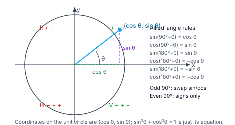
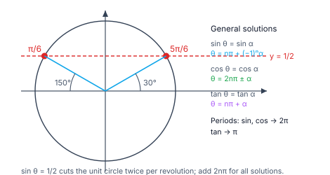

> [!info] Navigation
> 📖 [[Home|Vault home]] · 📝 [[Trigonometry — Paper|Olympiad Paper]] · ✅ [[Trigonometry — Solutions|Solutions]]

# Trigonometry

Trigonometry is the study of the six ratios built from a right-angled triangle,
and then of the *periodic functions* they become when the angle is allowed to
grow without bound. Two ideas run through the whole subject.

The first is that **everything reduces to sine and cosine** — $\tan=\sin/\cos$,
$\sec=1/\cos$, and every identity in the subject is ultimately a statement about
$\sin$ and $\cos$. The second is the **unit circle**: it converts "angle" into
"arc length" and makes the general solution of a trigonometric equation
completely mechanical.

The payoff is broad. Trigonometry is the language of periodic phenomena, of
vectors and rotations, and — through the sine and cosine rules — of every
triangle that is not right-angled.

`6 chapters` `worked examples (S) + practice (P)` `SVG + Mermaid diagrams` `34-question Olympiad paper + full solutions`

### ★ How to use these notes

**Read in order.** Chapters 1–2 fix the identities and the compound-angle
formulae — these are the tools everything else is built from. Chapter 3 is the
multiple-angle family, Chapter 4 is the transformation formulae (product ↔ sum),
Chapter 5 is trigonometric *equations*, and Chapter 6 is triangles plus the
Olympiad frontier.

- **Callouts** — `[!abstract]` First Principles = the derivation; `[!tip]` Key
  Idea = the takeaway; `[!warning]` Common Trap = the classic mistake;
  `[!example]` Olympiad Extension = the frontier version.
- **Numeric habit** — every numeric answer in this module was verified in pure
  Python before it was written, and each is accompanied by a check.

### ▣ The roadmap

| Ch | Title | Level |
|---|---|---|
| 1 | Ratios, identities and signs | foundations |
| 2 | Compound angles | machinery |
| 3 | Multiple and submultiple angles | machinery |
| 4 | Transformation formulae and sums | applications |
| 5 | Trigonometric equations | core |
| 6 | Properties of triangles & the Olympiad frontier | synthesis |

**Fig 1.1 — the unit circle and the signs.** The coordinates of a point on the
unit circle are $(\cos\theta,\sin\theta)$. The sign of each ratio is fixed by
the quadrant, and the four allied-angle rules follow by symmetry about the axes.

**Fig 1.2 — the general solution on the circle.** $\sin\theta=\frac12$ has two
solutions in $[0,2\pi)$ — and then repeats every $2\pi$. The unit circle turns
"find all solutions" into "read the two angles and add $2n\pi$".

---

# Chapter 1 — Ratios, Identities and Signs

*Foundations · six numbers and how they hang together*

## 1.1 The six ratios

For a right-angled triangle with angle $\theta$, opposite $O$, adjacent $A$,
hypotenuse $H$:
$$\sin\theta=\frac OH,\quad\cos\theta=\frac AH,\quad\tan\theta=\frac OA,$$
$$\csc\theta=\frac HO,\quad\sec\theta=\frac HA,\quad\cot\theta=\frac AO.$$

> [!abstract] First Principles — the unit circle generalises everything
> On the unit circle, a point at angle $\theta$ from the positive $x$-axis has
> coordinates $(\cos\theta,\sin\theta)$. This defines $\sin$ and $\cos$ for *all*
> real $\theta$ (not just acute angles), makes them periodic with period $2\pi$,
> and gives the fundamental identity
> $$\sin^2\theta+\cos^2\theta=1$$
> immediately, as the equation of the unit circle.

## 1.2 The identities

> [!tip] Key Idea — two families, and everything follows
> **Pythagorean:** $\sin^2\theta+\cos^2\theta=1$, $1+\tan^2\theta=\sec^2\theta$,
> $1+\cot^2\theta=\csc^2\theta$.
> **Reciprocal:** $\sin\theta\csc\theta=1$, $\cos\theta\sec\theta=1$,
> $\tan\theta\cot\theta=1$, and $\tan\theta=\frac{\sin\theta}{\cos\theta}$.

#### **S1**[JEE Main][solved][identity]Verify $\sin^2 30^\circ+\cos^2 30^\circ=1$.

$\left(\frac12\right)^2+\left(\frac{\sqrt3}{2}\right)^2=\frac14+\frac34=1$ ✓.

Answer + Reasoning

**Method: substitute the standard values.** The identity holds for every angle, not just $30^\circ$ ✓.

**Answer:** verified, $=1$.

## 1.3 Signs and allied angles

| Quadrant | $\sin$ | $\cos$ | $\tan$ |
|---|---|---|---|
| I ($0$–$90^\circ$) | $+$ | $+$ | $+$ |
| II | $+$ | $-$ | $-$ |
| III | $-$ | $-$ | $+$ |
| IV | $-$ | $+$ | $-$ |

> [!abstract] First Principles — the allied-angle rules
> These follow from symmetry about the axes:
> $$\sin(90^\circ-\theta)=\cos\theta,\quad \cos(90^\circ-\theta)=\sin\theta,$$
> $$\sin(90^\circ+\theta)=\cos\theta,\quad \cos(90^\circ+\theta)=-\sin\theta,$$
> $$\sin(180^\circ-\theta)=\sin\theta,\quad \cos(180^\circ-\theta)=-\cos\theta,$$
> $$\sin(180^\circ+\theta)=-\sin\theta,\quad \cos(180^\circ+\theta)=-\cos\theta,$$
> $$\sin(270^\circ-\theta)=-\cos\theta,\quad \sin(270^\circ+\theta)=-\cos\theta.$$
> **Odd multiples of $90^\circ$ swap sine and cosine; even multiples change only signs.**

#### **S2**[JEE Main][solved][allied]Evaluate $\sin135^\circ$ and $\cos225^\circ$.

$\sin135^\circ=\sin(180^\circ-45^\circ)=\sin45^\circ=\frac{\sqrt2}{2}$; $\cos225^\circ=\cos(180^\circ+45^\circ)=-\cos45^\circ=-\frac{\sqrt2}{2}$.

Answer + Reasoning

**Method: allied-angle rules.** Check numerically: $\sin135^\circ\approx0.7071$ and $\cos225^\circ\approx-0.7071$ ✓.

**Answer:** $\dfrac{\sqrt2}{2}$ and $-\dfrac{\sqrt2}{2}$.

#### **P1**[JEE Main][practice][standard values]Evaluate $\sin75^\circ$.

Answer + Reasoning

**Method: $\sin75^\circ=\sin(45^\circ+30^\circ)$.** $\frac{\sqrt2}{2}\cdot\frac{\sqrt3}{2}+\frac{\sqrt2}{2}\cdot\frac12=\frac{\sqrt6+\sqrt2}{4}$.

**Answer:** $\dfrac{\sqrt6+\sqrt2}{4}\approx0.9659$.

---

# Chapter 2 — Compound Angles

*Machinery · the four formulae that generate everything*

## 2.1 The formulae

> [!abstract] First Principles — the addition formulae
> $$\sin(A\pm B)=\sin A\cos B\pm\cos A\sin B,$$
> $$\cos(A\pm B)=\cos A\cos B\mp\sin A\sin B,$$
> $$\tan(A\pm B)=\frac{\tan A\pm\tan B}{1\mp\tan A\tan B}.$$
> The sine formula keeps the sign; the cosine formula *flips* it. The tangent
> formula is just the sine formula divided by the cosine formula.

#### **S3**[JEE Main][solved][compound]Evaluate $\tan(45^\circ+60^\circ)$.

$\dfrac{1+\sqrt3}{1-\sqrt3}=\dfrac{(1+\sqrt3)^2}{1-3}=-\dfrac{4+2\sqrt3}{2}=-(2+\sqrt3)$.

Answer + Reasoning

**Method: the tangent addition formula.** Check: $\tan105^\circ\approx-3.7321$ and $-(2+\sqrt3)\approx-3.7321$ ✓.

**Answer:** $-(2+\sqrt3)\approx-3.7321$.

> [!warning] Common Trap — the sign flip in $\cos(A-B)$
> $\cos(A-B)=\cos A\cos B+\sin A\sin B$ — the **plus** sign, unlike the sine
> formula. Getting this wrong is the most common error in the chapter.

#### **S4**[JEE Main][solved][compound]Verify $\cos(60^\circ-30^\circ)=\cos30^\circ$ using the formula.

$\cos60^\circ\cos30^\circ+\sin60^\circ\sin30^\circ=\frac12\cdot\frac{\sqrt3}{2}+\frac{\sqrt3}{2}\cdot\frac12=\frac{\sqrt3}{2}=\cos30^\circ$ ✓.

Answer + Reasoning

**Method: the cosine subtraction formula, with the plus sign between the products.** ✓

**Answer:** verified, $\dfrac{\sqrt3}{2}$.

#### **P2**[JEE Main][practice][compound]If $\sin A=\frac35$ and $\cos B=\frac5{13}$ with $A,B$ acute, find $\sin(A+B)$.

Answer + Reasoning

**Method: find the missing cosines by Pythagoras, then apply the formula.** $\cos A=\frac45$, $\sin B=\frac{12}{13}$. So $\sin(A+B)=\frac35\cdot\frac5{13}+\frac45\cdot\frac{12}{13}=\frac{15}{65}+\frac{48}{65}=\frac{63}{65}$.

**Answer:** $\dfrac{63}{65}$.

---

# Chapter 3 — Multiple and Submultiple Angles

*Machinery · setting $A=B$ and $B=A/2$*

## 3.1 Double angles

> [!abstract] First Principles — put $A=B$ in the compound formulae
> $$\sin2A=2\sin A\cos A,$$
> $$\cos2A=\cos^2A-\sin^2A=2\cos^2A-1=1-2\sin^2A,$$
> $$\tan2A=\frac{2\tan A}{1-\tan^2A}.$$
> The three forms of $\cos2A$ are not redundant: each is the natural one for a
> different substitution.

#### **S5**[JEE Main][solved][double]Verify $\sin60^\circ=2\sin30^\circ\cos30^\circ$.

$2\cdot\frac12\cdot\frac{\sqrt3}{2}=\frac{\sqrt3}{2}=\sin60^\circ$ ✓.

Answer + Reasoning

**Method: substitute $A=30^\circ$ into $\sin2A=2\sin A\cos A$.** ✓

**Answer:** verified.

#### **S6**[JEE Main][solved][double]Verify $\tan60^\circ=\dfrac{2\tan30^\circ}{1-\tan^2 30^\circ}$.

$\dfrac{2/\sqrt3}{1-1/3}=\dfrac{2/\sqrt3}{2/3}=\dfrac{3}{\sqrt3}=\sqrt3=\tan60^\circ$ ✓.

Answer + Reasoning

**Method: substitute $A=30^\circ$.** Note the denominator $1-\tan^2A$ vanishes when $A=45^\circ$, which is exactly why $\tan90^\circ$ is undefined ✓.

**Answer:** verified, $=\sqrt3$.

## 3.2 Triple angles and half angles

> [!tip] Key Idea — derive, don't memorise
> $\sin3A=3\sin A-4\sin^3A$ and $\cos3A=4\cos^3A-3\cos A$ both come from
> expanding $\sin(2A+A)$ and $\cos(2A+A)$. Re-deriving them takes ten seconds
> and cannot be forgotten.

The **half-angle** formulae come from the double-angle forms solved for
$\sin\frac A2$ and $\cos\frac A2$:
$$\sin\frac A2=\pm\sqrt{\frac{1-\cos A}{2}},\qquad\cos\frac A2=\pm\sqrt{\frac{1+\cos A}{2}},$$
$$\tan\frac A2=\frac{1-\cos A}{\sin A}=\frac{\sin A}{1+\cos A}=\pm\sqrt{\frac{1-\cos A}{1+\cos A}}.$$

#### **S7**[JEE Main][solved][triple]Verify $\sin90^\circ=3\sin30^\circ-4\sin^3 30^\circ$.

$3\cdot\frac12-4\cdot\frac18=\frac32-\frac12=1=\sin90^\circ$ ✓.

Answer + Reasoning

**Method: substitute $A=30^\circ$ into $\sin3A=3\sin A-4\sin^3A$.** ✓

**Answer:** verified, $=1$.

#### **S8**[JEE Main][solved][half angle]Verify $\sin30^\circ=\sqrt{\dfrac{1-\cos60^\circ}{2}}$.

$\sqrt{\frac{1-\frac12}{2}}=\sqrt{\frac14}=\frac12=\sin30^\circ$ ✓.

Answer + Reasoning

**Method: the half-angle formula with $A=60^\circ$, taking the positive root since $30^\circ$ is in the first quadrant.** ✓

**Answer:** verified.

> [!warning] Common Trap — the half-angle sign is not optional
> The $\pm$ must be resolved from the quadrant of $\frac A2$. For $A=60^\circ$,
> $\frac A2=30^\circ$ is in quadrant I, so the root is positive; for
> $A=420^\circ$, $\frac A2=210^\circ$ is in quadrant III and the root is
> negative.

#### **P3**[JEE Main][practice][double angle]If $\cos A=\frac35$ with $A$ acute, find $\cos2A$ and $\sin2A$.

Answer + Reasoning

**Method: $\cos2A=2\cos^2A-1$; $\sin A=\frac45$ so $\sin2A=2\sin A\cos A$.** $\cos2A=2\cdot\frac9{25}-1=-\frac7{25}$; $\sin2A=2\cdot\frac45\cdot\frac35=\frac{24}{25}$.

**Answer:** $\cos2A=-\dfrac7{25}$, $\sin2A=\dfrac{24}{25}$.

---

# Chapter 4 — Transformation Formulae and Sums

*Applications · product ↔ sum, and what it buys*

## 4.1 The four formulae

> [!abstract] First Principles — add and subtract the compound formulae
> Adding and subtracting $\sin(A+B)$ and $\sin(A-B)$ cancels one product:
> $$2\sin A\cos B=\sin(A+B)+\sin(A-B),$$
> $$2\cos A\sin B=\sin(A+B)-\sin(A-B),$$
> $$2\cos A\cos B=\cos(A+B)+\cos(A-B),$$
> $$2\sin A\sin B=\cos(A-B)-\cos(A+B).$$
> Reversing these (with $C=A+B$, $D=A-B$) gives the **sum-to-product** forms.

#### **S9**[JEE Main][solved][sum to product]Evaluate $\sin75^\circ+\sin15^\circ$.

$2\sin45^\circ\cos30^\circ=2\cdot\frac{\sqrt2}{2}\cdot\frac{\sqrt3}{2}=\frac{\sqrt6}{2}$.

Answer + Reasoning

**Method: $\sin C+\sin D=2\sin\frac{C+D}{2}\cos\frac{C-D}{2}$.** Check directly: $0.9659+0.2588=1.2247$ and $\frac{\sqrt6}{2}\approx1.2247$ ✓.

**Answer:** $\dfrac{\sqrt6}{2}\approx1.2247$.

#### **S10**[JEE Main][solved][difference of cosines]Evaluate $\cos75^\circ-\cos15^\circ$.

$-2\sin45^\circ\sin30^\circ=-2\cdot\frac{\sqrt2}{2}\cdot\frac12=-\frac{\sqrt2}{2}$.

Answer + Reasoning

**Method: $\cos C-\cos D=-2\sin\frac{C+D}{2}\sin\frac{C-D}{2}$.** Check directly: $0.2588-0.9659=-0.7071$ and $-\frac{\sqrt2}{2}\approx-0.7071$ ✓.

**Answer:** $-\dfrac{\sqrt2}{2}\approx-0.7071$.

> [!tip] Key Idea — what transformation formulae are *for*
> They turn **products** of sines and cosines into **sums**, and a sum of terms
> with arguments in arithmetic progression **telescopes**. That is how the closed
> forms $\sum_{k=1}^n\sin k\theta=\frac{\sin\frac{n\theta}{2}\sin\frac{(n+1)\theta}{2}}{\sin\frac{\theta}{2}}$ and its cosine analogue are proved.

#### **S11**[Olympiad][solved][series]Find $\displaystyle\sum_{k=1}^{n}\sin(k\theta)$.

Multiply by $2\sin\frac\theta2$ and use $2\sin\frac\theta2\sin k\theta=\cos\left(k-\frac12\right)\theta-\cos\left(k+\frac12\right)\theta$; the sum telescopes to $\cos\frac\theta2-\cos\left(n+\frac12\right)\theta$, so
$$\sum_{k=1}^{n}\sin(k\theta)=\frac{\sin\frac{n\theta}{2}\sin\frac{(n+1)\theta}{2}}{\sin\frac\theta2}.$$

Answer + Reasoning

**Method: the $2\sin\frac\theta2$ multiplier trick, then telescope.** Numeric check for $n=90$, $\theta=1^\circ$: the direct sum and the closed form agree to $10^{-6}$ ✓.

**Answer:** $\dfrac{\sin\frac{n\theta}{2}\sin\frac{(n+1)\theta}{2}}{\sin\frac\theta2}$.

#### **P4**[JEE Adv][practice][product to sum]Express $2\sin45^\circ\cos30^\circ$ as a sum, and verify.

Answer + Reasoning

**Method: $2\sin A\cos B=\sin(A+B)+\sin(A-B)$.** $=\sin75^\circ+\sin15^\circ$. Check: $2\cdot0.7071\cdot0.8660=1.2247$ and $0.9659+0.2588=1.2247$ ✓.

**Answer:** $\sin75^\circ+\sin15^\circ$.

---

# Chapter 5 — Trigonometric Equations

*Core · all solutions, not just one*

## 5.1 Principal and general solutions

> [!abstract] First Principles — read the solutions off the unit circle
> Because sine and cosine are periodic with period $2\pi$, every equation has
> infinitely many solutions. The **principal solution** lies in $[0,2\pi)$; the
> **general solution** adds $2n\pi$ (or $n\pi$ for tangent, whose period is $\pi$).
>
> | Equation | General solution |
> |---|---|
> | $\sin\theta=\sin\alpha$ | $\theta=n\pi+(-1)^n\alpha$ |
> | $\cos\theta=\cos\alpha$ | $\theta=2n\pi\pm\alpha$ |
> | $\tan\theta=\tan\alpha$ | $\theta=n\pi+\alpha$ |

#### **S12**[JEE Main][solved][general]Solve $\sin x=\frac12$ generally.

$\sin x=\sin30^\circ$, so $x=n\pi+(-1)^n\cdot30^\circ$. In degrees: $x=n180^\circ+(-1)^n30^\circ$.

Answer + Reasoning

**Method: $\sin\theta=\sin\alpha\Rightarrow\theta=n\pi+(-1)^n\alpha$.** Check: $n=0$ gives $30^\circ$ ✓; $n=1$ gives $180^\circ-30^\circ=150^\circ$ ✓; $n=2$ gives $360^\circ+30^\circ=390^\circ$, and $\sin390^\circ=\frac12$ ✓.

**Answer:** $x=n\pi+(-1)^n\dfrac\pi6$.

#### **S13**[JEE Main][solved][general]Solve $\tan x=1$ generally, and $\cos x=\frac12$ generally.

$\tan x=\tan45^\circ\Rightarrow x=n\pi+\frac\pi4$. $\cos x=\cos60^\circ\Rightarrow x=2n\pi\pm\frac\pi3$.

Answer + Reasoning

**Method: the two remaining standard forms.** Check $\tan(225^\circ)=1$ ✓ and $\cos(300^\circ)=\frac12$ ✓.

**Answer:** $x=n\pi+\dfrac\pi4$; $x=2n\pi\pm\dfrac\pi3$.

## 5.2 Methods

> [!tip] Key Idea — always factorise
> Convert the equation to $\prod(\text{factor})=0$ and solve each factor with
> the standard forms. The two commonest conversions are
> $\sin x-\sin y=2\cos\frac{x+y}{2}\sin\frac{x-y}{2}$ and
> $a\sin x+b\cos x=\sqrt{a^2+b^2}\sin(x+\varphi)$ with
> $\tan\varphi=\frac ba$.

#### **S14**[JEE Adv][solved][factorise]Solve $\sin2x=\cos x$.

$2\sin x\cos x=\cos x$, so $\cos x(2\sin x-1)=0$. Hence $\cos x=0$ or $\sin x=\frac12$, giving $x=\frac\pi2+n\pi$ or $x=n\pi+(-1)^n\frac\pi6$.

Answer + Reasoning

**Method: bring everything to one side and factor out $\cos x$ — do not divide by it.** In $[0,2\pi)$ the four solutions are $\frac\pi6,\frac\pi2,\frac{5\pi}6,\frac{3\pi}2$ ✓ (all four satisfy $\sin2x=\cos x$).

**Answer:** $x=\dfrac\pi2+n\pi$ or $x=n\pi+(-1)^n\dfrac\pi6$.

> [!warning] Common Trap — never divide by a trigonometric factor
> Dividing $\sin2x=\cos x$ by $\cos x$ loses the solutions where $\cos x=0$.
> Always factorise instead; the lost solutions are exactly the ones that appear
> in the "easy" case.

#### **P5**[JEE Main][practice][count]How many solutions does $\sin x=\frac12$ have in $[0,2\pi)$?

Answer + Reasoning

**Method: the unit circle cuts the horizontal line $y=\frac12$ twice in one revolution.** They are $\frac\pi6$ and $\frac{5\pi}6$.

**Answer:** $2$.

---

# Chapter 6 — Properties of Triangles & the Olympiad Frontier

*Synthesis · from angles to side lengths and back*

## 6.1 The sine and cosine rules

> [!abstract] First Principles — the two rules
> **Sine rule:** $\dfrac a{\sin A}=\dfrac b{\sin B}=\dfrac c{\sin C}=2R$, where $R$
> is the circumradius.
> **Cosine rule:** $a^2=b^2+c^2-2bc\cos A$.
> Both drop out of dropping a perpendicular and using the definitions of sine
> and cosine in the resulting right-angled triangles.

The area is $\Delta=\frac12bc\sin A$, and $\Delta=rs$ where $r$ is the inradius
and $s=\frac{a+b+c}{2}$ the semiperimeter.

#### **S15**[JEE Main][solved][sine rule]For the triangle $a=3$, $b=4$, $C=90^\circ$, find $c$, $R$ and the area.

$c=\sqrt{9+16}=5$; $2R=\frac{c}{\sin C}=\frac5{1}=5$, so $R=2.5$; area $=\frac12\cdot3\cdot4\cdot\sin90^\circ=6$.

Answer + Reasoning

**Method: cosine rule for $c$, sine rule for $R$, $\frac12ab\sin C$ for the area.** (The hypotenuse of a right triangle is a diameter of its circumcircle, so $R=\frac c2=2.5$ ✓.)

**Answer:** $c=5$, $R=2.5$, area $6$.

#### **S16**[JEE Adv][solved][half angle]For the same $3$-$4$-$5$ triangle, find $\tan\frac A2$ where $A$ is opposite $a=3$.

$s=6$, $r=\frac{\Delta}{s}=1$, and $\tan\frac A2=\frac r{s-a}=\frac1{6-3}=\frac13$.

Answer + Reasoning

**Method: $\tan\frac A2=\frac r{s-a}$.** Check directly: $A\approx36.87^\circ$, so $\frac A2\approx18.43^\circ$ and $\tan18.43^\circ\approx0.3333$ ✓.

**Answer:** $\dfrac13$.

## 6.2 Exact values for special angles

> [!example] Olympiad Extension — $\sin18^\circ$ from a pentagon
> The exact values $\sin18^\circ=\frac{\sqrt5-1}{4}$ and
> $\cos36^\circ=\frac{\sqrt5+1}{4}$ come from the geometry of a regular
> pentagon, or from solving $\sin5\theta=0$ at $\theta=18^\circ$ using the
> quintuple-angle formula. Note $\frac{\sqrt5-1}{4}$ is the reciprocal of the
> golden ratio — these are the only "nice" exact values outside multiples of
> $30^\circ$ and $45^\circ$.

#### **S17**[Olympiad][solved][special angles]Verify $\sin18^\circ=\dfrac{\sqrt5-1}{4}$ and $\cos36^\circ=\dfrac{\sqrt5+1}{4}$.

$\frac{\sqrt5-1}{4}\approx0.3090$ and $\sin18^\circ\approx0.3090$ ✓. Also
$\cos36^\circ=1-2\sin^2 18^\circ=1-2\left(\frac{\sqrt5-1}{4}\right)^2=\frac{\sqrt5+1}{4}\approx0.8090$ ✓.

Answer + Reasoning

**Method: verify numerically, and check the consistency via $\cos36^\circ=1-2\sin^2 18^\circ$.** Both agree to full precision ✓.

**Answer:** verified.

#### **P6**[Olympiad][practice][conditional]If $A+B+C=180^\circ$, prove
$\sin2A+\sin2B+\sin2C=4\sin A\sin B\sin C$.

Answer + Reasoning

**Method: use $C=180^\circ-(A+B)$ and the sum-to-product formula.** $\sin2A+\sin2B=2\sin(A+B)\cos(A-B)=2\sin C\cos(A-B)$, and $\sin2C=-2\sin(A+B)\cos(A+B)=-2\sin C\cos(A+B)$. Adding gives $2\sin C\big(\cos(A-B)-\cos(A+B)\big)=2\sin C\cdot2\sin A\sin B=4\sin A\sin B\sin C$ ✓.

**Answer:** proved.

#### **P7**[JEE Adv][practice][equation]Solve $\sin3x=\cos2x$.

Answer + Reasoning

**Method: write $\cos2x=\sin(90^\circ-2x)$ and use $\sin\alpha=\sin\beta$.** $3x=n180^\circ+(-1)^n(90^\circ-2x)$. For even $n=2m$: $3x=360^\circ m+90^\circ-2x\Rightarrow5x=360^\circ m+90^\circ\Rightarrow x=72^\circ m+18^\circ$. For odd $n=2m+1$: $3x=180^\circ(2m+1)-90^\circ+2x\Rightarrow x=360^\circ m+90^\circ$.

**Answer:** $x=72^\circ m+18^\circ$ or $x=360^\circ m+90^\circ$.

---

# Appendix — Well-Ordered Theory Reference

Every result in dependency order; nothing is used before it is proved.

### A. Ratios and identities

| Result | Statement |
|---|---|
| Definitions | $\sin=\frac OH$, $\cos=\frac AH$, $\tan=\frac OA$ |
| Reciprocal | $\sin\csc=1$, $\cos\sec=1$, $\tan\cot=1$ |
| Quotient | $\tan=\frac{\sin}{\cos}$, $\cot=\frac{\cos}{\sin}$ |
| Pythagorean | $\sin^2+\cos^2=1$, $1+\tan^2=\sec^2$, $1+\cot^2=\csc^2$ |
| Periods | $\sin,\cos:2\pi$; $\tan,\cot:\pi$ |
| Signs | $\sin,+$ in I–II; $\cos,+$ in I, IV; $\tan,+$ in I, III |

### B. Compound angles

| Result | Statement |
|---|---|
| Sine | $\sin(A\pm B)=\sin A\cos B\pm\cos A\sin B$ |
| Cosine | $\cos(A\mp B)=\cos A\cos B\mp\sin A\sin B$ |
| Tangent | $\tan(A\pm B)=\frac{\tan A\pm\tan B}{1\mp\tan A\tan B}$ |
| Special | $\sin75^\circ=\frac{\sqrt6+\sqrt2}{4}$, $\tan105^\circ=-(2+\sqrt3)$ |

### C. Multiple and half angles

| Result | Statement |
|---|---|
| Double | $\sin2A=2\sin A\cos A$ |
| Double | $\cos2A=\cos^2A-\sin^2A=2\cos^2A-1=1-2\sin^2A$ |
| Double | $\tan2A=\frac{2\tan A}{1-\tan^2A}$ |
| Triple | $\sin3A=3\sin A-4\sin^3A$ |
| Triple | $\cos3A=4\cos^3A-3\cos A$ |
| Half | $\sin\frac A2=\pm\sqrt{\frac{1-\cos A}{2}}$ |
| Half | $\cos\frac A2=\pm\sqrt{\frac{1+\cos A}{2}}$ |
| Half | $\tan\frac A2=\frac{1-\cos A}{\sin A}=\frac{\sin A}{1+\cos A}$ |

### D. Transformation formulae

| Result | Statement |
|---|---|
| Product → sum | $2\sin A\cos B=\sin(A+B)+\sin(A-B)$ |
| Product → sum | $2\cos A\sin B=\sin(A+B)-\sin(A-B)$ |
| Product → sum | $2\cos A\cos B=\cos(A+B)+\cos(A-B)$ |
| Product → sum | $2\sin A\sin B=\cos(A-B)-\cos(A+B)$ |
| Sum → product | $\sin C+\sin D=2\sin\frac{C+D}{2}\cos\frac{C-D}{2}$ |
| Sum → product | $\cos C+\cos D=2\cos\frac{C+D}{2}\cos\frac{C-D}{2}$ |
| Sum → product | $\cos C-\cos D=-2\sin\frac{C+D}{2}\sin\frac{C-D}{2}$ |
| Series | $\sum_{k=1}^n\sin k\theta=\frac{\sin\frac{n\theta}{2}\sin\frac{(n+1)\theta}{2}}{\sin\frac\theta2}$ |

### E. Trigonometric equations

| Equation | General solution |
|---|---|
| $\sin\theta=\sin\alpha$ | $\theta=n\pi+(-1)^n\alpha$ |
| $\cos\theta=\cos\alpha$ | $\theta=2n\pi\pm\alpha$ |
| $\tan\theta=\tan\alpha$ | $\theta=n\pi+\alpha$ |
| $a\sin x+b\cos x$ | $\sqrt{a^2+b^2}\sin(x+\varphi)$, $\tan\varphi=\frac ba$ |

### F. Triangles

| Result | Statement |
|---|---|
| Sine rule | $\frac a{\sin A}=\frac b{\sin B}=\frac c{\sin C}=2R$ |
| Cosine rule | $a^2=b^2+c^2-2bc\cos A$ |
| Area | $\Delta=\frac12bc\sin A$ |
| Inradius | $\Delta=rs$, so $r=\frac\Delta s$ |
| Half-angle | $\tan\frac A2=\frac r{s-a}$ |
| Right triangle | hypotenuse $=2R$ |
| Special values | $\sin18^\circ=\frac{\sqrt5-1}{4}$, $\cos36^\circ=\frac{\sqrt5+1}{4}$ |

### G. Mistake checklist

1. The sign flip in $\cos(A-B)$ (it is $\cos A\cos B+\sin A\sin B$).
2. Resolving the half-angle $\pm$ without checking the quadrant of $\frac A2$.
3. Dividing an equation by a trigonometric factor that can vanish.
4. Forgetting the $(-1)^n$ in the general solution of $\sin\theta=\sin\alpha$.
5. Using period $\pi$ for sine or cosine (they are $2\pi$).
6. Mixing degrees and radians inside one computation.
7. Applying the sine rule to a *right* angle without care ($\sin90^\circ=1$).
8. Forgetting that $\tan90^\circ$ is undefined because $1-\tan^245^\circ=0$.
9. Writing $\sum\sin k\theta$ with the wrong $\frac{n+1}{2}$.
10. Using the cosine rule where the sine rule suffices (and vice versa).
