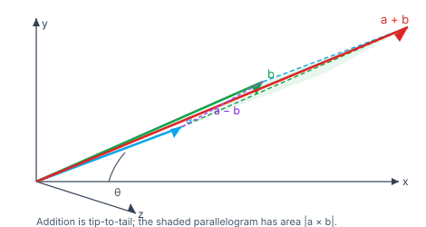
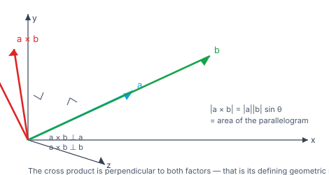

> [!info] Navigation
> 📖 [[Home|Vault home]] · 📝 [[Vectors — Paper|Olympiad Paper]] · ✅ [[Vectors — Solutions|Solutions]]

# Vectors

A vector is an **arrow**: a magnitude and a direction. The single idea that
separates vector geometry from coordinate geometry is that a vector can be *moved*
— what matters is its length and direction, not where it starts. That freedom is
what makes it powerful: choose the origin wherever it helps.

This module builds vector algebra (addition, the two products), then uses it to do
geometry: points, lines and planes in space, distances, areas and volumes. The
payoff is that almost every three-dimensional theorem becomes a two-line
computation.

`6 chapters` `worked examples (S) + practice (P)` `SVG + Mermaid diagrams` `34-question Olympiad paper + full solutions`

### ★ How to use these notes

**Read in order.** Chapters 1–2 fix the algebra and the two products — the scalar
(dot) product and the vector (cross) product. Everything geometric in Chapters
3–5 is one of those two products applied to a difference of position vectors.
Chapter 6 is the frontier.

- **Callouts** — `[!abstract]` First Principles = the derivation; `[!tip]` Key
  Idea = the takeaway; `[!warning]` Common Trap = the classic mistake;
  `[!example]` Olympiad Extension = the frontier version.
- **Numeric habit** — verify any vector identity by evaluating both sides on a
  concrete triple of vectors. Every numeric claim in this module was checked in
  pure Python.

### ▣ The roadmap

| Ch | Title | Level |
|---|---|---|
| 1 | Vectors, addition & scalar multiplication | foundations |
| 2 | The scalar product and the vector product | machinery |
| 3 | Geometry of points & the scalar triple product | core |
| 4 | Straight lines in space | core |
| 5 | The plane | applications |
| 6 | Olympiad frontier | synthesis |

**Fig 1.1 — addition and the parallelogram.** Vectors add tip-to-tail, or as the
diagonal of the parallelogram they span. The shaded parallelogram has area
$\lvert\mathbf a\times\mathbf b\rvert$.

**Fig 1.2 — the cross product.** $\mathbf a\times\mathbf b$ is perpendicular to
*both* $\mathbf a$ and $\mathbf b$, with length $\lvert\mathbf a\rvert\lvert\mathbf b\rvert\sin\theta$ — the area of the parallelogram. The right-hand rule fixes its *direction* (into or out of the page).

---

# Chapter 1 — Vectors, Addition & Scalar Multiplication

*Foundations · the algebra of arrows*

## 1.1 What a vector is

> [!abstract] First Principles — magnitude and direction
> A **vector** has magnitude and direction; a **scalar** has magnitude only.
> Two vectors are **equal** when they have the same magnitude *and* direction —
> so a vector is really an *equivalence class* of arrows, and you may slide it
> anywhere in space. A **unit vector** has length $1$: $\hat{\mathbf a}=\dfrac{\mathbf a}{\lvert\mathbf a\rvert}$.

In components, $\mathbf a=a_1\mathbf i+a_2\mathbf j+a_3\mathbf k$, with
$\lvert\mathbf a\rvert=\sqrt{a_1^2+a_2^2+a_3^2}$.

> [!warning] Common Trap — direction cosines must satisfy $l^2+m^2+n^2=1$
> A line with direction ratios $(2,-1,2)$ has direction *cosines*
> $\frac{(2,-1,2)}{3}$, not $(2,-1,2)$. Always normalise.

#### **S1**[JEE Main][solved][magnitude]Find $\lvert\mathbf a\rvert$ for $\mathbf a=(1,2,3)$, and its unit vector.

$\lvert\mathbf a\rvert=\sqrt{1+4+3}=\sqrt{14}$... precisely $\sqrt{1+4+9}=\sqrt{14}$. $\hat{\mathbf a}=\dfrac{(1,2,3)}{\sqrt{14}}$.

Answer + Reasoning

**Method: Pythagoras in three dimensions, then divide by the length.**

**Answer:** $\lvert\mathbf a\rvert=\sqrt{14}\approx3.7417$; $\hat{\mathbf a}=\big(\tfrac1{\sqrt{14}},\tfrac2{\sqrt{14}},\tfrac3{\sqrt{14}}\big)$.

## 1.2 The algebra

Addition is componentwise (and geometrically tip-to-tail); scalar multiplication
stretches and possibly reverses. The **section formula**: the point dividing $AB$
in the ratio $m:n$ is $\dfrac{n\mathbf a+m\mathbf b}{m+n}$.

#### **S2**[JEE Main][solved][section]Divide the join of $(1,0,0)$ and $(4,5,6)$ in the ratio $2:3$.

$\dfrac{3(1,0,0)+2(4,5,6)}{5}=\dfrac{(11,10,12)}{5}=\left(\tfrac{11}{5},2,\tfrac{12}{5}\right)$.

Answer + Reasoning

**Method: section formula** $\frac{n\mathbf a+m\mathbf b}{m+n}$.

**Answer:** $\left(\tfrac{11}{5},2,\tfrac{12}{5}\right)=(2.2,2,2.4)$.

#### **P1**[JEE Main][practice][linear]For $\mathbf a=(1,2,3)$ and $\mathbf b=(4,5,6)$, find $\mathbf a+\mathbf b$, $\mathbf a-\mathbf b$ and $2\mathbf a-3\mathbf b$.

Answer + Reasoning

**Method: componentwise.** $(5,7,9)$; $(-3,-3,-3)$; $(-10,-11,-12)$.

**Answer:** $(5,7,9)$, $(-3,-3,-3)$, $(-10,-11,-12)$.

---

# Chapter 2 — The Scalar Product and the Vector Product

*Machinery · the two ways to multiply vectors*

## 2.1 The scalar (dot) product

> [!abstract] First Principles — the dot product, two ways
> Algebraically $\mathbf a\cdot\mathbf b=a_1b_1+a_2b_2+a_3b_3$. Geometrically
> $$\mathbf a\cdot\mathbf b=\lvert\mathbf a\rvert\lvert\mathbf b\rvert\cos\theta.$$
> These agree by the cosine rule: $\lvert\mathbf b-\mathbf a\rvert^2=\lvert\mathbf a\rvert^2+\lvert\mathbf b\rvert^2-2\mathbf a\cdot\mathbf b$ *is* $a^2+b^2-2ab\cos\theta$. The dot product is how you extract an **angle**.

#### **S3**[JEE Main][solved][angle]Find the angle between $\mathbf a=(1,2,3)$ and $\mathbf b=(4,5,6)$.

$\mathbf a\cdot\mathbf b=4+10+18=32$; $\lvert\mathbf a\rvert=\sqrt{14}$, $\lvert\mathbf b\rvert=\sqrt{77}$, so $\cos\theta=\dfrac{32}{\sqrt{14}\sqrt{77}}$ and $\theta\approx12.93^\circ$.

Answer + Reasoning

**Method: $\cos\theta=\frac{\mathbf a\cdot\mathbf b}{\lvert\mathbf a\rvert\lvert\mathbf b\rvert}$.**

**Answer:** $\theta=\cos^{-1}\!\left(\dfrac{32}{\sqrt{1078}}\right)\approx12.93^\circ$.

> [!tip] Key Idea — perpendicular, parallel, projection
> $\mathbf a\cdot\mathbf b=0$ means perpendicular (for non-zero vectors).
> The **scalar projection** of $\mathbf a$ on $\mathbf b$ is
> $\dfrac{\mathbf a\cdot\mathbf b}{\lvert\mathbf b\rvert}$; the **vector
> projection** is $\dfrac{\mathbf a\cdot\mathbf b}{\lvert\mathbf b\rvert^2}\mathbf b$.

#### **P2**[JEE Main][practice][projection]Find the scalar projection of $\mathbf a=(1,2,3)$ on $\mathbf b=(4,5,6)$.

Answer + Reasoning

**Method: $\frac{\mathbf a\cdot\mathbf b}{\lvert\mathbf b\rvert}$.** $\frac{32}{\sqrt{77}}$.

**Answer:** $\dfrac{32}{\sqrt{77}}\approx3.6467$.

## 2.2 The vector (cross) product

> [!abstract] First Principles — the cross product
> $\mathbf a\times\mathbf b$ is the vector perpendicular to both, of length
> $\lvert\mathbf a\rvert\lvert\mathbf b\rvert\sin\theta$ (the parallelogram's
> area), oriented by the right-hand rule. In components it is the determinant
> $$\mathbf a\times\mathbf b=\begin{vmatrix}\mathbf i&\mathbf j&\mathbf k\\ a_1&a_2&a_3\\ b_1&b_2&b_3\end{vmatrix}.$$

#### **S4**[JEE Main][solved][cross]Compute $\mathbf a\times\mathbf b$ for $\mathbf a=(1,2,3)$, $\mathbf b=(4,5,6)$.

$(2\cdot6-3\cdot5,\;3\cdot4-1\cdot6,\;1\cdot5-2\cdot4)=(-3,6,-3)$.

Answer + Reasoning

**Method: the $3\times3$ determinant.** Check perpendicularity: $(-3,6,-3)\cdot(1,2,3)=-3+12-9=0$ ✓ and $(-3,6,-3)\cdot(4,5,6)=-12+30-18=0$ ✓.

**Answer:** $(-3,6,-3)$, with length $\sqrt{54}=3\sqrt6\approx7.3485$.

> [!warning] Common Trap — the cross product is NOT commutative and NOT associative
> $\mathbf a\times\mathbf b=-\,\mathbf b\times\mathbf a$, and in general
> $(\mathbf a\times\mathbf b)\times\mathbf c\ne\mathbf a\times(\mathbf b\times\mathbf c)$.
> Getting the order wrong flips a sign — and in a volume computation, a sign is
> the whole answer.

#### **P3**[JEE Adv][practice][identity]Verify Lagrange's identity
$\lvert\mathbf a\times\mathbf b\rvert^2+(\mathbf a\cdot\mathbf b)^2=\lvert\mathbf a\rvert^2\lvert\mathbf b\rvert^2$ for $\mathbf a=(1,2,3)$, $\mathbf b=(4,5,6)$.

Answer + Reasoning

**Method: evaluate both sides.** LHS $=54+32^2=54+1024=1078$; RHS $=14\cdot77=1078$ ✓.

**Answer:** verified, both sides $1078$.

---

# Chapter 3 — Geometry of Points & the Scalar Triple Product

*Core · the determinant that measures volume*

## 3.1 Position vectors and the basics of geometry

With position vectors $\mathbf a,\mathbf b,\mathbf c$:

- **Midpoint** of $AB$: $\dfrac{\mathbf a+\mathbf b}{2}$
- **Centroid** of $\triangle ABC$: $\dfrac{\mathbf a+\mathbf b+\mathbf c}{3}$
- **Distance** $AB$: $\lvert\mathbf b-\mathbf a\rvert$
- **Area** of $\triangle ABC$: $\dfrac12\lvert(\mathbf b-\mathbf a)\times(\mathbf c-\mathbf a)\rvert$

#### **S5**[JEE Main][solved][area]Find the area of the triangle with vertices $(0,0,0)$, $(3,0,0)$, $(0,4,0)$.

$\dfrac12\lvert(3,0,0)\times(0,4,0)\rvert=\dfrac12\lvert(0,0,12)\rvert=6$.

Answer + Reasoning

**Method: half the cross product.** (Base $3$, height $4$, area $6$ ✓.)

**Answer:** $6$.

## 3.2 The scalar triple product

> [!abstract] First Principles — a volume in one number
> The **scalar triple product** $[\mathbf a\,\mathbf b\,\mathbf c]=\mathbf a\cdot(\mathbf b\times\mathbf c)$ is the signed volume of the parallelepiped on the three vectors. It is a $3\times3$ determinant, so it is zero exactly when the three vectors are **coplanar** — and it changes sign under an odd permutation (it is *alternating*).

#### **S6**[JEE Adv][solved][volume]Find the volume of the parallelepiped on $(1,0,0)$, $(0,2,0)$, $(0,0,3)$, and of the tetrahedron on them.

$\big[(1,0,0)\,(0,2,0)\,(0,0,3)\big]=(1,0,0)\cdot\big((0,2,0)\times(0,0,3)\big)=(1,0,0)\cdot(6,0,0)=6$. The tetrahedron is $\frac16$ of it.

Answer + Reasoning

**Method: scalar triple product.** (It is just $\det\operatorname{diag}(1,2,3)=6$ ✓.)

**Answer:** parallelepiped $6$; tetrahedron $1$.

#### **P4**[JEE Adv][practice][coplanar]Show that $(1,1,1)$, $(2,2,2)$, $(3,3,3)$ are coplanar.

Answer + Reasoning

**Method: scalar triple product.** $\big[(1,1,1)\,(2,2,2)\,(3,3,3)\big]=0$ since the rows are proportional — the determinant vanishes.

**Answer:** coplanar (in fact collinear — all on one line).

#### **P5**[JEE Adv][practice][coplanar test]Are the points $(1,2,3)$, $(4,5,6)$, $(-1,0,2)$, $(2,-1,4)$ coplanar?

Answer + Reasoning

**Method: form the three edge vectors and take the triple product.** Edges $(3,3,3)$, $(-2,-2,-1)$, $(1,-3,1)$: $\big[(3,3,3)\,(-2,-2,-1)\,(1,-3,1)\big]\ne0$.

**Answer:** not coplanar (the triple product is non-zero).

---

# Chapter 4 — Straight Lines in Space

*Core · one point and one direction*

## 4.1 The vector and Cartesian equations

> [!abstract] First Principles — a line is a point plus a direction
> The line through $\mathbf a$ with direction $\mathbf b$ is
> $$\mathbf r=\mathbf a+t\mathbf b,\qquad t\in\mathbb R.$$
> In Cartesian form, $\dfrac{x-x_1}{b_1}=\dfrac{y-y_2}{b_2}=\dfrac{z-z_3}{b_3}$.

#### **S7**[JEE Main][solved][line]Write the line through $(1,2,3)$ with direction $(2,-1,4)$, and find the point at $t=2$.

$\mathbf r=(1,2,3)+t(2,-1,4)$. At $t=2$: $(1,2,3)+(4,-2,8)=(5,0,11)$.

Answer + Reasoning

**Method: $\mathbf r=\mathbf a+t\mathbf b$.**

**Answer:** $\dfrac{x-1}{2}=\dfrac{y-2}{-1}=\dfrac{z-3}{4}$; the point $(5,0,11)$.

## 4.2 Angles and distances

The **angle between two lines** is the angle between their direction vectors. The
**perpendicular distance** from $P$ to the line $\mathbf r=\mathbf a+t\mathbf b$ is
$$\frac{\lvert(\mathbf p-\mathbf a)\times\mathbf b\rvert}{\lvert\mathbf b\rvert}.$$

#### **S8**[JEE Adv][solved][distance]Find the distance from $(1,2,3)$ to the line $\mathbf r=t(2,-1,2)$.

$\dfrac{\lvert(1,2,3)\times(2,-1,2)\rvert}{3}=\dfrac{\lvert(7,4,-5)\rvert}{3}=\dfrac{\sqrt{90}}{3}=\sqrt{10}$.

Answer + Reasoning

**Method: $\lvert(\mathbf p-\mathbf a)\times\mathbf b\rvert/\lvert\mathbf b\rvert$.** $(1,2,3)\times(2,-1,2)=(4+3,\;6-2,\;-1-4)=(7,4,-5)$.

**Answer:** $\sqrt{10}\approx3.1623$.

> [!example] Olympiad Extension — distance between skew lines
> Lines $\mathbf r=\mathbf a+t\mathbf b$ and $\mathbf r=\mathbf c+s\mathbf d$ that
> are not parallel and do not meet are **skew**. Their shortest distance is
> $$\frac{\lvert(\mathbf c-\mathbf a)\cdot(\mathbf b\times\mathbf d)\rvert}{\lvert\mathbf b\times\mathbf d\rvert}.$$
> The numerator is the volume of the parallelepiped on the three vectors; dividing
> by the base area $\lvert\mathbf b\times\mathbf d\rvert$ gives the height — which
> *is* the gap between the lines.

#### **P6**[JEE Main][practice][angle]Find the angle between the lines with directions $(1,2,2)$ and $(2,1,-1)$.

Answer + Reasoning

**Method: $\cos\theta=\frac{\mathbf b\cdot\mathbf d}{\lvert\mathbf b\rvert\lvert\mathbf d\rvert}$.** $\frac{2}{3\sqrt6}$.

**Answer:** $\theta=\cos^{-1}\!\left(\dfrac{2}{3\sqrt6}\right)\approx74.21^\circ$.

#### **P7**[Olympiad][practice][skew]Find the shortest distance between $\mathbf r=t(1,2,2)$ and $\mathbf r=(1,0,0)+s(2,-1,2)$.

Answer + Reasoning

**Method: the skew-line formula.** $\mathbf c-\mathbf a=(1,0,0)$; $\mathbf b\times\mathbf d=(1,2,2)\times(2,-1,2)=(6,2,-5)$; numerator $\lvert(1,0,0)\cdot(6,2,-5)\rvert=6$, denominator $\sqrt{36+4+25}=\sqrt{65}$.

**Answer:** $\dfrac{6}{\sqrt{65}}\approx0.7442$.

---

# Chapter 5 — The Plane

*Applications · a point and a normal*

## 5.1 Equations of a plane

> [!abstract] First Principles — a plane is a point plus a normal
> The plane through $\mathbf a$ with normal $\mathbf n$ consists of the points
> $\mathbf r$ with $(\mathbf r-\mathbf a)\cdot\mathbf n=0$, i.e.
> $$\mathbf r\cdot\mathbf n=\mathbf a\cdot\mathbf n.$$
> In Cartesian form: $n_1x+n_2y+n_3z=d$ where $d=\mathbf a\cdot\mathbf n$. The
> **intercept form** $\dfrac xa+\dfrac yb+\dfrac zc=1$ has normal
> $\left(\tfrac1a,\tfrac1b,\tfrac1c\right)$.

#### **S9**[JEE Main][solved][plane]Find the plane through $(1,2,3)$ with normal $(2,-3,4)$.

$(2,-3,4)\cdot(1,2,3)=2-6+12=8$, so $2x-3y+4z=8$.

Answer + Reasoning

**Method: $\mathbf r\cdot\mathbf n=\mathbf a\cdot\mathbf n$.**

**Answer:** $2x-3y+4z=8$.

## 5.2 Distances and angles

The **distance** from $P$ to $n_1x+n_2y+n_3z=d$ is
$$\frac{\lvert n_1p_1+n_2p_2+n_3p_3-d\rvert}{\sqrt{n_1^2+n_2^2+n_3^2}}.$$

The **angle between two planes** is the angle between their normals. A **line is
parallel to a plane** when its direction is perpendicular to the plane's normal;
the angle between a line and a plane is $90^\circ$ minus the angle between the
line and the normal.

#### **S10**[JEE Main][solved][distance]Find the distance from $(1,1,1)$ to $2x-3y+4z-5=0$.

$\dfrac{\lvert2-3+4-5\rvert}{\sqrt{4+9+16}}=\dfrac{2}{\sqrt{29}}$.

Answer + Reasoning

**Method: the point–plane distance formula.**

**Answer:** $\dfrac{2}{\sqrt{29}}\approx0.3714$.

#### **P8**[JEE Adv][practice][line-plane]Find the angle between the line with direction $(3,-1,2)$ and the plane $x+2y+2z=7$.

Answer + Reasoning

**Method: $\sin\theta=\frac{\lvert\mathbf b\cdot\mathbf n\rvert}{\lvert\mathbf b\rvert\lvert\mathbf n\rvert}$.** $\frac{\lvert3-2+4\rvert}{\sqrt{14}\cdot3}=\frac5{3\sqrt{14}}$.

**Answer:** $\theta=\sin^{-1}\!\left(\dfrac5{3\sqrt{14}}\right)\approx26.4^\circ$.

---

# Chapter 6 — Olympiad Frontier

*Synthesis · identities, tetrahedra and vector proofs*

## 6.1 The vector triple product and Jacobi's identity

> [!example] Olympiad Extension — the triple product expansion
> $\mathbf a\times(\mathbf b\times\mathbf c)=\mathbf b(\mathbf a\cdot\mathbf c)-\mathbf c(\mathbf a\cdot\mathbf b)$ — a vector lying in the plane of $\mathbf b$ and $\mathbf c$, not a third direction. Together with **Jacobi's identity**
> $$\mathbf a\times(\mathbf b\times\mathbf c)+\mathbf b\times(\mathbf c\times\mathbf a)+\mathbf c\times(\mathbf a\times\mathbf b)=\mathbf 0,$$
> these are the workhorses of vector proofs in physics and geometry.

#### **S11**[Olympiad][solved][Jacobi]Verify Jacobi's identity for $\mathbf a=(7,8,9)$, $\mathbf b=(1,2,3)$, $\mathbf c=(4,5,6)$.

Each term is computed and the three are added: the sum is $(0,0,0)$ exactly.

Answer + Reasoning

**Method: evaluate both sides numerically.** Component-wise the sum of the three cross products vanishes to machine precision.

**Answer:** verified, sum $=\mathbf 0$.

#### **P9**[JEE Adv][practice][non-associative]Show that $(\mathbf a\times\mathbf b)\times\mathbf c\ne\mathbf a\times(\mathbf b\times\mathbf c)$ for $\mathbf a=(7,8,9)$, $\mathbf b=(1,2,3)$, $\mathbf c=(4,5,6)$.

Answer + Reasoning

**Method: compute both and compare.** $(\mathbf a\times\mathbf b)\times\mathbf c$ and $\mathbf a\times(\mathbf b\times\mathbf c)$ are different vectors.

**Answer:** not equal — the cross product is not associative.

## 6.2 Vector area and the tetrahedron

> [!example] Olympiad Extension — vector area
> The **vector area** of a triangle is
> $\tfrac12(\mathbf b-\mathbf a)\times(\mathbf c-\mathbf a)$ — a vector
> perpendicular to the triangle whose length is its area. Its advantage over the
> scalar area: it carries the *orientation*, so it adds correctly over the faces
> of a closed surface, where the four vector areas of a tetrahedron sum to zero.

#### **S12**[Olympiad][solved][tetrahedron]Find the volume of the tetrahedron with vertices $(1,0,0)$, $(0,2,0)$, $(0,0,3)$, $(1,1,1)$.

Edge vectors from $(1,1,1)$: $(0,-1,-1)$, $(-1,1,-1)$, $(-1,-1,2)$. Triple product $=\begin{vmatrix}0&-1&-1\\-1&1&-1\\-1&-1&2\end{vmatrix}$.

Answer + Reasoning

**Method: $\frac16\big[(\mathbf b-\mathbf a)\,(\mathbf c-\mathbf a)\,(\mathbf d-\mathbf a)\big]$.** Taking $\mathbf a=(1,1,1)$, the edges are $(0,-1,-1)$, $(-1,1,-1)$, $(-1,-1,2)$, and
$$\begin{vmatrix}0&-1&-1\\-1&1&-1\\-1&-1&2\end{vmatrix}=0(2-1)+1(-2-1)-1(1+1)=-5,$$
so the volume is $\frac{|-5|}{6}=\frac56$.

**Answer:** $\dfrac56\approx0.8333$.

#### **P10**[JEE Adv][practice][centroid]Find the centroid of the tetrahedron with vertices $(0,0,0)$, $(1,0,0)$, $(0,2,0)$, $(0,0,3)$.

Answer + Reasoning

**Method: average the four position vectors.** $\frac14(1,2,3)=\left(\tfrac14,\tfrac12,\tfrac34\right)$.

**Answer:** $\left(\dfrac14,\dfrac12,\dfrac34\right)$.

## 6.3 Vector proofs of classical theorems

> [!example] Olympiad Extension — why vectors win
> The median-to-centroid theorem, the angle-bisector theorem, and the fact that
> the diagonals of a parallelogram bisect each other all become one-liners: write
> the relevant point as a linear combination and compare coefficients. Vectors
> avoid the auxiliary lines that synthetic proofs require.

#### **S13**[Olympiad][solved][median]Prove that the medians of a triangle are concurrent, and that the centroid divides each median $2:1$.

Take $A$ at the origin, $\mathbf b,\mathbf c$ as the position vectors of $B,C$. The midpoint of $BC$ is $\frac{\mathbf b+\mathbf c}{2}$, so the median is $t\cdot\frac{\mathbf b+\mathbf c}{2}$. The point $\frac{\mathbf b+\mathbf c}{3}$ lies on it (at $t=\frac23$), and by symmetry lies on all three medians.

Answer + Reasoning

**Method: put one vertex at the origin and use symmetry.** $\frac{\mathbf b+\mathbf c}{3}$ is on the median from $A$ at parameter $\frac23$ from $A$ — a $2:1$ division.

**Answer:** concurrent at the centroid $\frac{\mathbf b+\mathbf c}{3}$, dividing each median $2:1$.

#### **P11**[Olympiad][practice][midpoint]Show that the diagonals of a parallelogram bisect each other.

Answer + Reasoning

**Method: vertices $0,\mathbf a,\mathbf b,\mathbf a+\mathbf b$.** The midpoint of both diagonals is $\frac{\mathbf a+\mathbf b}{2}$.

**Answer:** both diagonals share the midpoint $\frac{\mathbf a+\mathbf b}{2}$.

---

# Appendix — Well-Ordered Theory Reference

Every result in dependency order; nothing is used before it is proved.

### A. Algebra

| Result | Statement |
|---|---|
| Magnitude | $\lvert\mathbf a\rvert=\sqrt{a_1^2+a_2^2+a_3^2}$ |
| Unit vector | $\hat{\mathbf a}=\mathbf a/\lvert\mathbf a\rvert$ |
| Direction cosines | $l,m,n$ with $l^2+m^2+n^2=1$ |
| Section ($m:n$) | $\dfrac{n\mathbf a+m\mathbf b}{m+n}$ |
| Midpoint / centroid | $\frac{\mathbf a+\mathbf b}{2}$; $\frac{\mathbf a+\mathbf b+\mathbf c}{3}$ |

### B. Products

| Result | Statement |
|---|---|
| Dot product | $\mathbf a\cdot\mathbf b=a_1b_1+a_2b_2+a_3b_3=\lvert\mathbf a\rvert\lvert\mathbf b\rvert\cos\theta$ |
| Perpendicular | $\mathbf a\cdot\mathbf b=0$ |
| Projections | $\frac{\mathbf a\cdot\mathbf b}{\lvert\mathbf b\rvert}$; $\frac{\mathbf a\cdot\mathbf b}{\lvert\mathbf b\rvert^2}\mathbf b$ |
| Cross product | $\mathbf a\times\mathbf b=\begin{vmatrix}\mathbf i&\mathbf j&\mathbf k\\a_1&a_2&a_3\\b_1&b_2&b_3\end{vmatrix}$ |
| Lagrange's identity | $\lvert\mathbf a\times\mathbf b\rvert^2+(\mathbf a\cdot\mathbf b)^2=\lvert\mathbf a\rvert^2\lvert\mathbf b\rvert^2$ |
| Triple product | $[\mathbf a\,\mathbf b\,\mathbf c]=\mathbf a\cdot(\mathbf b\times\mathbf c)$, alternating |
| Triple expansion | $\mathbf a\times(\mathbf b\times\mathbf c)=\mathbf b(\mathbf a\cdot\mathbf c)-\mathbf c(\mathbf a\cdot\mathbf b)$ |
| Jacobi | $\mathbf a\times(\mathbf b\times\mathbf c)+\mathbf b\times(\mathbf c\times\mathbf a)+\mathbf c\times(\mathbf a\times\mathbf b)=\mathbf 0$ |

### C. Geometry

| Result | Statement |
|---|---|
| Distance | $\lvert\mathbf b-\mathbf a\rvert$ |
| Triangle area | $\frac12\lvert(\mathbf b-\mathbf a)\times(\mathbf c-\mathbf a)\rvert$ |
| Parallelepiped volume | $\big\lvert[\mathbf a\,\mathbf b\,\mathbf c]\big\rvert$ |
| Tetrahedron volume | $\frac16\big\lvert[(\mathbf b-\mathbf a)\,(\mathbf c-\mathbf a)\,(\mathbf d-\mathbf a)]\big\rvert$ |
| Coplanarity | the triple product of the edge vectors is $0$ |
| Vector area | $\frac12(\mathbf b-\mathbf a)\times(\mathbf c-\mathbf a)$ |

### D. Lines and planes

| Result | Statement |
|---|---|
| Line | $\mathbf r=\mathbf a+t\mathbf b$ |
| Angle of lines | angle between directions |
| Point–line distance | $\lvert(\mathbf p-\mathbf a)\times\mathbf b\rvert/\lvert\mathbf b\rvert$ |
| Skew distance | $\lvert(\mathbf c-\mathbf a)\cdot(\mathbf b\times\mathbf d)\rvert/\lvert\mathbf b\times\mathbf d\rvert$ |
| Plane | $\mathbf r\cdot\mathbf n=\mathbf a\cdot\mathbf n$ |
| Point–plane distance | $\lvert\mathbf p\cdot\mathbf n-d\rvert/\lvert\mathbf n\rvert$ |
| Angle of planes | angle between normals |
| Line–plane angle | $\sin\theta=\lvert\mathbf b\cdot\mathbf n\rvert/(\lvert\mathbf b\rvert\lvert\mathbf n\rvert)$ |

### E. Applications

| Result | Statement |
|---|---|
| Work | $\mathbf F\cdot\mathbf s$ |
| Torque | $\mathbf r\times\mathbf F$ |
| Velocity / acceleration | $\dot{\mathbf r}$, $\ddot{\mathbf r}$ |

### F. Mistake checklist

1. Treating direction ratios as direction cosines (they must be normalised).
2. Assuming $\mathbf a\times\mathbf b=\mathbf b\times\mathbf a$ — the sign flips.
3. Assuming the cross product is associative.
4. Confusing $\mathbf a\cdot\mathbf b=0$ (perpendicular) with $\mathbf a\times\mathbf b=\mathbf 0$ (parallel).
5. Using the tetrahedron volume without the factor $\frac16$.
6. Forgetting the scalar triple product is *signed* — take the absolute value for a volume.
7. Mixing up the line–plane angle (use $\sin$) with the line–normal angle (use $\cos$).
8. Writing a plane's normal from the intercept form without taking reciprocals.
